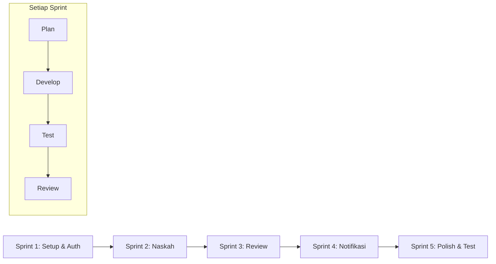
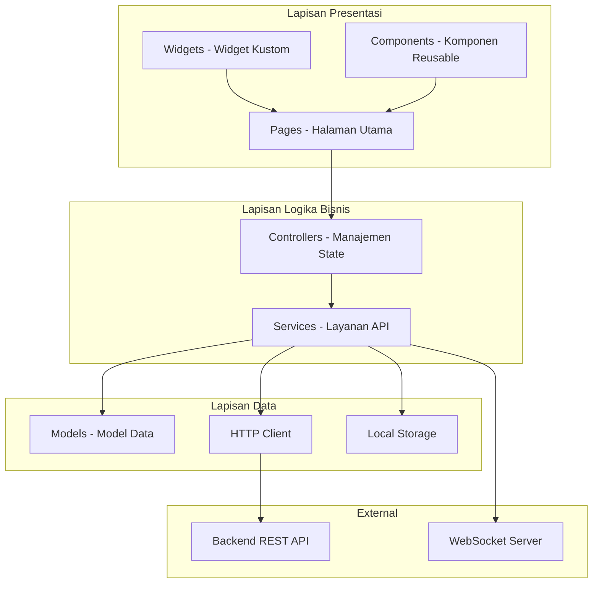
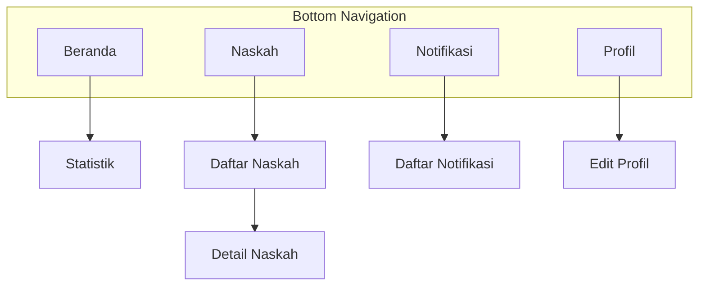

# METODE PENELITIAN

Penelitian ini menggunakan metodologi pengembangan perangkat lunak model iteratif dengan pendekatan agile. Model iteratif dipilih karena pengembangan aplikasi mobile memerlukan respons cepat terhadap perubahan kebutuhan dan umpan balik pengguna [8]. Proses pengembangan dibagi menjadi beberapa sprint dengan masing-masing sprint menghasilkan increment yang dapat diuji dan dievaluasi.

## 2.1 Tahapan Pengembangan

Tahapan pengembangan aplikasi mobile Publishify ditunjukkan pada Gambar 1.



**Gambar 1.** Tahapan Pengembangan Iteratif

### 2.1.1 Sprint 1: Setup dan Autentikasi

Sprint pertama berfokus pada setup proyek Flutter, konfigurasi environment, dan implementasi modul autentikasi. Ini mencakup integrasi dengan backend API untuk login, logout, dan manajemen token JWT [9].

### 2.1.2 Sprint 2: Modul Naskah

Sprint kedua mengimplementasikan fitur-fitur manajemen naskah untuk penulis, termasuk daftar naskah, detail naskah, dan pelacakan status.

### 2.1.3 Sprint 3: Modul Review

Sprint ketiga mengimplementasikan fitur review untuk editor, termasuk antrian review, pengambilan tugas, dan pemberian feedback.

### 2.1.4 Sprint 4: Notifikasi Real-time

Sprint keempat mengimplementasikan sistem notifikasi menggunakan WebSocket untuk update real-time.

### 2.1.5 Sprint 5: Polish dan Pengujian

Sprint kelima berfokus pada penyempurnaan UI/UX, optimasi performa, dan pengujian komprehensif.

## 2.2 Analisis Kebutuhan Mobile

Analisis kebutuhan dilakukan dengan mempertimbangkan keterbatasan dan karakteristik platform mobile. Tabel 1 merangkum kebutuhan fungsional aplikasi per peran pengguna.

**Tabel 1.** Kebutuhan Fungsional Aplikasi Mobile

| Peran   | Kebutuhan Fungsional                       | Prioritas |
| ------- | ------------------------------------------ | --------- |
| Penulis | Login/logout dengan kredensial             | Tinggi    |
| Penulis | Melihat daftar naskah dengan filter status | Tinggi    |
| Penulis | Melihat detail dan status naskah           | Tinggi    |
| Penulis | Menerima notifikasi perubahan status       | Tinggi    |
| Penulis | Melihat feedback dari editor               | Sedang    |
| Editor  | Melihat antrian naskah untuk review        | Tinggi    |
| Editor  | Mengambil tugas review                     | Tinggi    |
| Editor  | Memberikan feedback dan rekomendasi        | Tinggi    |
| Editor  | Menerima notifikasi tugas baru             | Tinggi    |
| Admin   | Melihat statistik sistem                   | Sedang    |
| Admin   | Melihat daftar pengguna                    | Sedang    |

Kebutuhan non-fungsional meliputi: (1) waktu muat aplikasi maksimal 3 detik, (2) ukuran aplikasi maksimal 50 MB, (3) kompatibilitas dengan Android 5.0 ke atas, (4) penggunaan data yang efisien untuk kondisi jaringan terbatas [10].

## 2.3 Perancangan Arsitektur

### 2.3.1 Arsitektur Aplikasi

Aplikasi dirancang menggunakan arsitektur berlapis yang memisahkan tanggung jawab antara UI, logika bisnis, dan akses data. Gambar 2 menunjukkan arsitektur keseluruhan.



**Gambar 2.** Arsitektur Lapisan Aplikasi Mobile

### 2.3.2 Struktur Direktori

Struktur direktori proyek Flutter mengikuti pemisahan berdasarkan fitur dan tanggung jawab:

```
lib/
├── main.dart                # Entry point
├── components/              # Komponen UI reusable
├── config/                  # Konfigurasi (API, tema)
├── controllers/             # State management
├── models/                  # Model data
│   ├── general/            # Model umum
│   ├── writer/             # Model penulis
│   ├── editor/             # Model editor
│   └── percetakan/         # Model percetakan
├── pages/                   # Halaman per peran
│   ├── auth/               # Autentikasi
│   ├── writer/             # Halaman penulis
│   ├── editor/             # Halaman editor
│   └── admin/              # Halaman admin
├── routes/                  # Konfigurasi routing
├── services/                # Layanan HTTP dan bisnis
├── utils/                   # Utilitas
└── widgets/                 # Widget kustom
```

### 2.3.3 Integrasi dengan Backend

Aplikasi berkomunikasi dengan backend Publishify melalui REST API dan WebSocket. Endpoint API dikonfigurasi melalui file environment untuk memudahkan pergantian antara environment development dan production [11].

**Tabel 2.** Konfigurasi Endpoint API

| Kategori   | Endpoint                 | Metode | Fungsi               |
| ---------- | ------------------------ | ------ | -------------------- |
| Auth       | /api/auth/login          | POST   | Login pengguna       |
| Auth       | /api/auth/logout         | POST   | Logout pengguna      |
| Auth       | /api/auth/me             | GET    | Profil pengguna      |
| Naskah     | /api/naskah              | GET    | Daftar naskah        |
| Naskah     | /api/naskah/:id          | GET    | Detail naskah        |
| Naskah     | /api/naskah/penulis/saya | GET    | Naskah milik penulis |
| Review     | /api/review              | GET    | Daftar review        |
| Review     | /api/review/editor/saya  | GET    | Review tugas editor  |
| Notifikasi | /api/notifikasi          | GET    | Daftar notifikasi    |

## 2.4 Teknologi Pengembangan

Tabel 3 merangkum teknologi dan package Flutter yang digunakan.

**Tabel 3.** Teknologi dan Package Flutter

| Package            | Versi  | Fungsi                        |
| ------------------ | ------ | ----------------------------- |
| flutter            | 3.9+   | Framework UI                  |
| dart               | 3.0+   | Bahasa pemrograman            |
| http               | 1.5.0  | HTTP client untuk REST API    |
| socket_io_client   | 3.0.1  | WebSocket untuk notifikasi    |
| shared_preferences | 2.3.3  | Penyimpanan lokal key-value   |
| flutter_dotenv     | 5.1.0  | Konfigurasi environment       |
| fl_chart           | 0.69.0 | Grafik dan chart              |
| file_picker        | 8.1.4  | Pemilihan file                |
| intl               | 0.20.2 | Internationalisasi dan format |
| logger             | 2.0.2  | Logging untuk debugging       |

## 2.5 Perancangan Antarmuka

### 2.5.1 Prinsip Desain

Perancangan antarmuka mengikuti Material Design 3 dengan penyesuaian untuk identitas brand Publishify. Prinsip desain yang diterapkan meliputi [12]:

- **Konsistensi**: Penggunaan komponen dan pola interaksi yang konsisten
- **Feedback**: Respons visual untuk setiap aksi pengguna
- **Affordance**: Elemen UI yang intuitif dan mudah dipahami
- **Efisiensi**: Minimalisasi langkah untuk menyelesaikan tugas

### 2.5.2 Navigasi

Navigasi aplikasi menggunakan pola bottom navigation bar dengan 4-5 item sesuai rekomendasi Material Design. Gambar 3 menunjukkan struktur navigasi.



**Gambar 3.** Struktur Navigasi Aplikasi

## 2.6 Metode Pengujian

### 2.6.1 Pengujian Fungsional

Pengujian fungsional menggunakan metode black-box testing dengan pendekatan equivalence partitioning. Kasus uji dibuat untuk setiap fitur utama dengan skenario positif dan negatif [13].

### 2.6.2 Pengujian Performa

Pengujian performa dilakukan menggunakan Google PageSpeed Insights untuk mengukur metrik Core Web Vitals pada mode mobile [14]. Metrik yang diukur meliputi:

- **First Contentful Paint (FCP)**: Waktu tampil konten pertama
- **Largest Contentful Paint (LCP)**: Waktu tampil konten terbesar
- **Total Blocking Time (TBT)**: Waktu blocking JavaScript
- **Cumulative Layout Shift (CLS)**: Pergeseran layout

### 2.6.3 Pengujian Kompatibilitas

Pengujian kompatibilitas dilakukan pada berbagai perangkat Android dengan versi OS yang berbeda untuk memastikan aplikasi berjalan dengan baik pada target perangkat [15].

---

**Catatan untuk Artikel:**

Bagian Metode Penelitian ini mencakup sekitar 25% dari keseluruhan artikel dan berisi:

- Metodologi pengembangan iteratif/agile
- Analisis kebutuhan dengan tabel per peran
- Perancangan arsitektur dengan diagram Mermaid
- Struktur direktori proyek Flutter
- Tabel teknologi dan package
- Prinsip desain UI dan navigasi
- Metode pengujian

**Referensi ke File Kode Sumber:**

- Entry point: `mobile/lib/main.dart`
- Konfigurasi: `mobile/lib/config/`
- Environment: `mobile/.env`
- Package: `mobile/pubspec.yaml`
