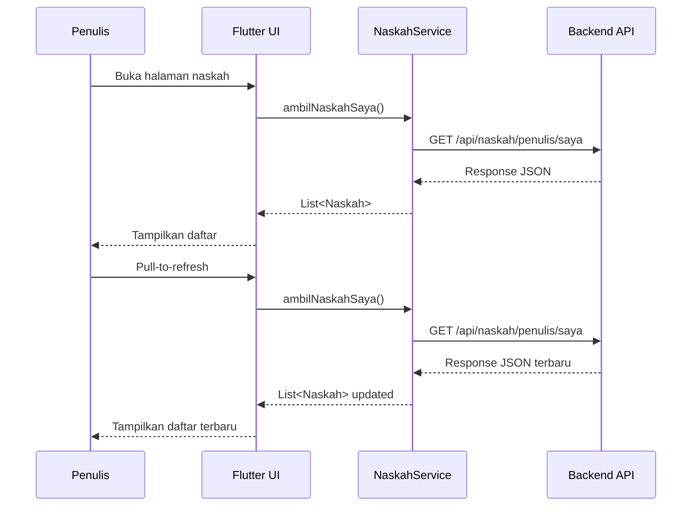
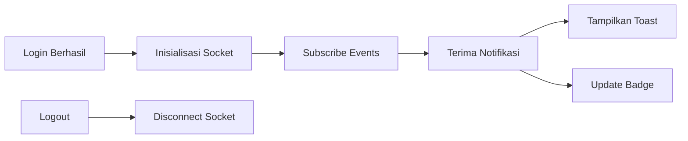
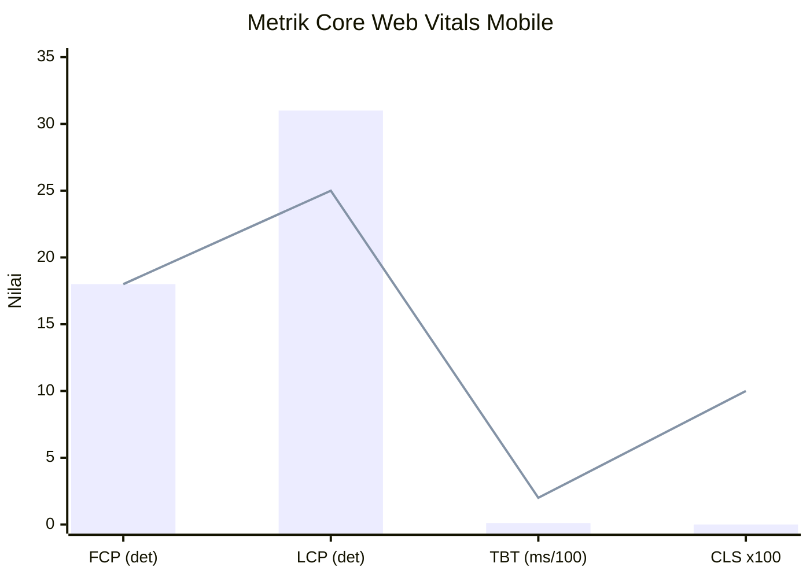
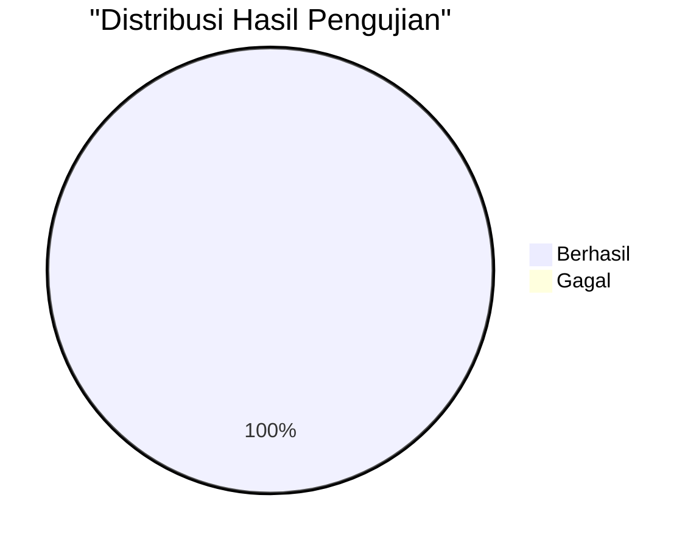

# HASIL DAN PEMBAHASAN

Bagian ini memaparkan hasil implementasi aplikasi mobile Publishify beserta pengujian yang telah dilakukan.

## 3.1 Hasil Implementasi

### 3.1.1 Lingkungan Pengembangan

Pengembangan aplikasi dilakukan dengan spesifikasi lingkungan sebagaimana ditunjukkan pada Tabel 4.

**Tabel 4.** Spesifikasi Lingkungan Pengembangan

| Komponen        | Spesifikasi                                  |
| --------------- | -------------------------------------------- |
| Sistem Operasi  | Windows 11 Pro                               |
| Flutter SDK     | 3.9+                                         |
| Dart SDK        | 3.0+                                         |
| IDE             | Visual Studio Code + Flutter Extension       |
| Android SDK     | API Level 21 (Android 5.0) - 33 (Android 13) |
| Emulator        | Android Emulator (Pixel 6 API 33)            |
| Version Control | Git dengan GitHub                            |

### 3.1.2 Struktur Proyek

Implementasi menghasilkan struktur proyek dengan pembagian yang jelas berdasarkan tanggung jawab. Tabel 5 merangkum komponen utama yang diimplementasikan.

**Tabel 5.** Komponen Implementasi

| Direktori          | Jumlah File | Fungsi                 |
| ------------------ | ----------- | ---------------------- |
| `lib/pages/`       | 25+         | Halaman UI per peran   |
| `lib/services/`    | 8           | Layanan API dan bisnis |
| `lib/models/`      | 12          | Model data             |
| `lib/widgets/`     | 15+         | Widget kustom          |
| `lib/controllers/` | 5           | Manajemen state        |
| `lib/config/`      | 3           | Konfigurasi            |

### 3.1.3 Implementasi Modul Autentikasi

Modul autentikasi mengimplementasikan login dengan email dan password yang terintegrasi dengan backend API. Token JWT disimpan menggunakan SharedPreferences untuk persistensi sesi [16].

```dart
// Pseudocode implementasi login
class AuthService {
  Future<AuthResponse> login(String email, String password) async {
    final response = await httpClient.post('/api/auth/login', {
      'email': email,
      'kataSandi': password,
    });

    if (response.sukses) {
      await storage.write('accessToken', response.data.accessToken);
      await storage.write('refreshToken', response.data.refreshToken);
    }

    return response;
  }
}
```

**[Tempat Screenshot: Halaman login aplikasi mobile]**

> Referensi file: `mobile/lib/pages/auth/`

### 3.1.4 Implementasi Modul Penulis

Modul penulis menyediakan fitur untuk melihat daftar naskah, detail naskah, dan pelacakan status. Implementasi menggunakan widget ListView dengan pull-to-refresh untuk pembaruan data [17].

Gambar 4 menunjukkan sequence diagram proses pengambilan daftar naskah.



**Gambar 4.** Sequence Diagram Pengambilan Daftar Naskah

**[Tempat Screenshot: Halaman daftar naskah penulis]**

> Referensi file: `mobile/lib/pages/writer/naskah/`

### 3.1.5 Implementasi Modul Editor

Modul editor menyediakan fitur untuk melihat antrian review, mengambil tugas, dan memberikan feedback. Editor dapat melihat naskah yang menunggu review dan memilih untuk mengambil tugas.

**Tabel 6.** Fitur Modul Editor

| Fitur              | Deskripsi                           | Status         |
| ------------------ | ----------------------------------- | -------------- |
| Antrian Review     | Daftar naskah menunggu review       | ✓ Implementasi |
| Ambil Tugas        | Mengambil naskah untuk direview     | ✓ Implementasi |
| Detail Review      | Melihat detail naskah yang direview | ✓ Implementasi |
| Form Feedback      | Memberikan feedback per bab/halaman | ✓ Implementasi |
| Submit Rekomendasi | Setujui/Revisi/Tolak                | ✓ Implementasi |

**[Tempat Screenshot: Antarmuka antrian review editor]**

> Referensi file: `mobile/lib/pages/editor/`

### 3.1.6 Implementasi Notifikasi Real-time

Sistem notifikasi menggunakan Socket.io client untuk menerima update real-time dari server. Koneksi WebSocket diinisialisasi setelah login berhasil dan diputus saat logout [18].



**Gambar 5.** Alur Sistem Notifikasi Real-time

**[Tempat Screenshot: Notifikasi toast dan halaman daftar notifikasi]**

> Referensi file: `mobile/lib/services/notifikasi_service.dart`

## 3.2 Hasil Pengujian Fungsional

Pengujian fungsional dilakukan dengan 24 kasus uji yang mencakup seluruh fitur utama. Tabel 7 merangkum hasil pengujian per modul.

**Tabel 7.** Ringkasan Hasil Pengujian Fungsional

| Modul          | Jumlah Kasus | Berhasil | Gagal | Persentase |
| -------------- | ------------ | -------- | ----- | ---------- |
| Autentikasi    | 5            | 5        | 0     | 100%       |
| Naskah         | 5            | 5        | 0     | 100%       |
| Editor         | 5            | 5        | 0     | 100%       |
| Notifikasi     | 4            | 4        | 0     | 100%       |
| Kompatibilitas | 5            | 5        | 0     | 100%       |
| **Total**      | **24**       | **24**   | **0** | **100%**   |

Detail pengujian modul autentikasi disajikan pada Tabel 8.

**Tabel 8.** Detail Pengujian Modul Autentikasi

| ID  | Skenario              | Input                  | Hasil Diharapkan                | Hasil Aktual | Status |
| --- | --------------------- | ---------------------- | ------------------------------- | ------------ | ------ |
| M01 | Login valid           | Email & password valid | Berhasil, navigasi ke dashboard | Sesuai       | ✓      |
| M02 | Login password salah  | Password tidak cocok   | Pesan error ditampilkan         | Sesuai       | ✓      |
| M03 | Login email tidak ada | Email tidak terdaftar  | Pesan error ditampilkan         | Sesuai       | ✓      |
| M04 | Login form kosong     | Field kosong           | Validasi error                  | Sesuai       | ✓      |
| M05 | Logout                | Tap logout             | Sesi berakhir, ke login         | Sesuai       | ✓      |

Detail pengujian modul naskah disajikan pada Tabel 9.

**Tabel 9.** Detail Pengujian Modul Naskah

| ID  | Skenario            | Input               | Hasil Diharapkan         | Hasil Aktual | Status |
| --- | ------------------- | ------------------- | ------------------------ | ------------ | ------ |
| M06 | Lihat daftar naskah | -                   | Daftar ditampilkan       | Sesuai       | ✓      |
| M07 | Filter status       | Status "draft"      | Hanya draft tampil       | Sesuai       | ✓      |
| M08 | Lihat detail        | Tap item            | Detail ditampilkan       | Sesuai       | ✓      |
| M09 | Pull-to-refresh     | Gesture pull        | Data diperbarui          | Sesuai       | ✓      |
| M10 | Lihat status review | Naskah dalam review | Status & feedback tampil | Sesuai       | ✓      |

## 3.3 Hasil Pengujian Performa

Pengujian performa dilakukan menggunakan Google PageSpeed Insights untuk mode mobile. Tabel 10 menyajikan hasil pengujian.

**Tabel 10.** Hasil Pengujian PageSpeed Insights - Mobile

| Metrik                   | Nilai     | Target      | Status |
| ------------------------ | --------- | ----------- | ------ |
| Performance Score        | 88/100    | ≥ 80        | ✓      |
| First Contentful Paint   | 1,8 detik | < 1,8 detik | ✓      |
| Largest Contentful Paint | 3,1 detik | < 2,5 detik | △      |
| Total Blocking Time      | 10 ms     | < 200 ms    | ✓      |
| Cumulative Layout Shift  | 0         | < 0,1       | ✓      |
| Speed Index              | 2,0 detik | < 3,4 detik | ✓      |
| Accessibility            | 96/100    | ≥ 90        | ✓      |

Visualisasi metrik performa ditunjukkan pada Gambar 6.



**Gambar 6.** Perbandingan Metrik Aktual vs Target

**[Tempat Screenshot: Laporan PageSpeed Insights lengkap mode mobile]**

## 3.4 Hasil Pengujian Kompatibilitas

Pengujian kompatibilitas dilakukan pada lima perangkat Android dengan spesifikasi berbeda. Tabel 11 menyajikan hasil pengujian.

**Tabel 11.** Hasil Pengujian Kompatibilitas

| Perangkat            | Versi OS   | Resolusi  | Status | Catatan        |
| -------------------- | ---------- | --------- | ------ | -------------- |
| Samsung Galaxy S21   | Android 13 | 1080x2400 | ✓      | Sempurna       |
| Xiaomi Redmi Note 11 | Android 12 | 1080x2400 | ✓      | Sempurna       |
| Samsung Galaxy A32   | Android 11 | 1080x2400 | ✓      | Sempurna       |
| Oppo A54             | Android 10 | 720x1600  | ✓      | Layout adaptif |
| Emulator Pixel 6     | Android 33 | 1080x2400 | ✓      | Development    |

Hasil pengujian menunjukkan aplikasi berjalan dengan baik pada semua perangkat yang diuji, dengan penyesuaian layout otomatis untuk resolusi yang berbeda.



**Gambar 7.** Diagram Hasil Pengujian

---

**Catatan untuk Artikel:**

Bagian Hasil dan Pembahasan ini mencakup sekitar 45% dari keseluruhan artikel dan berisi:

- Lingkungan pengembangan
- Implementasi per modul dengan diagram sequence
- Hasil pengujian fungsional dengan tabel detail
- Hasil pengujian performa dengan metrik PageSpeed
- Hasil pengujian kompatibilitas

**Referensi ke File Kode Sumber:**

- Halaman penulis: `mobile/lib/pages/writer/`
- Halaman editor: `mobile/lib/pages/editor/`
- Layanan notifikasi: `mobile/lib/services/notifikasi_service.dart`
- Model data: `mobile/lib/models/`

**Tempat Screenshot:**

- Halaman login
- Daftar naskah penulis
- Antrian review editor
- Notifikasi toast dan daftar
- Laporan PageSpeed Insights
