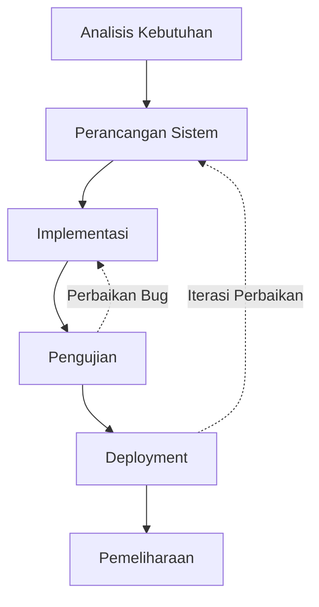
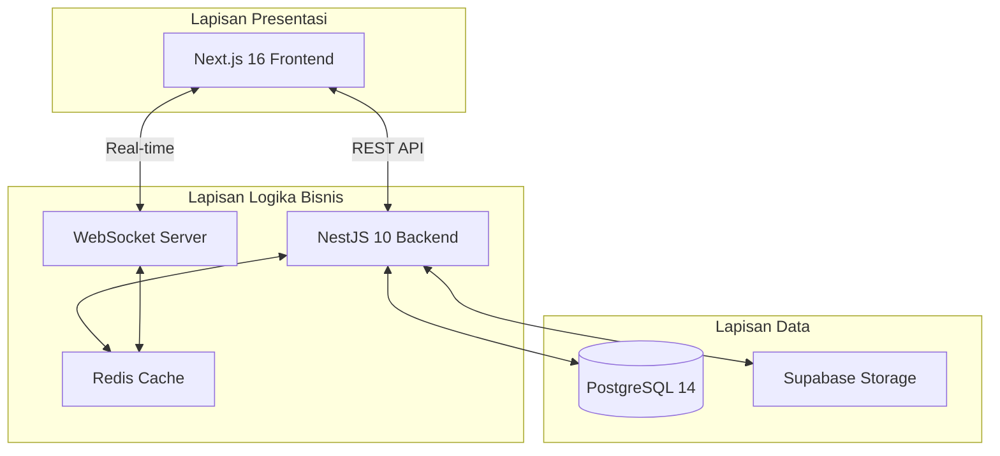
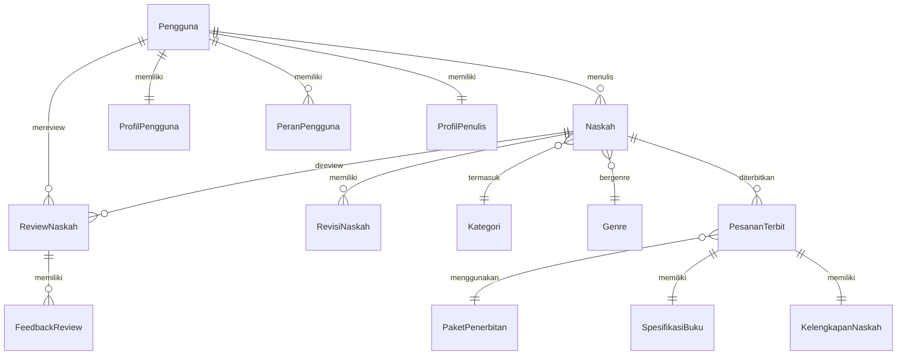
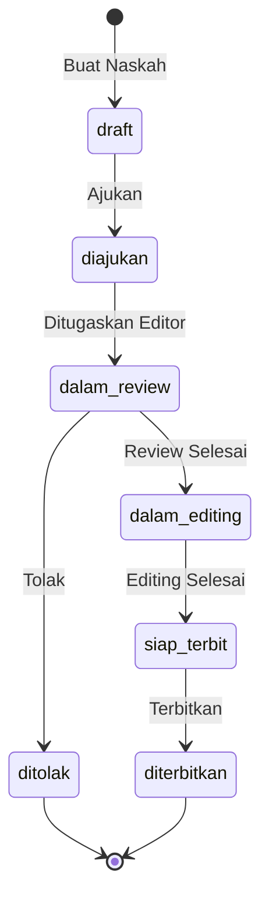

# METODE PENELITIAN

Penelitian ini menggunakan metodologi pengembangan perangkat lunak model waterfall dengan penyempurnaan iteratif. Model waterfall dipilih karena kebutuhan sistem telah terdefinisi dengan jelas sejak awal dan perubahan kebutuhan yang minimal selama proses pengembangan [9]. Tahapan pengembangan meliputi analisis kebutuhan, perancangan sistem, implementasi, pengujian, dan pemeliharaan sebagaimana ditunjukkan pada Gambar 1.

**Gambar 1.** Diagram Alur Metodologi Pengembangan Sistem

## 2.1 Analisis Kebutuhan

Tahap analisis kebutuhan dilakukan melalui studi literatur terhadap proses bisnis penerbitan buku dan wawancara dengan praktisi industri penerbitan. Hasil analisis mengidentifikasi empat aktor utama dalam sistem: penulis, editor, admin, dan operator percetakan. Setiap aktor memiliki kebutuhan fungsional yang berbeda sebagaimana dirangkum dalam Tabel 1.

**Tabel 1.** Kebutuhan Fungsional Per Aktor

| Aktor      | Kebutuhan Fungsional                                                                        |
| ---------- | ------------------------------------------------------------------------------------------- |
| Penulis    | Mengunggah naskah, melacak status, melihat feedback, memilih paket terbit, mengelola profil |
| Editor     | Melihat antrian review, mengambil tugas, memberikan feedback, submit rekomendasi            |
| Admin      | Mengelola pengguna, menugaskan editor, menerbitkan naskah, melihat statistik                |
| Percetakan | Melihat pesanan cetak, memperbarui status produksi, mengelola pengiriman                    |

Kebutuhan non-fungsional sistem meliputi: (1) performa dengan waktu respon maksimal 3 detik untuk setiap operasi, (2) keamanan dengan implementasi autentikasi JWT dan enkripsi data sensitif, (3) skalabilitas untuk mendukung minimal 1.000 pengguna konkuren, dan (4) ketersediaan sistem minimal 99% [10].

## 2.2 Perancangan Sistem

### 2.2.1 Arsitektur Sistem

Sistem dirancang menggunakan arsitektur tiga lapis (three-tier architecture) yang memisahkan lapisan presentasi, logika bisnis, dan data [11]. Arsitektur ini dipilih untuk memudahkan pemeliharaan dan pengembangan di masa depan. Gambar 2 menunjukkan arsitektur keseluruhan sistem.

**Gambar 2.** Arsitektur Sistem Publishify

### 2.2.2 Perancangan Basis Data

Basis data dirancang menggunakan pendekatan Entity-Relationship Diagram (ERD) dengan normalisasi hingga bentuk normal ketiga (3NF) untuk menghindari redundansi data [12]. Skema basis data terdiri dari 24 tabel yang dikelompokkan ke dalam enam domain: manajemen pengguna (4 tabel), manajemen konten (7 tabel), sistem review (2 tabel), sistem notifikasi (1 tabel), autentikasi (3 tabel), dan penerbitan (5 tabel). Gambar 3 menunjukkan ERD inti sistem.

**Gambar 3.** Entity-Relationship Diagram Inti Sistem

### 2.2.3 Perancangan Alur Kerja

Alur kerja penerbitan dirancang berdasarkan praktik standar industri penerbitan dengan penyesuaian untuk digitalisasi. Status naskah mengikuti state machine dengan tujuh state utama sebagaimana ditunjukkan pada Gambar 4.

**Gambar 4.** State Machine Diagram Status Naskah

## 2.3 Teknologi Pengembangan

Tabel 2 merangkum teknologi yang digunakan dalam pengembangan sistem.

**Tabel 2.** Teknologi Pengembangan

| Komponen           | Teknologi      | Versi   | Fungsi                         |
| ------------------ | -------------- | ------- | ------------------------------ |
| Frontend Framework | Next.js        | 16.0.10 | Server-side rendering, routing |
| UI Library         | React          | 19.2.0  | Komponen antarmuka             |
| Styling            | Tailwind CSS   | 4.0     | Utility-first CSS              |
| State Management   | Zustand        | 5.0.8   | Manajemen state global         |
| Data Fetching      | TanStack Query | 5.90.12 | Caching dan sinkronisasi       |
| Backend Framework  | NestJS         | 10+     | REST API, modular architecture |
| ORM                | Prisma         | 5.8+    | Type-safe database access      |
| Database           | PostgreSQL     | 14+     | Relational database            |
| Cache              | Redis          | 7+      | Session dan cache              |
| Real-time          | Socket.io      | 4.6+    | WebSocket communication        |
| Authentication     | JWT + Passport | -       | Token-based auth               |

## 2.4 Metode Pengujian

Pengujian sistem dilakukan menggunakan dua pendekatan utama: pengujian fungsional dan pengujian performa [13].

### 2.4.1 Pengujian Fungsional

Pengujian fungsional menggunakan metode black-box testing dengan teknik equivalence partitioning dan boundary value analysis. Kasus uji dibuat berdasarkan use case yang telah didefinisikan pada tahap analisis kebutuhan. Setiap kasus uji mencakup skenario positif dan negatif untuk memastikan sistem menangani berbagai kondisi input dengan benar [14].

### 2.4.2 Pengujian Performa

Pengujian performa dilakukan menggunakan Google PageSpeed Insights yang mengukur metrik Core Web Vitals meliputi [15]:

- **First Contentful Paint (FCP)**: Waktu hingga konten pertama ditampilkan
- **Largest Contentful Paint (LCP)**: Waktu hingga konten terbesar ditampilkan
- **Total Blocking Time (TBT)**: Total waktu blocking JavaScript
- **Cumulative Layout Shift (CLS)**: Pergeseran layout yang tidak diharapkan
- **Speed Index**: Kecepatan tampilan konten secara visual

---

**Catatan untuk Artikel:**

Bagian Metode Penelitian ini mencakup sekitar 25% dari keseluruhan artikel dan berisi:

- Metodologi pengembangan (Waterfall)
- Analisis kebutuhan dengan tabel kebutuhan fungsional
- Perancangan arsitektur dengan diagram Mermaid
- ERD dan state machine diagram
- Tabel teknologi yang digunakan
- Metode pengujian

**Referensi ke File Kode Sumber:**

- Skema database: `backend/prisma/schema.prisma`
- Konfigurasi backend: `backend/src/app.module.ts`
- Konfigurasi frontend: `frontend/package.json`

**Tempat Screenshot:**

- Gambar arsitektur sistem (dapat menggunakan diagram Mermaid yang sudah ada)
- ERD detail dari tools database atau Prisma Studio
