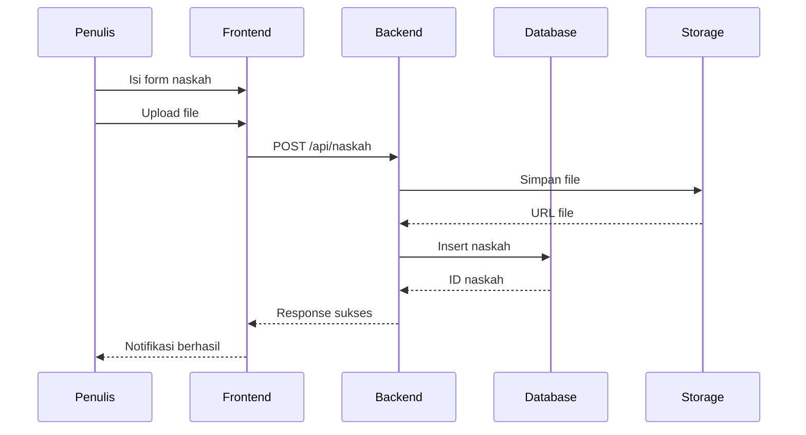
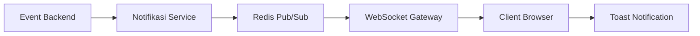

# HASIL DAN PEMBAHASAN

Bagian ini memaparkan hasil implementasi sistem Publishify beserta pengujian yang telah dilakukan. Pembahasan mencakup hasil implementasi per modul, hasil pengujian fungsional, dan hasil pengujian performa.

## 3.1 Hasil Implementasi

Implementasi sistem menghasilkan aplikasi web yang dapat diakses melalui browser dengan dukungan untuk perangkat desktop dan mobile. Sistem telah di-deploy pada server virtual dengan alamat IP 74.225.221.140. Struktur proyek terdiri dari dua bagian utama: frontend (Next.js) dan backend (NestJS) yang berkomunikasi melalui REST API.

### 3.1.1 Implementasi Backend

Backend diimplementasikan menggunakan arsitektur modular NestJS dengan sembilan modul utama: auth, pengguna, naskah, review, penerbitan, kategori, genre, notifikasi, dan upload. Setiap modul mengikuti pola desain controller-service-repository yang memisahkan tanggung jawab penanganan request, logika bisnis, dan akses data [16].

**Tabel 3.** Modul Backend dan Endpoint

| Modul      | Jumlah Endpoint | Fungsi Utama                          |
| ---------- | --------------- | ------------------------------------- |
| Auth       | 8               | Login, register, refresh token, OAuth |
| Pengguna   | 6               | CRUD pengguna, profil, password       |
| Naskah     | 12              | CRUD naskah, status, statistik        |
| Review     | 10              | Antrian, tugas, feedback, rekomendasi |
| Penerbitan | 8               | Paket, pesanan, spesifikasi           |
| Kategori   | 5               | CRUD kategori                         |
| Genre      | 5               | CRUD genre                            |
| Notifikasi | 5               | Daftar, baca, hapus                   |
| Upload     | 3               | Upload file tunggal dan multiple      |

Basis data PostgreSQL diimplementasikan dengan 24 tabel yang dikelola melalui Prisma ORM. Penggunaan Prisma memungkinkan migrasi skema yang terstruktur dan type-safe queries yang mengurangi risiko SQL injection [17]. Sistem menggunakan enum berbahasa Indonesia untuk status dan peran sesuai dengan konteks penggunaan lokal.

**[Tempat Screenshot: Struktur modul backend di VSCode]**

> Referensi file: `backend/src/modules/`

### 3.1.2 Implementasi Frontend

Frontend diimplementasikan menggunakan Next.js 16 dengan App Router yang menyediakan file-based routing dan React Server Components. Antarmuka menggunakan komponen shadcn/ui yang dibangun di atas Radix UI primitives dengan styling Tailwind CSS [18].

Struktur routing menggunakan route groups untuk memisahkan halaman berdasarkan peran pengguna:

- `(auth)` - Halaman login dan registrasi
- `(penulis)` - Dashboard dan fitur penulis
- `(editor)` - Dashboard dan fitur editor
- `(admin)` - Dashboard dan fitur admin
- `(publik)` - Halaman katalog publik

**Tabel 4.** Komponen Frontend Utama

| Komponen       | Lokasi                                 | Fungsi                          |
| -------------- | -------------------------------------- | ------------------------------- |
| Sidebar        | `components/dashboard/sidebar.tsx`     | Navigasi dashboard              |
| KartuNaskah    | `components/naskah/`                   | Tampilan naskah                 |
| FormPenerbitan | `components/penerbitan/`               | Form pesanan terbit             |
| TabelData      | `components/ui/table.tsx`              | Tabel dengan sorting dan filter |
| StatusTracker  | `components/naskah/status-tracker.tsx` | Visualisasi status              |

**[Tempat Screenshot: Halaman dashboard penulis]**

> Referensi file: `frontend/app/(penulis)/penulis/page.tsx`

### 3.1.3 Implementasi Fitur Utama

#### A. Sistem Manajemen Naskah

Sistem manajemen naskah memungkinkan penulis mengunggah, mengedit, dan melacak status naskah. Proses upload naskah mendukung berbagai format file termasuk PDF, DOCX, dan ODT dengan validasi ukuran maksimal 50MB. Gambar 5 menunjukkan alur proses pengajuan naskah.

**Gambar 5.** Sequence Diagram Pengajuan Naskah

#### B. Sistem Review Editorial

Sistem review memungkinkan editor melihat antrian naskah, mengambil tugas, dan memberikan feedback terstruktur. Editor dapat memilih untuk menyetujui, meminta revisi, atau menolak naskah dengan catatan detail. Feedback dapat diberikan per bab dan halaman untuk kemudahan referensi penulis.

**Tabel 5.** Status Review dan Transisi

| Status Awal  | Aksi         | Status Akhir | Aktor  |
| ------------ | ------------ | ------------ | ------ |
| Diajukan     | Tugaskan     | Ditugaskan   | Admin  |
| Ditugaskan   | Mulai Review | Dalam Proses | Editor |
| Dalam Proses | Setujui      | Selesai      | Editor |
| Dalam Proses | Minta Revisi | Selesai      | Editor |
| Dalam Proses | Tolak        | Selesai      | Editor |

**[Tempat Screenshot: Antarmuka review editor dengan form feedback]**

> Referensi file: `frontend/app/(editor)/editor/`

#### C. Sistem Notifikasi Real-time

Sistem notifikasi diimplementasikan menggunakan Socket.io untuk komunikasi WebSocket bidirectional. Setiap perubahan status naskah, feedback baru, atau aktivitas penting lainnya memicu notifikasi kepada pengguna terkait secara real-time tanpa perlu refresh halaman [19].

**Gambar 6.** Arsitektur Sistem Notifikasi Real-time

## 3.2 Hasil Pengujian Fungsional

Pengujian fungsional dilakukan menggunakan metode black-box testing dengan 28 kasus uji yang mencakup seluruh fungsionalitas utama sistem. Tabel 6 merangkum hasil pengujian per modul.

**Tabel 6.** Ringkasan Hasil Pengujian Fungsional

| Modul            | Jumlah Kasus Uji | Berhasil | Gagal | Persentase |
| ---------------- | ---------------- | -------- | ----- | ---------- |
| Autentikasi      | 6                | 6        | 0     | 100%       |
| Manajemen Naskah | 8                | 8        | 0     | 100%       |
| Sistem Review    | 6                | 6        | 0     | 100%       |
| Penerbitan       | 4                | 4        | 0     | 100%       |
| Notifikasi       | 4                | 4        | 0     | 100%       |
| **Total**        | **28**           | **28**   | **0** | **100%**   |

Detail pengujian modul autentikasi disajikan pada Tabel 7.

**Tabel 7.** Detail Pengujian Modul Autentikasi

| ID  | Skenario                    | Input                       | Hasil Diharapkan                        | Hasil Aktual | Status |
| --- | --------------------------- | --------------------------- | --------------------------------------- | ------------ | ------ |
| T01 | Login valid                 | Email & password valid      | Berhasil login, redirect dashboard      | Sesuai       | ✓      |
| T02 | Login password salah        | Email valid, password salah | Pesan error "Password salah"            | Sesuai       | ✓      |
| T03 | Login email tidak terdaftar | Email tidak ada             | Pesan error "Email tidak terdaftar"     | Sesuai       | ✓      |
| T04 | Register pengguna baru      | Data valid                  | Akun terbuat, email verifikasi terkirim | Sesuai       | ✓      |
| T05 | Register email duplikat     | Email sudah ada             | Pesan error "Email sudah terdaftar"     | Sesuai       | ✓      |
| T06 | Logout                      | Klik logout                 | Session berakhir, redirect login        | Sesuai       | ✓      |

## 3.3 Hasil Pengujian Performa

Pengujian performa dilakukan menggunakan Google PageSpeed Insights dengan pengujian terpisah untuk mode desktop dan mobile. Tabel 8 menyajikan hasil pengujian.

**Tabel 8.** Hasil Pengujian PageSpeed Insights

| Metrik                   | Desktop   | Mobile    | Target      | Status              |
| ------------------------ | --------- | --------- | ----------- | ------------------- |
| Performance Score        | 98/100    | 88/100    | ≥ 90        | ✓ Desktop, △ Mobile |
| First Contentful Paint   | 0,4 detik | 1,8 detik | < 1,8 detik | ✓                   |
| Largest Contentful Paint | 0,7 detik | 3,1 detik | < 2,5 detik | ✓ Desktop, △ Mobile |
| Total Blocking Time      | 10 ms     | 10 ms     | < 200 ms    | ✓                   |
| Cumulative Layout Shift  | 0         | 0         | < 0,1       | ✓                   |
| Speed Index              | 0,5 detik | 2,0 detik | < 3,4 detik | ✓                   |
| Accessibility            | 96/100    | 96/100    | ≥ 90        | ✓                   |
| Best Practices           | 92/100    | 92/100    | ≥ 90        | ✓                   |
| SEO                      | 92/100    | 92/100    | ≥ 90        | ✓                   |

Visualisasi hasil pengujian performa disajikan pada Gambar 7.

```mermaid
xychart-beta
    title "Skor PageSpeed Insights"
    x-axis ["Performance", "Accessibility", "Best Practices", "SEO"]
    y-axis "Skor" 0 --> 100
    bar [98, 96, 92, 92]
    bar [88, 96, 92, 92]
```

**Gambar 7.** Perbandingan Skor PageSpeed Desktop vs Mobile

Hasil pengujian menunjukkan bahwa sistem memiliki performa yang sangat baik untuk mode desktop dengan skor 98/100. Mode mobile menunjukkan skor 88/100 yang masih dalam kategori baik namun memerlukan optimasi lebih lanjut terutama pada metrik Largest Contentful Paint (LCP) yang mencapai 3,1 detik.

**[Tempat Screenshot: Laporan PageSpeed Insights lengkap]**

---

**Catatan untuk Artikel:**

Bagian Hasil dan Pembahasan ini mencakup sekitar 45% dari keseluruhan artikel dan berisi:

- Hasil implementasi per modul (backend dan frontend)
- Diagram sequence dan arsitektur
- Tabel endpoint dan komponen
- Hasil pengujian fungsional dengan detail kasus uji
- Hasil pengujian performa dengan metrik PageSpeed

**Referensi ke File Kode Sumber:**

- Modul backend: `backend/src/modules/`
- Halaman frontend: `frontend/app/`
- Komponen UI: `frontend/components/`
- Skema database: `backend/prisma/schema.prisma`

**Tempat Screenshot:**

- Dashboard penulis
- Antarmuka review editor
- Form pengajuan naskah
- Laporan PageSpeed Insights
