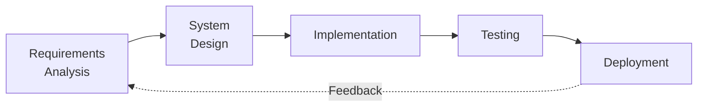
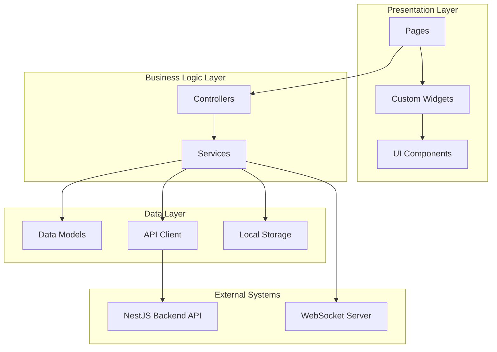
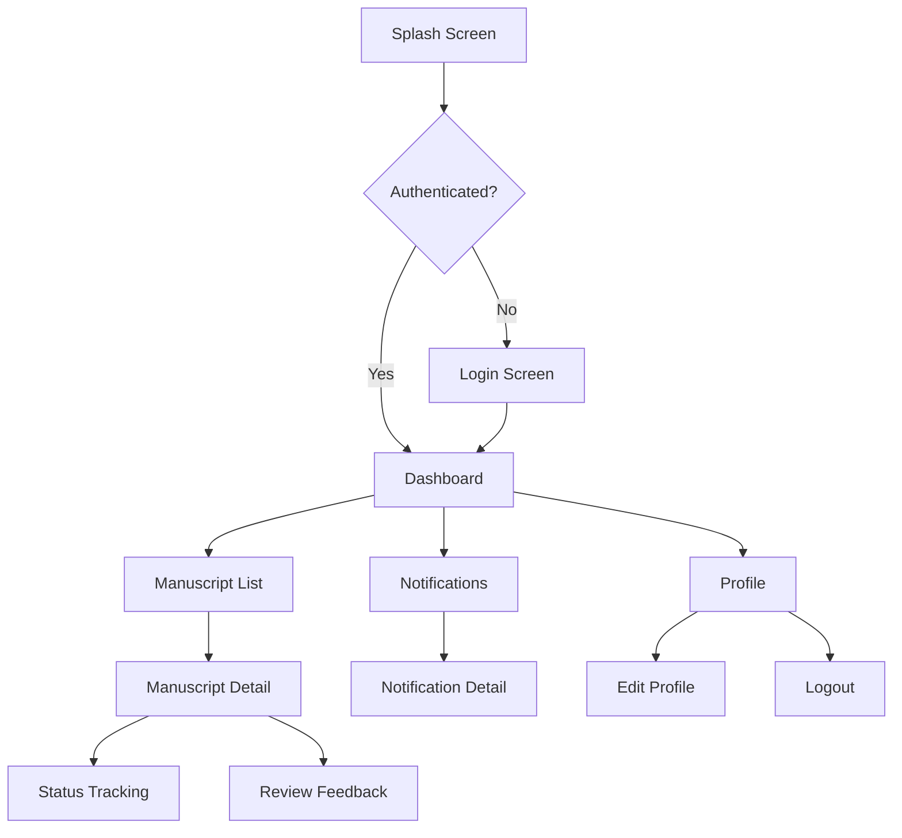

# RESEARCH METHOD

This section presents the methodology employed in the development of the Publishify mobile application, encompassing the development model, application architecture, and testing methodology.

## 2.1 Development Model

This research adopted the waterfall development model with iterative refinement, consistent with the methodology used in the web-based Publishify system development. The sequential nature of the waterfall model aligns with the well-defined requirements derived from the existing web system, enabling systematic translation of web features to the mobile platform [8].

The development process progressed through five primary phases: requirements analysis, system design, implementation, testing, and deployment.

**Figure 1.** Waterfall Development Model with Iterative Refinement

The requirements analysis phase involved comprehensive study of the existing web application features and identification of priority features for mobile implementation. Feature prioritization was based on mobile usage patterns and stakeholder requirements gathered through documentation review. The system design phase produced application architecture diagrams, screen wireframes, and API integration specifications. Implementation was executed in three development sprints, each lasting two weeks. Testing encompassed functional testing, performance testing, and compatibility testing across multiple devices.

## 2.2 Application Architecture

The mobile application architecture implements a layered design pattern that separates concerns across presentation, business logic, and data access layers. This architectural approach promotes code maintainability and testability while enabling independent evolution of each layer [9].

### 2.2.1 Flutter Framework Architecture

Flutter was selected as the development framework based on several technical considerations. The framework's widget-based architecture enables compositional UI development where complex interfaces are constructed from simple, reusable widget components [10]. The Dart programming language, which underlies Flutter, provides ahead-of-time (AOT) compilation for production builds, enabling native-like performance without the overhead of JavaScript interpretation.

**Table 1.** Mobile Application Technology Stack

| Component        | Technology             | Version | Purpose                               |
| ---------------- | ---------------------- | ------- | ------------------------------------- |
| Framework        | Flutter                | 3.9+    | Cross-platform UI framework           |
| Language         | Dart                   | 3.0+    | Statically typed programming language |
| HTTP Client      | http                   | 1.5.0   | RESTful API communication             |
| WebSocket        | socket_io_client       | 3.0.1   | Real-time notifications               |
| State Management | setState + Controllers | -       | Application state management          |
| Local Storage    | shared_preferences     | 2.2.2   | Token and preferences storage         |
| Charts           | fl_chart               | 0.69.0  | Data visualization                    |
| Date Handling    | intl                   | 0.19.0  | Date formatting and localization      |

### 2.2.2 Application Layer Structure

The application follows a structured directory organization that reflects the separation of concerns principle. Figure 2 illustrates the application architecture.

**Figure 2.** Mobile Application Architecture Diagram

**Table 2.** Application Directory Structure

| Directory          | Purpose           | Contents                                                        |
| ------------------ | ----------------- | --------------------------------------------------------------- |
| `lib/pages/`       | UI screens        | Role-based page directories (admin, editor, writer, percetakan) |
| `lib/services/`    | API communication | AuthService, NaskahService, ReviewService, NotifikasiService    |
| `lib/models/`      | Data models       | Pengguna, Naskah, Review, Notifikasi classes                    |
| `lib/controllers/` | State management  | Page-specific controllers                                       |
| `lib/widgets/`     | Reusable widgets  | Custom UI components                                            |
| `lib/config/`      | Configuration     | API endpoints, environment settings                             |
| `lib/routes/`      | Navigation        | AppRoutes and route definitions                                 |

### 2.2.3 Backend Integration

The mobile application integrates with the existing NestJS backend through RESTful API endpoints. Authentication utilizes JSON Web Tokens (JWT) with access and refresh token mechanisms [11]. The API base URL is configured through environment variables to support development and production deployments.

**Table 3.** Primary API Endpoints

| Endpoint                   | Method | Purpose                |
| -------------------------- | ------ | ---------------------- |
| `/api/auth/login`          | POST   | User authentication    |
| `/api/auth/refresh`        | POST   | Token refresh          |
| `/api/naskah/penulis/saya` | GET    | Author manuscript list |
| `/api/review/editor/saya`  | GET    | Editor review queue    |
| `/api/notifikasi`          | GET    | User notifications     |
| `/api/upload/single`       | POST   | File upload            |

Real-time notification delivery is achieved through WebSocket connectivity using the Socket.io protocol. Upon successful authentication, the application establishes a persistent WebSocket connection to receive push notifications for manuscript status changes and other relevant events [12].

## 2.3 User Interface Design

The user interface design follows Material Design principles adapted for the publishing domain context. Navigation utilizes a bottom navigation pattern for primary role-based sections with nested navigation for detailed views [13].

### 2.3.1 Screen Flow Diagram

Figure 3 presents the primary screen flow for the author role.

**Figure 3.** Author Role Screen Flow Diagram

### 2.3.2 Role-Based Interface Variations

The application implements four distinct interface variations corresponding to user roles:

1. **Author (Penulis)**: Manuscript submission, status tracking, feedback review
2. **Editor**: Review queue, manuscript assessment, feedback submission
3. **Administrator (Admin)**: User management, manuscript oversight, system statistics
4. **Printing Operator (Percetakan)**: Print order queue, order management

Each role presents a customized dashboard with relevant metrics and action shortcuts.

## 2.4 Testing Methodology

Application testing employed three complementary approaches to ensure comprehensive quality validation [14].

### 2.4.1 Functional Testing

Functional testing utilized black-box methodology with test cases designed based on feature specifications. Test scenarios covered authentication flows, data retrieval and display, user interactions, and navigation patterns. Each test case documented the scenario, input conditions, expected output, and pass/fail status.

### 2.4.2 Performance Testing

Performance testing evaluated application responsiveness and resource utilization using Google PageSpeed Insights for the Flutter Web build and manual observation for native execution. Metrics evaluated included:

- **Total Blocking Time (TBT)**: JavaScript execution blocking main thread
- **Cumulative Layout Shift (CLS)**: Visual stability during rendering
- **Largest Contentful Paint (LCP)**: Primary content loading time

### 2.4.3 Compatibility Testing

Compatibility testing verified consistent functionality and visual rendering across multiple Android devices with varying specifications. Testing devices were selected to represent a range of screen sizes, resolutions, and Android versions [15].

**Table 4.** Compatibility Testing Devices

| Device               | Screen Size | Resolution  | Android Version |
| -------------------- | ----------- | ----------- | --------------- |
| Samsung Galaxy A54   | 6.4"        | 1080 × 2340 | Android 13      |
| Xiaomi Redmi Note 12 | 6.67"       | 1080 × 2400 | Android 12      |
| OPPO A78             | 6.56"       | 720 × 1612  | Android 12      |
| Realme C55           | 6.72"       | 1080 × 2400 | Android 13      |
| Vivo Y22s            | 6.55"       | 720 × 1612  | Android 12      |

---

**Article Notes:**

The Research Method section comprises approximately 25% of the total article and contains:

- Development model explanation with diagram
- Application architecture details for Flutter
- Backend integration specifications
- User interface design with screen flow
- Testing methodology description

**Source Code References:**

- Application structure: `mobile/lib/`
- Pages: `mobile/lib/pages/`
- Services: `mobile/lib/services/`
- Configuration: `mobile/lib/config/`
