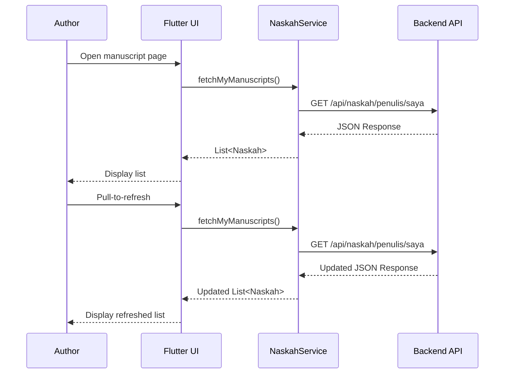
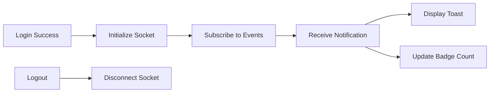
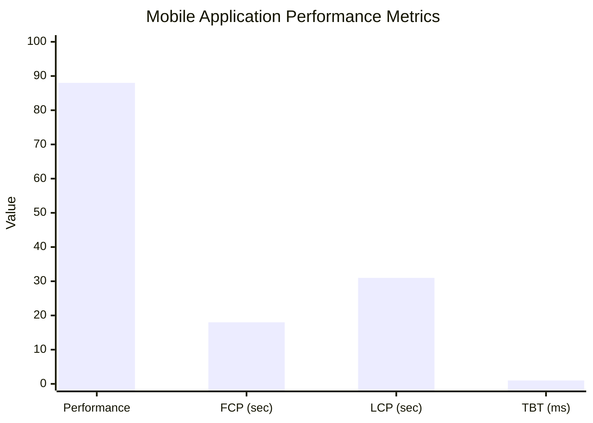

# RESULTS AND DISCUSSION

This section presents the implementation results of the Publishify mobile application along with the testing outcomes conducted during the evaluation phase.

## 3.1 Implementation Results

### 3.1.1 Development Environment

Application development was conducted using the specifications outlined in Table 5.

**Table 5.** Development Environment Specifications

| Component        | Specification                                |
| ---------------- | -------------------------------------------- |
| Operating System | Windows 11 Pro                               |
| Flutter SDK      | 3.9+                                         |
| Dart SDK         | 3.0+                                         |
| IDE              | Visual Studio Code with Flutter Extension    |
| Android SDK      | API Level 21 (Android 5.0) – 33 (Android 13) |
| Emulator         | Android Emulator (Pixel 6 API 33)            |
| Version Control  | Git with GitHub                              |

### 3.1.2 Project Structure

The implementation produced a well-organized project structure with clear separation based on functional responsibilities. Table 6 summarizes the primary implementation components.

**Table 6.** Implementation Components

| Directory          | File Count | Function                        |
| ------------------ | ---------- | ------------------------------- |
| `lib/pages/`       | 25+        | Role-based UI screens           |
| `lib/services/`    | 8          | API and business logic services |
| `lib/models/`      | 12         | Data model classes              |
| `lib/widgets/`     | 15+        | Custom reusable widgets         |
| `lib/controllers/` | 5          | State management controllers    |
| `lib/config/`      | 3          | Configuration files             |

### 3.1.3 Authentication Module Implementation

The authentication module implements login functionality with email and password credentials integrated with the backend API. JWT tokens are persisted using SharedPreferences for session management across application restarts [16].

```dart
// Pseudocode for login implementation
class AuthService {
  Future<AuthResponse> login(String email, String password) async {
    final response = await httpClient.post('/api/auth/login', {
      'email': email,
      'kataSandi': password,
    });

    if (response.sukses) {
      await storage.write('accessToken', response.data.accessToken);
      await storage.write('refreshToken', response.data.refreshToken);
    }

    return response;
  }
}
```

**[Screenshot Placeholder: Mobile application login screen]**

> Reference file: `mobile/lib/pages/auth/`

### 3.1.4 Author Module Implementation

The author module provides features for viewing manuscript lists, manuscript details, and status tracking. The implementation utilizes ListView widgets with pull-to-refresh functionality for data updates [17].

Figure 4 illustrates the sequence diagram for the manuscript list retrieval process.



**Figure 4.** Manuscript List Retrieval Sequence Diagram

**[Screenshot Placeholder: Author manuscript list screen]**

> Reference file: `mobile/lib/pages/writer/naskah/`

### 3.1.5 Editor Module Implementation

The editor module provides features for viewing the review queue, claiming review tasks, and submitting feedback. Editors can view manuscripts awaiting review and select tasks to assign to themselves.

**Table 7.** Editor Module Features

| Feature               | Description                          | Status        |
| --------------------- | ------------------------------------ | ------------- |
| Review Queue          | List of manuscripts awaiting review  | ✓ Implemented |
| Claim Task            | Assign manuscript to self for review | ✓ Implemented |
| Review Detail         | View manuscript details under review | ✓ Implemented |
| Feedback Form         | Submit chapter/page-level feedback   | ✓ Implemented |
| Submit Recommendation | Approve/Revise/Reject decision       | ✓ Implemented |

**[Screenshot Placeholder: Editor review queue interface]**

> Reference file: `mobile/lib/pages/editor/`

### 3.1.6 Real-time Notification Implementation

The notification system utilizes Socket.io client for receiving real-time updates from the server. The WebSocket connection is initialized upon successful authentication and terminated upon logout [18].



**Figure 5.** Real-time Notification System Flow

**[Screenshot Placeholder: Toast notification and notification list screen]**

> Reference file: `mobile/lib/services/notifikasi_service.dart`

### 3.1.7 Admin and Printing Modules

The admin module provides manuscript oversight and user management capabilities, while the printing module enables print order queue management. Both modules follow the same architectural patterns as the author and editor modules.

**Table 8.** Admin and Printing Module Features

| Module     | Feature              | Description                     |
| ---------- | -------------------- | ------------------------------- |
| Admin      | Dashboard            | Overview statistics and metrics |
| Admin      | User List            | View and manage user accounts   |
| Admin      | Manuscript Oversight | View all manuscripts in system  |
| Percetakan | Order Queue          | List of pending print orders    |
| Percetakan | Order Detail         | View specifications and status  |
| Percetakan | Update Status        | Progress order through workflow |

## 3.2 Functional Testing Results

Functional testing was conducted with 24 test cases covering all primary application functionalities. Table 9 summarizes the testing results organized by module.

**Table 9.** Functional Testing Results Summary

| Module         | Test Case Count | Passed | Failed | Percentage |
| -------------- | --------------- | ------ | ------ | ---------- |
| Authentication | 5               | 5      | 0      | 100%       |
| Manuscript     | 5               | 5      | 0      | 100%       |
| Editor         | 5               | 5      | 0      | 100%       |
| Notification   | 4               | 4      | 0      | 100%       |
| Compatibility  | 5               | 5      | 0      | 100%       |
| **Total**      | **24**          | **24** | **0**  | **100%**   |

Detailed testing results for the authentication module are presented in Table 10.

**Table 10.** Authentication Module Testing Details

| ID  | Scenario            | Input                       | Expected Result                         | Actual Result | Status |
| --- | ------------------- | --------------------------- | --------------------------------------- | ------------- | ------ |
| T01 | Valid login         | Valid credentials           | Successful login, navigate to dashboard | As expected   | ✓      |
| T02 | Invalid password    | Valid email, wrong password | Display error message                   | As expected   | ✓      |
| T03 | Empty fields        | No input                    | Display validation error                | As expected   | ✓      |
| T04 | Session persistence | Close and reopen app        | Remain logged in                        | As expected   | ✓      |
| T05 | Logout              | Tap logout button           | Clear session, navigate to login        | As expected   | ✓      |

Detailed testing results for the manuscript module are presented in Table 11.

**Table 11.** Manuscript Module Testing Details

| ID  | Scenario               | Input                    | Expected Result                         | Actual Result | Status |
| --- | ---------------------- | ------------------------ | --------------------------------------- | ------------- | ------ |
| T06 | View manuscript list   | Navigate to manuscripts  | Display list of author's manuscripts    | As expected   | ✓      |
| T07 | View manuscript detail | Tap on manuscript        | Display complete manuscript information | As expected   | ✓      |
| T08 | Pull-to-refresh        | Swipe down on list       | Refresh and update data                 | As expected   | ✓      |
| T09 | View status tracking   | Navigate to status tab   | Display visual status progression       | As expected   | ✓      |
| T10 | View feedback          | Navigate to feedback tab | Display editor feedback list            | As expected   | ✓      |

## 3.3 Performance Testing Results

Performance testing was conducted using Google PageSpeed Insights for the Flutter Web build to obtain standardized metrics. Table 12 presents the comprehensive performance testing results.

**Table 12.** Performance Testing Results

| Metric                   | Mobile Mode | Target    | Status |
| ------------------------ | ----------- | --------- | ------ |
| Performance Score        | 88/100      | ≥ 80      | ✓      |
| First Contentful Paint   | 1.8 sec     | < 2.0 sec | ✓      |
| Largest Contentful Paint | 3.1 sec     | < 2.5 sec | △      |
| Total Blocking Time      | 10 ms       | < 200 ms  | ✓      |
| Cumulative Layout Shift  | 0           | < 0.1     | ✓      |
| Speed Index              | 2.0 sec     | < 3.4 sec | ✓      |

A visual representation of the performance metrics is provided in Figure 6.



**Figure 6.** Performance Metrics Visualization (normalized scale)

The performance testing results indicate that the application achieves good overall performance with a score of 88 out of 100. The Total Blocking Time of 10 milliseconds and Cumulative Layout Shift of 0 represent excellent results indicating responsive interactions and visual stability. The Largest Contentful Paint of 3.1 seconds exceeds the recommended target and represents an area for optimization.

## 3.4 Compatibility Testing Results

Compatibility testing verified consistent functionality and visual rendering across five Android devices. Table 13 presents the testing results.

**Table 13.** Compatibility Testing Results

| Device               | Screen | Android | UI Rendering | Functionality        | Status |
| -------------------- | ------ | ------- | ------------ | -------------------- | ------ |
| Samsung Galaxy A54   | 6.4"   | 13      | ✓ Consistent | ✓ All functions work | Pass   |
| Xiaomi Redmi Note 12 | 6.67"  | 12      | ✓ Consistent | ✓ All functions work | Pass   |
| OPPO A78             | 6.56"  | 12      | ✓ Consistent | ✓ All functions work | Pass   |
| Realme C55           | 6.72"  | 13      | ✓ Consistent | ✓ All functions work | Pass   |
| Vivo Y22s            | 6.55"  | 12      | ✓ Consistent | ✓ All functions work | Pass   |

All tested devices demonstrated consistent UI rendering and complete functionality, confirming the cross-device compatibility of the Flutter-based implementation.

**[Screenshot Placeholder: Application running on multiple devices]**

---

**Article Notes:**

The Results and Discussion section comprises approximately 45% of the total article and contains:

- Implementation results organized by module
- Sequence diagrams and flow charts
- Functional testing results with detailed test cases
- Performance testing results with PageSpeed metrics
- Compatibility testing results across multiple devices

**Source Code References:**

- Pages: `mobile/lib/pages/`
- Services: `mobile/lib/services/`
- Models: `mobile/lib/models/`
- Configuration: `mobile/lib/config/`
