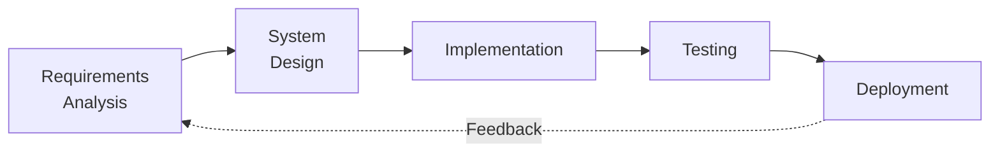
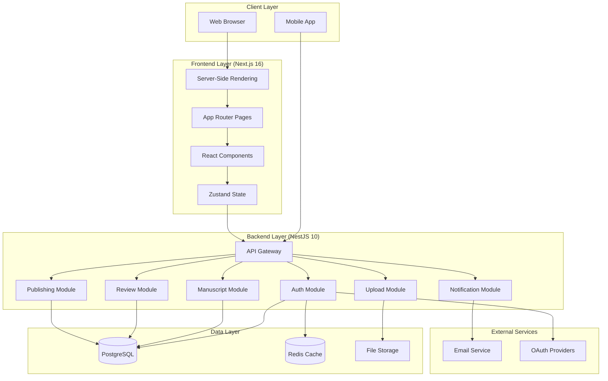
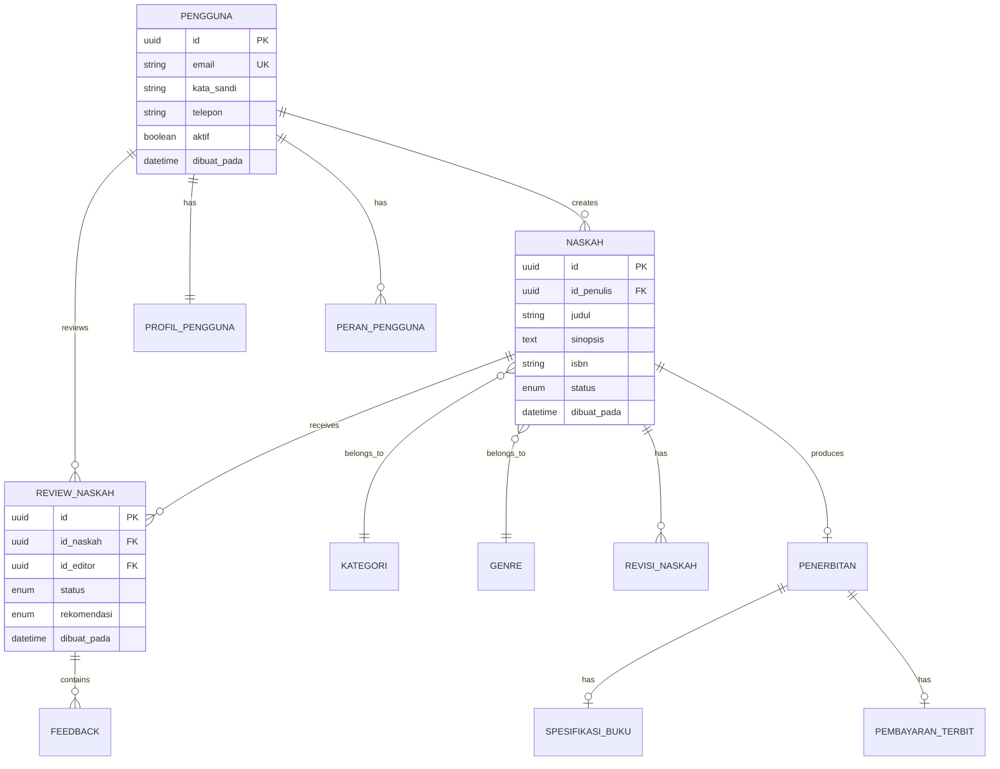

# RESEARCH METHOD

This section presents the methodology employed in the development of the Publishify web-based book publishing information system, encompassing the development model, system architecture, and testing methodology.

## 2.1 Development Model

This research adopted the waterfall development model with iterative refinement as the primary software development methodology. The waterfall model was selected due to its systematic and sequential approach that aligns with the well-defined requirements of publishing workflow management systems [9]. The development process progressed through five primary phases: requirements analysis, system design, implementation, testing, and deployment.

**Figure 1.** Waterfall Development Model with Iterative Refinement

The requirements analysis phase involved comprehensive study of conventional publishing workflows through documentation review and analysis of existing publishing management systems. The system design phase produced architectural diagrams, database schemas, and user interface wireframes. Implementation was executed in four development sprints, each lasting two weeks. Testing encompassed functional testing using black-box methodology and performance testing using automated tools. The deployment phase delivered the system to a production server environment.

## 2.2 System Architecture

The system architecture follows a modern client-server pattern with clear separation between frontend and backend components. This architectural decision facilitates independent scaling and maintenance of each layer [10].

### 2.2.1 Frontend Architecture

The frontend layer was developed using Next.js version 16, a React-based framework that provides server-side rendering (SSR), static site generation (SSG), and client-side rendering capabilities. The App Router feature introduced in Next.js 13+ was utilized for file-based routing with support for layouts, loading states, and error boundaries [11].

**Table 1.** Frontend Technology Stack

| Component        | Technology       | Version | Purpose                      |
| ---------------- | ---------------- | ------- | ---------------------------- |
| Framework        | Next.js          | 16.0.10 | React-based web framework    |
| Language         | TypeScript       | 5.0+    | Type-safe JavaScript         |
| Styling          | Tailwind CSS     | 4.0     | Utility-first CSS framework  |
| UI Library       | shadcn/ui        | 2.0     | Accessible component library |
| State Management | Zustand          | 5.0.8   | Lightweight state management |
| Data Fetching    | TanStack Query   | 5.90.12 | Server state management      |
| HTTP Client      | Axios            | 1.9.0   | Promise-based HTTP client    |
| WebSocket        | Socket.io-client | 4.8.1   | Real-time communication      |

### 2.2.2 Backend Architecture

The backend layer was implemented using NestJS version 10, a progressive Node.js framework that provides an out-of-the-box application architecture inspired by Angular [12]. The framework enforces the modular organization of code into self-contained modules, each containing controllers for handling HTTP requests, services for business logic, and repositories for data access.

**Table 2.** Backend Technology Stack

| Component         | Technology            | Version | Purpose                       |
| ----------------- | --------------------- | ------- | ----------------------------- |
| Framework         | NestJS                | 10.0+   | Progressive Node.js framework |
| Language          | TypeScript            | 5.0+    | Type-safe JavaScript          |
| Database          | PostgreSQL            | 14+     | Relational database           |
| ORM               | Prisma                | 5.8.0   | Object-Relational Mapping     |
| Authentication    | Passport + JWT        | 0.7.0   | Token-based authentication    |
| Validation        | Zod + class-validator | 3.22.4  | Runtime validation            |
| Real-time         | Socket.io             | 4.6.1   | WebSocket implementation      |
| Caching           | Redis                 | 7.0+    | In-memory data store          |
| API Documentation | Swagger               | 7.2.0   | OpenAPI specification         |

### 2.2.3 System Architecture Diagram

The complete system architecture illustrating the interaction between frontend, backend, database, and external services is presented in Figure 2.

**Figure 2.** Publishify System Architecture Diagram

## 2.3 Database Design

The database schema was designed following normalization principles to minimize data redundancy while maintaining query performance. The schema comprises 24 tables organized into six logical domains: user management, content management, review system, notification, authentication, and publishing [13].

### 2.3.1 Entity Relationship Model

The core entities and their relationships are illustrated in Figure 3.

**Figure 3.** Core Entity Relationship Diagram

### 2.3.2 Status Enumeration

The system utilizes enumerated types to represent status values throughout the workflow. Table 3 presents the manuscript status enumeration.

**Table 3.** Manuscript Status Enumeration

| Status        | Description                        | Next Status Options    |
| ------------- | ---------------------------------- | ---------------------- |
| draft         | Initial draft, not yet submitted   | diajukan               |
| diajukan      | Submitted for review               | dalam_review, ditolak  |
| dalam_review  | Under editorial review             | dalam_editing, ditolak |
| dalam_editing | Editorial improvements in progress | siap_terbit            |
| siap_terbit   | ISBN registration and preparation  | diterbitkan            |
| diterbitkan   | Published                          | -                      |
| ditolak       | Rejected                           | draft                  |

## 2.4 Testing Methodology

System testing employed two complementary approaches: functional testing and performance testing [14].

### 2.4.1 Functional Testing

Functional testing utilized the black-box testing methodology, which evaluates system behavior without knowledge of internal code structure. Test cases were designed based on system requirements and organized by functional modules.

Test case design followed the equivalence partitioning and boundary value analysis techniques to ensure comprehensive coverage of input scenarios [15]. Each test case specified the test identifier, scenario description, input values, expected output, actual output, and pass/fail status.

### 2.4.2 Performance Testing

Performance testing was conducted using Google PageSpeed Insights, an industry-standard tool for evaluating web application performance. The tool measures Core Web Vitals metrics including:

- **Largest Contentful Paint (LCP)**: Measures loading performance
- **First Contentful Paint (FCP)**: Measures initial render time
- **Cumulative Layout Shift (CLS)**: Measures visual stability
- **Total Blocking Time (TBT)**: Measures interactivity delay

Testing was performed on the deployed production system accessed via public IP address (74.225.221.140) to reflect real-world performance characteristics.

---

**Article Notes:**

The Research Method section comprises approximately 25% of the total article and contains:

- Development model explanation with diagram
- System architecture details for frontend and backend
- Database design with ERD
- Testing methodology description

**Source Code References:**

- Frontend structure: `frontend/app/`
- Backend modules: `backend/src/modules/`
- Database schema: `backend/prisma/schema.prisma`
