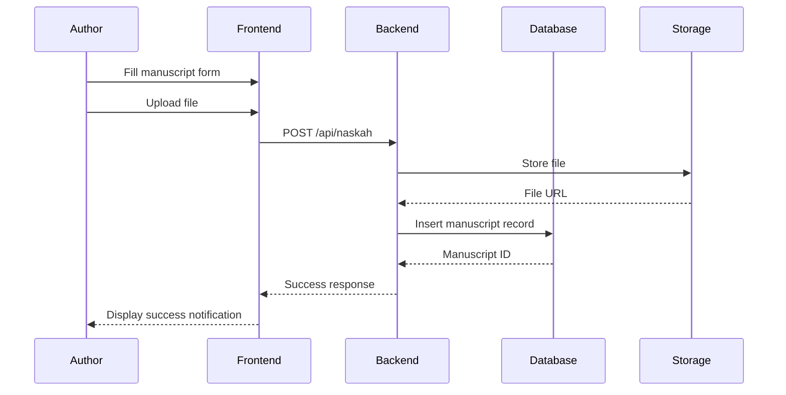
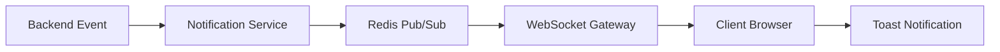

# RESULTS AND DISCUSSION

This section presents the implementation results of the Publishify system along with the testing outcomes. The discussion encompasses implementation results organized by module, functional testing results, and performance testing results.

## 3.1 Implementation Results

The implementation phase produced a fully functional web application accessible through standard web browsers with support for both desktop and mobile devices. The system was successfully deployed to a virtual server with public IP address 74.225.221.140. The project structure consists of two primary components: the frontend application built with Next.js and the backend API services built with NestJS, communicating through RESTful API endpoints.

### 3.1.1 Backend Implementation

The backend was implemented following the modular architecture pattern inherent to NestJS, resulting in nine distinct modules: auth, pengguna (user), naskah (manuscript), review, penerbitan (publishing), kategori (category), genre, notifikasi (notification), and upload. Each module adheres to the controller-service-repository design pattern, which effectively separates concerns related to request handling, business logic execution, and data access operations [16].

**Table 4.** Backend Modules and Endpoints

| Module     | Endpoint Count | Primary Functions                                            |
| ---------- | -------------- | ------------------------------------------------------------ |
| Auth       | 8              | Login, register, refresh token, OAuth integration            |
| Pengguna   | 6              | CRUD operations, profile management, password updates        |
| Naskah     | 12             | CRUD operations, status management, statistics               |
| Review     | 10             | Queue management, task assignment, feedback, recommendations |
| Penerbitan | 8              | Package management, order processing, specifications         |
| Kategori   | 5              | CRUD operations for categories                               |
| Genre      | 5              | CRUD operations for genres                                   |
| Notifikasi | 5              | List, read, delete notifications                             |
| Upload     | 3              | Single and multiple file uploads                             |

The PostgreSQL database was implemented with 24 tables managed through Prisma ORM. The utilization of Prisma enables structured schema migrations and type-safe queries that substantially reduce the risk of SQL injection vulnerabilities [17]. The system employs Indonesian-language enumerations for status values and user roles to align with the local usage context.

**[Screenshot Placeholder: Backend module structure in VSCode]**

> Reference file: `backend/src/modules/`

### 3.1.2 Frontend Implementation

The frontend was implemented using Next.js version 16 with the App Router feature, which provides file-based routing capabilities and React Server Components. The user interface leverages shadcn/ui components built upon Radix UI primitives with Tailwind CSS for styling [18].

The routing structure employs route groups to organize pages according to user roles:

- `(auth)` - Authentication pages including login and registration
- `(penulis)` - Author dashboard and related features
- `(editor)` - Editor dashboard and review features
- `(admin)` - Administrative dashboard and management features
- `(publik)` - Public catalog pages

**Table 5.** Primary Frontend Components

| Component      | Location                               | Function                               |
| -------------- | -------------------------------------- | -------------------------------------- |
| Sidebar        | `components/dashboard/sidebar.tsx`     | Dashboard navigation                   |
| KartuNaskah    | `components/naskah/`                   | Manuscript display cards               |
| FormPenerbitan | `components/penerbitan/`               | Publishing order forms                 |
| TabelData      | `components/ui/table.tsx`              | Data tables with sorting and filtering |
| StatusTracker  | `components/naskah/status-tracker.tsx` | Visual status progression              |

**[Screenshot Placeholder: Author dashboard page]**

> Reference file: `frontend/app/(penulis)/penulis/page.tsx`

### 3.1.3 Core Feature Implementation

#### A. Manuscript Management System

The manuscript management system enables authors to upload, edit, and track the status of their manuscripts throughout the publishing process. The upload functionality supports various file formats including PDF, DOCX, and ODT with a maximum file size validation of 50 megabytes. Figure 4 illustrates the sequence diagram for the manuscript submission process.

**Figure 4.** Manuscript Submission Sequence Diagram

#### B. Editorial Review System

The editorial review system enables editors to view the queue of pending manuscripts, claim review tasks, and provide structured feedback. Editors can approve manuscripts, request revisions, or reject submissions with detailed explanatory notes. Feedback can be provided at the chapter and page level to facilitate precise reference for authors during revision.

**Table 6.** Review Status and Transitions

| Initial Status | Action           | Final Status | Actor  |
| -------------- | ---------------- | ------------ | ------ |
| Submitted      | Assign           | Assigned     | Admin  |
| Assigned       | Begin Review     | In Progress  | Editor |
| In Progress    | Approve          | Completed    | Editor |
| In Progress    | Request Revision | Completed    | Editor |
| In Progress    | Reject           | Completed    | Editor |

**[Screenshot Placeholder: Editor review interface with feedback form]**

> Reference file: `frontend/app/(editor)/editor/`

#### C. Real-time Notification System

The notification system was implemented using Socket.io for bidirectional WebSocket communication. Each manuscript status change, new feedback submission, or other significant activity triggers a real-time notification to the relevant user without requiring page refresh [19].

**Figure 5.** Real-time Notification System Architecture

## 3.2 Functional Testing Results

Functional testing was conducted using the black-box testing methodology with 28 test cases covering all primary system functionalities. Table 7 summarizes the testing results organized by module.

**Table 7.** Functional Testing Results Summary

| Module                | Test Case Count | Passed | Failed | Percentage |
| --------------------- | --------------- | ------ | ------ | ---------- |
| Authentication        | 6               | 6      | 0      | 100%       |
| Manuscript Management | 8               | 8      | 0      | 100%       |
| Review System         | 6               | 6      | 0      | 100%       |
| Publishing            | 4               | 4      | 0      | 100%       |
| Notification          | 4               | 4      | 0      | 100%       |
| **Total**             | **28**          | **28** | **0**  | **100%**   |

Detailed testing results for the authentication module are presented in Table 8.

**Table 8.** Authentication Module Testing Details

| ID  | Scenario                     | Input                       | Expected Result                          | Actual Result | Status |
| --- | ---------------------------- | --------------------------- | ---------------------------------------- | ------------- | ------ |
| T01 | Valid login                  | Valid email and password    | Successful login, redirect to dashboard  | As expected   | ✓      |
| T02 | Invalid password             | Valid email, wrong password | Error message "Incorrect password"       | As expected   | ✓      |
| T03 | Unregistered email           | Non-existent email          | Error message "Email not registered"     | As expected   | ✓      |
| T04 | New user registration        | Valid registration data     | Account created, verification email sent | As expected   | ✓      |
| T05 | Duplicate email registration | Existing email              | Error message "Email already registered" | As expected   | ✓      |
| T06 | Logout                       | Click logout button         | Session terminated, redirect to login    | As expected   | ✓      |

## 3.3 Performance Testing Results

Performance testing was conducted using Google PageSpeed Insights with separate evaluations for desktop and mobile modes. Table 9 presents the comprehensive testing results.

**Table 9.** PageSpeed Insights Testing Results

| Metric                   | Desktop | Mobile  | Target    | Status              |
| ------------------------ | ------- | ------- | --------- | ------------------- |
| Performance Score        | 98/100  | 88/100  | ≥ 90      | ✓ Desktop, △ Mobile |
| First Contentful Paint   | 0.4 sec | 1.8 sec | < 1.8 sec | ✓                   |
| Largest Contentful Paint | 0.7 sec | 3.1 sec | < 2.5 sec | ✓ Desktop, △ Mobile |
| Total Blocking Time      | 10 ms   | 10 ms   | < 200 ms  | ✓                   |
| Cumulative Layout Shift  | 0       | 0       | < 0.1     | ✓                   |
| Speed Index              | 0.5 sec | 2.0 sec | < 3.4 sec | ✓                   |
| Accessibility            | 96/100  | 96/100  | ≥ 90      | ✓                   |
| Best Practices           | 92/100  | 92/100  | ≥ 90      | ✓                   |
| SEO                      | 92/100  | 92/100  | ≥ 90      | ✓                   |

A visual representation of the performance testing results is provided in Figure 6.

```mermaid
xychart-beta
    title "PageSpeed Insights Scores: Desktop vs Mobile"
    x-axis ["Performance", "Accessibility", "Best Practices", "SEO"]
    y-axis "Score" 0 --> 100
    bar [98, 96, 92, 92]
    bar [88, 96, 92, 92]
```

**Figure 6.** PageSpeed Score Comparison: Desktop vs Mobile

The testing results indicate that the system achieves excellent performance for desktop mode with a score of 98 out of 100. Mobile mode demonstrates a score of 88 out of 100, which falls within the acceptable range but indicates opportunity for further optimization, particularly regarding the Largest Contentful Paint metric, which recorded 3.1 seconds compared to the recommended target of 2.5 seconds.

**[Screenshot Placeholder: Complete PageSpeed Insights report]**

---

**Article Notes:**

The Results and Discussion section comprises approximately 45% of the total article and contains:

- Implementation results organized by module (backend and frontend)
- Sequence and architecture diagrams
- Endpoint and component tables
- Functional testing results with detailed test cases
- Performance testing results with PageSpeed metrics

**Source Code References:**

- Backend modules: `backend/src/modules/`
- Frontend pages: `frontend/app/`
- UI components: `frontend/components/`
- Database schema: `backend/prisma/schema.prisma`
