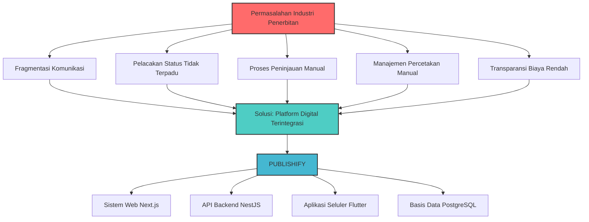
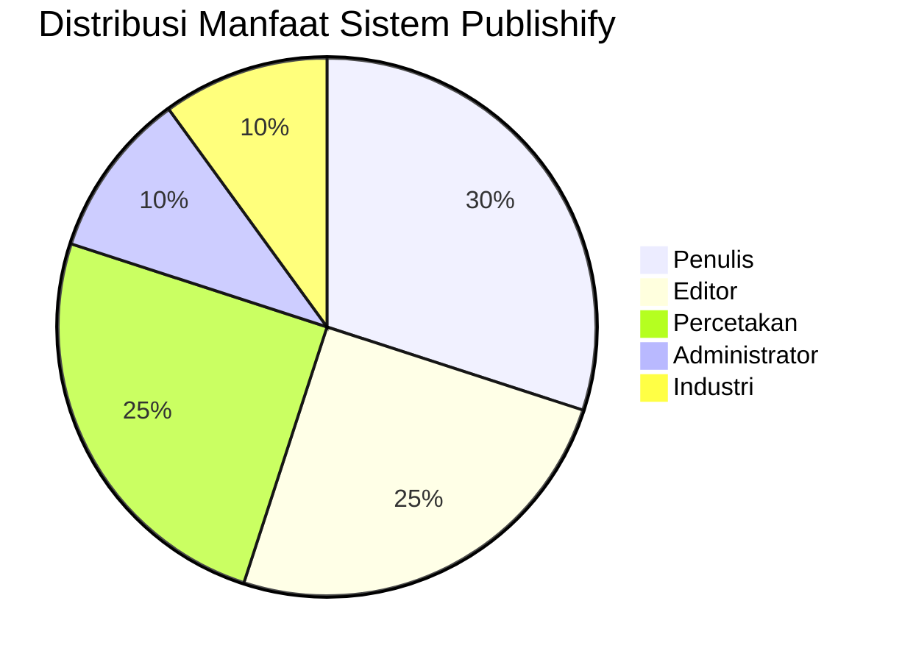

# BAB I

# PENDAHULUAN

---

## A. Latar Belakang Proyek

Industri penerbitan di Indonesia telah mengalami transformasi yang signifikan seiring dengan perkembangan teknologi digital dalam dua dekade terakhir. Menurut data dari Ikatan Penerbit Indonesia (IKAPI), terdapat lebih dari 1.500 penerbit aktif di Indonesia yang memproduksi sekitar 30.000 judul buku baru setiap tahunnya (IKAPI, 2023). Angka ini menunjukkan bahwa industri penerbitan merupakan sektor yang dinamis dan terus berkembang, namun di sisi lain juga menghadapi berbagai tantangan dalam hal efisiensi operasional dan manajemen proses penerbitan.

Proses penerbitan naskah secara konvensional melibatkan serangkaian tahapan yang kompleks dan membutuhkan koordinasi yang intensif antara berbagai pihak yang terlibat. Tahapan tersebut dimulai dari penyerahan naskah oleh penulis, proses peninjauan dan penyuntingan oleh editor, persetujuan naskah, proses pencetakan, hingga distribusi buku kepada pembaca. Setiap tahapan memerlukan komunikasi yang efektif dan pelacakan status yang akurat untuk memastikan kelancaran seluruh proses penerbitan.

Berdasarkan hasil observasi dan wawancara yang kami lakukan dengan beberapa penulis dan penerbit independen, teridentifikasi beberapa permasalahan utama dalam proses penerbitan konvensional. Pertama, fragmentasi komunikasi menjadi kendala yang sering dihadapi, dimana pertukaran informasi antara penulis, editor, dan percetakan masih dilakukan melalui berbagai saluran yang terpisah seperti surel, pesan instan, atau komunikasi langsung. Kondisi ini mengakibatkan kesulitan dalam melacak riwayat komunikasi dan potensi kehilangan informasi penting.

Kedua, pelacakan status naskah yang tidak terpadu menjadi masalah yang cukup signifikan. Para penulis seringkali kesulitan untuk mengetahui posisi naskah mereka dalam alur penerbitan secara waktu nyata. Mereka harus aktif menghubungi pihak penerbit atau editor untuk mendapatkan informasi terkini mengenai status naskah, yang tentunya tidak efisien dari segi waktu dan tenaga.

Ketiga, proses peninjauan editorial yang masih bersifat manual mengakibatkan waktu tunggu yang cukup panjang. Editor harus membaca naskah secara keseluruhan, memberikan catatan dan masukan, kemudian mengirimkan kembali hasil peninjauan kepada penulis melalui dokumen terpisah. Proses bolak-balik ini dapat memakan waktu berminggu-minggu hingga berbulan-bulan, tergantung pada kompleksitas naskah dan ketersediaan editor.

Keempat, manajemen pesanan percetakan yang dilakukan secara manual rentan terhadap kesalahan dan keterlambatan. Pengelolaan data pesanan, pelacakan status produksi, serta koordinasi pengiriman masih dilakukan dengan metode tradisional yang kurang efisien. Hal ini berdampak pada kepuasan pelanggan dan potensi kerugian bisnis bagi pihak percetakan.

Kelima, transparansi biaya dan pembayaran masih menjadi isu yang perlu diperhatikan. Para penulis seringkali tidak memiliki gambaran yang jelas mengenai rincian biaya penerbitan, termasuk biaya editing, desain sampul, pencetakan, dan distribusi. Ketidakjelasan ini dapat menimbulkan ketidakpuasan dan potensi konflik antara penulis dengan pihak penerbit atau percetakan.

Perkembangan teknologi informasi dan komunikasi telah membuka peluang untuk mengatasi berbagai permasalahan tersebut melalui pengembangan sistem digital terintegrasi. Platform digital dapat menyediakan lingkungan terpusat yang memfasilitasi kolaborasi antara seluruh pemangku kepentingan dalam ekosistem penerbitan. Sistem berbasis web dan aplikasi seluler memungkinkan akses yang mudah dan fleksibel dari berbagai perangkat dan lokasi.

Berdasarkan latar belakang permasalahan tersebut, kami termotivasi untuk mengembangkan sebuah sistem penerbitan naskah digital yang kami namai **Publishify**. Sistem ini dirancang sebagai platform terintegrasi yang menghubungkan penulis, editor, percetakan, dan administrator dalam satu ekosistem digital. Publishify diharapkan dapat menjadi solusi komprehensif untuk mengatasi fragmentasi proses, meningkatkan transparansi, dan mempercepat siklus penerbitan naskah.

Pengembangan sistem Publishify dilakukan dengan menggunakan metode ADDIE (_Analysis, Design, Development, Implementation, Evaluation_) yang merupakan pendekatan sistematis dalam pengembangan sistem dan materi pembelajaran. Metode ini dipilih karena memiliki tahapan yang terstruktur dan memungkinkan evaluasi berkesinambungan pada setiap fase pengembangan. Dengan pendekatan ini, kami dapat memastikan bahwa sistem yang dikembangkan benar-benar sesuai dengan kebutuhan pengguna dan dapat memberikan nilai tambah yang signifikan bagi industri penerbitan.

Sistem Publishify dikembangkan dengan memanfaatkan teknologi modern yang meliputi kerangka kerja Next.js untuk antarmuka web, NestJS untuk layanan backend, Flutter untuk aplikasi seluler, serta PostgreSQL sebagai sistem manajemen basis data. Pemilihan teknologi ini didasarkan pada pertimbangan skalabilitas, kinerja, keamanan, dan kemudahan pemeliharaan sistem dalam jangka panjang.

_Gambar 1.1 Diagram Permasalahan Industri Penerbitan dan Solusi Publishify_

_[Catatan: Gambar di atas dalam format Mermaid. Untuk dokumen cetak, konversi ke gambar PNG/JPG atau buat ulang menggunakan perangkat lunak desain seperti Figma, draw.io, atau Microsoft Visio]_

---

## B. Identifikasi Masalah

Berdasarkan analisis latar belakang yang telah diuraikan sebelumnya, kami mengidentifikasi beberapa permasalahan utama yang dihadapi oleh industri penerbitan naskah di Indonesia. Identifikasi masalah ini menjadi dasar dalam menentukan fitur-fitur yang perlu dikembangkan dalam sistem Publishify.

### 1. Permasalahan dari Perspektif Penulis

Penulis sebagai pemangku kepentingan utama dalam ekosistem penerbitan menghadapi beberapa kendala yang signifikan dalam proses penerbitan konvensional:

a. **Kesulitan dalam pelacakan status naskah** - Penulis tidak memiliki akses waktu nyata terhadap informasi mengenai posisi naskah mereka dalam alur penerbitan. Mereka harus mengandalkan komunikasi manual dengan pihak penerbit untuk mendapatkan pembaruan status, yang seringkali tidak responsif atau tidak konsisten.

b. **Keterbatasan akses terhadap umpan balik editorial** - Proses pengiriman dan penerimaan umpan balik dari editor masih dilakukan melalui dokumen terpisah yang dikirimkan melalui surel. Metode ini tidak efisien dan rentan terhadap kehilangan informasi atau kesalahan interpretasi.

c. **Kurangnya transparansi biaya** - Penulis seringkali tidak memiliki gambaran yang jelas mengenai struktur biaya penerbitan dan pencetakan. Ketidakjelasan ini dapat menyebabkan ketidakpuasan dan potensi konflik dengan pihak penerbit.

d. **Kesulitan dalam mengelola revisi naskah** - Proses revisi yang berulang-ulang menghasilkan banyak versi dokumen yang sulit untuk dikelola dan dilacak secara efektif.

### 2. Permasalahan dari Perspektif Editor

Editor sebagai pihak yang bertanggung jawab atas kualitas konten menghadapi tantangan tersendiri dalam menjalankan perannya:

a. **Manajemen beban kerja yang tidak terstruktur** - Editor kesulitan dalam mengelola antrian naskah yang harus ditinjau, terutama ketika volume naskah yang masuk cukup tinggi.

b. **Keterbatasan alat untuk memberikan umpan balik terstruktur** - Proses pemberian komentar dan saran perbaikan masih dilakukan dengan cara konvensional yang kurang terorganisir.

c. **Kesulitan dalam melacak riwayat peninjauan** - Informasi mengenai riwayat peninjauan dan status rekomendasi tidak tersimpan secara terpusat sehingga sulit untuk diakses ketika diperlukan.

### 3. Permasalahan dari Perspektif Percetakan

Pihak percetakan sebagai mitra produksi menghadapi kendala operasional yang mempengaruhi efisiensi bisnis:

a. **Manajemen pesanan yang tidak terintegrasi** - Pengelolaan data pesanan masih dilakukan secara manual atau menggunakan sistem terpisah yang tidak terhubung dengan platform penulis.

b. **Pelacakan produksi yang tidak sistematis** - Proses produksi dari penerimaan pesanan hingga pengiriman tidak terdokumentasi dengan baik dalam satu sistem terpadu.

c. **Koordinasi pengiriman yang kompleks** - Manajemen informasi pengiriman, termasuk nomor resi dan status pengiriman, masih dilakukan secara manual.

### 4. Permasalahan dari Perspektif Sistem Keseluruhan

Dari sudut pandang sistem secara keseluruhan, terdapat beberapa isu yang perlu diatasi:

a. **Fragmentasi data dan informasi** - Data dan informasi tersebar di berbagai sistem dan saluran komunikasi yang berbeda, mengakibatkan kesulitan dalam konsolidasi dan analisis.

b. **Kurangnya otomatisasi proses** - Banyak tahapan dalam alur penerbitan yang masih dilakukan secara manual, mengakibatkan keterlambatan dan potensi kesalahan manusia.

c. **Keterbatasan aksesibilitas** - Sistem yang ada umumnya berbasis desktop dan tidak dapat diakses dengan mudah melalui perangkat seluler.

d. **Keamanan data yang belum optimal** - Pengelolaan data sensitif seperti naskah dan informasi pembayaran belum menggunakan standar keamanan yang memadai.

| No  | Kategori   | Permasalahan                     | Dampak                         |
| --- | ---------- | -------------------------------- | ------------------------------ |
| 1   | Penulis    | Pelacakan status tidak real-time | Ketidakpastian dan kecemasan   |
| 2   | Penulis    | Umpan balik tidak terstruktur    | Kesulitan melakukan revisi     |
| 3   | Editor     | Beban kerja tidak terkelola      | Produktivitas menurun          |
| 4   | Editor     | Tidak ada sistem rekomendasi     | Keputusan tidak terdokumentasi |
| 5   | Percetakan | Pesanan tidak terintegrasi       | Kesalahan pemrosesan           |
| 6   | Percetakan | Produksi tidak terlacak          | Keterlambatan pengiriman       |
| 7   | Sistem     | Data terfragmentasi              | Analisis sulit dilakukan       |
| 8   | Sistem     | Proses manual                    | Efisiensi rendah               |

_Tabel 1.1 Ringkasan Identifikasi Masalah dan Dampaknya_

---

## C. Batasan Masalah

Mengingat kompleksitas industri penerbitan dan keterbatasan sumber daya dalam pengembangan sistem, kami menetapkan batasan-batasan masalah yang menjadi fokus dalam proyek Publishify ini. Batasan masalah ini penting untuk memastikan bahwa pengembangan sistem dapat diselesaikan dengan baik dalam kerangka waktu yang tersedia dan menghasilkan produk yang berkualitas.

### 1. Ruang Lingkup Fitur yang Dikembangkan

Sistem Publishify yang dikembangkan dalam proyek ini mencakup fitur-fitur sebagai berikut:

**a. Modul Manajemen Naskah**

- Pengunggahan naskah dalam format PDF dengan batas ukuran maksimal 50 MB
- Pengelolaan metadata naskah meliputi judul, kategori, genre, dan sinopsis
- Sistem versi untuk pengelolaan revisi naskah
- Pelacakan status naskah dari tahap draf hingga diterbitkan

**b. Modul Peninjauan Editorial**

- Penugasan editor oleh administrator atau mekanisme penugasan mandiri
- Sistem umpan balik terstruktur dengan kemampuan memberikan komentar per bab atau halaman
- Rekomendasi akhir dengan tiga pilihan: setujui, revisi, atau tolak
- Pelacakan status peninjauan secara waktu nyata

**c. Modul Manajemen Percetakan**

- Konfirmasi pesanan dengan opsi terima atau tolak
- Pelacakan produksi melalui enam tahapan: tertunda, diterima, dalam produksi, kontrol kualitas, siap, dan dikirim
- Manajemen informasi pengiriman termasuk ekspedisi, nomor resi, dan estimasi tiba
- Catatan produksi otomatis untuk setiap perubahan status

**d. Modul Pembayaran Dasar**

- Pembuatan tagihan berdasarkan pesanan cetak
- Pengunggahan bukti pembayaran oleh pengguna
- Konfirmasi pembayaran secara manual oleh administrator
- Pelacakan status pembayaran

**e. Modul Autentikasi dan Otorisasi**

- Autentikasi berbasis JWT dengan mekanisme token akses dan token penyegaran
- Integrasi OAuth 2.0 dengan Google Sign-In
- Kontrol akses berbasis peran (RBAC) untuk empat peran pengguna
- Manajemen sesi pengguna

**f. Modul Notifikasi**

- Notifikasi waktu nyata melalui teknologi WebSocket
- Notifikasi dalam aplikasi untuk berbagai aktivitas sistem
- Rencana pengembangan notifikasi surel untuk versi mendatang

### 2. Fitur yang Tidak Termasuk dalam Ruang Lingkup

Untuk menjaga fokus pengembangan, beberapa fitur tidak termasuk dalam ruang lingkup proyek ini:

- Integrasi dengan gateway pembayaran pihak ketiga (Midtrans, Xendit, dan lain-lain)
- Pembaca buku elektronik dalam aplikasi
- Pasar publik atau toko daring untuk penjualan buku
- Sistem ulasan dan penilaian dari pembaca umum
- Integrasi dengan platform media sosial
- Fitur berbasis kecerdasan buatan seperti pengecekan tata bahasa atau deteksi plagiarisme

### 3. Batasan Teknologi

Pengembangan sistem dibatasi pada teknologi-teknologi berikut:

| Komponen         | Teknologi  | Versi |
| ---------------- | ---------- | ----- |
| Runtime          | Bun        | 1.0+  |
| Frontend Web     | Next.js    | 14+   |
| Backend API      | NestJS     | 10+   |
| Aplikasi Seluler | Flutter    | 3.x   |
| Basis Data       | PostgreSQL | 14+   |
| Cache            | Redis      | 7+    |
| ORM              | Prisma     | 5+    |

_Tabel 1.2 Batasan Teknologi Pengembangan_

### 4. Batasan Pengguna

Sistem dikembangkan untuk empat kategori pengguna dengan batasan peran masing-masing:

- **Penulis**: Pengguna yang mengunggah dan mengelola naskah
- **Editor**: Pengguna yang melakukan peninjauan dan memberikan umpan balik
- **Percetakan**: Pengguna yang mengelola pesanan cetak dan produksi
- **Administrator**: Pengguna yang mengelola sistem secara keseluruhan

### 5. Batasan Platform

Sistem dikembangkan untuk dua platform utama:

- Aplikasi web yang dapat diakses melalui peramban modern pada perangkat desktop dan laptop
- Aplikasi seluler yang dikembangkan menggunakan Flutter untuk platform Android

---

## D. Rumusan Masalah

Berdasarkan latar belakang, identifikasi masalah, dan batasan masalah yang telah diuraikan, kami merumuskan permasalahan penelitian dalam bentuk pertanyaan-pertanyaan sebagai berikut:

### 1. Rumusan Masalah Utama

**Bagaimana mengembangkan sistem penerbitan naskah digital berbasis web dan aplikasi seluler yang dapat mengintegrasikan seluruh alur kerja penerbitan dari penulisan hingga distribusi dengan menggunakan metode ADDIE?**

### 2. Rumusan Masalah Khusus

Rumusan masalah utama tersebut dapat dijabarkan menjadi beberapa pertanyaan khusus sebagai berikut:

a. **Aspek Analisis**

- Apa saja kebutuhan fungsional dan non-fungsional yang harus dipenuhi oleh sistem penerbitan naskah digital untuk masing-masing kategori pengguna?
- Bagaimana alur kerja proses penerbitan yang ideal dapat dimodelkan dalam bentuk diagram dan spesifikasi sistem?

b. **Aspek Perancangan**

- Bagaimana merancang arsitektur sistem yang dapat mengakomodasi kebutuhan skalabilitas, keamanan, dan kinerja yang optimal?
- Bagaimana merancang antarmuka pengguna yang intuitif dan sesuai dengan prinsip Interaksi Manusia dan Komputer untuk platform web dan seluler?
- Bagaimana merancang struktur basis data yang dapat menyimpan dan mengelola data penerbitan secara efisien?

c. **Aspek Pengembangan**

- Bagaimana mengimplementasikan fitur-fitur sistem sesuai dengan spesifikasi perancangan menggunakan teknologi yang telah ditentukan?
- Bagaimana mengintegrasikan komponen frontend, backend, dan basis data menjadi sistem yang utuh dan berfungsi dengan baik?

d. **Aspek Implementasi**

- Bagaimana melakukan penyebaran sistem pada lingkungan produksi yang dapat diakses oleh pengguna akhir?
- Bagaimana memastikan sistem dapat berjalan dengan stabil dan memenuhi standar keamanan yang diperlukan?

e. **Aspek Evaluasi**

- Bagaimana tingkat keberhasilan sistem dalam memenuhi kebutuhan fungsional yang telah ditetapkan?
- Bagaimana tingkat kegunaan (_usability_) sistem berdasarkan evaluasi dari perspektif pengguna akhir?

---

## E. Tujuan Proyek

Pengembangan sistem Publishify memiliki tujuan-tujuan yang ingin dicapai, baik tujuan umum maupun tujuan khusus yang lebih spesifik.

### 1. Tujuan Umum

Tujuan umum dari proyek ini adalah **mengembangkan sistem penerbitan naskah digital berbasis web dan aplikasi seluler yang terintegrasi untuk meningkatkan efisiensi, transparansi, dan kolaborasi dalam ekosistem penerbitan di Indonesia**.

### 2. Tujuan Khusus

Tujuan umum tersebut dijabarkan dalam tujuan-tujuan khusus sebagai berikut:

**a. Bagi Penulis**

- Menyediakan platform yang memudahkan pengunggahan dan pengelolaan naskah secara digital
- Memberikan akses waktu nyata terhadap status naskah dalam alur penerbitan
- Memfasilitasi komunikasi yang efektif dengan editor melalui sistem umpan balik terstruktur
- Menyediakan transparansi informasi biaya dan status pembayaran

**b. Bagi Editor**

- Menyediakan sistem antrian peninjauan yang terorganisir dan mudah dikelola
- Memfasilitasi pemberian umpan balik yang terstruktur dan terdokumentasi
- Menyediakan mekanisme rekomendasi yang jelas dengan opsi setujui, revisi, atau tolak
- Memberikan gambaran kinerja melalui dasbor statistik

**c. Bagi Percetakan**

- Menyediakan sistem manajemen pesanan yang terintegrasi dan efisien
- Memfasilitasi pelacakan produksi yang sistematis dan terdokumentasi
- Menyediakan fitur manajemen pengiriman dengan informasi ekspedisi dan nomor resi
- Memberikan analitik bisnis melalui dasbor statistik pesanan

**d. Bagi Administrator**

- Menyediakan kontrol terpusat terhadap seluruh operasi sistem
- Memfasilitasi pengelolaan pengguna dan penetapan peran
- Menyediakan kemampuan penugasan editor ke naskah yang masuk
- Memberikan akses terhadap data dan laporan untuk pengambilan keputusan

**e. Bagi Sistem Penerbitan Secara Umum**

- Mendigitalisasi dan mengotomatisasi proses penerbitan yang sebelumnya manual
- Meningkatkan efisiensi waktu siklus penerbitan
- Menyediakan data terpusat untuk analisis dan peningkatan proses
- Memberikan fondasi teknologi yang dapat dikembangkan lebih lanjut di masa depan

---

## F. Manfaat Proyek

Pengembangan sistem Publishify diharapkan dapat memberikan manfaat yang signifikan bagi berbagai pihak yang terlibat dalam ekosistem penerbitan.

### 1. Manfaat Teoritis

Dari perspektif akademis dan teoritis, proyek ini memberikan kontribusi dalam beberapa aspek:

a. **Pengembangan Ilmu Pengetahuan** - Proyek ini memberikan kontribusi terhadap pengembangan ilmu pengetahuan di bidang rekayasa perangkat lunak, khususnya dalam penerapan metode ADDIE untuk pengembangan sistem informasi berbasis web dan seluler.

b. **Referensi Penelitian** - Dokumentasi dan hasil proyek ini dapat menjadi referensi bagi peneliti dan pengembang lain yang ingin mengembangkan sistem serupa di domain penerbitan atau industri kreatif lainnya.

c. **Penerapan Konsep Interaksi Manusia dan Komputer** - Proyek ini memberikan contoh konkret penerapan prinsip-prinsip Interaksi Manusia dan Komputer dalam perancangan antarmuka sistem untuk berbagai kategori pengguna.

d. **Studi Kasus Arsitektur Sistem** - Arsitektur sistem yang dikembangkan dapat menjadi studi kasus untuk pembelajaran tentang desain sistem terdistribusi dengan komponen frontend, backend, dan basis data yang terpisah.

### 2. Manfaat Praktis

Dari perspektif praktis, proyek ini memberikan manfaat nyata bagi para pemangku kepentingan:

**a. Manfaat bagi Penulis**

- Efisiensi waktu dalam proses pengunggahan dan pengelolaan naskah
- Kemudahan akses informasi status naskah dari mana saja dan kapan saja
- Dokumentasi digital yang terorganisir untuk portofolio karya
- Transparansi proses dan biaya yang meningkatkan kepercayaan

**b. Manfaat bagi Editor**

- Peningkatan produktivitas melalui sistem manajemen beban kerja yang terstruktur
- Efisiensi dalam memberikan dan melacak umpan balik
- Dokumentasi riwayat peninjauan yang lengkap
- Pengukuran kinerja yang objektif melalui data statistik

**c. Manfaat bagi Percetakan**

- Pengurangan kesalahan pemrosesan pesanan melalui sistem terintegrasi
- Peningkatan efisiensi operasional dalam manajemen produksi
- Kemudahan koordinasi pengiriman dengan informasi yang terpusat
- Pengambilan keputusan bisnis yang lebih baik melalui analitik data

**d. Manfaat bagi Administrator dan Pengelola Platform**

- Kontrol dan pengawasan yang lebih baik terhadap seluruh operasi sistem
- Kemampuan untuk menganalisis tren dan pola dalam data penerbitan
- Fondasi teknologi yang kuat untuk pengembangan fitur di masa depan
- Peningkatan kualitas layanan kepada seluruh pengguna platform

**e. Manfaat bagi Industri Penerbitan**

- Modernisasi proses penerbitan menuju era digital
- Peningkatan aksesibilitas layanan penerbitan bagi penulis pemula
- Standardisasi alur kerja yang dapat meningkatkan kualitas keseluruhan
- Pembukaan peluang untuk inovasi dan kolaborasi baru dalam industri

_Gambar 1.2 Distribusi Manfaat Sistem Publishify untuk Berbagai Pemangku Kepentingan_

### 3. Kontribusi terhadap Tujuan Pembangunan Berkelanjutan

Proyek Publishify juga berkontribusi terhadap pencapaian Tujuan Pembangunan Berkelanjutan (_Sustainable Development Goals_), khususnya:

- **SDG 4 (Pendidikan Berkualitas)**: Dengan memudahkan proses penerbitan, sistem ini mendukung penyebaran pengetahuan dan literasi.
- **SDG 8 (Pekerjaan Layak dan Pertumbuhan Ekonomi)**: Sistem ini memberdayakan penulis, editor, dan pelaku industri percetakan untuk bekerja lebih efisien.
- **SDG 9 (Industri, Inovasi, dan Infrastruktur)**: Proyek ini merupakan inovasi teknologi yang mendukung transformasi digital industri kreatif.

---

_[Catatan untuk penempatan tangkapan layar dan kode sumber:]_

| Referensi  | Lokasi Berkas                                   | Keterangan                          |
| ---------- | ----------------------------------------------- | ----------------------------------- |
| Gambar 1.1 | Diagram Mermaid di atas                         | Konversi ke PNG untuk dokumen cetak |
| Gambar 1.2 | Diagram Mermaid di atas                         | Konversi ke PNG untuk dokumen cetak |
| Gambar 1.3 | `/frontend/public/screenshots/landing-page.png` | Tangkapan layar halaman beranda     |
| Kode 1.1   | `/.github/copilot-instructions.md`              | Petunjuk pengembangan proyek        |
