# BAB II

# KAJIAN TEORI

---

## A. Konsep Dasar Pengembangan Sistem

### 1. Pengertian Sistem Informasi

Sistem informasi merupakan kombinasi terorganisir dari perangkat keras, perangkat lunak, infrastruktur jaringan, prosedur, dan sumber daya manusia yang mengumpulkan, mengubah, dan menyebarkan informasi dalam sebuah organisasi (Laudon & Laudon, 2020). Dalam konteks penerbitan naskah, sistem informasi berperan sebagai tulang punggung yang menghubungkan berbagai proses bisnis dan pemangku kepentingan dalam satu platform terintegrasi.

Menurut O'Brien dan Marakas (2018), sistem informasi dapat didefinisikan sebagai kombinasi yang teratur dari orang-orang, perangkat keras, perangkat lunak, jaringan komunikasi, sumber daya data, serta kebijakan dan prosedur yang menyimpan, mengambil, mengubah, dan menyebarkan informasi dalam sebuah organisasi. Definisi ini menekankan bahwa sistem informasi bukan hanya tentang teknologi, melainkan juga mencakup aspek manusia dan prosedural yang integral dalam operasionalnya.

Dalam pengembangan sistem Publishify, kami mengadopsi konsep sistem informasi terintegrasi yang menggabungkan berbagai subsistem menjadi satu kesatuan yang koheren. Subsistem-subsistem tersebut meliputi subsistem manajemen naskah, subsistem peninjauan editorial, subsistem percetakan, subsistem pembayaran, dan subsistem notifikasi. Integrasi ini memungkinkan pertukaran data yang seamless antar subsistem dan memberikan pengalaman pengguna yang konsisten.

Komponen-komponen utama dalam sistem informasi Publishify dapat diidentifikasi sebagai berikut:

**a. Komponen Masukan (Input)**

- Data pengguna yang meliputi informasi pendaftaran, profil, dan preferensi
- Data naskah yang mencakup berkas naskah, metadata, dan informasi pendukung
- Data transaksi yang berupa pesanan cetak, pembayaran, dan pengiriman
- Interaksi pengguna melalui antarmuka web dan aplikasi seluler

**b. Komponen Pemrosesan (Process)**

- Validasi dan verifikasi data yang masuk ke sistem
- Transformasi data sesuai dengan kebutuhan bisnis
- Perhitungan otomatis seperti estimasi biaya dan jadwal produksi
- Pengelolaan alur kerja dan transisi status

**c. Komponen Keluaran (Output)**

- Informasi status naskah dan progres penerbitan
- Laporan dan statistik untuk berbagai kebutuhan analisis
- Notifikasi dan pemberitahuan kepada pengguna terkait
- Dokumen digital seperti faktur dan bukti transaksi

**d. Komponen Penyimpanan (Storage)**

- Basis data relasional untuk data terstruktur
- Penyimpanan berkas untuk naskah dan dokumen pendukung
- Cache untuk optimalisasi kinerja sistem
- Log aktivitas untuk audit dan penelusuran

**e. Komponen Umpan Balik (Feedback)**

- Umpan balik pengguna melalui mekanisme ulasan dan penilaian
- Metrik kinerja sistem untuk evaluasi dan perbaikan
- Laporan kesalahan dan masalah untuk penanganan teknis

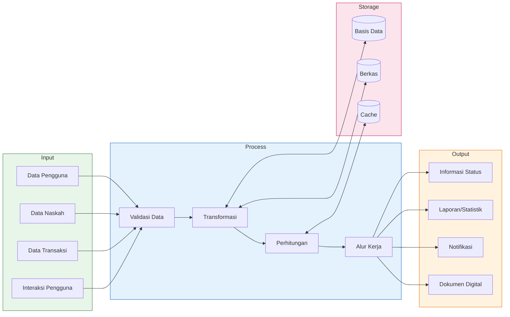

_Gambar 2.1 Komponen Sistem Informasi Publishify_

### 2. Siklus Hidup Pengembangan Sistem

Siklus Hidup Pengembangan Sistem atau _System Development Life Cycle_ (SDLC) merupakan kerangka kerja yang menggambarkan tahapan-tahapan yang harus dilalui dalam mengembangkan sistem informasi dari awal hingga akhir (Pressman & Maxim, 2019). SDLC menyediakan pendekatan yang sistematis dan terstruktur untuk perencanaan, pembuatan, pengujian, dan penerapan sistem informasi.

Terdapat berbagai model SDLC yang telah dikembangkan dan digunakan dalam industri pengembangan perangkat lunak. Beberapa model yang umum digunakan antara lain:

**a. Model Air Terjun (Waterfall Model)**
Model air terjun merupakan pendekatan sekuensial dimana setiap tahap harus diselesaikan sebelum tahap berikutnya dimulai. Model ini cocok untuk proyek dengan kebutuhan yang sudah jelas dan tidak banyak berubah. Kelebihan model ini adalah kemudahan dalam pengelolaan karena tahapan yang jelas, namun kelemahannya adalah kurang fleksibel terhadap perubahan kebutuhan.

**b. Model Iteratif dan Inkremental**
Model ini membagi pengembangan menjadi beberapa iterasi kecil, dimana setiap iterasi menghasilkan peningkatan fungsionalitas sistem. Pendekatan ini memungkinkan umpan balik lebih awal dari pengguna dan penyesuaian yang lebih cepat terhadap perubahan kebutuhan.

**c. Model Spiral**
Model spiral menggabungkan elemen dari model air terjun dan iteratif dengan penekanan khusus pada analisis risiko. Setiap putaran spiral mewakili satu iterasi pengembangan yang mencakup perencanaan, analisis risiko, pengembangan, dan evaluasi.

**d. Model Agile**
Metodologi Agile menekankan pada pengembangan yang adaptif, kolaborasi tim yang erat, dan pengiriman perangkat lunak yang berfungsi secara berkala. Contoh implementasi Agile meliputi Scrum, Kanban, dan Extreme Programming (XP).

**e. Model ADDIE**
Model ADDIE (_Analysis, Design, Development, Implementation, Evaluation_) merupakan kerangka kerja yang awalnya dikembangkan untuk desain instruksional namun telah diadaptasi untuk pengembangan sistem informasi. Model ini dipilih untuk proyek Publishify karena pendekatannya yang sistematis dan penekanan pada evaluasi di setiap tahap.

| Model      | Kelebihan                       | Kekurangan                 | Cocok Untuk                   |
| ---------- | ------------------------------- | -------------------------- | ----------------------------- |
| Air Terjun | Sederhana, terdokumentasi       | Kaku, sulit berubah        | Kebutuhan stabil              |
| Iteratif   | Fleksibel, umpan balik cepat    | Kompleks dalam manajemen   | Kebutuhan berkembang          |
| Spiral     | Manajemen risiko baik           | Mahal, memerlukan keahlian | Proyek besar berisiko         |
| Agile      | Adaptif, kolaboratif            | Kurang dokumentasi         | Tim kecil-menengah            |
| ADDIE      | Sistematis, evaluasi menyeluruh | Memerlukan waktu           | Sistem pembelajaran/informasi |

_Tabel 2.1 Perbandingan Model Siklus Hidup Pengembangan Sistem_

### 3. Metode ADDIE

Metode ADDIE merupakan akronim dari lima tahapan utama dalam proses pengembangan: _Analysis_ (Analisis), _Design_ (Perancangan), _Development_ (Pengembangan), _Implementation_ (Implementasi), dan _Evaluation_ (Evaluasi). Metode ini pertama kali dikembangkan oleh Florida State University untuk program pelatihan militer Amerika Serikat pada tahun 1970-an dan sejak itu telah diadaptasi secara luas dalam berbagai konteks pengembangan sistem dan materi pembelajaran (Branch, 2009).

Dalam konteks pengembangan sistem informasi Publishify, metode ADDIE dipilih karena beberapa alasan strategis. Pertama, pendekatan sistematis yang ditawarkan oleh ADDIE memastikan bahwa setiap aspek pengembangan mendapatkan perhatian yang memadai. Kedua, penekanan pada analisis kebutuhan di awal proses membantu mengidentifikasi persyaratan sistem secara komprehensif sebelum pengembangan dimulai. Ketiga, evaluasi yang terintegrasi di setiap tahap memungkinkan perbaikan berkelanjutan dan memastikan kualitas hasil akhir.

**a. Tahap Analisis (Analysis)**

Tahap analisis merupakan fondasi dari seluruh proses pengembangan sistem. Pada tahap ini, kami melakukan serangkaian aktivitas untuk memahami konteks masalah, kebutuhan pengguna, dan batasan-batasan yang ada. Aktivitas utama dalam tahap analisis meliputi:

- Identifikasi permasalahan yang dihadapi dalam proses penerbitan konvensional
- Analisis kebutuhan fungsional dan non-fungsional untuk masing-masing kategori pengguna
- Identifikasi pemangku kepentingan dan karakteristik pengguna target
- Analisis lingkungan teknologi dan infrastruktur yang tersedia
- Penentuan ruang lingkup dan batasan proyek

Hasil dari tahap analisis menjadi masukan utama untuk tahap perancangan. Dokumentasi analisis mencakup spesifikasi kebutuhan sistem, profil pengguna, dan kendala-kendala yang harus diperhatikan dalam pengembangan.

**b. Tahap Perancangan (Design)**

Tahap perancangan bertujuan untuk mentransformasikan kebutuhan yang telah diidentifikasi menjadi spesifikasi teknis yang dapat diimplementasikan. Pada tahap ini, kami merancang arsitektur sistem, struktur basis data, antarmuka pengguna, dan alur kerja proses bisnis. Aktivitas perancangan meliputi:

- Perancangan arsitektur sistem secara keseluruhan
- Pemodelan basis data menggunakan diagram entitas relasi
- Perancangan antarmuka pengguna dengan memperhatikan prinsip kegunaan
- Pembuatan diagram UML untuk memodelkan berbagai aspek sistem
- Spesifikasi API dan protokol komunikasi antar komponen

Hasil perancangan didokumentasikan dalam bentuk dokumen spesifikasi teknis yang menjadi panduan dalam tahap pengembangan.

**c. Tahap Pengembangan (Development)**

Tahap pengembangan merupakan tahap implementasi teknis dimana rancangan diterjemahkan menjadi kode program yang berfungsi. Pada tahap ini, kami mengembangkan komponen-komponen sistem sesuai dengan spesifikasi yang telah ditetapkan. Aktivitas pengembangan meliputi:

- Pembuatan struktur basis data dan migrasi skema
- Pengembangan layanan backend dengan API RESTful
- Pengembangan antarmuka frontend untuk platform web
- Pengembangan aplikasi seluler menggunakan Flutter
- Integrasi antar komponen sistem
- Pengujian unit untuk memvalidasi fungsionalitas komponen

**d. Tahap Implementasi (Implementation)**

Tahap implementasi mencakup aktivitas penyebaran sistem ke lingkungan produksi dan persiapan sistem untuk digunakan oleh pengguna akhir. Aktivitas pada tahap ini meliputi:

- Konfigurasi server dan infrastruktur produksi
- Penyebaran basis data dan layanan backend
- Penyebaran aplikasi frontend dan seluler
- Pengaturan keamanan dan akses sistem
- Pelatihan pengguna dan dokumentasi

**e. Tahap Evaluasi (Evaluation)**

Tahap evaluasi dilakukan secara berkelanjutan sepanjang proses pengembangan dan juga sebagai tahap akhir untuk menilai keberhasilan sistem. Evaluasi mencakup:

- Pengujian fungsional untuk memvalidasi kesesuaian dengan kebutuhan
- Pengujian kegunaan untuk menilai kemudahan penggunaan
- Pengujian kinerja untuk memastikan respons sistem yang memadai
- Pengumpulan umpan balik dari pengguna
- Identifikasi area perbaikan untuk pengembangan selanjutnya

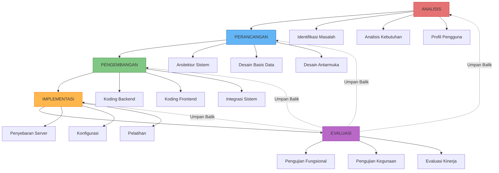

_Gambar 2.2 Tahapan Metode ADDIE dalam Pengembangan Sistem Publishify_

---

## B. Pemodelan Sistem

### 1. Unified Modeling Language (UML)

Unified Modeling Language (UML) merupakan bahasa pemodelan visual standar yang digunakan untuk menspesifikasikan, memvisualisasikan, membangun, dan mendokumentasikan artefak dari sistem perangkat lunak (Booch, Rumbaugh, & Jacobson, 2017). UML menyediakan seperangkat notasi grafis yang memungkinkan pengembang untuk berkomunikasi tentang desain sistem secara efektif.

Dalam pengembangan sistem Publishify, kami menggunakan delapan jenis diagram UML yang relevan untuk memodelkan berbagai aspek sistem:

| No  | Jenis Diagram            | Kategori | Kegunaan                                                  |
| --- | ------------------------ | -------- | --------------------------------------------------------- |
| 1   | Diagram Kasus Penggunaan | Perilaku | Memodelkan fungsionalitas sistem dari perspektif pengguna |
| 2   | Diagram Aktivitas        | Perilaku | Memodelkan alur kerja dan proses bisnis                   |
| 3   | Diagram Sekuensial       | Perilaku | Memodelkan interaksi antar objek dalam urutan waktu       |
| 4   | Diagram Kelas            | Struktur | Memodelkan struktur statis sistem                         |
| 5   | Diagram Entitas Relasi   | Struktur | Memodelkan struktur basis data                            |
| 6   | Diagram Komponen         | Struktur | Memodelkan organisasi komponen sistem                     |
| 7   | Diagram Penyebaran       | Struktur | Memodelkan infrastruktur fisik sistem                     |
| 8   | Diagram Status           | Perilaku | Memodelkan transisi status objek                          |

_Tabel 2.2 Jenis Diagram UML yang Digunakan dalam Proyek Publishify_

### 2. Diagram Kasus Penggunaan (Use Case Diagram)

Diagram kasus penggunaan menggambarkan fungsionalitas sistem dari perspektif pengguna eksternal. Diagram ini mengidentifikasi aktor-aktor yang berinteraksi dengan sistem dan kasus-kasus penggunaan yang dapat mereka lakukan.

**Aktor dalam Sistem Publishify:**

| Aktor         | Deskripsi                                     | Kasus Penggunaan Utama                           |
| ------------- | --------------------------------------------- | ------------------------------------------------ |
| Penulis       | Pengguna yang mengunggah dan mengelola naskah | Kelola naskah, ajukan review, pesan cetak        |
| Editor        | Pengguna yang melakukan peninjauan editorial  | Kelola antrian review, berikan umpan balik       |
| Percetakan    | Pengguna yang mengelola pesanan cetak         | Konfirmasi pesanan, kelola produksi              |
| Administrator | Pengguna yang mengelola sistem                | Kelola pengguna, tugaskan editor, monitor sistem |
| Sistem        | Aktor internal untuk proses otomatis          | Kirim notifikasi, perbarui status                |

_Tabel 2.3 Deskripsi Aktor dalam Sistem Publishify_

```mermaid
graph TB
    subgraph Sistem Publishify
        UC1[Daftar Akun]
        UC2[Masuk Sistem]
        UC3[Kelola Profil]
        UC4[Unggah Naskah]
        UC5[Kelola Naskah]
        UC6[Ajukan Review]
        UC7[Lihat Status Naskah]
        UC8[Pesan Cetak]
        UC9[Kelola Antrian Review]
        UC10[Berikan Umpan Balik]
        UC11[Submit Rekomendasi]
        UC12[Konfirmasi Pesanan]
        UC13[Perbarui Status Produksi]
        UC14[Kelola Pengiriman]
        UC15[Kelola Pengguna]
        UC16[Tugaskan Editor]
        UC17[Monitor Sistem]
        UC18[Terima Notifikasi]
    end

    Penulis((Penulis)) --> UC1
    Penulis --> UC2
    Penulis --> UC3
    Penulis --> UC4
    Penulis --> UC5
    Penulis --> UC6
    Penulis --> UC7
    Penulis --> UC8
    Penulis --> UC18

    Editor((Editor)) --> UC2
    Editor --> UC3
    Editor --> UC9
    Editor --> UC10
    Editor --> UC11
    Editor --> UC18

    Percetakan((Percetakan)) --> UC2
    Percetakan --> UC3
    Percetakan --> UC12
    Percetakan --> UC13
    Percetakan --> UC14
    Percetakan --> UC18

    Admin((Administrator)) --> UC2
    Admin --> UC15
    Admin --> UC16
    Admin --> UC17
```

_Gambar 2.3 Diagram Kasus Penggunaan Sistem Publishify_

_[Catatan: Untuk dokumen cetak, konversi diagram Mermaid ke format gambar menggunakan tools seperti mermaid.live atau plugin Mermaid di VS Code]_

### 3. Diagram Aktivitas (Activity Diagram)

Diagram aktivitas digunakan untuk memodelkan alur kerja proses bisnis dalam sistem. Diagram ini menunjukkan urutan aktivitas dan keputusan yang terjadi dalam suatu proses.

**Diagram Aktivitas: Proses Pengelolaan Naskah**

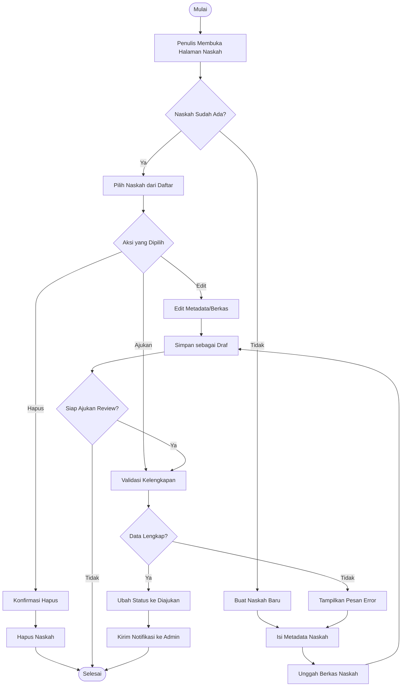

_Gambar 2.4 Diagram Aktivitas Proses Pengelolaan Naskah_

**Diagram Aktivitas: Proses Peninjauan Editorial**

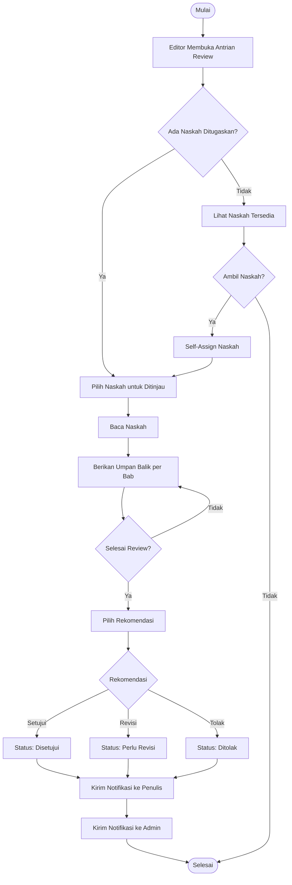

_Gambar 2.5 Diagram Aktivitas Proses Peninjauan Editorial_

### 4. Diagram Sekuensial (Sequence Diagram)

Diagram sekuensial menggambarkan interaksi antar objek dalam sistem berdasarkan urutan waktu. Diagram ini sangat berguna untuk memahami bagaimana komponen sistem berkomunikasi satu sama lain.

**Diagram Sekuensial: Proses Pendaftaran Pengguna**

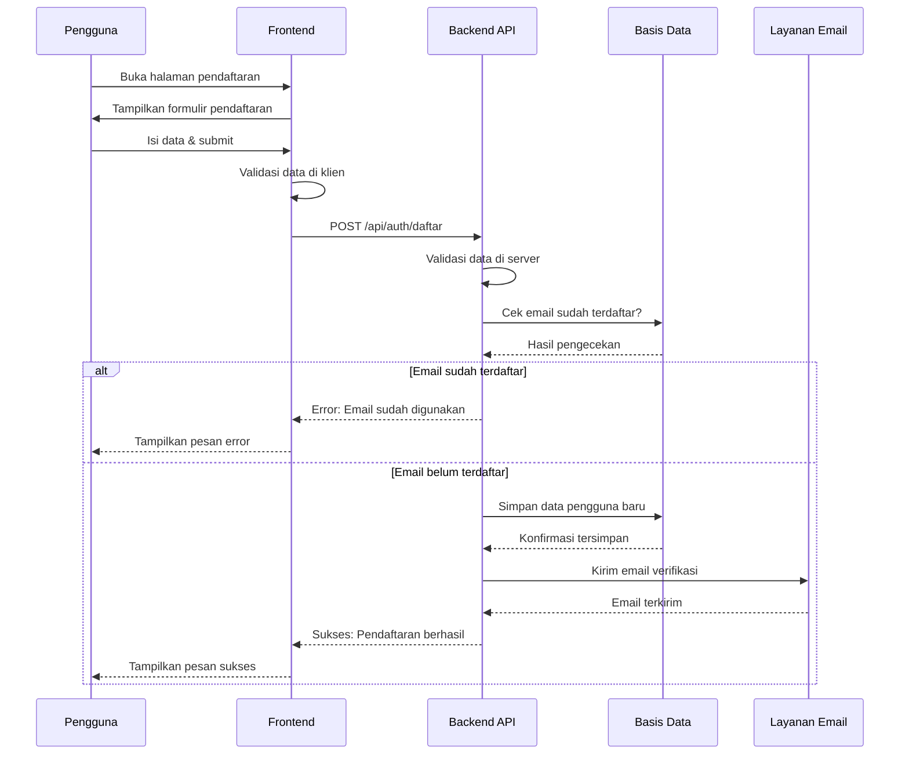

_Gambar 2.6 Diagram Sekuensial Proses Pendaftaran Pengguna_

**Diagram Sekuensial: Proses Pengajuan Naskah untuk Review**

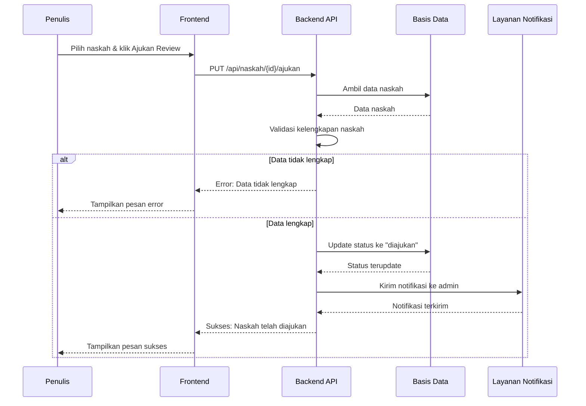

_Gambar 2.7 Diagram Sekuensial Proses Pengajuan Naskah_

### 5. Diagram Kelas (Class Diagram)

Diagram kelas menggambarkan struktur statis sistem dengan menunjukkan kelas-kelas, atribut-atributnya, metode-metodenya, dan hubungan antar kelas.

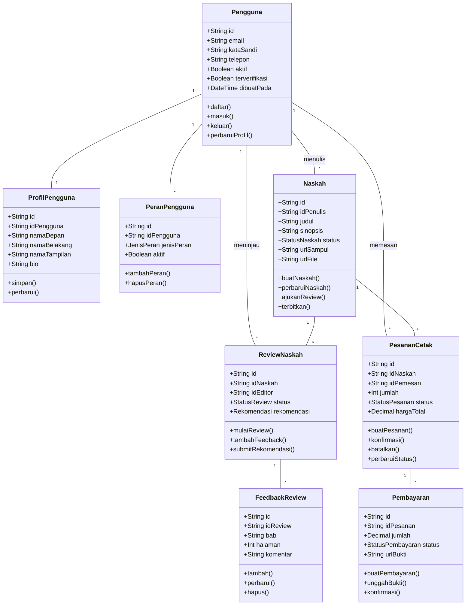

_Gambar 2.8 Diagram Kelas Sistem Publishify (Sebagian)_

### 6. Diagram Entitas Relasi (Entity Relationship Diagram)

Diagram Entitas Relasi menggambarkan struktur logis dari basis data, menunjukkan entitas-entitas, atribut-atributnya, dan hubungan antar entitas.

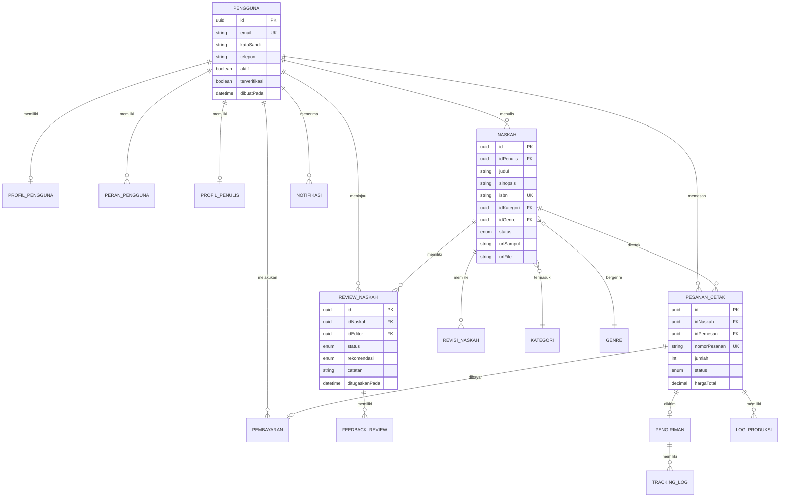

_Gambar 2.9 Diagram Entitas Relasi Basis Data Publishify_

_[Catatan: Untuk detail lengkap struktur basis data, lihat file `/backend/prisma/schema.prisma`]_

### 7. Diagram Komponen (Component Diagram)

Diagram komponen menggambarkan organisasi dan ketergantungan antar komponen dalam sistem.

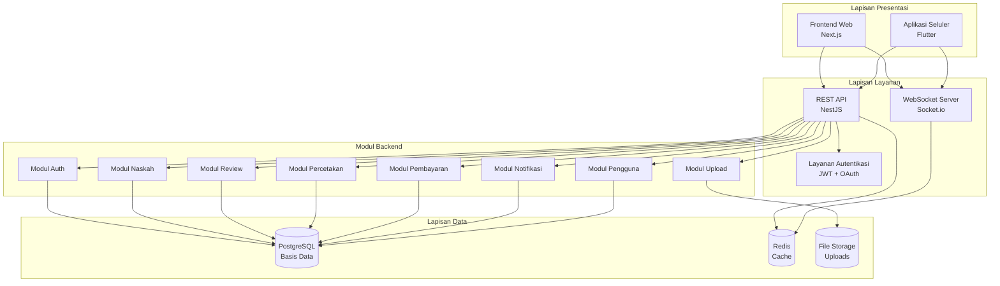

_Gambar 2.10 Diagram Komponen Arsitektur Sistem Publishify_

### 8. Diagram Penyebaran (Deployment Diagram)

Diagram penyebaran menggambarkan konfigurasi runtime dari node pemrosesan dan komponen yang ada di dalamnya.

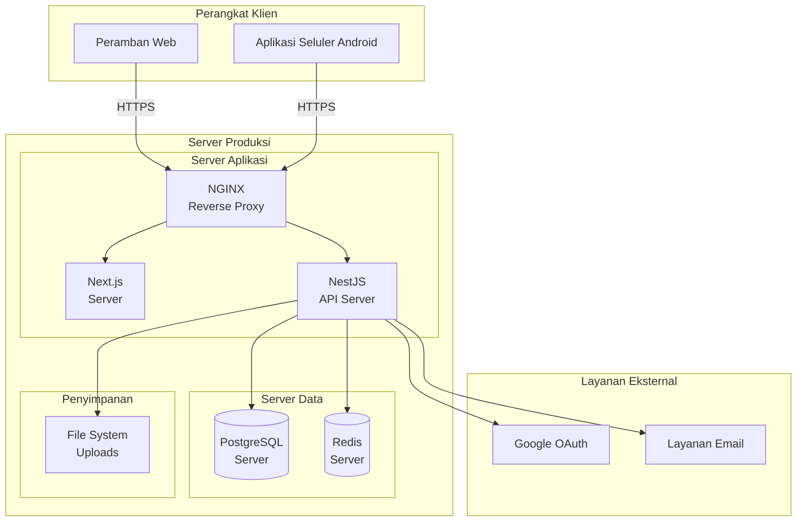

_Gambar 2.11 Diagram Penyebaran Infrastruktur Sistem Publishify_

---

## C. Interaksi Manusia dan Sistem

### 1. Konsep Dasar Interaksi Manusia dan Komputer

Interaksi Manusia dan Komputer atau _Human-Computer Interaction_ (HCI) merupakan disiplin ilmu yang mempelajari perancangan, evaluasi, dan implementasi sistem komputer interaktif untuk digunakan oleh manusia, serta studi tentang fenomena-fenomena utama yang melingkupinya (Hewett et al., dalam ACM SIGCHI, 1992). Dalam konteks pengembangan sistem Publishify, pemahaman tentang HCI menjadi sangat penting untuk memastikan bahwa sistem yang dikembangkan dapat digunakan dengan mudah, efisien, dan memberikan pengalaman yang menyenangkan bagi pengguna.

Menurut Dix et al. (2004), tujuan utama dari HCI adalah untuk menghasilkan sistem yang dapat digunakan (_usable_), aman (_safe_), dan fungsional (_functional_). Ketiga aspek ini saling terkait dan harus diperhatikan secara seimbang dalam perancangan sistem. Sistem yang fungsional namun sulit digunakan akan mengakibatkan frustrasi pengguna dan rendahnya tingkat adopsi. Sebaliknya, sistem yang mudah digunakan namun kurang fungsional tidak akan memenuhi kebutuhan pengguna secara memadai.

**Komponen-komponen utama dalam HCI meliputi:**

**a. Pengguna (User)**
Pengguna merupakan pusat dari seluruh proses perancangan HCI. Pemahaman yang mendalam tentang karakteristik pengguna, termasuk kemampuan kognitif, pengalaman, dan preferensi mereka, sangat penting untuk menghasilkan desain yang sesuai. Dalam sistem Publishify, kami mengidentifikasi empat kategori pengguna utama dengan karakteristik yang berbeda-beda.

**b. Tugas (Task)**
Tugas merujuk pada aktivitas-aktivitas yang ingin dicapai pengguna dengan menggunakan sistem. Analisis tugas membantu mengidentifikasi kebutuhan fungsional dan merancang alur interaksi yang efisien.

**c. Konteks (Context)**
Konteks mencakup lingkungan fisik, sosial, dan organisasional dimana interaksi terjadi. Pemahaman konteks membantu merancang sistem yang sesuai dengan kondisi penggunaan yang sebenarnya.

**d. Teknologi (Technology)**
Teknologi meliputi perangkat keras dan perangkat lunak yang digunakan untuk mewujudkan interaksi. Pemilihan teknologi yang tepat mempengaruhi kemampuan dan batasan sistem yang dapat dikembangkan.

### 2. Prinsip Desain Antarmuka Pengguna

Dalam merancang antarmuka pengguna sistem Publishify, kami mengadopsi prinsip-prinsip desain yang telah ditetapkan oleh para ahli HCI. Prinsip-prinsip ini menjadi panduan dalam setiap keputusan desain yang kami ambil.

**a. Visibilitas (Visibility)**
Prinsip visibilitas menyatakan bahwa elemen-elemen penting dalam sistem harus terlihat dengan jelas sehingga pengguna dapat memahami pilihan yang tersedia. Dalam Publishify, kami menerapkan prinsip ini dengan menampilkan menu navigasi yang konsisten, tombol aksi yang jelas, dan indikator status yang mudah dipahami.

**b. Umpan Balik (Feedback)**
Sistem harus memberikan umpan balik yang informatif terhadap setiap aksi pengguna. Umpan balik dapat berupa visual, auditori, atau kombinasi keduanya. Dalam Publishify, setiap aksi pengguna seperti pengunggahan berkas, pengiriman formulir, atau perubahan status memberikan umpan balik melalui notifikasi, animasi, atau perubahan tampilan.

**c. Konsistensi (Consistency)**
Konsistensi dalam desain membantu pengguna mempelajari sistem dengan lebih cepat dan mengurangi kesalahan. Konsistensi diterapkan dalam hal terminologi, tata letak, warna, dan perilaku interaksi. Sistem Publishify menggunakan pustaka komponen yang konsisten di seluruh halaman dan platform.

**d. Pencegahan Kesalahan (Error Prevention)**
Desain yang baik harus mencegah terjadinya kesalahan daripada hanya mengandalkan penanganan kesalahan setelah terjadi. Dalam Publishify, kami menerapkan validasi input secara real-time, konfirmasi untuk aksi destruktif, dan pembatasan input untuk mengurangi kemungkinan kesalahan.

**e. Pengenalan daripada Mengingat (Recognition over Recall)**
Pengguna seharusnya tidak perlu mengingat informasi dari satu bagian dialog ke bagian lainnya. Informasi yang diperlukan untuk penggunaan harus terlihat atau mudah diambil. Dalam Publishify, kami menggunakan menu dropdown, autocomplete, dan tampilan status yang informatif.

| Prinsip              | Implementasi dalam Publishify                |
| -------------------- | -------------------------------------------- |
| Visibilitas          | Menu navigasi permanen, tombol aksi kontras  |
| Umpan Balik          | Notifikasi toast, indikator loading          |
| Konsistensi          | Komponen UI shadcn/ui, skema warna konsisten |
| Pencegahan Kesalahan | Validasi real-time, dialog konfirmasi        |
| Pengenalan           | Dropdown, autocomplete, breadcrumb           |

_Tabel 2.4 Implementasi Prinsip Desain Antarmuka dalam Publishify_

### 3. Kegunaan Sistem Web

Kegunaan (_usability_) sistem web mengacu pada sejauh mana sistem web dapat digunakan oleh pengguna tertentu untuk mencapai tujuan tertentu dengan efektivitas, efisiensi, dan kepuasan dalam konteks penggunaan yang ditentukan (ISO 9241-11). Dalam pengembangan frontend web Publishify menggunakan Next.js, kami memperhatikan beberapa aspek kegunaan utama:

**a. Navigasi yang Intuitif**
Struktur navigasi dirancang dengan hierarki yang jelas dan dapat diprediksi. Pengguna dapat dengan mudah menemukan fitur yang mereka butuhkan tanpa harus mencari-cari. Sistem menggunakan sidebar untuk navigasi utama, breadcrumb untuk menunjukkan posisi dalam hierarki, dan menu dropdown untuk opsi tambahan.

**b. Responsivitas**
Antarmuka web dirancang untuk dapat menyesuaikan dengan berbagai ukuran layar, dari desktop hingga tablet. Penggunaan Tailwind CSS memungkinkan implementasi desain responsif yang efisien. Komponen-komponen UI secara otomatis menyesuaikan tata letak berdasarkan lebar viewport.

**c. Waktu Muat yang Optimal**
Kinerja menjadi faktor penting dalam kegunaan web. Next.js dengan fitur Server-Side Rendering (SSR) dan Static Site Generation (SSG) membantu mengoptimalkan waktu muat halaman. Penggunaan cache dan lazy loading untuk gambar dan komponen berat juga diterapkan.

**d. Aksesibilitas**
Sistem dirancang dengan memperhatikan standar aksesibilitas web (WCAG). Penggunaan label yang tepat, kontras warna yang memadai, dan dukungan navigasi keyboard menjadi pertimbangan dalam setiap keputusan desain.

### 4. Kegunaan Aplikasi Seluler

Pengembangan aplikasi seluler menggunakan Flutter memiliki pertimbangan kegunaan yang berbeda dengan aplikasi web. Beberapa aspek khusus yang kami perhatikan meliputi:

**a. Desain Material dan Cupertino**
Aplikasi seluler Publishify mengadopsi panduan desain Material Design dari Google yang telah menjadi standar dalam pengembangan aplikasi Android. Hal ini memastikan konsistensi dengan ekspektasi pengguna terhadap aplikasi seluler pada umumnya.

**b. Gesture dan Touch Interaction**
Antarmuka seluler dirancang dengan mempertimbangkan interaksi berbasis sentuhan. Ukuran tombol dan area sentuh memenuhi standar minimum 48x48 dp untuk memastikan kemudahan interaksi dengan jari.

**c. Navigasi Seluler**
Pola navigasi mengikuti konvensi aplikasi seluler dengan menggunakan bottom navigation bar untuk navigasi utama dan stack-based navigation untuk alur dalam fitur. Transisi antar halaman menggunakan animasi yang halus untuk memberikan konteks kepada pengguna.

**d. Offline Capability**
Meskipun sistem utamanya memerlukan koneksi internet, aplikasi seluler dirancang untuk memberikan pengalaman yang baik dalam kondisi koneksi yang tidak stabil. Pesan error yang informatif dan mekanisme retry diterapkan untuk menangani kegagalan koneksi.

---

## D. Kerangka Pengembangan Sistem

### 1. Kerangka Pengembangan Aplikasi Web

Pengembangan aplikasi web Publishify mengikuti kerangka kerja yang terstruktur dengan pembagian tanggung jawab yang jelas antara frontend dan backend.

```mermaid
flowchart TD
    subgraph "Tahap 1: Persiapan"
        A1[Inisialisasi Proyek] --> A2[Setup Next.js + TypeScript]
        A2 --> A3[Konfigurasi Tailwind CSS]
        A3 --> A4[Setup shadcn/ui]
        A4 --> A5[Konfigurasi ESLint + Prettier]
    end

    subgraph "Tahap 2: Backend Development"
        B1[Setup NestJS Project] --> B2[Konfigurasi Prisma ORM]
        B2 --> B3[Desain Skema Database]
        B3 --> B4[Implementasi Modul Auth]
        B4 --> B5[Implementasi Modul Bisnis]
        B5 --> B6[Setup WebSocket]
        B6 --> B7[Dokumentasi API Swagger]
    end

    subgraph "Tahap 3: Frontend Development"
        C1[Buat Layout & Navigation] --> C2[Implementasi Halaman Auth]
        C2 --> C3[Implementasi Dashboard per Role]
        C3 --> C4[Integrasi dengan Backend API]
        C4 --> C5[Implementasi State Management]
        C5 --> C6[Testing & Debugging]
    end

    subgraph "Tahap 4: Integrasi & Testing"
        D1[End-to-End Testing] --> D2[Performance Testing]
        D2 --> D3[Security Testing]
        D3 --> D4[UAT - User Acceptance Testing]
    end

    subgraph "Tahap 5: Deployment"
        E1[Setup Server Produksi] --> E2[Konfigurasi Database]
        E2 --> E3[Deploy Backend]
        E3 --> E4[Deploy Frontend]
        E4 --> E5[Monitoring & Maintenance]
    end

    A5 --> B1
    B7 --> C1
    C6 --> D1
    D4 --> E1
```

_Gambar 2.12 Diagram Alir Kerangka Pengembangan Aplikasi Web_

### 2. Kerangka Pengembangan Aplikasi Seluler

Pengembangan aplikasi seluler Flutter terintegrasi dengan backend yang sama namun memiliki tahapan pengembangan tersendiri.

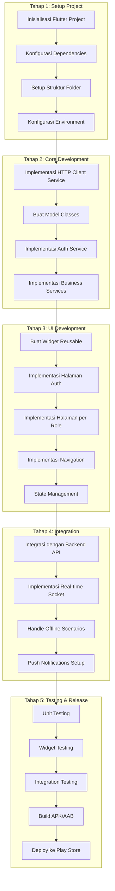

_Gambar 2.13 Diagram Alir Kerangka Pengembangan Aplikasi Seluler_

---

_[Catatan untuk penempatan kode sumber dan tangkapan layar:]_

| Referensi         | Lokasi Berkas                   | Keterangan                          |
| ----------------- | ------------------------------- | ----------------------------------- |
| Gambar 2.1 - 2.13 | Diagram Mermaid di atas         | Konversi ke PNG untuk dokumen cetak |
| Kode 2.1          | `/backend/prisma/schema.prisma` | Skema basis data lengkap            |
| Kode 2.2          | `/backend/src/modules/`         | Struktur modul backend              |
| Kode 2.3          | `/frontend/app/`                | Struktur halaman frontend           |
| Kode 2.4          | `/mobile/lib/services/`         | Struktur layanan aplikasi seluler   |
