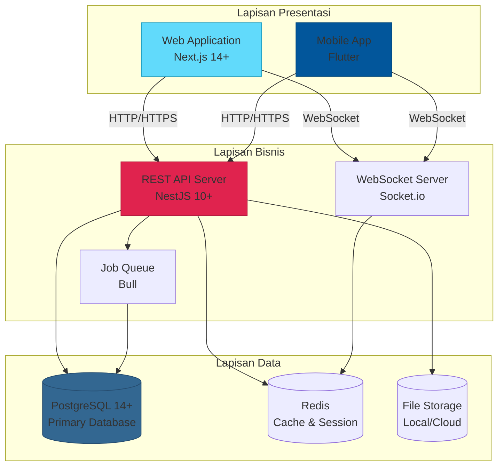
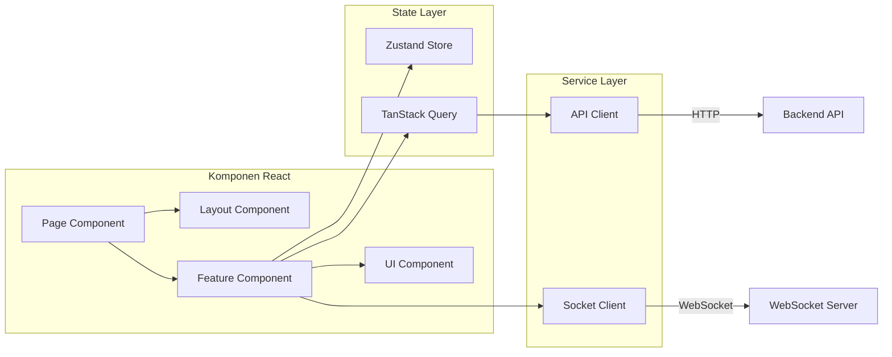
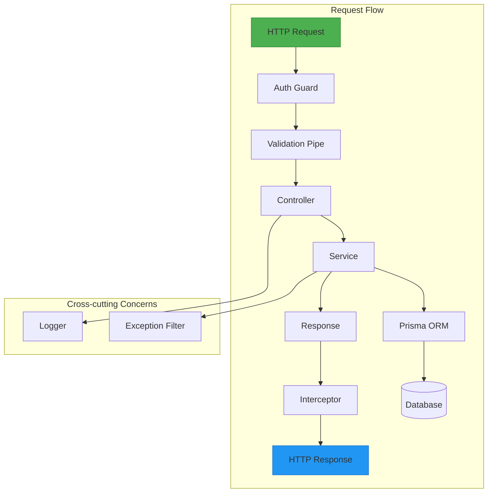
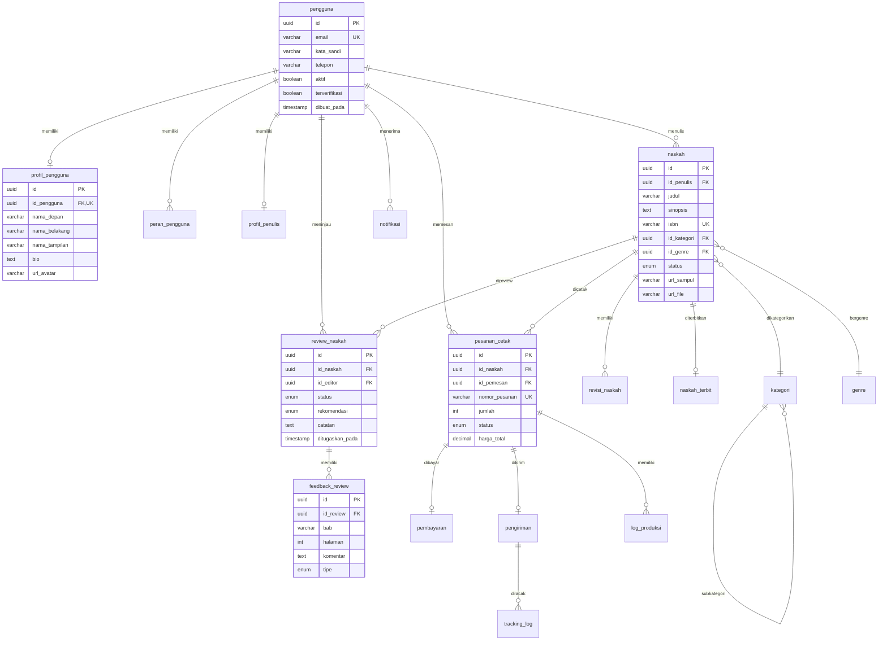
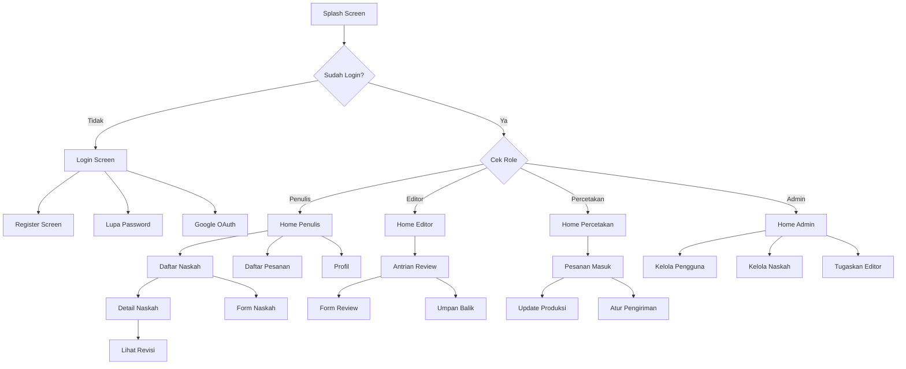

# BAB III

# PERANCANGAN SISTEM

---

## A. Arsitektur Sistem Web

### 1. Gambaran Umum Arsitektur

Arsitektur sistem web Publishify dirancang menggunakan pola arsitektur _three-tier_ yang memisahkan tanggung jawab antara lapisan presentasi, lapisan bisnis, dan lapisan data. Pemisahan ini memberikan fleksibilitas dalam pengembangan, pemeliharaan, dan skalabilitas sistem.

Dalam implementasinya, kami mengadopsi pendekatan _monorepo_ dimana seluruh kode sumber untuk frontend, backend, dan aplikasi seluler berada dalam satu repositori yang sama namun dalam direktori yang terpisah. Pendekatan ini memudahkan koordinasi perubahan lintas komponen dan memastikan konsistensi versi antar bagian sistem.



_Gambar 3.1 Diagram Arsitektur Three-Tier Sistem Publishify_

### 2. Arsitektur Frontend (Next.js)

Frontend web Publishify dikembangkan menggunakan Next.js versi 14 dengan App Router yang merupakan paradigma routing terbaru dari framework tersebut. Pemilihan Next.js didasarkan pada kebutuhan akan kemampuan Server-Side Rendering (SSR), Static Site Generation (SSG), dan fitur-fitur modern seperti Server Components dan streaming.

**Struktur direktori frontend mengikuti konvensi berikut:**

```
frontend/
├── app/                    # App Router - Halaman dan Layout
│   ├── (auth)/            # Route Group - Halaman Autentikasi
│   │   ├── login/         # Halaman Login
│   │   └── register/      # Halaman Registrasi
│   ├── (dashboard)/       # Route Group - Dashboard per Role
│   │   ├── penulis/       # Dashboard Penulis
│   │   ├── editor/        # Dashboard Editor
│   │   ├── percetakan/    # Dashboard Percetakan
│   │   └── admin/         # Dashboard Administrator
│   ├── layout.tsx         # Root Layout
│   └── page.tsx           # Halaman Beranda
├── components/            # Komponen React
│   ├── ui/               # Komponen UI Dasar (shadcn/ui)
│   ├── forms/            # Komponen Formulir
│   ├── layouts/          # Komponen Layout
│   └── modules/          # Komponen per Fitur
├── hooks/                # Custom React Hooks
├── lib/                  # Utilitas dan Konfigurasi
│   ├── api/             # Klien API
│   └── utils/           # Fungsi Utilitas
├── stores/              # State Management (Zustand)
└── types/               # TypeScript Type Definitions
```

_Gambar 3.2 Struktur Direktori Frontend Web_

**Pola arsitektur yang diterapkan dalam frontend:**

**a. Component-Based Architecture**
Seluruh antarmuka pengguna dibangun dari komponen-komponen kecil yang dapat digunakan kembali. Komponen dibagi menjadi beberapa kategori berdasarkan tingkat abstraksinya: komponen UI dasar, komponen komposit, dan komponen halaman.

**b. State Management dengan Zustand**
Pengelolaan state global menggunakan Zustand yang menawarkan API yang sederhana namun powerful. State dibagi berdasarkan domain seperti auth state, UI state, dan data state.

**c. Data Fetching dengan TanStack Query**
Pengambilan dan pengelolaan data dari server menggunakan TanStack Query (React Query) yang menyediakan fitur caching, invalidation, dan optimistic updates.



_Gambar 3.3 Diagram Arsitektur Frontend Web_

### 3. Arsitektur Backend (NestJS)

Backend sistem Publishify dibangun menggunakan NestJS yang merupakan framework Node.js progresif untuk membangun aplikasi server-side yang efisien dan skalabel. NestJS mengadopsi pola arsitektur modular yang terinspirasi dari Angular, memungkinkan organisasi kode yang bersih dan pemisahan tanggung jawab yang jelas.

**Struktur direktori backend mengikuti konvensi berikut:**

```
backend/
├── src/
│   ├── modules/           # Modul-modul Bisnis
│   │   ├── auth/         # Modul Autentikasi
│   │   ├── pengguna/     # Modul Manajemen Pengguna
│   │   ├── naskah/       # Modul Manajemen Naskah
│   │   ├── review/       # Modul Review Editorial
│   │   ├── percetakan/   # Modul Percetakan
│   │   ├── pembayaran/   # Modul Pembayaran
│   │   ├── notifikasi/   # Modul Notifikasi
│   │   └── upload/       # Modul Unggah Berkas
│   ├── common/           # Komponen Bersama
│   │   ├── decorators/   # Custom Decorators
│   │   ├── filters/      # Exception Filters
│   │   ├── guards/       # Auth & Role Guards
│   │   ├── interceptors/ # Logging & Transform
│   │   └── pipes/        # Validation Pipes
│   ├── config/           # Konfigurasi Aplikasi
│   ├── prisma/           # Prisma Service & Module
│   └── main.ts           # Entry Point
├── prisma/
│   ├── schema.prisma     # Database Schema
│   ├── migrations/       # Migration Files
│   └── seed.ts           # Seed Data
└── uploads/              # File Storage
```

_Gambar 3.4 Struktur Direktori Backend_

**Komponen-komponen arsitektur backend:**

**a. Modul (Module)**
Setiap modul merepresentasikan satu domain bisnis dan berisi controller, service, dan DTO yang terkait. Modul-modul dapat saling berinteraksi melalui mekanisme dependency injection.

**b. Kontroler (Controller)**
Controller bertanggung jawab menangani request HTTP dan mendelegasikan logika bisnis ke service. Setiap endpoint API didefinisikan dalam controller dengan dekorator yang sesuai.

**c. Layanan (Service)**
Service berisi logika bisnis utama dan berinteraksi dengan layer data melalui Prisma ORM. Service dapat memanggil service lain untuk operasi yang melibatkan beberapa domain.

**d. Guard dan Interceptor**
Guard digunakan untuk autentikasi dan otorisasi, memastikan hanya pengguna yang berwenang yang dapat mengakses endpoint tertentu. Interceptor digunakan untuk logging, transformasi response, dan penanganan error.



_Gambar 3.5 Diagram Alur Request Backend_

---

## B. Perancangan Basis Data

### 1. Model Konseptual

Model konseptual basis data Publishify dirancang untuk mendukung seluruh proses bisnis penerbitan naskah. Berdasarkan analisis kebutuhan, kami mengidentifikasi tujuh domain utama yang masing-masing memiliki entitas-entitas terkait:

| Domain             | Entitas Utama                   | Jumlah Tabel |
| ------------------ | ------------------------------- | ------------ |
| Manajemen Pengguna | Pengguna, Profil, Peran         | 4            |
| Manajemen Konten   | Naskah, Kategori, Genre, Revisi | 8            |
| Sistem Review      | Review, Feedback, Penugasan     | 3            |
| Percetakan         | Pesanan, Produksi, Pengiriman   | 5            |
| Pembayaran         | Transaksi, Riwayat              | 2            |
| Notifikasi         | Notifikasi, Template            | 2            |
| Autentikasi        | Token, Sesi, Log                | 3            |

_Tabel 3.1 Domain dan Entitas dalam Basis Data Publishify_

### 2. Model Fisik

Model fisik basis data diimplementasikan menggunakan PostgreSQL dengan skema yang didefinisikan melalui Prisma ORM. Berikut adalah spesifikasi tabel-tabel utama dalam sistem:

**Tabel Pengguna (pengguna)**

| Kolom           | Tipe Data    | Constraint       | Deskripsi                |
| --------------- | ------------ | ---------------- | ------------------------ |
| id              | UUID         | PRIMARY KEY      | Identifier unik          |
| email           | VARCHAR(255) | UNIQUE, NOT NULL | Alamat email             |
| kata_sandi      | VARCHAR(255) | NOT NULL         | Password terenkripsi     |
| telepon         | VARCHAR(20)  | -                | Nomor telepon            |
| aktif           | BOOLEAN      | DEFAULT true     | Status aktif             |
| terverifikasi   | BOOLEAN      | DEFAULT false    | Status verifikasi email  |
| dibuat_pada     | TIMESTAMP    | DEFAULT now()    | Waktu pembuatan          |
| diperbarui_pada | TIMESTAMP    | -                | Waktu pembaruan terakhir |

_Tabel 3.2 Struktur Tabel Pengguna_

**Tabel Naskah (naskah)**

| Kolom       | Tipe Data    | Constraint      | Deskripsi              |
| ----------- | ------------ | --------------- | ---------------------- |
| id          | UUID         | PRIMARY KEY     | Identifier unik        |
| id_penulis  | UUID         | FOREIGN KEY     | Referensi ke pengguna  |
| judul       | VARCHAR(255) | NOT NULL        | Judul naskah           |
| sub_judul   | VARCHAR(255) | -               | Sub judul              |
| sinopsis    | TEXT         | NOT NULL        | Sinopsis naskah        |
| isbn        | VARCHAR(20)  | UNIQUE          | ISBN jika sudah terbit |
| id_kategori | UUID         | FOREIGN KEY     | Referensi ke kategori  |
| id_genre    | UUID         | FOREIGN KEY     | Referensi ke genre     |
| status      | ENUM         | DEFAULT 'draft' | Status naskah          |
| url_sampul  | VARCHAR(500) | -               | URL gambar sampul      |
| url_file    | VARCHAR(500) | -               | URL berkas naskah      |
| publik      | BOOLEAN      | DEFAULT false   | Visibilitas publik     |

_Tabel 3.3 Struktur Tabel Naskah_

**Tabel Review Naskah (review_naskah)**

| Kolom           | Tipe Data | Constraint           | Deskripsi                    |
| --------------- | --------- | -------------------- | ---------------------------- |
| id              | UUID      | PRIMARY KEY          | Identifier unik              |
| id_naskah       | UUID      | FOREIGN KEY          | Referensi ke naskah          |
| id_editor       | UUID      | FOREIGN KEY          | Referensi ke pengguna editor |
| status          | ENUM      | DEFAULT 'ditugaskan' | Status review                |
| rekomendasi     | ENUM      | -                    | Hasil rekomendasi            |
| catatan         | TEXT      | -                    | Catatan keseluruhan          |
| ditugaskan_pada | TIMESTAMP | DEFAULT now()        | Waktu penugasan              |
| dimulai_pada    | TIMESTAMP | -                    | Waktu mulai review           |
| selesai_pada    | TIMESTAMP | -                    | Waktu selesai review         |

_Tabel 3.4 Struktur Tabel Review Naskah_

### 3. Diagram Entitas Relasi Detail



_Gambar 3.6 Diagram Entitas Relasi Detail Basis Data Publishify_

_[Catatan: Untuk spesifikasi lengkap skema basis data, lihat file `/backend/prisma/schema.prisma`]_

---

## C. Perancangan Antarmuka Pengguna

### 1. Desain Sistem (Design System)

Publishify menggunakan _design system_ yang konsisten untuk memastikan keseragaman tampilan dan pengalaman pengguna di seluruh platform. Design system ini mencakup definisi warna, tipografi, spacing, dan komponen-komponen UI dasar.

**Palet Warna:**

| Nama       | Kode Hex | Penggunaan                            |
| ---------- | -------- | ------------------------------------- |
| Primary    | #6366F1  | Tombol utama, link, elemen interaktif |
| Secondary  | #8B5CF6  | Tombol sekunder, aksen                |
| Success    | #10B981  | Status sukses, konfirmasi             |
| Warning    | #F59E0B  | Peringatan, status pending            |
| Danger     | #EF4444  | Error, hapus, tindakan destruktif     |
| Neutral    | #6B7280  | Teks sekunder, border                 |
| Background | #F9FAFB  | Latar belakang halaman                |
| Surface    | #FFFFFF  | Kartu, modal, panel                   |

_Tabel 3.5 Palet Warna Design System Publishify_

**Tipografi:**

| Elemen    | Font  | Ukuran | Bobot    |
| --------- | ----- | ------ | -------- |
| Heading 1 | Inter | 36px   | Bold     |
| Heading 2 | Inter | 30px   | Bold     |
| Heading 3 | Inter | 24px   | Semibold |
| Body      | Inter | 16px   | Normal   |
| Small     | Inter | 14px   | Normal   |
| Caption   | Inter | 12px   | Normal   |

_Tabel 3.6 Spesifikasi Tipografi_

### 2. Wireframe Halaman Utama

**Wireframe Dashboard Penulis:**

```
┌────────────────────────────────────────────────────────────────┐
│  [Logo]  Publishify           🔔  👤 Nama Penulis  ▼           │
├────────────────────────────────────────────────────────────────┤
│ ┌──────────┐                                                   │
│ │ Beranda  │  ┌────────────────────────────────────────────┐  │
│ │ Naskah   │  │              SELAMAT DATANG               │  │
│ │ Review   │  │          Dashboard Penulis                │  │
│ │ Pesanan  │  └────────────────────────────────────────────┘  │
│ │ Profil   │                                                   │
│ └──────────┘  ┌─────────┐ ┌─────────┐ ┌─────────┐ ┌─────────┐  │
│               │   12    │ │    3    │ │    2    │ │    5    │  │
│               │ Naskah  │ │ Review  │ │ Pesanan │ │ Terbit  │  │
│               │  Total  │ │ Pending │ │  Aktif  │ │  Buku   │  │
│               └─────────┘ └─────────┘ └─────────┘ └─────────┘  │
│                                                                │
│  ┌──────────────────────────────────────────────────────────┐  │
│  │ NASKAH TERBARU                              [+ Tambah]   │  │
│  ├──────────────────────────────────────────────────────────┤  │
│  │ □ Judul Naskah 1          Draft        12 Mar 2025      │  │
│  │ □ Judul Naskah 2          Diajukan     10 Mar 2025      │  │
│  │ □ Judul Naskah 3          Dalam Review  8 Mar 2025      │  │
│  └──────────────────────────────────────────────────────────┘  │
└────────────────────────────────────────────────────────────────┘
```

_Gambar 3.7 Wireframe Dashboard Penulis_

**Wireframe Dashboard Editor:**

```
┌────────────────────────────────────────────────────────────────┐
│  [Logo]  Publishify           🔔  👤 Nama Editor  ▼            │
├────────────────────────────────────────────────────────────────┤
│ ┌──────────┐                                                   │
│ │ Beranda  │  ┌────────────────────────────────────────────┐  │
│ │ Antrian  │  │          ANTRIAN REVIEW                    │  │
│ │ Review   │  └────────────────────────────────────────────┘  │
│ │ Riwayat  │                                                   │
│ │ Profil   │  [Ditugaskan] [Tersedia] [Selesai]               │
│ └──────────┘                                                   │
│               ┌─────────────────────────────────────────────┐  │
│               │ 📚 Novel Petualangan                        │  │
│               │    Penulis: Ahmad Sutrisno                 │  │
│               │    Genre: Fiksi | Kategori: Novel          │  │
│               │    Ditugaskan: 10 Mar 2025                 │  │
│               │                        [Mulai Review]       │  │
│               └─────────────────────────────────────────────┘  │
│               ┌─────────────────────────────────────────────┐  │
│               │ 📚 Buku Resep Nusantara                     │  │
│               │    Penulis: Dewi Lestari                    │  │
│               │    Genre: Non-Fiksi | Kategori: Kuliner    │  │
│               │    Ditugaskan: 8 Mar 2025                  │  │
│               │                        [Mulai Review]       │  │
│               └─────────────────────────────────────────────┘  │
└────────────────────────────────────────────────────────────────┘
```

_Gambar 3.8 Wireframe Dashboard Editor_

### 3. Spesifikasi Halaman

| Halaman        | Deskripsi                    | Komponen Utama                    |
| -------------- | ---------------------------- | --------------------------------- |
| Login          | Halaman masuk pengguna       | Form email/password, tombol OAuth |
| Register       | Halaman pendaftaran          | Form data diri, validasi          |
| Dashboard      | Halaman utama per role       | Statistik, daftar terbaru         |
| Daftar Naskah  | Daftar naskah pengguna       | Tabel, filter, pagination         |
| Detail Naskah  | Informasi lengkap naskah     | Metadata, preview, aksi           |
| Form Naskah    | Formulir buat/edit naskah    | Input fields, upload file         |
| Antrian Review | Daftar naskah untuk direview | Kartu naskah, filter status       |
| Form Review    | Formulir umpan balik         | Rich text editor, rating          |
| Pesanan Cetak  | Daftar pesanan               | Status tracking, detail           |
| Profil         | Pengaturan profil pengguna   | Form edit, upload avatar          |

_Tabel 3.7 Spesifikasi Halaman Utama_

_[Catatan: Untuk tangkapan layar implementasi final, lihat Lampiran A: Screenshot Aplikasi Web]_

---

## D. Perancangan Aplikasi Seluler

### 1. Arsitektur Aplikasi Flutter

Aplikasi seluler Publishify dikembangkan menggunakan Flutter dengan arsitektur yang terstruktur untuk memudahkan pengembangan dan pemeliharaan. Arsitektur yang diterapkan mengikuti pola _feature-first_ dimana kode diorganisir berdasarkan fitur/modul bisnis.

**Struktur direktori aplikasi seluler:**

```
mobile/lib/
├── main.dart              # Entry point aplikasi
├── config/                # Konfigurasi aplikasi
│   ├── api_config.dart   # Konfigurasi API endpoint
│   └── theme_config.dart # Konfigurasi tema
├── models/               # Model data classes
│   ├── pengguna_model.dart
│   ├── naskah_model.dart
│   └── ...
├── services/             # Business logic & API calls
│   ├── auth_service.dart
│   ├── naskah_service.dart
│   └── ...
├── pages/                # Halaman per role
│   ├── auth/            # Halaman autentikasi
│   ├── penulis/         # Halaman untuk penulis
│   ├── editor/          # Halaman untuk editor
│   ├── percetakan/      # Halaman untuk percetakan
│   └── admin/           # Halaman untuk admin
├── widgets/             # Widget reusable
│   ├── common/         # Widget umum
│   └── custom/         # Widget custom
└── utils/              # Fungsi utilitas
    ├── helpers/
    └── validators/
```

_Gambar 3.9 Struktur Direktori Aplikasi Flutter_

### 2. Diagram Navigasi Aplikasi



_Gambar 3.10 Diagram Navigasi Aplikasi Seluler_

### 3. Desain Antarmuka Seluler

Desain antarmuka aplikasi seluler mengikuti Material Design guidelines untuk konsistensi dengan ekspektasi pengguna Android. Komponen-komponen utama meliputi:

**a. Bottom Navigation Bar**
Navigasi utama menggunakan bottom navigation dengan 4-5 item sesuai dengan role pengguna.

**b. App Bar**
Header halaman dengan judul, tombol back, dan action buttons.

**c. Card Components**
Tampilan data dalam bentuk kartu untuk daftar naskah, pesanan, dan review.

**d. Form Components**
Input fields, dropdown, date picker, dan file picker untuk berbagai formulir.

**Wireframe Aplikasi Seluler:**

```
┌────────────────────────────┐
│      ◀ Dashboard      🔔   │
├────────────────────────────┤
│                            │
│  👋 Selamat Datang,        │
│     Ahmad Penulis          │
│                            │
│  ┌──────────┬──────────┐   │
│  │    8     │    2     │   │
│  │  Naskah  │  Review  │   │
│  └──────────┴──────────┘   │
│  ┌──────────┬──────────┐   │
│  │    3     │    1     │   │
│  │ Pesanan  │  Terbit  │   │
│  └──────────┴──────────┘   │
│                            │
│  📝 Naskah Terbaru         │
│  ┌────────────────────┐    │
│  │ 📚 Novel Petualangan│   │
│  │ Status: Diajukan   │    │
│  │ 10 Mar 2025        │    │
│  └────────────────────┘    │
│  ┌────────────────────┐    │
│  │ 📚 Buku Resep      │    │
│  │ Status: Draft      │    │
│  │ 8 Mar 2025         │    │
│  └────────────────────┘    │
│                            │
├────────────────────────────┤
│  🏠    📚    🛒    👤     │
│ Home Naskah Pesanan Profil │
└────────────────────────────┘
```

_Gambar 3.11 Wireframe Halaman Home Aplikasi Seluler_

### 4. Integrasi dengan Backend

Aplikasi seluler berkomunikasi dengan backend melalui REST API dengan HTTP client yang telah dikonfigurasi. Beberapa aspek penting dalam integrasi:

**a. HTTP Client Configuration**
Konfigurasi base URL, timeout, dan header default termasuk Authorization token.

**b. Token Management**
Penyimpanan dan pengelolaan JWT token menggunakan SharedPreferences dengan mekanisme refresh token otomatis.

**c. Error Handling**
Penanganan berbagai jenis error (network, server, validation) dengan pesan yang informatif kepada pengguna.

**d. Real-time Updates**
Integrasi dengan Socket.io untuk menerima notifikasi dan update status secara real-time.

---

## E. Modul-Modul Sistem

### 1. Modul Autentikasi

Modul autentikasi menangani proses pendaftaran, login, logout, dan manajemen sesi pengguna.

**Fitur-fitur modul autentikasi:**

| Fitur          | Deskripsi                         | Endpoint                      |
| -------------- | --------------------------------- | ----------------------------- |
| Registrasi     | Pendaftaran pengguna baru         | POST /api/auth/daftar         |
| Login          | Autentikasi dengan email/password | POST /api/auth/masuk          |
| Google OAuth   | Autentikasi dengan Google         | GET /api/auth/google          |
| Refresh Token  | Perbarui access token             | POST /api/auth/refresh        |
| Logout         | Keluar dari sistem                | POST /api/auth/keluar         |
| Reset Password | Reset password via email          | POST /api/auth/reset-password |

_Tabel 3.8 Fitur Modul Autentikasi_

### 2. Modul Manajemen Naskah

Modul manajemen naskah menangani seluruh operasi terkait naskah dari pembuatan hingga penerbitan.

**Fitur-fitur modul naskah:**

| Fitur         | Deskripsi                  | Endpoint                    |
| ------------- | -------------------------- | --------------------------- |
| Buat Naskah   | Buat naskah baru           | POST /api/naskah            |
| Lihat Naskah  | Ambil daftar/detail naskah | GET /api/naskah             |
| Edit Naskah   | Perbarui data naskah       | PUT /api/naskah/:id         |
| Hapus Naskah  | Hapus naskah               | DELETE /api/naskah/:id      |
| Ajukan Review | Ajukan untuk direview      | PUT /api/naskah/:id/ajukan  |
| Upload Sampul | Unggah gambar sampul       | POST /api/naskah/:id/sampul |
| Upload File   | Unggah berkas naskah       | POST /api/naskah/:id/file   |

_Tabel 3.9 Fitur Modul Manajemen Naskah_

### 3. Modul Review Editorial

Modul review mengelola proses peninjauan naskah oleh editor.

**Fitur-fitur modul review:**

| Fitur           | Deskripsi                    | Endpoint                      |
| --------------- | ---------------------------- | ----------------------------- |
| Lihat Antrian   | Daftar naskah untuk direview | GET /api/review/antrian       |
| Self-Assign     | Editor mengambil naskah      | POST /api/review/:id/ambil    |
| Submit Review   | Kirim hasil review           | PUT /api/review/:id/submit    |
| Tambah Feedback | Tambah umpan balik per bab   | POST /api/review/:id/feedback |
| Lihat Feedback  | Lihat daftar feedback        | GET /api/review/:id/feedback  |

_Tabel 3.10 Fitur Modul Review Editorial_

### 4. Modul Percetakan

Modul percetakan menangani pengelolaan pesanan cetak buku.

**Fitur-fitur modul percetakan:**

| Fitur           | Deskripsi                  | Endpoint                            |
| --------------- | -------------------------- | ----------------------------------- |
| Buat Pesanan    | Buat pesanan cetak         | POST /api/percetakan/pesanan        |
| Konfirmasi      | Konfirmasi pesanan masuk   | PUT /api/percetakan/:id/konfirmasi  |
| Update Status   | Perbarui status produksi   | PUT /api/percetakan/:id/status      |
| Atur Pengiriman | Set info pengiriman        | POST /api/percetakan/:id/pengiriman |
| Tracking        | Update tracking pengiriman | PUT /api/pengiriman/:id/tracking    |

_Tabel 3.11 Fitur Modul Percetakan_

### 5. Modul Pembayaran

Modul pembayaran mengelola transaksi pembayaran untuk pesanan cetak.

**Fitur-fitur modul pembayaran:**

| Fitur           | Deskripsi                | Endpoint                           |
| --------------- | ------------------------ | ---------------------------------- |
| Buat Pembayaran | Inisiasi pembayaran      | POST /api/pembayaran               |
| Upload Bukti    | Unggah bukti transfer    | POST /api/pembayaran/:id/bukti     |
| Konfirmasi      | Konfirmasi pembayaran    | PUT /api/pembayaran/:id/konfirmasi |
| Riwayat         | Lihat riwayat pembayaran | GET /api/pembayaran/riwayat        |

_Tabel 3.12 Fitur Modul Pembayaran_

### 6. Modul Notifikasi

Modul notifikasi menangani pengiriman notifikasi kepada pengguna.

**Fitur-fitur modul notifikasi:**

| Fitur            | Deskripsi                  | Endpoint/Channel               |
| ---------------- | -------------------------- | ------------------------------ |
| Kirim Notifikasi | Kirim ke pengguna tertentu | POST /api/notifikasi           |
| Real-time        | Notifikasi via WebSocket   | Socket.io channel              |
| Tandai Dibaca    | Tandai notifikasi dibaca   | PUT /api/notifikasi/:id/dibaca |
| Lihat Semua      | Daftar notifikasi          | GET /api/notifikasi            |

_Tabel 3.13 Fitur Modul Notifikasi_

---

_[Catatan untuk penempatan kode sumber dan tangkapan layar:]_

| Referensi         | Lokasi Berkas                 | Keterangan                            |
| ----------------- | ----------------------------- | ------------------------------------- |
| Gambar 3.1 - 3.11 | Diagram Mermaid/ASCII di atas | Konversi ke PNG untuk cetak           |
| Kode 3.1          | `/backend/src/modules/`       | Implementasi modul backend            |
| Kode 3.2          | `/frontend/app/`              | Implementasi halaman frontend         |
| Kode 3.3          | `/mobile/lib/pages/`          | Implementasi halaman mobile           |
| Screenshot 3.1    | -                             | Tangkapan layar halaman login web     |
| Screenshot 3.2    | -                             | Tangkapan layar dashboard penulis web |
| Screenshot 3.3    | -                             | Tangkapan layar aplikasi seluler      |
