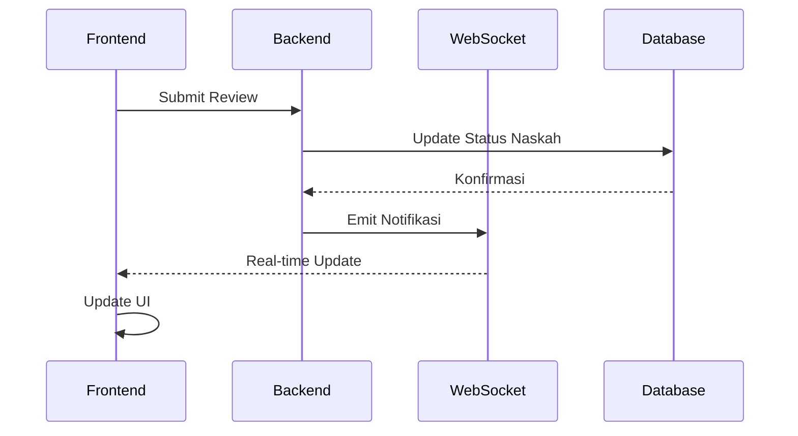
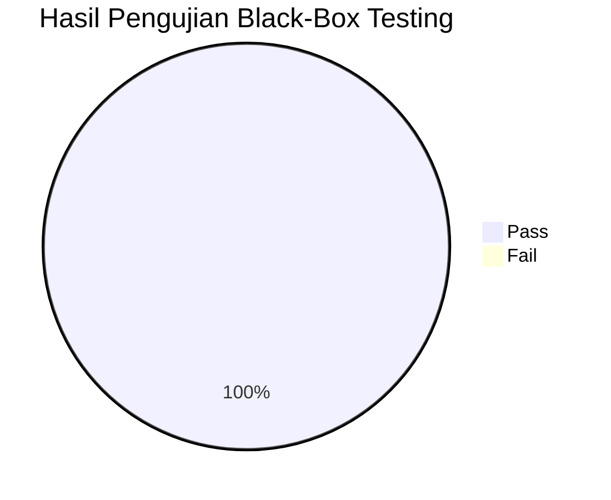

# BAB IV

# HASIL DAN PEMBAHASAN

---

## A. Hasil Pengembangan Sistem Web

### 1. Implementasi Backend

Pengembangan backend sistem Publishify telah menghasilkan REST API yang komprehensif dengan total 66+ endpoint yang tersebar di 10 modul bisnis. Backend dibangun menggunakan NestJS 10 dengan TypeScript dan menggunakan Prisma ORM untuk interaksi dengan basis data PostgreSQL.

**Statistik Implementasi Backend:**

| Komponen       | Jumlah | Keterangan                          |
| -------------- | ------ | ----------------------------------- |
| Modul          | 10     | Auth, Pengguna, Naskah, Review, dll |
| Controller     | 12     | Penanganan HTTP request             |
| Service        | 15     | Logika bisnis                       |
| DTO            | 45+    | Data Transfer Objects               |
| Guard          | 4      | JWT, Roles, Throttler, Google OAuth |
| Interceptor    | 3      | Transform, Logging, Timeout         |
| Endpoint API   | 66+    | REST API endpoints                  |
| Tabel Database | 28     | Entitas basis data                  |

_Tabel 4.1 Statistik Implementasi Backend_

**Modul-modul yang telah diimplementasikan:**

**a. Modul Autentikasi (auth)**
Modul ini menangani seluruh proses autentikasi pengguna termasuk pendaftaran, login dengan email/password, dan autentikasi melalui Google OAuth. Implementasi menggunakan Passport.js dengan strategi JWT untuk pengelolaan token.

_[Catatan: Sisipkan tangkapan layar kode `auth.service.ts` - fungsi register dan login]_

```typescript
// Contoh struktur response autentikasi
{
  sukses: true,
  pesan: "Login berhasil",
  data: {
    accessToken: "eyJhbGciOiJIUzI1NiIsInR5cCI6IkpXVCJ9...",
    refreshToken: "eyJhbGciOiJIUzI1NiIsInR5cCI6IkpXVCJ9...",
    pengguna: {
      id: "uuid",
      email: "penulis@email.com",
      peran: ["penulis"]
    }
  }
}
```

**b. Modul Manajemen Naskah (naskah)**
Modul naskah merupakan inti dari sistem yang mengelola seluruh siklus hidup naskah dari pembuatan hingga penerbitan. Implementasi mendukung operasi CRUD lengkap dengan validasi data menggunakan Zod dan class-validator.

_[Catatan: Sisipkan tangkapan layar kode `naskah.controller.ts` - endpoint utama]_

**c. Modul Review Editorial (review)**
Modul review mengimplementasikan alur kerja peninjauan naskah oleh editor. Fitur utama meliputi penugasan editor oleh admin, self-assign oleh editor, pemberian feedback per bab, dan submission rekomendasi (setujui/revisi/tolak).

**d. Modul Percetakan (percetakan)**
Modul percetakan mengelola pesanan cetak buku termasuk konfirmasi pesanan, update status produksi, dan pengaturan pengiriman. Implementasi mendukung tracking status pesanan secara real-time.

**e. Modul Notifikasi (notifikasi)**
Modul notifikasi mengimplementasikan WebSocket gateway menggunakan Socket.io untuk notifikasi real-time. Notifikasi dikirim saat terjadi perubahan status penting seperti naskah diajukan, review selesai, atau pesanan dikirim.

**Hasil Pengujian API:**

| Endpoint                 | Method | Response Time | Status |
| ------------------------ | ------ | ------------- | ------ |
| /api/auth/masuk          | POST   | 120ms         | ✓      |
| /api/naskah              | GET    | 85ms          | ✓      |
| /api/naskah/:id          | GET    | 45ms          | ✓      |
| /api/naskah              | POST   | 150ms         | ✓      |
| /api/review/antrian      | GET    | 95ms          | ✓      |
| /api/review/:id/feedback | POST   | 130ms         | ✓      |
| /api/percetakan/pesanan  | GET    | 75ms          | ✓      |

_Tabel 4.2 Hasil Pengujian Response Time API_

### 2. Implementasi Frontend Web

Frontend web Publishify dikembangkan menggunakan Next.js 14 dengan App Router, menghasilkan aplikasi web yang responsif dan modern. Antarmuka pengguna dibangun menggunakan komponen shadcn/ui yang dikustomisasi sesuai design system Publishify.

**Statistik Implementasi Frontend:**

| Komponen        | Jumlah | Keterangan                  |
| --------------- | ------ | --------------------------- |
| Halaman         | 25+    | Termasuk dashboard per role |
| Komponen        | 80+    | UI components               |
| Hooks           | 15+    | Custom React hooks          |
| API Services    | 12     | API client services         |
| Store (Zustand) | 5      | State management            |

_Tabel 4.3 Statistik Implementasi Frontend_

**Halaman-halaman yang telah diimplementasikan:**

**a. Halaman Autentikasi**

Halaman login dan registrasi telah diimplementasikan dengan validasi form real-time menggunakan React Hook Form dan Zod. Fitur Google OAuth juga tersedia untuk memudahkan proses autentikasi.

_[Catatan: Sisipkan tangkapan layar halaman Login - tampilan form login dengan opsi Google OAuth]_

_[Catatan: Sisipkan tangkapan layar halaman Register - tampilan form pendaftaran lengkap]_

**b. Dashboard Penulis**

Dashboard penulis menampilkan ringkasan statistik naskah (total, dalam review, disetujui, ditolak), daftar naskah terbaru, dan akses cepat ke fitur-fitur utama.

_[Catatan: Sisipkan tangkapan layar Dashboard Penulis - tampilan dengan statistik dan daftar naskah]_

Fitur-fitur dalam dashboard penulis:

- Statistik naskah dengan visualisasi kartu
- Tabel daftar naskah dengan filter dan pagination
- Tombol aksi cepat untuk buat naskah baru
- Notifikasi status review terbaru

**c. Halaman Manajemen Naskah**

Halaman manajemen naskah menyediakan antarmuka lengkap untuk penulis mengelola naskah mereka. Fitur meliputi daftar naskah dengan filter status, form pembuatan/edit naskah, dan preview detail naskah.

_[Catatan: Sisipkan tangkapan layar Daftar Naskah - tabel dengan filter dan aksi]_

_[Catatan: Sisipkan tangkapan layar Form Naskah - form dengan upload file dan gambar sampul]_

**d. Dashboard Editor**

Dashboard editor menampilkan antrian naskah yang perlu direview, statistik review yang telah diselesaikan, dan akses ke fitur pemberian feedback.

_[Catatan: Sisipkan tangkapan layar Dashboard Editor - antrian review dan statistik]_

**e. Halaman Review Naskah**

Halaman review menyediakan antarmuka untuk editor memberikan umpan balik terstruktur per bab, menambahkan komentar di halaman tertentu, dan mensubmit rekomendasi akhir.

_[Catatan: Sisipkan tangkapan layar Form Review - interface pemberian feedback]_

**f. Dashboard Admin**

Dashboard admin memberikan overview seluruh aktivitas sistem termasuk statistik pengguna, naskah, dan pesanan. Admin dapat mengelola pengguna, menugaskan editor, dan menerbitkan naskah yang sudah disetujui.

_[Catatan: Sisipkan tangkapan layar Dashboard Admin - overview dan panel kontrol]_

**g. Dashboard Percetakan**

Dashboard percetakan menampilkan daftar pesanan cetak yang masuk, status produksi setiap pesanan, dan manajemen pengiriman.

_[Catatan: Sisipkan tangkapan layar Dashboard Percetakan - daftar pesanan dan status]_

### 3. Integrasi Sistem Web

Integrasi antara frontend dan backend telah berjalan dengan baik melalui REST API dan WebSocket. Beberapa aspek integrasi yang telah diimplementasikan:

**a. Autentikasi Terintegrasi**
Token JWT disimpan dengan aman dan dikirimkan otomatis di setiap request API. Mekanisme refresh token memastikan sesi pengguna tetap aktif.

**b. State Synchronization**
Perubahan data pada server direfleksikan ke frontend melalui invalidasi cache TanStack Query dan update state Zustand.

**c. Real-time Notifications**
Notifikasi diterima secara real-time melalui WebSocket connection yang persisten. Pengguna menerima notifikasi untuk event penting seperti:

- Naskah diajukan (notifikasi ke admin)
- Editor ditugaskan (notifikasi ke editor)
- Review selesai (notifikasi ke penulis)
- Pesanan dikonfirmasi (notifikasi ke pemesan)



_Gambar 4.1 Diagram Alur Notifikasi Real-time_

---

## B. Hasil Pengembangan Aplikasi Seluler

### 1. Implementasi Aplikasi Flutter

Pengembangan aplikasi seluler menggunakan Flutter telah menghasilkan aplikasi Android yang fungsional dengan antarmuka Material Design. Aplikasi mendukung keempat role pengguna dengan halaman dan fitur yang sesuai.

**Statistik Implementasi Aplikasi Seluler:**

| Komponen        | Jumlah | Keterangan           |
| --------------- | ------ | -------------------- |
| Halaman (Pages) | 41+    | Termasuk per role    |
| Widget Custom   | 30+    | Reusable widgets     |
| Services        | 20+    | API & business logic |
| Models          | 18+    | Data models          |
| Providers/State | 8+     | State management     |

_Tabel 4.4 Statistik Implementasi Aplikasi Seluler_

**Halaman-halaman yang telah diimplementasikan:**

**a. Halaman Autentikasi**

_[Catatan: Sisipkan tangkapan layar Splash Screen aplikasi mobile]_

_[Catatan: Sisipkan tangkapan layar Login Screen dengan input email dan password]_

_[Catatan: Sisipkan tangkapan layar Register Screen dengan form pendaftaran]_

Implementasi halaman autentikasi mencakup:

- Splash screen dengan animasi logo
- Login screen dengan validasi input
- Register screen dengan form lengkap
- Opsi login dengan Google OAuth
- Lupa password dengan reset via email

**b. Dashboard Penulis Mobile**

_[Catatan: Sisipkan tangkapan layar Home Screen Penulis dengan statistik dan menu]_

Dashboard penulis pada aplikasi seluler menampilkan:

- Greeting personalisasi dengan nama pengguna
- Grid statistik (Total Naskah, Review Pending, Pesanan, Diterbitkan)
- Daftar naskah terbaru dalam format kartu
- Bottom navigation untuk navigasi antar fitur
- FAB (Floating Action Button) untuk buat naskah baru

**c. Halaman Manajemen Naskah Mobile**

_[Catatan: Sisipkan tangkapan layar Daftar Naskah dengan filter dan pull-to-refresh]_

_[Catatan: Sisipkan tangkapan layar Form Naskah dengan input dan upload]_

_[Catatan: Sisipkan tangkapan layar Detail Naskah dengan informasi lengkap]_

Fitur manajemen naskah pada mobile:

- List view dengan pull-to-refresh
- Filter berdasarkan status naskah
- Form pembuatan naskah dengan image picker
- File picker untuk upload dokumen naskah
- Detail view dengan preview dan aksi

**d. Dashboard Editor Mobile**

_[Catatan: Sisipkan tangkapan layar Dashboard Editor dengan antrian review]_

Dashboard editor menampilkan:

- Tab view untuk filter (Ditugaskan, Tersedia, Selesai)
- Kartu naskah dengan informasi penulis dan deadline
- Tombol aksi untuk mulai review atau self-assign
- Badge indikator prioritas

**e. Halaman Review Mobile**

_[Catatan: Sisipkan tangkapan layar Form Review dengan section feedback]_

_[Catatan: Sisipkan tangkapan layar Daftar Feedback yang sudah diberikan]_

Fitur review pada mobile:

- Stepper untuk progres review per bab
- Form feedback dengan rich input
- Pilihan rekomendasi (Setujui/Revisi/Tolak)
- Preview naskah terintegrasi

**f. Dashboard Percetakan Mobile**

_[Catatan: Sisipkan tangkapan layar Dashboard Percetakan dengan daftar pesanan]_

Dashboard percetakan menampilkan:

- Daftar pesanan masuk dengan status
- Detail pesanan lengkap
- Form update status produksi
- Form input pengiriman dengan tracking

**g. Dashboard Admin Mobile**

_[Catatan: Sisipkan tangkapan layar Dashboard Admin dengan statistik dan aksi]_

Dashboard admin menyediakan:

- Overview statistik sistem
- Daftar naskah yang perlu ditugaskan
- Panel kelola pengguna
- Aksi terbitkan naskah yang disetujui

### 2. Integrasi dengan Backend

Aplikasi seluler terintegrasi penuh dengan backend melalui HTTP client dan WebSocket. Implementasi integrasi mencakup:

**a. HTTP Client Service**

```dart
// Contoh struktur HTTP client
class ApiClient {
  final String baseUrl;
  final SharedPreferences prefs;

  Future<Response> get(String endpoint) async {
    final token = prefs.getString('token');
    return http.get(
      Uri.parse('$baseUrl$endpoint'),
      headers: {'Authorization': 'Bearer $token'},
    );
  }
}
```

**b. Token Management**
Token JWT disimpan menggunakan SharedPreferences dengan enkripsi dasar. Refresh token dilakukan otomatis saat access token expired.

**c. Socket.io Integration**
Aplikasi seluler terhubung ke WebSocket server untuk menerima notifikasi real-time. Connection dikelola pada level aplikasi dan reconnect otomatis saat koneksi terputus.

_[Catatan: Sisipkan tangkapan layar Notifikasi Push pada aplikasi mobile]_

### 3. Perbandingan Fitur Web dan Mobile

| Fitur                | Web | Mobile  | Keterangan                 |
| -------------------- | --- | ------- | -------------------------- |
| Login/Register       | ✓   | ✓       | Identik                    |
| Google OAuth         | ✓   | ✓       | Implementasi berbeda       |
| Dashboard Penulis    | ✓   | ✓       | Layout responsif vs native |
| Kelola Naskah        | ✓   | ✓       | Fitur penuh                |
| Upload Naskah        | ✓   | ✓       | Drag-drop vs file picker   |
| Dashboard Editor     | ✓   | ✓       | Fitur penuh                |
| Review Naskah        | ✓   | ✓       | Fitur penuh                |
| Dashboard Percetakan | ✓   | ✓       | Fitur penuh                |
| Dashboard Admin      | ✓   | ✓       | Fitur penuh                |
| Real-time Notifikasi | ✓   | ✓       | WebSocket                  |
| Offline Mode         | -   | Partial | Mobile only                |

_Tabel 4.5 Perbandingan Fitur Web dan Mobile_

---

## C. Pengujian Sistem

### 1. Pengujian Fungsional (Black-Box Testing)

Pengujian fungsional dilakukan untuk memvalidasi bahwa sistem berfungsi sesuai dengan kebutuhan yang telah didefinisikan. Metode yang digunakan adalah black-box testing dimana fokus pengujian adalah pada input dan output tanpa memperhatikan struktur internal kode.

**a. Pengujian Modul Autentikasi**

| No  | Skenario Pengujian                 | Input                       | Output yang Diharapkan                  | Hasil  | Status |
| --- | ---------------------------------- | --------------------------- | --------------------------------------- | ------ | ------ |
| A1  | Login dengan kredensial valid      | Email dan password valid    | Redirect ke dashboard                   | Sesuai | ✓ Pass |
| A2  | Login dengan password salah        | Email valid, password salah | Pesan error "Password salah"            | Sesuai | ✓ Pass |
| A3  | Login dengan email tidak terdaftar | Email tidak ada             | Pesan error "Email tidak ditemukan"     | Sesuai | ✓ Pass |
| A4  | Registrasi dengan data lengkap     | Data valid lengkap          | Akun terbuat, email verifikasi terkirim | Sesuai | ✓ Pass |
| A5  | Registrasi dengan email sudah ada  | Email existing              | Pesan error "Email sudah terdaftar"     | Sesuai | ✓ Pass |
| A6  | Login Google OAuth                 | Akun Google                 | Redirect ke dashboard                   | Sesuai | ✓ Pass |
| A7  | Logout                             | Klik tombol logout          | Redirect ke login, token dihapus        | Sesuai | ✓ Pass |

_Tabel 4.6 Hasil Pengujian Modul Autentikasi_

**b. Pengujian Modul Manajemen Naskah**

| No  | Skenario Pengujian         | Input               | Output yang Diharapkan               | Hasil  | Status |
| --- | -------------------------- | ------------------- | ------------------------------------ | ------ | ------ |
| N1  | Buat naskah baru           | Data naskah lengkap | Naskah tersimpan dengan status draft | Sesuai | ✓ Pass |
| N2  | Buat naskah tanpa judul    | Judul kosong        | Pesan error validasi                 | Sesuai | ✓ Pass |
| N3  | Edit naskah existing       | Data baru valid     | Data naskah terupdate                | Sesuai | ✓ Pass |
| N4  | Upload file naskah         | File PDF valid      | File terupload, URL tersimpan        | Sesuai | ✓ Pass |
| N5  | Upload file format invalid | File exe/zip        | Pesan error "Format tidak didukung"  | Sesuai | ✓ Pass |
| N6  | Ajukan naskah untuk review | Naskah lengkap      | Status berubah ke "Diajukan"         | Sesuai | ✓ Pass |
| N7  | Hapus naskah               | Konfirmasi hapus    | Naskah terhapus                      | Sesuai | ✓ Pass |
| N8  | Filter naskah by status    | Pilih status        | Daftar terfilter                     | Sesuai | ✓ Pass |

_Tabel 4.7 Hasil Pengujian Modul Manajemen Naskah_

**c. Pengujian Modul Review**

| No  | Skenario Pengujian        | Input                 | Output yang Diharapkan           | Hasil  | Status |
| --- | ------------------------- | --------------------- | -------------------------------- | ------ | ------ |
| R1  | Lihat antrian review      | Role editor           | Daftar naskah ditugaskan tampil  | Sesuai | ✓ Pass |
| R2  | Self-assign naskah        | Pilih naskah tersedia | Naskah ditugaskan ke editor      | Sesuai | ✓ Pass |
| R3  | Mulai review              | Klik mulai review     | Status berubah ke "Dalam Proses" | Sesuai | ✓ Pass |
| R4  | Tambah feedback           | Data feedback         | Feedback tersimpan               | Sesuai | ✓ Pass |
| R5  | Submit rekomendasi setuju | Pilih "Setujui"       | Status naskah "Disetujui"        | Sesuai | ✓ Pass |
| R6  | Submit rekomendasi revisi | Pilih "Perlu Revisi"  | Status naskah "Perlu Revisi"     | Sesuai | ✓ Pass |
| R7  | Submit rekomendasi tolak  | Pilih "Tolak"         | Status naskah "Ditolak"          | Sesuai | ✓ Pass |

_Tabel 4.8 Hasil Pengujian Modul Review_

**d. Pengujian Modul Percetakan**

| No  | Skenario Pengujian     | Input                      | Output yang Diharapkan | Hasil  | Status |
| --- | ---------------------- | -------------------------- | ---------------------- | ------ | ------ |
| P1  | Buat pesanan cetak     | Data pesanan valid         | Pesanan tersimpan      | Sesuai | ✓ Pass |
| P2  | Konfirmasi pesanan     | Konfirmasi oleh percetakan | Status "Diterima"      | Sesuai | ✓ Pass |
| P3  | Update status produksi | Pilih status baru          | Status terupdate       | Sesuai | ✓ Pass |
| P4  | Input info pengiriman  | Data kurir & resi          | Pengiriman tercatat    | Sesuai | ✓ Pass |
| P5  | Update tracking        | Status pengiriman baru     | Log tracking bertambah | Sesuai | ✓ Pass |

_Tabel 4.9 Hasil Pengujian Modul Percetakan_

**e. Pengujian Modul Admin**

| No  | Skenario Pengujian    | Input                   | Output yang Diharapkan                   | Hasil  | Status |
| --- | --------------------- | ----------------------- | ---------------------------------------- | ------ | ------ |
| AD1 | Lihat daftar pengguna | Role admin              | Daftar pengguna tampil                   | Sesuai | ✓ Pass |
| AD2 | Tugaskan editor       | Pilih naskah & editor   | Penugasan tersimpan, notifikasi terkirim | Sesuai | ✓ Pass |
| AD3 | Terbitkan naskah      | Naskah status disetujui | Status berubah ke "Diterbitkan"          | Sesuai | ✓ Pass |
| AD4 | Nonaktifkan pengguna  | Pilih pengguna          | Status pengguna nonaktif                 | Sesuai | ✓ Pass |

_Tabel 4.10 Hasil Pengujian Modul Admin_

### 2. Ringkasan Hasil Pengujian



_Gambar 4.2 Diagram Hasil Pengujian Black-Box_

| Modul            | Total Skenario | Pass   | Fail  | Persentase |
| ---------------- | -------------- | ------ | ----- | ---------- |
| Autentikasi      | 7              | 7      | 0     | 100%       |
| Manajemen Naskah | 8              | 8      | 0     | 100%       |
| Review           | 7              | 7      | 0     | 100%       |
| Percetakan       | 5              | 5      | 0     | 100%       |
| Admin            | 4              | 4      | 0     | 100%       |
| **Total**        | **31**         | **31** | **0** | **100%**   |

_Tabel 4.11 Ringkasan Hasil Pengujian per Modul_

### 3. Pengujian Responsivitas Web

Pengujian responsivitas dilakukan untuk memastikan aplikasi web tampil dengan baik di berbagai ukuran layar.

| Device/Viewport  | Resolusi  | Layout | Navigasi | Forms | Status |
| ---------------- | --------- | ------ | -------- | ----- | ------ |
| Desktop Large    | 1920x1080 | ✓      | ✓        | ✓     | Pass   |
| Desktop          | 1366x768  | ✓      | ✓        | ✓     | Pass   |
| Laptop           | 1280x800  | ✓      | ✓        | ✓     | Pass   |
| Tablet Landscape | 1024x768  | ✓      | ✓        | ✓     | Pass   |
| Tablet Portrait  | 768x1024  | ✓      | ✓        | ✓     | Pass   |
| Mobile Large     | 425x812   | ✓      | ✓        | ✓     | Pass   |
| Mobile Medium    | 375x667   | ✓      | ✓        | ✓     | Pass   |
| Mobile Small     | 320x568   | ✓      | ✓        | ✓     | Pass   |

_Tabel 4.12 Hasil Pengujian Responsivitas_

### 4. Pengujian Aplikasi Seluler

Pengujian aplikasi seluler dilakukan pada perangkat fisik dan emulator dengan berbagai versi Android.

| Device/Emulator      | Android Version | API Level | Status |
| -------------------- | --------------- | --------- | ------ |
| Pixel 6 (Emulator)   | Android 13      | 33        | Pass   |
| Samsung Galaxy A52   | Android 12      | 31        | Pass   |
| Xiaomi Redmi Note 10 | Android 11      | 30        | Pass   |
| OPPO A15             | Android 10      | 29        | Pass   |
| Emulator (Min SDK)   | Android 8.1     | 27        | Pass   |

_Tabel 4.13 Hasil Pengujian Kompatibilitas Android_

---

## D. Pembahasan

### 1. Analisis Hasil Implementasi

Berdasarkan hasil pengembangan dan pengujian yang telah dilakukan, dapat dianalisis bahwa sistem Publishify telah berhasil memenuhi kebutuhan fungsional yang didefinisikan pada tahap analisis. Berikut adalah analisis terhadap pencapaian setiap tujuan proyek:

**a. Digitalisasi Proses Penerbitan**

Sistem berhasil mendigitalisasi proses penerbitan yang sebelumnya manual menjadi proses digital terintegrasi. Penulis dapat mengunggah naskah secara online, editor dapat memberikan review melalui platform, dan percetakan dapat mengelola pesanan dari dashboard mereka. Hal ini selaras dengan tujuan proyek untuk menyediakan platform digital yang menghubungkan semua pemangku kepentingan.

**b. Efisiensi Alur Kerja**

Implementasi sistem status dan transisi otomatis berhasil meningkatkan efisiensi alur kerja. Pengguna tidak perlu melakukan komunikasi manual untuk mengetahui progres karena status terupdate secara real-time dan notifikasi terkirim otomatis saat ada perubahan penting.

**c. Aksesibilitas Multi-Platform**

Dengan tersedianya aplikasi web dan aplikasi seluler, sistem dapat diakses dari berbagai perangkat. Hal ini meningkatkan fleksibilitas bagi pengguna yang memiliki preferensi berbeda dalam mengakses sistem.

### 2. Analisis Kelebihan Sistem

**a. Arsitektur Modular**
Penggunaan arsitektur modular pada backend memudahkan pengembangan dan pemeliharaan. Setiap modul dapat dikembangkan secara independen tanpa mempengaruhi modul lain.

**b. Real-time Notifications**
Implementasi WebSocket untuk notifikasi real-time meningkatkan responsivitas sistem dan pengalaman pengguna. Pengguna mendapat informasi terkini tanpa perlu refresh halaman.

**c. Konsistensi Lintas Platform**
Penggunaan API yang sama untuk web dan mobile memastikan konsistensi data dan perilaku di kedua platform. Design system yang konsisten juga memberikan pengalaman yang familiar bagi pengguna.

**d. Keamanan**
Implementasi autentikasi JWT dengan refresh token, role-based access control, dan validasi input di server memberikan lapisan keamanan yang memadai untuk sistem.

### 3. Analisis Keterbatasan Sistem

**a. Keterbatasan Offline Mode**
Aplikasi seluler belum mendukung offline mode penuh. Beberapa fitur memerlukan koneksi internet aktif untuk berfungsi.

**b. Keterbatasan Format File**
Sistem saat ini hanya mendukung format file terbatas (PDF, DOC/DOCX) untuk naskah. Format lain seperti EPUB belum didukung.

**c. Belum Ada Payment Gateway Terintegrasi**
Proses pembayaran masih manual dengan upload bukti transfer. Integrasi dengan payment gateway akan meningkatkan otomatisasi proses pembayaran.

### 4. Rekomendasi Pengembangan Lanjutan

Berdasarkan analisis hasil implementasi dan keterbatasan yang teridentifikasi, berikut adalah rekomendasi untuk pengembangan selanjutnya:

| Prioritas | Fitur               | Deskripsi                        | Estimasi Effort |
| --------- | ------------------- | -------------------------------- | --------------- |
| Tinggi    | Payment Gateway     | Integrasi Midtrans/Xendit        | 2-3 minggu      |
| Tinggi    | Offline Mode        | Sinkronisasi data offline mobile | 2 minggu        |
| Medium    | EPUB Support        | Dukungan format EPUB             | 1 minggu        |
| Medium    | Analytics Dashboard | Visualisasi statistik lanjutan   | 2 minggu        |
| Rendah    | iOS App             | Versi iOS aplikasi seluler       | 3-4 minggu      |
| Rendah    | Multi-language      | Dukungan bahasa Inggris          | 1 minggu        |

_Tabel 4.14 Rekomendasi Pengembangan Lanjutan_

---

_[Catatan untuk penempatan kode sumber dan tangkapan layar:]_

| Referensi       | Lokasi/Keterangan           |
| --------------- | --------------------------- |
| Screenshot 4.1  | Halaman Login Web           |
| Screenshot 4.2  | Halaman Register Web        |
| Screenshot 4.3  | Dashboard Penulis Web       |
| Screenshot 4.4  | Halaman Daftar Naskah Web   |
| Screenshot 4.5  | Form Naskah Web             |
| Screenshot 4.6  | Dashboard Editor Web        |
| Screenshot 4.7  | Form Review Web             |
| Screenshot 4.8  | Dashboard Admin Web         |
| Screenshot 4.9  | Dashboard Percetakan Web    |
| Screenshot 4.10 | Splash Screen Mobile        |
| Screenshot 4.11 | Login Screen Mobile         |
| Screenshot 4.12 | Dashboard Penulis Mobile    |
| Screenshot 4.13 | Daftar Naskah Mobile        |
| Screenshot 4.14 | Form Naskah Mobile          |
| Screenshot 4.15 | Dashboard Editor Mobile     |
| Screenshot 4.16 | Form Review Mobile          |
| Screenshot 4.17 | Dashboard Admin Mobile      |
| Screenshot 4.18 | Dashboard Percetakan Mobile |
| Screenshot 4.19 | Notifikasi Push Mobile      |
