# PRESENTASI PROYEK AKHIR

## PENGEMBANGAN SISTEM PENERBITAN NASKAH DIGITAL PUBLISHIFY

### Platform Aplikasi Seluler (Flutter)

---

# 📑 DAFTAR ISI PRESENTASI

| No  | Slide       | Topik                          |
| --- | ----------- | ------------------------------ |
| 1   | Slide 1-3   | Pembukaan & Latar Belakang     |
| 2   | Slide 4-6   | Identifikasi & Rumusan Masalah |
| 3   | Slide 7-9   | Kajian Teori & Metode ADDIE    |
| 4   | Slide 10-14 | Perancangan Aplikasi Mobile    |
| 5   | Slide 15-20 | Hasil Implementasi Flutter     |
| 6   | Slide 21-23 | Pengujian & Pembahasan         |
| 7   | Slide 24-26 | Kesimpulan, Manfaat & Penutup  |

---

# SLIDE 1: HALAMAN JUDUL

<div align="center">

## PENGEMBANGAN APLIKASI SELULER SISTEM PENERBITAN NASKAH DIGITAL MENGGUNAKAN METODE ADDIE

### (Studi Kasus: Publishify Mobile)

---

**Disusun oleh:**
Tim Pengembang Publishify

**Program Studi Teknik Informatika**
**Fakultas Teknik**
**2026**

</div>

---

# SLIDE 2: GAMBARAN UMUM PROYEK

## 📱 Informasi Proyek Publishify Mobile

| Aspek           | Keterangan                                                        |
| --------------- | ----------------------------------------------------------------- |
| **Nama Proyek** | Publishify Mobile - Aplikasi Seluler Penerbitan Naskah            |
| **Platform**    | Android (iOS ready)                                               |
| **Framework**   | Flutter 3.x                                                       |
| **Bahasa**      | Dart                                                              |
| **Metode**      | ADDIE (Analysis, Design, Development, Implementation, Evaluation) |
| **Integrasi**   | REST API + WebSocket                                              |

### 🎯 Visi Aplikasi Mobile

> Menyediakan akses **mobile-first** bagi Penulis, Editor, Percetakan, dan Administrator untuk mengelola proses penerbitan naskah kapan saja dan di mana saja.

---

# SLIDE 3: LATAR BELAKANG

## 📖 Kebutuhan Mobilitas dalam Industri Penerbitan

### Tantangan Aksesibilitas

- Penulis dan editor membutuhkan akses fleksibel
- Percetakan perlu update status produksi secara real-time
- Notifikasi penting harus diterima segera
- Proses penerbitan tidak boleh terhambat keterbatasan lokasi

### Solusi: Aplikasi Seluler Native

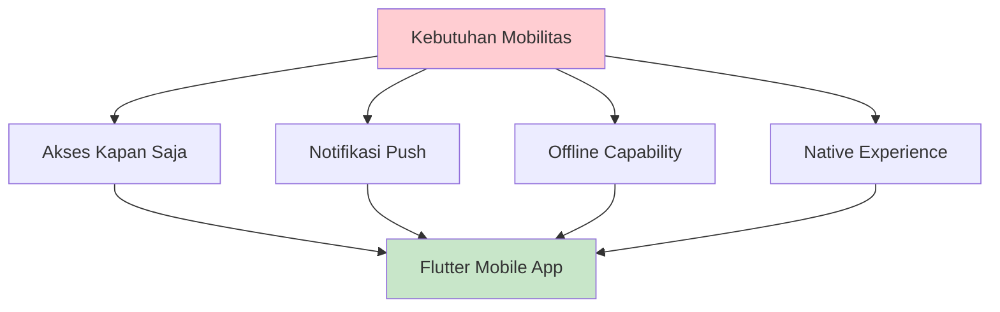

### Mengapa Flutter?

- **Cross-platform** - Satu codebase untuk Android & iOS
- **Native Performance** - Kompilasi ke native code
- **Hot Reload** - Development lebih cepat
- **Rich UI** - Material Design dan Cupertino widgets

---

# SLIDE 4: IDENTIFIKASI MASALAH MOBILE

## 🔍 Permasalahan Khusus untuk Platform Mobile

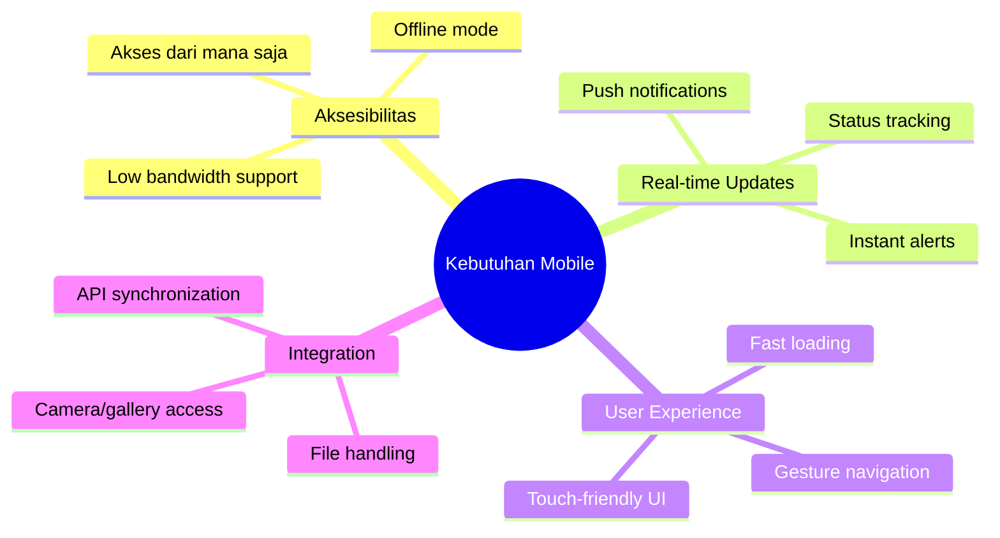

---

# SLIDE 5: ANALISIS KEBUTUHAN MOBILE PER ROLE

## 👥 Kebutuhan Fitur per Peran Pengguna

| Role           | Kebutuhan Mobile                                                    | Prioritas |
| -------------- | ------------------------------------------------------------------- | --------- |
| **Penulis**    | Upload naskah via kamera/galeri, tracking status, notifikasi review | Tinggi    |
| **Editor**     | Antrian review mobile, input feedback on-the-go, rekomendasi        | Tinggi    |
| **Percetakan** | Update status produksi, input resi pengiriman, notifikasi pesanan   | Tinggi    |
| **Admin**      | Overview statistik, penugasan editor, approve/reject actions        | Sedang    |

### Fitur Mobile-Specific

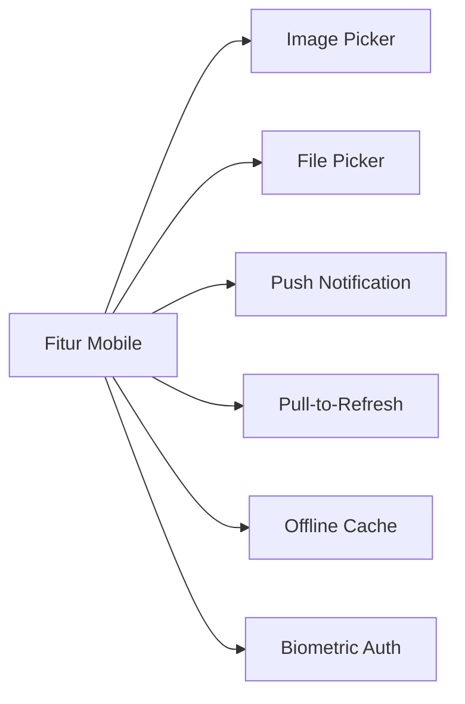

---

# SLIDE 6: RUMUSAN MASALAH & TUJUAN MOBILE

## ❓ Rumusan Masalah

1. Bagaimana mengembangkan aplikasi seluler yang terintegrasi dengan sistem web Publishify?
2. Bagaimana mengimplementasikan pengalaman pengguna native yang intuitif?
3. Bagaimana menangani sinkronisasi data dan notifikasi real-time pada platform mobile?
4. Bagaimana memastikan kompatibilitas dengan berbagai versi Android?

## 🎯 Tujuan Pengembangan Mobile

| No  | Tujuan                                   | Target                   |
| --- | ---------------------------------------- | ------------------------ |
| 1   | Membangun aplikasi Flutter multi-role    | ✓ 4 dashboard berbeda    |
| 2   | Mengintegrasikan dengan backend API      | ✓ Full REST API coverage |
| 3   | Mengimplementasikan notifikasi real-time | ✓ Socket.io integration  |
| 4   | Menyediakan fitur upload native          | ✓ Camera & file picker   |
| 5   | Memastikan responsivitas UI              | ✓ Material Design 3      |

---

# SLIDE 7: KAJIAN TEORI - MOBILE DEVELOPMENT

## 📚 Landasan Teori Pengembangan Mobile

### Cross-Platform Development

> "Framework lintas platform memungkinkan pengembangan aplikasi untuk multiple platform dengan satu codebase, mengurangi waktu dan biaya pengembangan." (Flutter Documentation, 2024)

### Widget Tree Architecture (Flutter)

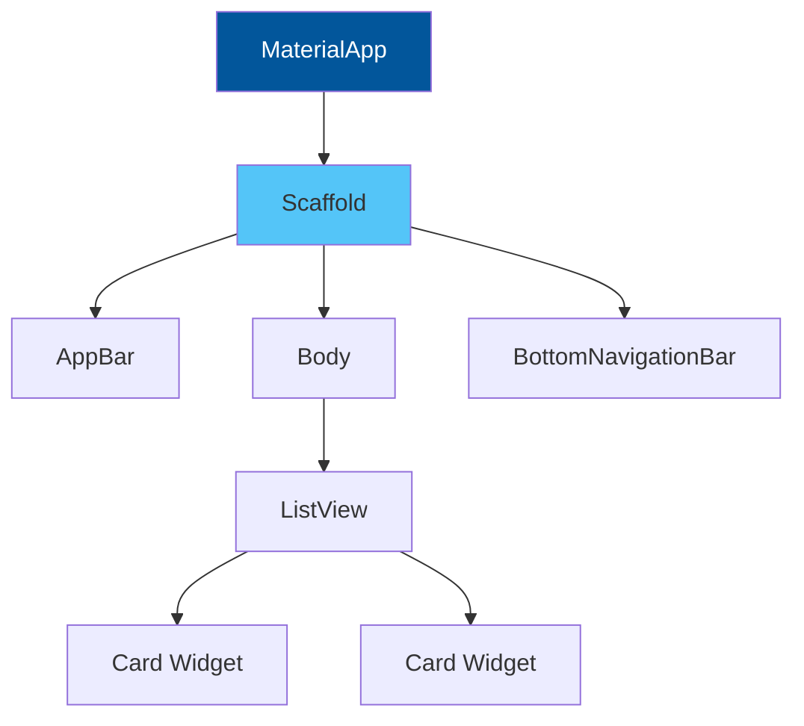

### Keunggulan Flutter

1. **Single Codebase** - Write once, deploy everywhere
2. **Hot Reload** - Instant preview changes
3. **Rich Widgets** - Customizable UI components
4. **Native Compilation** - Performa optimal

---

# SLIDE 8: METODE ADDIE UNTUK MOBILE

## 🔄 Implementasi ADDIE pada Pengembangan Mobile

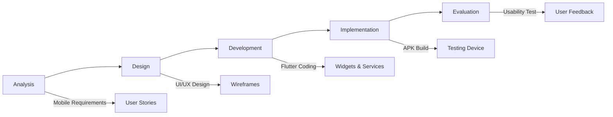

### Tahapan ADDIE untuk Mobile

| Tahap              | Aktivitas Mobile                                  | Output              |
| ------------------ | ------------------------------------------------- | ------------------- |
| **Analysis**       | Analisis fitur per role, platform requirements    | Mobile user stories |
| **Design**         | Wireframe mobile, navigation flow, UI components  | Figma mockups       |
| **Development**    | Flutter coding, API integration, state management | Source code         |
| **Implementation** | Build APK, device testing, deployment             | Release APK         |
| **Evaluation**     | Compatibility testing, usability testing          | Test reports        |

---

# SLIDE 9: PERBANDINGAN FRAMEWORK MOBILE

## 📊 Analisis Pemilihan Framework

```python
# Perbandingan framework mobile development
import matplotlib.pyplot as plt
import numpy as np

frameworks = ['Flutter', 'React Native', 'Kotlin', 'Swift']
criteria = ['Cross-platform', 'Performance', 'Learning Curve', 'Community', 'UI Flexibility']

# Skor 1-10
scores = {
    'Flutter': [10, 9, 7, 9, 10],
    'React Native': [10, 7, 8, 10, 8],
    'Kotlin': [3, 10, 6, 8, 9],
    'Swift': [3, 10, 5, 7, 9]
}

x = np.arange(len(criteria))
width = 0.2

fig, ax = plt.subplots(figsize=(12, 6))
for i, (framework, score) in enumerate(scores.items()):
    ax.bar(x + i*width, score, width, label=framework)

ax.set_ylabel('Skor')
ax.set_title('Perbandingan Framework Mobile Development')
ax.set_xticks(x + width * 1.5)
ax.set_xticklabels(criteria)
ax.legend()
plt.show()
```

### Alasan Memilih Flutter

| Kriteria              | Flutter    | Keterangan          |
| --------------------- | ---------- | ------------------- |
| Cross-platform        | ⭐⭐⭐⭐⭐ | Android + iOS + Web |
| Performance           | ⭐⭐⭐⭐⭐ | Native compilation  |
| UI Flexibility        | ⭐⭐⭐⭐⭐ | Custom widgets      |
| Backend Compatibility | ⭐⭐⭐⭐⭐ | REST + WebSocket    |

---

# SLIDE 10: ARSITEKTUR APLIKASI MOBILE

## 🏗️ Arsitektur Flutter Publishify

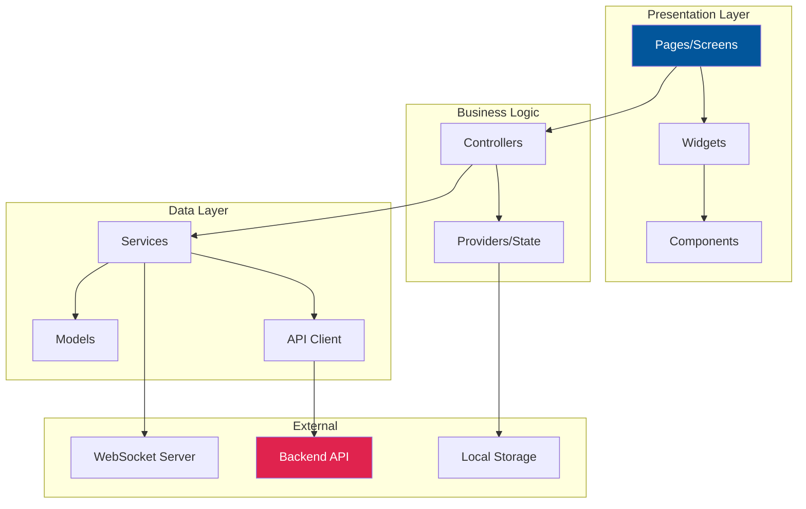

### Layer Architecture

| Layer              | Komponen               | Fungsi                |
| ------------------ | ---------------------- | --------------------- |
| **Presentation**   | Pages, Widgets         | UI rendering          |
| **Business Logic** | Controllers, Providers | State management      |
| **Data**           | Services, API Client   | Data handling         |
| **External**       | REST API, WebSocket    | Backend communication |

---

# SLIDE 11: STRUKTUR PROYEK FLUTTER

## 📁 Organisasi Kode Mobile

```
mobile/
├── lib/
│   ├── main.dart              # Entry point
│   ├── config/                # Konfigurasi app
│   │   ├── api_config.dart    # Base URL, endpoints
│   │   └── theme_config.dart  # Tema aplikasi
│   ├── models/                # Data models
│   │   ├── pengguna.dart
│   │   ├── naskah.dart
│   │   └── review.dart
│   ├── services/              # API services
│   │   ├── api_service.dart
│   │   ├── auth_service.dart
│   │   └── naskah_service.dart
│   ├── controllers/           # Business logic
│   ├── pages/                 # Screen/halaman
│   │   ├── auth/
│   │   ├── penulis/
│   │   ├── editor/
│   │   ├── percetakan/
│   │   └── admin/
│   ├── widgets/               # Reusable widgets
│   └── utils/                 # Helper functions
├── assets/                    # Images, icons, fonts
├── android/                   # Android native config
└── pubspec.yaml               # Dependencies
```

---

# SLIDE 12: STATE MANAGEMENT

## 🔄 Pengelolaan State pada Flutter

### Provider Pattern Implementation

```dart
// Contoh AuthProvider untuk state management
class AuthProvider extends ChangeNotifier {
  Pengguna? _pengguna;
  bool _isLoading = false;
  String? _error;

  Pengguna? get pengguna => _pengguna;
  bool get isLoading => _isLoading;
  bool get isAuthenticated => _pengguna != null;

  Future<void> login(String email, String password) async {
    _isLoading = true;
    notifyListeners();

    try {
      final response = await AuthService.login(email, password);
      _pengguna = Pengguna.fromJson(response.data);
      _error = null;
    } catch (e) {
      _error = e.toString();
    }

    _isLoading = false;
    notifyListeners();
  }
}
```

### State Management Flow

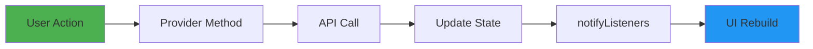

---

# SLIDE 13: DESAIN UI MOBILE

## 🎨 Material Design Implementation

### Komponen UI Utama

| Komponen       | Widget Flutter           | Penggunaan        |
| -------------- | ------------------------ | ----------------- |
| **App Bar**    | AppBar, SliverAppBar     | Header navigasi   |
| **Navigation** | BottomNavigationBar      | Navigasi utama    |
| **Cards**      | Card, ListTile           | Display data      |
| **Forms**      | TextFormField            | Input data        |
| **Buttons**    | ElevatedButton, FAB      | Aksi pengguna     |
| **Dialogs**    | AlertDialog, BottomSheet | Konfirmasi & info |

### Palet Warna Mobile

```dart
// Theme configuration
final ThemeData publishifyTheme = ThemeData(
  colorScheme: ColorScheme.fromSeed(
    seedColor: Color(0xFF6366F1), // Primary
    secondary: Color(0xFF8B5CF6),
    error: Color(0xFFEF4444),
  ),
  useMaterial3: true,
);
```

| Warna     | Hex       | Penggunaan                   |
| --------- | --------- | ---------------------------- |
| Primary   | `#6366F1` | AppBar, FAB, Primary buttons |
| Secondary | `#8B5CF6` | Accent, Secondary buttons    |
| Success   | `#10B981` | Status sukses, badges        |
| Warning   | `#F59E0B` | Status pending               |
| Error     | `#EF4444` | Error messages, delete       |

---

# SLIDE 14: NAVIGASI & ROUTING

## 🧭 Struktur Navigasi Aplikasi

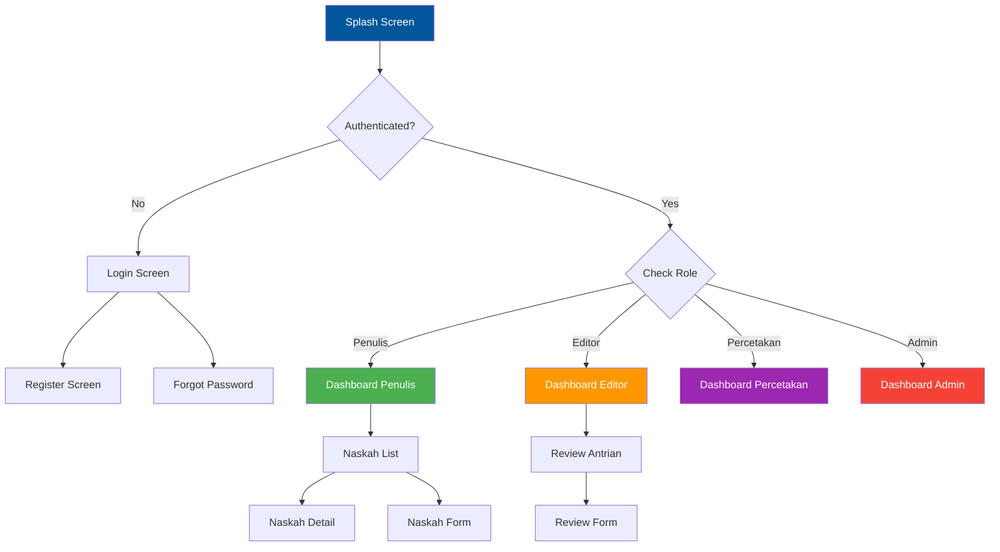

### Bottom Navigation per Role

| Role           | Tab 1   | Tab 2    | Tab 3      | Tab 4  |
| -------------- | ------- | -------- | ---------- | ------ |
| **Penulis**    | Beranda | Naskah   | Pesanan    | Profil |
| **Editor**     | Beranda | Antrian  | Riwayat    | Profil |
| **Percetakan** | Beranda | Pesanan  | Pengiriman | Profil |
| **Admin**      | Beranda | Pengguna | Naskah     | Profil |

---

# SLIDE 15: HASIL IMPLEMENTASI MOBILE

## ⚙️ Statistik Implementasi Flutter

| Komponen            | Jumlah | Keterangan           |
| ------------------- | ------ | -------------------- |
| **Halaman (Pages)** | 41+    | Termasuk per role    |
| **Widget Custom**   | 30+    | Reusable widgets     |
| **Services**        | 20+    | API & business logic |
| **Models**          | 18+    | Data models          |
| **Providers/State** | 8+     | State management     |

### Distribusi Halaman per Role

```python
# Visualisasi distribusi halaman
import matplotlib.pyplot as plt

roles = ['Penulis', 'Editor', 'Percetakan', 'Admin', 'Shared']
pages = [12, 10, 8, 7, 4]
colors = ['#4CAF50', '#FF9800', '#9C27B0', '#F44336', '#607D8B']

plt.figure(figsize=(10, 6))
plt.pie(pages, labels=roles, autopct='%1.0f%%', colors=colors, explode=[0.02]*5)
plt.title('Distribusi Halaman per Role (Total: 41+ Pages)')
plt.show()
```

---

# SLIDE 16: IMPLEMENTASI HALAMAN AUTENTIKASI

## 🔐 Halaman Login & Register

### Contoh Kode Login Screen

```dart
// login_page.dart - Simplified
class LoginPage extends StatefulWidget {
  @override
  _LoginPageState createState() => _LoginPageState();
}

class _LoginPageState extends State<LoginPage> {
  final _formKey = GlobalKey<FormState>();
  final _emailCtrl = TextEditingController();
  final _passwordCtrl = TextEditingController();

  Future<void> _handleLogin() async {
    if (_formKey.currentState!.validate()) {
      await context.read<AuthProvider>().login(
        _emailCtrl.text,
        _passwordCtrl.text,
      );
    }
  }

  @override
  Widget build(BuildContext context) {
    return Scaffold(
      body: Form(
        key: _formKey,
        child: Column(
          children: [
            TextFormField(controller: _emailCtrl),
            TextFormField(controller: _passwordCtrl),
            ElevatedButton(onPressed: _handleLogin, child: Text('Masuk')),
          ],
        ),
      ),
    );
  }
}
```

### Fitur Autentikasi Mobile

- ✅ Login dengan email/password
- ✅ Registrasi akun baru
- ✅ Google OAuth integration
- ✅ Remember me dengan SharedPreferences
- ✅ Token refresh otomatis

---

# SLIDE 17: IMPLEMENTASI DASHBOARD MOBILE

## 📊 Dashboard per Role

### Layout Dashboard Penulis

```
┌─────────────────────────────────┐
│  Publishify        🔔  👤      │
├─────────────────────────────────┤
│  Halo, Ahmad!                   │
│  Selamat datang kembali         │
├─────────────────────────────────┤
│ ┌───────┐ ┌───────┐ ┌───────┐  │
│ │  12   │ │   3   │ │   5   │  │
│ │Naskah │ │Review │ │Terbit │  │
│ └───────┘ └───────┘ └───────┘  │
├─────────────────────────────────┤
│  Naskah Terbaru                 │
│ ┌─────────────────────────────┐│
│ │ 📖 Novel Petualangan        ││
│ │    Status: Dalam Review     ││
│ └─────────────────────────────┘│
│ ┌─────────────────────────────┐│
│ │ 📖 Kumpulan Puisi           ││
│ │    Status: Draft            ││
│ └─────────────────────────────┘│
├─────────────────────────────────┤
│ [🏠] [📚] [📦] [👤]            │
└─────────────────────────────────┘
```

### Fitur Dashboard

- Grid statistik dengan animasi
- Pull-to-refresh untuk update data
- FAB untuk quick action
- Bottom navigation untuk navigasi

---

# SLIDE 18: IMPLEMENTASI FITUR NASKAH

## 📝 Manajemen Naskah Mobile

### Fitur Upload Naskah

```dart
// Implementasi file picker untuk upload naskah
Future<void> _pilihFileNaskah() async {
  final result = await FilePicker.platform.pickFiles(
    type: FileType.custom,
    allowedExtensions: ['pdf', 'doc', 'docx'],
  );

  if (result != null) {
    final file = File(result.files.single.path!);
    await _uploadNaskah(file);
  }
}

Future<void> _pilihSampul() async {
  final picker = ImagePicker();
  final image = await picker.pickImage(
    source: ImageSource.gallery,
    maxWidth: 1024,
    maxHeight: 1024,
    imageQuality: 85,
  );

  if (image != null) {
    await _uploadSampul(File(image.path));
  }
}
```

### Alur Manajemen Naskah

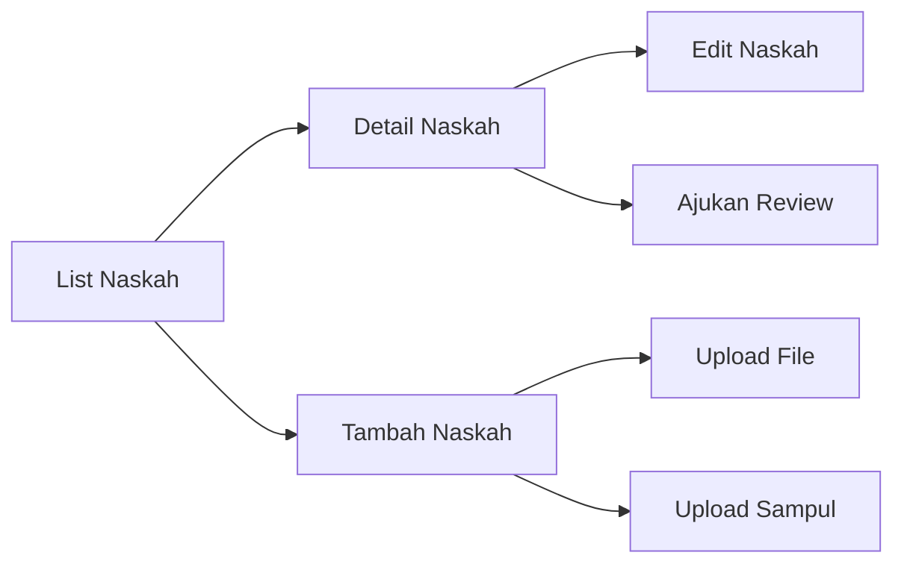

---

# SLIDE 19: IMPLEMENTASI FITUR REVIEW

## ✏️ Fitur Review untuk Editor

### Form Review Mobile

```dart
// review_form_page.dart - Simplified
class ReviewFormPage extends StatelessWidget {
  final Review review;

  Widget build(BuildContext context) {
    return Scaffold(
      appBar: AppBar(title: Text('Review Naskah')),
      body: SingleChildScrollView(
        child: Column(
          children: [
            // Info Naskah Card
            NaskahInfoCard(naskah: review.naskah),

            // Feedback per Bab
            FeedbackSection(reviewId: review.id),

            // Rekomendasi
            RekomendasiSelector(
              onSelect: (rekomendasi) {
                // Handle selection
              },
            ),

            // Submit Button
            ElevatedButton(
              onPressed: _submitReview,
              child: Text('Submit Review'),
            ),
          ],
        ),
      ),
    );
  }
}
```

### Fitur Review Mobile

- ✅ List antrian review dengan filter
- ✅ Self-assign naskah tersedia
- ✅ Form feedback per bab
- ✅ Pilihan rekomendasi (Setujui/Revisi/Tolak)
- ✅ Preview naskah PDF

---

# SLIDE 20: INTEGRASI & NOTIFIKASI

## 🔔 Real-time Notification dengan Socket.io

### Alur Kerja Sistem Mobile

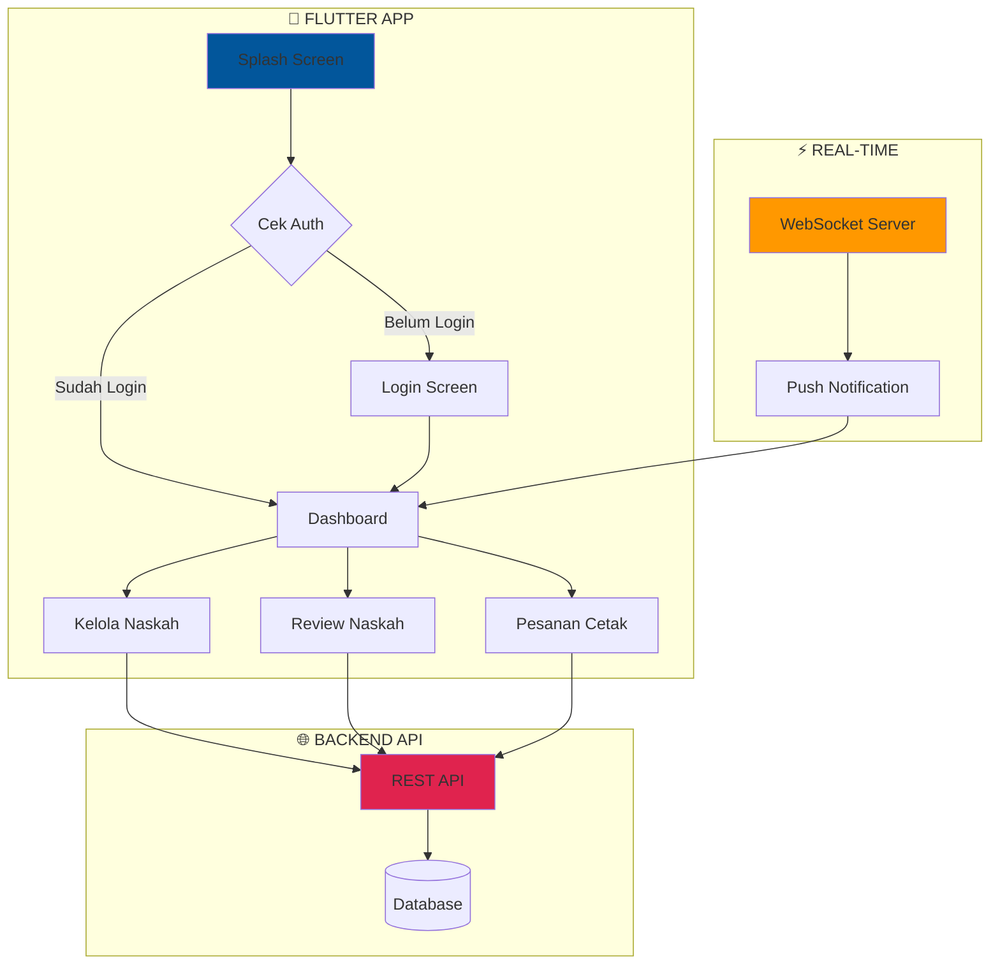

### Alur Penerbitan via Mobile

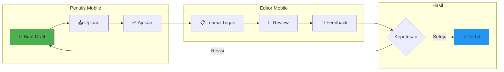

### Implementasi Socket Client

```dart
// socket_service.dart
class SocketService {
  late Socket socket;

  void connect(String token) {
    socket = io(
      'https://api.publishify.id',
      OptionBuilder()
        .setTransports(['websocket'])
        .setAuth({'token': token})
        .build(),
    );

    socket.onConnect((_) => print('Connected'));

    socket.on('notification', (data) {
      _showLocalNotification(data);
    });
  }

  void _showLocalNotification(Map data) {
    // Flutter Local Notifications
    flutterLocalNotificationsPlugin.show(
      data['id'],
      data['title'],
      data['body'],
      notificationDetails,
    );
  }
}
```

### Event Notifikasi yang Ditangani

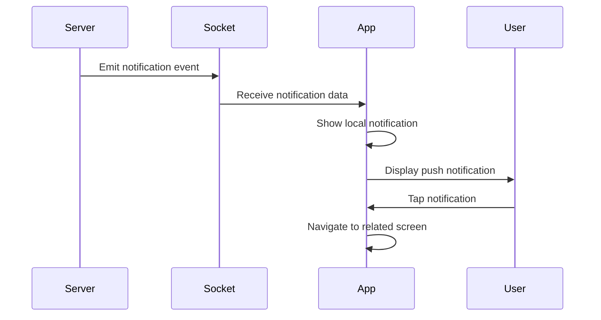

---

# SLIDE 21: PENGUJIAN APLIKASI MOBILE

## ✅ Hasil Pengujian Fungsional

### Pengujian Black-Box Mobile

| No        | Modul       | Test Cases | Pass   | Status      |
| --------- | ----------- | ---------- | ------ | ----------- |
| 1         | Autentikasi | 7          | 7      | ✅ 100%     |
| 2         | Dashboard   | 4          | 4      | ✅ 100%     |
| 3         | Naskah      | 8          | 8      | ✅ 100%     |
| 4         | Review      | 6          | 6      | ✅ 100%     |
| 5         | Percetakan  | 5          | 5      | ✅ 100%     |
| 6         | Notifikasi  | 3          | 3      | ✅ 100%     |
| **Total** |             | **33**     | **33** | **✅ 100%** |

### Visualisasi Hasil

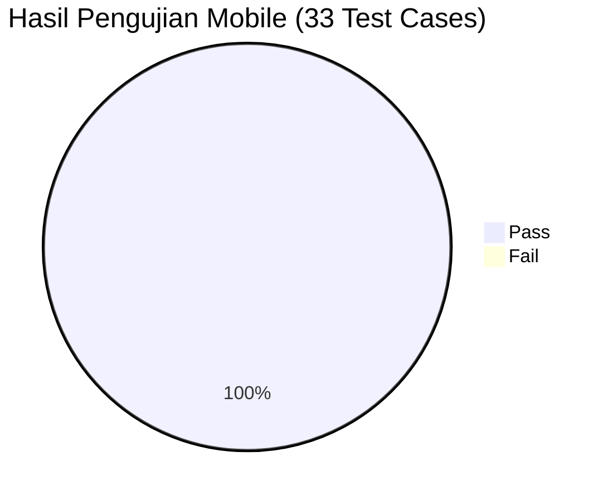

---

# SLIDE 22: PENGUJIAN KOMPATIBILITAS

## 📱 Kompatibilitas Android

### Hasil Pengujian Multi-Device

| Device               | Android Version | API Level | UI  | Function | Status  |
| -------------------- | --------------- | --------- | --- | -------- | ------- |
| Pixel 6 (Emulator)   | Android 13      | 33        | ✓   | ✓        | ✅ Pass |
| Samsung Galaxy A52   | Android 12      | 31        | ✓   | ✓        | ✅ Pass |
| Xiaomi Redmi Note 10 | Android 11      | 30        | ✓   | ✓        | ✅ Pass |
| OPPO A15             | Android 10      | 29        | ✓   | ✓        | ✅ Pass |
| Emulator Min SDK     | Android 8.1     | 27        | ✓   | ✓        | ✅ Pass |

### Pengujian Kinerja

```python
# Metrik kinerja aplikasi mobile
import matplotlib.pyplot as plt

metrics = ['App Launch', 'API Response', 'Screen Transition', 'Image Load']
times_ms = [1200, 150, 300, 500]
targets = [2000, 500, 500, 1000]

x = range(len(metrics))
width = 0.35

fig, ax = plt.subplots(figsize=(10, 5))
bars1 = ax.bar([i - width/2 for i in x], times_ms, width, label='Actual', color='#4CAF50')
bars2 = ax.bar([i + width/2 for i in x], targets, width, label='Target', color='#2196F3')

ax.set_ylabel('Time (ms)')
ax.set_title('Performa Aplikasi Mobile vs Target')
ax.set_xticks(x)
ax.set_xticklabels(metrics)
ax.legend()
plt.show()
```

---

# SLIDE 23: PEMBAHASAN & PERBANDINGAN

## 📊 Perbandingan Fitur Web vs Mobile

| Fitur          | Web       | Mobile           | Keterangan                    |
| -------------- | --------- | ---------------- | ----------------------------- |
| Login/Register | ✓         | ✓                | Identik                       |
| Google OAuth   | ✓         | ✓                | Native implementation berbeda |
| Dashboard      | ✓         | ✓                | Layout responsive vs native   |
| Kelola Naskah  | ✓         | ✓                | Fitur penuh                   |
| Upload File    | Drag-drop | File picker      | Platform-specific             |
| Upload Gambar  | Browse    | Camera + Gallery | Mobile advantage              |
| Review Naskah  | ✓         | ✓                | Fitur penuh                   |
| Notifikasi     | WebSocket | Push + Socket    | Mobile push notification      |
| Offline Mode   | ✗         | Partial          | Mobile advantage              |

### Keunggulan Mobile App

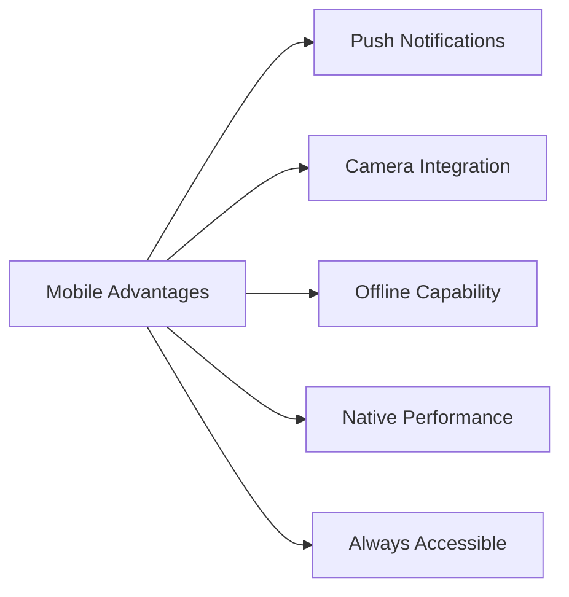

---

# SLIDE 24: KESIMPULAN

## 📝 Kesimpulan Pengembangan Mobile

### 1. Pencapaian Tujuan

| No  | Tujuan                      | Status | Capaian                       |
| --- | --------------------------- | ------ | ----------------------------- |
| 1   | Aplikasi Flutter multi-role | ✅     | 4 dashboard, 41+ halaman      |
| 2   | Integrasi backend API       | ✅     | 20+ services terintegrasi     |
| 3   | Notifikasi real-time        | ✅     | Socket.io + Push notification |
| 4   | Fitur upload native         | ✅     | Camera, Gallery, File picker  |
| 5   | Material Design UI          | ✅     | Konsisten & responsive        |
| 6   | Kompatibilitas Android      | ✅     | API 27+ (Android 8.1+)        |

### 2. Statistik Aplikasi Mobile

| Metrik              | Nilai        |
| ------------------- | ------------ |
| Total Halaman       | 41+          |
| Total Widget Custom | 30+          |
| Total Services      | 20+          |
| Test Cases Pass     | 33/33 (100%) |
| Devices Tested      | 5+           |
| Min Android Version | 8.1 (API 27) |

### 3. Efektivitas ADDIE

Metode ADDIE berhasil memandu pengembangan aplikasi mobile secara sistematis dengan hasil yang terukur.

---

# SLIDE 25: MANFAAT & KONTRIBUSI PROYEK

## 🎯 Kontribusi Proyek Aplikasi Mobile Publishify

### Manfaat bagi Pemangku Kepentingan

| Pengguna       | Manfaat Aplikasi Mobile                           |
| -------------- | ------------------------------------------------- |
| **Penulis**    | Akses pengelolaan naskah kapan saja, di mana saja |
| **Editor**     | Review naskah dengan fleksibilitas tinggi         |
| **Percetakan** | Monitoring pesanan cetak secara real-time         |
| **Admin**      | Pantau aktivitas sistem langsung dari smartphone  |

### Kontribusi Pengembangan

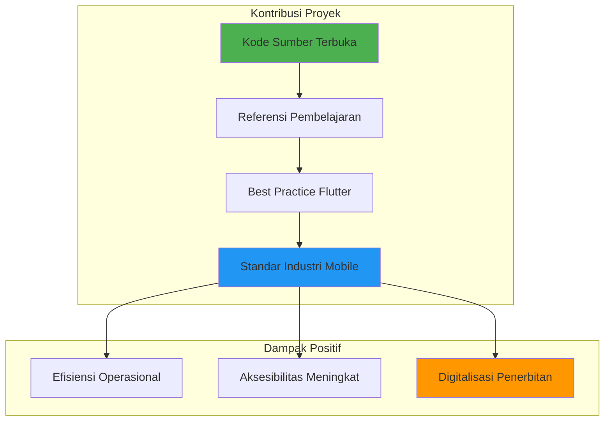

### Nilai Tambah Akademis

1. **Implementasi ADDIE** - Bukti penerapan metodologi pengembangan sistematis
2. **Flutter Best Practices** - Contoh nyata arsitektur aplikasi mobile modern
3. **Integrasi API** - Demonstrasi komunikasi frontend-backend yang efektif
4. **State Management** - Penerapan pola Provider yang scalable

---

# SLIDE 26: PENUTUP

## 🙏 Kata Penutup

### Kontribusi Aplikasi Mobile

**Praktis:**

- Akses penerbitan naskah kapan saja, di mana saja
- Notifikasi real-time untuk update penting
- Upload naskah langsung dari perangkat mobile

**Teknis:**

- Implementasi Flutter best practices
- Integrasi REST API + WebSocket yang robust
- Referensi pengembangan aplikasi penerbitan mobile

---

### Ucapan Terima Kasih

Kami mengucapkan terima kasih kepada:

1. **Tuhan Yang Maha Esa**
2. **Orang tua dan keluarga**
3. **Dosen Pembimbing**
4. **Teman-teman seperjuangan**
5. **Komunitas Flutter Indonesia**

---

<div align="center">

### 💬 Sesi Tanya Jawab

---

> _"Mobile is not the future, it is the now. Meet your customers in the environment of their choice, not where it's convenient for you."_
>
> — Cyndie Shaffstall

---

**Terima Kasih**

📧 Contact: tim@publishify.id
🌐 Website: https://publishify.id
📱 Download: Play Store (coming soon)
📂 Repository: github.com/publishify

</div>

---

# LAMPIRAN: STATISTIK PROYEK MOBILE

## 📊 Ringkasan Statistik

```
┌─────────────────────────────────────────────────────────────────┐
│              STATISTIK PROYEK MOBILE PUBLISHIFY                  │
├─────────────────────────────────────────────────────────────────┤
│  Framework & Bahasa                                              │
│  ├── Framework: Flutter 3.x                                     │
│  ├── Bahasa: Dart                                               │
│  ├── State Management: Provider                                 │
│  └── HTTP Client: Dio                                           │
├─────────────────────────────────────────────────────────────────┤
│  Komponen Aplikasi                                               │
│  ├── Halaman: 41+ halaman                                       │
│  ├── Widget Custom: 30+ widget                                  │
│  ├── Services: 20+ layanan                                      │
│  └── Models: 18+ model data                                     │
├─────────────────────────────────────────────────────────────────┤
│  Integrasi                                                       │
│  ├── REST API: Full coverage                                    │
│  ├── WebSocket: Socket.io client                                │
│  ├── Push Notification: Flutter Local Notifications             │
│  └── File Handling: Image picker + File picker                  │
├─────────────────────────────────────────────────────────────────┤
│  Pengujian                                                       │
│  ├── Total Test Cases: 33                                       │
│  ├── Pass Rate: 100%                                            │
│  ├── Devices Tested: 5+                                         │
│  └── Min SDK: Android 8.1 (API 27)                              │
└─────────────────────────────────────────────────────────────────┘
```

---

# LAMPIRAN: DEPENDENCY UTAMA

## 📦 Packages Flutter yang Digunakan

```yaml
# pubspec.yaml - Main dependencies
dependencies:
  flutter:
    sdk: flutter

  # HTTP & API
  dio: ^5.4.0
  socket_io_client: ^2.0.3

  # State Management
  provider: ^6.1.1

  # Local Storage
  shared_preferences: ^2.2.2

  # UI Components
  flutter_svg: ^2.0.9
  cached_network_image: ^3.3.1

  # File Handling
  image_picker: ^1.0.7
  file_picker: ^6.1.1

  # Notifications
  flutter_local_notifications: ^16.3.2

  # Utils
  intl: ^0.19.0
  url_launcher: ^6.2.4
```

---

# LAMPIRAN: DAFTAR PUSTAKA

## 📚 Referensi Mobile Development

1. Flutter Documentation (2024). https://docs.flutter.dev
2. Dart Documentation (2024). https://dart.dev/guides
3. Material Design 3 Guidelines (2024). https://m3.material.io
4. Provider Package Documentation. https://pub.dev/packages/provider
5. Socket.io Client Documentation. https://socket.io/docs/v4/client-api
6. Android Developer Guidelines (2024). https://developer.android.com/guide

---

_Presentasi ini merupakan bagian dari Laporan Akhir Proyek Publishify_
_Tim Pengembang Publishify © 2026_
