# PRESENTASI PROYEK AKHIR

## PENGEMBANGAN SISTEM PENERBITAN NASKAH DIGITAL PUBLISHIFY

### Platform Web (Next.js & NestJS)

---

# 📑 DAFTAR ISI PRESENTASI

| No  | Slide       | Topik                          |
| --- | ----------- | ------------------------------ |
| 1   | Slide 1-3   | Pembukaan & Latar Belakang     |
| 2   | Slide 4-6   | Identifikasi & Rumusan Masalah |
| 3   | Slide 7-9   | Kajian Teori & Metode ADDIE    |
| 4   | Slide 10-14 | Perancangan Sistem Web         |
| 5   | Slide 15-20 | Hasil Implementasi             |
| 6   | Slide 21-23 | Pengujian & Pembahasan         |
| 7   | Slide 24-26 | Kesimpulan, Manfaat & Penutup  |

---

# SLIDE 1: HALAMAN JUDUL

<div align="center">

## PENGEMBANGAN SISTEM PENERBITAN NASKAH DIGITAL BERBASIS WEB MENGGUNAKAN METODE ADDIE

### (Studi Kasus: Publishify)

---

**Disusun oleh:**
Tim Pengembang Publishify

**Program Studi Teknik Informatika**
**Fakultas Teknik**
**2026**

</div>

---

# SLIDE 2: GAMBARAN UMUM PROYEK

## 📊 Informasi Proyek Publishify

| Aspek           | Keterangan                                                        |
| --------------- | ----------------------------------------------------------------- |
| **Nama Proyek** | Publishify - Sistem Penerbitan Naskah Digital                     |
| **Platform**    | Aplikasi Berbasis Web                                             |
| **Metode**      | ADDIE (Analysis, Design, Development, Implementation, Evaluation) |
| **Periode**     | 2024 - 2026                                                       |
| **Tech Stack**  | Next.js 14+, NestJS 10+, PostgreSQL, Redis                        |

### 🎯 Visi Proyek

> Menjadi platform digital terintegrasi yang menghubungkan **Penulis**, **Editor**, **Percetakan**, dan **Administrator** dalam satu ekosistem penerbitan yang efisien.

---

# SLIDE 3: LATAR BELAKANG

## 📖 Kondisi Industri Penerbitan Indonesia

### Fakta Industri (IKAPI, 2023)

- **1.500+** penerbit aktif di Indonesia
- **30.000** judul buku baru diterbitkan setiap tahun
- Industri terus berkembang namun menghadapi tantangan efisiensi operasional

### Proses Penerbitan Konvensional


**Karakteristik:** Manual, terpisah-pisah, dan membutuhkan koordinasi intensif

---

# SLIDE 4: IDENTIFIKASI MASALAH

## 🔍 Permasalahan yang Teridentifikasi


---

# SLIDE 5: ANALISIS MASALAH PER PERSPEKTIF

## 👥 Permasalahan Berdasarkan Pemangku Kepentingan

| Pemangku Kepentingan | Permasalahan                     | Dampak                         |
| -------------------- | -------------------------------- | ------------------------------ |
| **Penulis**          | Pelacakan status tidak real-time | Ketidakpastian dan kecemasan   |
| **Penulis**          | Umpan balik tidak terstruktur    | Kesulitan revisi               |
| **Editor**           | Beban kerja tidak terkelola      | Produktivitas menurun          |
| **Editor**           | Tidak ada sistem rekomendasi     | Keputusan tidak terdokumentasi |
| **Percetakan**       | Pesanan tidak terintegrasi       | Kesalahan pemrosesan           |
| **Percetakan**       | Produksi tidak terlacak          | Keterlambatan pengiriman       |
| **Sistem**           | Data terfragmentasi              | Analisis sulit dilakukan       |

---

# SLIDE 6: RUMUSAN MASALAH & TUJUAN

## ❓ Rumusan Masalah

1. Bagaimana merancang sistem yang mengintegrasikan seluruh proses penerbitan naskah?
2. Bagaimana membangun sistem manajemen naskah yang efektif dan efisien?
3. Bagaimana mengimplementasikan sistem review editorial yang terstruktur?
4. Bagaimana menyediakan akses multi-platform yang mudah digunakan?

## 🎯 Tujuan Proyek

| No  | Tujuan                                      | Target               |
| --- | ------------------------------------------- | -------------------- |
| 1   | Membangun sistem manajemen naskah digital   | ✓ Fitur CRUD lengkap |
| 2   | Mengimplementasikan sistem review editorial | ✓ Feedback per bab   |
| 3   | Menyediakan fitur pemesanan cetak           | ✓ Tracking status    |
| 4   | Mengembangkan notifikasi real-time          | ✓ WebSocket          |
| 5   | Mengimplementasikan keamanan sistem         | ✓ JWT + RBAC         |

---

# SLIDE 7: KAJIAN TEORI - SISTEM INFORMASI

## 📚 Landasan Teori

### Definisi Sistem Informasi (Laudon & Laudon, 2020)

> "Kombinasi terorganisir dari perangkat keras, perangkat lunak, infrastruktur jaringan, prosedur, dan sumber daya manusia yang mengumpulkan, mengubah, dan menyebarkan informasi."

### Komponen Sistem Informasi Publishify


---

# SLIDE 8: METODE ADDIE

## 🔄 Siklus Pengembangan ADDIE


### Alasan Pemilihan Metode ADDIE

1. **Sistematis** - Tahapan jelas dan terstruktur
2. **Evaluatif** - Evaluasi di setiap fase
3. **Iteratif** - Memungkinkan perbaikan berkelanjutan
4. **Dokumentatif** - Menghasilkan dokumentasi lengkap

---

# SLIDE 9: TAHAPAN ADDIE DALAM PROYEK

## 📋 Implementasi ADDIE pada Publishify

| Tahap              | Aktivitas                             | Output                        |
| ------------------ | ------------------------------------- | ----------------------------- |
| **Analysis**       | Observasi, wawancara, studi literatur | Dokumen kebutuhan sistem      |
| **Design**         | Perancangan arsitektur, database, UI  | Spesifikasi teknis, wireframe |
| **Development**    | Coding backend, frontend, database    | Source code, API dokumentasi  |
| **Implementation** | Deployment, konfigurasi server        | Sistem live, user manual      |
| **Evaluation**     | Black-box testing, usability testing  | Laporan pengujian             |

### Visualisasi Proporsi Waktu

```python
# Diagram proporsi waktu per tahap ADDIE
import matplotlib.pyplot as plt

tahap = ['Analysis', 'Design', 'Development', 'Implementation', 'Evaluation']
proporsi = [15, 20, 40, 15, 10]
warna = ['#1565c0', '#2e7d32', '#ef6c00', '#c2185b', '#7b1fa2']

plt.figure(figsize=(10, 6))
plt.pie(proporsi, labels=tahap, autopct='%1.0f%%', colors=warna, explode=[0.02]*5)
plt.title('Proporsi Waktu Pengembangan per Tahap ADDIE')
plt.show()
```

---

# SLIDE 10: ARSITEKTUR SISTEM WEB

## 🏗️ Three-Tier Architecture


### Keunggulan Arsitektur

- **Skalabilitas** - Setiap layer dapat di-scale independen
- **Maintainability** - Pemisahan tanggung jawab yang jelas
- **Flexibility** - Mudah diganti atau diupgrade per komponen

---

# SLIDE 11: TECH STACK FRONTEND

## ⚛️ Teknologi Frontend Web

| Komponen          | Teknologi               | Fungsi                            |
| ----------------- | ----------------------- | --------------------------------- |
| **Framework**     | Next.js 14 (App Router) | Server-side rendering, routing    |
| **Bahasa**        | TypeScript              | Type safety, developer experience |
| **Styling**       | Tailwind CSS            | Utility-first CSS framework       |
| **UI Library**    | shadcn/ui               | Komponen UI modern                |
| **State**         | Zustand                 | Global state management           |
| **Data Fetching** | TanStack Query          | Server state, caching             |
| **Form**          | React Hook Form + Zod   | Form handling & validation        |

### Contoh Struktur Komponen

```typescript
// Contoh komponen KartuNaskah
interface KartuNaskahProps {
  naskah: Naskah;
  padaKlik?: (id: string) => void;
}

export function KartuNaskah({ naskah, padaKlik }: KartuNaskahProps) {
  return (
    <Card onClick={() => padaKlik?.(naskah.id)}>
      <CardHeader>
        <CardTitle>{naskah.judul}</CardTitle>
        <Badge>{naskah.status}</Badge>
      </CardHeader>
    </Card>
  );
}
```

---

# SLIDE 12: TECH STACK BACKEND

## 🔧 Teknologi Backend API

| Komponen      | Teknologi      | Fungsi                  |
| ------------- | -------------- | ----------------------- |
| **Framework** | NestJS 10      | Modular architecture    |
| **ORM**       | Prisma         | Database abstraction    |
| **Database**  | PostgreSQL 14  | Relational database     |
| **Cache**     | Redis          | Session & caching       |
| **Auth**      | Passport + JWT | Authentication          |
| **Realtime**  | Socket.io      | WebSocket notifications |
| **Docs**      | Swagger        | API documentation       |

### Arsitektur Modular NestJS


---

# SLIDE 13: PERANCANGAN DATABASE

## 🗄️ Entity Relationship Diagram


### Statistik Database

| Metrik       | Jumlah |
| ------------ | ------ |
| Total Tabel  | 28     |
| Domain Utama | 7      |
| Relasi       | 35+    |

---

# SLIDE 14: DESAIN ANTARMUKA PENGGUNA

## 🎨 Design System Publishify

### Palet Warna

| Warna   | Hex Code  | Penggunaan         |
| ------- | --------- | ------------------ |
| Primary | `#6366F1` | Tombol utama, link |
| Success | `#10B981` | Status berhasil    |
| Warning | `#F59E0B` | Status pending     |
| Danger  | `#EF4444` | Error, hapus       |
| Neutral | `#6B7280` | Teks sekunder      |

### Wireframe Dashboard Penulis

```
┌──────────────────────────────────────────────────────────┐
│  [Logo] Publishify            🔔  👤 Nama Penulis  ▼     │
├──────────────────────────────────────────────────────────┤
│ ┌─────────┐  ┌────────────────────────────────────────┐  │
│ │ Beranda │  │          SELAMAT DATANG               │  │
│ │ Naskah  │  │      Dashboard Penulis                │  │
│ │ Review  │  ├────────────────────────────────────────┤  │
│ │ Pesanan │  │ [12]     [3]      [2]      [5]        │  │
│ │ Profil  │  │ Naskah   Review   Pesanan  Terbit     │  │
│ └─────────┘  └────────────────────────────────────────┘  │
└──────────────────────────────────────────────────────────┘
```

---

# SLIDE 15: HASIL IMPLEMENTASI BACKEND

## ⚙️ Statistik Implementasi Backend

| Komponen           | Jumlah | Keterangan                          |
| ------------------ | ------ | ----------------------------------- |
| **Modul**          | 10     | Auth, Pengguna, Naskah, Review, dll |
| **Controller**     | 12     | Penanganan HTTP request             |
| **Service**        | 15     | Logika bisnis                       |
| **DTO**            | 45+    | Data Transfer Objects               |
| **Guard**          | 4      | JWT, Roles, Throttler, OAuth        |
| **Endpoint API**   | 66+    | REST API endpoints                  |
| **Tabel Database** | 28     | Entitas basis data                  |

### Modul-modul Backend


---

# SLIDE 16: CONTOH IMPLEMENTASI SERVICE

## 💻 Kode Service Naskah

```typescript
// naskah.service.ts - Contoh implementasi service
@Injectable()
export class NaskahService {
  constructor(private readonly prisma: PrismaService) {}

  async buatNaskah(idPenulis: string, dto: BuatNaskahDto) {
    const naskah = await this.prisma.naskah.create({
      data: {
        ...dto,
        idPenulis,
        status: "draft",
      },
      include: { penulis: true, kategori: true },
    });

    return {
      sukses: true,
      pesan: "Naskah berhasil dibuat",
      data: naskah,
    };
  }
}
```

### Response API Standar

```json
{
  "sukses": true,
  "pesan": "Data berhasil diambil",
  "data": { ... },
  "metadata": {
    "total": 100,
    "halaman": 1,
    "limit": 20
  }
}
```

---

# SLIDE 17: HASIL IMPLEMENTASI FRONTEND

## 🖥️ Statistik Implementasi Frontend

| Komponen            | Jumlah | Keterangan                  |
| ------------------- | ------ | --------------------------- |
| **Halaman**         | 25+    | Termasuk dashboard per role |
| **Komponen**        | 80+    | UI components               |
| **Custom Hooks**    | 15+    | React hooks                 |
| **API Services**    | 12     | API client services         |
| **Store (Zustand)** | 5      | State management            |

### Halaman yang Diimplementasikan

| Role           | Halaman Utama                                        |
| -------------- | ---------------------------------------------------- |
| **Penulis**    | Dashboard, Daftar Naskah, Form Naskah, Detail Naskah |
| **Editor**     | Dashboard, Antrian Review, Form Review, Riwayat      |
| **Percetakan** | Dashboard, Pesanan, Detail Pesanan, Pengiriman       |
| **Admin**      | Dashboard, Kelola Pengguna, Penugasan, Penerbitan    |

---

# SLIDE 18: TAMPILAN HALAMAN WEB

## 📱 Screenshot Halaman Utama

### Struktur Navigasi per Role


### Fitur Unggulan Frontend

1. **Responsive Design** - Tampilan optimal di berbagai ukuran layar
2. **Dark/Light Mode** - Dukungan tema gelap dan terang
3. **Real-time Update** - Status terupdate tanpa refresh
4. **Form Validation** - Validasi input real-time

---

# SLIDE 19: INTEGRASI & NOTIFIKASI REAL-TIME

## 🔔 Sistem Notifikasi WebSocket


### Event Notifikasi yang Diimplementasikan

| Event                  | Penerima | Deskripsi                    |
| ---------------------- | -------- | ---------------------------- |
| `naskah_diajukan`      | Admin    | Naskah baru perlu ditugaskan |
| `editor_ditugaskan`    | Editor   | Ada naskah untuk direview    |
| `review_selesai`       | Penulis  | Review naskah telah selesai  |
| `pesanan_dikonfirmasi` | Pemesan  | Pesanan diterima percetakan  |
| `pesanan_dikirim`      | Pemesan  | Pesanan dalam pengiriman     |

---

# SLIDE 20: ALUR KERJA SISTEM

## 🔄 Alur Penerbitan Naskah End-to-End

```mermaid
flowchart TD
    subgraph Penulis["👨‍💻 PENULIS"]
        A[Buat Naskah Draft] --> B[Upload File & Sampul]
        B --> C[Lengkapi Metadata]
        C --> D[Ajukan ke Review]
    end

    subgraph Admin1["👨‍💼 ADMIN - Penugasan"]
        D --> E{Naskah Masuk}
        E --> F[Pilih Editor]
        F --> G[Tugaskan Review]
    end

    subgraph Editor["✏️ EDITOR"]
        G --> H[Terima Tugas Review]
        H --> I[Baca & Analisis Naskah]
        I --> J[Beri Feedback per Bab]
        J --> K{Keputusan}
        K -->|Setuju| L[Rekomendasi Setujui]
        K -->|Perlu Perbaikan| M[Rekomendasi Revisi]
        K -->|Tidak Layak| N[Rekomendasi Tolak]
    end

    subgraph Proses["🔄 PROSES LANJUTAN"]
        M --> O[Penulis Revisi]
        O --> D
        L --> P[Admin Review Final]
        P --> Q[Terbitkan Naskah]
        N --> R[Naskah Ditolak]
    end

    style A fill:#4CAF50
    style Q fill:#2196F3
    style R fill:#f44336
```



### Alur Kerja Platform Web

```mermaid
flowchart LR
    subgraph Frontend["🖥️ Next.js Frontend"]
        W1[User Login] --> W2[Dashboard]
        W2 --> W3[Kelola Naskah]
        W2 --> W4[Lihat Notifikasi]
    end

    subgraph Backend["⚙️ NestJS Backend"]
        W3 --> API[REST API]
        W4 --> WS[WebSocket]
        API --> DB[(PostgreSQL)]
        WS --> REDIS[(Redis)]
    end

    style W1 fill:#61dafb
    style API fill:#e0234e
    style DB fill:#336791
```



### Fitur Tracking Status

- Status tersimpan dengan timestamp
- Log perubahan tercatat otomatis
- Notifikasi terkirim setiap transisi

---

# SLIDE 21: PENGUJIAN SISTEM

## ✅ Hasil Black-Box Testing

### Ringkasan Hasil Pengujian

```python
# Visualisasi hasil pengujian
import matplotlib.pyplot as plt

modul = ['Auth', 'Naskah', 'Review', 'Percetakan', 'Admin']
pass_count = [7, 8, 7, 5, 4]
total = sum(pass_count)

plt.figure(figsize=(10, 5))
bars = plt.bar(modul, pass_count, color=['#4CAF50']*5)
plt.xlabel('Modul')
plt.ylabel('Jumlah Test Case Pass')
plt.title(f'Hasil Pengujian: {total}/31 Test Cases PASS (100%)')
for bar, count in zip(bars, pass_count):
    plt.text(bar.get_x() + bar.get_width()/2, bar.get_height() + 0.1,
             str(count), ha='center')
plt.show()
```

### Tabel Ringkasan

| Modul            | Total Skenario | Pass   | Fail  | Persentase |
| ---------------- | -------------- | ------ | ----- | ---------- |
| Autentikasi      | 7              | 7      | 0     | 100%       |
| Manajemen Naskah | 8              | 8      | 0     | 100%       |
| Review           | 7              | 7      | 0     | 100%       |
| Percetakan       | 5              | 5      | 0     | 100%       |
| Admin            | 4              | 4      | 0     | 100%       |
| **TOTAL**        | **31**         | **31** | **0** | **100%**   |

---

# SLIDE 22: PENGUJIAN RESPONSIVITAS

## 📐 Hasil Pengujian Multi-Device

| Device           | Resolusi  | Layout | Navigasi | Forms | Status  |
| ---------------- | --------- | ------ | -------- | ----- | ------- |
| Desktop Large    | 1920×1080 | ✓      | ✓        | ✓     | ✅ Pass |
| Desktop          | 1366×768  | ✓      | ✓        | ✓     | ✅ Pass |
| Laptop           | 1280×800  | ✓      | ✓        | ✓     | ✅ Pass |
| Tablet Landscape | 1024×768  | ✓      | ✓        | ✓     | ✅ Pass |
| Tablet Portrait  | 768×1024  | ✓      | ✓        | ✓     | ✅ Pass |
| Mobile Large     | 425×812   | ✓      | ✓        | ✓     | ✅ Pass |
| Mobile Medium    | 375×667   | ✓      | ✓        | ✓     | ✅ Pass |

### Pengujian Kinerja API

| Endpoint              | Method | Response Time | Status |
| --------------------- | ------ | ------------- | ------ |
| `/api/auth/masuk`     | POST   | 120ms         | ✅     |
| `/api/naskah`         | GET    | 85ms          | ✅     |
| `/api/naskah/:id`     | GET    | 45ms          | ✅     |
| `/api/review/antrian` | GET    | 95ms          | ✅     |

---

# SLIDE 23: PEMBAHASAN HASIL

## 📊 Analisis Pencapaian

### Keberhasilan Implementasi


### Kelebihan Sistem Web Publishify

| Aspek           | Keunggulan                            |
| --------------- | ------------------------------------- |
| **Arsitektur**  | Modular, scalable, maintainable       |
| **Real-time**   | WebSocket untuk notifikasi instant    |
| **Keamanan**    | JWT + Role-based access control       |
| **UX/UI**       | Modern, responsive, intuitive         |
| **Dokumentasi** | Swagger API docs, kode terdokumentasi |

### Efektivitas Metode ADDIE

- Pendekatan sistematis memastikan kebutuhan terpenuhi
- Evaluasi berkelanjutan menghasilkan produk berkualitas
- Dokumentasi lengkap memudahkan pengembangan lanjutan

---

# SLIDE 24: KESIMPULAN

## 📝 Kesimpulan Proyek

### 1. Pencapaian Tujuan Utama

✅ Sistem penerbitan naskah terintegrasi berhasil dikembangkan

### 2. Hasil Implementasi Web

| Komponen     | Capaian                       |
| ------------ | ----------------------------- |
| Backend API  | 66+ endpoint, 10 modul bisnis |
| Frontend Web | 25+ halaman responsif         |
| Database     | 28 tabel terintegrasi         |
| Real-time    | WebSocket notifications       |
| Keamanan     | JWT + OAuth + RBAC            |

### 3. Hasil Pengujian

- **100% test cases passed** (31/31 skenario)
- Responsif di semua ukuran layar
- Response time API < 150ms

### 4. Efektivitas ADDIE

Metode ADDIE terbukti efektif untuk pengembangan sistematis dengan evaluasi berkelanjutan.

---

# SLIDE 25: MANFAAT & KONTRIBUSI PROYEK

## 🎯 Kontribusi Proyek Platform Web Publishify

### Manfaat bagi Pemangku Kepentingan

| Pengguna       | Manfaat Platform Web                         |
| -------------- | -------------------------------------------- |
| **Penulis**    | Pengajuan & tracking naskah terintegrasi     |
| **Editor**     | Dashboard review dengan notifikasi real-time |
| **Percetakan** | Manajemen pesanan cetak terstruktur          |
| **Admin**      | Kontrol penuh atas seluruh alur penerbitan   |

### Kontribusi Pengembangan


### Nilai Tambah Akademis

1. **Implementasi ADDIE** - Bukti penerapan metodologi pengembangan sistematis
2. **Next.js 14 + NestJS** - Contoh nyata arsitektur full-stack modern
3. **Real-time System** - Demonstrasi WebSocket untuk notifikasi live
4. **Database Design** - Desain ERD komprehensif dengan 28 tabel terintegrasi

---

# SLIDE 26: PENUTUP

## 🙏 Kata Penutup

### Kontribusi Proyek

**Praktis:**

- Platform untuk penerbit independen dan self-publisher
- Otomatisasi proses penerbitan manual
- Transparansi dan akuntabilitas editorial

**Teknis:**

- Implementasi Next.js 14 App Router + NestJS modern
- Referensi arsitektur multi-platform
- Dokumentasi teknis komprehensif

---

### Ucapan Terima Kasih

Kami mengucapkan terima kasih kepada:

1. **Tuhan Yang Maha Esa**
2. **Orang tua dan keluarga**
3. **Dosen Pembimbing**
4. **Teman-teman seperjuangan**
5. **Komunitas open-source**

---

<div align="center">

### 💬 Sesi Tanya Jawab

---

> _"Teknologi terbaik adalah teknologi yang tidak terlihat - ia menyatu dengan kehidupan sehari-hari hingga kita tidak menyadari kehadirannya."_
>
> — Mark Weiser

---

**Terima Kasih**

📧 Contact: tim@publishify.id
🌐 Website: https://publishify.id
📂 Repository: github.com/publishify

</div>

---

# LAMPIRAN: STATISTIK PROYEK

## 📊 Ringkasan Statistik

```
┌─────────────────────────────────────────────────────────────────┐
│                 STATISTIK PROYEK WEB PUBLISHIFY                  │
├─────────────────────────────────────────────────────────────────┤
│  Frontend Web                                                    │
│  ├── Framework: Next.js 14+ dengan App Router                   │
│  ├── Bahasa: TypeScript                                         │
│  ├── Komponen UI: 80+ komponen                                  │
│  └── Halaman: 25+ halaman fungsional                            │
├─────────────────────────────────────────────────────────────────┤
│  Backend API                                                     │
│  ├── Framework: NestJS 10+                                      │
│  ├── Bahasa: TypeScript                                         │
│  ├── Modul: 10 modul bisnis                                     │
│  └── Endpoint API: 66+ REST endpoints                           │
├─────────────────────────────────────────────────────────────────┤
│  Database                                                        │
│  ├── Sistem: PostgreSQL 14+                                     │
│  ├── ORM: Prisma 5+                                             │
│  ├── Tabel: 28 tabel                                            │
│  └── Fitur: RLS, Full-text Search, JSONB                        │
├─────────────────────────────────────────────────────────────────┤
│  Pengujian                                                       │
│  ├── Total Test Cases: 31                                       │
│  ├── Pass Rate: 100%                                            │
│  └── Avg Response Time: <150ms                                  │
└─────────────────────────────────────────────────────────────────┘
```

---

# LAMPIRAN: DAFTAR PUSTAKA UTAMA

## 📚 Referensi

1. Branch, R. M. (2009). _Instructional Design: The ADDIE Approach_. Springer.
2. Laudon, K. C., & Laudon, J. P. (2020). _Management Information Systems_. Pearson.
3. Pressman, R. S., & Maxim, B. R. (2019). _Software Engineering_. McGraw-Hill.
4. Next.js Documentation (2024). https://nextjs.org/docs
5. NestJS Documentation (2024). https://docs.nestjs.com
6. Prisma Documentation (2024). https://www.prisma.io/docs
7. PostgreSQL Documentation (2024). https://www.postgresql.org/docs

---

_Presentasi ini merupakan bagian dari Laporan Akhir Proyek Publishify_
_Tim Pengembang Publishify © 2026_
