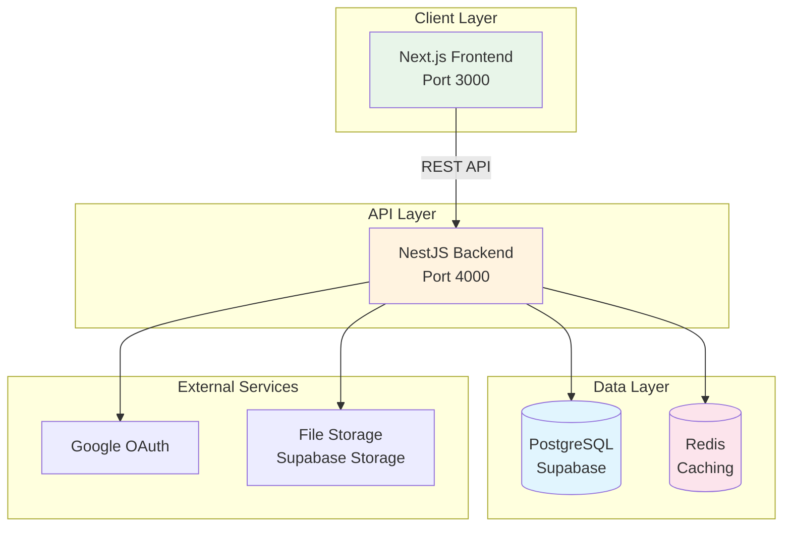
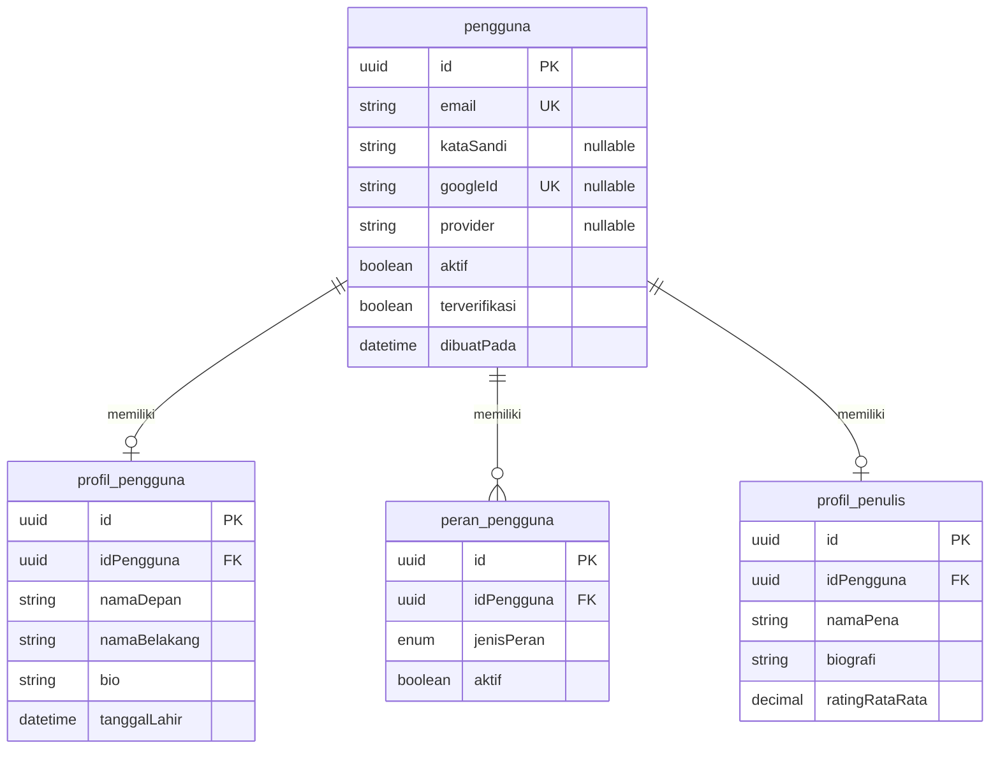
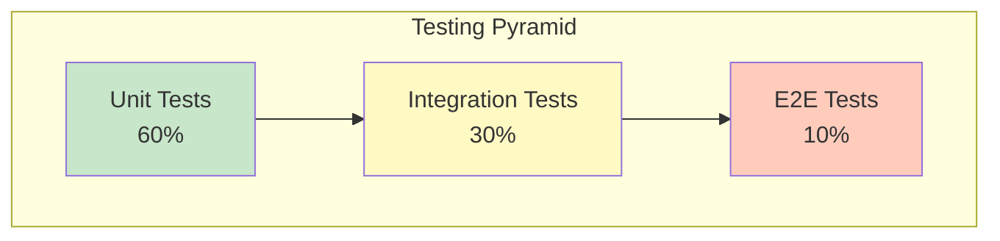

# LAPORAN DEVELOPMENT STEP BY STEP SISTEM PUBLISHIFY

# FASE 1: FONDASI DAN INFRASTRUKTUR INTI

**Jenis Dokumen**: Laporan Development & Tutorial Implementasi  
**Periode Pengembangan**: Minggu 1-2 (14 hari kerja)  
**Tanggal Penyusunan**: 31 Desember 2025  
**Tim Pengembang**: Tim Publishify  
**Metodologi**: ADDIE (Analysis, Design, Development, Implementation, Evaluation)

---

## A. PENDAHULUAN

### A.1 Latar Belakang Dokumen

Dokumen ini merupakan laporan development yang mendokumentasikan secara detail proses implementasi Fase 1 sistem Publishify dari perspektif teknis. Berbeda dengan laporan progress yang mendokumentasikan hasil dan pencapaian, laporan development ini berfokus pada **bagaimana** kami melakukan implementasi secara step-by-step, mulai dari persiapan environment hingga testing dan deployment.

Publishify adalah sistem penerbitan naskah digital yang dirancang untuk memfasilitasi seluruh alur kerja penerbitan, mulai dari penulisan naskah, review editorial, produksi percetakan, hingga distribusi. Sistem ini dibangun dengan teknologi modern untuk memastikan skalabilitas, performa, dan kemudahan maintenance di masa mendatang.

### A.2 Tujuan Dokumen

Dokumen ini memiliki beberapa tujuan utama:

**Tujuan Edukatif:**

- Memberikan panduan lengkap bagi developer yang ingin memahami atau mereplikasi implementasi Fase 1
- Menjelaskan reasoning di balik setiap keputusan teknis yang kami ambil
- Mendokumentasikan best practices yang kami terapkan sepanjang development

**Tujuan Dokumentatif:**

- Merekam seluruh proses development secara kronologis dan sistematis
- Menyediakan referensi untuk troubleshooting di masa mendatang
- Memfasilitasi knowledge transfer kepada anggota tim baru

**Tujuan Evaluatif:**

- Mengidentifikasi aspek-aspek yang berjalan dengan baik dan yang perlu improvement
- Memberikan basis untuk evaluasi metodologi development yang digunakan
- Menyediakan pembelajaran untuk fase-fase pengembangan selanjutnya

### A.3 Ruang Lingkup Fase 1

Fase 1 pengembangan Publishify mencakup pembangunan fondasi teknis yang solid untuk seluruh sistem. Scope pekerjaan meliputi:

**Backend Development:**

- Inisialisasi project NestJS dengan struktur modular
- Pembuatan 28 tabel database menggunakan Prisma ORM
- Implementasi sistem autentikasi (JWT + OAuth Google)
- Setup middleware, interceptors, guards, dan pipes
- Konfigurasi caching layer dengan Redis
- Implementasi logging dan error handling
- Setup API documentation dengan Swagger

**Frontend Development:**

- Inisialisasi project Next.js dengan App Router
- Setup shadcn/ui component library
- Implementasi authentication flows (login, register, OAuth)
- Pembuatan layout untuk 4 roles (penulis, editor, percetakan, admin)
- Setup state management dengan Zustand dan React Query
- Konfigurasi API client dengan Axios
- Implementasi form handling dengan React Hook Form + Zod

**Infrastructure:**

- Setup development environment dengan Docker
- Konfigurasi PostgreSQL via Supabase
- Setup Redis untuk caching
- Konfigurasi environment variables
- Setup testing framework (Jest untuk backend)
- Version control dengan Git

### A.4 Struktur Dokumen

Dokumen ini dibagi menjadi beberapa bagian untuk memudahkan pembacaan:

- **Part 1 (Dokumen ini)**: Pendahuluan, Analisis Kebutuhan, Perancangan Sistem
- **Part 2**: Implementasi Backend Step by Step
- **Part 3**: Implementasi Frontend Step by Step
- **Part 4**: Pengujian Sistem, Evaluasi, Kesimpulan

Total estimasi panjang dokumen: ~5,000+ kata terbagi dalam 4 file.

### A.5 Konvensi Penulisan

Dalam dokumen ini, kami menggunakan beberapa konvensi:

**Referensi File:**

> 📁 Menunjukkan lokasi file dalam project

**Screenshot Placeholder:**

> 📸 Menunjukkan lokasi untuk screenshot (akan diisi kemudian)

**Command Terminal:**

> 💻 Menunjukkan command yang harus dijalankan di terminal

**Catatan Penting:**

> ⚠️ Menunjukkan informasi penting atau warning

**Best Practice:**

> ✅ Menunjukkan best practice yang kami rekomendasikan

---

## B. ANALISIS KEBUTUHAN

Tahap analisis merupakan fondasi dari seluruh proses development. Kami melakukan analisis mendalam untuk memastikan bahwa setiap keputusan teknis yang diambil selaras dengan kebutuhan sistem.

### B.1 Analisis Kebutuhan Fungsional

#### B.1.1 Kebutuhan Sistem Autentikasi

Berdasarkan analisis yang kami lakukan, sistem autentikasi Publishify harus memenuhi kebutuhan berikut:

**Kebutuhan Dasar:**

1. **Registrasi Pengguna**: Pengguna dapat mendaftar dengan email dan password
2. **Login dengan Credentials**: Pengguna dapat login menggunakan email dan password
3. **OAuth Social Login**: Pengguna dapat login menggunakan akun Google untuk kemudahan
4. **Session Management**: Sistem harus mampu mengelola session pengguna dengan aman
5. **Token Refresh**: Implementasi refresh token untuk menghindari login berulang
6. **Logout**: Pengguna dapat logout dan invalidasi token

**Kebutuhan Keamanan:**

1. Password hashing dengan algoritma yang aman (bcrypt)
2. JWT token dengan expiration time yang tepat
3. Validasi input untuk mencegah injection attacks
4. Rate limiting untuk mencegah brute force attacks
5. CORS configuration untuk mengontrol akses dari origin yang valid

**Kebutuhan Multi-Role:**
Sistem harus mendukung 4 jenis role dengan permission yang berbeda:

- **Penulis**: Dapat membuat dan mengelola naskah sendiri
- **Editor**: Dapat mereview naskah yang ditugaskan
- **Percetakan**: Dapat mengelola pesanan cetak dan tracking produksi
- **Admin**: Memiliki akses penuh ke seluruh sistem

#### B.1.2 Kebutuhan Manajemen Data

**Database Requirements:**

1. Struktur data yang normalized untuk menghindari redundancy
2. Foreign key constraints untuk menjaga integritas referensial
3. Indexes untuk optimasi query performance
4. Support untuk full-text search di field tertentu
5. Audit trail untuk tracking changes

**Data Volume Estimation:**
Kami memproyeksikan volume data untuk 3 tahun pertama:

- Pengguna: ~10,000 users
- Naskah: ~50,000 manuscripts
- Pesanan Cetak: ~20,000 orders
- Review: ~30,000 reviews

Berdasarkan proyeksi ini, kami merancang database schema dengan kapasitas yang sufficient dan indexing strategy yang optimal.

#### B.1.3 Kebutuhan Performa

**Target Metrics:**

- API response time: <100ms untuk 95th percentile
- Database query time: <50ms untuk query sederhana
- Page load time: <2 detik untuk first contentful paint
- Time to interactive: <3 detik

**Scalability Requirements:**

- Sistem harus dapat handle 100 concurrent users tanpa degradasi signifikan
- Database harus dapat menyimpan minimal 100,000 records per tabel
- File storage harus dapat menampung minimal 10,000 files (total ~50GB)

### B.2 Analisis Kebutuhan Non-Fungsional

#### B.2.1 Keamanan (Security)

Kami mengidentifikasi beberapa aspek keamanan yang kritis:

**Authentication & Authorization:**

- Implementasi JWT dengan short-lived access tokens (15 menit)
- Refresh token dengan expiration 7 hari dan rotation strategy
- OAuth 2.0 integration dengan Google (dengan plan untuk Facebook dan Apple di future)
- Role-Based Access Control (RBAC) untuk permission management

**Data Protection:**

- Password hashing dengan bcrypt dan salt rounds yang adequate (12 rounds)
- Encryption untuk sensitive data di database
- HTTPS only untuk production
- Secure cookie configuration (HttpOnly, Secure, SameSite)

**API Security:**

- Input validation di semua endpoints menggunakan Zod schemas
- Rate limiting untuk mencegah abuse (100 requests per 15 menit per IP)
- CORS configuration dengan whitelist origins
- Helmet middleware untuk security headers
- SQL injection prevention melalui Prisma parameterized queries

**Audit & Compliance:**

- Activity logging untuk semua critical operations
- User action tracking untuk audit trail
- GDPR compliance untuk data privacy (right to be forgotten)

#### B.2.2 Maintainability

**Code Quality Standards:**
Kami menetapkan standards berikut untuk maintainability:

1. **Type Safety**: 100% TypeScript dengan strict mode enabled
2. **Code Style**: ESLint + Prettier dengan configuration yang konsisten
3. **Naming Convention**: Bahasa Indonesia untuk semua identifier (sesuai project requirement)
4. **Documentation**: JSDoc comments untuk functions yang complex
5. **Testing**: Minimal 70% code coverage dengan unit dan integration tests

**Architecture Patterns:**

- Modular architecture dengan clear separation of concerns
- Dependency injection untuk loose coupling
- Repository pattern untuk data access abstraction
- DTO (Data Transfer Objects) untuk API communication
- Service layer untuk business logic

**Version Control:**

- Git flow dengan branch strategy (main, develop, feature/\*)
- Meaningful commit messages dengan conventional commits
- Pull request reviews untuk semua changes
- Automated CI/CD pipeline untuk testing dan deployment

#### B.2.3 Skalabilitas (Scalability)

**Horizontal Scaling Readiness:**
Kami merancang sistem dengan kemampuan horizontal scaling:

- Stateless application design (JWT-based auth tanpa server-side session)
- Database connection pooling untuk efficient resource usage
- Redis untuk caching layer yang dapat di-scale independent
- API design yang RESTful dan stateless

**Vertical Scaling Considerations:**

- Query optimization dengan proper indexing
- Pagination untuk list endpoints
- Lazy loading untuk data yang besar
- Database query result caching

**Performance Optimization:**

- Redis caching untuk frequently accessed data
- Database indexes pada columns yang sering di-query
- API response compression (gzip)
- Frontend code splitting dan lazy loading
- Image optimization dan CDN usage (untuk future)

### B.3 Analisis Teknologi

#### B.3.1 Pemilihan Stack Teknologi

Kami melakukan comparative analysis untuk memilih teknologi yang paling sesuai:

**Runtime Environment:**

| Kriteria             | Node.js    | Bun        | Deno       |
| -------------------- | ---------- | ---------- | ---------- |
| Performance          | ⭐⭐⭐     | ⭐⭐⭐⭐⭐ | ⭐⭐⭐⭐   |
| Package Ecosystem    | ⭐⭐⭐⭐⭐ | ⭐⭐⭐⭐   | ⭐⭐⭐     |
| TypeScript Support   | ⭐⭐⭐     | ⭐⭐⭐⭐⭐ | ⭐⭐⭐⭐⭐ |
| Maturity             | ⭐⭐⭐⭐⭐ | ⭐⭐⭐     | ⭐⭐⭐     |
| Developer Experience | ⭐⭐⭐     | ⭐⭐⭐⭐⭐ | ⭐⭐⭐⭐   |

**Keputusan**: Kami memilih **Bun** karena:

- Performance yang superior (3x lebih cepat dari Node.js untuk startup)
- Built-in TypeScript support tanpa perlu transpiler
- All-in-one toolchain (runtime, package manager, bundler, test runner)
- Compatibility yang baik dengan ecosystem Node.js
- Developer experience yang excellent dengan fast feedback loop

**Backend Framework:**

| Kriteria          | NestJS     | Express.js | Fastify  | Hono     |
| ----------------- | ---------- | ---------- | -------- | -------- |
| Structure         | ⭐⭐⭐⭐⭐ | ⭐⭐       | ⭐⭐⭐   | ⭐⭐⭐   |
| TypeScript        | ⭐⭐⭐⭐⭐ | ⭐⭐⭐     | ⭐⭐⭐⭐ | ⭐⭐⭐⭐ |
| DI Container      | ⭐⭐⭐⭐⭐ | ⭐         | ⭐⭐     | ⭐       |
| Built-in Features | ⭐⭐⭐⭐⭐ | ⭐⭐       | ⭐⭐⭐   | ⭐⭐⭐   |
| Community         | ⭐⭐⭐⭐⭐ | ⭐⭐⭐⭐⭐ | ⭐⭐⭐⭐ | ⭐⭐⭐   |
| Documentation     | ⭐⭐⭐⭐⭐ | ⭐⭐⭐⭐   | ⭐⭐⭐⭐ | ⭐⭐⭐   |

**Keputusan**: Kami memilih **NestJS** karena:

- Architecture yang mature dan opinionated (good for team collaboration)
- Dependency injection yang powerful untuk testability
- Modular structure yang sesuai untuk large-scale application
- Built-in support untuk Swagger, WebSocket, GraphQL, microservices
- Extensive ecosystem dan community support
- Learning curve yang worth it untuk long-term maintainability

**Frontend Framework:**

| Kriteria             | Next.js    | Create React App | Remix      | Gatsby   |
| -------------------- | ---------- | ---------------- | ---------- | -------- |
| SSR Support          | ⭐⭐⭐⭐⭐ | ⭐               | ⭐⭐⭐⭐⭐ | ⭐⭐⭐   |
| File-based Routing   | ⭐⭐⭐⭐⭐ | ⭐               | ⭐⭐⭐⭐⭐ | ⭐⭐⭐⭐ |
| API Routes           | ⭐⭐⭐⭐⭐ | ⭐               | ⭐⭐⭐⭐   | ⭐       |
| Build Performance    | ⭐⭐⭐⭐⭐ | ⭐⭐⭐           | ⭐⭐⭐⭐   | ⭐⭐⭐   |
| Developer Experience | ⭐⭐⭐⭐⭐ | ⭐⭐⭐           | ⭐⭐⭐⭐   | ⭐⭐⭐   |
| Community            | ⭐⭐⭐⭐⭐ | ⭐⭐⭐⭐         | ⭐⭐⭐⭐   | ⭐⭐⭐⭐ |

**Keputusan**: Kami memilih **Next.js 14+** dengan App Router karena:

- Server-side rendering dan static generation untuk performance
- React Server Components untuk optimized data fetching
- File-based routing yang intuitive dan powerful
- Built-in optimization untuk images, fonts, scripts
- API routes untuk backend-for-frontend pattern
- Excellent developer experience dengan Fast Refresh
- Large community dan extensive documentation

**Database & ORM:**

| Kriteria             | Prisma + PostgreSQL | TypeORM + PostgreSQL | Sequelize + MySQL |
| -------------------- | ------------------- | -------------------- | ----------------- |
| Type Safety          | ⭐⭐⭐⭐⭐          | ⭐⭐⭐⭐             | ⭐⭐⭐            |
| Developer Experience | ⭐⭐⭐⭐⭐          | ⭐⭐⭐               | ⭐⭐⭐            |
| Migration Tools      | ⭐⭐⭐⭐⭐          | ⭐⭐⭐⭐             | ⭐⭐⭐            |
| Query Builder        | ⭐⭐⭐⭐⭐          | ⭐⭐⭐⭐             | ⭐⭐⭐            |
| Performance          | ⭐⭐⭐⭐⭐          | ⭐⭐⭐⭐             | ⭐⭐⭐⭐          |
| Documentation        | ⭐⭐⭐⭐⭐          | ⭐⭐⭐⭐             | ⭐⭐⭐            |

**Keputusan**: Kami memilih **Prisma + PostgreSQL** karena:

- Auto-generated type-safe client dari schema
- Prisma Studio untuk database visualization
- Excellent migration system
- Query optimization yang intelligent
- PostgreSQL features (JSONB, full-text search, arrays, etc.)
- Supabase support untuk managed PostgreSQL dengan bonus features

#### B.3.2 Arsitektur Sistem

Kami merancang arsitektur dengan prinsip:

**Separation of Concerns:**



**Modular Architecture:**
Setiap feature diorganisir sebagai module yang independent dengan structure:

- Controller: Handle HTTP requests
- Service: Business logic
- Repository (via Prisma): Data access
- DTO: Data validation dan transformation
- Guards: Authorization
- Decorators: Metadata dan utilities

### B.4 Analisis Risiko

#### B.4.1 Risiko Teknis

| Risiko                       | Probabilitas | Dampak   | Mitigasi                                                         |
| ---------------------------- | ------------ | -------- | ---------------------------------------------------------------- |
| **Bun Compatibility Issues** | Medium       | Medium   | Thorough testing, fallback plan ke Node.js jika diperlukan       |
| **Database Performance**     | Low          | High     | Proper indexing, query optimization, connection pooling          |
| **OAuth Provider Downtime**  | Low          | Medium   | Fallback ke email/password login, multiple OAuth providers       |
| **Security Vulnerabilities** | Medium       | Critical | Regular security audits, dependency updates, penetration testing |
| **API Rate Limiting**        | Medium       | Low      | Implement caching, optimize API calls, rate limit management     |

#### B.4.2 Risiko Operasional

| Risiko                  | Probabilitas | Dampak | Mitigasi                                             |
| ----------------------- | ------------ | ------ | ---------------------------------------------------- |
| **Team Availability**   | Medium       | Medium | Knowledge sharing, comprehensive documentation       |
| **Requirement Changes** | High         | Medium | Agile methodology, modular architecture              |
| **Technical Debt**      | Medium       | High   | Code reviews, refactoring sprints, quality standards |
| **Testing Coverage**    | Medium       | High   | TDD approach, automated testing, CI/CD               |

---

## C. PERANCANGAN SISTEM

Berdasarkan analisis kebutuhan yang telah kami lakukan, kami merancang sistem dengan detail sebagai berikut.

### C.1 Arsitektur Database

#### C.1.1 Desain Entity Relationship

Kami merancang 28 tabel yang dikelompokkan dalam 7 domain logis untuk kemudahan maintenance dan skalabilitas:

**Domain 1: User Management (4 tabel)**

Tabel-tabel untuk manajemen pengguna dan otentikasi:

1. **pengguna**: Core user data dengan support OAuth

   - Primary fields: id, email, kataSandi (nullable untuk OAuth)
   - OAuth fields: googleId, facebookId, provider, avatarUrl
   - Status fields: aktif, terverifikasi, emailDiverifikasiPada
   - Timestamp: loginTerakhir, dibuatPada, diperbaruiPada

2. **profil_pengguna**: Extended user profile (1-to-1 dengan pengguna)

   - Personal info: namaDepan, namaBelakang, namaTampilan, bio
   - Demographics: tanggalLahir, jenisKelamin
   - Address: alamat, kota, provinsi, kodePos
   - Media: urlAvatar

3. **peran_pengguna**: Multi-role support (many-to-many via junction)

   - Enum jenisPeran: penulis, editor, percetakan, admin
   - User dapat memiliki multiple roles
   - Tracking: ditugaskanPada, ditugaskanOleh, aktif

4. **profil_penulis**: Specific data untuk authors (1-to-1 optional)
   - Professional: namaPena, biografi, spesialisasi[]
   - Statistics: totalBuku, totalDibaca, ratingRataRata
   - Banking: namaRekeningBank, namaBank, nomorRekeningBank, npwp

**ERD Domain User Management:**



**Domain 2-7**: Design detail untuk domain lainnya (Content Management, Review System, Printing System, Payment, Notification, Analytics) dapat dilihat di:

> 📁 **Referensi ERD Lengkap**:
>
> - `docs/erd-1-user-management.md`
> - `docs/erd-2-content-management.md`
> - `docs/erd-3-review-system.md`
> - `docs/erd-4-printing-shipping.md`
> - `docs/erd-5-payment-system.md`
> - `docs/erd-6-auth-notification.md`
> - `docs/erd-7-analytics-files.md`

> 📁 **Prisma Schema Lengkap**: `backend/prisma/schema.prisma`

#### C.1.2 Strategi Indexing

Kami merancang indexing strategy untuk optimasi query performance:

**Primary Indexes:**

- Semua tabel menggunakan UUID sebagai primary key dengan B-tree index
- UUID dipilih untuk distribusi yang uniform dan security (unpredictable)

**Foreign Key Indexes:**

- Semua foreign key columns di-index untuk optimasi JOIN operations
- Total 38 foreign key relationships dalam sistem

**Composite Indexes:**
Untuk query yang frequent, kami buat composite indexes:

```prisma
// Example dari schema.prisma
model Naskah {
  // ... fields

  @@index([idPenulis, status]) // Dashboard penulis filter by status
  @@index([status, dibuatPada]) // List queries dengan filter dan sort
  @@index([idKategori, status]) // Browse by kategori
}
```

**Full-text Search Indexes:**
GIN indexes untuk search di text fields:

- naskah.judul + naskah.sinopsis
- pengguna.email + profil_pengguna.namaTampilan

Total indexes: **45+ indexes** across 28 tables

### C.2 Perancangan API

#### C.2.1 RESTful API Design Principles

Kami mengikuti REST best practices:

**Resource-Based URLs:**

```
/api/pengguna          # Users collection
/api/pengguna/:id      # Specific user
/api/naskah            # Manuscripts collection
/api/naskah/:id        # Specific manuscript
/api/review            # Reviews collection
```

**HTTP Methods:**

- GET: Retrieve data (idempotent, cacheable)
- POST: Create new resource
- PUT: Update entire resource
- PATCH: Partial update
- DELETE: Remove resource

**Status Codes:**

- 200 OK: Successful GET/PUT/PATCH
- 201 Created: Successful POST
- 204 No Content: Successful DELETE
- 400 Bad Request: Validation error
- 401 Unauthorized: Authentication required
- 403 Forbidden: Insufficient permissions
- 404 Not Found: Resource tidak ditemukan
- 500 Internal Server Error: Server error

**Response Format Standar:**

```typescript
// Success Response
interface ResponseSukses<T> {
  sukses: true;
  pesan: string;
  data: T;
  metadata?: {
    total: number;
    halaman: number;
    limit: number;
    totalHalaman: number;
  };
}

// Error Response
interface ResponseError {
  sukses: false;
  pesan: string;
  error: {
    kode: string;
    detail?: string;
    field?: string;
    timestamp: string;
  };
}
```

#### C.2.2 Authentication Endpoints

**Fase 1 API Endpoints (18 endpoints):**

**Auth Endpoints (9):**

```
POST   /api/auth/register           # Registrasi dengan email/password
POST   /api/auth/login              # Login dengan credentials
POST   /api/auth/refresh            # Refresh access token
POST   /api/auth/logout             # Logout dan invalidate token
GET    /api/auth/google             # Initiate OAuth flow
GET    /api/auth/google/callback    # OAuth callback
POST   /api/auth/verify-email       # Verifikasi email
POST   /api/auth/forgot-password    # Request password reset
POST   /api/auth/reset-password     # Reset password
```

**User Management Endpoints (9):**

```
GET    /api/pengguna/profil         # Get current user profile
PUT    /api/pengguna/profil         # Update profile
GET    /api/pengguna/:id            # Get user by ID (admin)
GET    /api/pengguna                # List users (admin)
DELETE /api/pengguna/:id            # Delete user (admin)
GET    /api/pengguna/penulis/:id    # Get author profile
PUT    /api/pengguna/penulis/profil # Update author profile
POST   /api/pengguna/peran          # Assign role (admin)
DELETE /api/pengguna/peran/:id      # Remove role (admin)
```

> 📁 **API Documentation**: Swagger UI tersedia di `http://localhost:4000/api/docs`
> 📁 **Endpoint Specs**: `backend/swagger-endpoints.json`

### C.3 Perancangan Frontend

#### C.3.1 Component Architecture

Kami menggunakan **Atomic Design** principles:

**Atoms (15 components):**
shadcn/ui base components:

- Button, Input, Label, Badge, Separator
- Checkbox, Radio, Switch
- Alert, Toast, Skeleton
- Card, Avatar, etc.

**Molecules (12 components):**
Kombinasi atoms untuk fungsi spesifik:

- FormField (Label + Input + Error)
- SearchBar (Input + Icon + Button)
- StatCard (Card + Icon + Number + Label)
- UserAvatar (Avatar + Name + Role)
- etc.

**Organisms (18 components):**
Complex components:

- NavigationSidebar
- UserHeader dengan Dropdown
- DataTable dengan Pagination
- FormNaskah (multi-step)
- ReviewPanel
- etc.

**Templates (4 layouts):**

- AuthLayout (untuk login/register)
- DashboardLayout (untuk semua dashboard)
- PublicLayout (untuk landing page)
- ErrorLayout (untuk error pages)

**Pages (12 pages di Fase 1):**

- Homepage
- Login, Register, Forgot Password
- Dashboard Penulis, Editor, Percetakan, Admin (4 dashboards)
- User Profile
- Settings
- 404 Page

#### C.3.2 State Management Strategy

**Global State (Zustand):**

```typescript
// stores/use-auth-store.ts
interface AuthState {
  pengguna: Pengguna | null;
  accessToken: string | null;
  isAuthenticated: boolean;
  login: (token: string, pengguna: Pengguna) => void;
  logout: () => void;
  updatePengguna: (pengguna: Partial<Pengguna>) => void;
}
```

**Server State (React Query):**

```typescript
// Untuk data dari API
useQuery({
  queryKey: ["pengguna", "profil"],
  queryFn: () => apiClient.get("/pengguna/profil"),
  staleTime: 5 * 60 * 1000, // 5 minutes
});
```

**Form State (React Hook Form):**

```typescript
// Untuk form handling dengan validation
const form = useForm<LoginFormValues>({
  resolver: zodResolver(loginSchema),
  defaultValues: {
    email: "",
    kataSandi: "",
  },
});
```

### C.4 Rancangan Testing

#### C.4.1 Testing Strategy

Kami mengadopsi **Testing Pyramid**:



**Unit Tests (60%):**

- Test individual functions dan methods
- Mock dependencies
- Fast execution (<1s per test)
- Target coverage: >70%

**Integration Tests (30%):**

- Test interaction antar modules
- Real database (test database)
- API endpoint testing
- Target coverage: >60%

**E2E Tests (10%):**

- Test complete user flows
- Headless browser (Playwright/Cypress)
- Critical paths only
- Target coverage: happy paths

#### C.4.2 Test Scenarios untuk Fase 1

**Authentication Tests:**

| Skenario                 | Input                 | Expected Output                | Kategori    |
| ------------------------ | --------------------- | ------------------------------ | ----------- |
| Register valid           | Email + password kuat | 201 Created, user created      | Unit        |
| Register duplicate email | Email existing        | 400 Bad Request                | Unit        |
| Login valid              | Correct credentials   | 200 OK, tokens returned        | Integration |
| Login invalid password   | Wrong password        | 401 Unauthorized               | Integration |
| OAuth Google             | Valid Google token    | 200 OK, user created/logged in | Integration |
| Refresh token valid      | Valid refresh token   | 200 OK, new access token       | Integration |
| Refresh token expired    | Expired token         | 401 Unauthorized               | Integration |
| Logout                   | Valid access token    | 200 OK, token invalidated      | Integration |

**User Management Tests:**

| Skenario                   | Input                   | Expected Output      | Kategori    |
| -------------------------- | ----------------------- | -------------------- | ----------- |
| Get profile                | Authenticated request   | 200 OK, user data    | Integration |
| Update profile             | Valid data              | 200 OK, updated data | Integration |
| Update profile invalid     | Invalid email format    | 400 Bad Request      | Unit        |
| Get user by ID (admin)     | Valid ID + admin role   | 200 OK, user data    | Integration |
| Get user by ID (non-admin) | Valid ID + penulis role | 403 Forbidden        | Integration |

> 📁 **Test Files**: `backend/test/unit/` dan `backend/test/integration/`
> 📁 **Test Results**: Output akan disimpan di `backend/coverage/`

---

**Catatan:**

Dokumen ini adalah **Part 1** dari Laporan Development Step by Step Fase 1. Untuk detail implementasi backend, lanjut ke **Part 2**. Untuk implementasi frontend, lanjut ke **Part 3**. Untuk pengujian dan evaluasi, lanjut ke **Part 4**.

> 📸 **Screenshot Placeholders:**
>
> - Architecture diagram: `docs/screenshots/development/architecture-overview.png`
> - Database ERD: `docs/screenshots/development/database-erd-complete.png`
> - API endpoints: `docs/screenshots/development/swagger-endpoints.png`

---

_Dokumen dilanjutkan ke Part 2: Implementasi Backend Step by Step_
