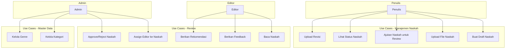

# LAPORAN DEVELOPMENT STEP BY STEP FASE 2

## SISTEM MANAJEMEN KONTEN DAN REVIEW PUBLISHIFY

**Periode Pengembangan**: 16 Desember 2025 - 05 Januari 2026 (21 hari kerja)  
**Metodologi**: ADDIE (Analysis, Design, Development, Implementation, Evaluation)  
**Tim**: Fullstack Development Team Publishify  
**Tanggal Penyusunan**: 31 Desember 2025

---

## PART 1: PENDAHULUAN DAN ANALISIS KEBUTUHAN

### A. PENDAHULUAN

#### A.1 Latar Belakang Pengembangan

Sistem Publishify dikembangkan sebagai platform penerbitan naskah digital yang komprehensif untuk memfasilitasi penulis, editor, percetakan, dan admin dalam mengelola proses penerbitan buku dari tahap penulisan hingga distribusi. Setelah berhasil menyelesaikan Fase 1 yang membangun fondasi sistem autentikasi dan manajemen pengguna, kami memasuki Fase 2 yang merupakan jantung dari sistem ini: **Sistem Manajemen Konten dan Review**.

Fase 2 ini sangat krusial karena mengimplementasikan fitur-fitur inti yang langsung digunakan oleh user dalam aktivitas sehari-hari mereka. Penulis akan menggunakan sistem ini untuk mengelola naskah mereka, editor untuk melakukan review dan memberikan feedback, sementara admin mengawasi keseluruhan proses untuk memastikan kualitas publikasi tetap terjaga.

Dalam laporan development ini, kami akan menjelaskan secara detail dan sistematis bagaimana kami mengimplementasikan setiap komponen dari Fase 2, mulai dari perancangan database schema, pengembangan backend API, hingga pembuatan antarmuka frontend yang user-friendly. Setiap langkah dilengkapi dengan penjelasan reasoning, contoh kode, dan best practices yang kami terapkan.

#### A.2 Tujuan Laporan Development

Laporan development step by step ini memiliki beberapa tujuan utama:

Pertama, sebagai **panduan implementasi** yang dapat direplikasi oleh developer lain yang ingin memahami atau melanjutkan pengembangan sistem. Kami menjelaskan setiap langkah dengan detail sehingga pembaca dapat mengikuti proses development dari awal hingga akhir.

Kedua, sebagai **dokumentasi teknis** yang comprehensive tentang keputusan-keputusan arsitektural yang kami ambil. Setiap pilihan teknologi, pattern, dan struktur kode dijelaskan beserta alasannya, sehingga memberikan insight tentang trade-off yang kami pertimbangkan.

Ketiga, sebagai **knowledge sharing** untuk tim development dan stakeholder lainnya. Dengan mendokumentasikan proses development secara mendetail, kami memastikan knowledge tidak hanya tersimpan di kepala individual developer, tetapi terdokumentasi dengan baik untuk keperluan maintenance dan development di masa mendatang.

Keempat, sebagai **bukti implementasi** yang menunjukkan bahwa sistem dikembangkan mengikuti best practices dan standar industri. Hal ini penting untuk quality assurance dan juga sebagai referensi untuk audit atau review eksternal jika diperlukan.

#### A.3 Scope Laporan

Laporan development ini mencakup implementasi lengkap Fase 2 yang terdiri dari lima modul backend utama dan tiga dashboard frontend untuk role yang berbeda. Secara spesifik, scope laporan meliputi:

**Backend Development:**

- Implementasi modul Kategori dengan struktur hierarchical
- Implementasi modul Genre dengan struktur flat
- Implementasi modul Naskah dengan workflow 7-status
- Implementasi modul Review dengan assignment dan feedback system
- Implementasi modul Upload untuk file management

**Frontend Development:**

- Dashboard dan fitur-fitur untuk Penulis (8 halaman)
- Dashboard dan fitur-fitur untuk Editor (5 halaman)
- Dashboard dan fitur-fitur untuk Admin (8 halaman)

**Database Development:**

- Schema design untuk 8 tabel baru
- Migration scripts
- Seeding data untuk testing

**Testing:**

- Unit testing untuk services
- Integration testing untuk API endpoints
- End-to-end testing untuk user workflows

#### A.4 Metodologi Pengembangan

Kami menggunakan metodologi ADDIE yang terbukti efektif dalam Fase 1, dengan adaptasi untuk konteks development yang lebih complex di Fase 2:

**Analysis**: Menganalisis requirement dari stakeholder, memahami user stories untuk setiap role, dan mengidentifikasi edge cases yang perlu dihandle.

**Design**: Merancang database schema, API contract, dan UI/UX mockup sebelum masuk ke fase coding. Design dilakukan dengan pendekatan iterative berdasarkan feedback.

**Development**: Implementasi kode mengikuti design yang telah dibuat, dengan pendekatan incremental development. Setiap modul dikembangkan secara iterative dengan testing di setiap iterasi.

**Implementation**: Deployment ke staging environment dan melakukan testing dengan real users untuk mendapatkan feedback early.

**Evaluation**: Evaluasi hasil implementation, mengidentifikasi bugs dan areas for improvement, kemudian melakukan iterasi untuk refinement.

Seluruh proses development mengikuti prinsip Agile dengan sprint mingguan, daily standup untuk alignment, dan retrospective di akhir setiap sprint untuk continuous improvement.

---

## B. ANALISIS KEBUTUHAN

### B.1 Identifikasi Stakeholder

Kami mengidentifikasi empat kelompok stakeholder utama yang akan menggunakan sistem di Fase 2:

#### B.1.1 Penulis (Author)

**Kebutuhan Fungsional:**

- Membuat draft naskah baru dengan informasi lengkap (judul, sinopsis, kategori, genre)
- Upload file naskah dalam format PDF atau DOCX
- Upload gambar sampul buku
- Mengajukan naskah untuk review ketika sudah siap
- Melihat status naskah (draft, diajukan, dalam review, dll)
- Menerima feedback dari editor
- Melakukan revisi naskah berdasarkan feedback
- Upload ulang naskah yang sudah direvisi
- Melihat history revisi naskah
- Mengatur harga jual untuk naskah yang sudah diterbitkan

**Kebutuhan Non-Fungsional:**

- Interface yang intuitif dan mudah digunakan
- Upload file yang cepat dan reliable (< 2 menit untuk file 10MB)
- Notifikasi real-time ketika status naskah berubah
- Mobile-responsive untuk akses dari berbagai device

#### B.1.2 Editor

**Kebutuhan Fungsional:**

- Melihat list naskah yang assigned untuk di-review
- Membaca dan preview naskah yang akan di-review
- Memberikan feedback terstruktur untuk berbagai aspek naskah
- Memberikan rating untuk setiap aspek yang dinilai
- Memberikan rekomendasi (approve, revise, reject) dengan justifikasi
- Melihat history review yang pernah dilakukan
- Filter dan search naskah berdasarkan status

**Kebutuhan Non-Fungsional:**

- Preview naskah yang smooth tanpa perlu download
- Form feedback yang terstruktur dan mudah diisi
- Auto-save untuk menghindari kehilangan data feedback
- Dashboard yang menampilkan workload dan deadline

#### B.1.3 Admin

**Kebutuhan Fungsional:**

- Mengelola master data kategori (CRUD hierarchical)
- Mengelola master data genre (CRUD flat)
- Melihat semua naskah yang masuk sistem
- Assign editor ke naskah yang diajukan untuk review
- Melihat hasil review dan rekomendasi dari editor
- Approve atau reject naskah berdasarkan review
- Menerbitkan naskah yang sudah approved
- Monitoring overall system activity
- Manage user roles dan permissions

**Kebutuhan Non-Fungsional:**

- Dashboard comprehensive dengan overview statistik
- Fast filtering dan searching across large dataset
- Bulk operations untuk efficiency
- Audit trail untuk semua critical actions

#### B.1.4 Percetakan

**Kebutuhan Fungsional:**

- Melihat pesanan cetak yang masuk
- Update status produksi pesanan
- Manage parameter harga cetak
- Generate shipping labels

**Note**: Fitur percetakan akan diimplementasikan di Fase 3, namun kami sudah mempersiapkan database schema untuk mendukung integrasi di masa mendatang.

### B.2 Analisis Functional Requirements

Berdasarkan kebutuhan stakeholder, kami mengidentifikasi functional requirements yang harus diimplementasikan di Fase 2:

#### B.2.1 Manajemen Kategori dan Genre

**FR-01: Sistem Kategori Hierarchical**

- Admin dapat membuat kategori root (top-level)
- Admin dapat membuat sub-kategori dengan parent tertentu
- Sistem auto-generate slug dari nama kategori untuk SEO-friendly URLs
- Sistem validasi slug harus unique
- Admin dapat soft-delete kategori (set aktif = false)
- Sistem prevent delete kategori yang masih punya naskah aktif
- Public user dapat melihat kategori aktif untuk filtering

**FR-02: Sistem Genre Flat**

- Admin dapat CRUD genre tanpa hierarki
- Sistem auto-generate slug dari nama genre
- Genre dapat difilter aktif/tidak aktif
- Public user dapat melihat list genre untuk filtering

#### B.2.2 Manajemen Naskah

**FR-03: CRUD Naskah**

- Penulis dapat membuat draft naskah dengan field wajib: judul, sinopsis, kategori, genre
- Penulis dapat upload file naskah (PDF max 10MB, DOCX max 10MB)
- Penulis dapat upload sampul buku (JPG/PNG max 5MB)
- Penulis dapat edit naskah selama status masih draft
- Penulis dapat delete naskah yang masih draft
- Sistem auto-save metadata naskah (jumlah kata, jumlah halaman)

**FR-04: Workflow Status Naskah (7 Status)**

- **draft**: Naskah baru dibuat, penulis dapat edit
- **diajukan**: Penulis submit untuk review, tidak bisa edit lagi
- **dalam_review**: Admin assign editor, editor sedang review
- **perlu_revisi**: Editor minta revisi, penulis dapat upload ulang
- **disetujui**: Editor approve, menunggu admin publish
- **ditolak**: Editor/Admin reject, naskah end
- **diterbitkan**: Admin publish, naskah visible ke public

**Transisi Status yang Diizinkan:**

```
draft → diajukan (oleh penulis)
diajukan → draft (cancel, oleh penulis)
diajukan → dalam_review (assign editor, oleh admin)
dalam_review → perlu_revisi (oleh editor/admin)
dalam_review → disetujui (oleh editor/admin)
dalam_review → ditolak (oleh editor/admin)
perlu_revisi → diajukan (upload revisi, oleh penulis)
disetujui → diterbitkan (oleh admin)
```

**FR-05: Revision Tracking**

- Sistem auto-create revision entry setiap kali upload file baru
- Version number auto-increment (1, 2, 3, ...)
- Penulis dapat menambahkan catatan untuk setiap revision
- Sistem menyimpan URL file untuk setiap version
- User dapat download version history

#### B.2.3 Sistem Review

**FR-06: Assignment Review**

- Admin dapat assign satu atau lebih editor ke naskah
- Sistem create entry review ketika assignment dibuat
- Status review: ditugaskan, dalam_proses, selesai, dibatalkan
- Admin dapat re-assign jika editor tidak available
- Sistem track timestamp untuk setiap assignment

**FR-07: Feedback System**

- Editor dapat create multiple feedback items untuk satu review
- Setiap feedback item punya: aspek (string), rating (1-5), komentar (text)
- Contoh aspek: "Plot", "Karakter", "Gaya Bahasa", "Tata Bahasa"
- Editor dapat edit feedback sebelum submit review
- Feedback auto-save untuk prevent data loss

**FR-08: Recommendation Workflow**

- Editor memberikan rekomendasi: setujui, revisi, atau tolak
- Editor wajib memberikan catatan/justifikasi untuk rekomendasi
- Admin dapat melihat feedback dan rekomendasi
- Admin membuat keputusan final: approve atau reject naskah

### B.3 Analisis Non-Functional Requirements

#### B.3.1 Performance Requirements

**NFR-01: Response Time**

- API endpoint harus respond dalam < 200ms untuk 95% request (P95)
- Database query harus execute dalam < 50ms untuk 95% query
- Page load time harus < 2 detik untuk first contentful paint

**NFR-02: Scalability**

- Sistem harus support minimal 1000 concurrent users
- Database harus support minimal 100,000 naskah records
- File storage harus support minimal 1TB total storage

**NFR-03: Reliability**

- System uptime target: 99.5% (downtime < 4 jam per bulan)
- File upload success rate: > 95%
- Zero data loss dalam transaction operations

#### B.3.2 Security Requirements

**NFR-04: Authentication & Authorization**

- Semua API endpoint (kecuali public) harus protected dengan JWT
- Role-based access control (RBAC) untuk semua operations
- Row Level Security (RLS) aktif di database untuk data isolation

**NFR-05: Data Protection**

- Sensitive data di-encrypt at rest dan in transit
- File upload harus melalui virus scanning
- Input validation di semua entry points untuk prevent injection attacks

#### B.3.3 Usability Requirements

**NFR-06: User Experience**

- Interface harus intuitif tanpa perlu extensive training
- Error messages harus clear dan actionable
- Loading states harus informatif
- Responsive design untuk mobile, tablet, dan desktop

### B.4 Use Case Diagram



### B.5 User Stories

#### B.5.1 User Stories untuk Penulis

**US-01**: Sebagai penulis, saya ingin membuat draft naskah baru, sehingga saya dapat mulai mengelola karya saya di sistem.

- **Acceptance Criteria**:
  - Dapat mengisi judul, sub judul, sinopsis
  - Dapat memilih kategori dan genre dari dropdown
  - Sistem auto-save draft setiap 30 detik
  - Status otomatis set ke "draft"

**US-02**: Sebagai penulis, saya ingin upload file naskah, sehingga editor dapat membaca dan mereview karya saya.

- **Acceptance Criteria**:
  - Support PDF dan DOCX format
  - Maximum file size 10MB
  - Progress indicator selama upload
  - Success notification setelah upload selesai

**US-03**: Sebagai penulis, saya ingin melihat status naskah saya, sehingga saya tahu posisi naskah dalam proses review.

- **Acceptance Criteria**:
  - Dashboard menampilkan semua naskah dengan status
  - Visual indicator (badge) untuk setiap status
  - Filter berdasarkan status
  - Sort by tanggal update terbaru

#### B.5.2 User Stories untuk Editor

**US-04**: Sebagai editor, saya ingin melihat naskah yang assigned kepada saya, sehingga saya dapat mengatur workload review.

- **Acceptance Criteria**:
  - Dashboard menampilkan list assignment
  - Informasi: judul naskah, penulis, tanggal assigned
  - Filter by status review
  - Sort by priority atau deadline

**US-05**: Sebagai editor, saya ingin memberikan feedback terstruktur, sehingga penulis dapat memahami area yang perlu diperbaiki.

- **Acceptance Criteria**:
  - Form feedback dengan multiple items
  - Setiap item punya: aspek, rating, komentar
  - Auto-save untuk prevent data loss
  - Preview feedback sebelum submit

#### B.5.3 User Stories untuk Admin

**US-06**: Sebagai admin, saya ingin mengelola kategori hierarchical, sehingga naskah dapat diorganisir dengan baik.

- **Acceptance Criteria**:
  - Tree view untuk visualisasi hierarki
  - CRUD operations untuk kategori
  - Validation: tidak bisa delete kategori dengan naskah aktif
  - Drag-and-drop untuk reorder (optional)

**US-07**: Sebagai admin, saya ingin assign editor ke naskah, sehingga proses review dapat berjalan.

- **Acceptance Criteria**:
  - Dropdown list editor yang available
  - Multiple assignment untuk satu naskah (optional)
  - Reason/notes untuk assignment
  - Email notification ke editor yang di-assign

---

📄 **Lanjut ke**: [PART 2: Perancangan Sistem](./LAPORAN-DEVELOPMENT-FASE-2-PART-2-PERANCANGAN-SISTEM.md)
