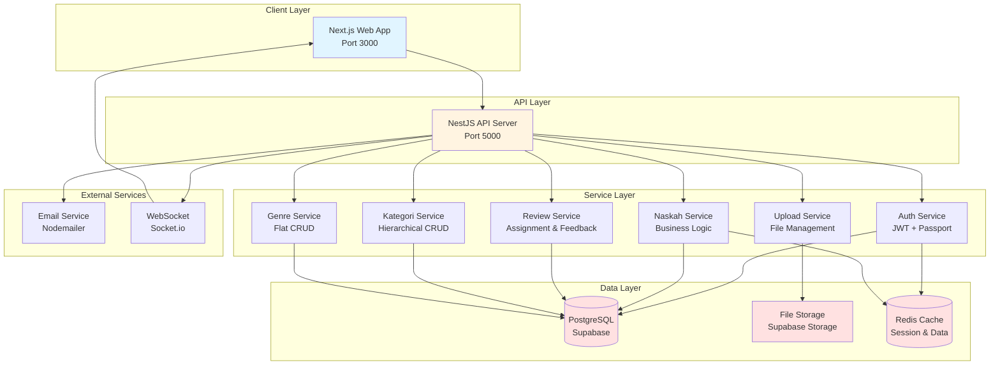
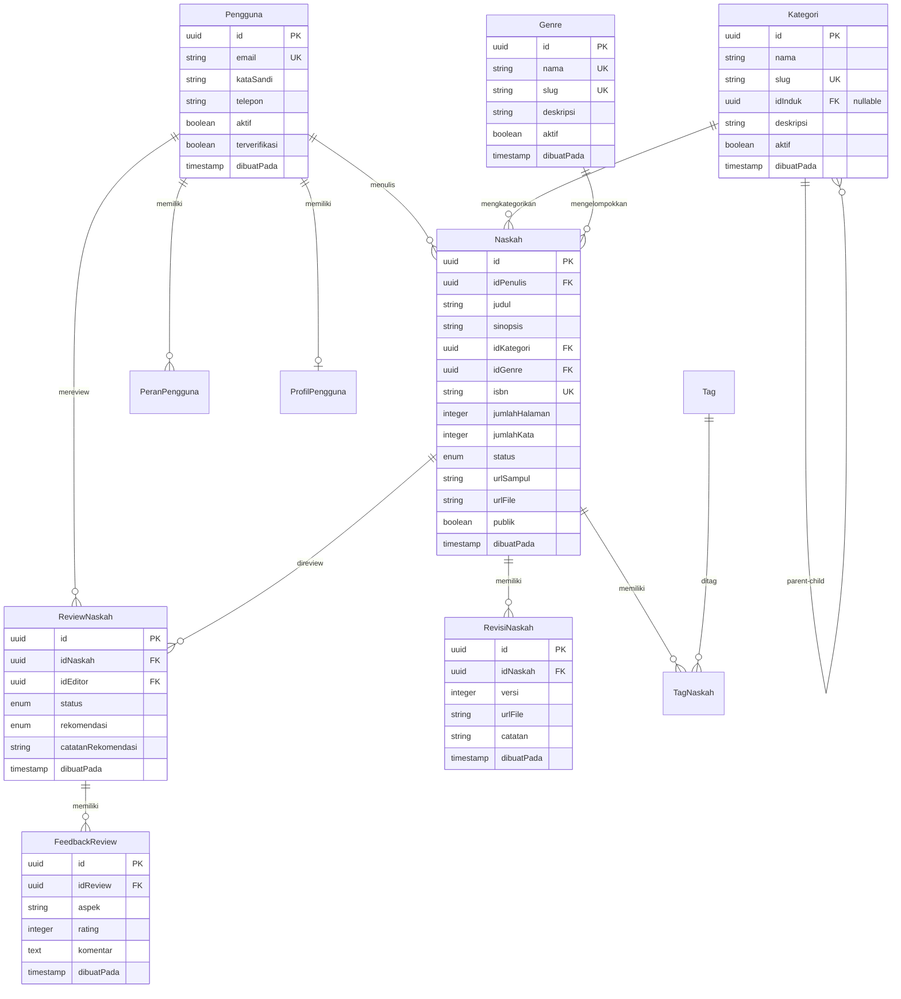
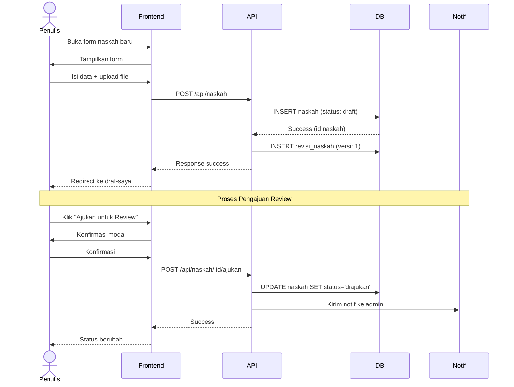
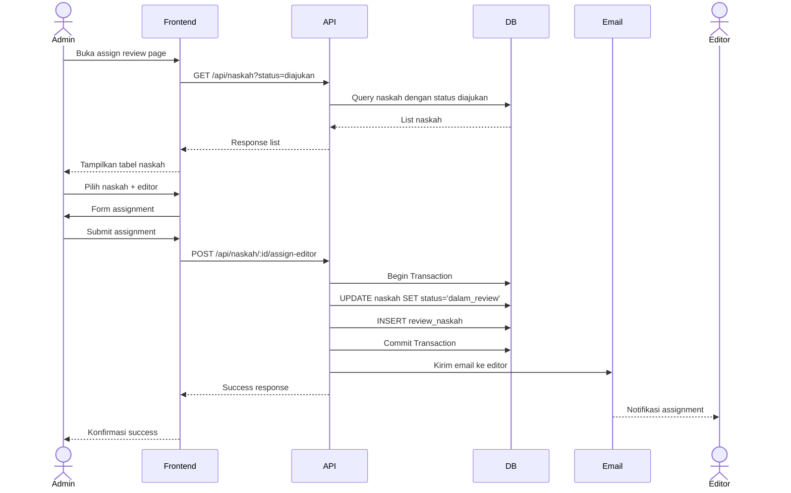
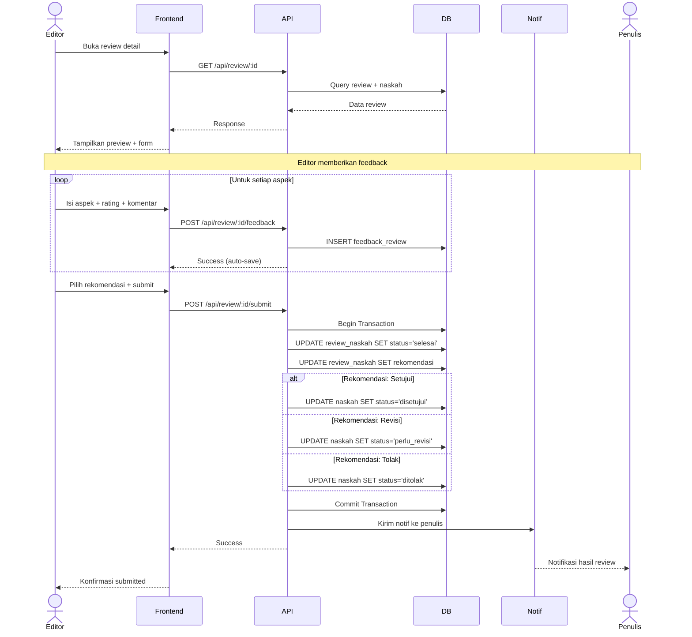

# LAPORAN DEVELOPMENT STEP BY STEP FASE 2

## PART 2: PERANCANGAN SISTEM

---

## C. PERANCANGAN SISTEM

### C.1 Arsitektur Sistem Secara Keseluruhan

Sistem Publishify Fase 2 menggunakan arsitektur **Monorepo** dengan separation yang clear antara frontend dan backend. Kami memilih arsitektur ini karena beberapa keuntungan: code sharing lebih mudah, consistent versioning, dan simplified dependency management.

#### C.1.1 High-Level Architecture Diagram



#### C.1.2 Technology Stack Reasoning

**Frontend Stack:**

- **Next.js 14+ dengan App Router**: Memberikan SSR/SSG capabilities untuk SEO, file-based routing yang intuitif, dan server components untuk better performance
- **Tailwind CSS + shadcn/ui**: Utility-first CSS framework yang productive, dengan component library yang accessible dan customizable
- **TanStack Query**: Powerful data fetching dengan built-in caching, invalidation, dan optimistic updates
- **Zustand**: Lightweight state management, lebih simple daripada Redux untuk use case kami
- **React Hook Form + Zod**: Type-safe form handling dengan validation yang comprehensive

**Backend Stack:**

- **NestJS 10+**: Opinionated framework dengan excellent TypeScript support, built-in dependency injection, dan modular architecture
- **Prisma ORM**: Type-safe database client dengan excellent DX, migration management, dan studio untuk database exploration
- **PostgreSQL**: Robust relational database dengan support untuk advanced features (full-text search, JSONB, array types)
- **Supabase**: Managed PostgreSQL dengan built-in Auth, Storage, dan Row Level Security
- **Redis**: In-memory cache untuk session storage dan data caching
- **Socket.io**: WebSocket library untuk real-time notifications

### C.2 Database Schema Design

#### C.2.1 Entity Relationship Diagram (ERD)



#### C.2.2 Detailed Table Specifications

**Tabel: kategori**

| Field          | Type         | Constraints                    | Deskripsi                     |
| -------------- | ------------ | ------------------------------ | ----------------------------- |
| id             | uuid         | PK, DEFAULT uuid_generate_v4() | Primary key                   |
| nama           | varchar(100) | NOT NULL                       | Nama kategori                 |
| slug           | varchar(150) | UNIQUE, NOT NULL               | URL-friendly identifier       |
| idInduk        | uuid         | FK → kategori.id, NULLABLE     | Parent category (null = root) |
| deskripsi      | text         | NULLABLE                       | Deskripsi kategori            |
| aktif          | boolean      | DEFAULT true                   | Soft delete flag              |
| dibuatPada     | timestamp    | DEFAULT now()                  | Creation timestamp            |
| diperbaruiPada | timestamp    | DEFAULT now(), AUTO UPDATE     | Update timestamp              |

**Indexes:**

```sql
CREATE INDEX idx_kategori_induk ON kategori(idInduk);
CREATE INDEX idx_kategori_slug ON kategori(slug);
CREATE INDEX idx_kategori_aktif ON kategori(aktif) WHERE aktif = true;
```

**Self-Referential Relationship:**
Kategori menggunakan self-join untuk membentuk tree structure. Query untuk mendapatkan semua child categories menggunakan recursive CTE:

```sql
WITH RECURSIVE kategori_tree AS (
  -- Base case: root categories
  SELECT id, nama, slug, idInduk, 0 as level
  FROM kategori
  WHERE idInduk IS NULL AND aktif = true

  UNION ALL

  -- Recursive case: child categories
  SELECT k.id, k.nama, k.slug, k.idInduk, kt.level + 1
  FROM kategori k
  INNER JOIN kategori_tree kt ON k.idInduk = kt.id
  WHERE k.aktif = true
)
SELECT * FROM kategori_tree ORDER BY level, nama;
```

---

**Tabel: genre**

| Field          | Type         | Constraints      | Deskripsi               |
| -------------- | ------------ | ---------------- | ----------------------- |
| id             | uuid         | PK               | Primary key             |
| nama           | varchar(100) | UNIQUE, NOT NULL | Nama genre              |
| slug           | varchar(150) | UNIQUE, NOT NULL | URL-friendly identifier |
| deskripsi      | text         | NULLABLE         | Deskripsi genre         |
| aktif          | boolean      | DEFAULT true     | Soft delete flag        |
| dibuatPada     | timestamp    | DEFAULT now()    | Creation timestamp      |
| diperbaruiPada | timestamp    | DEFAULT now()    | Update timestamp        |

**Indexes:**

```sql
CREATE INDEX idx_genre_slug ON genre(slug);
CREATE INDEX idx_genre_aktif ON genre(aktif) WHERE aktif = true;
```

---

**Tabel: naskah**

| Field          | Type         | Constraints                | Deskripsi          |
| -------------- | ------------ | -------------------------- | ------------------ |
| id             | uuid         | PK                         | Primary key        |
| idPenulis      | uuid         | FK → pengguna.id, NOT NULL | Penulis naskah     |
| judul          | varchar(200) | NOT NULL                   | Judul naskah       |
| subJudul       | varchar(200) | NULLABLE                   | Sub judul          |
| sinopsis       | text         | NOT NULL                   | Sinopsis naskah    |
| isbn           | varchar(20)  | UNIQUE, NULLABLE           | ISBN (opsional)    |
| idKategori     | uuid         | FK → kategori.id, NOT NULL | Kategori           |
| idGenre        | uuid         | FK → genre.id, NOT NULL    | Genre              |
| bahasaTulis    | varchar(10)  | DEFAULT 'id'               | Bahasa (id/en/dll) |
| jumlahHalaman  | integer      | NULLABLE                   | Jumlah halaman     |
| jumlahKata     | integer      | NULLABLE                   | Jumlah kata        |
| status         | enum         | DEFAULT 'draft'            | Status workflow    |
| urlSampul      | text         | NULLABLE                   | URL gambar sampul  |
| urlFile        | text         | NULLABLE                   | URL file naskah    |
| publik         | boolean      | DEFAULT false              | Visibility flag    |
| dibuatPada     | timestamp    | DEFAULT now()              | Creation timestamp |
| diperbaruiPada | timestamp    | DEFAULT now()              | Update timestamp   |

**Enum: StatusNaskah**

```prisma
enum StatusNaskah {
  draft
  diajukan
  dalam_review
  perlu_revisi
  disetujui
  ditolak
  diterbitkan
}
```

**Indexes:**

```sql
CREATE INDEX idx_naskah_penulis ON naskah(idPenulis);
CREATE INDEX idx_naskah_kategori ON naskah(idKategori);
CREATE INDEX idx_naskah_genre ON naskah(idGenre);
CREATE INDEX idx_naskah_status ON naskah(status);
CREATE INDEX idx_naskah_publik ON naskah(publik) WHERE publik = true;
CREATE INDEX idx_naskah_judul ON naskah USING gin(to_tsvector('indonesian', judul));
```

**Status Workflow Validation:**
Kami implement status transition validation di application layer (NestJS service):

```typescript
const ALLOWED_TRANSITIONS: Record<StatusNaskah, StatusNaskah[]> = {
  draft: ["diajukan"],
  diajukan: ["draft", "dalam_review"],
  dalam_review: ["perlu_revisi", "disetujui", "ditolak"],
  perlu_revisi: ["diajukan"],
  disetujui: ["diterbitkan"],
  ditolak: [],
  diterbitkan: [],
};
```

---

**Tabel: revisi_naskah**

| Field      | Type      | Constraints              | Deskripsi                   |
| ---------- | --------- | ------------------------ | --------------------------- |
| id         | uuid      | PK                       | Primary key                 |
| idNaskah   | uuid      | FK → naskah.id, NOT NULL | Naskah terkait              |
| versi      | integer   | NOT NULL                 | Version number (1, 2, 3...) |
| urlFile    | text      | NOT NULL                 | URL file untuk version ini  |
| catatan    | text      | NULLABLE                 | Catatan untuk revision      |
| dibuatPada | timestamp | DEFAULT now()            | Creation timestamp          |

**Constraints:**

```sql
ALTER TABLE revisi_naskah
ADD CONSTRAINT uk_naskah_versi UNIQUE (idNaskah, versi);
```

**Indexes:**

```sql
CREATE INDEX idx_revisi_naskah ON revisi_naskah(idNaskah);
```

---

**Tabel: review_naskah**

| Field              | Type      | Constraints                | Deskripsi            |
| ------------------ | --------- | -------------------------- | -------------------- |
| id                 | uuid      | PK                         | Primary key          |
| idNaskah           | uuid      | FK → naskah.id, NOT NULL   | Naskah yang direview |
| idEditor           | uuid      | FK → pengguna.id, NOT NULL | Editor yang review   |
| status             | enum      | DEFAULT 'ditugaskan'       | Status review        |
| rekomendasi        | enum      | NULLABLE                   | Rekomendasi final    |
| catatanRekomendasi | text      | NULLABLE                   | Catatan rekomendasi  |
| dibuatPada         | timestamp | DEFAULT now()              | Assigned timestamp   |
| diselesaikanPada   | timestamp | NULLABLE                   | Completed timestamp  |

**Enums:**

```prisma
enum StatusReview {
  ditugaskan
  dalam_proses
  selesai
  dibatalkan
}

enum Rekomendasi {
  setujui
  revisi
  tolak
}
```

**Indexes:**

```sql
CREATE INDEX idx_review_naskah ON review_naskah(idNaskah);
CREATE INDEX idx_review_editor ON review_naskah(idEditor);
CREATE INDEX idx_review_status ON review_naskah(status);
```

---

**Tabel: feedback_review**

| Field      | Type         | Constraints                         | Deskripsi          |
| ---------- | ------------ | ----------------------------------- | ------------------ |
| id         | uuid         | PK                                  | Primary key        |
| idReview   | uuid         | FK → review_naskah.id, NOT NULL     | Review terkait     |
| aspek      | varchar(100) | NOT NULL                            | Aspek yang dinilai |
| rating     | integer      | CHECK (rating >= 1 AND rating <= 5) | Rating 1-5         |
| komentar   | text         | NOT NULL                            | Komentar detail    |
| dibuatPada | timestamp    | DEFAULT now()                       | Creation timestamp |

**Indexes:**

```sql
CREATE INDEX idx_feedback_review ON feedback_review(idReview);
```

### C.3 API Design

#### C.3.1 RESTful API Conventions

Kami mengikuti REST API best practices dengan conventions berikut:

**HTTP Methods:**

- `GET`: Retrieve data (read-only, idempotent)
- `POST`: Create new resource
- `PUT`: Update entire resource (idempotent)
- `PATCH`: Partial update resource
- `DELETE`: Delete resource (soft delete)

**Response Format Standard:**

```typescript
// Success Response
interface ApiResponse<T> {
  sukses: true;
  pesan: string;
  data: T;
  metadata?: {
    total?: number;
    halaman?: number;
    limit?: number;
    totalHalaman?: number;
  };
}

// Error Response
interface ApiError {
  sukses: false;
  pesan: string;
  error: {
    kode: string;
    detail?: string;
    field?: string;
    timestamp: string;
  };
}
```

**HTTP Status Codes:**

- `200 OK`: Success untuk GET, PUT, PATCH
- `201 Created`: Success untuk POST
- `204 No Content`: Success untuk DELETE
- `400 Bad Request`: Validation error
- `401 Unauthorized`: Authentication required
- `403 Forbidden`: Authorization failed
- `404 Not Found`: Resource tidak ditemukan
- `409 Conflict`: Duplicate atau constraint violation
- `500 Internal Server Error`: Server error

#### C.3.2 API Endpoint Specifications

**Modul Kategori (6 endpoints):**

| Method | Endpoint                   | Auth     | Role  | Deskripsi                           |
| ------ | -------------------------- | -------- | ----- | ----------------------------------- |
| GET    | `/api/kategori`            | Public   | -     | Ambil semua kategori (hierarchical) |
| GET    | `/api/kategori/:id`        | Public   | -     | Ambil detail kategori by ID         |
| POST   | `/api/kategori`            | Required | admin | Buat kategori baru                  |
| PUT    | `/api/kategori/:id`        | Required | admin | Update kategori                     |
| DELETE | `/api/kategori/:id`        | Required | admin | Soft delete kategori                |
| GET    | `/api/kategori/:id/naskah` | Public   | -     | Ambil naskah by kategori            |

**Modul Genre (6 endpoints):**

| Method | Endpoint                | Auth     | Role  | Deskripsi                |
| ------ | ----------------------- | -------- | ----- | ------------------------ |
| GET    | `/api/genre`            | Public   | -     | Ambil semua genre        |
| GET    | `/api/genre/:id`        | Public   | -     | Ambil detail genre by ID |
| POST   | `/api/genre`            | Required | admin | Buat genre baru          |
| PUT    | `/api/genre/:id`        | Required | admin | Update genre             |
| DELETE | `/api/genre/:id`        | Required | admin | Soft delete genre        |
| GET    | `/api/genre/:id/naskah` | Public   | -     | Ambil naskah by genre    |

**Modul Naskah (15 endpoints):**

| Method | Endpoint                           | Auth     | Role    | Deskripsi              |
| ------ | ---------------------------------- | -------- | ------- | ---------------------- |
| GET    | `/api/naskah`                      | Public   | -       | List naskah (filtered) |
| GET    | `/api/naskah/:id`                  | Public   | -       | Detail naskah          |
| POST   | `/api/naskah`                      | Required | penulis | Buat draft naskah      |
| PUT    | `/api/naskah/:id`                  | Required | penulis | Update naskah          |
| DELETE | `/api/naskah/:id`                  | Required | penulis | Delete draft naskah    |
| POST   | `/api/naskah/:id/ajukan`           | Required | penulis | Submit untuk review    |
| POST   | `/api/naskah/:id/batalkan`         | Required | penulis | Cancel submission      |
| GET    | `/api/naskah/:id/revisi`           | Required | penulis | History revisi         |
| POST   | `/api/naskah/:id/revisi`           | Required | penulis | Upload revisi baru     |
| POST   | `/api/naskah/:id/assign-editor`    | Required | admin   | Assign editor          |
| PUT    | `/api/naskah/:id/status`           | Required | admin   | Update status          |
| POST   | `/api/naskah/:id/terbitkan`        | Required | admin   | Publish naskah         |
| GET    | `/api/naskah/saya`                 | Required | penulis | Naskah milik user      |
| GET    | `/api/naskah/diterbitkan`          | Public   | -       | List published         |
| GET    | `/api/naskah/:id/download/:versi?` | Required | -       | Download file          |

**Modul Review (8 endpoints):**

| Method | Endpoint                               | Auth     | Role   | Deskripsi            |
| ------ | -------------------------------------- | -------- | ------ | -------------------- |
| GET    | `/api/review`                          | Required | editor | List review assigned |
| GET    | `/api/review/:id`                      | Required | editor | Detail review        |
| PUT    | `/api/review/:id/mulai`                | Required | editor | Start review         |
| POST   | `/api/review/:id/feedback`             | Required | editor | Add feedback item    |
| PUT    | `/api/review/:id/feedback/:feedbackId` | Required | editor | Update feedback      |
| DELETE | `/api/review/:id/feedback/:feedbackId` | Required | editor | Delete feedback      |
| POST   | `/api/review/:id/submit`               | Required | editor | Submit review final  |
| POST   | `/api/review/:id/batalkan`             | Required | admin  | Cancel assignment    |

**Modul Upload (12 endpoints):**

| Method | Endpoint                 | Auth     | Role    | Deskripsi            |
| ------ | ------------------------ | -------- | ------- | -------------------- |
| POST   | `/api/upload/naskah`     | Required | penulis | Upload file naskah   |
| POST   | `/api/upload/sampul`     | Required | penulis | Upload gambar sampul |
| POST   | `/api/upload/avatar`     | Required | -       | Upload avatar user   |
| GET    | `/api/upload/signed-url` | Required | -       | Get signed URL       |
| DELETE | `/api/upload/:fileId`    | Required | -       | Delete file          |

### C.4 Frontend Page Structure

#### C.4.1 Dashboard Penulis (8 halaman)

| Page             | Route                           | Deskripsi            | Key Components               |
| ---------------- | ------------------------------- | -------------------- | ---------------------------- |
| Dashboard        | `/penulis`                      | Overview statistik   | StatCard, ChartDoughnut      |
| Draf Saya        | `/penulis/draf-saya`            | List naskah draft    | TabelNaskah, ButtonAjukan    |
| Ajukan Draf      | `/penulis/ajukan-draf`          | Form naskah baru     | FormNaskah, UploadFile       |
| Buku Terbit      | `/penulis/buku-terbit`          | Naskah diterbitkan   | KartuBuku, BadgeStatus       |
| Dalam Review     | `/penulis/dalam-review`         | Status review        | TimelineReview, FeedbackCard |
| Perlu Revisi     | `/penulis/perlu-revisi`         | Naskah perlu revisi  | ListFeedback, FormRevisi     |
| Riwayat          | `/penulis/riwayat`              | History semua naskah | TabelRiwayat, FilterStatus   |
| Pengaturan Harga | `/penulis/pengaturan-harga/:id` | Set harga jual       | FormHarga, PreviewHarga      |

#### C.4.2 Dashboard Editor (5 halaman)

| Page           | Route                    | Deskripsi             | Key Components               |
| -------------- | ------------------------ | --------------------- | ---------------------------- |
| Dashboard      | `/editor`                | Overview assignments  | StatCard, ListReview         |
| Antrian Review | `/editor/antrian-review` | List assigned reviews | TabelAntrian, FilterStatus   |
| Detail Review  | `/editor/review/:id`     | Review interface      | PreviewNaskah, FormFeedback  |
| Preview Naskah | `/editor/preview/:id`    | Baca naskah           | ViewerPDF, ToolbarAnnotation |
| Riwayat Review | `/editor/riwayat`        | History completed     | TabelRiwayat, DetailModal    |

#### C.4.3 Panel Admin (8 halaman)

| Page             | Route                    | Deskripsi            | Key Components               |
| ---------------- | ------------------------ | -------------------- | ---------------------------- |
| Dashboard        | `/admin`                 | Overview sistem      | MultiStatCard, ChartBar      |
| Kelola Pengguna  | `/admin/pengguna`        | User management      | TabelPengguna, FormEditPeran |
| Kelola Naskah    | `/admin/naskah`          | Semua naskah         | TabelNaskah, FilterAdvanced  |
| Assign Review    | `/admin/assign-review`   | Assignment interface | ListNaskah, DropdownEditor   |
| Hasil Review     | `/admin/hasil-review`    | Review results       | TabelReview, ModalDetail     |
| Master Kategori  | `/admin/master-kategori` | CRUD kategori        | TreeView, FormKategori       |
| Master Genre     | `/admin/master-genre`    | CRUD genre           | TabelGenre, FormGenre        |
| Terbitkan Naskah | `/admin/terbitkan`       | Publish workflow     | ListApproved, ButtonPublish  |

### C.5 Workflow Diagrams

#### C.5.1 Naskah Submission Workflow



#### C.5.2 Review Assignment Workflow



#### C.5.3 Feedback Submission Workflow



---

📄 **Lanjut ke**: [PART 3: Implementasi Backend](./LAPORAN-DEVELOPMENT-FASE-2-PART-3-IMPLEMENTASI-BACKEND.md)
