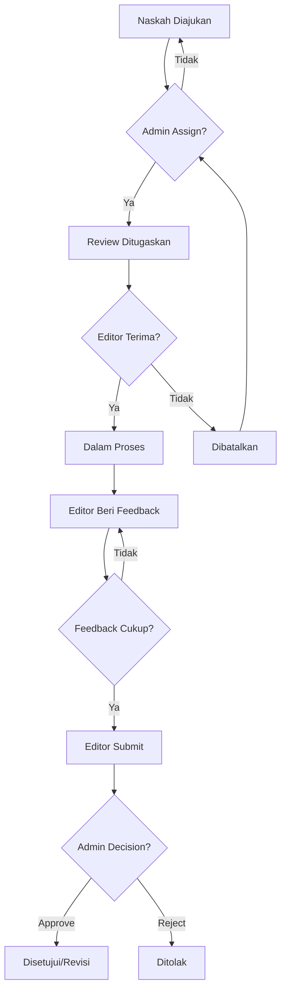

# LAPORAN DEVELOPMENT FASE 3

## PANDUAN IMPLEMENTASI SISTEM REVIEW DAN EDITORIAL

**Periode Pengembangan**: 09 Januari 2026 - 22 Januari 2026 (14 hari)  
**Metodologi**: ADDIE (Analysis, Design, Development, Implementation, Evaluation)  
**Platform**: Publishify - Sistem Penerbitan Naskah Digital  
**Tanggal Penyusunan**: 31 Desember 2025

---

## PART 1: PENDAHULUAN DAN ANALISIS KEBUTUHAN

### A. PENDAHULUAN

#### A.1 Latar Belakang Pengembangan

Sistem penerbitan digital Publishify telah melewati dua fase fundamental dalam pengembangannya. Fase pertama membangun fondasi autentikasi dan manajemen pengguna dengan role-based access control yang membedakan empat jenis pengguna: penulis, editor, percetakan, dan admin. Fase kedua mengimplementasikan sistem manajemen konten yang memungkinkan penulis untuk mengelola naskah mereka dengan workflow status yang terstruktur dari draft hingga diterbitkan.

Memasuki Fase 3, kami menghadapi tantangan yang lebih kompleks yaitu membangun jembatan antara penulis yang mengajukan naskah dengan proses quality assurance sebelum publikasi. Tanpa sistem review yang terstruktur, tidak ada mekanisme kontrol kualitas yang dapat memastikan bahwa setiap naskah yang diterbitkan memenuhi standar editorial yang telah ditetapkan. Sistem review ini juga harus memberikan feedback konstruktif kepada penulis untuk meningkatkan kualitas karya mereka.

Dokumen ini disusun sebagai panduan implementasi lengkap untuk mengembangkan sistem review editorial dari nol hingga fully functional. Berbeda dengan laporan progress yang menjelaskan apa yang telah dicapai, dokumen ini berfokus pada bagaimana cara mengimplementasikan setiap komponen sistem review secara bertahap. Panduan ini ditujukan untuk developer yang akan mengerjakan sistem serupa atau melanjutkan pengembangan sistem Publishify.

#### A.2 Tujuan Dokumen

Dokumen panduan development ini memiliki beberapa tujuan utama:

**Tujuan Edukatif**: Memberikan pemahaman mendalam tentang cara merancang dan mengimplementasikan sistem review editorial yang melibatkan multiple roles dengan tanggung jawab yang saling terkait. Developer akan mempelajari bagaimana merancang database schema untuk workflow yang kompleks, bagaimana mengimplementasikan business logic dengan validation yang comprehensive, dan bagaimana membangun user interface yang intuitif untuk setiap role.

**Tujuan Praktis**: Menyediakan langkah-langkah implementasi yang detail dan dapat diikuti secara bertahap. Setiap section dalam dokumen ini berisi instruksi spesifik tentang apa yang harus dilakukan, file mana yang harus dibuat, kode apa yang harus ditulis, dan bagaimana menguji hasil implementasi. Developer dapat mengikuti panduan ini step by step untuk membangun sistem review yang serupa.

**Tujuan Referensi**: Menjadi dokumentasi teknis yang dapat dirujuk ketika ada pertanyaan tentang desain decisions, implementasi patterns, atau troubleshooting issues. Dokumen ini menjelaskan reasoning di balik setiap keputusan teknis yang diambil, alternatif yang dipertimbangkan, dan trade-offs yang harus diterima.

#### A.3 Ruang Lingkup Pembahasan

Panduan development ini mencakup implementasi lengkap sistem review editorial dengan batasan scope sebagai berikut:

**Yang Termasuk dalam Scope**:

- Perancangan database schema untuk tabel review dan feedback
- Implementasi backend API dengan delapan core methods dan sembilan REST endpoints
- Pembangunan admin interface untuk assignment dan monitoring review
- Pembangunan editor interface untuk melakukan review dan memberikan feedback
- Implementasi workflow assignment dari admin ke editor
- Implementasi feedback mechanism dengan structured format
- Implementasi submission dan recommendation dari editor
- Implementasi admin decision untuk approve atau reject naskah
- Testing dan validation untuk semua components

**Yang Tidak Termasuk dalam Scope**:

- Sistem notifikasi real-time dengan WebSocket (akan dibahas di enhancement)
- Collaborative review dengan multiple editors (future feature)
- AI-assisted feedback suggestions (future enhancement)
- Review analytics dan performance metrics (future feature)
- Mobile app untuk editor (future enhancement)

#### A.4 Metodologi Pengembangan

Kami menggunakan metodologi ADDIE yang diadaptasi untuk software development dengan lima tahap yang jelas:

**Analysis (Analisis)**: Tahap pertama fokus pada analisis kebutuhan sistem review. Kami mengidentifikasi stakeholders yang terlibat yaitu admin, editor, dan penulis. Kami memetakan workflow dari assignment hingga final decision. Kami menganalisis business rules yang harus diimplementasikan seperti validation untuk status naskah, conflict detection untuk duplicate review, dan authorization untuk setiap action.

**Design (Perancangan)**: Tahap kedua fokus pada perancangan arsitektur sistem. Kami mendesain database schema dengan normalisasi yang tepat. Kami merancang API contract dengan REST principles. Kami membuat wireframe untuk user interface setiap role. Kami mendefinisikan state machine untuk review lifecycle dan menentukan validation rules untuk setiap state transition.

**Development (Pengembangan)**: Tahap ketiga adalah implementasi aktual dari design yang telah dibuat. Kami mulai dengan database migration, dilanjutkan dengan implementasi backend service dan controller, kemudian membangun frontend pages untuk admin dan editor. Setiap component dikembangkan secara incremental dengan testing di setiap step.

**Implementation (Implementasi)**: Tahap keempat adalah deployment dan integration testing. Kami deploy backend ke staging environment, deploy frontend ke CDN, dan melakukan integration testing untuk memastikan semua components bekerja together dengan baik. Kami juga melakukan user acceptance testing dengan actual users dari setiap role.

**Evaluation (Evaluasi)**: Tahap terakhir adalah evaluasi hasil development. Kami mengukur performance metrics, menganalisis test coverage, mengidentifikasi bugs dan issues, dan merencanakan improvements untuk iteration berikutnya.

---

### B. ANALISIS KEBUTUHAN

#### B.1 Identifikasi Stakeholders

Sistem review editorial Publishify melibatkan tiga stakeholders utama dengan roles dan tanggung jawab yang berbeda:

**Stakeholder 1: Administrator (Admin)**

Admin adalah superuser yang memiliki kontrol penuh terhadap sistem review. Tanggung jawab utama admin meliputi:

- Melihat semua naskah yang telah diajukan oleh penulis dan menunggu untuk direview
- Memilih editor yang tepat untuk mereview naskah berdasarkan spesialisasi dan workload
- Menugaskan review ke editor yang dipilih dengan catatan atau instruksi khusus jika diperlukan
- Memonitor progress review yang sedang berjalan untuk memastikan tidak ada delay
- Melihat feedback yang diberikan editor dan recommendation mereka
- Membuat keputusan final untuk approve, request revision, atau reject naskah
- Me-reassign review ke editor lain jika editor sebelumnya tidak available
- Membatalkan review jika naskah ditarik oleh penulis

Kebutuhan fungsional untuk admin:

- Dashboard yang menampilkan overview statistik review system
- Halaman antrian review dengan grid naskah yang belum di-assign
- Modal untuk memilih editor dengan informasi workload mereka
- Halaman monitoring dengan table semua review aktif dan statusnya
- Halaman detail review dengan semua feedback dan recommendation editor
- Form untuk membuat keputusan final dengan catatan tambahan

**Stakeholder 2: Editor**

Editor adalah quality gatekeeper yang bertanggung jawab untuk mereview naskah dan memberikan feedback profesional. Tanggung jawab utama editor meliputi:

- Melihat review yang ditugaskan kepada mereka
- Menerima atau menolak assignment review dengan alasan yang valid
- Membaca naskah secara menyeluruh dan menganalisis berbagai aspek
- Memberikan feedback terstruktur dengan rating dan komentar detail
- Membuat recommendation akhir: approve, request revision, atau reject
- Menjelaskan reasoning di balik recommendation mereka
- Merevisi feedback jika ada aspek yang terlewat sebelum submit final

Kebutuhan fungsional untuk editor:

- Dashboard personal dengan statistik review mereka
- Halaman daftar review dengan filter berdasarkan status
- Halaman detail review dengan metadata naskah lengkap
- Viewer untuk membaca naskah dalam format PDF
- Form feedback dengan multiple items untuk berbagai aspek penilaian
- Form submission dengan pilihan recommendation dan catatan umum

**Stakeholder 3: Penulis**

Penulis adalah creator content yang mengajukan naskah dan menerima feedback. Meskipun penulis tidak terlibat aktif dalam proses review, mereka memiliki kebutuhan informasi:

- Melihat status review untuk naskah mereka
- Membaca feedback yang diberikan editor setelah review selesai
- Memahami apa yang harus diperbaiki jika naskah butuh revisi
- Melihat timeline review process dari assignment hingga decision
- Download atau view naskah yang sudah direview untuk comparison

Kebutuhan fungsional untuk penulis:

- Indicator status review di halaman dashboard mereka
- Halaman detail naskah yang menampilkan review history
- View untuk membaca semua feedback yang diberikan editor
- Notification ketika review selesai dan decision sudah dibuat

#### B.2 Analisis Workflow Review

Workflow review editorial mengikuti sequential process dengan beberapa decision points:

**Step 1: Penulis Mengajukan Naskah**

Workflow dimulai ketika penulis mengajukan naskah mereka untuk direview. Naskah yang berstatus draft di-update menjadi status diajukan. Sistem secara otomatis menambahkan naskah ini ke antrian review yang dapat diakses oleh admin. Notification dikirim ke admin untuk memberitahukan ada naskah baru yang perlu di-assign.

**Step 2: Admin Assign Review ke Editor**

Admin membuka halaman antrian review dan melihat semua naskah yang menunggu. Admin memilih naskah yang akan di-assign dan membuka modal untuk select editor. Sistem menampilkan daftar editor aktif dengan informasi current workload mereka. Admin memilih editor berdasarkan spesialisasi atau availability, menambahkan catatan optional, dan submit assignment.

Sistem melakukan validation sebelum create review:

- Naskah harus berstatus diajukan
- Editor harus memiliki role editor yang aktif
- Tidak boleh ada review aktif untuk naskah yang sama
- Assignment harus mencatat siapa admin yang menugaskan

Jika validation berhasil, sistem create record baru di tabel review_naskah dengan status ditugaskan, update status naskah menjadi dalam_review, dan send notification ke editor.

**Step 3: Editor Mulai Review**

Editor login ke dashboard mereka dan melihat review baru di list. Editor membuka detail review untuk membaca metadata naskah dan catatan dari admin. Editor memiliki dua opsi:

- **Terima Assignment**: Editor click button mulai review, sistem update status review menjadi dalam_proses
- **Tolak Assignment**: Editor click button tolak dengan alasan, sistem update status menjadi dibatalkan dan notify admin

**Step 4: Editor Memberikan Feedback**

Setelah membaca naskah secara menyeluruh, editor mulai memberikan feedback terstruktur. Untuk setiap aspek penilaian yang mereka evaluasi, editor:

- Menentukan aspek yang dinilai (Plot, Karakter, Bahasa, dll)
- Memberikan rating dari satu hingga lima untuk aspek tersebut
- Menulis komentar detail menjelaskan assessment mereka
- Submit feedback item, sistem simpan ke tabel feedback_review

Editor dapat menambahkan multiple feedback items untuk cover berbagai aspek. Editor juga dapat edit atau delete feedback items sebelum submit final recommendation.

**Step 5: Editor Submit Recommendation**

Setelah memberikan semua feedback, editor siap submit final recommendation. Editor memilih salah satu dari tiga options:

- **Setujui**: Naskah siap untuk dipublikasi tanpa revision major
- **Revisi**: Naskah punya potential tapi butuh perbaikan sebelum publish
- **Tolak**: Naskah tidak memenuhi standard quality dan sebaiknya tidak dipublikasi

Editor menulis catatan umum untuk menjelaskan recommendation mereka. Sistem validation ensure minimal satu feedback item sudah diberikan. Setelah submit, sistem update status review menjadi selesai, update recommendation dan catatan, dan notify admin.

**Step 6: Admin Membuat Keputusan Final**

Admin membuka halaman detail review yang sudah selesai. Admin membaca semua feedback yang diberikan editor dan recommendation mereka. Admin membuat keputusan final:

- **Approve**: Admin setuju dengan recommendation editor, naskah proceed
- **Reject**: Admin reject naskah atau request additional revision

Admin menulis catatan tambahan untuk document reasoning mereka. Sistem update status naskah based on decision:

- Jika approve dan recommendation editor setujui: status naskah menjadi disetujui
- Jika approve tapi recommendation revisi: status naskah menjadi perlu_revisi
- Jika reject: status naskah menjadi ditolak

Sistem send notification ke penulis dengan result dari review dan feedback details.

**Decision Points dalam Workflow**:

#### B.3 Analisis Business Rules

Sistem review memiliki business rules yang harus diimplementasikan untuk menjaga integritas data dan workflow:

**Rule 1: Prerequisite untuk Assignment**

- Naskah hanya bisa di-assign review jika statusnya adalah diajukan
- Naskah dengan status lain (draft, dalam_review, disetujui, dst) tidak eligible
- Validation harus dilakukan di backend sebelum create review record
- Error message yang jelas harus dikembalikan jika validation fails

**Rule 2: Uniqueness Constraint**

- Satu naskah hanya boleh memiliki satu review aktif pada satu waktu
- Review aktif adalah review dengan status ditugaskan atau dalam_proses
- System harus check existing active review sebelum create new one
- Conflict error harus dikembalikan jika duplicate assignment detected

**Rule 3: Authorization Rules**

- Hanya admin yang boleh assign review ke editor
- Hanya assigned editor yang boleh start, add feedback, dan submit review
- Hanya admin yang boleh make final decision
- Setiap endpoint harus protected dengan proper guards

**Rule 4: State Transition Rules**

- Review dimulai dari status ditugaskan
- Hanya bisa transisi ke dalam_proses jika current status adalah ditugaskan
- Hanya bisa transisi ke selesai jika current status adalah dalam_proses
- Tidak ada backward transition allowed (selesai tidak bisa kembali ke dalam_proses)

**Rule 5: Data Completeness Rules**

- Editor harus memberikan minimal satu feedback item sebelum submit
- Recommendation wajib diisi ketika editor submit
- Admin decision wajib diisi ketika admin finalize review
- Catatan boleh optional tapi strongly encouraged untuk context

**Rule 6: Cascade Delete Rules**

- Jika review di-delete, semua feedback items harus ikut deleted (ON DELETE CASCADE)
- Jika naskah di-delete, semua review dan feedback harus ikut deleted
- Foreign key constraints harus enforce referential integrity

#### B.4 Analisis Requirements Fungsional

Berdasarkan analisis stakeholders dan workflow, kami identifikasi requirements fungsional yang harus diimplementasikan:

**Backend Requirements**:

| No  | Requirement                                                           | Priority | Kompleksitas |
| --- | --------------------------------------------------------------------- | -------- | ------------ |
| 1   | Implementasi database schema untuk review dan feedback                | Tinggi   | Sedang       |
| 2   | API endpoint untuk assign review (POST /review/tugaskan)              | Tinggi   | Tinggi       |
| 3   | API endpoint untuk list review dengan filter (GET /review)            | Tinggi   | Sedang       |
| 4   | API endpoint untuk detail review (GET /review/:id)                    | Tinggi   | Rendah       |
| 5   | API endpoint untuk mulai review (PUT /review/:id/mulai)               | Tinggi   | Sedang       |
| 6   | API endpoint untuk tambah feedback (POST /review/:id/feedback)        | Tinggi   | Sedang       |
| 7   | API endpoint untuk update feedback (PUT /review/:id/feedback/:fid)    | Sedang   | Sedang       |
| 8   | API endpoint untuk delete feedback (DELETE /review/:id/feedback/:fid) | Sedang   | Rendah       |
| 9   | API endpoint untuk submit review (POST /review/:id/submit)            | Tinggi   | Tinggi       |
| 10  | API endpoint untuk admin decision (POST /review/:id/keputusan)        | Tinggi   | Tinggi       |
| 11  | Validation untuk prerequisite assignment                              | Tinggi   | Sedang       |
| 12  | Conflict detection untuk duplicate review                             | Tinggi   | Sedang       |
| 13  | Authorization guards untuk setiap endpoint                            | Tinggi   | Sedang       |
| 14  | Error handling yang comprehensive                                     | Tinggi   | Sedang       |
| 15  | Logging untuk audit trail                                             | Sedang   | Rendah       |

**Frontend Admin Requirements**:

| No  | Requirement                                             | Priority | Kompleksitas |
| --- | ------------------------------------------------------- | -------- | ------------ |
| 1   | Dashboard admin dengan statistik review                 | Tinggi   | Sedang       |
| 2   | Halaman antrian review dengan grid cards                | Tinggi   | Sedang       |
| 3   | Modal assign editor dengan dropdown dan info workload   | Tinggi   | Tinggi       |
| 4   | Halaman monitoring dengan table dan filters             | Tinggi   | Tinggi       |
| 5   | Halaman detail review dengan feedback dan decision form | Tinggi   | Tinggi       |
| 6   | Integration dengan backend API untuk semua operations   | Tinggi   | Sedang       |
| 7   | Loading states dan error handling                       | Tinggi   | Sedang       |
| 8   | Responsive design untuk mobile dan desktop              | Sedang   | Sedang       |

**Frontend Editor Requirements**:

| No  | Requirement                                    | Priority | Kompleksitas |
| --- | ---------------------------------------------- | -------- | ------------ |
| 1   | Dashboard editor dengan personal statistics    | Tinggi   | Sedang       |
| 2   | Halaman daftar review dengan cards dan filters | Tinggi   | Sedang       |
| 3   | Halaman detail review dengan naskah metadata   | Tinggi   | Sedang       |
| 4   | PDF viewer untuk membaca naskah                | Tinggi   | Tinggi       |
| 5   | Form feedback dengan dynamic items             | Tinggi   | Tinggi       |
| 6   | Form submission dengan recommendation options  | Tinggi   | Sedang       |
| 7   | Integration dengan backend API                 | Tinggi   | Sedang       |
| 8   | Auto-save untuk draft feedback                 | Sedang   | Tinggi       |

#### B.5 Analisis Requirements Non-Fungsional

Selain requirements fungsional, sistem review juga harus memenuhi requirements non-fungsional:

**Performance Requirements**:

- API endpoint harus merespon dalam waktu kurang dari 500 milidetik untuk request normal
- List endpoint dengan pagination harus handle minimal 1000 records tanpa performance degradation
- Frontend pages harus load dalam waktu kurang dari 3 detik di koneksi 3G
- Database queries harus dioptimasi dengan proper indexes

**Security Requirements**:

- Semua endpoint harus protected dengan JWT authentication
- Role-based authorization harus enforced di backend dan frontend
- Input validation harus comprehensive untuk prevent injection attacks
- Sensitive data seperti catatan internal tidak boleh exposed ke unauthorized users

**Reliability Requirements**:

- System harus handle concurrent requests tanpa data corruption
- Transaction harus digunakan untuk operations yang involve multiple tables
- Error recovery mechanism harus ada untuk handle failures gracefully
- Backup dan restore procedure harus documented

**Usability Requirements**:

- User interface harus intuitif dan mudah dipelajari
- Error messages harus jelas dan actionable
- Loading indicators harus visible untuk long-running operations
- Keyboard shortcuts untuk common actions (future enhancement)

**Maintainability Requirements**:

- Code harus well-documented dengan comments yang jelas
- Naming conventions harus consistent di semua files
- Architecture harus modular untuk easy extension
- Testing harus comprehensive dengan minimal 80% coverage

---

📄 **Lanjut ke**: [PART 2: Perancangan Sistem](./LAPORAN-DEVELOPMENT-FASE-3-PART-2-PERANCANGAN-SISTEM.md)
