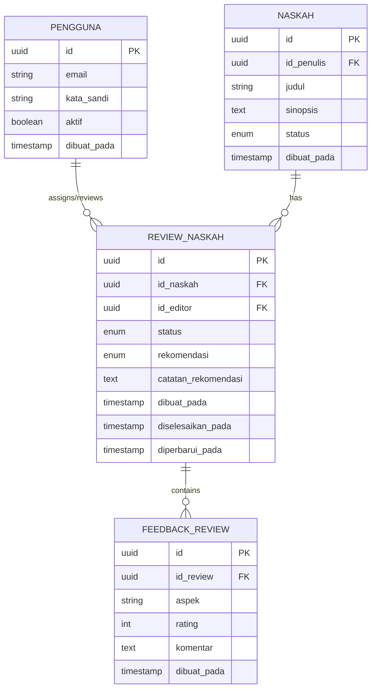
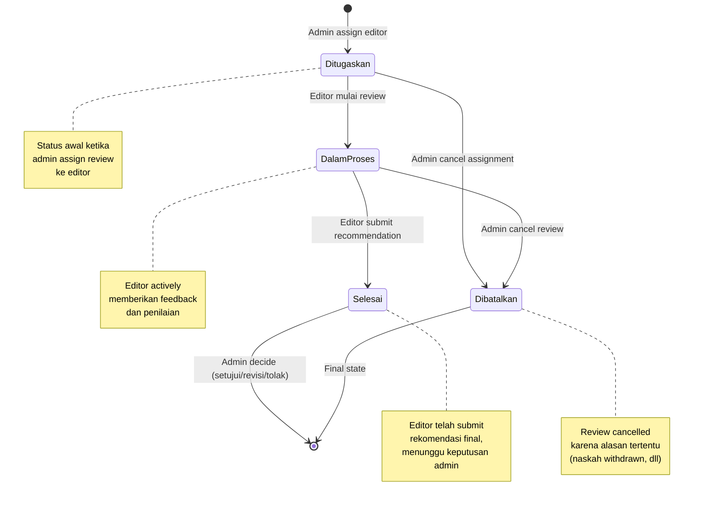

# LAPORAN DEVELOPMENT FASE 3

## SISTEM REVIEW DAN EDITOR PUBLISHIFY

**Bagian 2 dari 5: Perancangan Sistem**

---

## C. PERANCANGAN SISTEM

### C.1 Perancangan Database Schema

Setelah melakukan analisis kebutuhan secara mendalam, kami melanjutkan ke tahap perancangan database schema yang akan menjadi fondasi dari sistem review editorial. Perancangan database ini mengikuti prinsip normalisasi untuk menghindari redundansi data, sekaligus mempertimbangkan aspek performa untuk query yang sering dijalankan.

#### C.1.1 Entity Relationship Diagram

Kami merancang struktur database dengan dua tabel utama yang saling berelasi: tabel review naskah untuk menyimpan metadata assignment review, dan tabel feedback review untuk menyimpan detail penilaian dari setiap aspek yang direview oleh editor. Berikut adalah Entity Relationship Diagram yang menggambarkan relasi antar entitas:

Diagram di atas menunjukkan empat entitas utama yang terlibat dalam sistem review. Entitas Pengguna memiliki relasi one-to-many dengan Review Naskah karena satu admin dapat menugaskan banyak review, dan satu editor dapat menerima banyak assignment review. Entitas Naskah juga memiliki relasi one-to-many dengan Review Naskah karena satu naskah dapat mengalami multiple rounds of review ketika memerlukan revisi. Sementara itu, entitas Review Naskah memiliki relasi one-to-many dengan Feedback Review karena satu review dapat memiliki banyak feedback items untuk berbagai aspek penilaian.

#### C.1.2 Tabel Review Naskah: Design Decisions

Tabel review naskah dirancang untuk menjadi central entity yang menghubungkan naskah dengan editor yang ditugaskan. Kami menggunakan UUID sebagai primary key karena beberapa alasan strategis. Pertama, UUID memberikan uniqueness yang terjamin secara global tanpa perlu koordinasi dengan database server, yang sangat berguna jika di masa depan sistem berkembang menjadi distributed architecture. Kedua, UUID menghindari information leakage yang mungkin terjadi dengan auto-increment integer, di mana seseorang bisa menebak jumlah total review dalam sistem.

Field status menggunakan enum type dengan empat possible values: ditugaskan, dalam proses, selesai, dan dibatalkan. Pemilihan enum type memberikan type safety di level database, mencegah insertion of invalid status values. Enum juga lebih efisien dalam storage dibandingkan varchar karena hanya menyimpan ordinal number secara internal. Transisi antar status diatur melalui business logic di service layer untuk memastikan state transitions yang valid.

Field rekomendasi juga menggunakan enum type dengan tiga values: setujui, revisi, dan tolak. Field ini dibuat nullable karena hanya akan terisi setelah editor mensubmit final recommendation. Nullability memberikan clarity bahwa review belum selesai jika rekomendasi masih null. Validation di service layer memastikan bahwa hanya review dengan status selesai yang memiliki rekomendasi non-null.

Untuk timestamp fields, kami menggunakan tiga kolom: dibuat pada untuk tracking kapan review assignment dibuat dengan default value current timestamp, diselesaikan pada yang nullable untuk recording kapan editor menyelesaikan review, dan diperbarui pada dengan auto-update trigger untuk audit trail setiap perubahan. Pemisahan timestamp ini memberikan granularity yang berguna untuk analytics dan monitoring performa editor.

Lokasi implementasi schema: `backend/prisma/schema.prisma` pada baris tiga ratus enam puluh delapan hingga tiga ratus delapan puluh delapan. File schema Prisma ini akan di-generate menjadi TypeScript types yang strongly-typed untuk digunakan di service layer.

#### C.1.3 Tabel Feedback Review: Flexible Structure

Tabel feedback review dirancang dengan struktur yang flexible untuk mengakomodasi berbagai aspek penilaian yang mungkin berbeda-beda tergantung jenis naskah. Kami memutuskan untuk tidak membuat fixed columns untuk setiap aspek penilaian, melainkan menggunakan struktur key-value dengan aspek sebagai string field. Pendekatan ini memberikan beberapa keuntungan.

Pertama, flexibility untuk editor menambahkan custom aspects yang spesifik untuk naskah tertentu tanpa perlu schema migration. Misalnya, untuk naskah fiksi ilmiah, editor bisa menambah aspek akurasi saintifik yang mungkin tidak relevan untuk genre romance. Kedua, consistency dalam data structure memudahkan querying dan aggregation. Ketiga, scalability karena penambahan aspect baru tidak memerlukan alter table operation yang costly.

Field rating dirancang sebagai integer dengan constraint check untuk memastikan nilai antara satu hingga lima. Penggunaan numeric rating memberikan quantifiable metric yang bisa di-aggregate untuk calculating overall score. Kami mempertimbangkan untuk menggunakan decimal untuk allow half-stars, namun memutuskan integer sudah sufficient untuk fase awal dan lebih user-friendly.

Field komentar menggunakan text type tanpa length limitation untuk mengakomodasi detailed qualitative feedback. Kami tidak membatasi panjang komentar karena comprehensive feedback adalah salah satu value proposition dari sistem review kami. Di service layer, kami melakukan sanitization untuk prevent XSS attacks namun tetap preserve formatting yang mungkin diperlukan seperti line breaks atau bullet points.

Indexing strategy untuk tabel ini fokus pada kolom id review karena majority of queries akan fetch all feedback untuk specific review. Kami menggunakan composite index pada id review dan dibuat pada untuk support ordering by creation time yang sering digunakan di UI untuk display feedback chronologically. Composite index ini memanfaatkan PostgreSQL B-tree index yang efficient untuk equality check pada first column dan range scan pada second column.

Lokasi implementasi: `backend/prisma/schema.prisma` baris tiga ratus sembilan puluh satu hingga empat ratus satu.

#### C.1.4 Enum Types dan Type Safety

Pemilihan enum types untuk status dan rekomendasi fields adalah design decision yang strategis untuk enforce data integrity di multiple layers. Di database level, PostgreSQL enum memberikan constraint yang prevent insertion of invalid values. Di Prisma schema level, enum mapping generate TypeScript types yang di-check pada compile time. Di service level, TypeScript enums memberikan autocomplete dan prevent typos dalam business logic.

Enum StatusReview memiliki lifecycle yang linear dari ditugaskan ke dalam proses ke selesai, dengan dibatalkan sebagai exceptional state yang bisa terjadi dari status manapun. Kami tidak menggunakan soft delete dengan deleted at timestamp karena cancelled review tetap perlu di-track untuk audit purposes dan analytics tentang cancellation rate.

Enum Rekomendasi dengan tiga distinct values mencerminkan three possible outcomes yang actionable untuk admin. Setujui berarti naskah bisa langsung diterbitkan atau masuk queue penerbitan. Revisi berarti penulis perlu melakukan perbaikan berdasarkan feedback yang diberikan. Tolak berarti naskah tidak memenuhi quality standards dan rejected. Separation yang jelas ini memudahkan downstream processing dan automation.

Lokasi definisi enums: `backend/prisma/schema.prisma` baris enam belas hingga tiga puluh delapan.

#### C.1.5 Foreign Key Constraints dan Referential Integrity

Perancangan foreign key constraints sangat penting untuk maintain referential integrity di sistem kami. Untuk id naskah foreign key ke tabel naskah, kami menggunakan ON DELETE CASCADE policy. Keputusan ini dibuat karena jika naskah dihapus, maka semua review terkait juga harus dihapus karena mereka tidak memiliki meaning tanpa context naskah yang di-review.

Untuk id editor foreign key ke tabel pengguna, kami menggunakan ON DELETE RESTRICT policy. Ini berarti user dengan role editor tidak bisa dihapus jika masih memiliki active reviews. Policy ini dipilih untuk prevent data loss dan ensure accountability. Jika perlu menonaktifkan editor, kami menggunakan soft delete dengan flag aktif di tabel peran pengguna.

Untuk id review foreign key di tabel feedback review, kami menggunakan ON DELETE CASCADE karena feedback items tidak memiliki meaning independent dari review parent mereka. Ketika review dihapus, semua associated feedback harus dihapus untuk maintain database cleanliness.

Index strategy untuk foreign key columns mengikuti best practice PostgreSQL. Setiap foreign key column automatically mendapat index untuk optimize join operations. Additional composite indexes dibuat untuk common query patterns yang identified dari requirement analysis di section sebelumnya.

---

### C.2 Perancangan API Contract

Setelah database schema difinalisasi, kami melanjutkan ke perancangan API contract yang akan menjadi interface antara frontend dan backend. API design mengikuti RESTful principles dengan beberapa adaptations untuk business requirements spesifik dari sistem review.

#### C.2.1 REST Principles Application

Kami menerapkan REST principles dengan konsisten untuk ensure predictability dan discoverability dari API. Resource naming menggunakan plural nouns seperti slash review untuk collection dan slash review slash id untuk specific resource. HTTP methods digunakan sesuai semantic meaning: GET untuk retrieval, POST untuk creation, PUT untuk complete replacement, PATCH untuk partial update, dan DELETE untuk removal.

Status codes dipilih dengan cermat untuk memberikan clarity tentang operation result. Success operations menggunakan dua ratus untuk GET, dua ratus satu untuk POST creation, dua ratus empat untuk successful deletion. Client errors menggunakan empat ratus untuk bad request, empat ratus satu untuk unauthorized, empat ratus tiga untuk forbidden access, empat ratus empat untuk resource not found. Server errors menggunakan lima ratus untuk internal errors.

Response format distandarisasi across all endpoints menggunakan wrapper object dengan fields sukses sebagai boolean indicator, pesan sebagai human-readable description, dan data untuk actual payload. Standardization ini memudahkan error handling di frontend karena structure yang predictable.

#### C.2.2 Endpoint Specification Table

Berikut adalah tabel lengkap spesifikasi semua endpoints yang dirancang untuk sistem review:

| No  | Method | Endpoint                           | Auth | Role         | Fungsi                            | Request Body                                                    | Response                                                                          |
| --- | ------ | ---------------------------------- | ---- | ------------ | --------------------------------- | --------------------------------------------------------------- | --------------------------------------------------------------------------------- |
| 1   | POST   | `/review/tugaskan`                 | ✅   | Admin        | Admin menugaskan review ke editor | `{ idNaskah: UUID, idEditor: UUID, catatan?: string }`          | `{ sukses: true, pesan: string, data: ReviewNaskah }`                             |
| 2   | GET    | `/review`                          | ✅   | Admin/Editor | Ambil list review dengan filter   | Query params: `status`, `idEditor`, `halaman`, `limit`          | `{ sukses: true, data: ReviewNaskah[], metadata: Pagination }`                    |
| 3   | GET    | `/review/:id`                      | ✅   | Admin/Editor | Ambil detail review spesifik      | -                                                               | `{ sukses: true, data: ReviewNaskah & { feedback: Feedback[] } }`                 |
| 4   | PUT    | `/review/:id/mulai`                | ✅   | Editor       | Editor mulai mengerjakan review   | -                                                               | `{ sukses: true, pesan: string, data: ReviewNaskah }`                             |
| 5   | POST   | `/review/:id/feedback`             | ✅   | Editor       | Tambah feedback item baru         | `{ aspek: string, rating: 1-5, komentar: string }`              | `{ sukses: true, pesan: string, data: FeedbackReview }`                           |
| 6   | PUT    | `/review/:id/feedback/:feedbackId` | ✅   | Editor       | Update feedback item existing     | `{ aspek?: string, rating?: 1-5, komentar?: string }`           | `{ sukses: true, pesan: string, data: FeedbackReview }`                           |
| 7   | DELETE | `/review/:id/feedback/:feedbackId` | ✅   | Editor       | Hapus feedback item               | -                                                               | `{ sukses: true, pesan: string }`                                                 |
| 8   | POST   | `/review/:id/submit`               | ✅   | Editor       | Submit final recommendation       | `{ rekomendasi: Enum, catatanUmum: string }`                    | `{ sukses: true, pesan: string, data: ReviewNaskah }`                             |
| 9   | POST   | `/review/:id/keputusan`            | ✅   | Admin        | Admin membuat keputusan final     | `{ keputusan: 'setujui'\|'revisi'\|'tolak', catatan?: string }` | `{ sukses: true, pesan: string, data: { review: ReviewNaskah, naskah: Naskah } }` |

Tabel di atas menunjukkan sembilan endpoints utama yang covering complete review workflow dari assignment hingga final decision. Setiap endpoint memiliki authentication requirement yang indicated dengan checkmark pada kolom Auth, dan role-based access control yang specified di kolom Role.

Lokasi implementasi: `backend/src/modules/review/review.controller.ts` baris empat puluh empat hingga dua ratus tujuh puluh. Controller file ini contain semua endpoint definitions dengan decorators untuk routing, guards, dan swagger documentation.

#### C.2.3 Request Validation Schema

Untuk setiap endpoint yang menerima request body, kami merancang validation schema menggunakan Zod library untuk runtime validation dan class-validator untuk DTO validation. Dual validation approach ini memberikan type safety di compile time dan runtime validation untuk prevent invalid data reaching service layer.

Contoh untuk assign review endpoint, request body harus contain id naskah sebagai valid UUID, id editor sebagai valid UUID yang correspond to user dengan role editor, dan optional catatan sebagai string dengan maximum length seribu karakter. Validation rules ini di-enforce di DTO class dengan decorators dari class-validator.

Untuk tambah feedback endpoint, aspek field di-validate sebagai non-empty string dengan minimum length tiga karakter untuk prevent meaningless entries. Rating field di-validate sebagai integer antara satu hingga lima dengan custom validator. Komentar field di-validate sebagai string dengan minimum length sepuluh karakter untuk encourage detailed feedback.

Lokasi DTO definitions: `backend/src/modules/review/dto/` folder yang contain separate file untuk setiap DTO: `assign-review.dto.ts`, `tambah-feedback.dto.ts`, `submit-review.dto.ts`, dan `admin-decision.dto.ts`.

#### C.2.4 Error Response Format

Error handling dirancang dengan struktur yang konsisten untuk memudahkan client-side error processing. Semua error responses menggunakan format standard dengan field sukses sebagai false, pesan untuk human-readable error message, dan error object yang contain additional details.

Error object include kode untuk machine-readable error code yang dapat digunakan untuk conditional handling di frontend, detail untuk technical error details yang useful untuk debugging, field untuk indicating which input field caused validation error jika applicable, dan timestamp untuk error occurrence time.

Contoh error response untuk validation failure: sukses false, pesan "Data input tidak valid", error object dengan kode VALIDATION ERROR, detail array yang list semua validation failures, dan field yang indicate problematic field name. Standardization ini memungkinkan frontend untuk display targeted error messages per form field.

Lokasi implementation: `backend/src/common/filters/http-exception.filter.ts` dan `backend/src/common/filters/prisma-exception.filter.ts` yang handle different types of exceptions dengan consistent format.

#### C.2.5 Authentication dan Authorization Design

Setiap endpoint protected dengan JWT authentication middleware yang validate access token di Authorization header. Token validation include signature verification, expiration check, dan extraction of user claims seperti id pengguna dan roles.

Role-based access control implemented dengan custom guard yang check user roles terhadap required roles untuk specific endpoint. Untuk endpoints yang accessible oleh multiple roles dengan different behaviors seperti GET slash review, service layer contain conditional logic based on authenticated user role. Admin dapat melihat semua reviews, sementara editor hanya dapat melihat reviews yang assigned to them.

Permission matrix dirancang dengan principle of least privilege. Admin memiliki full access to all endpoints. Editor memiliki access to view dan modify reviews yang assigned to them, namun tidak dapat assign reviews atau make final decisions. Penulis tidak memiliki direct access to review endpoints, namun receive notifications tentang review status melalui notification system.

---

### C.3 Perancangan User Interface

Frontend UI dirancang dengan focus pada usability dan efficiency untuk setiap role. Kami menggunakan design system berbasis Tailwind CSS dan shadcn/ui component library untuk ensure consistency across pages.

#### C.3.1 Admin Interface Wireframes

Admin interface dirancang untuk provide oversight dan control atas entire review process. Dashboard admin menjadi central hub dengan empat stat cards yang menampilkan metrics penting: total naskah yang perlu direview, jumlah review yang sedang aktif, jumlah review yang selesai bulan ini, dan jumlah editor yang available.

Halaman antrian review menampilkan grid dari naskah yang berstatus diajukan dan belum ada review assignment. Setiap card menampilkan thumbnail sampul naskah, judul, nama penulis, tanggal pengajuan, dan action button untuk assign editor. Clicking assign button membuka modal dialog yang contain dropdown untuk memilih editor dari list editor yang available, textarea untuk catatan optional, dan confirm button.

Halaman monitoring review menampilkan table dari all active reviews dengan columns: judul naskah, nama editor, status review, tanggal ditugaskan, durasi review current, dan action untuk view detail. Table support sorting by columns dan filtering by status. Clicking view detail navigate to detail review page.

Halaman detail review menampilkan comprehensive information tentang specific review. Section atas menampilkan metadata review: judul naskah, nama editor, status, tanggal assigned, tanggal started, durasi. Section tengah menampilkan list dari feedback items yang sudah diberikan editor, dengan setiap item showing aspek, rating stars, dan komentar. Section bawah menampilkan catatan rekomendasi dari editor jika sudah submit, dan form untuk admin decision dengan radio buttons untuk setujui revisi atau tolak, textarea untuk catatan, dan submit button.

Halaman kelola editor menampilkan table dari users dengan role editor, dengan columns: nama, email, jumlah review assigned, jumlah review completed, average completion time, dan status aktif. Admin dapat activate atau deactivate editors, dan view detailed performance metrics per editor.

Lokasi implementasi halaman admin: `frontend/app/(admin)/admin/` folder dengan subdirectories untuk each page: `antrian-review/page.tsx`, `monitoring/page.tsx`, `review/[id]/page.tsx`, dan `pengguna/page.tsx`.

#### C.3.2 Editor Interface Wireframes

Editor interface dirancang untuk streamline review workflow dan minimize cognitive load. Dashboard editor menampilkan empat stat cards: jumlah review assigned to me, jumlah review in progress, jumlah review completed this month, dan average rating yang saya berikan.

Halaman daftar review menampilkan cards dari reviews yang assigned to logged-in editor. Setiap card menampilkan thumbnail naskah, judul, nama penulis, status review, tanggal assigned, dan action button. Action button text varies based on status: "Mulai Review" untuk status ditugaskan, "Lanjutkan Review" untuk status dalam proses, dan "Lihat Hasil" untuk status selesai.

Halaman detail review menjadi primary workspace untuk editor melakukan review. Layout divided into two columns. Left column menampilkan naskah preview dengan integrated PDF viewer atau text viewer depending on file type. Right column menampilkan review form dengan sections untuk feedback items dan final recommendation.

Feedback section menampilkan list dari feedback items yang sudah ditambahkan, dengan setiap item editable dan deletable. Form untuk add new feedback item include dropdown untuk pilih aspek dari predefined list atau input custom aspek, star rating input, dan textarea untuk komentar. Add button menambahkan feedback item to list dengan immediate save to backend.

Final recommendation section menjadi available setelah minimum threshold feedback items sudah ditambahkan. Section ini include radio buttons untuk pilih rekomendasi setujui revisi atau tolak, textarea untuk catatan umum yang provide summary of review, dan submit button. Submit action trigger confirmation dialog untuk ensure editor yakin dengan recommendation mereka.

Lokasi implementasi halaman editor: `frontend/app/(editor)/editor/` folder dengan `review/page.tsx` untuk list dan `review/[id]/page.tsx` untuk detail review page.

#### C.3.3 Component Hierarchy dan Reusability

UI components dirancang dengan hierarchy yang promote reusability dan maintainability. Base components dari shadcn/ui library seperti Button, Card, Dialog, Input, dan Select di-customize dengan brand styling di `frontend/components/ui/` folder.

Composite components yang specific to review domain dibuat di `frontend/components/review/` folder. Contohnya, ReviewCard component yang reusable untuk display review summary di berbagai contexts, FeedbackList component yang display array of feedback items dengan edit dan delete actions, dan ReviewStatusBadge component yang display status dengan appropriate color coding.

Form components yang complex seperti AssignEditorForm dan SubmitReviewForm di-separate into their own components untuk better code organization. Forms menggunakan react-hook-form library untuk form state management dan validation integration dengan zod schemas yang mirror backend DTOs untuk consistent validation rules across layers.

Lokasi component definitions: `frontend/components/review/` folder dan `frontend/components/forms/` folder untuk form-specific components.

#### C.3.4 State Management Strategy

Global state untuk review-related data dikelola menggunakan TanStack Query untuk server state management. Queries defined untuk each API endpoint dengan appropriate cache keys dan cache invalidation strategies. Mutations untuk write operations include optimistic updates untuk immediate UI feedback dan rollback on error.

Local component state dikelola dengan useState dan useReducer hooks dari React. Complex form state dikelola dengan react-hook-form yang provide performance optimization dengan minimal re-renders. Form validation errors displayed inline dengan field-level error messages untuk better user experience.

URL state digunakan untuk filtering dan pagination parameters di list views untuk enable shareable URLs dan browser back button support. Next.js router hooks utilized untuk programmatic navigation setelah successful operations seperti redirect to detail page setelah assign review.

Lokasi state management logic: API client definitions di `frontend/lib/api/review.ts`, custom hooks di `frontend/hooks/use-review.ts` dan `frontend/hooks/use-feedback.ts`, dan form components yang integrate dengan react-hook-form.

---

### C.4 Perancangan State Machine untuk Review Lifecycle

State machine diagram dirancang untuk visualize dan validate all possible state transitions dalam review lifecycle. Diagram ini menjadi reference untuk implement business logic yang enforce valid transitions dan prevent invalid states.

#### C.4.1 State Machine Diagram

Diagram di atas menunjukkan four primary states dan valid transitions between them. Initial state adalah Ditugaskan yang entered when admin assign review to editor. Dari state ini, ada dua possible transitions: normal flow ke DalamProses ketika editor mulai review, atau exceptional flow ke Dibatalkan jika admin cancel assignment.

Dari state DalamProses, normal flow adalah transition ke Selesai ketika editor submit final recommendation. Exceptional flow tetap memungkinkan transition ke Dibatalkan jika circumstances require cancellation seperti penulis withdraw naskah.

State Selesai adalah pre-final state di mana review complete dari editor perspective namun waiting for admin decision. Admin decision tidak change review state tetapi trigger separate action yang update naskah status. State Dibatalkan adalah final state yang tidak memiliki outgoing transitions.

#### C.4.2 Valid Transition Rules Table

Berikut adalah tabel lengkap yang specify validation rules untuk setiap possible state transition:

| Current State | Target State | Trigger Action        | Actor  | Validation Rules                                                                                            | Side Effects                                                                       |
| ------------- | ------------ | --------------------- | ------ | ----------------------------------------------------------------------------------------------------------- | ---------------------------------------------------------------------------------- |
| -             | Ditugaskan   | Assign review         | Admin  | Naskah status = "diajukan"; Editor has active editor role; No existing active review for naskah             | Update naskah status to "dalam_review"; Create notification for editor             |
| Ditugaskan    | DalamProses  | Mulai review          | Editor | Editor is assigned editor; Review status = "ditugaskan"                                                     | Update review timestamp mulai_pada; Create activity log                            |
| Ditugaskan    | Dibatalkan   | Cancel assignment     | Admin  | -                                                                                                           | Update naskah status back to "diajukan"; Create notification for editor            |
| DalamProses   | Selesai      | Submit recommendation | Editor | Editor is assigned editor; Minimum 3 feedback items exist; Rekomendasi field filled; Catatan umum not empty | Update review timestamp diselesaikan_pada; Create notification for admin           |
| DalamProses   | Dibatalkan   | Cancel review         | Admin  | -                                                                                                           | Delete associated feedback items; Create notification for editor                   |
| Selesai       | -            | Admin decision        | Admin  | Review status = "selesai"; Rekomendasi field not null                                                       | Update naskah status based on decision; Create notification for penulis and editor |

Tabel di atas provide comprehensive specification untuk implement validation logic di service layer. Setiap transition memiliki clearly defined preconditions yang must be checked before allowing transition, dan side effects yang must be executed as part of transaction untuk maintain consistency.

#### C.4.3 Business Logic Implementation Strategy

State transitions di-enforce melalui dedicated methods di service layer yang encapsulate validation dan side effects. Setiap method correspond to specific transition dan perform atomic transaction yang include state update, validation checks, dan side effect execution.

Method tugaskanReview untuk transition to Ditugaskan include validation check: naskah exists dan status is diajukan, editor exists dan has active editor role, no active review untuk naskah. Transaction include: create review record dengan status ditugaskan, update naskah status to dalam review, create notification for editor. Rollback terjadi jika any step fails untuk maintain consistency.

Method mulaiReview untuk transition to DalamProses include validation: review exists dan status is ditugaskan, authenticated user is assigned editor. Transaction include: update review status to dalam proses, update timestamp mulai pada, create activity log entry.

Method submitReview untuk transition to Selesai include validation: review exists dan status is dalam proses, authenticated user is assigned editor, minimum threshold feedback items exist, rekomendasi field is provided dan valid enum value, catatan umum is not empty. Transaction include: update review status to selesai, update rekomendasi dan catatan fields, update timestamp diselesaikan pada, create notification for admin.

Method adminKeputusan tidak change review state tetapi trigger complex logic: validate review status is selesai, validate keputusan is valid value, update naskah status based on keputusan setujui goes to disetujui revisi goes to perlu revisi tolak goes to ditolak, create notifications for penulis dan editor, record decision dalam activity log.

Lokasi implementation: `backend/src/modules/review/review.service.ts` dengan each method handling specific transition. Methods menggunakan Prisma transactions untuk ensure atomicity dan rollback capability pada error.

#### C.4.4 Concurrency Handling

Untuk prevent race conditions dalam state transitions, kami implement optimistic locking strategy. Review records include diperbarui pada timestamp yang checked during updates. Update query include WHERE clause yang check timestamp match dengan value yang di-read, dan throw error jika mismatch indicating concurrent modification.

Critical operations seperti assign review dan submit review wrapped dalam database transactions dengan appropriate isolation level. SERIALIZABLE isolation level considered untuk highest consistency namun deemed unnecessary karena transaction scope limited dan conflict probability low. READ COMMITTED isolation level used sebagai reasonable balance between consistency dan performance.

Frontend implement conflict handling dengan retry logic for failed mutations dan user feedback untuk inform concurrent modification. Optimistic updates di frontend rolled back dan fresh data fetched jika mutation fails due to conflict.

---

### Navigasi Dokumen

- **[← Kembali ke PART 1: Pendahuluan & Analisis](./LAPORAN-DEVELOPMENT-FASE-3-PART-1-PENDAHULUAN-ANALISIS.md)**
- **[Lanjut ke PART 3: Implementasi Backend →](./LAPORAN-DEVELOPMENT-FASE-3-PART-3-IMPLEMENTASI-BACKEND.md)**
- **[Ke INDEX](./LAPORAN-DEVELOPMENT-FASE-3-INDEX.md)**

---

**Catatan**: Dokumen ini adalah bagian dari seri Laporan Development Fase 3 yang terdiri dari 5 bagian. Untuk pemahaman lengkap, disarankan membaca semua bagian secara berurutan.
