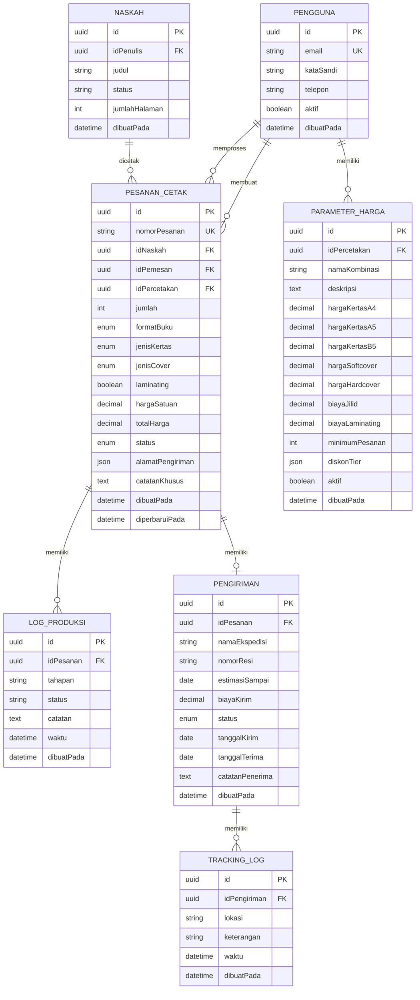

# LAPORAN DEVELOPMENT STEP BY STEP FASE 4

## SISTEM PERCETAKAN DAN MANAJEMEN PESANAN PUBLISHIFY

**PART 2: PERANCANGAN SISTEM**

---

## C. PERANCANGAN SISTEM

### C.1 Arsitektur Sistem

Dalam merancang arsitektur sistem percetakan Publishify, kami mengadopsi pendekatan arsitektur yang sudah terbukti di fase-fase sebelumnya yaitu three-tier architecture yang terdiri dari presentation layer, business logic layer, dan data access layer. Arsitektur ini memberikan kami clear separation of concerns dan memudahkan maintenance serta scalability di masa depan.

#### C.1.1 Presentation Layer (Frontend)

Presentation layer adalah lapisan yang berinteraksi langsung dengan user. Kami membangun layer ini menggunakan Next.js 14 dengan App Router yang merupakan framework React modern dengan built-in features seperti server-side rendering, file-based routing, dan image optimization. Pemilihan Next.js ini konsisten dengan tech stack yang sudah kami gunakan di fase-fase sebelumnya sehingga tidak ada learning curve yang significant bagi tim.

Pada layer ini, kami implement component-based architecture dimana setiap UI element adalah reusable component yang dapat di-compose untuk membentuk pages yang complex. Kami menggunakan shadcn/ui sebagai component library yang menyediakan pre-built components dengan accessibility dan customization yang excellent. Components ini kami extend dan customize sesuai dengan design system Publishify yang sudah kami establish.

Untuk state management, kami menggunakan kombinasi dari Zustand untuk global state dan TanStack Query (React Query) untuk server state management. Zustand kami gunakan untuk menyimpan authentication state dan UI state yang perlu diakses di multiple components. Sementara TanStack Query kami gunakan untuk handling data fetching, caching, dan synchronization dengan backend API. TanStack Query sangat powerful dalam managing loading states, error handling, dan automatic refetching ketika data stale.

Styling kami implement menggunakan Tailwind CSS yang merupakan utility-first CSS framework. Tailwind memungkinkan kami untuk style components langsung di JSX dengan class utilities yang comprehensive tanpa perlu menulis custom CSS. Ini significantly mempercepat development dan memastikan consistency dalam spacing, colors, dan typography across aplikasi.

#### C.1.2 Business Logic Layer (Backend)

Business logic layer adalah jantung dari aplikasi dimana semua business rules dan workflows di-enforce. Kami membangun layer ini menggunakan NestJS yang merupakan progressive Node.js framework dengan architecture yang heavily inspired oleh Angular. NestJS menyediakan built-in support untuk dependency injection, decorators, dan modular architecture yang sangat cocok untuk building scalable server-side applications.

Pada layer ini, kami organize code dalam modules dimana setiap module merepresentasikan satu domain area atau feature. Untuk Fase 4, kami membuat module percetakan yang berisi semua business logic related dengan printing system. Module ini terdiri dari beberapa components:

**Controllers**: Bertanggung jawab untuk handling HTTP requests, melakukan input validation menggunakan class-validator decorators, dan formatting responses. Controllers tidak mengandung business logic, mereka hanya act sebagai interface layer antara HTTP dan service layer.

**Services**: Berisi core business logic aplikasi. Service methods melakukan operations seperti creating orders, calculating prices, updating statuses, dan coordinating dengan services lain seperti notification service atau payment service. Services adalah injectable classes yang dapat di-inject ke controllers atau services lain through dependency injection.

**DTOs (Data Transfer Objects)**: Adalah TypeScript classes atau interfaces yang define structure dari data yang ditransfer antara layers. DTOs digunakan untuk request bodies dan response objects. Setiap DTO dapat memiliki validation decorators untuk ensure data integrity.

**Interfaces dan Types**: Define contracts dan shapes dari objects yang digunakan across aplikasi. Ini membantu dengan type safety dan IntelliSense di TypeScript.

Kami juga implement middleware untuk concerns yang cross-cutting seperti logging, error handling, dan performance monitoring. Middleware ini di-apply globally atau per-route basis untuk enhance functionality tanpa mengubah core business logic.

#### C.1.3 Data Access Layer (Database)

Data access layer bertanggung jawab untuk semua database operations. Kami menggunakan Prisma sebagai ORM (Object-Relational Mapping) yang menyediakan type-safe database client generated dari schema definition. Prisma sangat excellent dalam developer experience karena menyediakan auto-completion dan compile-time type checking untuk database queries.

Database yang kami gunakan adalah PostgreSQL yang merupakan robust open-source relational database dengan features yang rich seperti JSONB support, full-text search, dan advanced indexing. PostgreSQL dipilih karena reliability, performance, dan ecosystem yang mature. Kami host database di Supabase yang menyediakan PostgreSQL hosting dengan additional features seperti real-time subscriptions, built-in authentication, dan storage service.

Prisma Client kami inject ke services through PrismaService yang merupakan wrapper around Prisma Client dengan additional lifecycle hooks dan configuration. Semua database queries kami lakukan melalui Prisma Client ini yang ensure consistency dan type safety.

#### C.1.4 Integration Layer

Integration layer handles komunikasi dengan external services dan systems. Untuk Fase 4, kami integrate dengan beberapa services:

**Notification Service**: Internal service yang handle sending notifications via email dan WebSocket. Service ini kami trigger dari percetakan service ketika ada events penting seperti order created, order accepted, atau status changed.

**Payment Service**: Service yang akan handle payment processing. Meskipun payment processing detail belum fully implemented di Fase 4, kami sudah prepare struktur untuk integration dengan payment gateways di masa depan.

**File Storage Service**: Menggunakan Supabase Storage untuk menyimpan cover images dan manuscript files. Service ini provide signed URLs untuk secure file access.

Semua integration kami design dengan loose coupling dimana percetakan service tidak directly depend on implementation details dari external services. Kami menggunakan interfaces dan dependency injection untuk ensure testability dan flexibility jika perlu switch implementations di masa depan.

### C.2 Database Design

Database design adalah salah satu aspek paling critical dalam system architecture karena schema yang baik akan facilitate performance, scalability, dan maintainability. Sebaliknya, schema yang buruk dapat menyebabkan bottlenecks dan technical debt yang sulit untuk di-refactor.

#### C.2.1 Schema Design Principles

Dalam mendesign schema untuk sistem percetakan, kami apply several key principles:

**Normalization**: Kami apply database normalization hingga Third Normal Form untuk eliminate redundancy dan ensure data integrity. Setiap entity memiliki table sendiri dengan clear primary key, dan relationships antar entities di-maintain melalui foreign keys.

**Denormalization yang Strategic**: Di beberapa case dimana performance critical, kami intentionally denormalize dengan menyimpan calculated values seperti totalHarga di tabel pesanan alih-alih calculate on-the-fly setiap query. Ini adalah acceptable tradeoff antara data integrity dan query performance.

**Use of JSON for Flexible Data**: Untuk data yang structure-nya bisa vary atau perlu flexibility, kami menggunakan JSON/JSONB columns. Contohnya alamatPengiriman di tabel pesanan kami simpan sebagai JSON object karena struktur alamat bisa berbeda tergantung country atau specific needs. JSON juga kami gunakan untuk parametersJson di tabel parameter harga untuk allow flexible pricing configurations tanpa perlu schema migrations setiap kali ada perubahan pricing model.

**Proper Indexing**: Kami create indexes pada columns yang frequently used di WHERE clauses, JOIN conditions, atau ORDER BY. Misalnya kami create indexes pada idPemesan, idPercetakan, status, dan nomorPesanan di tabel pesanan untuk ensure fast lookups. Indexes ini significantly improve query performance terutama ketika data volume bertumbuh.

**Enum Types for Controlled Values**: Untuk columns yang hanya boleh memiliki set of predefined values, kami menggunakan enum types. Ini enforce data integrity di database level dan make the schema self-documenting. Contoh enums yang kami define adalah StatusPesanan, FormatBuku, JenisKertas, dan JenisCover.

#### C.2.2 Table Design Details

Mari kita bahas design dari masing-masing table utama di sistem percetakan:

**Tabel pesanan_cetak**

Table ini adalah centerpiece dari sistem dimana semua informasi tentang order disimpan. Kami design table ini dengan columns yang comprehensive untuk capture semua aspects dari sebuah printing order.

Field `id` menggunakan UUID alih-alih auto-increment integer untuk ensure globally unique identifiers yang cocok untuk distributed systems. Field `nomorPesanan` kami add sebagai secondary identifier yang human-readable dengan format seperti "PCT-2026-00123" yang lebih friendly untuk komunikasi dengan users.

Foreign keys `idNaskah`, `idPemesan`, dan `idPercetakan` establish relationships dengan table pengguna dan naskah. Field `idPercetakan` kami set sebagai nullable karena ketika pesanan first created, percetakan belum assigned sampai ada percetakan yang accept order.

Untuk spesifikasi cetak, kami menggunakan enum fields yaitu `formatBuku`, `jenisKertas`, dan `jenisCover` untuk ensure valid values. Field `laminating` adalah boolean yang indicate apakah order include laminating service.

Pricing fields `hargaSatuan` dan `totalHarga` menggunakan Decimal type dengan precision (10,2) yang artinya dapat store hingga 10 digits dengan 2 decimal places. Decimal type kami pilih karena accurate untuk monetary values alih-alih Float yang bisa memiliki precision issues.

Field `status` menggunakan enum StatusPesanan yang memiliki values: tertunda, diterima, dalam_produksi, kontrol_kualitas, siap, dikirim, terkirim, selesai, dan dibatalkan. Enum ini represents complete lifecycle dari sebuah order.

Field `alamatPengiriman` menggunakan JSON type untuk store structured address information dengan keys seperti nama, telepon, alamat, kota, provinsi, dan kodePos. JSON kami pilih karena flexibility jika di masa depan perlu add fields tambahan tanpa schema migration.

Timestamps `dibuatPada` dan `diperbaruiPada` automatically managed oleh Prisma dengan @default(now()) dan @updatedAt decorators untuk audit trail purposes.

**Tabel parameter_harga_percetakan**

Table ini store pricing configurations untuk setiap percetakan. Design challenge disini adalah bagaimana membuat pricing system yang flexible enough untuk accommodate different pricing models dari different percetakan tanpa perlu frequent schema changes.

Kami approach this dengan menyimpan base pricing components sebagai separate columns seperti `hargaKertasA4`, `hargaKertasA5`, `hargaKertasB5`, `hargaSoftcover`, `hargaHardcover`, `biayaJilid`, `biayaLaminating`, dan `biayaPengirimanPerKg`. Ini adalah komponen-komponen pricing yang common across most percetakan.

Untuk komponen yang lebih complex seperti tier discounts atau pricing adjustments, kami menggunakan JSON field `diskonTier` yang dapat store array of objects dengan structure seperti:

```json
[
  { "minQty": 50, "diskonPersen": 5 },
  { "minQty": 100, "diskonPersen": 10 },
  { "minQty": 500, "diskonPersen": 15 }
]
```

Field `aktif` adalah boolean yang indicate apakah pricing scheme ini currently active. Setiap percetakan hanya boleh memiliki satu active scheme pada satu waktu, tapi kami allow multiple schemes per percetakan untuk historical purposes. Ini memungkinkan percetakan untuk switch antara pricing schemes (misal tarif normal vs tarif promo) tanpa lose history.

**Tabel log_produksi**

Table ini track detailed progress dari production process. Setiap entry represents satu event di production timeline seperti mulai tahap cetak, selesai tahap cetak, mulai tahap potong, dst.

Field `tahapan` store nama dari production stage: cetak, potong, jilid, finishing, atau packing. Field `status` indicate apakah tahapan dimulai, selesai, atau ada issue yang perlu attention.

Field `catatan` provide space untuk percetakan add any notes atau remarks yang relevant untuk tahapan tersebut. Ini valuable untuk communication dengan penulis atau internal documentation.

Field `waktu` capture timestamp dari setiap log entry yang kami use untuk calculate production duration dan identify bottlenecks di production process.

**Tabel pengiriman**

Table ini store shipping information untuk orders yang already ready untuk dispatch. Kami design sebagai one-to-one relationship dengan pesanan dimana setiap pesanan maximum memiliki satu pengiriman record.

Field `namaEkspedisi` dan `nomorResi` adalah critical information yang penulis butuhkan untuk track shipment di external expedition websites. Field `estimasiSampai` provide expected delivery date yang useful untuk setting customer expectations.

Field `status` menggunakan enum StatusPengiriman dengan values: diproses, dalam_perjalanan, terkirim, dan gagal untuk track shipping progress.

Tanggal fields `tanggalKirim` dan `tanggalTerima` capture actual shipping date dan delivery date yang useful untuk calculating delivery performance metrics.

**Tabel tracking_log**

Table ini provide granular tracking updates untuk shipment. Ini optional table yang can be populated ketika ada updates dari expedition atau manual updates dari percetakan.

Setiap entry berisi `lokasi` (current location), `keterangan` (status description), dan `waktu` (timestamp). Accumulated logs ini form complete tracking history yang can be displayed sebagai timeline untuk penulis.

#### C.2.3 Entity Relationship Diagram

Untuk visualize relationships antar tables, kami create Entity Relationship Diagram menggunakan Mermaid:



Diagram di atas menunjukkan complete relationships dari database schema sistem percetakan. Perhatikan bahwa ada one-to-many relationships dari PENGGUNA ke PESANAN_CETAK (seorang penulis bisa punya many pesanan, seorang percetakan bisa handle many pesanan), one-to-many dari PESANAN_CETAK ke LOG_PRODUKSI (satu pesanan bisa punya many production logs), dan one-to-one dari PESANAN_CETAK ke PENGIRIMAN (satu pesanan maximum punya satu shipment).

### C.3 API Design

API design adalah contract antara frontend dan backend yang perlu carefully planned untuk ensure consistency, usability, dan scalability. Kami apply RESTful principles dalam designing APIs dengan beberapa adaptations untuk specific needs kami.

#### C.3.1 API Endpoints Structure

Kami organize API endpoints dengan resource-based URLs yang clearly indicate apa yang endpoint tersebut operasikan. Base path untuk semua percetakan-related endpoints adalah `/percetakan`. Berikut adalah complete list dari endpoints yang kami design:

**Endpoints untuk Penulis**:

1. `GET /percetakan/daftar` - Mengambil list percetakan yang available dengan pricing info
2. `POST /percetakan/kalkulasi-harga` - Menghitung estimasi harga berdasarkan specs
3. `POST /percetakan/pesanan` - Membuat pesanan baru
4. `GET /percetakan/pesanan` - Mengambil list pesanan milik penulis yang login
5. `GET /percetakan/pesanan/:id` - Mengambil detail satu pesanan
6. `PUT /percetakan/pesanan/:id` - Update pesanan (jika masih status tertunda)
7. `DELETE /percetakan/pesanan/:id` - Cancel pesanan
8. `POST /percetakan/pesanan/:id/konfirmasi-terima` - Confirm delivery

**Endpoints untuk Percetakan**:

9. `GET /percetakan/pesanan` - Mengambil list pesanan untuk percetakan dengan filters
10. `POST /percetakan/pesanan/:id/konfirmasi` - Accept atau reject pesanan
11. `PUT /percetakan/pesanan/:id/status` - Update status pesanan
12. `POST /percetakan/pesanan/:id/produksi` - Add production log
13. `POST /percetakan/pesanan/:id/kirim` - Create shipment dan update status
14. `GET /percetakan/statistik` - Mengambil business metrics
15. `GET /percetakan/tarif` - Mengambil pricing parameters
16. `POST /percetakan/tarif` - Create new pricing scheme
17. `PUT /percetakan/tarif/:id` - Update pricing scheme
18. `POST /percetakan/tarif/:id/aktifkan` - Activate pricing scheme

**Endpoints untuk Admin**:

19. `GET /percetakan/pesanan/all` - Mengambil all pesanan across all percetakan
20. `PUT /percetakan/pesanan/:id/admin-update` - Admin override untuk update pesanan
21. `GET /percetakan/reports` - Generate various business reports

Setiap endpoint kami document dengan OpenAPI/Swagger annotations di controller sehingga automatically generate API documentation yang can be accessed di `/api/docs`.

#### C.3.2 Request dan Response Format

Kami standardize request dan response format untuk consistency across all endpoints.

**Request Format**:

Untuk POST dan PUT requests, kami expect request body dalam JSON format yang conform to defined DTOs. Contoh request untuk create pesanan:

```json
{
  "idNaskah": "uuid-naskah",
  "idPercetakan": "uuid-percetakan",
  "jumlah": 100,
  "formatBuku": "A5",
  "jenisKertas": "BOOKPAPER",
  "jenisCover": "SOFTCOVER",
  "laminating": true,
  "alamatPengiriman": {
    "nama": "John Doe",
    "telepon": "081234567890",
    "alamat": "Jl. Contoh No. 123",
    "kota": "Jakarta",
    "provinsi": "DKI Jakarta",
    "kodePos": "12345"
  },
  "catatanKhusus": "Mohon packaging extra hati-hati"
}
```

Semua field required akan di-validate oleh DTO validators. Jika ada field yang missing atau invalid format, API akan return 400 Bad Request dengan error details.

**Response Format**:

Semua responses kami wrap dalam consistent envelope format:

```json
{
  "sukses": true,
  "pesan": "Pesanan berhasil dibuat",
  "data": {
    // Actual response data
  },
  "metadata": {
    // Optional metadata seperti pagination info
  }
}
```

Untuk error responses:

```json
{
  "sukses": false,
  "pesan": "Validasi gagal",
  "error": {
    "kode": "VALIDATION_ERROR",
    "detail": "Jumlah pesanan harus minimal 10",
    "field": "jumlah"
  }
}
```

Format yang consistent ini memudahkan frontend untuk handle responses dan errors dengan predictable structure.

#### C.3.3 Authentication dan Authorization

Semua API endpoints kecuali health check dan auth endpoints require authentication. Kami implement JWT-based authentication dimana user harus login terlebih dahulu dan mendapatkan access token yang kemudian di-attach di Authorization header untuk subsequent requests.

Authorization kami implement dengan role-based access control menggunakan custom decorators. Setiap endpoint dapat specify roles yang diperbolehkan mengakses. Misalnya endpoint untuk accept pesanan hanya boleh diakses oleh user dengan role 'percetakan':

```typescript
@Post('pesanan/:id/konfirmasi')
@UseGuards(JwtAuthGuard, PeranGuard)
@Peran('percetakan')
async konfirmasiPesanan(...)
```

Guard akan automatically check user's role dari JWT token dan return 403 Forbidden jika role tidak sesuai.

#### C.3.4 Error Handling Strategy

Kami implement comprehensive error handling dengan different error classes untuk different scenarios:

- `NotFoundException`: Ketika resource yang di-request tidak ditemukan (404)
- `BadRequestException`: Ketika request data invalid atau tidak sesuai requirements (400)
- `ForbiddenException`: Ketika user tidak memiliki permission (403)
- `UnauthorizedException`: Ketika authentication gagal atau token invalid (401)
- `ConflictException`: Ketika ada conflict dengan existing data (409)

Semua exceptions ini caught oleh global exception filter yang format error response sesuai dengan standard envelope kami.

### C.4 Business Logic Design

Business logic adalah implementasi dari business rules dan workflows yang govern how sistem operates. Kami carefully design business logic untuk ensure consistency, maintainability, dan testability.

#### C.4.1 Pricing Calculation Algorithm

Salah satu business logic paling critical adalah perhitungan harga pesanan. Algoritma ini perlu accurate dan consistent across different scenarios.

**Input Parameters**:

- ID Percetakan (untuk get pricing parameters)
- Format buku (A4/A5/B5)
- Jenis kertas (HVS/BOOKPAPER/ART_PAPER)
- Jenis cover (SOFTCOVER/HARDCOVER)
- Jumlah halaman (dari naskah)
- Quantity pesanan
- Opsi laminating (boolean)

**Calculation Steps**:

1. **Fetch Active Pricing Parameters**: Query database untuk get active pricing scheme dari percetakan yang dipilih. Jika tidak ada active scheme, return error.

2. **Calculate Base Price**: Base price ditentukan oleh format buku dan jenis kertas. Misalnya jika user pilih A5 BOOKPAPER, base price adalah hargaKertasA5 dari pricing parameters.

3. **Calculate Paper Cost**: Paper cost = base price × jumlah halaman. Ini adalah cost untuk mencetak semua pages dari naskah.

4. **Add Cover Cost**: Tergantung jenis cover yang dipilih, add hargaSoftcover atau hargaHardcover.

5. **Add Binding Cost**: Add biayaJilid untuk jilid buku.

6. **Add Laminating Cost**: Jika user pilih laminating, add biayaLaminating.

7. **Calculate Subtotal**: Subtotal = paper cost + cover cost + binding cost + laminating cost.

8. **Apply Quantity Discount**: Check diskonTier dari pricing parameters. Loop through tiers dari highest ke lowest. Jika quantity memenuhi minQty dari sebuah tier, apply diskon percentage. Only apply highest applicable discount.

9. **Calculate Unit Price**: Unit price = subtotal × (1 - discount percentage).

10. **Calculate Total Price**: Total price = unit price × quantity.

11. **Add Shipping Cost**: Estimate shipping cost based on biayaPengirimanPerKg × estimated weight. Weight estimation based on jumlah halaman dan quantity.

**Example Calculation**:

Mari kita walk through contoh calculation:

- Format: A5 (hargaKertasA5 = Rp 50 per halaman)
- Jumlah halaman: 200
- Cover: Softcover (Rp 5.000)
- Jilid: Rp 3.000
- Laminating: Ya (Rp 2.000)
- Quantity: 150 buku
- Diskon tiers: [50+ = 5%, 100+ = 10%, 500+ = 15%]

Step-by-step:

1. Base price = Rp 50
2. Paper cost = Rp 50 × 200 = Rp 10.000
3. Add cover = Rp 10.000 + Rp 5.000 = Rp 15.000
4. Add jilid = Rp 15.000 + Rp 3.000 = Rp 18.000
5. Add laminating = Rp 18.000 + Rp 2.000 = Rp 20.000
6. Subtotal = Rp 20.000
7. Quantity 150 memenuhi tier 100+, apply 10% discount
8. Unit price = Rp 20.000 × 0.9 = Rp 18.000
9. Total = Rp 18.000 × 150 = Rp 2.700.000

Algoritma ini kami implement di service method yang reusable baik untuk realtime calculation di form maupun untuk final calculation saat create pesanan.

#### C.4.2 Order Status Workflow

Order status workflow adalah state machine yang govern valid transitions dari satu status ke status lain. Tidak semua transitions diperbolehkan untuk ensure data integrity dan business rules.

**Status Flow**:

```
tertunda → diterima → dalam_produksi → kontrol_kualitas → siap → dikirim → terkirim → selesai
   ↓                                                                            ↑
dibatalkan --------------------------------------------------------→ dibatalkan
```

**Valid Transitions**:

- Dari `tertunda`: Bisa ke `diterima` (percetakan accept) atau `dibatalkan` (penulis/percetakan cancel)
- Dari `diterima`: Bisa ke `dalam_produksi` (start production) atau `dibatalkan`
- Dari `dalam_produksi`: Bisa ke `kontrol_kualitas` (production done) atau `dibatalkan` (cancel karena issue)
- Dari `kontrol_kualitas`: Bisa ke `siap` (QC pass) atau kembali ke `dalam_produksi` (QC fail, need rework)
- Dari `siap`: Bisa ke `dikirim` (create shipment) atau `dibatalkan`
- Dari `dikirim`: Bisa ke `terkirim` (confirm delivery) atau `dibatalkan` (shipment failed)
- Dari `terkirim`: Bisa ke `selesai` (transaction complete)

Kami implement validation di service layer untuk ensure only valid transitions allowed. Jika frontend attempt invalid transition, API return BadRequestException dengan message explaining why transition not allowed.

#### C.4.3 Notification Rules

Notifications adalah critical untuk keep users informed tentang order progress. Kami define rules untuk kapan notifications harus triggered:

**Notifikasi ke Penulis**:

- Pesanan berhasil dibuat (email + in-app)
- Pesanan diterima oleh percetakan (email + in-app)
- Pesanan ditolak oleh percetakan dengan reason (email + in-app)
- Status produksi updated (in-app, email hanya untuk milestone stages)
- Pesanan siap untuk dikirim (email + in-app)
- Pesanan dikirim dengan nomor resi (email + in-app)
- Pesanan bermasalah atau tertunda (email + in-app)

**Notifikasi ke Percetakan**:

- Pesanan baru masuk (email + in-app)
- Penulis inquiry atau update pesanan (in-app)
- Payment confirmed (jika integrated dengan payment gateway) (email + in-app)
- Reminder untuk pesanan yang pending action (email, triggered by scheduled job)

Notifications kami send melalui multiple channels untuk ensure delivery. Email untuk important notifications yang need permanent record, dan in-app notifications untuk real-time updates.

### C.5 Frontend Architecture

Frontend architecture kami design dengan emphasis pada reusability, maintainability, dan performance.

#### C.5.1 Folder Structure

Kami organize frontend code dengan feature-based structure:

```
frontend/
├── app/
│   ├── (penulis)/          # Penulis pages group
│   │   └── penulis/
│   │       └── pesanan-cetak/
│   │           ├── page.tsx
│   │           ├── buat/
│   │           │   └── page.tsx
│   │           └── [id]/
│   │               └── page.tsx
│   ├── (percetakan)/       # Percetakan pages group
│   │   └── percetakan/
│   │       ├── page.tsx    # Dashboard
│   │       ├── pesanan/
│   │       │   ├── page.tsx
│   │       │   ├── baru/
│   │       │   ├── produksi/
│   │       │   └── [id]/
│   │       ├── harga/
│   │       │   └── page.tsx
│   │       └── pengiriman/
│   │           └── page.tsx
│   └── (admin)/            # Admin pages group
│       └── admin/
│           └── pesanan/
│               └── page.tsx
├── components/
│   ├── percetakan/         # Percetakan-specific components
│   │   ├── form-pesanan.tsx
│   │   ├── kartu-pesanan.tsx
│   │   ├── timeline-produksi.tsx
│   │   ├── kalkulator-harga.tsx
│   │   ├── dialog-konfirmasi.tsx
│   │   └── form-parameter-harga.tsx
│   ├── ui/                 # shadcn/ui base components
│   │   ├── button.tsx
│   │   ├── input.tsx
│   │   ├── dialog.tsx
│   │   └── ...
│   └── shared/             # Shared components
│       ├── data-table.tsx
│       └── loading-spinner.tsx
├── lib/
│   ├── api/
│   │   └── percetakan.ts   # API client functions
│   ├── hooks/
│   │   ├── use-kalkulasi-harga.ts
│   │   └── use-pesanan.ts
│   └── utils.ts
└── types/
    └── percetakan.ts       # TypeScript type definitions
```

Struktur ini provide clear separation antara different user roles dan make codebase easy to navigate.

#### C.5.2 Component Design Patterns

Kami apply beberapa design patterns dalam building components:

**Container-Presentational Pattern**: Kami separate components menjadi container components yang handle data fetching dan business logic, dan presentational components yang purely render UI based on props. Ini make components more reusable dan easier to test.

**Compound Components Pattern**: Untuk complex components seperti forms atau tables, kami use compound components pattern dimana parent component provide context dan child components consume context. Ini give flexibility dalam composition.

**Custom Hooks Pattern**: Kami extract reusable logic ke custom hooks. Misalnya `useKalkulasiHarga` hook encapsulate logic untuk call price calculation API dan manage loading/error states. Hooks ini dapat reused di multiple components.

#### C.5.3 State Management Strategy

Kami use TanStack Query untuk manage server state dengan comprehensive configuration:

- **Caching**: Responses dari API automatically cached untuk minimize redundant requests
- **Stale Time**: Configure berapa lama data considered fresh sebelum refetch
- **Cache Time**: Configure berapa lama cached data retained in memory
- **Refetch Strategies**: Configure kapan data should refetch (on window focus, on reconnect, etc.)
- **Optimistic Updates**: Untuk mutations, update UI immediately sebelum server response untuk snappy UX

Untuk local UI state, kami use React hooks (useState, useReducer) atau Zustand jika state perlu shared across distant components.

---

**[REFERENSI FILE CODINGAN]**

Untuk implementasi actual dari perancangan sistem ini, silakan lihat file-file berikut:

**Backend**:

- Prisma Schema: `backend/prisma/schema.prisma` (lines 408-536)
- Percetakan Module: `backend/src/modules/percetakan/percetakan.module.ts`
- Percetakan Service: `backend/src/modules/percetakan/percetakan.service.ts` (1,962 lines)
- Percetakan Controller: `backend/src/modules/percetakan/percetakan.controller.ts` (733 lines)
- DTOs: `backend/src/modules/percetakan/dto/` (14 files)

**Frontend**:

- Dashboard Percetakan: `frontend/app/(percetakan)/percetakan/page.tsx`
- Form Pesanan: `frontend/app/(penulis)/penulis/pesanan-cetak/buat/page.tsx`
- API Client: `frontend/lib/api/percetakan.ts`
- Types: `frontend/types/percetakan.ts`
- Custom Hooks: `frontend/lib/hooks/use-kalkulasi-harga.ts`

---

**[TEMPAT UNTUK SCREENSHOT]**

Berikut adalah lokasi dimana screenshot dan diagram dapat ditambahkan:

1. **Screenshot Arsitektur Diagram**: Three-tier architecture overview
2. **Screenshot ERD**: Entity Relationship Diagram yang lebih detail
3. **Screenshot API Endpoints Flow**: Sequence diagram menunjukkan API call flows
4. **Screenshot State Machine**: Visual state machine untuk order status workflow
5. **Screenshot Component Hierarchy**: Component tree untuk pages utama
6. **Screenshot Pricing Algorithm Flowchart**: Flowchart dari pricing calculation algorithm
