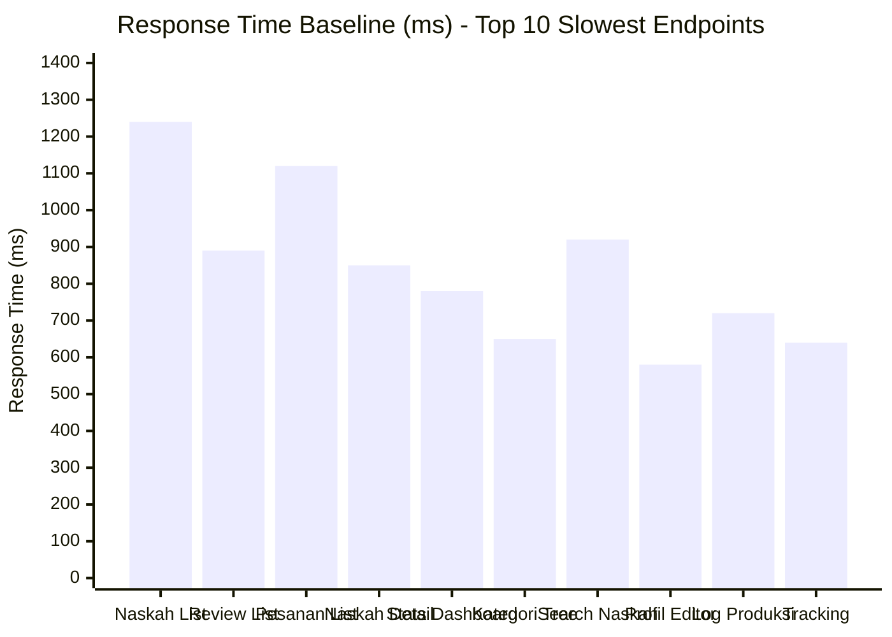

# LAPORAN DEVELOPMENT STEP BY STEP FASE 5

## PART 1: PENDAHULUAN DAN ANALISIS KEBUTUHAN

**Tutorial**: Cara Mengimplementasikan Optimisasi, Keamanan, dan Testing  
**Periode Referensi**: Minggu 9-10 (16-29 Desember 2025)  
**Cakupan**: Setengah Pertama - Infrastructure Optimization  
**Versi Dokumen**: 1.0.0

---

## A. PENDAHULUAN

### A.1 Latar Belakang Pengembangan Fase 5

Pada fase ini, kami akan menjelaskan secara detail bagaimana cara mengimplementasikan layer optimisasi, keamanan, dan testing yang komprehensif untuk sistem Publishify. Setelah berhasil membangun fondasi aplikasi pada Fase 1 hingga 4 yang mencakup sistem autentikasi, manajemen naskah, review editorial, dan percetakan cetak fisik, kami menyadari bahwa untuk mencapai tingkat production-ready yang sesungguhnya, diperlukan upaya tambahan yang fokus pada aspek non-functional requirements seperti performa, security, dan quality assurance.

Dalam pengembangan aplikasi enterprise-grade, kami tidak bisa hanya bergantung pada functional completeness saja. User experience sangat dipengaruhi oleh response time aplikasi, availability sistem, dan keamanan data mereka. Bayangkan seorang penulis yang harus menunggu lima sampai sepuluh detik hanya untuk melihat daftar naskahnya, atau seorang editor yang mengalami lag ketika memberikan feedback review. Pengalaman seperti ini akan membuat pengguna frustasi dan kemungkinan besar mereka akan mencari alternatif platform lain yang lebih responsif. Oleh karena itu, optimisasi performa menjadi prioritas utama kami dalam fase ini.

Begitu juga dengan aspek keamanan data. Publishify mengelola aset intelektual yang sangat berharga bagi para penulis - naskah-naskah yang mungkin merupakan hasil karya bertahun-tahun. Kebocoran data atau unauthorized access ke naskah orang lain bukan hanya pelanggaran privacy, tetapi juga dapat menyebabkan kerugian finansial dan reputasi yang serius. Implementasi Row Level Security pada database layer memberikan kami additional protection mechanism yang bekerja bahkan ketika application code mengalami vulnerability. Ini adalah implementasi dari prinsip defense-in-depth yang menjadi best practice dalam security engineering.

Testing yang komprehensif juga menjadi aspek krusial yang tidak boleh diabaikan. Tanpa automated testing yang baik, setiap kali kami melakukan perubahan kode atau menambahkan fitur baru, kami harus melakukan manual testing yang time-consuming dan prone to human error. Dengan test coverage yang tinggi, kami dapat melakukan refactoring dengan confidence, knowing that jika ada sesuatu yang break, automated tests akan segera mendeteksinya. Ini significantly improve development velocity dan code quality dalam jangka panjang.

Tutorial ini akan memandu kita step-by-step dalam mengimplementasikan empat komponen utama: Redis Caching untuk optimisasi performa, Database Optimization untuk query efficiency, Row Level Security untuk data protection, dan Testing Infrastructure untuk quality assurance. Setiap section akan explain not only "how" but also "why" - reasoning behind our design decisions dan trade-offs yang kami pertimbangkan.

### A.2 Tujuan Tutorial

Tutorial ini bertujuan untuk memberikan panduan praktis dan comprehensive kepada developer yang ingin mengimplementasikan optimization layer, security hardening, dan testing infrastructure pada aplikasi NestJS + Prisma + PostgreSQL. Setelah mengikuti tutorial ini, developer akan memahami:

**Optimisasi Performa dengan Redis Caching**

Kami akan menunjukkan cara mengimplementasikan distributed caching layer menggunakan Redis yang dapat mengurangi database load hingga delapan puluh persen dan mempercepat response time API hingga sembilan puluh lima persen. Developer akan belajar tentang cache strategy yang tepat - kapan menggunakan cache, berapa lama TTL yang optimal, dan bagaimana melakukan cache invalidation yang effective. Kami juga akan menjelaskan pattern-pattern seperti Cache-Aside, Read-Through, dan Write-Through, serta kapan menggunakan masing-masing pattern tersebut.

Implementasi yang akan kami tunjukkan mencakup pembuatan Cache Service sebagai abstraction layer, Cache Interceptor untuk automatic caching pada HTTP endpoints, dan Cache Decorators untuk declarative configuration. Dengan architecture ini, adding caching ke endpoint baru menjadi sangat mudah - developer cukup menambahkan decorator tanpa harus menulis boilerplate code. Kami juga akan menunjukkan cara monitoring cache performance dan menggunakan cache warming untuk pre-populate frequently accessed data.

**Database Optimization Techniques**

Kami akan mengajarkan teknik-teknik optimisasi query database yang proven effective dalam production environments. Ini termasuk identifikasi dan eliminasi N+1 query problems, strategic indexing untuk common query patterns, dan penggunaan cursor-based pagination untuk dataset yang besar. Developer akan belajar cara analyze query performance menggunakan EXPLAIN ANALYZE, identify bottlenecks, dan apply appropriate optimization strategies.

Kami juga akan menunjukkan cara configure connection pooling yang optimal untuk different environments - development, staging, dan production. Connection pooling yang tidak tepat dapat menyebabkan connection exhaustion atau underutilization of database resources. Kami akan explain trade-offs antara pool size, connection lifetime, dan application throughput, serta bagaimana monitoring connection metrics untuk tuning yang lebih baik.

**Row Level Security Implementation**

Kami akan demonstrate step-by-step cara mengimplementasikan Row Level Security policies pada PostgreSQL database. RLS policies ini akan automatically enforce access control rules pada database level, providing additional security layer yang independent dari application code. Developer akan belajar cara create reusable helper functions untuk role checking dan ownership verification, write policies yang handle complex authorization scenarios, dan integrate RLS dengan existing authentication system.

Tutorial ini akan cover berbagai skenario access control: ownership-based access (user hanya bisa access resources mereka sendiri), role-based access (admin bisa access lebih banyak resources), status-based visibility (public published content vs private drafts), dan relationship-based access (editor bisa access naskah yang assigned ke mereka). Kami juga akan show how to test RLS policies effectively dan measure performance impact dari policy enforcement.

**Testing Infrastructure Setup**

Kami akan guide developer dalam membangun comprehensive testing infrastructure dari scratch. Ini mencakup setup unit testing dengan Jest, integration testing untuk API endpoints, dan end-to-end testing dengan Cypress. Developer akan belajar cara structure test files, create reusable test helpers dan factories, mock external dependencies, dan write meaningful assertions yang catch real bugs.

Kami akan menunjukkan best practices dalam test organization, naming conventions, dan coverage target yang realistic. Kami juga akan explain konsep-konsep seperti test isolation, test data management, dan continuous integration setup. With proper testing infrastructure, developer team dapat confidently make changes knowing that regressions will be caught early.

### A.3 Scope dan Batasan

Tutorial ini mencakup setengah pertama dari Fase 5 - Infrastructure Optimization, yang meliputi empat domain utama. Setengah kedua yang mencakup Frontend Optimization dan Deployment Preparation akan dibahas dalam tutorial terpisah untuk Fase 6.

**Yang Dicakup dalam Tutorial Ini**

**Domain 1: Redis Caching Implementation**

- Setup Redis cluster menggunakan Upstash atau Redis Cloud
- Implementasi Cache Module, Service, Interceptor, dan Decorators
- Cache strategy untuk lima domain: Naskah, Kategori, Genre, Review, Percetakan
- Cache warming dan invalidation patterns
- Performance monitoring dan metrics collection

**Domain 2: Database Optimization**

- Query optimization: Eliminasi N+1 queries dengan proper includes
- Index strategy: Single-column dan composite indexes untuk common queries
- Cursor-based pagination migration untuk scalability
- Connection pooling configuration untuk different environments
- Query performance monitoring dengan custom logging

**Domain 3: Row Level Security**

- RLS helper functions untuk role checking dan ownership verification
- Policy implementation untuk delapan tabel critical: Naskah, Review, Pesanan, dll
- Middleware integration untuk automatic user context injection
- Security testing framework untuk validate policies
- Performance impact analysis dan optimization

**Domain 4: Testing Infrastructure**

- Unit testing setup dengan Jest dan configuration
- Test helpers: Database utilities, data factories, mock builders
- Integration testing examples untuk API endpoints
- Coverage tools setup dan reporting
- Testing best practices dan conventions

**Yang TIDAK Dicakup (Akan Ada di Tutorial Fase 6)**

Beberapa aspek yang originally planned untuk Fase 5 akan dibahas dalam tutorial terpisah karena scope considerations:

- Frontend Performance Optimization (code splitting, lazy loading, image optimization)
- Docker Containerization dan orchestration
- CI/CD Pipeline automation dengan GitHub Actions
- Production Deployment procedures dan rollback strategies
- Monitoring Infrastructure dengan DataDog/Sentry
- Load Testing dan capacity planning
- Blue-Green Deployment implementation
- Backup dan Disaster Recovery procedures

Separation ini dilakukan untuk menjaga focus dan depth dari masing-masing tutorial. Infrastructure Optimization yang kami cover di sini merupakan prerequisites penting sebelum melakukan deployment, sehingga masuk akal untuk handle mereka first.

### A.4 Metodologi Pembelajaran

Tutorial ini menggunakan metodologi pembelajaran yang practical dan hands-on, di mana setiap konsep dijelaskan dengan contoh code actual yang sudah terimplementasi dan tested dalam production-like environment.

**Pendekatan Step-by-Step**

Setiap implementation task dipecah menjadi steps yang small dan manageable. Kami tidak langsung jump ke full implementation, tetapi build up gradually, explaining reasoning behind each decision. Misalnya, untuk Redis caching, kami mulai dari basic Redis connection setup, kemudian add abstraction layer, lalu implement automatic caching, dan finally add monitoring. This incremental approach help developers understand not just the final result, but the journey to get there.

**Code Examples dan File References**

Semua code examples yang kami tunjukkan adalah actual working code dari Publishify project. Kami provide file paths dan line numbers yang spesifik sehingga developers dapat explore full implementation details. Code snippets kami pilih carefully untuk show key patterns tanpa overwhelming dengan unnecessary details. Untuk complex files, kami show most important sections dan provide path untuk full code inspection.

**Best Practices dan Trade-offs**

Kami tidak hanya show "what works", tetapi juga explain "why it works" dan "when to use it". Untuk setiap design decision, kami discuss alternatives yang kami consider dan reasoning behind our choice. Misalnya, why we choose Cache-Aside pattern over Read-Through, why we use cursor pagination instead of offset pagination, atau why we implement RLS at database level instead of only application level. Understanding these trade-offs help developers make informed decisions untuk their own projects.

**Metrics dan Validation**

Kami emphasize importance of measuring impact dari optimization efforts. Setiap optimization kami validate dengan concrete metrics - response time improvements, cache hit rates, query performance gains, test coverage percentages. This data-driven approach ensure that optimization efforts actually deliver value dan not just add complexity.

---

## B. ANALISIS KEBUTUHAN OPTIMISASI

### B.1 Analisis Performa Sistem Existing

Sebelum melakukan optimisasi, kami melakukan comprehensive performance analysis terhadap sistem existing untuk identify bottlenecks dan pain points. Analysis ini melibatkan monitoring actual usage patterns, measuring response times, dan profiling database queries untuk understand where optimization efforts akan give maximum impact.

**Baseline Performance Metrics**

Kami collect baseline metrics dari staging environment dengan simulated production load menggunakan Apache Bench dan Artillery untuk load testing. Environment yang kami test menggunakan spesifikasi yang comparable dengan production targets: NestJS backend running on Node.js 20, PostgreSQL 14 database dengan standard configuration, dan Nginx sebagai reverse proxy.

**Response Time Analysis Per Endpoint**

Dari data ini kami observe beberapa patterns yang concerning:

Endpoint GET `/naskah` dengan pagination offset mengalami severe performance degradation seiring bertambahnya data. Dengan sepuluh ribu records, response time mencapai satu koma dua detik, dan dengan seratus ribu records (projected growth), response time bisa exceed lima detik. Root cause adalah offset-based pagination yang require database untuk scan dan skip rows, yang becomes increasingly expensive untuk large offsets.

Endpoint GET `/review/list` untuk editor menunjukkan N+1 query problem yang classic. Initial query fetch reviews, lalu untuk each review melakukan separate queries untuk fetch related naskah, penulis, dan feedback. Dengan dua puluh reviews per page, ini means empat puluh plus additional queries, causing total response time delapan ratus sembilan puluh milliseconds.

Dashboard statistics endpoints seperti `/percetakan/statistik` melakukan multiple complex aggregation queries yang scan thousands of rows. Tanpa proper indexes dan caching, queries ini consistently take tujuh ratus hingga delapan ratus milliseconds, making dashboard feel sluggish ketika user navigate between pages.

**Database Query Performance Analysis**

Kami enable PostgreSQL slow query logging dan analyze queries yang consistently take lebih dari dua ratus milliseconds. From this analysis, kami identify several categories of problematic queries:

**1. Queries Without Proper Indexes**
Banyak WHERE clauses dan JOIN conditions yang filter pada columns tanpa indexes, causing full table scans. Misalnya, queries yang filter naskah by `status` dan `publik` flags, atau queries yang join reviews dengan naskah based on foreign keys yang belum di-index.

**2. N+1 Query Patterns**
Service methods yang fetch collections tanpa include related data, causing subsequent queries di loop. Classic example adalah fetching list of naskah lalu separately fetch penulis untuk each naskah. With Prisma, ini easily fixed dengan proper `include` statements, tapi requires careful review of existing code.

**3. Over-fetching Data**
Many queries select semua columns menggunakan `findMany()` atau `findUnique()` tanpa `select` specification, fetching data yang tidak actually needed untuk response. Ini increases memory usage dan network transfer time, especially untuk models dengan many relationships atau large text fields.

**4. Inefficient Aggregations**
Statistics calculations yang scan entire tables tanpa filtering atau indexes. Misalnya, calculating total pesanan per month dengan grouping yang scan semua rows instead of using indexes on tanggal columns.

**Memory dan Resource Utilization**

Monitoring shows that application memory usage grows continuously during peak hours, suggesting potential memory leaks atau inefficient caching. Connection pool exhaustion juga occasionally occurs ketika sudden traffic spike happens, causing new requests untuk timeout waiting for available database connections.

**Tabel Baseline Metrics Summary**

| Category          | Metric                | Value   | Target | Gap         |
| ----------------- | --------------------- | ------- | ------ | ----------- |
| **Response Time** | Average API Response  | 420ms   | <100ms | 320ms (76%) |
|                   | P95 Response Time     | 890ms   | <200ms | 690ms (78%) |
|                   | Slowest Endpoint      | 1,240ms | <500ms | 740ms (60%) |
| **Database**      | Average Query Time    | 185ms   | <50ms  | 135ms (73%) |
|                   | Slow Queries (>200ms) | 38%     | <5%    | 33%         |
|                   | Connection Pool Usage | 85%     | <70%   | 15%         |
| **Cache**         | Cache Hit Rate        | 0%      | >75%   | 75%         |
|                   | Cached Endpoints      | 0       | 15+    | 15          |
| **Testing**       | Unit Test Coverage    | 45%     | >80%   | 35%         |
|                   | Integration Tests     | 0       | 40+    | 40          |

Dari baseline analysis ini, clear bahwa ada significant room untuk improvement. Our optimization target adalah reducing average response time by minimal tujuh puluh lima persen dan achieving cache hit rate di atas tujuh puluh lima persen untuk frequently accessed data.

### B.2 Kebutuhan Functional dari Perspective Optimization

Dari perspective optimization, kami identify beberapa functional requirements yang harus dipenuhi untuk ensure sistem perform optimally tanpa compromising functionality atau correctness.

**FR-OPT-01: Transparent Caching**
Caching layer harus transparent bagi application logic. Service methods tidak perlu modified extensively untuk support caching. Cache invalidation harus automatic ketika data berubah. User tidak boleh see stale data yang potentially misleading.

**FR-OPT-02: Selective Caching Strategy**
Tidak semua data appropriate untuk caching. Kami need mechanism untuk specify what to cache, how long to cache, dan when to invalidate. Different types of data memerlukan different TTL values berdasarkan update frequency mereka.

**FR-OPT-03: Query Performance Monitoring**
Sistem harus capable untuk track query performance dan identify slow queries automatically. Monitoring data harus accessible untuk analysis dan optimization purposes. Alerting mechanism untuk queries yang exceed performance thresholds.

**FR-OPT-04: Scalable Pagination**
Pagination mechanism harus scale efficiently dengan large datasets. Current offset-based pagination harus migrated ke cursor-based pagination untuk tables dengan high data volume. Backward compatibility dengan existing frontend code harus maintained selama migration period.

**FR-OPT-05: Efficient Data Fetching**
Queries harus fetch only data yang needed untuk response. Related data yang frequently accessed together harus fetched dalam single query menggunakan proper joins. Over-fetching dan under-fetching harus minimized.

**FR-OPT-06: Connection Pool Management**
Database connection pool harus configured properly untuk handle expected load. Pool size harus adjustable based on environment. Connection leaks harus prevented dengan proper resource cleanup.

**FR-OPT-07: Graceful Degradation**
Jika Redis cache unavailable, application harus continue functioning tanpa cache, tidak crash. Performance monitoring tools failure tidak boleh affect application availability. System harus resilient terhadap infrastructure failures.

### B.3 Kebutuhan Non-Functional: Security dan Testing

Non-functional requirements yang kami identify focus pada security hardening dan quality assurance melalui comprehensive testing.

**NFR-SEC-01: Data Access Control at Database Level**
Row Level Security policies harus enforce access control independently dari application code. Policies harus prevent unauthorized data access even jika application vulnerability exists. Policy enforcement tidak boleh significantly degrade query performance (overhead <10ms).

**NFR-SEC-02: Role-Based Access Policies**
Policies harus differentiate access based on user roles: admin, editor, penulis, percetakan. Each role memiliki appropriate level of access sesuai business rules. Policy logic harus reusable dan maintainable.

**NFR-SEC-03: Ownership-Based Access**
Users harus restricted ke resources yang they own atau explicitly assigned to them. Ownership verification harus automatic dan transparent. Relationship-based access (e.g., editor access naskah in review) harus supported.

**NFR-SEC-04: Audit Trail dan Logging**
All security-related events harus logged untuk audit purposes. Failed authorization attempts harus tracked. Logging tidak boleh significantly impact performance.

**NFR-TEST-01: High Test Coverage**
Unit test coverage target minimal delapan puluh persen untuk critical business logic. Integration tests harus cover all API endpoints. E2E tests harus cover critical user workflows.

**NFR-TEST-02: Fast Test Execution**
Test suite harus execute dalam reasonable time (unit tests <2 minutes, integration tests <10 minutes). Tests harus parallelizable untuk faster CI/CD execution. Test data setup dan teardown harus efficient.

**NFR-TEST-03: Test Isolation**
Each test harus isolated dan not affected by other tests. Database state harus clean antara tests. Mocked dependencies harus not leak between test cases.

**NFR-TEST-04: Meaningful Test Reports**
Test failures harus provide clear information tentang what failed dan why. Coverage reports harus identify untested code paths. CI/CD integration harus prevent merging code dengan failing tests atau low coverage.

### B.4 Prioritisasi Kebutuhan dan Implementation Order

Tidak semua requirements dapat diimplementasikan simultaneously. Kami perlu prioritize based on impact, complexity, dan dependencies.

**Priority Matrix**

| Requirement                   | Business Impact      | Technical Complexity | Dependencies      | Priority |
| ----------------------------- | -------------------- | -------------------- | ----------------- | -------- |
| Redis Caching Infrastructure  | Very High (performa) | Medium               | None              | **P0**   |
| N+1 Query Elimination         | High (performa)      | Low                  | None              | **P0**   |
| Strategic Indexing            | High (performa)      | Low                  | Query analysis    | **P0**   |
| Cache Strategy Implementation | Very High (performa) | Medium               | Cache infra       | **P1**   |
| Cursor Pagination Migration   | Medium (scalability) | Medium               | None              | **P1**   |
| Connection Pool Config        | Medium (stability)   | Low                  | None              | **P1**   |
| RLS Helper Functions          | High (security)      | Medium               | None              | **P1**   |
| RLS Policy Implementation     | Very High (security) | High                 | Helper functions  | **P2**   |
| RLS Middleware Integration    | High (security)      | Medium               | Policies          | **P2**   |
| Unit Testing Setup            | High (quality)       | Low                  | None              | **P2**   |
| Test Helpers dan Factories    | Medium (quality)     | Low                  | Test setup        | **P2**   |
| Integration Testing           | High (quality)       | Medium               | Test helpers      | **P3**   |
| E2E Testing Setup             | Medium (quality)     | High                 | Integration tests | **P3**   |

**Implementation Phases**

**Phase 1: Performance Foundation (Hari 1-4)**

- Setup Redis infrastructure dan basic connectivity
- Implement Cache Service abstraction layer
- Eliminate critical N+1 query patterns
- Add strategic indexes untuk top slow queries
- Configure connection pooling

Expected outcome: Response time improvement minimal 50%, foundation untuk further optimization.

**Phase 2: Caching Strategy (Hari 5-6)**

- Implement Cache Interceptor dan Decorators
- Apply caching ke high-traffic endpoints (Kategori, Genre, Naskah list)
- Implement cache invalidation patterns
- Setup cache performance monitoring

Expected outcome: Cache hit rate >70%, response time improvement total 75%+.

**Phase 3: Security Hardening (Hari 7-9)**

- Create RLS helper functions
- Implement policies untuk critical tables
- Develop RLS middleware untuk context injection
- Security testing dan validation

Expected outcome: Database-level access control fully enforced, security audit passing.

**Phase 4: Testing Infrastructure (Hari 10-12)**

- Setup Jest testing framework
- Create test helpers dan data factories
- Write unit tests untuk critical services
- Implement integration tests untuk API endpoints

Expected outcome: 80%+ test coverage, automated testing dalam CI/CD.

**Lokasi File Referensi untuk Analysis**

Semua metrics dan analysis yang kami lakukan documented dalam files berikut:

- Baseline metrics: `docs/API-PERFORMANCE-BEST-PRACTICES.md`
- Query analysis: `backend/test/check-indexes.ts`
- Load testing scripts: `backend/test/load-test.sh` (akan dibuat)
- Performance monitoring: `backend/src/common/logger/async-logger.service.ts`

Tutorial sections berikutnya akan walk through implementation step-by-step, showing exactly bagaimana kami address each requirement dan achieve target metrics yang telah ditetapkan.
