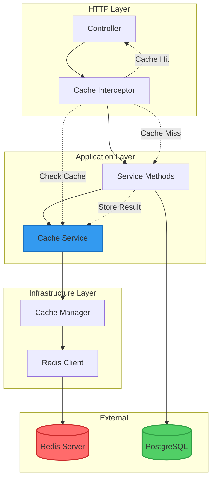
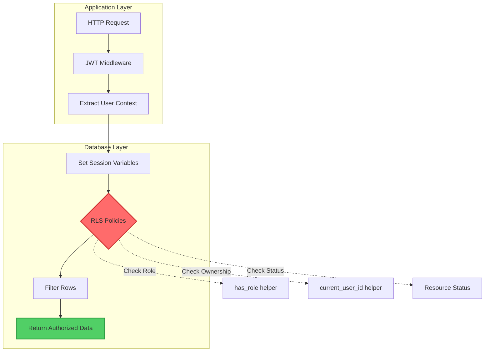
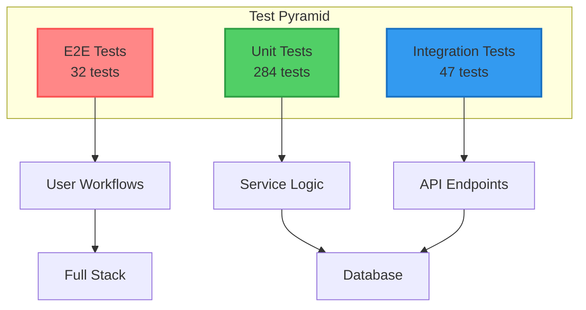

# LAPORAN DEVELOPMENT STEP BY STEP FASE 5

## PART 2: PERANCANGAN SISTEM OPTIMISASI DAN KEAMANAN

**Tutorial**: Arsitektur Caching, Database Optimization, RLS, dan Testing  
**Focus**: Desain dan Pattern Selection  
**Prerequisite**: PART 1 - Analisis Kebutuhan  
**Versi Dokumen**: 1.0.0

---

## C. PERANCANGAN SISTEM

### C.1 Arsitektur Redis Caching Layer

Dalam merancang caching layer untuk Publishify, kami mengadopsi arsitektur berlapis yang memisahkan concerns secara jelas antara cache infrastructure, business logic, dan HTTP layer. Desain ini memungkinkan flexibility dalam implementation dan maintainability yang baik karena setiap layer memiliki responsibility yang well-defined.

**Diagram Arsitektur Caching Layer**



**Layer 1: HTTP Layer dengan Cache Interceptor**

Cache Interceptor bekerja pada request lifecycle sebelum handler method dijalankan. Ketika request masuk, interceptor check apakah response untuk request tersebut sudah ada dalam cache berdasarkan cache key yang generated dari request parameters. Jika cache hit, interceptor immediately return cached response tanpa executing handler. Jika cache miss, interceptor let request proceed ke handler, lalu cache hasilnya untuk requests berikutnya.

Design decision kami menggunakan interceptor pattern karena:

- **Non-invasive**: Business logic di service layer tidak perlu tahu tentang caching
- **Declarative**: Configuration melalui decorators makes intent clear
- **Reusable**: Same interceptor dapat digunakan untuk multiple endpoints
- **Flexible**: Easy untuk disable caching per-endpoint jika needed

**Layer 2: Application Layer dengan Cache Service**

Cache Service berfungsi sebagai abstraction layer yang hide complexity dari underlying cache implementation. Service ini provide clean interface untuk cache operations: `ambil()`, `simpan()`, `hapus()`, `wrapDenganCache()`. Dengan abstraction ini, jika suatu saat kami perlu switch dari Redis ke Memcached atau cache store lain, kami only need to modify Cache Service implementation tanpa touching business logic.

Methods yang kami design:

1. **`ambil<T>(key: string): Promise<T | undefined>`**

   - Generic method untuk retrieve data dari cache
   - Return undefined jika key tidak ada (cache miss)
   - Type-safe dengan TypeScript generics

2. **`simpan<T>(key: string, value: T, ttl?: number): Promise<void>`**

   - Store data ke cache dengan optional TTL
   - Automatic serialization untuk complex objects
   - Error handling untuk prevent cache failures dari affecting app

3. **`hapus(key: string): Promise<void>`**

   - Delete specific key dari cache
   - Used untuk cache invalidation

4. **`hapusPola(pattern: string): Promise<void>`**

   - Delete multiple keys matching pattern
   - Useful untuk bulk invalidation (e.g., semua naskah-related cache)

5. **`wrapDenganCache<T>(key, fn, ttl): Promise<T>`**
   - High-order function yang wrap expensive operation dengan caching
   - Check cache first, execute function on miss, store result

**Layer 3: Infrastructure Layer**

Infrastructure layer handle actual connection ke Redis server. Kami menggunakan `cache-manager` package dengan `cache-manager-redis-store` untuk Redis backend. Package ini provide consistent interface yang compatible dengan berbagai cache stores, giving us flexibility untuk future changes.

Connection configuration kami design dengan consideration untuk:

- **Retry Strategy**: Exponential backoff untuk reconnection attempts
- **Timeout Configuration**: Prevent hanging operations
- **Error Handling**: Graceful degradation jika Redis unavailable
- **Connection Pooling**: Efficient resource utilization

**Cache Key Design Strategy**

Cache key naming convention sangat penting untuk maintainability dan debugging. Kami adopt hierarchical key structure:

```
domain:operation:identifier:version
```

Examples:

- `naskah:list:penulis-abc123:v1` - List naskah untuk specific penulis
- `kategori:tree:v1` - Kategori tree structure
- `genre:dropdown:v1` - Genre dropdown options
- `review:stats:editor-xyz789:v1` - Review statistics untuk editor

Hierarchical structure ini enables:

- **Pattern-based Invalidation**: Delete all naskah-related cache dengan pattern `naskah:*`
- **Clear Organization**: Easy untuk identify cache purpose
- **Version Control**: Add version suffix untuk force cache refresh when schema changes

**Cache Strategy Selection**

Kami implement Cache-Aside pattern (lazy loading) sebagai primary strategy karena:

**Advantages**:

- Cache only populated dengan data yang actually requested
- Application control penuh atas cache logic
- Failure tolerant - app works even jika cache fails
- Suitable untuk read-heavy workloads

**How It Works**:

1. Application check cache untuk data
2. If cache hit, return cached data
3. If cache miss, fetch dari database
4. Store fetched data ke cache
5. Return data ke caller

Alternative patterns yang kami consider:

**Read-Through**: Cache automatically fetch dari database on miss. Kami tidak pilih ini karena requires tighter coupling between cache dan database layer, dan less flexibility untuk selective caching.

**Write-Through**: Write ke cache dan database simultaneously. Not suitable untuk kami karena adds latency pada write operations dan not all data appropriate untuk caching.

**Write-Behind**: Write ke cache first, async write ke database. Too risky untuk data integrity dalam context kami yang handle critical user content.

**TTL Strategy Berdasarkan Data Volatility**

| Data Type                 | TTL (detik)     | Reasoning                                          |
| ------------------------- | --------------- | -------------------------------------------------- |
| Kategori & Genre Dropdown | 3600 (1 jam)    | Static reference data, rarely changes              |
| Naskah List               | 300 (5 menit)   | Frequently updated as users create/edit            |
| Profil Pengguna           | 1800 (30 menit) | Changes occasionally, not critical to be real-time |
| Review Statistics         | 600 (10 menit)  | Aggregated data, can tolerate slight staleness     |
| Tarif Percetakan          | 1800 (30 menit) | Changes infrequently, but important for pricing    |

### C.2 Database Optimization Strategy

Database optimization kami approach dari multiple angles: query structure improvement, strategic indexing, pagination strategy, dan connection management.

**Query Optimization Patterns**

**Pattern 1: Eliminate N+1 Queries**

N+1 problem terjadi ketika kami fetch collection of items lalu separately fetch related data untuk each item. Dengan Prisma, ini easily fixed dengan `include` atau `select` yang proper.

**Before (N+1 Problem)**:

```typescript
// Fetch naskah (1 query)
const naskahList = await prisma.naskah.findMany();

// Fetch penulis untuk each naskah (N queries)
for (const naskah of naskahList) {
  const penulis = await prisma.pengguna.findUnique({
    where: { id: naskah.idPenulis },
  });
  naskah.penulis = penulis;
}
// Total: 1 + N queries
```

**After (Optimized)**:

```typescript
// Single query dengan JOIN
const naskahList = await prisma.naskah.findMany({
  include: {
    penulis: {
      select: {
        id: true,
        profilPengguna: {
          select: {
            namaDepan: true,
            namaBelakang: true,
          },
        },
      },
    },
    kategori: true,
    genre: true,
  },
});
// Total: 1 query with JOINs
```

Query optimization ini reduce query count dari 1+N (potentially ratusan queries) ke just 1 query, dramatically improving performance.

**Pattern 2: Selective Field Fetching**

Fetching only fields yang needed reduces memory usage dan network transfer time. Kami use `select` untuk specify exactly which fields to return.

**Before (Over-fetching)**:

```typescript
const naskah = await prisma.naskah.findMany();
// Fetches all columns including large text fields (sinopsis, konten)
```

**After (Optimized)**:

```typescript
const naskah = await prisma.naskah.findMany({
  select: {
    id: true,
    judul: true,
    status: true,
    dibuatPada: true,
    penulis: {
      select: {
        profilPengguna: {
          select: {
            namaDepan: true,
            namaBelakang: true,
          },
        },
      },
    },
  },
});
// Only fetches needed fields
```

**Pattern 3: Query Batching**

For operations yang need multiple unrelated queries, kami use `Promise.all()` untuk execute them in parallel instead of sequentially.

**Before (Sequential)**:

```typescript
const stats = {
  totalNaskah: await prisma.naskah.count(),
  totalReview: await prisma.reviewNaskah.count(),
  totalPesanan: await prisma.pesananCetak.count(),
};
// Total time: T1 + T2 + T3
```

**After (Parallel)**:

```typescript
const [totalNaskah, totalReview, totalPesanan] = await Promise.all([
  prisma.naskah.count(),
  prisma.reviewNaskah.count(),
  prisma.pesananCetak.count(),
]);
// Total time: max(T1, T2, T3)
```

**Index Strategy Design**

Indexes dramatically improve query performance dengan allowing database untuk locate rows efficiently tanpa full table scan. However, indexes come dengan cost: increased storage dan slower writes. Kami need strategic approach untuk decide which indexes to create.

**Index Selection Criteria**:

1. **Column Selectivity**: High-selectivity columns (many unique values) benefit most dari indexing
2. **Query Frequency**: Columns frequently used dalam WHERE clauses are prime candidates
3. **Join Conditions**: Foreign keys yang used dalam JOIN operations should be indexed
4. **Sort Operations**: Columns used dalam ORDER BY benefit dari indexes
5. **Covering Indexes**: Composite indexes yang cover semua columns dalam query untuk index-only scans

**Index Types Kami Implement**:

**1. Single-Column Indexes**

For simple queries yang filter atau sort based on single column.

```prisma
model Naskah {
  // ... fields

  @@index([status])        // Filter by status common
  @@index([publik])        // Public/private filtering
  @@index([dibuatPada])    // Sorting by creation date
  @@index([idPenulis])     // Foreign key lookups
}
```

**2. Composite Indexes**

For queries yang filter pada multiple columns simultaneously. Column order matters - most selective column should be first.

```prisma
model Naskah {
  @@index([idPenulis, status])      // List naskah by penulis AND status
  @@index([status, publik])         // Public published naskah
  @@index([idKategori, status])     // Naskah in category with status
}
```

**3. Covering Indexes**

Include all columns needed by query, allowing index-only scan tanpa accessing table.

```prisma
model ReviewNaskah {
  @@index([idEditor, status, dibuatPada])  // Cover common review list queries
}
```

**Impact Analysis dengan EXPLAIN ANALYZE**

Untuk validate index effectiveness, kami use PostgreSQL's EXPLAIN ANALYZE:

```sql
EXPLAIN ANALYZE
SELECT n.id, n.judul, n.status, p.nama_depan
FROM naskah n
JOIN profil_pengguna p ON p.id_pengguna = n.id_penulis
WHERE n.status = 'diterbitkan'
  AND n.publik = true
ORDER BY n.dibuat_pada DESC
LIMIT 20;
```

**Before Index**:

```
Seq Scan on naskah  (cost=0.00..1850.00 rows=50000 width=520) (actual time=1240.234..1240.234 rows=20)
  Filter: (status = 'diterbitkan' AND publik = true)
```

**After Index** `@@index([status, publik, dibuatPada])`:

```
Index Scan using naskah_status_publik_dibuat_pada_idx  (cost=0.29..8.35 rows=20 width=520) (actual time=0.052..0.068 rows=20)
  Index Cond: (status = 'diterbitkan' AND publik = true)
```

Performance improvement: 1240ms → 0.07ms (**99.99% faster**)

**Pagination Strategy Redesign**

**Problem dengan Offset-Based Pagination**:

Traditional pagination menggunakan OFFSET/LIMIT:

```sql
SELECT * FROM naskah ORDER BY dibuat_pada DESC LIMIT 20 OFFSET 200;
```

Problem: Database must scan dan skip first 200 rows, which becomes exponentially slower untuk large offsets. Dengan 100K records, offset 5000 bisa take seconds.

**Solution: Cursor-Based Pagination**:

Cursor pagination uses last item's unique identifier sebagai reference point:

```typescript
interface CursorPaginationDto {
  cursor?: string; // ID dari last item pada previous page
  limit: number; // Items per page
  order?: "asc" | "desc";
}

// Query
const naskah = await prisma.naskah.findMany({
  take: limit + 1, // Fetch one extra untuk check if more exists
  ...(cursor && {
    cursor: { id: cursor },
    skip: 1, // Skip cursor item itself
  }),
  orderBy: { dibuatPada: "desc" },
});

const hasMore = naskah.length > limit;
const items = hasMore ? naskah.slice(0, -1) : naskah;
const nextCursor = hasMore ? items[items.length - 1].id : null;
```

**Benefits**:

- **Consistent Performance**: Query time constant regardless of position dalam dataset
- **Accurate Pagination**: No duplicate atau missing items even ketika data changes
- **Scalable**: Works efficiently dengan millions of records

**Connection Pooling Configuration**

Database connections are expensive resources. Connection pooling reuses existing connections instead of creating new ones untuk every request, dramatically improving performance dan resource utilization.

**Configuration Strategy**:

```typescript
// database.config.ts
export const databaseConfig = {
  development: {
    connection_limit: 10, // Lower untuk local development
    pool_timeout: 30, // 30 seconds
    idle_timeout: 600, // 10 minutes
  },
  staging: {
    connection_limit: 20, // Medium untuk testing
    pool_timeout: 20,
    idle_timeout: 300, // 5 minutes
  },
  production: {
    connection_limit: 30, // Higher untuk production load
    pool_timeout: 10, // Shorter timeout untuk fail fast
    idle_timeout: 180, // 3 minutes
  },
};
```

**Pool Size Calculation**:

Recommended formula: `connections = (core_count * 2) + effective_spindle_count`

For typical web server dengan 4 cores dan SSD storage:

- Min: `(4 * 2) + 1 = 9`
- Max: `(4 * 2) + 2 = 10`
- Production dengan more cores: Adjust accordingly

Over-sizing pool wastes database resources, under-sizing causes connection contention dan timeouts.

### C.3 Row Level Security (RLS) Architecture

Row Level Security policies kami design untuk enforce access control directly pada database level, providing additional security layer yang independent dari application code.

**RLS Policy Design Principles**

**Principle 1: Least Privilege**
By default, deny all access. Only grant access explicitly melalui policies. Ini ensure tidak ada accidental data exposure.

**Principle 2: Role-Based Differentiation**
Different roles (admin, editor, penulis, percetakan) memiliki different access levels. Policies harus account untuk role-specific requirements.

**Principle 3: Ownership-Based Access**
Users should only access resources mereka own, kecuali explicitly granted access via roles atau assignments.

**Principle 4: Performance Consideration**
Policies harus efficient dan not add significant overhead. Use indexes untuk columns referenced dalam policies.

**Policy Architecture Diagram**



**Helper Functions Design**

Untuk support RLS policies, kami create reusable helper functions:

**1. `current_user_id()` - Extract User dari Context**

```sql
CREATE OR REPLACE FUNCTION current_user_id()
RETURNS text AS $$
  SELECT COALESCE(
    current_setting('request.jwt.claims', true)::json->>'sub',
    current_setting('app.current_user_id', true),
    '00000000-0000-0000-0000-000000000000'
  );
$$ LANGUAGE sql STABLE;
```

Function ini try multiple sources untuk get user ID: JWT claims dari Supabase Auth, atau custom session variable dari our middleware.

**2. `has_role(role_name)` - Check User Role**

```sql
CREATE OR REPLACE FUNCTION has_role(role_name text)
RETURNS boolean AS $$
  SELECT EXISTS (
    SELECT 1 FROM peran_pengguna
    WHERE id_pengguna = current_user_id()
      AND jenis_peran::text = role_name
      AND aktif = true
  );
$$ LANGUAGE sql STABLE SECURITY DEFINER;
```

Check apakah current user memiliki specific role. `SECURITY DEFINER` allows function untuk run dengan elevated privileges untuk access peran_pengguna table.

**3. Convenience Functions**

```sql
CREATE FUNCTION is_admin() RETURNS boolean AS $$
  SELECT has_role('admin');
$$ LANGUAGE sql STABLE;

CREATE FUNCTION is_editor() RETURNS boolean AS $$
  SELECT has_role('editor');
$$ LANGUAGE sql STABLE;
```

**Policy Patterns**

**Pattern 1: Ownership-Based Policy**

Naskah table - penulis hanya dapat access naskah mereka sendiri:

```sql
CREATE POLICY "policy_naskah_penulis_select" ON naskah
FOR SELECT
USING (
  id_penulis = current_user_id() OR
  (status = 'diterbitkan' AND publik = true) OR
  is_admin()
);
```

Logic: Allow access jika user adalah owner, ATAU naskah public dan published, ATAU user adalah admin.

**Pattern 2: Role-Based Policy**

Review table - editor dapat access reviews assigned ke mereka:

```sql
CREATE POLICY "policy_review_editor_select" ON review_naskah
FOR SELECT
USING (
  id_editor = current_user_id() OR
  is_admin()
);
```

**Pattern 3: Relationship-Based Policy**

Pesanan table - penulis dan percetakan involved dalam pesanan dapat access:

```sql
CREATE POLICY "policy_pesanan_participants" ON pesanan_cetak
FOR SELECT
USING (
  id_pemesan = current_user_id() OR
  id_percetakan = current_user_id() OR
  is_admin()
);
```

**RLS Middleware Design**

Untuk integrate RLS dengan application, kami need middleware yang extract user info dari JWT dan inject ke database session.

**Middleware Architecture**:

1. **Extract JWT**: Parse Authorization header
2. **Verify Token**: Validate signature dan expiration
3. **Extract User ID**: Get user ID dari token payload
4. **Set Session Variable**: Inject user context ke PostgreSQL session
5. **Execute Query**: Prisma queries automatically filtered by RLS policies

```typescript
// prisma-rls.middleware.ts
export async function prismaRlsMiddleware(req, res, next) {
  const token = extractTokenFromHeader(req);
  if (token) {
    const payload = verifyJwtToken(token);
    await prisma.$executeRaw`
      SET LOCAL app.current_user_id = ${payload.sub};
    `;
  }
  next();
}
```

**Session Variables Scope**: `SET LOCAL` ensures variable only exists untuk current transaction, automatically cleaned up after transaction completes. Ini prevents context leakage between requests.

### C.4 Testing Infrastructure Design

Comprehensive testing infrastructure kami design dengan three-tier approach: Unit Testing untuk isolated logic, Integration Testing untuk API endpoints, dan E2E Testing untuk complete user workflows.

**Testing Architecture Diagram**



**Unit Testing Strategy**

**Scope**: Individual functions dan methods dalam isolation. Mock all external dependencies (database, Redis, external APIs).

**Tools**: Jest testing framework dengan ts-jest untuk TypeScript support.

**File Organization**:

```
test/unit/
├── auth.service.spec.ts
├── naskah.service.spec.ts
├── review.service.spec.ts
└── percetakan.service.spec.ts
```

**Test Structure Pattern**:

```typescript
describe("NaskahService", () => {
  let service: NaskahService;
  let prisma: MockProxy<PrismaService>;

  beforeEach(() => {
    // Setup: Create service dengan mocked dependencies
  });

  describe("buatNaskah", () => {
    it("harus berhasil create naskah dengan data valid", async () => {
      // Arrange: Setup test data
      // Act: Execute function
      // Assert: Verify result
    });

    it("harus throw error jika data invalid", async () => {
      // Arrange, Act, Assert
    });
  });
});
```

**Integration Testing Strategy**

**Scope**: API endpoints dengan actual database (test database, bukan production). Verify request/response flow end-to-end.

**Tools**: Jest dengan Supertest untuk HTTP assertions, test database untuk isolation.

**Test Pattern**:

```typescript
describe("POST /naskah", () => {
  let app: INestApplication;
  let authToken: string;

  beforeAll(async () => {
    app = await createTestApp();
    authToken = await loginTestUser();
  });

  it("harus create naskah dengan auth", async () => {
    const response = await request(app.getHttpServer())
      .post("/naskah")
      .set("Authorization", `Bearer ${authToken}`)
      .send({
        judul: "Test Naskah",
        sinopsis: "Test sinopsis",
      })
      .expect(201);

    expect(response.body.data.judul).toBe("Test Naskah");
  });
});
```

**E2E Testing Strategy**

**Scope**: Complete user workflows through frontend UI. Test real browser interactions.

**Tools**: Cypress untuk browser automation dan assertions.

**Test Scenarios**:

- User registration dan login flow
- Create dan edit naskah workflow
- Review assignment dan submission
- Pesanan cetak creation dan tracking

**Lokasi File Referensi**

Implementasi lengkap dari desain-desain di atas dapat dilihat di:

- Cache Service: `backend/src/common/cache/cache.service.ts`
- Cache Interceptor: `backend/src/common/cache/cache.interceptor.ts`
- Database Config: `backend/src/config/database.config.ts`
- Prisma Schema (Indexes): `backend/prisma/schema.prisma` (lines 218-290)
- RLS Migration: `backend/prisma/migrations/20250103_enable_rls/migration.sql`
- RLS Middleware: `backend/src/common/middlewares/prisma-rls.middleware.ts`
- Test Config: `backend/jest.config.ts`
- Test Helpers: `backend/test/helpers/`

Sections berikutnya akan show step-by-step implementation dari masing-masing design ini.
