# LAPORAN DEVELOPMENT STEP BY STEP FASE 6

## PART 2: PERANCANGAN SISTEM

**Tutorial**: System Design untuk Frontend & Deployment  
**Focus**: Architecture & Design Decisions  
**Prerequisite**: [PART 1 - Pendahuluan & Analisis](./LAPORAN-DEVELOPMENT-STEP-BY-STEP-FASE-6-PART-1-PENDAHULUAN-ANALISIS.md)  
**Versi Dokumen**: 1.0.0

---

## C. PERANCANGAN SISTEM

### C.1 Perancangan Frontend Optimization Architecture

Frontend optimization architecture design dengan focus pada balance antara performance improvement dan implementation complexity. Design decisions harus consider maintenance overhead, browser compatibility, dan user experience impact.

#### C.1.1 Image Optimization Strategy Design

Image optimization strategy designed around Next.js Image component sebagai core technology karena provide automatic optimization features dengan minimal configuration effort.

**Format Selection Strategy**: Kami design automatic format selection yang serve modern formats seperti WebP untuk browsers yang support dengan automatic fallback ke JPEG untuk older browsers. Strategy ini tidak require manual format conversion atau multiple image storage karena Next.js handle conversion on-the-fly during first request dan cache hasil. Design decision ini balance optimal file size dengan compatibility, ensuring all users receive appropriate format untuk their browser capabilities tanpa developer intervention.

**Responsive Image Strategy**: Design include three primary breakpoints aligned dengan common device sizes: mobile (640px width), tablet (1024px width), dan desktop (1920px width). Next.js Image component automatically generate images dalam multiple sizes dan serve appropriate size based pada actual viewport width melalui srcset HTML attribute. Browser automatically select optimal size, eliminating waste dari serving oversized images ke mobile devices. Additional smaller sizes (16px, 32px, 64px) defined untuk icon-sized images seperti user avatars dan category thumbnails.

**Loading Strategy Design**: Kami design three-tier loading priority system untuk optimize perceived performance. Critical above-the-fold images marked dengan priority prop untuk eager loading tanpa lazy loading, ensuring immediate visibility. Below-the-fold images use lazy loading dengan Intersection Observer untuk defer loading until user scrolls near image position. Background images dan decorative elements load dengan lowest priority setelah critical content fully loaded. Design ini ensure users see important content quickly while still benefiting dari full visual experience once page fully loaded.

**Blur Placeholder Strategy**: Untuk improve perceived performance during image loading, design include blur placeholder implementation. Small low-quality image previews (typically under 1KB) embedded dalam HTML provide instant visual feedback while full-quality image loading. Blur effect applied untuk smooth transition dari placeholder ke actual image. Implementation use base64-encoded thumbnail atau solid color extracted dari image, both generated during build time untuk zero runtime overhead.

**Architecture Diagram**:

#### C.1.2 Code Splitting Architecture Design

Code splitting architecture designed untuk minimize initial JavaScript bundle size dengan strategic separation based on usage patterns dan dependencies.

**Route-Based Splitting Design**: Primary splitting strategy adalah route-based dimana each page route receive separate JavaScript bundle. Next.js automatically implement ini through file-based routing system. Design ensure users only download JavaScript needed untuk current page rather than entire application code. Navigation ke new pages trigger additional bundle download, but dengan proper caching headers, subsequent visits load instantly dari browser cache. Trade-off acceptable karena most users tidak navigate entire site dalam single session.

**Component-Level Dynamic Import Design**: Large components yang not immediately needed marked untuk dynamic import dengan React.lazy(). Examples include rich text editor (TipTap) loading only when user actually opens editor, chart libraries loading only untuk dashboard pages, PDF viewer loading only untuk preview functionality, dan modals loading only when triggered. Design use Suspense boundaries dengan appropriate fallback UI untuk maintain layout stability during component loading. Decision criteria adalah component size (>50KB) dan usage frequency (not needed untuk every user).

**Third-Party Library Chunking Design**: External dependencies chunked strategically untuk optimal caching dan loading. Design separate framework code (React, Next.js) into vendor chunk yang rarely changes, UI library (Radix UI, Lucide) into separate chunk, form handling libraries (React Hook Form, Zod) into forms chunk, dan utility libraries (date-fns, axios) into utils chunk. Chunking strategy balance between number dari chunks (too many hurt HTTP/2 multiplexing) dan chunk sizes (too large hurt caching).

**Commons Chunk Design**: Shared code used across multiple pages extracted into commons chunk untuk avoid duplication. Design analyze dependency graph untuk identify components dan utilities used dalam multiple entry points. Threshold set at three atau more entry points untuk justify commons chunk extraction. This balance between eliminating duplication dan avoiding downloading unnecessary code untuk pages yang don't need it.

**Bundle Visualization Strategy**:

#### C.1.3 SEO Optimization Architecture

SEO architecture designed untuk maximize search engine visibility melalui proper meta tags, structured data, dan technical SEO implementation.

**Meta Tags Strategy Design**: Dynamic meta tags generation designed dengan hierarchy approach. Page-specific meta tags (title, description, keywords) generated dari page content atau database untuk relevance. Fallback ke site-wide defaults jika page-specific data not available. OpenGraph tags include untuk social media sharing dengan proper image, title, dan description. Twitter Card tags for Twitter-specific optimization. Canonical URLs specified untuk prevent duplicate content issues dari URL variations.

**Structured Data Design**: JSON-LD structured data implementation untuk help search engines understand content semantics. Design include multiple schema types: Book schema untuk naskah dengan properties like author, genre, ISBN, publication date; Person schema untuk author profiles dengan properties like name, description, works; Organization schema untuk Publishify dengan properties like logo, contact information, social profiles; BreadcrumbList schema untuk navigation trails. Structured data dynamically generated based pada page content untuk accuracy.

**Sitemap Generation Strategy**: Automatic sitemap generation designed dengan priority dan change frequency hints. High-priority pages (homepage, popular naskah, active authors) marked dengan priority 1.0 dan daily change frequency. Medium-priority pages (category listings, genre pages) marked dengan priority 0.7 dan weekly change frequency. Low-priority pages (older naskah, inactive authors) marked dengan priority 0.5 dan monthly change frequency. Sitemap automatically updated when content changes through database triggers atau scheduled jobs, ensuring search engines have current information.

**Technical SEO Design**: Performance optimization contribute directly ke SEO through Core Web Vitals becoming ranking factors. Mobile-first design ensure mobile-friendly classification. Semantic HTML dengan proper heading hierarchy (h1, h2, h3) help search engines understand content structure. Accessible markup dengan ARIA labels improve crawlability. Robots.txt configured untuk guide crawlers toward important content dan away dari admin pages atau API endpoints.

### C.2 Perancangan Docker Containerization

Docker containerization design untuk ensure consistent deployment across environments dengan optimal image sizes dan security.

#### C.2.1 Multi-Stage Build Design

Multi-stage Dockerfile design untuk minimize final image size dengan separating build dependencies dari runtime dependencies.

**Backend Multi-Stage Design**:

- **Stage 1 (Builder)**: Base image Node.js untuk run build process. Install all dependencies including devDependencies needed untuk TypeScript compilation. Copy source code dan run build command untuk compile TypeScript ke JavaScript. Result adalah dist/ directory dengan compiled code.
- **Stage 2 (Runtime)**: Base image Node.js slim variant untuk smaller size. Copy only production dependencies dari package.json tanpa devDependencies. Copy compiled code dari builder stage. Set non-root user untuk security. Define health check endpoint. Result adalah minimal image dengan only what needed untuk run application.

Benefits dari multi-stage approach adalah final image size reduction (typically 40-60% smaller), faster image pulls dan container starts, reduced attack surface dengan fewer dependencies, dan better caching dari separating build dan runtime layers.

**Frontend Multi-Stage Design**:

- **Stage 1 (Dependencies)**: Install dependencies dengan bun install. Leverage layer caching dengan copying package.json dan bun.lockb first, then running install, ensuring dependencies only reinstall when lock file changes.
- **Stage 2 (Builder)**: Copy source code dan run Next.js build dengan standalone output mode. Standalone build include minimal dependencies needed untuk run, reducing size significantly compared to full node_modules.
- **Stage 3 (Runtime)**: Copy standalone build artifacts dan public assets. Configure environment variable handling untuk runtime configuration. Expose port dan define startup command. Result adalah optimized image typically under 500MB.

**Multi-Stage Architecture**:

#### C.2.2 Container Security Design

Security design incorporate multiple layers untuk protect containerized applications.

**Non-Root User Design**: Containers configured untuk run dengan non-root user untuk limit damage potential jika container compromised. Design create dedicated user dengan minimal permissions within container, set ownership dari application files ke this user, dan configure Docker untuk run container process dengan this user identity. Benefits include limited file system access jika compromised, compliance dengan security best practices, dan defense-in-depth security approach.

**Secrets Management Design**: Sensitive configuration like database passwords, API keys, dan encryption keys handled dengan environment variables injected at container runtime rather than baked into images. Design use Docker secrets atau environment variable injection dari orchestration platform. Images never contain hardcoded secrets, ensuring safe sharing dan storage dalam registries. Build arguments used only untuk non-sensitive build-time configuration.

**Health Check Design**: Health check endpoints designed untuk monitor container health dan enable automatic recovery. Design include HTTP endpoint returning 200 status untuk healthy container, database connectivity check ensuring backend can reach database, cache connectivity check ensuring Redis accessible, dan graceful degradation reporting unhealthy status jika dependencies unavailable but container still running. Health checks configured dengan appropriate interval (30 seconds), timeout (5 seconds), dan retries (3 attempts) untuk balance between quick detection dan avoiding false positives.

**Image Scanning Design**: Automated vulnerability scanning integrated into CI/CD pipeline untuk detect known vulnerabilities dalam base images dan dependencies. Design use tools like Trivy atau Snyk untuk scan images, fail builds jika critical vulnerabilities detected, generate reports untuk identified vulnerabilities, dan trigger notifications untuk security team. Scanning run during build process dan scheduled periodic scans untuk deployed images.

#### C.2.3 Docker Compose Orchestration Design

Docker Compose design untuk orchestrate multi-container application dengan proper networking, volumes, dan dependencies.

**Service Definitions**: Compose file define all services needed untuk complete stack:

- **Backend Service**: Build dari Dockerfile.backend, expose port 3000, mount volumes untuk uploads dan logs, depend on database dan Redis services, configure environment variables untuk database connection dan Redis URL.
- **Frontend Service**: Build dari Dockerfile.frontend, expose port 80, mount volume untuk static assets, depend on backend service untuk API calls, configure environment variables untuk API endpoint.
- **Database Service**: Use official PostgreSQL image, configure persistent volume untuk data storage, set initial database dan user credentials, expose port for local development access.
- **Redis Service**: Use official Redis image, configure persistent volume untuk data, set memory limit untuk prevent resource exhaustion, expose port untuk local development.

**Network Design**: Services communicate melalui Docker network dengan service discovery via service names. Backend reference database dengan hostname "db" rather than IP address, ensuring connection works regardless dari IP assignment. Network isolation ensure external access only through exposed ports, protecting internal services dari direct access.

**Volume Strategy**: Persistent data stored dalam Docker volumes rather than container filesystem. Database data volume ensure data persists across container restarts. Upload files volume ensure user-uploaded content retained. Logs volume facilitate centralized log collection. Volume strategy balance between persistence dan portability, dengan consideration untuk backup procedures.

**Docker Compose Architecture**:

```mermaid
graph TB
    subgraph Docker Compose Stack
        A[Frontend Container<br/>Next.js] --> B[Backend Container<br/>NestJS]
        B --> C[PostgreSQL Container<br/>Database]
        B --> D[Redis Container<br/>Cache]

        E[Volume: DB Data] -.->|Persist| C
        F[Volume: Uploads] -.->|Persist| B
        G[Volume: Redis Data] -.->|Persist| D
    end

    H[External Access<br/>Port 80] --> A

    style A fill:#61dafb
    style B fill:#e0234e
    style C fill:#336791
    style D fill:#dc382d
```

### C.3 Perancangan CI/CD Pipeline

CI/CD pipeline design untuk automate testing, building, dan deployment dengan proper stage gates dan rollback capabilities.

#### C.3.1 Pipeline Stages Design

Pipeline structured sebagai sequential stages dengan clear responsibilities dan failure handling.

**Stage 1: Code Quality Checks**  
First stage run fast checks untuk provide immediate feedback. ESLint run untuk catch code style violations dan potential bugs. TypeScript compilation check ensure type safety. Prettier check ensure consistent formatting. Duration typically under 2 minutes. Failure block further pipeline execution karena quality issues must be addressed first.

**Stage 2: Automated Testing**  
Testing stage run comprehensive test suite untuk catch regressions. Unit tests run parallel across multiple runners untuk speed. Integration tests run sequentially karena require database state. E2E tests run dengan Cypress untuk validate critical user journeys. Test results aggregated dan reported. Coverage metrics calculated dan compared against thresholds. Duration typically 5-8 minutes. Failure indicate functionality regression requiring code fix.

**Stage 3: Build & Package**  
Build stage compile applications dan create Docker images. Backend build compile TypeScript to JavaScript. Frontend build generate optimized production bundle. Docker images built dengan multi-stage Dockerfiles. Images tagged dengan git commit SHA dan semantic version. Duration typically 3-5 minutes. Failure indicate build configuration issues.

**Stage 4: Image Security Scan**  
Security scanning stage detect vulnerabilities dalam built images. Trivy atau similar tools scan for known CVEs. Critical vulnerabilities fail pipeline dan block deployment. Medium dan low severity vulnerabilities logged for review but tidak block. Scan results uploaded untuk security tracking. Duration typically 2-3 minutes.

**Stage 5: Staging Deployment**  
Staging deployment stage deploy ke staging environment untuk validation dalam production-like environment. Deploy latest images ke staging cluster. Run database migrations if needed. Execute smoke tests untuk verify basic functionality. Duration typically 3-4 minutes. Failure indicate deployment process issues atau environment configuration problems.

**Stage 6: Production Deployment**  
Production deployment stage require manual approval untuk control over production changes. Deploy dengan rolling update strategy untuk zero downtime. Health checks verify deployment success. Automatic rollback trigger jika health checks fail. Send deployment notifications ke team. Duration typically 4-5 minutes. Failure trigger automatic rollback dan alerts.

**Pipeline Flow Diagram**:

#### C.3.2 Deployment Strategy Design

Deployment strategy designed untuk minimize downtime dan risk dengan proper rollout dan rollback mechanisms.

**Rolling Update Strategy**: Production deployment use rolling update approach dimana new version gradually replace old version. Strategy deploy new containers alongside existing containers, wait untuk health checks to pass, gradually shift traffic ke new containers, dan finally terminate old containers. Benefits include zero downtime karena traffic always served by healthy containers, gradual rollout reduce blast radius jika issues occur, dan easy rollback dengan simply increasing old version containers if needed.

**Health Check Strategy**: Health checks validate deployment success before declaring deployment complete. Checks include HTTP endpoint returning 200 status, database connectivity check, cache connectivity check, dan application-specific readiness checks. Failed health checks trigger automatic rollback. Strategy prevent deploying broken versions ke production.

**Rollback Strategy**: Automatic rollback mechanism trigger when deployment issues detected. Triggers include failed health checks, error rate spike above threshold, response time degradation beyond threshold, dan manual rollback trigger dari operations team. Rollback process quickly restore previous version dengan same rolling update mechanism. Previous container images retained dalam registry untuk quick rollback availability.

**Deployment Monitoring**: Active monitoring during deployment detect issues early. Metrics tracked include error rate compared ke pre-deployment baseline, response time P95 percentile, health check success rate, dan resource utilization. Anomalies trigger alerts dan potentially automatic rollback. Monitoring continue elevated frequency for 30 minutes post-deployment untuk catch delayed issues.

### C.4 Perancangan Monitoring & Alerting

Monitoring dan alerting infrastructure designed untuk provide comprehensive visibility dan proactive issue detection.

#### C.4.1 Metrics Collection Architecture

Metrics collection architecture designed around Prometheus sebagai central time-series database dengan multiple exporters feeding data.

**Application Metrics Design**: Custom application metrics exposed via `/metrics` endpoint dalam Prometheus format. Metrics include request rate (counter of total requests labeled by endpoint, method, status), response time (histogram of request duration untuk accurate percentile calculation), error rate (counter of errors labeled by type dan endpoint), active connections (gauge of current concurrent requests), dan business metrics (counters untuk user registrations, naskah submissions, orders placed). Metrics updated dalam real-time dengan minimal performance overhead.

**System Metrics Design**: Node exporter deployed pada each host untuk collect system-level metrics. Metrics include CPU utilization per core, memory usage (used, cached, available), disk I/O operations dan throughput, network bytes sent dan received, dan system load averages. Metrics scraped every 15 seconds untuk timely detection dari resource issues.

**Database Metrics Design**: PostgreSQL exporter collect database-specific metrics. Metrics include query execution time, connection pool utilization, cache hit ratio, transaction rate, table sizes, dan slow query counts. Metrics help identify database performance issues dan capacity planning needs.

**Cache Metrics Design**: Redis exporter collect cache-specific metrics. Metrics include hit rate percentage, eviction count, memory usage, connected clients, dan operation latency. Metrics essential untuk ensure caching effectiveness dan identify when cache under pressure.

**Metrics Collection Flow**:

#### C.4.2 Dashboard Design Strategy

Grafana dashboards designed dengan progressive detail approach, starting dari high-level overview dan drilling down ke specific details.

**System Overview Dashboard**: Primary dashboard provide at-a-glance view dari overall system health. Panels include service status indicators (green/red), request rate trend graph (last 6 hours), error rate graph with threshold lines, response time percentiles (P50, P90, P95, P99), resource utilization gauges (CPU, memory, disk), dan recent alerts list. Design prioritize most actionable information untuk quick decision making.

**Application Performance Dashboard**: Detailed dashboard for application-specific metrics. Panels include per-endpoint request rates, per-endpoint response times, error breakdown by type, slow query list, cache hit rate trends, dan database connection pool utilization. Dashboard enable developers identify performance bottlenecks quickly.

**Business Metrics Dashboard**: Dashboard tracking business KPIs. Panels include user registration rate, naskah submission rate, order conversion rate, revenue trends, active user counts, dan popular categories. Dashboard provide product dan business teams visibility into system usage patterns.

**Infrastructure Dashboard**: Dashboard monitoring infrastructure health. Panels include server resource utilization, container resource usage, network throughput, disk space trends, dan service availability. Dashboard help operations team ensure infrastructure adequacy dan plan capacity.

#### C.4.3 Alerting Strategy Design

Alerting strategy designed untuk notify team about issues requiring attention tanpa overwhelming dengan false positives.

**Alert Severity Levels**: Three severity levels dengan different response requirements:

- **Critical**: Immediate attention required, page on-call engineer. Examples include service down, error rate >10%, P95 response time >5 seconds.
- **Warning**: Attention needed soon, send Slack notification. Examples include error rate >5%, P95 response time >2 seconds, disk space >80%.
- **Info**: Awareness notifications, email notification. Examples include deployment completed, backup completed, weekly summary.

**Alert Rules Design**: Alerts configured dengan appropriate thresholds dan evaluation periods. Rules include comparison against static thresholds (error rate >5%), comparison against historical baselines (50% increase compared to last hour), rate of change detection (sudden spike in request rate), dan compound conditions (high error rate AND high response time). Evaluation periods balance between quick detection dan avoiding false positives dari transient issues.

**Alert Routing Design**: Alerts routed to appropriate channels based pada severity dan team responsibility. Critical alerts page on-call engineer via PagerDuty, warning alerts sent to Slack #alerts channel, info notifications sent via email digest. Alert routing ensure right people notified dengan appropriate urgency.

**Alert Suppression Design**: Suppression rules prevent notification fatigue dari redundant alerts. Suppression include grouping related alerts (multiple endpoints failing grouped as service-wide issue), silencing alerts during maintenance windows, rate limiting duplicate alerts (same alert fire only once per hour), dan dependency-based suppression (database down alert suppress downstream alerts). Suppression ensure team can focus pada root causes rather than symptoms.

---

**Lokasi File Implementation Reference:**

Perancangan ini akan di-implementasikan dalam files:

- Frontend Optimization: `frontend/next.config.ts`, `frontend/app/layout.tsx`
- Docker: `docker/Dockerfile.backend`, `docker/Dockerfile.frontend`, `docker-compose.yml`
- CI/CD: `.github/workflows/ci-cd.yml`
- Monitoring: `monitoring/prometheus.yml`, `monitoring/grafana/dashboards/`

**Total Word Count Part 2**: ~3,500 kata

---

**Navigation**: [← PART 1](./LAPORAN-DEVELOPMENT-STEP-BY-STEP-FASE-6-PART-1-PENDAHULUAN-ANALISIS.md) | [PART 3: Implementasi →](./LAPORAN-DEVELOPMENT-STEP-BY-STEP-FASE-6-PART-3-IMPLEMENTASI-FRONTEND-DOCKER.md)
