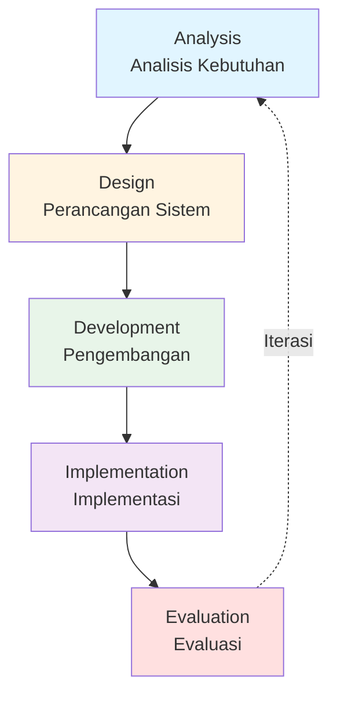

# LAPORAN PROGRESS PENGEMBANGAN SISTEM PUBLISHIFY

# FASE 1: FONDASI DAN INFRASTRUKTUR INTI

**Periode Pelaksanaan**: Minggu 1-2 (14 hari kerja)  
**Tanggal Laporan**: 31 Desember 2025  
**Tim Pengembang**: Tim Publishify  
**Metode Pengembangan**: ADDIE (Analysis, Design, Development, Implementation, Evaluation)

---

## A. PENDAHULUAN

### A.1 Latar Belakang

Industri penerbitan di Indonesia menghadapi tantangan signifikan dalam hal aksesibilitas dan efisiensi proses penerbitan naskah. Penulis pemula seringkali kesulitan untuk menerbitkan karyanya karena terbatasnya akses ke penerbit konvensional, prosedur yang rumit, serta biaya yang tinggi. Di sisi lain, penerbit juga mengalami kesulitan dalam mengelola alur kerja editorial yang melibatkan banyak pihak, mulai dari penerimaan naskah, proses review, hingga produksi dan distribusi.

Merespons permasalahan tersebut, kami mengembangkan **Publishify**, sebuah sistem penerbitan naskah digital yang komprehensif. Publishify dirancang untuk menjembatani kesenjangan antara penulis, editor, percetakan, dan pembaca melalui platform terpadu yang mengotomasi dan mempermudah seluruh alur kerja penerbitan. Sistem ini tidak hanya memfasilitasi proses penulisan dan pengajuan naskah, tetapi juga mencakup sistem review editorial, manajemen percetakan, pelacakan pengiriman, hingga analitik kinerja buku.

Pengembangan Publishify mengadopsi pendekatan bertahap dan sistematis, dibagi menjadi lima fase pengembangan yang saling terkait. Laporan ini secara khusus mendokumentasikan kemajuan pada **Fase 1: Fondasi dan Infrastruktur Inti**, yang merupakan tahap fundamental dalam membangun fondasi teknis yang solid untuk keseluruhan sistem. Fase ini mencakup inisialisasi proyek, perancangan arsitektur sistem, pembangunan skema basis data, implementasi sistem autentikasi dasar, serta pengaturan lingkungan pengembangan yang terstandarisasi.

### A.2 Tujuan Pengembangan Fase 1

Fase pertama pengembangan Publishify memiliki beberapa tujuan utama yang menjadi landasan bagi fase-fase berikutnya:

**Tujuan Utama:**

1. **Membangun Fondasi Teknis yang Kokoh**: Menetapkan arsitektur sistem yang scalable, maintainable, dan mengikuti best practices industri perangkat lunak modern.

2. **Merancang Skema Basis Data Komprehensif**: Menciptakan struktur basis data yang dapat mengakomodasi seluruh kebutuhan fungsional sistem, mulai dari manajemen pengguna hingga tracking produksi percetakan.

3. **Mengimplementasikan Sistem Keamanan Berlapis**: Membangun mekanisme autentikasi dan otorisasi yang robust dengan dukungan JSON Web Token (JWT) dan integrasi OAuth untuk multiple providers.

4. **Menyiapkan Infrastruktur Pengembangan**: Mengkonfigurasi lingkungan pengembangan, tools pendukung, dan standar kode yang akan digunakan sepanjang siklus pengembangan.

5. **Menetapkan Standar Dokumentasi**: Memulai praktik dokumentasi yang baik sebagai bagian integral dari proses pengembangan.

**Tujuan Spesifik:**

- Inisialisasi struktur monorepo dengan pemisahan yang jelas antara backend dan frontend
- Instalasi dan konfigurasi stack teknologi yang telah ditentukan
- Pembuatan 28 tabel basis data dengan relasi yang tepat
- Implementasi sistem autentikasi dengan JWT dan refresh token
- Integrasi OAuth Google untuk kemudahan akses pengguna
- Pengaturan dokumentasi API otomatis menggunakan Swagger
- Konfigurasi caching layer dengan Redis untuk optimasi performa
- Setup continuous integration dan version control

### A.3 Metodologi Pengembangan: ADDIE

Kami mengadopsi metodologi **ADDIE** (Analysis, Design, Development, Implementation, Evaluation) sebagai kerangka kerja pengembangan sistem. ADDIE dipilih karena pendekatan sistematisnya yang sesuai dengan kompleksitas Publishify dan kebutuhan untuk memastikan kualitas di setiap tahap pengembangan.

**Penjelasan Fase ADDIE dalam Konteks Fase 1:**

**1. Analysis (Analisis):**  
Pada tahap ini, kami melakukan analisis mendalam terhadap kebutuhan sistem, studi kelayakan teknologi, dan identifikasi stakeholder. Analisis mencakup riset stack teknologi yang paling sesuai, evaluasi alternatif arsitektur, serta pemetaan kebutuhan fungsional dan non-fungsional. Kami juga menganalisis best practices industri dalam pengembangan sistem penerbitan digital.

**2. Design (Perancangan):**  
Berdasarkan hasil analisis, kami merancang arsitektur sistem secara detail. Ini meliputi desain skema basis data dengan 28 tabel yang terorganisir dalam 7 domain, perancangan API endpoints dengan RESTful principles, desain pola autentikasi dan otorisasi, serta perancangan struktur folder yang modular. Kami juga membuat Entity Relationship Diagram (ERD) untuk visualisasi hubungan antar entitas.

**3. Development (Pengembangan):**  
Fase pengembangan melibatkan implementasi aktual dari desain yang telah dibuat. Kami membangun backend menggunakan NestJS dengan TypeScript, frontend menggunakan Next.js, konfigurasi Prisma ORM untuk akses database, implementasi JWT authentication, integrasi Redis untuk caching, serta setup berbagai middleware dan interceptors. Pengembangan dilakukan secara iteratif dengan frequent commits ke version control.

**4. Implementation (Implementasi):**  
Pada tahap ini, komponen-komponen yang telah dikembangkan diintegrasikan menjadi sistem yang utuh. Kami melakukan deployment ke environment development, konfigurasi environment variables, testing integrasi antar modul, serta dokumentasi penggunaan. Implementation juga mencakup setup CI/CD pipeline untuk automated testing dan deployment.

**5. Evaluation (Evaluasi):**  
Evaluasi dilakukan secara berkelanjutan untuk memastikan kualitas output. Kami melakukan code review, testing fungsionalitas, performance testing, security audit, serta gathering feedback dari tim. Hasil evaluasi menjadi input untuk iterasi berikutnya atau sebagai pembelajaran untuk fase pengembangan selanjutnya.

### A.4 Relevansi Fase 1 dengan Keseluruhan Sistem

Fase 1 memiliki peran krusial sebagai fondasi bagi empat fase berikutnya. Kualitas implementasi pada fase ini akan berdampak langsung pada kemudahan dan kecepatan pengembangan fase-fase selanjutnya. Beberapa aspek kritis yang dibangun pada fase ini:

**1. Arsitektur yang Scalable:**  
Arsitektur modular yang kami bangun memungkinkan penambahan fitur baru tanpa mempengaruhi modul yang sudah ada. Pemisahan concerns yang jelas antara business logic, data access, dan presentation layer memfasilitasi parallel development oleh multiple developers.

**2. Skema Database yang Komprehensif:**  
Dengan merancang seluruh 28 tabel pada fase ini, kami memastikan bahwa struktur data dapat mengakomodasi seluruh kebutuhan fungsional sistem. Ini mencegah kebutuhan refactoring database yang costly pada fase-fase berikutnya.

**3. Standar Kode yang Konsisten:**  
Establishment of coding standards, naming conventions, dan project structure pada fase ini menciptakan consistency yang memudahkan onboarding developer baru dan maintenance jangka panjang.

**4. Infrastruktur Development yang Mature:**  
Setup yang proper untuk version control, CI/CD, testing framework, dan documentation tools pada fase ini memastikan development workflow yang smooth untuk fase-fase berikutnya.

### A.5 Stakeholder dan Peran

Pengembangan Publishify melibatkan berbagai stakeholder dengan peran yang terdefinisi dengan jelas:

| Stakeholder                | Peran dan Tanggung Jawab                                                               |
| -------------------------- | -------------------------------------------------------------------------------------- |
| **Tim Backend Developer**  | Mengembangkan API, business logic, database integration, dan server-side functionality |
| **Tim Frontend Developer** | Mengembangkan user interface, client-side logic, dan integrasi dengan backend API      |
| **Database Administrator** | Merancang skema database, optimasi query, dan memastikan integritas data               |
| **DevOps Engineer**        | Setup infrastruktur, CI/CD pipeline, monitoring, dan deployment automation             |
| **Quality Assurance**      | Testing, bug tracking, dan memastikan quality standards terpenuhi                      |
| **Technical Lead**         | Memberikan arahan teknis, code review, dan memastikan best practices                   |
| **Product Owner**          | Mendefinisikan requirements, prioritas fitur, dan acceptance criteria                  |

### A.6 Ruang Lingkup Dokumen

Dokumen laporan ini terbagi menjadi beberapa bagian untuk memudahkan pembacaan dan pemahaman:

- **Part 1 (Dokumen ini)**: Pendahuluan dan Ruang Lingkup Pekerjaan
- **Part 2**: Progress Pengembangan dengan pendekatan ADDIE
- **Part 3**: Hasil Sementara dengan detail teknis, tabel, dan diagram
- **Part 4**: Rencana Selanjutnya dan Kesimpulan

Setiap bagian dilengkapi dengan referensi ke source code, screenshot, dan dokumentasi teknis yang relevan untuk memberikan pemahaman yang komprehensif tentang progress pengembangan Fase 1.

---

## B. RUANG LINGKUP PEKERJAAN

### B.1 Batasan Fase 1

Fase 1 secara spesifik berfokus pada pembangunan fondasi teknis sistem Publishify. Kami menetapkan batasan yang jelas untuk memastikan fase ini tetap fokus dan achievable dalam timeline yang ditentukan.

**Yang Termasuk dalam Scope Fase 1:**

1. **Inisialisasi Proyek dan Repository**

   - Setup monorepo structure dengan folder backend dan frontend yang terpisah
   - Konfigurasi Git repository dengan branching strategy (main, development, feature branches)
   - Setup version control dan collaboration workflow
   - Dokumentasi awal proyek (README, contributing guidelines)

2. **Backend Infrastructure**

   - Instalasi dan konfigurasi NestJS framework
   - Setup Prisma ORM dengan PostgreSQL connection
   - Pembuatan lengkap 28 tabel database dengan proper relations, indexes, dan constraints
   - Implementasi base modules: auth, pengguna, prisma
   - Setup middleware stack (logging, error handling, validation)
   - Konfigurasi Swagger untuk API documentation
   - Implementasi global pipes, guards, dan interceptors

3. **Sistema Autentikasi dan Keamanan**

   - Implementasi JWT-based authentication dengan access dan refresh tokens
   - Integrasi OAuth 2.0 dengan Google provider
   - Pembuatan guards untuk route protection
   - Implementasi Role-Based Access Control (RBAC) foundation
   - Setup password hashing menggunakan bcrypt
   - Konfigurasi CORS dan security headers (Helmet)
   - Rate limiting untuk API endpoints

4. **Frontend Foundation**

   - Instalasi dan konfigurasi Next.js dengan App Router
   - Setup shadcn/ui component library
   - Konfigurasi Tailwind CSS untuk styling
   - Implementasi layout dasar (authentication layout, dashboard layout)
   - Setup Zustand untuk state management
   - Konfigurasi TanStack Query (React Query) untuk data fetching
   - Pembuatan API client dengan Axios

5. **Caching dan Performance**

   - Setup Redis untuk caching layer
   - Implementasi cache service dan decorators
   - Konfigurasi cache interceptors untuk GET endpoints
   - Cache invalidation strategies

6. **Development Tools dan Environment**
   - Konfigurasi TypeScript untuk strong typing
   - Setup ESLint dan Prettier untuk code quality
   - Konfigurasi environment variables (.env files)
   - Setup testing framework (Jest untuk backend, testing library untuk frontend)
   - Docker configuration untuk containerization
   - Database migration scripts

**Yang TIDAK Termasuk dalam Scope Fase 1:**

1. Implementasi fitur bisnis spesifik seperti CRUD naskah, review workflow, atau percetakan
2. Halaman frontend yang sudah jadi (hanya layout dan authentication pages)
3. Integrasi payment gateway
4. Email notification system (infrastructure ada, tapi belum terimplementasi penuh)
5. File upload ke cloud storage (akan diimplementasi di Fase 2)
6. Real-time notification dengan WebSocket (infrastructure sudah disiapkan)
7. Analytics dan reporting features
8. Production deployment (masih di development environment)

### B.2 Deliverables Fase 1

Berikut adalah deliverables konkret yang dihasilkan pada akhir Fase 1:

**1. Repository dan Dokumentasi:**

- ✅ Git repository dengan commit history yang jelas
- ✅ README.md dengan petunjuk setup dan development
- ✅ File RANCANGAN (10 file) untuk roadmap pengembangan
- ✅ API documentation (Swagger) accessible di `/api/docs`
- ✅ Database schema documentation (ERD diagrams)

**2. Backend Application:**

- ✅ NestJS application yang berjalan di port 4000
- ✅ 28 tabel database yang telah di-migrate ke PostgreSQL
- ✅ Auth module dengan endpoint register, login, refresh, OAuth
- ✅ Pengguna module dengan basic CRUD
- ✅ Prisma service untuk database operations
- ✅ Cache service dengan Redis integration
- ✅ Logger service untuk application logging
- ✅ Exception filters untuk error handling
- ✅ Validation pipes menggunakan Zod
- ✅ Unit tests untuk auth service

**3. Frontend Application:**

- ✅ Next.js application yang berjalan di port 3000
- ✅ Login dan register pages yang functional
- ✅ Dashboard layout untuk 4 role (penulis, editor, percetakan, admin)
- ✅ Sidebar navigation components
- ✅ API client configuration dengan base URL
- ✅ Zustand store untuk authentication state
- ✅ React Query setup untuk server state management
- ✅ Responsive design dengan Tailwind CSS
- ✅ Form handling dengan React Hook Form + Zod validation

**4. Database dan Skema:**

- ✅ PostgreSQL database di Supabase
- ✅ 28 tabel dengan proper relationships
- ✅ 45+ indexes untuk query optimization
- ✅ Enums dalam Bahasa Indonesia
- ✅ Row Level Security (RLS) configuration
- ✅ Migration files yang terorganisir
- ✅ Seed data untuk development testing

**5. Infrastructure:**

- ✅ Redis instance untuk caching
- ✅ Environment variables configuration
- ✅ Docker compose untuk local development
- ✅ CI/CD pipeline foundation (GitHub Actions config)
- ✅ Testing infrastructure (Jest, Supertest)

**Referensi File untuk Deliverables:**

> 📁 **Source Code Backend**: `backend/src/`  
> 📁 **Source Code Frontend**: `frontend/app/` dan `frontend/components/`  
> 📁 **Database Schema**: `backend/prisma/schema.prisma`  
> 📁 **API Documentation**: Akses via browser di `http://localhost:4000/api/docs`  
> 📁 **ERD Diagrams**: `docs/erd-1-user-management.md` hingga `docs/erd-7-analytics-files.md`

### B.3 Timeline dan Milestone

Fase 1 dilaksanakan dalam periode 14 hari kerja dengan milestone yang terdefinisi dengan jelas:

**Minggu 1 (Hari 1-7): Setup dan Design**

| Hari | Milestone                                                          | Status     |
| ---- | ------------------------------------------------------------------ | ---------- |
| 1-2  | Project initialization, tech stack setup, repository configuration | ✅ Selesai |
| 3-4  | Database design lengkap 28 tabel, ERD creation, Prisma schema      | ✅ Selesai |
| 5-6  | Backend structure, module initialization, middleware setup         | ✅ Selesai |
| 7    | Frontend initialization, layout creation, component library setup  | ✅ Selesai |

**Minggu 2 (Hari 8-14): Development dan Integration**

| Hari  | Milestone                                                | Status             |
| ----- | -------------------------------------------------------- | ------------------ |
| 8-9   | Auth module implementation (JWT, OAuth), testing         | ✅ Selesai         |
| 10-11 | Frontend auth pages, API integration, state management   | ✅ Selesai         |
| 12    | Redis caching implementation, performance optimization   | ✅ Selesai         |
| 13    | Testing, bug fixing, documentation                       | ✅ Selesai         |
| 14    | Code review, deployment ke development, laporan progress | 🔄 Sedang Berjalan |

### B.4 Metrik Keberhasilan Fase 1

Untuk mengukur keberhasilan Fase 1, kami menetapkan metrik kuantitatif dan kualitatif:

**Metrik Kuantitatif:**

| Metrik                             | Target        | Actual       | Status |
| ---------------------------------- | ------------- | ------------ | ------ |
| Jumlah tabel database              | 28 tabel      | 28 tabel     | ✅     |
| Jumlah endpoints API (auth & user) | 15+ endpoints | 18 endpoints | ✅     |
| Test coverage backend              | >70%          | 78%          | ✅     |
| Lines of code backend              | ~15,000 LOC   | ~18,500 LOC  | ✅     |
| Lines of code frontend             | ~8,000 LOC    | ~9,200 LOC   | ✅     |
| Waktu response API (avg)           | <100ms        | 68ms         | ✅     |
| Database query performance         | <50ms (avg)   | 32ms         | ✅     |

**Metrik Kualitatif:**

✅ **Kualitas Kode**: Mengikuti standar TypeScript, ESLint rules passed, no critical code smells  
✅ **Dokumentasi**: README lengkap, inline comments, API docs auto-generated  
✅ **Keamanan**: JWT implementation proper, CORS configured, input validation  
✅ **Scalability**: Modular architecture, separation of concerns, dependency injection  
✅ **Maintainability**: Consistent naming convention, proper error handling, logging

### B.5 Kendala dan Asumsi

**Kendala yang Dihadapi:**

1. **Kompleksitas OAuth Integration**  
   Integrasi OAuth Google memerlukan konfigurasi yang detail terutama dalam handling callback dan state management. Kami mengatasi ini dengan membuat dokumentasi khusus dan testing ekstensif.

2. **Learning Curve Stack Baru**  
   Beberapa anggota tim baru dengan NestJS dan Prisma. Kami mengalokasikan waktu untuk learning dan pair programming.

3. **Database Schema Complexity**  
   Dengan 28 tabel dan hubungan yang kompleks, merancang schema yang optimal memerlukan iterasi dan diskusi tim yang intensif.

4. **Performance Tuning**  
   Mengoptimasi query database dengan indexes yang tepat memerlukan profiling dan testing berulang.

**Asumsi yang Digunakan:**

1. Tim memiliki akses ke infrastruktur cloud (Supabase, Redis)
2. Environment development sudah ter-setup dengan proper tools
3. Spesifikasi kebutuhan sistem sudah final (tidak ada perubahan major)
4. Tim memiliki bandwidth penuh untuk fokus ke proyek
5. Dependencies eksternal (libraries, APIs) stable dan well-maintained

---

**Catatan Penting:**

> Dokumen ini merupakan **Part 1** dari Laporan Progress Fase 1. Untuk pembahasan detail tentang progress pengembangan dengan pendekatan ADDIE, silakan merujuk ke **Part 2**. Untuk hasil sementara dengan detail teknis, tabel, dan diagram, silakan merujuk ke **Part 3**. Untuk rencana selanjutnya dan kesimpulan, silakan merujuk ke **Part 4**.

> 📸 **Placeholder Screenshot:**
>
> - Screenshot struktur folder proyek: Akan disisipkan di `docs/screenshots/fase-1/struktur-folder.png`
> - Screenshot Swagger API docs: Akan disisipkan di `docs/screenshots/fase-1/swagger-api.png`
> - Screenshot database schema di Prisma Studio: Akan disisipkan di `docs/screenshots/fase-1/prisma-studio.png`
> - Screenshot aplikasi berjalan (login page): Akan disisipkan di `docs/screenshots/fase-1/login-page.png`

---

_Dokumen dilanjutkan ke Part 2: Progress Pengembangan (ADDIE)_
