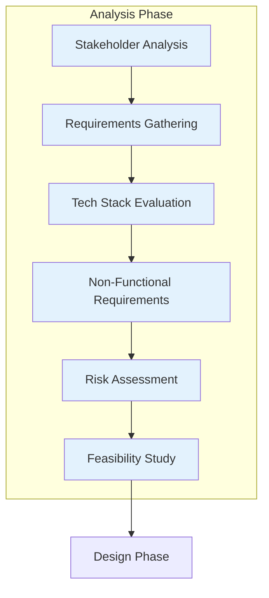
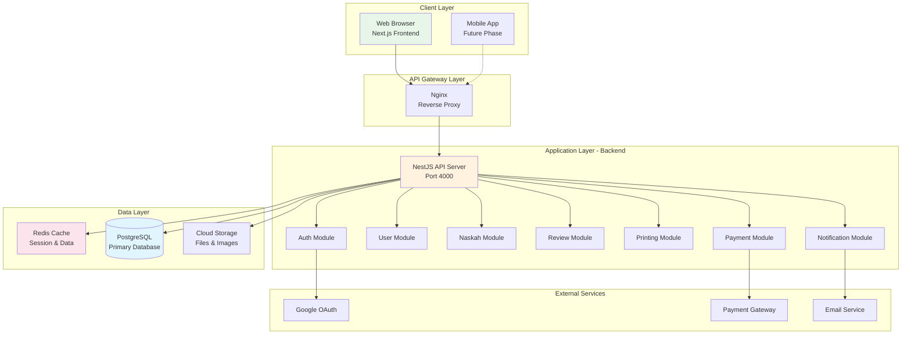

# LAPORAN PROGRESS PENGEMBANGAN SISTEM PUBLISHIFY

# FASE 1: PROGRESS PENGEMBANGAN (ADDIE)

**Lanjutan dari Part 1 - Pendahuluan dan Ruang Lingkup**

---

## C. PROGRESS PENGEMBANGAN DENGAN METODOLOGI ADDIE

Pada bagian ini, kami memaparkan secara rinci progress pengembangan Fase 1 yang mengikuti metodologi ADDIE. Setiap tahap dijabarkan dengan detail aktivitas yang dilakukan, keputusan teknis yang diambil, serta hasil yang dicapai.

### C.1 TAHAP ANALYSIS (ANALISIS)

Tahap analisis merupakan fondasi dari seluruh proses pengembangan. Kami melakukan analisis komprehensif untuk memastikan bahwa keputusan teknis yang diambil selaras dengan kebutuhan sistem Publishify.

#### C.1.1 Analisis Kebutuhan Sistem

**Identifikasi Stakeholder dan Kebutuhan:**

Kami memulai dengan melakukan analisis mendalam terhadap kebutuhan setiap stakeholder dalam ekosistem Publishify. Proses ini melibatkan pemetaan user journey untuk empat role utama:

1. **Penulis**: Membutuhkan platform yang mudah digunakan untuk mengajukan naskah, melacak status review, dan berkomunikasi dengan editor. Kebutuhan utama adalah kemudahan upload naskah, transparansi proses review, dan notifikasi real-time.

2. **Editor**: Memerlukan sistem yang efisien untuk mengelola antrian review, memberikan feedback terstruktur, dan berkomunikasi dengan penulis. Kebutuhan utama adalah dashboard yang informatif, tools untuk annotasi naskah, dan tracking workload.

3. **Percetakan**: Membutuhkan sistem untuk menerima order, mengelola inventory, tracking produksi, dan update status pengiriman. Kebutuhan utama adalah integrasi dengan sistem produksi, manajemen kapasitas, dan pricing calculator.

4. **Admin**: Memerlukan kontrol penuh atas sistem, kemampuan monitoring seluruh aktivitas, analytics, dan tools untuk moderasi. Kebutuhan utama adalah dashboard komprehensif, user management, dan reporting tools.

**Hasil Analisis Kebutuhan:**

Dari analisis ini, kami mengidentifikasi 7 domain utama yang perlu di-cover dalam database schema:

- User Management (autentikasi, profil, peran)
- Content Management (naskah, kategori, genre)
- Review System (workflow review, feedback)
- Printing & Shipping (order, tracking, pengiriman)
- Payment System (transaksi, invoice, komisi)
- Notification & Activity Logs
- Analytics & File Management

#### C.1.2 Analisis dan Pemilihan Stack Teknologi

**Proses Evaluasi Teknologi:**

Kami melakukan comparative analysis terhadap berbagai pilihan teknologi berdasarkan kriteria:

- Performance dan scalability
- Developer experience dan learning curve
- Community support dan ecosystem
- Long-term maintainability
- Compatibility dengan requirements sistem

**Backend Framework Analysis:**

| Kriteria                 | NestJS     | Express.js | Fastify  |
| ------------------------ | ---------- | ---------- | -------- |
| Structure & Organization | ⭐⭐⭐⭐⭐ | ⭐⭐       | ⭐⭐⭐   |
| TypeScript Support       | ⭐⭐⭐⭐⭐ | ⭐⭐⭐     | ⭐⭐⭐⭐ |
| Dependency Injection     | ⭐⭐⭐⭐⭐ | ⭐         | ⭐⭐     |
| Built-in Features        | ⭐⭐⭐⭐⭐ | ⭐⭐       | ⭐⭐⭐   |
| Learning Curve           | ⭐⭐⭐     | ⭐⭐⭐⭐⭐ | ⭐⭐⭐⭐ |

**Keputusan:** Kami memilih **NestJS** karena arsitektur modular yang powerful, built-in support untuk dependency injection, dan ecosystem yang mature untuk enterprise applications. Meskipun learning curve lebih tinggi, benefit jangka panjang dalam maintainability sangat signifikan.

**ORM Analysis:**

| Kriteria             | Prisma     | TypeORM  | Sequelize |
| -------------------- | ---------- | -------- | --------- |
| Type Safety          | ⭐⭐⭐⭐⭐ | ⭐⭐⭐⭐ | ⭐⭐      |
| Developer Experience | ⭐⭐⭐⭐⭐ | ⭐⭐⭐   | ⭐⭐⭐    |
| Migration Tools      | ⭐⭐⭐⭐⭐ | ⭐⭐⭐⭐ | ⭐⭐⭐    |
| Query Performance    | ⭐⭐⭐⭐⭐ | ⭐⭐⭐⭐ | ⭐⭐⭐    |
| Documentation        | ⭐⭐⭐⭐⭐ | ⭐⭐⭐⭐ | ⭐⭐⭐    |

**Keputusan:** Kami memilih **Prisma** karena developer experience yang superior, auto-generated types yang powerful, dan Prisma Studio untuk database visualization. Prisma juga memiliki migration system yang robust dan query builder yang intuitive.

**Frontend Framework Analysis:**

Untuk frontend, kami mempertimbangkan Next.js vs Create React App vs Remix. Next.js dipilih karena:

- Server-side rendering (SSR) dan static site generation (SSG) capabilities
- App Router yang modern dengan React Server Components
- Built-in optimization (Image, Font, Script optimization)
- API routes untuk backend-for-frontend pattern
- Excellent developer experience dengan Fast Refresh

**Runtime Environment:**

Kami memilih **Bun** sebagai runtime karena:

- Performance yang superior dibanding Node.js (3x lebih cepat untuk startup)
- Built-in package manager yang lebih cepat dari npm/yarn
- Native TypeScript support tanpa perlu ts-node
- All-in-one toolchain (runtime, bundler, package manager, test runner)

#### C.1.3 Analisis Requirements Non-Functional

Selain functional requirements, kami juga menganalisis aspek non-functional yang krusial:

**Security Requirements:**

- Implementasi JWT dengan short-lived access tokens (15 menit) dan long-lived refresh tokens (7 hari)
- OAuth 2.0 integration untuk social login
- Password hashing dengan bcrypt (12 salt rounds)
- CORS configuration yang proper
- Rate limiting untuk prevent abuse
- Input validation di semua endpoints

**Performance Requirements:**

- API response time target: <100ms untuk 95th percentile
- Database query optimization dengan proper indexing
- Caching strategy dengan Redis untuk data yang frequently accessed
- Connection pooling untuk database
- Lazy loading untuk frontend components

**Scalability Requirements:**

- Modular architecture yang memungkinkan horizontal scaling
- Stateless authentication dengan JWT
- Database design yang normalized untuk prevent data redundancy
- Caching layer untuk reduce database load
- Microservices-ready architecture

**Maintainability Requirements:**

- Strong typing dengan TypeScript
- Consistent code style dengan ESLint dan Prettier
- Comprehensive documentation (inline comments, README, API docs)
- Version control best practices
- Testing pyramid (unit, integration, e2e)



---

### C.2 TAHAP DESIGN (PERANCANGAN)

Tahap design merupakan fase di mana kami menerjemahkan hasil analisis menjadi blueprint teknis yang konkret. Semua keputusan arsitektural dan design patterns ditetapkan pada fase ini.

#### C.2.1 Perancangan Arsitektur Sistem

**Arsitektur High-Level:**

Kami merancang arsitektur monolithic modular dengan clear separation of concerns. Arsitektur ini dipilih karena sesuai dengan ukuran tim dan complexity requirements, namun dengan design yang microservices-ready untuk future scaling.



**Backend Architecture Pattern:**

Kami mengadopsi **Layered Architecture** dengan **Dependency Injection** pattern:

1. **Controller Layer**: Menangani HTTP requests, validation, dan response formatting
2. **Service Layer**: Business logic dan orchestration
3. **Repository Layer**: Data access abstraction (via Prisma)
4. **Entity Layer**: Domain models dan TypeScript interfaces

Setiap module memiliki struktur yang konsisten:

```
module-name/
├── module-name.module.ts       # Module definition
├── module-name.controller.ts   # HTTP endpoints
├── module-name.service.ts      # Business logic
├── dto/                        # Data Transfer Objects
│   ├── create-entity.dto.ts
│   └── update-entity.dto.ts
├── entities/                   # TypeScript interfaces
│   └── entity.interface.ts
└── module-name.spec.ts        # Unit tests
```

#### C.2.2 Perancangan Database Schema

**Database Design Philosophy:**

Kami merancang database dengan prinsip:

- **Normalization**: Mengurangi redundancy hingga 3NF
- **Performance**: Strategic denormalization untuk query yang frequent
- **Scalability**: Proper indexing dan partitioning strategy
- **Integrity**: Foreign key constraints dan cascade rules
- **Flexibility**: JSONB fields untuk data yang semi-structured

**7 Domain Database:**

Kami mengorganisir 28 tabel ke dalam 7 domain logis:

**1. Domain User Management (4 tabel):**

- `pengguna`: Core user data (email, password, status)
- `profil_pengguna`: Extended user profile (nama, bio, alamat)
- `peran_pengguna`: User roles dan permissions
- `profil_penulis`: Specific data untuk penulis (nama pena, biografi)

**2. Domain Content Management (5 tabel):**

- `naskah`: Manuscript data (judul, sinopsis, status)
- `revisi_naskah`: Revision tracking
- `kategori`: Content categories dengan hierarchical structure
- `genre`: Book genres
- `tag_naskah`: Tagging system untuk naskah

**3. Domain Review System (4 tabel):**

- `review_naskah`: Review assignments dan overall status
- `feedback_review`: Individual feedback dari editor
- `kriteria_review`: Review criteria dan rubrics
- `skor_review`: Scoring untuk setiap kriteria

**4. Domain Printing & Shipping (7 tabel):**

- `percetakan`: Printing vendor data
- `harga_cetak`: Dynamic pricing berdasarkan specifications
- `pesanan_cetak`: Print orders
- `item_pesanan`: Order line items
- `status_produksi`: Production tracking
- `pengiriman`: Shipping data
- `tracking_pengiriman`: Shipping status updates

**5. Domain Payment (4 tabel):**

- `transaksi_pembayaran`: Payment transactions
- `invoice`: Invoice generation
- `metode_pembayaran`: Payment methods
- `komisi_penulis`: Author commission tracking

**6. Domain Notification & Logs (2 tabel):**

- `notifikasi`: User notifications
- `log_aktivitas`: Activity audit trail

**7. Domain Analytics & Files (2 tabel):**

- `statistik_naskah`: Manuscript analytics (views, downloads)
- `berkas`: File metadata dan storage references

**Relationship Design:**

Kami menggunakan berbagai tipe relationships:

- One-to-One: `pengguna` ↔ `profil_pengguna`
- One-to-Many: `naskah` → `revisi_naskah`
- Many-to-Many: `naskah` ↔ `tag_naskah` (via join table)
- Self-referencing: `kategori` dengan hierarchical parent-child

**Indexing Strategy:**

Kami menerapkan indexes untuk optimize query performance:

- **Primary Keys**: UUID dengan B-tree index
- **Foreign Keys**: Index untuk semua FK columns
- **Search Fields**: Composite index untuk frequently queried combinations
- **Full-text Search**: GIN index untuk text search di `judul` dan `sinopsis`
- **Date Ranges**: B-tree index pada `dibuatPada` dan `diperbaruiPada`

Total indexes: 45+ indexes across 28 tables

> 📸 **Placeholder untuk ERD:**  
> ERD lengkap dapat dilihat di file:
>
> - `docs/erd-1-user-management.md`
> - `docs/erd-2-content-management.md`
> - `docs/erd-3-review-system.md`
> - `docs/erd-4-printing-shipping.md`
> - `docs/erd-5-payment-system.md`
> - `docs/erd-6-auth-notification.md`
> - `docs/erd-7-analytics-files.md`
>
> Screenshot ERD diagram akan disisipkan di: `docs/screenshots/fase-1/erd-complete.png`

#### C.2.3 Perancangan API Endpoints

**RESTful API Design Principles:**

Kami mengikuti REST best practices:

- Resource-based URLs: `/api/naskah`, `/api/review`
- HTTP verbs yang proper: GET, POST, PUT, DELETE, PATCH
- Status codes yang meaningful: 200, 201, 400, 401, 403, 404, 500
- Consistent response format dengan wrapper object
- Versioning strategy: `/api/v1/`
- Pagination untuk list endpoints: `?halaman=1&limit=20`
- Filtering dan sorting: `?status=draft&sortBy=dibuatPada`

**Authentication Endpoints Design:**

```
POST   /api/auth/register           # User registration
POST   /api/auth/login              # Login dengan email/password
POST   /api/auth/refresh            # Refresh access token
POST   /api/auth/logout             # Logout dan invalidate refresh token
GET    /api/auth/google             # Initiate OAuth flow
GET    /api/auth/google/callback    # OAuth callback handler
POST   /api/auth/verify-email       # Email verification
POST   /api/auth/forgot-password    # Request password reset
POST   /api/auth/reset-password     # Reset password dengan token
```

**User Management Endpoints Design:**

```
GET    /api/pengguna/profil         # Get current user profile
PUT    /api/pengguna/profil         # Update profile
GET    /api/pengguna/:id            # Get user by ID (admin only)
GET    /api/pengguna                # List users dengan pagination (admin)
DELETE /api/pengguna/:id            # Soft delete user (admin)
```

**Response Format Design:**

Semua response mengikuti format standar:

```typescript
// Success Response
{
  sukses: true,
  pesan: "Data berhasil diambil",
  data: { ... },
  metadata?: {
    total: 100,
    halaman: 1,
    limit: 20,
    totalHalaman: 5
  }
}

// Error Response
{
  sukses: false,
  pesan: "Error message dalam Bahasa Indonesia",
  error: {
    kode: "ERROR_CODE",
    detail: "Detailed explanation",
    field: "fieldName", // untuk validation errors
    timestamp: "2025-01-01T00:00:00Z"
  }
}
```

#### C.2.4 Perancangan Frontend Architecture

**Component Architecture:**

Kami merancang frontend dengan **Atomic Design** principles:

1. **Atoms**: Basic UI elements (Button, Input, Badge)
2. **Molecules**: Combination of atoms (FormField, SearchBar)
3. **Organisms**: Complex components (Navbar, DataTable, FormNaskah)
4. **Templates**: Page layouts (DashboardLayout, AuthLayout)
5. **Pages**: Complete pages di App Router

**State Management Design:**

Kami menggunakan kombinasi state management:

- **Zustand**: Global state (auth, UI preferences)
- **React Query**: Server state (API data, caching, refetching)
- **React Hook Form**: Form state (validation, submission)
- **React Context**: Theme dan localization (future)

**Routing Structure Design:**

```
app/
├── (auth)/                    # Auth group - public routes
│   ├── login/
│   ├── register/
│   └── lupa-password/
├── (dashboard)/               # Dashboard group - protected routes
│   ├── penulis/              # Penulis dashboard
│   ├── editor/               # Editor dashboard
│   ├── percetakan/           # Percetakan dashboard
│   └── admin/                # Admin dashboard
├── (publik)/                 # Public-facing routes
│   ├── naskah/[id]/         # Naskah detail page
│   └── penulis/[id]/        # Penulis profile page
├── layout.tsx               # Root layout
├── page.tsx                 # Homepage
└── error.tsx                # Error boundary
```

**Design System:**

Kami menggunakan **shadcn/ui** sebagai base dengan customization:

- Color scheme: Primary (blue), Secondary (purple), Accent (orange)
- Typography: Inter untuk body, Poppins untuk headings
- Spacing: 4px base unit dengan Tailwind spacing scale
- Breakpoints: mobile-first responsive (sm: 640px, md: 768px, lg: 1024px, xl: 1280px)
- Dark mode support (untuk future phase)

> 📁 **Referensi Design System:**  
> File konfigurasi Tailwind: `frontend/tailwind.config.ts`  
> Component library: `frontend/src/components/ui/`  
> Global styles: `frontend/src/styles/globals.css`

---

### C.3 TAHAP DEVELOPMENT (PENGEMBANGAN)

Fase development adalah tahap implementasi aktual dari design yang telah dibuat. Kami melakukan coding dengan mengikuti best practices dan standards yang telah ditetapkan.

#### C.3.1 Backend Development

**1. Project Initialization:**

Kami memulai dengan setup project structure:

```bash
# Inisialisasi NestJS project dengan Bun
bun create nest-app backend
cd backend
bun install

# Install dependencies
bun add @prisma/client
bun add -d prisma
bun add @nestjs/jwt @nestjs/passport passport passport-jwt
bun add @nestjs/config
bun add bcrypt
bun add zod
bun add class-validator class-transformer
```

> 📁 **Referensi file:** `backend/package.json` untuk daftar lengkap dependencies

**2. Prisma Setup dan Database Migration:**

Langkah-langkah setup Prisma:

```bash
# Initialize Prisma
bunx prisma init

# Edit prisma/schema.prisma dengan 28 tabel
# Configure database connection di .env

# Create dan jalankan migration
bunx prisma migrate dev --name init_28_tables

# Generate Prisma Client
bunx prisma generate

# Buka Prisma Studio untuk verify
bunx prisma studio
```

> 📁 **Referensi file:** `backend/prisma/schema.prisma` untuk schema lengkap  
> 📁 **Migration files:** `backend/prisma/migrations/` untuk history migrations

**3. Implementasi Module-Module Core:**

**Auth Module Development:**

Kami implementasikan authentication system dengan fitur lengkap:

- **JWT Strategy**: Validasi access token pada protected routes
- **Local Strategy**: Username/password authentication
- **OAuth Google Strategy**: Social login integration
- **Refresh Token Mechanism**: Rotating refresh tokens untuk security
- **Password Hashing**: bcrypt dengan 12 salt rounds
- **Guards**: JwtAuthGuard, PeranGuard untuk route protection
- **Decorators**: Custom decorators untuk extract user dari request

> 📁 **Implementasi Auth Module:**
>
> - Main module: `backend/src/modules/auth/auth.module.ts`
> - Controller: `backend/src/modules/auth/auth.controller.ts`
> - Service: `backend/src/modules/auth/auth.service.ts`
> - Strategies: `backend/src/modules/auth/strategies/`
> - Guards: `backend/src/modules/auth/guards/`
> - DTOs: `backend/src/modules/auth/dto/`

**Pengguna Module Development:**

Module untuk user management dengan CRUD operations:

- User profile management (get, update)
- User listing dengan pagination dan filtering
- Role assignment dan management
- Soft delete functionality
- User search capabilities

> 📁 **Implementasi Pengguna Module:**  
> Directory: `backend/src/modules/pengguna/`

**Prisma Service Development:**

Wrapper service untuk Prisma Client dengan features:

- Connection management dan error handling
- Transaction support
- Query logging untuk debugging
- Soft delete helpers

> 📁 **Implementasi Prisma Service:**  
> Files: `backend/src/prisma/prisma.module.ts` dan `prisma.service.ts`

**4. Middleware dan Interceptors Implementation:**

**Global Exception Filter:**

Custom exception filter untuk standardize error responses:

```typescript
// Konsep implementasi (bukan code aktual)
// File actual: backend/src/common/filters/http-exception.filter.ts

@Catch()
export class GlobalExceptionFilter implements ExceptionFilter {
  catch(exception, host) {
    // Transform semua exceptions ke format response standar
    // Log errors untuk debugging
    // Return proper HTTP status codes
  }
}
```

**Logging Interceptor:**

Interceptor untuk log semua incoming requests:

```typescript
// Konsep implementasi
// File actual: backend/src/common/interceptors/logging.interceptor.ts

@Injectable()
export class LoggingInterceptor implements NestInterceptor {
  intercept(context, next) {
    // Log request details (method, URL, body)
    // Measure response time
    // Log response status
  }
}
```

**Transform Interceptor:**

Interceptor untuk wrap responses dalam format standar:

```typescript
// Konsep implementasi
// File actual: backend/src/common/interceptors/transform.interceptor.ts

@Injectable()
export class TransformInterceptor implements NestInterceptor {
  intercept(context, next) {
    return next.handle().pipe(
      map((data) => ({
        sukses: true,
        pesan: "Operasi berhasil",
        data: data,
      }))
    );
  }
}
```

> 📁 **Middleware & Interceptors:**  
> Directory: `backend/src/common/interceptors/` dan `backend/src/common/filters/`

**5. Swagger Documentation Setup:**

Konfigurasi Swagger untuk auto-generate API documentation:

```typescript
// Konsep konfigurasi di main.ts
// File actual: backend/src/main.ts

const config = new DocumentBuilder()
  .setTitle("Publishify API")
  .setDescription("API untuk sistem penerbitan naskah")
  .setVersion("1.0")
  .addBearerAuth()
  .build();

const document = SwaggerModule.createDocument(app, config);
SwaggerModule.setup("api/docs", app, document);
```

Hasil: API documentation accessible di `http://localhost:4000/api/docs`

> 📸 **Screenshot Swagger UI:** Akan disisipkan di `docs/screenshots/fase-1/swagger-interface.png`

#### C.3.2 Frontend Development

**1. Next.js Project Setup:**

```bash
# Create Next.js app dengan App Router
bunx create-next-app@latest frontend --typescript --tailwind --app

cd frontend
bun install

# Install dependencies
bun add @tanstack/react-query
bun add zustand
bun add axios
bun add react-hook-form @hookform/resolvers
bun add zod
bun add date-fns
bun add lucide-react
bun add sonner
```

**2. shadcn/ui Setup:**

```bash
# Initialize shadcn/ui
bunx shadcn@latest init

# Install komponen yang dibutuhkan
bunx shadcn@latest add button
bunx shadcn@latest add input
bunx shadcn@latest add form
bunx shadcn@latest add card
bunx shadcn@latest add dialog
bunx shadcn@latest add dropdown-menu
bunx shadcn@latest add toast
```

> 📁 **UI Components:**  
> Directory: `frontend/src/components/ui/`  
> Config: `frontend/components.json`

**3. API Client Configuration:**

Setup Axios client dengan interceptors:

```typescript
// Konsep implementasi
// File actual: frontend/src/lib/api/client.ts

const apiClient = axios.create({
  baseURL: process.env.NEXT_PUBLIC_API_URL,
  timeout: 10000,
});

// Request interceptor: attach JWT token
apiClient.interceptors.request.use((config) => {
  const token = getAccessToken();
  if (token) {
    config.headers.Authorization = `Bearer ${token}`;
  }
  return config;
});

// Response interceptor: handle 401, refresh token
apiClient.interceptors.response.use(
  (response) => response,
  async (error) => {
    if (error.response?.status === 401) {
      // Attempt token refresh
      // Retry original request
    }
    return Promise.reject(error);
  }
);
```

> 📁 **API Client:**  
> Files: `frontend/src/lib/api/client.ts` dan service files di `frontend/src/lib/api/`

**4. State Management Setup:**

**Zustand Store untuk Auth:**

```typescript
// Konsep implementasi
// File actual: frontend/src/stores/use-auth-store.ts

interface AuthState {
  pengguna: Pengguna | null;
  accessToken: string | null;
  isAuthenticated: boolean;
  login: (token: string, pengguna: Pengguna) => void;
  logout: () => void;
  updatePengguna: (pengguna: Pengguna) => void;
}

export const useAuthStore = create<AuthState>((set) => ({
  pengguna: null,
  accessToken: null,
  isAuthenticated: false,
  // ... methods
}));
```

**React Query Configuration:**

```typescript
// Konsep konfigurasi
// File actual: frontend/src/app/providers.tsx

const queryClient = new QueryClient({
  defaultOptions: {
    queries: {
      staleTime: 5 * 60 * 1000, // 5 minutes
      cacheTime: 10 * 60 * 1000, // 10 minutes
      refetchOnWindowFocus: false,
      retry: 1,
    },
  },
});
```

> 📁 **State Management:**  
> Stores: `frontend/src/stores/`  
> Query hooks: `frontend/src/hooks/`

**5. Authentication Pages Implementation:**

Implementasi halaman login dan register:

**Login Page Features:**

- Form dengan validation menggunakan React Hook Form + Zod
- Email dan password fields
- Google OAuth button
- "Remember me" checkbox
- Link ke register dan forgot password
- Loading states dan error handling

**Register Page Features:**

- Multi-step form (data pribadi, credentials, role selection)
- Real-time validation
- Password strength indicator
- Terms and conditions checkbox
- Redirect after successful registration

> 📁 **Auth Pages:**  
> Directory: `frontend/src/app/(auth)/`  
> Components: Login form, Register form, OAuth buttons

**6. Dashboard Layouts Implementation:**

Kami membuat reusable layout components:

**Dashboard Layout Components:**

- **Sidebar Navigation**: Collapsible sidebar dengan menu items per role
- **Header**: User profile dropdown, notifications, search
- **Breadcrumbs**: Navigation tracking
- **Main Content Area**: Responsive container

Layout berbeda untuk setiap role:

- Penulis: Dashboard, Naskah Saya, Pengajuan Baru
- Editor: Dashboard, Antrian Review, Naskah yang Ditugaskan
- Percetakan: Dashboard, Pesanan Masuk, Produksi, Pengiriman
- Admin: Dashboard, User Management, System Settings

> 📁 **Layout Components:**  
> Directory: `frontend/src/components/layouts/`  
> Route groups: `frontend/src/app/(dashboard)/`

#### C.3.3 Redis Caching Implementation

**1. Redis Setup:**

Kami menggunakan Redis untuk caching layer:

```bash
# Install Redis dependencies
bun add ioredis
bun add cache-manager
bun add cache-manager-ioredis
```

**2. Cache Service Implementation:**

```typescript
// Konsep implementasi
// File actual: backend/src/common/cache/cache.service.ts

@Injectable()
export class CacheService {
  constructor(@Inject(CACHE_MANAGER) private cacheManager: Cache) {}

  async get<T>(key: string): Promise<T | null> {
    // Get value dari cache
  }

  async set<T>(key: string, value: T, ttl?: number): Promise<void> {
    // Set value ke cache dengan TTL
  }

  async del(key: string): Promise<void> {
    // Delete key dari cache
  }

  async reset(): Promise<void> {
    // Clear semua cache
  }
}
```

**3. Cache Interceptor:**

Interceptor untuk auto-cache GET requests:

```typescript
// Konsep implementasi
// File actual: backend/src/common/interceptors/cache.interceptor.ts

@Injectable()
export class HttpCacheInterceptor implements NestInterceptor {
  intercept(context, next) {
    const request = context.switchToHttp().getRequest();

    if (request.method === "GET") {
      const cacheKey = this.generateCacheKey(request);

      // Check cache first
      const cachedResponse = await this.cache.get(cacheKey);
      if (cachedResponse) {
        return of(cachedResponse);
      }

      // If not in cache, proceed with request and cache result
      return next.handle().pipe(
        tap((response) => {
          this.cache.set(cacheKey, response, TTL);
        })
      );
    }

    return next.handle();
  }
}
```

**4. Cache Decorators:**

Custom decorators untuk granular cache control:

```typescript
// Konsep implementasi
// File actual: backend/src/common/decorators/cache-key.decorator.ts

export const CacheKey = (prefix: string) =>
  SetMetadata('cache-key-prefix', prefix);

export const CacheTTL = (seconds: number) =>
  SetMetadata('cache-ttl', seconds);

// Usage contoh:
@Get()
@CacheKey('naskah-list')
@CacheTTL(300) // 5 minutes
async getAllNaskah() {
  // ...
}
```

> 📁 **Caching Implementation:**  
> Service: `backend/src/common/cache/cache.service.ts`  
> Config: `backend/src/config/redis.config.ts`  
> Decorators: `backend/src/common/decorators/`

---

**Catatan:**  
Dokumen ini adalah **Part 2** dari Laporan Progress Fase 1, fokus pada detail implementasi dengan metodologi ADDIE. Untuk hasil sementara dengan metrik dan visualisasi, lanjut ke **Part 3**.

_Dokumen dilanjutkan ke Part 3: Hasil Sementara dan Evaluasi_
