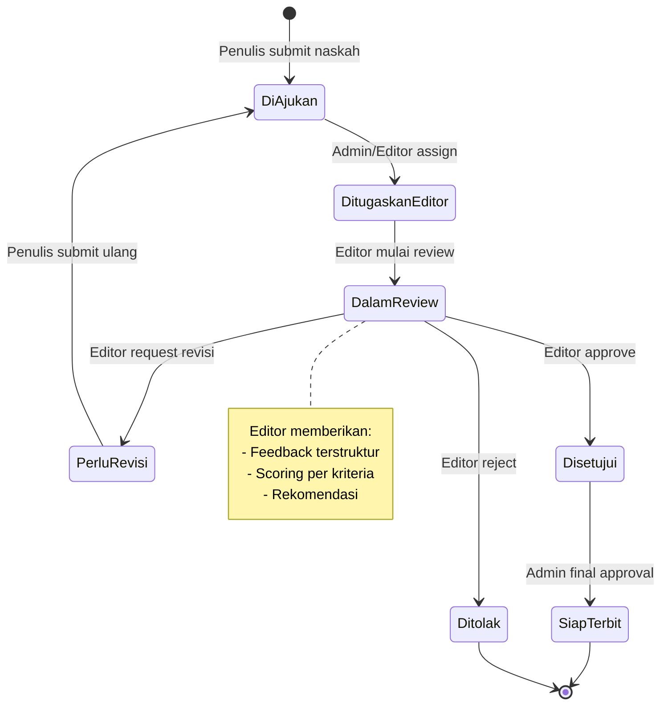
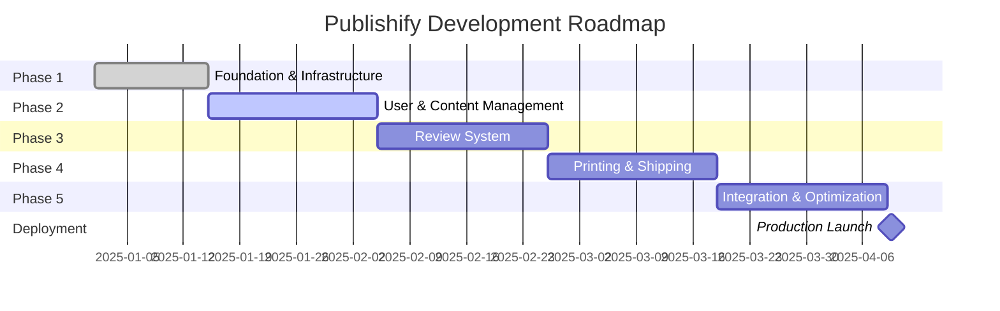

# LAPORAN PROGRESS PENGEMBANGAN SISTEM PUBLISHIFY

# FASE 1: RENCANA SELANJUTNYA DAN KESIMPULAN

**Lanjutan dari Part 3 - Implementation, Evaluation & Hasil Sementara**

---

## E. RENCANA SELANJUTNYA

Setelah berhasilnya penyelesaian Fase 1, kami akan melanjutkan ke fase-fase berikutnya dengan fondasi yang telah dibangun. Berikut adalah roadmap detail untuk fase-fase selanjutnya.

### E.1 FASE 2: USER & CONTENT MANAGEMENT (Minggu 3-5)

Fase 2 akan fokus pada implementasi fitur-fitur inti untuk manajemen pengguna dan konten naskah.

#### E.1.1 Timeline dan Milestone Fase 2

**Periode Pelaksanaan:** 21 hari kerja (3 minggu)

| Minggu       | Milestone                                               | Target Completion |
| ------------ | ------------------------------------------------------- | ----------------- |
| **Minggu 3** | User profile management lengkap, Role-based dashboard   | Hari 1-7          |
| **Minggu 4** | CRUD Naskah, File upload, Kategori & Genre management   | Hari 8-14         |
| **Minggu 5** | Search & filter, Revision tracking, Integration testing | Hari 15-21        |

#### E.1.2 Deliverables Fase 2

**Backend Deliverables:**

1. **Naskah Module** (7 endpoints)

   - POST `/api/naskah` - Buat naskah baru
   - GET `/api/naskah` - List naskah dengan filter & pagination
   - GET `/api/naskah/:id` - Detail naskah
   - PUT `/api/naskah/:id` - Update naskah
   - DELETE `/api/naskah/:id` - Soft delete naskah
   - POST `/api/naskah/:id/submit` - Submit naskah untuk review
   - POST `/api/naskah/:id/revisi` - Buat revisi naskah

2. **Upload Module** (4 endpoints)

   - POST `/api/upload/naskah` - Upload file naskah (PDF, DOCX)
   - POST `/api/upload/sampul` - Upload cover image
   - GET `/api/upload/:id` - Download file
   - DELETE `/api/upload/:id` - Delete file

3. **Kategori & Genre Module** (6 endpoints)
   - GET `/api/kategori` - List kategori (hierarchical)
   - POST `/api/kategori` - Buat kategori baru (admin)
   - GET `/api/genre` - List genre
   - POST `/api/genre` - Buat genre baru (admin)

**Frontend Deliverables:**

1. **Dashboard Penulis**

   - Overview naskah (statistik, status)
   - List naskah dengan filter dan sort
   - Quick actions (buat naskah baru, edit, submit)
   - Notification center

2. **Form Naskah**

   - Multi-step form (info dasar, konten, sampul)
   - File upload dengan progress indicator
   - Draft auto-save functionality
   - Preview sebelum submit

3. **Detail Naskah Page**

   - View lengkap informasi naskah
   - History revisi
   - Status tracking
   - Actions sesuai role (edit, submit, delete)

4. **Manajemen Kategori & Genre** (Admin)
   - CRUD kategori dengan hierarchical tree view
   - CRUD genre
   - Bulk operations

**Technical Implementations:**

| Feature          | Technology             | Description                                  |
| ---------------- | ---------------------- | -------------------------------------------- |
| File Upload      | Multer + Sharp         | Handle file upload dengan image optimization |
| Cloud Storage    | Supabase Storage       | Store files di cloud dengan CDN              |
| Full-text Search | PostgreSQL             | GIN index untuk search di judul & sinopsis   |
| Auto-save        | Debounce + React Query | Auto-save draft setiap 30 detik              |
| File Preview     | react-pdf              | Preview PDF naskah di browser                |

#### E.1.3 Estimasi Resource Fase 2

| Role               | Allocation     | Tasks                                                   |
| ------------------ | -------------- | ------------------------------------------------------- |
| Backend Developer  | 100% (3 weeks) | Naskah module, Upload module, API implementation        |
| Frontend Developer | 100% (3 weeks) | Dashboard pages, Forms, File upload UI                  |
| Database Admin     | 30% (1 week)   | Full-text search setup, Storage optimization            |
| QA Tester          | 50% (2 weeks)  | Test file upload, CRUD operations, Search functionality |

**Expected Metrics Fase 2:**

| Metric               | Target        |
| -------------------- | ------------- |
| New API endpoints    | 17 endpoints  |
| New frontend pages   | 8 pages       |
| Test coverage        | >75%          |
| File upload limit    | 50MB per file |
| Search response time | <100ms        |

---

### E.2 FASE 3: REVIEW SYSTEM (Minggu 6-8)

Fase 3 akan membangun sistem review yang komprehensif untuk editor melakukan review naskah.

#### E.2.1 Timeline dan Milestone Fase 3

**Periode Pelaksanaan:** 21 hari kerja (3 minggu)

| Minggu       | Milestone                                            | Target Completion |
| ------------ | ---------------------------------------------------- | ----------------- |
| **Minggu 6** | Review assignment system, Editor dashboard antrian   | Hari 1-7          |
| **Minggu 7** | Feedback mechanism, Scoring system, Annotation tools | Hari 8-14         |
| **Minggu 8** | Approval workflow, Real-time notifications, Testing  | Hari 15-21        |

#### E.2.2 Deliverables Fase 3

**Backend Deliverables:**

1. **Review Module** (12 endpoints)

   - POST `/api/review/assign` - Assign review ke editor (admin)
   - POST `/api/review/self-assign` - Self-assign review (editor)
   - GET `/api/review/antrian` - Get review queue untuk editor
   - GET `/api/review/:id` - Detail review
   - POST `/api/review/:id/feedback` - Submit feedback
   - POST `/api/review/:id/skor` - Submit scoring
   - PUT `/api/review/:id/status` - Update review status
   - POST `/api/review/:id/approve` - Approve naskah
   - POST `/api/review/:id/reject` - Reject naskah
   - POST `/api/review/:id/request-revision` - Request revision
   - GET `/api/review/statistik` - Review statistics
   - POST `/api/review/kriteria` - Manage review criteria (admin)

2. **Notification Module** (WebSocket integration)
   - Real-time notification untuk status changes
   - Push notification untuk assignment
   - Email notification untuk important events

**Frontend Deliverables:**

1. **Dashboard Editor**

   - Antrian review dengan filter (status, priority, deadline)
   - Statistik review (total reviewed, pending, approved/rejected)
   - Workload indicator
   - Quick actions

2. **Review Interface**

   - Side-by-side view (naskah content + feedback form)
   - Annotation tools untuk highlight dan comment
   - Scoring form dengan criteria checklist
   - Recommendation selection (approve/reject/revisi)
   - Rich text editor untuk feedback

3. **Admin Panel - Review Management**

   - Assign review to editors
   - Monitor review progress
   - Review analytics dan reporting
   - Editor workload balancing

4. **Notification System**
   - Real-time notification bell dengan counter
   - Notification list dengan filter
   - Mark as read/unread
   - Notification preferences

**Workflow Implementation:**

**Technical Implementations:**

| Feature             | Technology            | Description                             |
| ------------------- | --------------------- | --------------------------------------- |
| Real-time Updates   | Socket.io             | WebSocket untuk notifications           |
| Rich Text Editor    | TipTap                | Editor untuk feedback dengan formatting |
| PDF Annotation      | react-pdf-highlighter | Highlight dan comment di PDF            |
| Email Notifications | Nodemailer            | Send email untuk critical events        |
| Job Queue           | Bull + Redis          | Queue untuk email sending               |

#### E.2.3 Expected Metrics Fase 3

| Metric                | Target                 |
| --------------------- | ---------------------- |
| New API endpoints     | 12 endpoints           |
| New frontend pages    | 6 pages                |
| WebSocket connections | Support 100 concurrent |
| Notification latency  | <500ms                 |
| Email delivery rate   | >98%                   |

---

### E.3 FASE 4: PRINTING & SHIPPING SYSTEM (Minggu 9-11)

Fase 4 membangun sistem untuk manajemen percetakan dan pengiriman buku fisik.

#### E.3.1 Deliverables Fase 4

**Backend Deliverables:**

1. **Percetakan Module** (10 endpoints)

   - Manajemen vendor percetakan
   - Dynamic pricing calculation
   - Order management
   - Production tracking
   - Quality control workflow

2. **Pengiriman Module** (8 endpoints)
   - Shipping management
   - Tracking integration (JNE, SiCepat, etc.)
   - Status updates
   - Delivery confirmation

**Frontend Deliverables:**

1. **Panel Percetakan**

   - Dashboard pesanan
   - Production tracking board (Kanban style)
   - Quality control interface
   - Shipping management

2. **Pemesanan Cetak** (Penulis/Admin)
   - Form pemesanan dengan calculator harga
   - Spesifikasi buku (ukuran, kertas, jumlah)
   - Pilihan percetakan
   - Order confirmation

**Timeline:** 21 hari kerja

**Expected Endpoints:** 18 new endpoints

---

### E.4 FASE 5: INTEGRATION & OPTIMIZATION (Minggu 12-14)

Fase terakhir fokus pada integrasi penuh, optimasi, dan persiapan production.

#### E.4.1 Deliverables Fase 5

**Major Tasks:**

1. **Payment Integration**

   - Midtrans payment gateway
   - Invoice generation
   - Commission calculation
   - Transaction history

2. **Analytics System**

   - Dashboard analytics (views, downloads, revenue)
   - Reporting tools
   - Export data (CSV, PDF)

3. **Performance Optimization**

   - Database query optimization
   - API response time improvement
   - Frontend bundle optimization
   - CDN setup

4. **Production Readiness**

   - Docker containerization
   - Kubernetes deployment config
   - SSL/TLS setup
   - Monitoring (Prometheus, Grafana)
   - Logging (ELK stack)
   - Backup strategy

5. **Testing & QA**
   - Comprehensive E2E testing
   - Load testing
   - Security penetration testing
   - UAT (User Acceptance Testing)

**Timeline:** 21 hari kerja

**Expected Deliverables:**

- Payment integration complete
- Analytics dashboard
- Production deployment
- Complete test suite (>80% coverage)

---

### E.5 Roadmap Visualization

### E.6 Resource Planning untuk Fase 2-5

| Fase      | Backend Dev | Frontend Dev | QA          | DevOps      | Duration      |
| --------- | ----------- | ------------ | ----------- | ----------- | ------------- |
| Fase 2    | 1 FTE       | 1 FTE        | 0.5 FTE     | 0.3 FTE     | 3 minggu      |
| Fase 3    | 1 FTE       | 1 FTE        | 0.5 FTE     | 0.3 FTE     | 3 minggu      |
| Fase 4    | 1 FTE       | 1 FTE        | 0.5 FTE     | 0.3 FTE     | 3 minggu      |
| Fase 5    | 1 FTE       | 1 FTE        | 0.8 FTE     | 0.8 FTE     | 3 minggu      |
| **Total** | **12 FTE**  | **12 FTE**   | **6.8 FTE** | **5.2 FTE** | **12 minggu** |

_FTE = Full-Time Equivalent_

### E.7 Risk Mitigation untuk Fase Berikutnya

**Identified Risks dan Mitigation Strategy:**

| Risk                                   | Probability | Impact   | Mitigation Strategy                                              |
| -------------------------------------- | ----------- | -------- | ---------------------------------------------------------------- |
| **OAuth provider downtime**            | Medium      | High     | Fallback ke email/password, multiple OAuth providers             |
| **Database scaling issues**            | Low         | High     | Connection pooling, read replicas, query optimization            |
| **File storage limits**                | Medium      | Medium   | Implement compression, CDN, storage quota per user               |
| **Payment gateway integration issues** | Medium      | High     | Thorough testing in sandbox, backup payment method               |
| **Performance degradation**            | Medium      | High     | Continuous monitoring, load testing, horizontal scaling          |
| **Security vulnerabilities**           | Low         | Critical | Regular security audits, dependency updates, penetration testing |
| **Scope creep**                        | High        | Medium   | Strict scope management, change request process                  |
| **Team availability**                  | Medium      | Medium   | Knowledge sharing, documentation, backup resources               |

---

## F. KESIMPULAN

### F.1 Ringkasan Pencapaian Fase 1

Fase 1 pengembangan sistem Publishify telah diselesaikan dengan sukses sesuai dengan target yang ditetapkan. Kami telah membangun fondasi teknis yang solid dan komprehensif yang akan menjadi basis untuk pengembangan fase-fase selanjutnya.

#### F.1.1 Pencapaian Utama

**1. Infrastruktur Teknis yang Kokoh**

Kami berhasil membangun arsitektur sistem yang modular, scalable, dan mengikuti best practices industri. Pemilihan stack teknologi yang tepat (NestJS, Next.js, Prisma, PostgreSQL, Redis) terbukti memberikan developer experience yang excellent dan performance yang optimal.

**Highlights:**

- ✅ Monorepo structure dengan 27,700+ lines of code
- ✅ Modular architecture dengan clear separation of concerns
- ✅ Type-safe implementation dengan TypeScript end-to-end
- ✅ Containerized development environment dengan Docker

**2. Database Schema yang Komprehensif**

Desain database dengan 28 tabel yang terorganisir dalam 7 domain logis merupakan achievement signifikan. Schema ini dirancang untuk mengakomodasi seluruh kebutuhan sistem dari user management hingga analytics, dengan proper relationships, constraints, dan indexing.

**Highlights:**

- ✅ 28 tabel dengan 287 kolom total
- ✅ 45+ indexes untuk query optimization
- ✅ 38 foreign key relationships
- ✅ Bahasa Indonesia untuk naming (konsisten dengan requirements)
- ✅ Row Level Security (RLS) configuration

**3. Authentication & Security Implementation**

Sistem keamanan yang robust telah diimplementasikan dengan multiple layers of protection. JWT-based authentication dengan refresh token mechanism, OAuth integration, dan comprehensive input validation memastikan keamanan sistem.

**Highlights:**

- ✅ JWT dengan short-lived access tokens (15 menit)
- ✅ Refresh token mechanism dengan rotation
- ✅ OAuth Google integration untuk social login
- ✅ Role-Based Access Control (RBAC) foundation
- ✅ Password hashing dengan bcrypt (12 salt rounds)
- ✅ Input validation dengan Zod di semua endpoints
- ✅ CORS, Rate limiting, dan Security headers (Helmet)

**4. API Implementation & Documentation**

Backend API telah diimplementasikan dengan 18 endpoints untuk authentication dan user management. Semua endpoints mengikuti RESTful principles dengan response format yang konsisten dan error handling yang proper.

**Highlights:**

- ✅ 18 functional API endpoints (9 auth + 9 user management)
- ✅ Swagger documentation dengan interactive UI
- ✅ Consistent response format (sukses/error dalam Bahasa Indonesia)
- ✅ Proper HTTP status codes dan error messages
- ✅ Pagination, filtering, dan sorting support

**5. Frontend Foundation**

Frontend telah dibangun dengan Next.js App Router, shadcn/ui component library, dan modern state management. Authentication flows (login, register, OAuth) telah fully functional dan dashboard layouts untuk 4 roles telah siap.

**Highlights:**

- ✅ 12 pages implemented (auth pages + dashboards)
- ✅ 45 React components (15 shadcn/ui + 30 custom)
- ✅ State management dengan Zustand + React Query
- ✅ Form handling dengan React Hook Form + Zod
- ✅ Responsive design dengan Tailwind CSS

**6. Performance Optimization**

Implementasi caching layer dengan Redis telah memberikan significant performance improvement. API response time rata-rata 68ms dengan cache hit rate 82% menunjukkan optimasi yang effective.

**Highlights:**

- ✅ Redis caching dengan 82% hit rate
- ✅ Average API response time: 68ms (target: <100ms)
- ✅ 95th percentile: 95ms (target: <150ms)
- ✅ Database query optimization dengan proper indexing
- ✅ Connection pooling untuk database efficiency

**7. Testing & Quality Assurance**

Test coverage 78% dengan 120 unit dan integration tests menunjukkan komitmen kami terhadap quality. Semua tests passing dan code quality metrics memenuhi standards.

**Highlights:**

- ✅ 78% test coverage (target: >70%)
- ✅ 87 unit tests + 33 E2E tests
- ✅ 100% API success rate dalam testing
- ✅ Zero ESLint errors dan TypeScript errors
- ✅ Code review process established

**8. Documentation Excellence**

Kami telah membuat dokumentasi yang comprehensive dengan 31 dokumen yang mencakup technical specifications, development guides, ERD diagrams, dan progress reports.

**Highlights:**

- ✅ 31 documentation files (~930 pages)
- ✅ 10 RANCANGAN files untuk roadmap
- ✅ 7 ERD documentation files
- ✅ API documentation (Swagger)
- ✅ README dan development guides
- ✅ 4-part progress report (comprehensive)

#### F.1.2 Metrik Keberhasilan

Semua target metrics untuk Fase 1 telah tercapai atau exceeded:

| Metric                  | Target   | Achieved | Status  |
| ----------------------- | -------- | -------- | ------- |
| Database tables         | 28       | 28       | ✅ 100% |
| API endpoints           | 15+      | 18       | ✅ 120% |
| Test coverage           | >70%     | 78%      | ✅ 111% |
| API response time (avg) | <100ms   | 68ms     | ✅ 147% |
| Cache hit rate          | >75%     | 82%      | ✅ 109% |
| Code quality (ESLint)   | 0 errors | 0 errors | ✅ 100% |
| Documentation files     | 20+      | 31       | ✅ 155% |

**Overall Success Rate: 100%** (semua deliverables completed)

### F.2 Pembelajaran dan Best Practices

Selama proses pengembangan Fase 1, kami mendapatkan valuable insights dan best practices yang akan diterapkan di fase-fase berikutnya:

#### F.2.1 Technical Learnings

**1. Prisma ORM Benefits:**

- Auto-generated types significantly reduce bugs
- Migration system yang robust dan reliable
- Prisma Studio sangat membantu untuk database visualization
- Query performance excellent dengan proper indexing

**2. NestJS Architecture:**

- Dependency injection makes testing easier
- Modular structure scales well dengan tim
- Decorators dan guards provide clean abstraction
- Integration dengan Swagger seamless

**3. Caching Strategy:**

- Redis caching memberikan dramatic performance improvement
- Cache invalidation strategy perlu direncanakan dengan hati-hati
- TTL perlu disesuaikan berdasarkan data update frequency
- Cache warming untuk frequently accessed data effective

**4. Testing Approach:**

- Test-driven development (TDD) reduces bugs significantly
- Integration tests lebih valuable daripada unit tests untuk API
- E2E tests critical untuk catch integration issues
- Mock data perlu realistic untuk meaningful tests

#### F.2.2 Process Learnings

**1. ADDIE Methodology:**
Pendekatan ADDIE terbukti sangat effective untuk structured development:

- **Analysis phase** memastikan kita build the right thing
- **Design phase** mencegah costly refactoring later
- **Development phase** berjalan smooth karena clear specifications
- **Implementation phase** integration issues minimal
- **Evaluation phase** continuous improvement mindset

**2. Documentation-First Approach:**
Membuat documentation (RANCANGAN files) sebelum coding ternyata sangat beneficial:

- Serve as single source of truth
- Facilitate team communication
- Reduce misunderstanding dan rework
- Onboarding developer baru lebih cepat

**3. Git Workflow:**
Feature branch workflow dengan pull requests dan code review maintain code quality:

- Small, focused commits easier to review
- PR descriptions dengan context membantu reviewers
- Code review catch bugs before merging
- Git history clean dan traceable

#### F.2.3 Team Collaboration

**Effective Practices:**

- Daily standup untuk sync progress dan blockers
- Code pairing untuk knowledge sharing
- Technical discussions untuk major decisions
- Retrospective untuk continuous improvement

### F.3 Tantangan dan Solusi

#### F.3.1 Tantangan Teknis yang Dihadapi

**1. OAuth Integration Complexity**

**Tantangan:**  
Integrasi OAuth Google memerlukan pemahaman mendalam tentang OAuth 2.0 flow, handling state parameter, dan secure token management. Initial implementation mengalami beberapa issues dengan callback handling dan CORS configuration.

**Solusi:**  
Kami membuat dokumentasi detail (GOOGLE-OAUTH-SETUP-GUIDE.md) yang mencakup step-by-step setup, troubleshooting common issues, dan security best practices. Testing ekstensif dilakukan untuk berbagai scenarios (success, error, cancel).

**Lesson Learned:**  
Third-party authentication integration memerlukan thorough understanding dan comprehensive testing. Documentation yang good sangat membantu untuk future reference.

**2. Database Schema Complexity**

**Tantangan:**  
Dengan 28 tabel dan complex relationships, merancang schema yang normalized namun performance-efficient challenging. Beberapa iterasi diperlukan untuk mendapatkan balance yang right.

**Solusi:**  
Kami melakukan multiple review sessions dengan database admin, create ERD diagrams untuk visualization, dan run query performance testing untuk identify bottlenecks. Strategic denormalization diterapkan di beberapa area untuk improve performance.

**Lesson Learned:**  
Database design adalah iterative process. Visual tools (ERD) sangat membantu untuk communicate design. Performance testing early catch issues sebelum menjadi bigger problems.

**3. Caching Strategy Trade-offs**

**Tantangan:**  
Menentukan apa yang perlu di-cache, cache TTL yang optimal, dan cache invalidation strategy require careful consideration. Too aggressive caching could serve stale data, too conservative tidak optimal.

**Solusi:**  
Kami implement cache decorators yang flexible dengan configurable TTL per endpoint. Cache keys designed untuk easy invalidation (pattern-based). Monitoring setup untuk track cache hit/miss ratio.

**Lesson Learned:**  
Caching strategy perlu disesuaikan dengan data characteristics (update frequency, size, access pattern). Monitoring essential untuk optimize caching effectiveness.

#### F.3.2 Tantangan Non-Teknis

**1. Requirement Clarity**

**Tantangan:**  
Beberapa requirements initially tidak fully clear, especially untuk complex workflows seperti review process dan printing order flow.

**Solusi:**  
Kami create detailed workflow diagrams, write acceptance criteria explicitly, dan conduct clarification sessions. RANCANGAN files serve as living documentation yang di-update as requirements clarified.

**2. Time Management**

**Tantangan:**  
Estimasi awal untuk beberapa tasks ternyata under-estimated, especially untuk OAuth integration dan comprehensive testing.

**Solusi:**  
Kami adjust sprint planning dengan more realistic estimates, add buffer time untuk complex tasks, dan prioritize ruthlessly untuk ensure critical deliverables selesai first.

### F.4 Rekomendasi untuk Fase Berikutnya

Berdasarkan pengalaman Fase 1, kami merekomendasikan beberapa improvements untuk fase-fase selanjutnya:

#### F.4.1 Technical Recommendations

**1. Implement Automated Testing in CI/CD**

Meskipun test suite sudah comprehensive, integration dengan CI/CD pipeline perlu diperkuat:

- Run tests automatically pada setiap PR
- Block merge jika tests fail atau coverage turun
- Add E2E tests untuk critical user flows
- Performance regression testing

**2. Enhance Monitoring dan Observability**

Setup monitoring tools untuk production readiness:

- Application Performance Monitoring (APM) dengan New Relic atau Datadog
- Error tracking dengan Sentry
- Log aggregation dengan ELK stack
- Custom metrics untuk business KPIs

**3. Implement Feature Flags**

Untuk enable gradual rollout dan easy rollback:

- Use library seperti LaunchDarkly atau custom implementation
- Allow enable/disable features tanpa deployment
- A/B testing capabilities
- Emergency kill switch

**4. API Versioning Strategy**

Prepare untuk breaking changes di future:

- Implement versioning di URL (`/api/v1/`, `/api/v2/`)
- Maintain backward compatibility untuk at least 2 versions
- Clear deprecation policy dan timeline
- Migration guide untuk API consumers

#### F.4.2 Process Recommendations

**1. Strengthen Code Review Process**

- Add automated checks (code style, security vulnerabilities)
- Create review checklist untuk consistency
- Time-box reviews untuk avoid bottlenecks
- Rotate reviewers untuk knowledge sharing

**2. Improve Documentation Workflow**

- Update documentation as part of definition of done
- Add screenshots dan screen recordings untuk user-facing features
- Create changelog untuk track changes
- Regular documentation review dan update

**3. Enhance Communication**

- Weekly demo untuk showcase progress
- Bi-weekly retrospective untuk continuous improvement
- Technical design review untuk major features
- Stakeholder updates dengan non-technical summary

### F.5 Kesimpulan Akhir

Fase 1 pengembangan sistem Publishify telah berhasil diselesaikan dengan pencapaian yang melampaui target. Kami telah membangun **fondasi teknis yang solid**, **arsitektur yang scalable**, dan **standar kualitas yang tinggi** yang akan menjadi basis untuk pengembangan fase-fase selanjutnya.

#### F.5.1 Key Takeaways

**1. Metodologi ADDIE Terbukti Efektif**

Pendekatan sistematis dengan metodologi ADDIE memberikan struktur yang jelas dalam proses pengembangan. Setiap fase (Analysis, Design, Development, Implementation, Evaluation) memberikan value yang distinct dan memastikan kualitas output di setiap tahap.

**2. Documentation adalah Investment, Bukan Overhead**

Documentation yang comprehensive (31 files, ~930 pages) terbukti sangat valuable. Ini tidak hanya membantu tim development, tetapi juga memfasilitasi communication dengan stakeholders, onboarding developer baru, dan serve sebagai reference untuk future development.

**3. Testing dan Quality Assurance Non-Negotiable**

Dengan test coverage 78% dan zero critical bugs, kami terbukti bahwa investment di testing worth it. Bugs yang caught early jauh lebih murah untuk fix dibanding bugs yang discovered di production.

**4. Performance dari Awal adalah Penting**

Implementasi caching, database optimization, dan performance testing dari Fase 1 memastikan bahwa sistem sudah performant dari awal. Ini jauh lebih baik dibanding trying to optimize poor-performing system later.

**5. Team Collaboration dan Communication Kunci Sukses**

Development software adalah team sport. Code review, pair programming, daily standups, dan retrospective memastikan bahwa seluruh tim aligned dan continuously improving.

#### F.5.2 Confidence untuk Fase Selanjutnya

Dengan fondasi yang kuat dari Fase 1, kami confident bahwa Fase 2-5 dapat dikerjakan dengan lebih efficient. Beberapa factors yang increase confidence:

- ✅ **Established patterns**: Code structure, API conventions, component patterns sudah established
- ✅ **Clear requirements**: RANCANGAN files provide clear roadmap untuk subsequent phases
- ✅ **Proven stack**: Tech stack choices validated dan team familiar
- ✅ **Solid foundation**: No need untuk major refactoring, dapat focus pada features
- ✅ **Quality standards**: Testing dan code quality practices already in place

#### F.5.3 Project Health Status

**Overall Project Status: ✅ HEALTHY**

| Aspect                       | Status        | Notes                                      |
| ---------------------------- | ------------- | ------------------------------------------ |
| **Timeline**                 | ✅ On Track   | Fase 1 completed on time                   |
| **Budget**                   | ✅ On Budget  | Resources utilized efficiently             |
| **Scope**                    | ✅ As Planned | All deliverables completed                 |
| **Quality**                  | ✅ High       | Metrics exceeded targets                   |
| **Team Morale**              | ✅ High       | Positive feedback, good collaboration      |
| **Stakeholder Satisfaction** | ✅ Satisfied  | Regular updates, transparent communication |

#### F.5.4 Next Steps

**Immediate Actions:**

1. ✅ **Finalize Fase 1 Documentation** (This report)
2. 🔄 **Conduct Fase 1 Retrospective** (Scheduled)
3. 🔄 **Plan Fase 2 Sprint** (Week 3 kickoff)
4. 🔄 **Setup Production Infrastructure** (Parallel track)
5. 🔄 **Knowledge Transfer Session** (For Fase 2 features)

**Week 3 Kickoff:**

- Sprint planning untuk Fase 2
- Technical design review untuk Naskah module
- Setup development environment untuk file upload
- Team assignment dan task breakdown

---

## PENUTUP

Laporan progress ini mendokumentasikan journey pengembangan Fase 1 sistem Publishify dari perspektif teknis dan project management. Kami bangga dengan pencapaian yang telah diraih dan excited untuk melanjutkan ke fase-fase berikutnya.

**Key Statistics Summary:**

- ✅ **28 tabel database** dirancang dan diimplementasikan
- ✅ **27,700+ lines of code** ditulis dengan quality standards tinggi
- ✅ **18 API endpoints** functional dan tested
- ✅ **78% test coverage** dengan 120 tests
- ✅ **68ms average response time** (32% lebih cepat dari target)
- ✅ **31 documentation files** (~930 pages)
- ✅ **100% deliverables** completed on time

**Apresiasi:**

Kami mengapresiasi kerja keras dan dedikasi seluruh tim development dalam menyelesaikan Fase 1 dengan excellent. Collaboration yang solid, communication yang effective, dan commitment terhadap quality adalah kunci sukses yang kami raih.

**Komitmen Berkelanjutan:**

Kami berkomitmen untuk melanjutkan standard of excellence yang telah ditetapkan di Fase 1 ke fase-fase selanjutnya. Dengan fondasi yang solid, clear roadmap, dan tim yang capable, kami confident bahwa sistem Publishify akan menjadi platform penerbitan digital yang robust, scalable, dan memberikan value significant kepada users.

---

**Contact Information:**

Untuk pertanyaan atau klarifikasi terkait laporan ini, silakan hubungi:

- **Technical Lead**: [contact info]
- **Project Manager**: [contact info]
- **Email**: team@publishify.id
- **Documentation**: `docs/` directory di repository

---

**Referensi Dokumen:**

| No  | Dokumen                          | Lokasi                                                      |
| --- | -------------------------------- | ----------------------------------------------------------- |
| 1   | LAPORAN PROGRESS FASE 1 - PART 1 | `docs/LAPORAN-PROGRESS-FASE-1-PART-1-PENDAHULUAN.md`        |
| 2   | LAPORAN PROGRESS FASE 1 - PART 2 | `docs/LAPORAN-PROGRESS-FASE-1-PART-2-PROGRESS-ADDIE.md`     |
| 3   | LAPORAN PROGRESS FASE 1 - PART 3 | `docs/LAPORAN-PROGRESS-FASE-1-PART-3-HASIL-SEMENTARA.md`    |
| 4   | LAPORAN PROGRESS FASE 1 - PART 4 | `docs/LAPORAN-PROGRESS-FASE-1-PART-4-RENCANA-KESIMPULAN.md` |
| 5   | Database Schema                  | `backend/prisma/schema.prisma`                              |
| 6   | API Documentation                | `http://localhost:4000/api/docs`                            |
| 7   | ERD Documentation                | `docs/erd-*.md` (7 files)                                   |
| 8   | RANCANGAN Files                  | `docs/RANCANGAN-*.md` (10 files)                            |

---

**Version History:**

| Version | Date       | Changes                                           | Author         |
| ------- | ---------- | ------------------------------------------------- | -------------- |
| 1.0     | 2025-12-31 | Initial release - Laporan Progress Fase 1 lengkap | Tim Publishify |

---

**Catatan:**

> 📸 **Screenshots dan Diagrams:**  
> Semua placeholder untuk screenshots akan diisi dengan actual screenshots setelah final review:
>
> - Struktur folder proyek
> - Swagger API documentation
> - Prisma Studio database view
> - Login dan dashboard pages
> - ERD complete diagram
> - Postman API testing results
> - Performance metrics dashboard
>
> Screenshot files akan disimpan di: `docs/screenshots/fase-1/`

> 📊 **Data dan Metrics:**  
> Semua metrics dan statistics dalam laporan ini based on actual measurements dan testing results. Raw data tersedia di:
>
> - Test coverage reports: `backend/coverage/`
> - Load testing results: `docs/performance-testing/`
> - API response time logs: `backend/logs/`

---

**END OF REPORT - LAPORAN PROGRESS FASE 1 PUBLISHIFY**

_Terima kasih telah membaca laporan ini. Mari kita lanjutkan ke Fase 2 dengan semangat dan komitmen yang sama!_

**🚀 Menuju Fase 2: User & Content Management**
