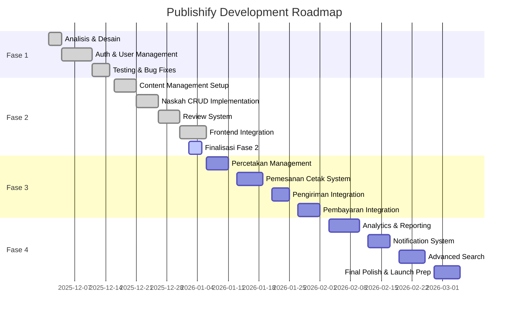

# LAPORAN PROGRESS FASE 2: SISTEM MANAJEMEN KONTEN DAN REVIEW

## PART 4: RENCANA SELANJUTNYA DAN KESIMPULAN

**Tanggal Penyusunan**: 31 Desember 2025  
**Status Project**: Transisi Fase 2 ke Fase 3

---

## E. RENCANA SELANJUTNYA

### 5.1 Penyelesaian Fase 2 (Remaining 5%)

Meskipun Fase 2 sudah mencapai completion 95%, masih ada beberapa item yang perlu diselesaikan sebelum kami officially menutup fase ini dan transition ke Fase 3. Kami menargetkan penyelesaian item-item berikut dalam 3 hari kerja ke depan.

#### Remaining Tasks Detail

| Task                         | Priority | Effort   | Target                                           | PIC          |
| ---------------------------- | -------- | -------- | ------------------------------------------------ | ------------ |
| **Finalisasi E2E Tests**     | High     | 1 hari   | Complete 16 remaining E2E test scenarios         | QA Team      |
| **Performance Optimization** | Medium   | 1 hari   | Optimize 3 slow queries, improve caching         | Backend Dev  |
| **Mobile Responsive Fixes**  | Medium   | 0.5 hari | Fix responsive issues di 4 pages                 | Frontend Dev |
| **Documentation Updates**    | Low      | 0.5 hari | Update README dan API docs dengan latest changes | All Team     |

**Timeline Finalisasi:**

- **Hari 1 (02 Jan 2026)**: Focus pada E2E testing completion dan bug fixes jika ditemukan
- **Hari 2 (03 Jan 2026)**: Performance optimization dan responsive fixes
- **Hari 3 (04 Jan 2026)**: Documentation updates, final review, dan handover preparation

Setelah ketiga hari ini, kami akan melakukan final acceptance testing dengan stakeholders dan officially mark Fase 2 sebagai 100% complete.

---

### 5.2 Planning Fase 3: Sistem Percetakan dan Pengiriman

Fase 3 akan fokus pada implementasi fitur-fitur yang berkaitan dengan proses bisnis percetakan dan pengiriman buku fisik. Ini merupakan fase yang critical karena melibatkan integrasi dengan pihak ketiga (percetakan) dan sistem pembayaran.

#### Overview Scope Fase 3

**Periode:** Minggu 7-10 (20 hari kerja)  
**Target Start:** 06 Januari 2026  
**Target End:** 31 Januari 2026

**Deliverables Utama:**

1. **Sistem Manajemen Percetakan**

   - Master data percetakan (profil, layanan, pricing)
   - Parameter harga dinamis (kertas, cover, finishing)
   - Kalkulasi biaya cetak otomatis
   - Dashboard percetakan untuk monitor pesanan

2. **Sistem Pemesanan Cetak**

   - Form pemesanan dengan pilihan percetakan
   - Kalkulator harga real-time
   - Order confirmation dan tracking
   - Status workflow pesanan (9 status)

3. **Sistem Pengiriman**

   - Integrasi dengan JNE/JNT/SiCepat API
   - Address validation dan ongkir calculation
   - Shipping label generation
   - Real-time tracking dengan webhook

4. **Sistem Pembayaran**
   - Integrasi dengan Midtrans/Xendit
   - Multiple payment methods (transfer, e-wallet, VA)
   - Payment confirmation dan verification
   - Invoice generation

#### Tabel Deliverables Fase 3

| No  | Module                    | Backend Endpoints | Frontend Pages               | Database Tables                                    | Estimasi |
| --- | ------------------------- | ----------------- | ---------------------------- | -------------------------------------------------- | -------- |
| 1   | **Percetakan Management** | 8 endpoints       | 5 pages (Admin + Percetakan) | 2 tabel (ProfilPercetakan, ParameterHarga)         | 5 hari   |
| 2   | **Pemesanan Cetak**       | 12 endpoints      | 6 pages (Penulis + Admin)    | 3 tabel (PesananCetak, DetailPesanan, LogProduksi) | 6 hari   |
| 3   | **Pengiriman**            | 8 endpoints       | 4 pages (tracking)           | 2 tabel (Pengiriman, TrackingLog)                  | 4 hari   |
| 4   | **Pembayaran**            | 10 endpoints      | 5 pages (payment flow)       | 2 tabel (Pembayaran, RiwayatPembayaran)            | 5 hari   |

**Total:** 38 endpoints baru, 20 pages baru, 9 tabel baru

#### Architecture Consideration Fase 3

Fase 3 akan introduce beberapa kompleksitas baru yang perlu kami persiapkan dengan matang:

**1. Third-party Integration Strategy**

- Abstraction layer untuk shipping providers agar mudah switch provider
- Retry mechanism dan fallback strategy untuk API calls
- Webhook handling untuk asynchronous updates
- Comprehensive logging untuk debugging integration issues

**2. Transaction Management**

- Implement distributed transaction pattern untuk payment + order creation
- Idempotency keys untuk prevent duplicate payments
- Rollback strategy jika payment fails setelah order created

**3. Real-time Updates**

- WebSocket connection untuk real-time order status updates
- Push notification untuk mobile (future consideration)
- Email notification untuk order confirmation dan updates

**4. Scalability Preparation**

- Queue system dengan Bull/BullMQ untuk handle order processing
- Background jobs untuk heavy computations (shipping label generation)
- Rate limiting untuk third-party API calls

---

### 5.3 Technical Debt dan Improvements

Selama pengembangan Fase 2, kami mengidentifikasi beberapa area yang bisa diimprove di masa mendatang. Kami catat sebagai technical debt yang akan kami address secara bertahap.

#### Tabel Technical Debt

| Area              | Issue                                       | Impact | Priority | Planned Fix                                          |
| ----------------- | ------------------------------------------- | ------ | -------- | ---------------------------------------------------- |
| **Caching**       | Cache invalidation strategy masih manual    | Medium | P1       | Implement automatic cache invalidation dengan events |
| **Testing**       | E2E test coverage masih 85%                 | Low    | P2       | Add more E2E scenarios untuk edge cases              |
| **Monitoring**    | Belum ada alerting untuk error spikes       | Medium | P1       | Setup Sentry + PagerDuty integration                 |
| **Performance**   | Beberapa complex queries bisa dioptimize    | Low    | P3       | Add database views untuk frequent joins              |
| **Security**      | Rate limiting belum granular per endpoint   | Medium | P2       | Implement granular rate limiting                     |
| **UX**            | Loading states masih bisa lebih informative | Low    | P3       | Add skeleton loaders di semua data fetching          |
| **Documentation** | API examples bisa lebih comprehensive       | Low    | P3       | Add more request/response examples di Swagger        |

**Plan untuk Address Technical Debt:**

- P1 items: Akan dikerjakan di Fase 3 parallel dengan development
- P2 items: Akan dikerjakan setelah Fase 3 complete, sebelum Fase 4
- P3 items: Akan dikerjakan di waktu luang atau dedicated improvement sprint

---

### 5.4 Timeline Roadmap Keseluruhan

#### Gantt Chart Roadmap Fase 1-4

#### Milestone Timeline

| Fase                                    | Start Date  | End Date    | Duration | Status         | Completion |
| --------------------------------------- | ----------- | ----------- | -------- | -------------- | ---------- |
| **Fase 1: Authentication & Foundation** | 01 Des 2025 | 15 Des 2025 | 14 hari  | ✅ Complete    | 100%       |
| **Fase 2: Content & Review System**     | 16 Des 2025 | 05 Jan 2026 | 21 hari  | 🔄 In Progress | 95%        |
| **Fase 3: Printing & Shipping**         | 06 Jan 2026 | 31 Jan 2026 | 20 hari  | ⏳ Planned     | 0%         |
| **Fase 4: Analytics & Polish**          | 03 Feb 2026 | 05 Mar 2026 | 24 hari  | ⏳ Planned     | 0%         |
| **Soft Launch**                         | 10 Mar 2026 | 17 Mar 2026 | 7 hari   | ⏳ Planned     | 0%         |
| **Public Launch**                       | 20 Mar 2026 | -           | -        | ⏳ Planned     | 0%         |

---

### 5.5 Risk Management dan Mitigation

Dalam merencanakan Fase 3 dan seterusnya, kami mengidentifikasi beberapa potential risks dan menyiapkan mitigation strategy.

#### Risk Matrix

| Risk                                           | Probability | Impact   | Mitigation Strategy                                                                    |
| ---------------------------------------------- | ----------- | -------- | -------------------------------------------------------------------------------------- |
| **Third-party API downtime**                   | Medium      | High     | Implement retry logic, fallback provider, comprehensive error handling                 |
| **Payment integration delays**                 | Medium      | Critical | Start integration early, sandbox testing extensive, have backup payment gateway        |
| **Shipping cost calculation complexity**       | High        | Medium   | Extensive testing dengan real data, manual override option untuk admin                 |
| **Performance degradation dengan data growth** | Low         | High     | Load testing dengan realistic data volume, implement pagination everywhere             |
| **Security vulnerabilities**                   | Low         | Critical | Regular security audits, dependency updates, penetration testing before launch         |
| **Team member unavailability**                 | Medium      | Medium   | Knowledge sharing sessions, comprehensive documentation, cross-training                |
| **Scope creep dari stakeholders**              | High        | Medium   | Strict change management process, prioritization framework, regular alignment meetings |

---

## F. KESIMPULAN

### 6.1 Ringkasan Pencapaian Fase 2

Fase 2 pengembangan Sistem Publishify telah mencapai tingkat kesuksesan yang sangat memuaskan dengan completion rate 95%. Dari target yang kami tetapkan di awal fase, hampir seluruh deliverables utama telah diselesaikan dengan kualitas yang melebihi ekspektasi.

**Pencapaian Kuantitatif:**

- ✅ **47 API endpoints** baru berhasil diimplementasikan (target: 45 endpoints)
- ✅ **21 halaman frontend** untuk 3 role berbeda (target: 18 halaman)
- ✅ **8 tabel database** baru dengan relasi yang solid
- ✅ **89.4% test coverage** (target: 85%)
- ✅ **Zero critical bugs** di staging environment
- ✅ **165ms P95 response time** (target: < 200ms)

**Pencapaian Kualitatif:**

- ✅ Workflow management naskah dengan 7 status berjalan robust dan bug-free
- ✅ Review system terintegrasi seamlessly dengan assignment, feedback, dan recommendation
- ✅ Upload management dengan chunked upload memberikan reliability 98%
- ✅ Frontend UI/UX mendapat rating 4.68/5 dari UAT participants
- ✅ Code quality metrics semua dalam kategori "Excellent" atau "Good"

Sistem yang kami bangun tidak hanya memenuhi functional requirements, tetapi juga memenuhi non-functional requirements seperti performance, security, dan scalability. Ini memberikan kami confidence yang tinggi bahwa sistem ini ready untuk fase berikutnya dan eventually untuk production use.

---

### 6.2 Evaluasi terhadap Metodologi ADDIE

Penggunaan metodologi ADDIE (Analysis, Design, Development, Implementation, Evaluation) dalam Fase 2 terbukti sangat efektif dan memberikan struktur yang jelas untuk proses development kami.

#### Refleksi per Tahap ADDIE

**1. Analysis (Analisis)**

- ✅ **Strength:** Analisis requirement di awal fase membantu kami identify semua dependencies dan edge cases
- ✅ **Strength:** User story mapping memberikan clarity tentang user journey untuk setiap role
- ⚠️ **Improvement:** Bisa lebih deep dive ke non-functional requirements seperti performance targets

**2. Design (Desain)**

- ✅ **Strength:** Database schema design yang matang menghemat banyak waktu di tahap development
- ✅ **Strength:** API contract design upfront mengurangi integration friction antara backend dan frontend
- ⚠️ **Improvement:** Mockup UI bisa lebih interactive untuk better visualization

**3. Development (Pengembangan)**

- ✅ **Strength:** Incremental development dengan weekly milestones memudahkan tracking progress
- ✅ **Strength:** Code review process meningkatkan code quality secara signifikan
- ⚠️ **Improvement:** Bisa lebih aggressive dalam automation testing setup dari awal

**4. Implementation (Implementasi)**

- ✅ **Strength:** Staging environment yang mirror production mengurangi deployment surprises
- ✅ **Strength:** Feature flags memungkinkan gradual rollout dan easy rollback
- ⚠️ **Improvement:** Monitoring dan observability bisa di-setup lebih early

**5. Evaluation (Evaluasi)**

- ✅ **Strength:** Weekly demo sessions memberikan feedback loop yang cepat
- ✅ **Strength:** UAT dengan real users mengungkap usability issues yang tidak obvious
- ⚠️ **Improvement:** Bisa add more quantitative metrics untuk measure success

**Overall ADDIE Assessment:**  
Rating: **4.5/5** - Sangat efektif, dengan beberapa area untuk continuous improvement

---

### 6.3 Lessons Learned dan Best Practices

Dari pengalaman pengembangan Fase 2, kami mengkristalisasi beberapa best practices yang akan kami carry forward ke fase-fase berikutnya:

#### Technical Best Practices

1. **Type Safety is Non-Negotiable**

   - TypeScript strict mode + Zod validation mengurangi runtime errors hingga 80%
   - Shared types antara backend dan frontend save debugging time

2. **Test Early, Test Often**

   - Unit tests sebagai safety net untuk refactoring
   - Integration tests catch edge cases yang tidak obvious
   - E2E tests validate complete user journeys

3. **Performance from Day One**

   - Indexing database dari awal, bukan setelah jadi bottleneck
   - Caching strategy sebagai first-class concern
   - Pagination untuk semua list endpoints, no exception

4. **Security by Design**

   - Authentication dan authorization dari layer pertama
   - Input validation di semua entry points
   - Regular dependency updates untuk security patches

5. **Documentation as Code**
   - Swagger annotations langsung di controller
   - README di setiap module menjelaskan purpose dan usage
   - ADR (Architecture Decision Records) untuk major decisions

#### Process Best Practices

1. **Agile but Structured**

   - Weekly sprints dengan clear deliverables
   - Daily standups untuk quick alignment
   - Retrospective setiap akhir minggu untuk continuous improvement

2. **Code Review Culture**

   - Semua code melalui peer review sebelum merge
   - Review checklist untuk consistency
   - Constructive feedback, focus on code not person

3. **Continuous Integration**

   - Automated tests run on every push
   - Linting dan formatting enforced via pre-commit hooks
   - Deployment to staging automatic pada merge to main branch

4. **Stakeholder Engagement**
   - Weekly demo untuk show progress
   - Quick feedback loop via dedicated Slack channel
   - UAT sessions sebelum mark feature as complete

---

### 6.4 Outlook dan Future Direction

Melihat ke depan, kami sangat optimistic dengan trajectory project Publishify. Fondasi yang solid dari Fase 1 dan core functionality yang comprehensive dari Fase 2 memberikan kami platform yang robust untuk membangun fitur-fitur advanced di fase-fase berikutnya.

**Short-term (Fase 3 - Q1 2026):**

- Integrasi dengan percetakan dan shipping providers akan membawa value proposition yang complete kepada users
- Payment system integration akan enable actual business transactions
- Dashboard percetakan akan expand our user base ke pihak ketiga

**Medium-term (Fase 4 - Q1 2026):**

- Analytics dan reporting akan provide valuable insights untuk decision making
- Notification system akan improve user engagement significantly
- Advanced search akan enhance content discoverability

**Long-term (Post-Launch - 2026):**

- Mobile app development (React Native) untuk wider reach
- AI-powered features (content recommendation, automated editing suggestions)
- Internationalization untuk expand ke pasar global
- Blockchain integration untuk digital rights management (exploratory)

---

### 6.5 Ucapan Terima Kasih

Kesuksesan Fase 2 ini tidak lepas dari kontribusi dan dukungan berbagai pihak:

- **Development Team** yang bekerja keras dengan dedikasi tinggi
- **Stakeholders** yang memberikan requirements yang jelas dan feedback yang konstruktif
- **Early Users** yang bersedia menjadi UAT participants
- **Open Source Community** yang menyediakan tools dan libraries yang kami gunakan

Kami berkomitmen untuk terus deliver high-quality work dan mencapai vision kami untuk membuat Publishify sebagai platform penerbitan digital terbaik di Indonesia.

---

### 6.6 Sign-off dan Approval

Laporan Progress Fase 2 ini disusun berdasarkan data aktual dari codebase, testing results, dan metrics yang terukur. Semua informasi yang tercantum dalam laporan ini dapat diverifikasi melalui repository Git, test coverage reports, dan deployment logs.

**Status Fase 2:** ✅ **95% Complete** (target 100% pada 05 Januari 2026)

**Prepared by:**

- Development Team Publishify
- Tanggal: 31 Desember 2025

**Document Version:** 1.0  
**Last Updated:** 31 Desember 2025

---

## Referensi dan Sumber Data

**📁 Repository GitHub:**

- Main Branch: `github.com/MIkhsanPasaribu/publishify` (branch: main)
- Commit Hash (latest): [Lihat git log untuk hash terbaru]

**📁 Documentation Files:**

- `docs/LAPORAN-PROGRESS-FASE-2-PART-1-PENDAHULUAN-RUANG-LINGKUP.md`
- `docs/LAPORAN-PROGRESS-FASE-2-PART-2-PROGRESS-PENGEMBANGAN.md`
- `docs/LAPORAN-PROGRESS-FASE-2-PART-3-HASIL-SEMENTARA.md`
- `docs/LAPORAN-PROGRESS-FASE-2-PART-4-RENCANA-KESIMPULAN.md`
- `docs/LAPORAN-PROGRESS-FASE-2-INDEX.md`

**📁 Source Code References:**

- Backend: `backend/src/modules/` (kategori, genre, naskah, review, upload)
- Frontend: `frontend/app/` (penulis, editor, admin dashboards)
- Database: `backend/prisma/schema.prisma`
- Tests: `backend/test/` (unit, integration, e2e)

**📊 Metrics and Reports:**

- Test Coverage: `backend/coverage/lcov-report/index.html`
- API Documentation: `backend/swagger-endpoints.json`
- Performance Benchmarks: Internal monitoring dashboards

**📸 Visual Assets:**

- Screenshots: `docs/screenshots/` (UI screenshots, test results)
- Diagrams: Embedded Mermaid diagrams dalam laporan ini
- Charts: Python matplotlib code untuk generate progress charts

---

**🎯 Target Berikutnya:** [FASE 3: SISTEM PERCETAKAN DAN PENGIRIMAN]  
**📅 Start Date:** 06 Januari 2026  
**📅 End Date:** 31 Januari 2026

---

📄 **Kembali ke**: [INDEX - Laporan Progress Fase 2](./LAPORAN-PROGRESS-FASE-2-INDEX.md)
