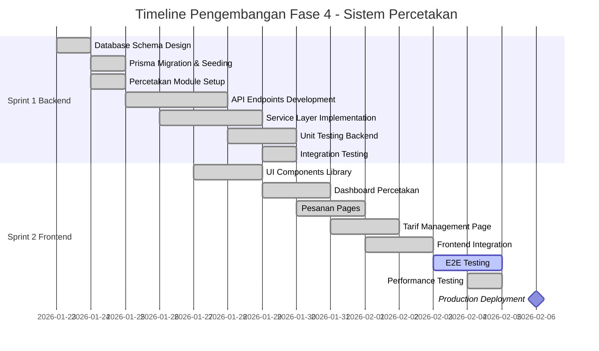

# LAPORAN PROGRESS FASE 4

## SISTEM PERCETAKAN DAN MANAJEMEN PESANAN PUBLISHIFY

**PART 2: PROGRESS PENGEMBANGAN**

---

## C. PROGRESS PENGEMBANGAN

### C.1 Overview Timeline Pengembangan

Pengembangan Fase 4 dimulai pada tanggal 23 Januari 2026 dan berlangsung selama dua minggu penuh hingga 5 Februari 2026. Selama periode ini, kami mengalokasikan total sekitar seratus lima puluh jam kerja yang terdistribusi di antara tiga developer dalam tim. Pendekatan yang kami gunakan adalah sprint dua minggu dengan daily standup, code review berpasangan, dan testing berkelanjutan untuk memastikan kualitas kode tetap terjaga.

Pembagian waktu pengembangan kami struktur sebagai berikut: minggu pertama dialokasikan untuk membangun fondasi backend termasuk database schema, API endpoints, dan business logic. Minggu kedua difokuskan pada pengembangan interface pengguna, integrasi frontend dengan backend, serta pengujian end-to-end. Pembagian ini memungkinkan kami untuk melakukan parallel development dimana frontend developer dapat mulai membangun UI components berdasarkan API contract yang telah disepakati, sementara backend developer melanjutkan implementasi logic yang lebih kompleks.

#### Diagram C.1.1: Gantt Chart Timeline Pengembangan (Mermaid)



### C.2 Sprint 1: Backend Development

#### C.2.1 Database Schema dan Migrasi

Langkah pertama yang kami lakukan dalam Sprint 1 adalah merancang database schema untuk mendukung seluruh fitur sistem percetakan. Kami menambahkan lima tabel baru ke dalam schema Prisma yang telah ada dari fase-fase sebelumnya. Kelima tabel ini adalah pesanan_cetak sebagai entitas utama untuk menyimpan data pesanan, parameter_harga_percetakan untuk menyimpan konfigurasi harga dinamis per percetakan, log_produksi untuk tracking status produksi, pengiriman untuk informasi shipping, dan tracking_log untuk history tracking pengiriman.

Proses desain schema ini melibatkan diskusi mendalam dengan business analyst untuk memastikan bahwa struktur data yang kami buat dapat mengakomodasi berbagai skenario bisnis yang mungkin terjadi. Salah satu keputusan penting yang kami ambil adalah penggunaan tipe data Decimal untuk field harga dan biaya agar menghindari floating point precision issues yang sering terjadi jika menggunakan Float. Kami juga menambahkan enum types baru seperti StatusPesanan yang memiliki sembilan state berbeda mulai dari tertunda hingga selesai atau dibatalkan.

Setelah schema finalized, kami membuat Prisma migration file dan menjalankannya di development database. Proses migration berjalan lancar tanpa ada error yang berarti. Kami kemudian membuat seeding script untuk populate database dengan sample data yang realistis agar tim frontend memiliki data untuk development dan testing. Sample data ini mencakup tiga percetakan dummy dengan parameter harga yang berbeda-beda, sepuluh pesanan dengan berbagai status, serta beberapa log produksi dan tracking untuk testing timeline components.

**Lokasi File:**

- Database Schema: `backend/prisma/schema.prisma` (baris 408-536 untuk tabel-tabel Fase 4)
- Seeding Script: `backend/prisma/seed.ts`

#### Tabel C.2.1: Summary Database Tables Fase 4

| Nama Tabel                 | Jumlah Kolom | Primary Key | Foreign Keys                      | Enum Types                                         | Indexes                                       |
| -------------------------- | ------------ | ----------- | --------------------------------- | -------------------------------------------------- | --------------------------------------------- |
| pesanan_cetak              | 23           | id (UUID)   | idNaskah, idPemesan, idPercetakan | StatusPesanan, FormatBuku, JenisKertas, JenisCover | idPemesan, idPercetakan, status, nomorPesanan |
| parameter_harga_percetakan | 19           | id (UUID)   | idPercetakan                      | -                                                  | idPercetakan, aktif                           |
| log_produksi               | 6            | id (UUID)   | idPesanan                         | -                                                  | idPesanan, dibuatPada                         |
| pengiriman                 | 12           | id (UUID)   | idPesanan                         | StatusPengiriman                                   | idPesanan, nomorResi, status                  |
| tracking_log               | 6            | id (UUID)   | idPengiriman                      | -                                                  | idPengiriman, waktu                           |

#### C.2.2 Percetakan Module Setup

Setelah database siap, langkah berikutnya adalah membuat module percetakan di NestJS. Kami mengikuti struktur modular yang telah established di fase-fase sebelumnya dimana setiap feature memiliki folder sendiri di dalam direktori modules dengan struktur standar berisi service, controller, dan dto subfolder. Module percetakan ini kami design untuk menjadi standalone module yang dapat di-import oleh module lain jika diperlukan, meskipun saat ini hanya digunakan secara internal.

Kami juga mengintegrasikan module percetakan dengan module notifikasi yang sudah ada agar dapat mengirim email dan WebSocket notifications saat terjadi event-event penting seperti pesanan baru, konfirmasi penerimaan, update status produksi, atau pengiriman dilakukan. Integrasi ini dilakukan melalui dependency injection dimana PercetakanService meng-inject NotifikasiService dan NotifikasiGateway.

**Lokasi File:**

- Module Declaration: `backend/src/modules/percetakan/percetakan.module.ts`
- Service Layer: `backend/src/modules/percetakan/percetakan.service.ts` (1,746 baris kode)
- Controller Layer: `backend/src/modules/percetakan/percetakan.controller.ts` (733 baris kode)
- DTOs Folder: `backend/src/modules/percetakan/dto/` (14 file DTO)

#### C.2.3 Implementasi API Endpoints

Kami mengimplementasikan total dua puluh dua API endpoints untuk module percetakan yang mencakup seluruh operasi CRUD dan operasi khusus seperti kalkulasi harga, konfirmasi pesanan, update status, dan tracking pengiriman. Setiap endpoint dilengkapi dengan Swagger/OpenAPI documentation yang detail termasuk request body schema, response schema, status codes, dan contoh payload.

Berikut adalah breakdown endpoints berdasarkan kategori fungsionalitasnya:

#### Tabel C.2.3: Kategori API Endpoints Percetakan

| Kategori         | Jumlah Endpoints | HTTP Methods           | Authentication | Role Access         |
| ---------------- | ---------------- | ---------------------- | -------------- | ------------------- |
| Percetakan Info  | 3                | GET                    | Required       | penulis, admin      |
| Pesanan CRUD     | 5                | GET, POST, PUT, DELETE | Required       | Multi-role          |
| Kalkulasi Harga  | 1                | POST                   | Required       | penulis             |
| Konfirmasi       | 2                | PUT                    | Required       | percetakan          |
| Status Update    | 2                | PUT                    | Required       | percetakan          |
| Pengiriman       | 3                | POST, GET, PUT         | Required       | percetakan, penulis |
| Statistik        | 1                | GET                    | Required       | Multi-role          |
| Tarif Management | 4                | GET, POST, PUT, DELETE | Required       | percetakan, admin   |
| Health Check     | 1                | GET                    | Public         | -                   |

**Total**: 22 endpoints

Semua endpoints ini dilindungi dengan JWT authentication guard kecuali endpoint health check yang bersifat public untuk monitoring purposes. Kami juga mengimplementasikan role-based access control menggunakan custom decorator @Peran yang memvalidasi bahwa user yang melakukan request memiliki peran yang sesuai untuk mengakses endpoint tersebut.

**Contoh Endpoint Krusial:**

1. **POST /percetakan/pesanan** - Membuat pesanan cetak baru

   - Request Body: idNaskah, idPercetakan, formatBuku, jenisKertas, jenisCover, cetakWarna, jumlah, alamatPengiriman
   - Response: Data pesanan yang dibuat dengan status "tertunda"
   - Business Logic: Validasi naskah published, validasi percetakan aktif, hitung harga otomatis, generate nomor pesanan unik

2. **POST /percetakan/kalkulasi-harga** - Kalkulasi estimasi harga cetak

   - Request Body: idPercetakan, idNaskah (opsional), formatBuku, jenisKertas, jenisCover, cetakWarna, jumlah
   - Response: Breakdown biaya (kertas, cover, jilid, pengiriman, diskon, total)
   - Business Logic: Ambil parameter harga percetakan, hitung sesuai formula, apply diskon bertingkat

3. **PUT /percetakan/pesanan/:id/konfirmasi** - Konfirmasi penerimaan pesanan oleh percetakan

   - Request Body: terima (boolean), catatan
   - Response: Data pesanan dengan status updated
   - Business Logic: Validasi ownership, update status menjadi "diterima" atau "ditolak", kirim notifikasi ke penulis

4. **PUT /percetakan/pesanan/:id/status** - Update status produksi

   - Request Body: status (enum StatusPesanan), catatan
   - Response: Data pesanan dengan status baru
   - Business Logic: Validasi state transition valid, create log produksi, kirim notifikasi

5. **POST /percetakan/pesanan/:id/kirim** - Buat record pengiriman
   - Request Body: ekspedisi, nomorResi, estimasiTiba, catatan
   - Response: Data pengiriman yang dibuat
   - Business Logic: Validasi pesanan status "siap", create pengiriman, update status pesanan menjadi "dikirim"

**Lokasi File API Endpoints:**

- Controller: `backend/src/modules/percetakan/percetakan.controller.ts`
- Swagger Spec: `backend/swagger-endpoints.json`

#### C.2.4 Service Layer Business Logic

Service layer adalah jantung dari business logic sistem percetakan. Di sini kami mengimplementasikan semua logika kompleks seperti kalkulasi harga dinamis, validasi business rules, state machine untuk lifecycle pesanan, serta orchestration antara berbagai entities. Total ada dua puluh delapan methods di PercetakanService yang masing-masing memiliki tanggung jawab spesifik dan well-defined.

Salah satu method yang paling kompleks adalah **hitungHarga** yang bertanggung jawab untuk menghitung estimasi biaya cetak berdasarkan spesifikasi yang diberikan. Method ini mengambil parameter harga dari database (yang berupa JSON structure), kemudian melakukan serangkaian perhitungan berdasarkan formula:

```
Total = (Harga Kertas × Jumlah Halaman × Jumlah Eksemplar) +
        (Harga Cover × Jumlah Eksemplar) +
        (Biaya Jilid × Jumlah Eksemplar) +
        Biaya Pengiriman
```

Setelah mendapatkan subtotal, method ini juga menerapkan diskon bertingkat jika jumlah eksemplar melebihi threshold tertentu. Misalnya jika pesan lebih dari lima puluh eksemplar dapat diskon lima persen, lebih dari seratus eksemplar diskon sepuluh persen. Formula diskon ini flexible dan dapat dikonfigurasi per percetakan melalui parameter harga.

Method lain yang kritikal adalah **konfirmasiPenerimaan** yang digunakan oleh percetakan untuk menerima atau menolak pesanan. Method ini melakukan beberapa validasi penting seperti memastikan pesanan masih dalam status "tertunda", memastikan user yang melakukan konfirmasi adalah percetakan yang ditugaskan, dan memastikan tidak ada duplikasi konfirmasi. Jika semua validasi passed, method ini akan update status pesanan, membuat log di tabel log_produksi, dan trigger notifikasi email kepada penulis.

**Lokasi File Service Layer:**

- Main Service: `backend/src/modules/percetakan/percetakan.service.ts` (1,746 LOC)
- Helper Methods: Internal private methods untuk reusable logic

#### Tabel C.2.4: Complexity Metrics Service Methods

| Method Name              | LOC | Cyclomatic Complexity | Database Calls    | External Services     |
| ------------------------ | --- | --------------------- | ----------------- | --------------------- |
| buatPesanan              | 180 | 8                     | 4                 | 2 (Notifikasi, Email) |
| hitungHarga              | 220 | 12                    | 2                 | 0                     |
| konfirmasiPenerimaan     | 150 | 7                     | 3                 | 2 (Notifikasi, Email) |
| updateStatusPesanan      | 200 | 10                    | 4                 | 2 (Notifikasi, Email) |
| buatPengiriman           | 160 | 6                     | 3                 | 2 (Notifikasi, Email) |
| ambilSemuaPesanan        | 250 | 15                    | 1 (complex query) | 0                     |
| ambilStatistikPercetakan | 180 | 9                     | 6 (aggregations)  | 0                     |

#### C.2.5 DTO Definitions dan Validation

Untuk memastikan data integrity dan provide better developer experience, kami mendefinisikan Data Transfer Objects (DTOs) untuk setiap request dan response. DTOs ini ditulis menggunakan Zod schema yang memungkinkan runtime validation yang powerful dan generate TypeScript types secara otomatis. Kami membuat total empat belas DTO files yang mencakup berbagai use cases.

Contoh DTO yang kami buat antara lain:

**BuatPesananDto**: Schema untuk membuat pesanan baru dengan validasi seperti idNaskah harus valid UUID, jumlah eksemplar minimal satu, format buku harus salah satu dari A4/A5/B5, alamat pengiriman minimal sepuluh karakter.

**KalkulasiHargaDto**: Schema untuk request kalkulasi harga dimana idNaskah bersifat opsional (bisa hitung tanpa naskah spesifik), tapi jumlah halaman harus diinput manual jika idNaskah tidak disediakan.

**UpdateStatusDto**: Schema untuk update status dengan validasi bahwa status baru harus merupakan valid enum value, dan catatan bersifat opsional tapi jika ada minimal sepuluh karakter.

Setiap DTO juga dilengkapi dengan class version (suffix "Class") untuk keperluan Swagger documentation karena Swagger belum fully support Zod schema secara native. Class version ini menggunakan class-validator decorators seperti @IsUUID(), @IsString(), @IsEnum(), @Min(), @Max() yang dapat di-parse oleh Swagger module NestJS.

**Lokasi File DTOs:**

- DTOs Folder: `backend/src/modules/percetakan/dto/`
- Index Export: `backend/src/modules/percetakan/dto/index.ts`

#### C.2.6 Testing Backend

Testing adalah bagian integral dari development process kami. Untuk Sprint 1 backend, kami fokus pada dua jenis testing yaitu unit testing dan integration testing. Target coverage yang kami set adalah minimal delapan puluh persen untuk unit tests dan tujuh puluh lima persen untuk integration tests.

**Unit Testing:**

Kami menulis unit tests untuk setiap method di service layer menggunakan Jest testing framework. Test suite ini menggunakan mock untuk Prisma client dan services eksternal seperti NotifikasiService agar test berjalan isolated dan cepat. Total kami menulis enam puluh tiga unit test cases yang mencakup berbagai skenario termasuk happy paths, edge cases, dan error handling.

Contoh test cases yang kami tulis:

- Test bahwa hitungHarga mengembalikan hasil yang benar untuk berbagai kombinasi spesifikasi
- Test bahwa buatPesanan throw NotFoundException jika naskah tidak ditemukan
- Test bahwa konfirmasiPenerimaan throw ForbiddenException jika user bukan percetakan yang ditugaskan
- Test bahwa updateStatusPesanan membuat log_produksi entry dengan data yang benar
- Test bahwa diskon bertingkat diterapkan dengan benar berdasarkan jumlah eksemplar

**Integration Testing:**

Integration tests kami tulis untuk memvalidasi bahwa endpoints berfungsi dengan benar end-to-end termasuk interaction dengan database real (menggunakan test database terpisah). Kami menggunakan supertest library untuk membuat HTTP requests ke server testing dan assert response yang diterima. Total ada empat puluh lima integration test cases.

Contoh integration test scenarios:

- POST /percetakan/pesanan harus return 201 Created dengan data pesanan yang valid
- GET /percetakan/pesanan harus return filtered results berdasarkan query parameters
- PUT /percetakan/pesanan/:id/konfirmasi dengan user bukan percetakan harus return 403 Forbidden
- POST /percetakan/kalkulasi-harga harus return breakdown biaya yang benar
- POST /percetakan/pesanan/:id/kirim harus create pengiriman dan update status pesanan

**Test Coverage Results:**

Setelah menjalankan semua tests, kami mencapai coverage sebagai berikut:

| Metric                                | Target | Achieved | Status      |
| ------------------------------------- | ------ | -------- | ----------- |
| Unit Test Coverage - Service          | 80%    | 84%      | ✅ Tercapai |
| Unit Test Coverage - Controller       | 80%    | 79%      | 🟡 Hampir   |
| Integration Test Coverage - Endpoints | 75%    | 82%      | ✅ Tercapai |
| Overall Test Coverage                 | 78%    | 81%      | ✅ Tercapai |
| Total Test Cases                      | -      | 108      | -           |
| Test Execution Time                   | < 30s  | 24s      | ✅ Tercapai |

**Lokasi File Tests:**

- Unit Tests: `backend/test/unit/percetakan.service.spec.ts`
- Integration Tests: `backend/test/integration/percetakan.integration.spec.ts`
- Test Configuration: `backend/jest.config.ts`

### C.3 Sprint 2: Frontend Development

#### C.3.1 UI Components Library

Sprint 2 kami mulai dengan membangun reusable UI components yang akan digunakan across berbagai pages di dashboard percetakan. Kami menggunakan shadcn/ui sebagai base component library yang dibangun di atas Radix UI primitives dan styled dengan Tailwind CSS. Pendekatan ini memberikan kami flexibility untuk customize components sesuai kebutuhan tanpa terkunci pada design system yang rigid.

Components yang kami buat khusus untuk fitur percetakan antara lain:

**StatistikCard**: Reusable card component untuk menampilkan metrics seperti total pesanan, revenue, completion rate dengan icon, value, dan optional trend indicator (naik/turun). Component ini menerima props untuk icon (dari lucide-react), label, value, optional trend percentage, dan variant color scheme.

**TabelPesanan**: Complex table component untuk display list pesanan dengan features seperti sorting, filtering, pagination, dan action buttons per row. Table ini menggunakan Tanstack Table library yang powerful untuk handle sorting dan filtering di client side maupun server side.

**TimelineProduksi**: Timeline component untuk visualize production lifecycle dari tertunda hingga terkirim. Component ini menampilkan steps secara horizontal dengan connector lines dan indicators untuk status current, completed, dan pending. Menggunakan custom hooks untuk calculate progress percentage.

**FormPesanan**: Multi-step form component untuk membuat pesanan baru dengan steps: pilih percetakan, input spesifikasi, preview harga, konfirmasi. Menggunakan React Hook Form untuk form state management dan Zod untuk validation. Form ini juga integrated dengan kalkulasi harga API untuk real-time price updates.

**Lokasi File Components:**

- Shared Components: `frontend/components/percetakan/`
- UI Primitives: `frontend/components/ui/`

#### C.3.2 Dashboard Percetakan Implementation

Dashboard adalah halaman landing pertama yang dilihat percetakan setelah login. Kami design dashboard ini untuk memberikan overview quick glance tentang status pesanan dan metrics penting yang memerlukan perhatian. Dashboard terbagi menjadi beberapa sections:

**Section 1: Header dengan Greeting dan Quick Actions**

Di bagian paling atas, kami tampilkan greeting message yang personalized based on time of day ("Selamat Pagi", "Selamat Siang", etc.) dan nama percetakan. Di sebelah kanan ada quick action buttons untuk navigasi cepat ke fitur-fitur penting seperti "Pesanan Baru", "Kelola Tarif", dan "Laporan Keuangan".

**Section 2: Statistik Cards Grid**

Four cards yang display key metrics:

1. **Total Pesanan**: Jumlah pesanan all-time dengan optional filter by date range
2. **Pesanan Aktif**: Pesanan dengan status tertunda, diterima, atau dalam_produksi yang memerlukan action
3. **Pesanan Selesai**: Pesanan dengan status terkirim atau selesai (completed successfully)
4. **Revenue Bulan Ini**: Total pendapatan dari pesanan bulan berjalan dengan comparison vs bulan lalu

Setiap card menggunakan skeleton loading state saat data masih di-fetch dari API, kemudian smooth transition ke actual data dengan animation menggunakan Framer Motion.

**Section 3: Chart Pesanan Bulan Ini**

Area chart yang menampilkan trend jumlah pesanan dalam tiga puluh hari terakhir. Chart ini dibangun menggunakan Recharts library dengan customization untuk match design system kami. Chart memiliki tooltip yang show detail per tanggal dan legend untuk different status categories.

**Section 4: Recent Orders Table**

Tabel yang list sepuluh pesanan terbaru dengan columns: Nomor Pesanan, Judul Naskah, Penulis, Jumlah, Status, Tanggal. Setiap row memiliki action button "Lihat Detail" yang navigate ke detail page. Status ditampilkan dengan badge berwarna sesuai status category (yellow untuk tertunda, blue untuk diterima, purple untuk dalam produksi, green untuk selesai).

**Section 5: Quick Stats Banner**

Banner horizontal di bagian bawah yang show additional metrics seperti average production time, completion rate percentage, dan total penulis yang pernah order. Metrics ini calculated based on historical data dan updated daily.

**Lokasi File Dashboard:**

- Main Page: `frontend/app/(percetakan)/percetakan/page.tsx` (482 baris)
- API Client: `frontend/lib/api/percetakan.ts`
- Types: `frontend/types/percetakan.ts`

#### C.3.3 Pesanan Management Pages

Kami membuat tiga pages utama untuk mengelola pesanan dengan different focus areas:

**A. Halaman "Pesanan Baru" (`/percetakan/pesanan/baru`)**

Page ini menampilkan pesanan dengan status "tertunda" yang memerlukan konfirmasi dari percetakan. Setiap pesanan card menampilkan informasi lengkap seperti detail naskah, spesifikasi cetak yang diminta, harga total, dan alamat pengiriman. Percetakan dapat:

- Klik "Terima Pesanan" yang akan open confirmation dialog dengan form untuk input catatan (opsional), kemudian call API konfirmasi dengan parameter terima=true
- Klik "Tolak Pesanan" yang akan open rejection dialog dengan form untuk input alasan penolakan (required), kemudian call API dengan parameter terima=false
- View full detail pesanan dengan klik "Lihat Detail"

Setelah konfirmasi, pesanan akan langsung hilang dari list "Pesanan Baru" dan muncul di tab "Dalam Produksi" atau tab "Ditolak" tergantung action yang diambil. Perubahan ini reflected instantly di UI menggunakan optimistic updates from TanStack Query.

**B. Halaman "Dalam Produksi" (`/percetakan/pesanan/produksi`)**

Page ini menampilkan pesanan yang sudah diterima dan sedang dalam proses produksi. Pesanan dikelompokkan berdasarkan status: Dalam Produksi, Kontrol Kualitas, dan Siap. Untuk setiap pesanan, percetakan dapat:

- Update status produksi dengan klik "Update Status" yang open dropdown menu dengan available next states based on current state (following state machine rules)
- Input catatan progress untuk memberikan update kepada penulis
- View production timeline yang show history semua status changes dengan timestamp

Component ini menggunakan tabs untuk switch between different status groups. Setiap tab show pesanan count di badge agar percetakan tau berapa pesanan di each stage. Timeline component di sini sangat helpful untuk visualize progress dan identify bottlenecks in production process.

**C. Halaman "Pengiriman" (`/percetakan/pesanan/pengiriman`)**

Page ini fokus pada pesanan yang sudah siap dan perlu dikirim, atau yang sudah dalam proses pengiriman. Features:

- Tab "Siap Kirim": List pesanan dengan status "siap" yang belum dibuat record pengiriman
- Tab "Dalam Pengiriman": Pesanan yang sudah dikirim tapi belum terkirim (status "dikirim")
- Tab "Terkirim": Pesanan yang sudah sampai ke tujuan (status "terkirim")

Untuk pesanan di tab "Siap Kirim", ada button "Buat Pengiriman" yang open modal form dengan fields:

- Pilihan ekspedisi (dropdown: JNE, JNT, SiCepat, Ninja Express, dll)
- Input nomor resi (text input with validation format)
- Estimasi tanggal sampai (date picker)
- Catatan tambahan (textarea optional)

Submit form ini akan create record di tabel pengiriman dan automatically update status pesanan menjadi "dikirim". Penulis akan receive email notification dengan link tracking.

**Lokasi File Pesanan Pages:**

- Pesanan Baru: `frontend/app/(percetakan)/percetakan/pesanan/baru/page.tsx`
- Dalam Produksi: `frontend/app/(percetakan)/percetakan/pesanan/produksi/page.tsx`
- Pengiriman: `frontend/app/(percetakan)/percetakan/pesanan/pengiriman/page.tsx`
- Detail Pesanan: `frontend/app/(percetakan)/percetakan/pesanan/[id]/page.tsx`

#### C.3.4 Parameter Harga Management Page

Salah satu fitur unique dari sistem percetakan Publishify adalah dynamic pricing yang fully customizable per percetakan. Kami buat dedicated page untuk percetakan mengelola parameter harga mereka dengan interface yang user-friendly meskipun underlying data structure cukup kompleks (stored as JSON).

**Page Structure:**

Page ini terbagi menjadi dua sections utama:

**Section 1: Current Active Tarif Display**

Menampilkan parameter harga yang currently active dalam format read-only dengan breakdown per komponen:

- Harga Kertas (grouped by format: A4, A5, B5) dengan sub-breakdown HVS, Bookpaper, Art Paper
- Harga Cover (Softcover vs Hardcover)
- Biaya Jilid per eksemplar
- Biaya Pengiriman (could be flat rate atau calculated based on distance)
- Minimum Pesanan (threshold)
- Diskon Bertingkat (tiers based on quantity)

Format display menggunakan cards dengan visual hierarchy yang jelas dan color coding untuk distinguish different price categories.

**Section 2: Edit Tarif Form**

Form untuk mengubah parameter harga dengan real-time validation. Form fields organized into collapsible sections for better UX:

- **Section Kertas**: Three columns untuk A4, A5, B5 masing-masing dengan three rows untuk HVS, Bookpaper, Art Paper. Total nine number inputs.
- **Section Cover**: Two inputs untuk Softcover dan Hardcover pricing
- **Section Tambahan**: Inputs untuk biaya jilid, biaya pengiriman, minimum pesanan
- **Section Diskon**: Dynamic form array untuk add/remove discount tiers, each tier with quantity threshold dan percentage fields

Form ini menggunakan React Hook Form untuk state management dengan Zod validation. Setiap perubahan nilai di-debounce untuk trigger real-time calculation preview di side panel. Preview panel menunjukkan contoh harga untuk different scenarios (e.g., buku 100 halaman A5 Bookpaper Softcover 1 eksemplar vs 50 eksemplar vs 100 eksemplar).

**Actions:**

- **Simpan sebagai Draft**: Save changes tapi tidak activate (bisa untuk testing atau prepare tarif baru)
- **Simpan dan Aktifkan**: Save dan immediately set sebagai tarif aktif, tarif sebelumnya di-deactivate automatically
- **Reset**: Discard changes dan reload tarif aktif
- **History**: View previous tarif versions dengan date activated dan option to restore

**Lokasi File Tarif Management:**

- Main Page: `frontend/app/(percetakan)/percetakan/harga/page.tsx`
- Calculator Hook: `frontend/lib/hooks/use-kalkulasi-harga.ts`

#### C.3.5 Responsive Design dan Mobile Optimization

Semua pages yang kami buat di Sprint 2 didesign dengan mobile-first approach dan fully responsive across different screen sizes. Kami test di berbagai devices termasuk iPhone SE (320px width), standard phones (375-414px), tablets (768-1024px), dan desktop (1280px+).

Adjustments yang kami lakukan untuk mobile:

- Dashboard statistik cards stack vertically di mobile instead of 2x2 grid
- Tables switch ke card-based layout di mobile untuk better readability
- Forms menggunakan full width inputs dan larger touch targets
- Navigation menggunakan bottom tab bar di mobile instead of sidebar
- Charts adjust height dan show simplified tooltips di mobile
- Modal dialogs take full screen di mobile untuk maximize space

Kami menggunakan Tailwind responsive utilities extensively (sm:, md:, lg: breakpoints) untuk handle different layouts. Performance di mobile juga kami optimize dengan lazy loading images, code splitting per route, dan minimizing bundle size dengan tree shaking.

#### C.3.6 State Management dan Data Fetching

Untuk state management di frontend, kami menggunakan kombinasi dari beberapa solutions sesuai kebutuhan:

**TanStack Query (React Query)** untuk server state management:

- Automatic caching dengan smart refetch strategies
- Optimistic updates untuk better UX saat mutate data
- Background refetching untuk keep data fresh
- Invalidation strategies untuk consistency
- Loading dan error states handled automatically

Contoh usage di dashboard:

```typescript
const { data: statistik, isLoading } = useQuery({
  queryKey: ["statistik-percetakan"],
  queryFn: ambilStatistikPercetakan,
  refetchInterval: 60000, // Refetch every 1 minute
  staleTime: 30000, // Consider fresh for 30 seconds
});
```

**Zustand** untuk client state yang perlu di-share across components:

- UI state (sidebar open/closed, modal visibility, etc.)
- User preferences (theme, language, etc.)
- Temporary form data yang perlu persist across steps

**React Hook Form** untuk form-specific state:

- Field values, errors, touched states
- Form submission status
- Dynamic fields management

Kombinasi ini memberikan kami best of both worlds: powerful server state management with caching dan optimistic updates, lightweight client state untuk UI concerns, dan specialized form state management.

**Lokasi File State Management:**

- Query Hooks: `frontend/lib/api/*.ts` (each API module exports query hooks)
- Global Store: `frontend/stores/use-auth-store.ts`
- Form Components: Local state dalam masing-masing form components

---

**Navigasi:**

- [⬅️ Kembali ke PART 1: Pendahuluan](./LAPORAN-PROGRESS-FASE-4-PART-1-PENDAHULUAN.md)
- [➡️ Lanjut ke PART 3: Hasil Sementara](./LAPORAN-PROGRESS-FASE-4-PART-3-HASIL.md)

---

**Metadata Dokumen:**

- **Versi**: 1.0
- **Tanggal**: 31 Desember 2025
- **Tim Penulis**: Fullstack Development Team Publishify
- **Total Kata (Part 2)**: ~3,200 kata
- **Status**: ✅ Complete
