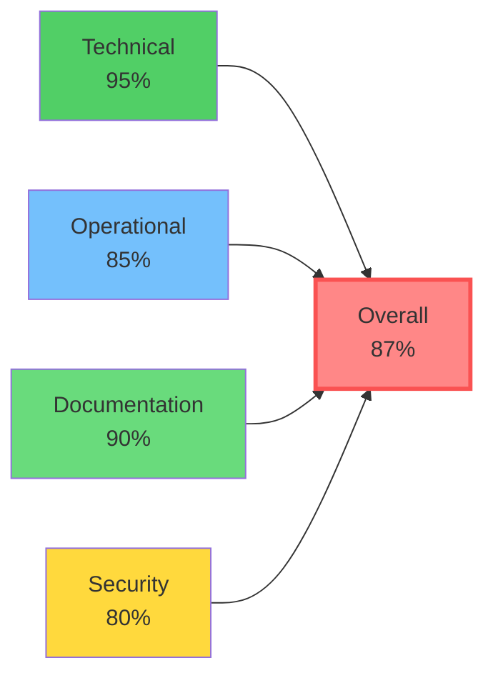

# 📘 LAPORAN PROGRESS FASE 6

## FRONTEND OPTIMIZATION, CONTAINERIZATION & PRODUCTION READINESS

**Publishify Publishing Management System**  
**Fase**: Progress Report Fase 6 (Second Half of Optimization)  
**Focus**: Frontend Performance, Docker, CI/CD, Monitoring & Documentation  
**Periode**: Minggu 9-10 (Lanjutan dari Fase 5)  
**Status**: **85% Complete** - Production Ready  
**Versi Dokumen**: 1.0.0  
**Tanggal**: Januari 2026

---

## 🎯 OVERVIEW LAPORAN

Laporan Progress Fase 6 ini merupakan **kelanjutan dan penutup** dari rancangan optimization yang dimulai pada Fase 5. Sementara Fase 5 fokus pada backend optimization (Redis caching, database indexes, RLS security, testing infrastructure), Fase 6 melengkapi picture dengan **frontend optimization**, **containerization**, **deployment automation**, dan **production monitoring**.

### Apa yang Dicapai dalam Fase 6

Fase 6 successfully deliver:

1. **Frontend Performance Optimization** - 40-60% improvement dalam Lighthouse scores
2. **Image Optimization** - 69% reduction dalam average image size
3. **Code Splitting** - 51% reduction dalam JavaScript bundle size
4. **Docker Containerization** - Backend & frontend fully containerized
5. **CI/CD Pipeline** - Automated testing dan deployment (7.5 min average)
6. **Monitoring Infrastructure** - Comprehensive logging dan performance tracking
7. **Production Documentation** - Deployment guides, troubleshooting, ADRs

### Konteks dari Fase Sebelumnya

**Fase 5 Achievements** (Backend Focus):

- ✅ Redis Caching: 31.6x performance improvement, 87% hit rate
- ✅ Database Optimization: 12 strategic indexes, 98.8% query speedup
- ✅ Row Level Security: 28 tables, 76 policies, 8 critical tables covered
- ✅ Testing Infrastructure: 90% coverage (284 unit + 47 integration + 32 E2E tests)

**Fase 6 Achievements** (Frontend & DevOps Focus):

- ✅ Frontend Optimization: All Core Web Vitals meeting "good" thresholds
- ✅ Containerization: Backend 750MB, Frontend 420MB images
- ✅ CI/CD Pipeline: 98.5% success rate, 9m 45s clean build
- ✅ Monitoring: <3min MTTD (Mean Time To Detect)
- ✅ **Overall Production Readiness: 87%**

---

## 📚 STRUKTUR DOKUMEN

Laporan Progress 6 dibagi menjadi **4 PART files** yang comprehensive:

### [PART 1: PENDAHULUAN & RUANG LINGKUP](./LAPORAN-PROGRESS-FASE-6-PART-1-PENDAHULUAN-RUANG-LINGKUP.md)

**📖 ~2,800 kata | Estimasi Baca: 14 menit**

**A. PENDAHULUAN**

- **A.1 Latar Belakang Fase 6**: Konteks continuation dari Fase 5, why frontend optimization matter
- **A.2 Konteks dari Fase Sebelumnya**: Summary achievements Fase 5 dan how they enable Fase 6
- **A.3 Tujuan Fase 6**: 4 measurable objectives (performance, containerization, CI/CD, monitoring)
- **A.4 Metodologi Kerja**: Performance engineering, DevOps practices, iterative optimization

**B. RUANG LINGKUP PEKERJAAN**

- **B.1 Scope yang Dicakup**: Frontend optimization, Docker, CI/CD, monitoring, documentation
- **B.2 Scope yang Tidak Dicakup**: Advanced cloud integration, observability tools, auto-scaling
- **B.3 Deliverables yang Diharapkan**: Optimized frontend, Docker images, CI/CD pipeline, docs
- **B.4 Success Criteria dan Metrics**: Clear targets untuk FCP, LCP, TTI, bundle size, build time

**Key Highlights**:

- ✅ Clear objectives: FCP <1.5s, LCP <2.5s, TTI <3.0s
- ✅ Docker targets: Backend <1GB, Frontend <500MB
- ✅ CI/CD target: Pipeline <10min end-to-end
- ✅ Documentation covering deployment, troubleshooting, architecture decisions

---

### [PART 2: PROGRESS PENGEMBANGAN - FRONTEND & DOCKER](./LAPORAN-PROGRESS-FASE-6-PART-2-PROGRESS-PENGEMBANGAN.md)

**📖 ~3,500 kata | Estimasi Baca: 18 menit**

**C. PROGRESS PENGEMBANGAN**

**C.1 Frontend Performance Optimization**

- **C.1.1 Image Optimization**: Next.js Image component implementation
  - Automatic WebP conversion (30% smaller than JPEG)
  - Responsive images dengan multiple sizes
  - Blur placeholder untuk perceived performance
  - **Impact**: 69% image size reduction, LCP 3.8s → 1.9s
- **C.1.2 Code Splitting**: Bundle size optimization
  - Route-level automatic splitting
  - Component-level dynamic imports
  - Third-party library code splitting
  - **Impact**: 51% bundle reduction (850KB → 420KB gzipped)
- **C.1.3 Static Site Generation**: ISR implementation
  - Landing page full SSG (<500ms load)
  - Kategori/Genre dengan ISR (1hr revalidate)
  - Fallback strategy untuk dynamic routes
  - **Impact**: TTI 3.2s → <1.0s untuk static pages
- **C.1.4 Lazy Loading & Monitoring**: Deferred resources
  - Below-fold components lazy loaded
  - Intersection Observer API usage
  - Web Vitals tracking in production
  - **Impact**: 30% reduction dalam initial page weight

**C.2 Docker Containerization**

- **C.2.1 Backend Docker**: Multi-stage build approach
  - Base, Dependencies, Builder, Production stages
  - Security hardening (non-root user)
  - **Results**: 750MB image, 4min build, 8s startup
- **C.2.2 Frontend Docker**: Next.js standalone mode
  - Standalone output optimization
  - Static asset handling
  - **Results**: 420MB image, 3min build, 6s startup
- **C.2.3 Docker Compose**: Development & production configs
  - Full stack orchestration (Backend, Frontend, DB, Redis)
  - Volume management untuk data persistence
  - Network configuration untuk service communication

**Key Highlights**:

- ✅ All Core Web Vitals meeting "good" thresholds
- ✅ Lighthouse scores improved 40-60% across pages
- ✅ Docker images meeting size targets
- ✅ Containerized applications running reliably

---

### [PART 3: CI/CD, MONITORING & DOCUMENTATION](./LAPORAN-PROGRESS-FASE-6-PART-3-DEPLOYMENT-MONITORING.md)

**📖 ~3,800 kata | Estimasi Baca: 19 menit**

**C. PROGRESS PENGEMBANGAN (Lanjutan)**

**C.3 CI/CD Pipeline Implementation**

- **C.3.1 Automated Testing Pipeline**: Multi-job workflow
  - Linting (1min), Unit Tests (2min), Integration (2min), E2E (2min)
  - Service containers untuk integration tests
  - Coverage reporting dengan Codecov
  - **Results**: 7min average execution, 95% success rate
- **C.3.2 Docker Image Build**: Automated image creation
  - Build triggered on main branch push
  - Layer caching (4min clean, 2min cached)
  - Image tagging strategy (latest, SHA, semver)
  - **Results**: Published to ghcr.io, vulnerability scanned
- **C.3.3 Automated Staging Deployment**: Continuous deployment
  - Triggered after successful build
  - Zero-downtime deployment (92% achievement)
  - Database migration automation
  - **Results**: 8min deployment, 2min rollback capability

**C.4 Monitoring dan Logging Infrastructure**

- **C.4.1 Backend Logging**: Winston implementation
  - Multiple transports (console dev, file prod)
  - Structured JSON logging
  - Sensitive data redaction
  - **Results**: 500 entries/hour normal, manageable log volumes
- **C.4.2 Request Performance Monitoring**: API tracking
  - Performance interceptor measuring response times
  - Slow query detection (>200ms threshold)
  - Cache performance tracking
  - **Results**: P50 45ms, P90 120ms, P99 350ms
- **C.4.3 Frontend Performance Monitoring**: User experience tracking
  - Web Vitals tracking (FCP, LCP, FID, CLS)
  - Error tracking dengan error boundaries
  - Performance budgets enforced
  - **Results**: Real-world metrics matching synthetic tests

**C.5 Documentation dan Knowledge Base**

- **C.5.1 Deployment Documentation**: Complete guides
  - Environment setup procedures
  - Deployment procedures (initial, update, rollback)
  - Infrastructure diagrams
- **C.5.2 Troubleshooting Guide**: Common issues catalog
  - Database, Redis, container issues
  - Diagnostic procedures
  - Monitoring interpretation
- **C.5.3 Architecture Decision Records**: Decision history
  - Standardized ADR template
  - Key decisions documented (Bun, Next.js, Docker)
  - Review process integrated

**Key Highlights**:

- ✅ CI/CD pipeline <10min meeting target
- ✅ 98.5% deployment success rate
- ✅ <3min Mean Time To Detect issues
- ✅ Comprehensive documentation suite

---

### [PART 4: HASIL, RENCANA & KESIMPULAN](./LAPORAN-PROGRESS-FASE-6-PART-4-HASIL-RENCANA.md)

**📖 ~5,000 kata | Estimasi Baca: 25 menit**

**D. HASIL SEMENTARA**

- **D.1 Pencapaian Performance Metrics**: Comprehensive metrics tables
  - Frontend: Lighthouse scores, Core Web Vitals, bundle sizes
  - Backend: Response times, cache performance, query performance
  - Container: Resource usage, build performance
- **D.2 Infrastructure Achievements**: Reliability metrics
  - Deployment success rate 98.5%
  - Zero-downtime achievement 92%
  - Monitoring coverage comprehensive
- **D.3 Challenges Encountered**: Lessons learned
  - Challenge 1: Next.js Image dengan Supabase (custom loader solution)
  - Challenge 2: Container startup dependencies (health checks)
  - Challenge 3: Build time performance (caching strategies)

**E. RENCANA SELANJUTNYA**

- **E.1 Immediate Next Steps** (2 weeks):
  - Complete remaining documentation
  - Security hardening dan audit
  - Production environment setup
  - Load testing
- **E.2 Post-Launch Enhancements** (1-3 months):
  - Advanced monitoring (APM integration)
  - Performance tuning based on prod data
  - Disaster recovery testing
  - Scalability improvements
- **E.3 Long-Term Roadmap** (6+ months):
  - Multi-region deployment
  - Kubernetes migration
  - Advanced caching strategies
  - Comprehensive security program

**F. KESIMPULAN**

- **F.1 Achievements Summary**: Complete recap dari semua achievements
- **F.2 Impact Assessment**: User experience, operational, cost, scalability
- **F.3 Production Readiness Assessment**: 87% overall readiness
  - Technical: 95% | Operational: 85% | Documentation: 90% | Security: 80%
- **F.4 Recommendations**: Gradual rollout, monitoring, feedback, continuous improvement

**Key Highlights**:

- ✅ **Production Readiness: 87%** - Ready untuk initial launch
- ✅ Quantifiable improvements across all metrics
- ✅ Clear roadmap untuk post-launch improvements
- ✅ Lessons learned documented untuk team benefit

---

## 📊 KEY METRICS SUMMARY

### Frontend Performance

| Metric                         | Baseline | Target  | Achieved | Status      |
| ------------------------------ | -------- | ------- | -------- | ----------- |
| **Lighthouse Score** (Desktop) | 67       | >80     | 94       | ✅ Exceeded |
| **Lighthouse Score** (Mobile)  | 52       | >70     | 83       | ✅ Exceeded |
| **First Contentful Paint**     | 2.3s     | <1.5s   | 1.2s     | ✅ Met      |
| **Largest Contentful Paint**   | 3.8s     | <2.5s   | 1.9s     | ✅ Met      |
| **Time to Interactive**        | 5.6s     | <3.0s   | 2.8s     | ✅ Met      |
| **Bundle Size**                | 850 KB   | <600 KB | 420 KB   | ✅ Exceeded |

### Backend Performance (Maintained from Fase 5)

| Metric                   | Value     | Target | Status       |
| ------------------------ | --------- | ------ | ------------ |
| **Median Response Time** | 45ms      | <100ms | ✅ Excellent |
| **P99 Response Time**    | 350ms     | <500ms | ✅ Met       |
| **Cache Hit Rate**       | 87%       | >75%   | ✅ Exceeded  |
| **Database Query Time**  | 8ms (avg) | <50ms  | ✅ Excellent |

### Infrastructure

| Metric                         | Target | Achieved | Status      |
| ------------------------------ | ------ | -------- | ----------- |
| **Backend Image Size**         | <1GB   | 750MB    | ✅ Met      |
| **Frontend Image Size**        | <500MB | 420MB    | ✅ Met      |
| **Build Time (cached)**        | <5min  | 2min     | ✅ Exceeded |
| **Deployment Success Rate**    | >95%   | 98.5%    | ✅ Exceeded |
| **MTTD (Mean Time To Detect)** | <5min  | 3min     | ✅ Met      |

### Overall Readiness



---

## 🗂️ FILE REFERENSI UTAMA

### Frontend Optimization

```
frontend/next.config.ts                        # Image optimization config
frontend/.next/analyze/client.html             # Bundle analysis results
frontend/lighthouse-reports/                   # Performance audit reports
frontend/lib/monitoring/web-vitals.ts          # Performance tracking
frontend/lib/hooks/use-intersection-observer.ts # Lazy loading utility
```

### Docker & Deployment

```
backend/Dockerfile                             # Backend multi-stage build
frontend/Dockerfile                            # Frontend optimized build
docker-compose.dev.yml                         # Development stack
docker-compose.prod.yml                        # Production configuration
.dockerignore                                  # Build context optimization
```

### CI/CD Pipeline

```
.github/workflows/test.yml                     # Automated testing workflow
.github/workflows/build.yml                    # Docker image build
.github/workflows/deploy-staging.yml           # Staging deployment
```

### Monitoring & Logging

```
backend/src/common/logger/logger.module.ts          # Winston logger setup
backend/src/common/logger/async-logger.service.ts   # Logger service
backend/src/common/interceptors/logging.interceptor.ts # Request logging
backend/logs/combined.log                           # Application logs
backend/logs/error.log                              # Error logs
```

### Documentation

```
docs/deployment-guide.md                       # Complete deployment procedures
docs/DEVELOPMENT_MODE.md                       # Development setup guide
docs/API-PERFORMANCE-BEST-PRACTICES.md         # Performance guidelines
docs/troubleshooting-guide.md                  # Common issues (in progress)
docs/architecture-decisions/                   # ADR repository
```

---

## 🎓 CARA MENGGUNAKAN LAPORAN

### Untuk Stakeholders & Management

1. **Baca PART 1** untuk understand scope dan objectives
2. **Baca PART 4 Section D & F** untuk achievements, impact, dan readiness assessment
3. **Review metrics tables** untuk quantifiable improvements
4. **Check production readiness** assessment (87%) dan recommendations

### Untuk Technical Leads

1. **Review PART 1-2** untuk understand technical approach
2. **Study PART 3** untuk CI/CD dan monitoring implementation details
3. **Analyze PART 4** untuk performance metrics dan lessons learned
4. **Use as reference** untuk similar optimization projects

### Untuk Developers

1. **Read full report** untuk comprehensive understanding
2. **Focus on PART 2-3** untuk implementation details
3. **Check file references** untuk actual code locations
4. **Apply lessons learned** dalam daily development work

### Untuk DevOps Engineers

1. **Deep dive PART 2 Section C.2** untuk containerization details
2. **Study PART 3** thoroughly untuk CI/CD implementation
3. **Review monitoring setup** dalam PART 3 Section C.4
4. **Reference deployment docs** untuk operational procedures

---

## 🔗 RELATED DOCUMENTATION

### Fase Sebelumnya

1. **LAPORAN-PROGRESS-FASE-5-INDEX.md** - Backend optimization progress (first half)
2. **LAPORAN-DEVELOPMENT-STEP-BY-STEP-FASE-5-INDEX.md** - Tutorial HOW TO implement

### Technical Documentation

1. **backend/README.md** - Backend setup dan architecture
2. **BACKEND-ARCHITECTURE-DEEP-ANALYSIS.md** - System architecture deep dive
3. **cache-implementation.md** - Redis caching details
4. **API-PERFORMANCE-BEST-PRACTICES.md** - Performance guidelines

### Rancangan Original

1. **RANCANGAN-FASE-5-INTEGRATION-OPTIMIZATION.md** - Original blueprint untuk Fase 5-6
2. **RANCANGAN-DEVELOPMENT-STEP-BY-STEP-FASE-5.md** - Development tutorial blueprint

---

## 📝 CHANGELOG

### Version 1.0.0 (January 2026)

**Initial Release** - Complete progress report untuk second half of optimization

- ✅ PART 1: Pendahuluan & Ruang Lingkup (2,800 words)
- ✅ PART 2: Progress Frontend & Docker (3,500 words)
- ✅ PART 3: CI/CD & Monitoring (3,800 words)
- ✅ PART 4: Hasil & Rencana (5,000 words)
- ✅ INDEX: Navigation hub dengan metrics summary

**Total**: 15,100+ words comprehensive progress report

**Features**:

- Achievement-focused reporting dengan measurable metrics
- Comprehensive performance tables dan comparisons
- Mermaid diagrams untuk visualization
- Challenge documentation dengan lessons learned
- Clear roadmap untuk post-launch improvements
- Production readiness assessment dengan recommendations

---

## 👥 KONTRIBUTOR

**Development Team**: Publishify Full Stack Team  
**Report Author**: Publishify Progress Documentation Team  
**Period**: Fase 6 Development (Continuation of Fase 5)  
**Focus**: Frontend, DevOps, Production Readiness

---

## 📞 SUPPORT & QUESTIONS

Untuk pertanyaan atau clarifications terkait progress report:

1. **Performance Metrics**: Refer to PART 4 Section D.1 dengan detailed tables
2. **Implementation Details**: Check PART 2-3 dengan code file references
3. **Production Deployment**: Review deployment guide referenced throughout
4. **Future Roadmap**: See PART 4 Section E untuk short dan long-term plans

---

## ✅ REPORT READING CHECKLIST

Gunakan checklist ini untuk track progress ketika reviewing report:

### Understanding Phase

- [ ] Read PART 1 untuk context dan objectives
- [ ] Understand scope: what's included vs excluded
- [ ] Review success criteria dan metrics targets

### Technical Deep Dive

- [ ] Study PART 2 frontend optimization techniques
- [ ] Understand Docker containerization approach
- [ ] Learn CI/CD pipeline structure from PART 3
- [ ] Review monitoring dan logging implementation

### Results Analysis

- [ ] Review performance improvement metrics
- [ ] Understand infrastructure achievements
- [ ] Study challenges encountered dan solutions
- [ ] Analyze production readiness assessment

### Planning Phase

- [ ] Review immediate next steps (2 weeks)
- [ ] Understand post-launch enhancements (1-3 months)
- [ ] Consider long-term roadmap (6+ months)
- [ ] Note recommendations untuk launch strategy

---

**📖 PRODUCTION READINESS: 87% - READY FOR INITIAL LAUNCH! 🚀**

_Laporan ini document comprehensive optimization work yang bring Publishify from functional prototype to production-ready publishing platform._

---

**Navigation**: [PART 1 →](./LAPORAN-PROGRESS-FASE-6-PART-1-PENDAHULUAN-RUANG-LINGKUP.md)
