# BAB II

# KAJIAN TEORI

---

## A. Konsep Dasar Pengembangan Aplikasi Mobile

### 1. Definisi Aplikasi Mobile

Aplikasi mobile atau aplikasi seluler adalah perangkat lunak yang dirancang untuk berjalan pada perangkat genggam seperti smartphone dan tablet (Wasserman, 2010). Berbeda dengan aplikasi desktop tradisional, aplikasi mobile harus mempertimbangkan keterbatasan sumber daya perangkat, variabilitas ukuran layar, dan pola interaksi yang berbeda melalui layar sentuh.

Pengembangan aplikasi mobile telah berkembang pesat sejak diperkenalkannya smartphone modern. Menurut Jobe (2013), aplikasi mobile dapat dikategorikan menjadi tiga jenis utama: aplikasi native yang dikembangkan khusus untuk satu platform, aplikasi hybrid yang menggabungkan teknologi web dengan wadah native, dan aplikasi cross-platform yang menggunakan framework untuk menghasilkan aplikasi untuk multiple platform dari satu basis kode.

### 2. Flutter sebagai Framework Pengembangan

Flutter adalah framework open-source yang dikembangkan oleh Google untuk membangun aplikasi multi-platform dari satu basis kode tunggal (Google Developers, 2024). Flutter menggunakan bahasa pemrograman Dart dan menyediakan arsitektur widget yang reaktif untuk membangun antarmuka pengguna.

Keunggulan Flutter dibandingkan framework cross-platform lainnya meliputi:

1. **Performa Mendekati Native**: Flutter tidak menggunakan jembatan JavaScript seperti React Native, melainkan mengkompilasi langsung ke kode native, menghasilkan performa yang lebih baik (Wu, 2018).

2. **Hot Reload**: Fitur ini memungkinkan pengembang melihat perubahan kode secara instan tanpa perlu memulai ulang aplikasi, mempercepat siklus pengembangan secara signifikan.

3. **Widget Kaya**: Flutter menyediakan katalog widget yang komprehensif yang mengikuti panduan Material Design dan Cupertino (iOS), memudahkan pembuatan antarmuka yang konsisten.

4. **Satu Basis Kode**: Pengembang dapat menulis kode sekali dan menghasilkan aplikasi untuk Android, iOS, web, dan desktop.

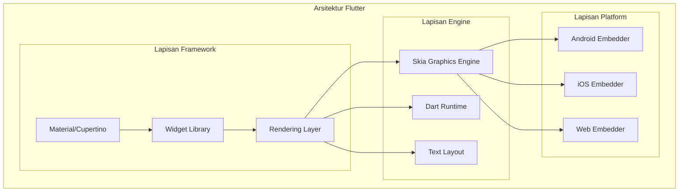

**Gambar 2.1 Diagram Arsitektur Flutter**

### 3. Bahasa Pemrograman Dart

Dart adalah bahasa pemrograman yang dikembangkan oleh Google, dirancang untuk pengembangan klien dengan fokus pada produktivitas dan performa (Bracha, 2015). Dart menggabungkan fitur-fitur dari bahasa berorientasi objek dengan dukungan untuk pemrograman fungsional.

Karakteristik utama Dart yang relevan untuk pengembangan mobile:

- **Type Safety**: Sistem tipe yang kuat membantu mendeteksi kesalahan pada waktu kompilasi.
- **Null Safety**: Fitur sound null safety mencegah kesalahan null pointer yang umum terjadi.
- **Async/Await**: Dukungan native untuk pemrograman asinkron memudahkan penanganan operasi I/O.
- **Garbage Collection**: Manajemen memori otomatis menyederhanakan pengembangan.

### 4. Perbandingan Framework Pengembangan Mobile

**Tabel 2.1 Perbandingan Framework Pengembangan Mobile**

| Aspek            | Flutter     | React Native              | Native (Kotlin/Swift) |
| ---------------- | ----------- | ------------------------- | --------------------- |
| Bahasa           | Dart        | JavaScript                | Kotlin/Swift          |
| Performa         | Sangat Baik | Baik                      | Terbaik               |
| Hot Reload       | Ya          | Ya                        | Terbatas              |
| Ekosistem Widget | Sangat Kaya | Kaya                      | Platform Spesifik     |
| Kurva Belajar    | Sedang      | Rendah (jika familiar JS) | Tinggi                |
| Satu Basis Kode  | Ya          | Ya                        | Tidak                 |
| Dukungan Google  | Penuh       | Komunitas                 | Platform Spesifik     |

Pemilihan Flutter untuk pengembangan Publishify didasarkan pada kebutuhan akan performa yang baik, pengembangan yang cepat dengan hot reload, dan kemampuan untuk menghasilkan aplikasi multi-platform dari satu basis kode.

### 5. Arsitektur Aplikasi Mobile

Dalam pengembangan aplikasi mobile modern, pemisahan antara lapisan presentasi, logika bisnis, dan akses data menjadi praktik standar. Publishify mobile mengadopsi arsitektur yang memisahkan komponen-komponen ini untuk memudahkan pengujian dan pemeliharaan.

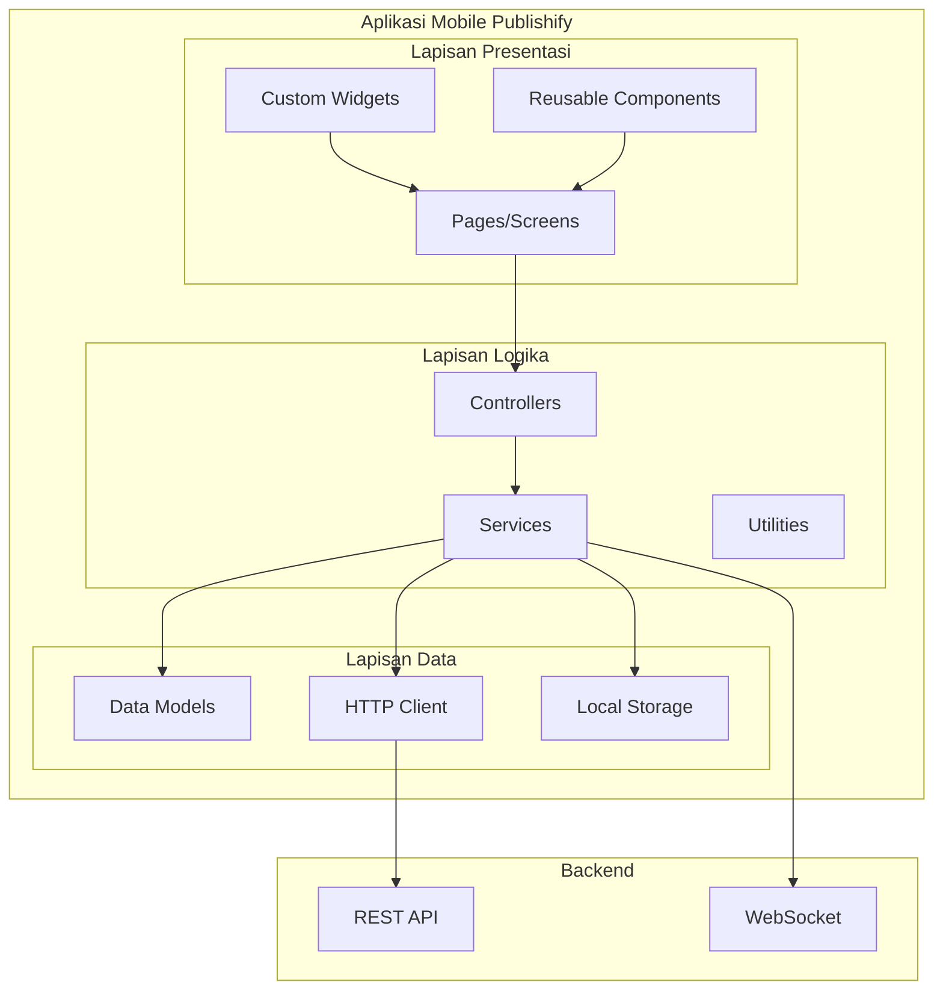

**Gambar 2.2 Diagram Arsitektur Aplikasi Mobile Publishify**

---

## B. Pemodelan Sistem

Pemodelan sistem untuk aplikasi mobile Publishify menggunakan Unified Modeling Language (UML) untuk menggambarkan berbagai aspek sistem. Meskipun pengembangan dilakukan secara cross-platform dengan Flutter, pemodelan UML tetap relevan untuk mendokumentasikan struktur dan perilaku aplikasi.

### 1. Diagram Use Case

Diagram Use Case untuk aplikasi mobile menggambarkan interaksi antara pengguna dengan fungsionalitas aplikasi yang tersedia pada platform mobile.

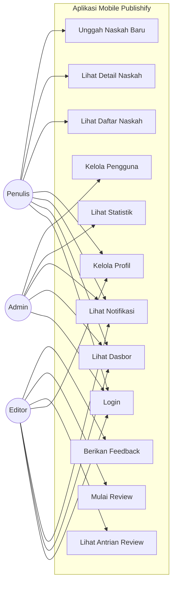

**Gambar 2.3 Diagram Use Case Aplikasi Mobile**

### 2. Diagram Aktivitas

Diagram aktivitas menggambarkan alur kerja dalam aplikasi mobile, khususnya untuk proses-proses utama seperti review naskah oleh editor.

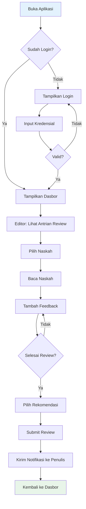

**Gambar 2.4 Diagram Aktivitas Proses Review pada Mobile**

### 3. Diagram Sekuens

Diagram sekuens menggambarkan interaksi antar komponen dalam aplikasi untuk skenario tertentu, seperti menerima notifikasi real-time.

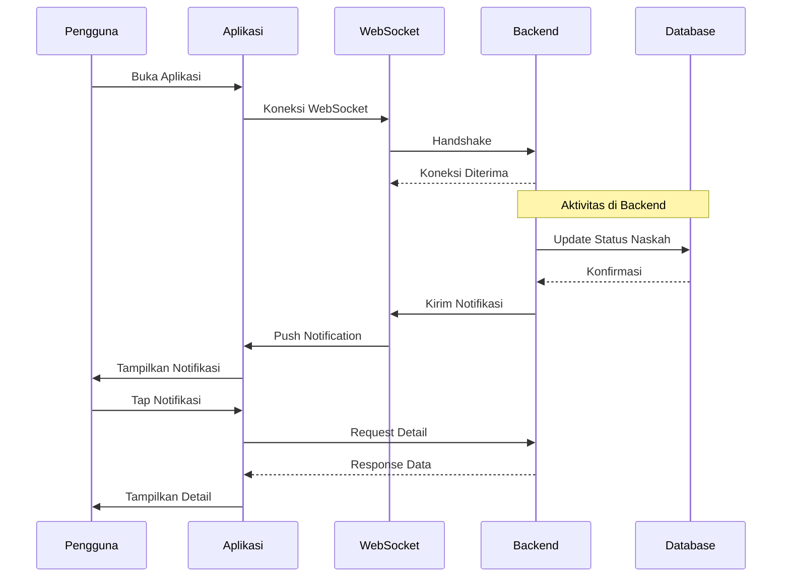

**Gambar 2.5 Diagram Sekuens Notifikasi Real-time**

### 4. Diagram Kelas

Diagram kelas menggambarkan struktur model data yang digunakan dalam aplikasi mobile.

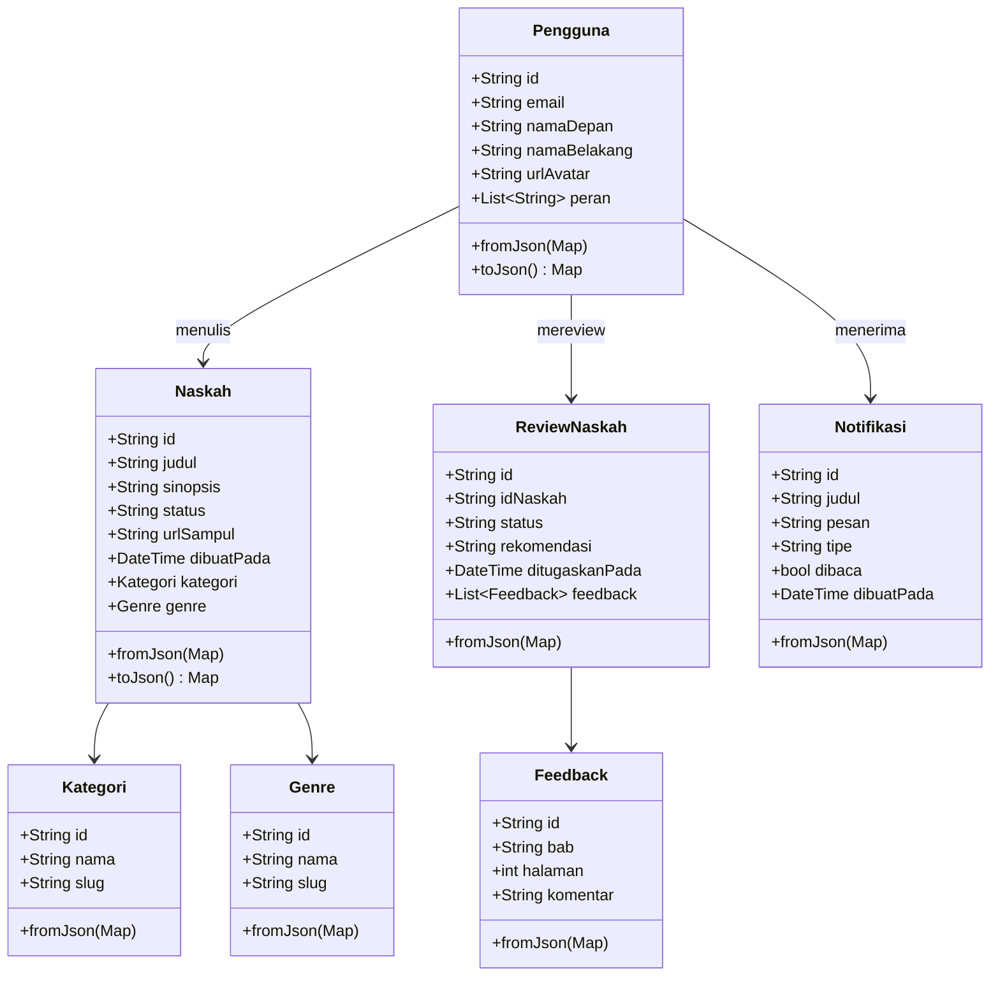

**Gambar 2.6 Diagram Kelas Model Aplikasi Mobile**

### 5. Diagram State Machine

Diagram state machine menggambarkan transisi state dalam navigasi aplikasi.

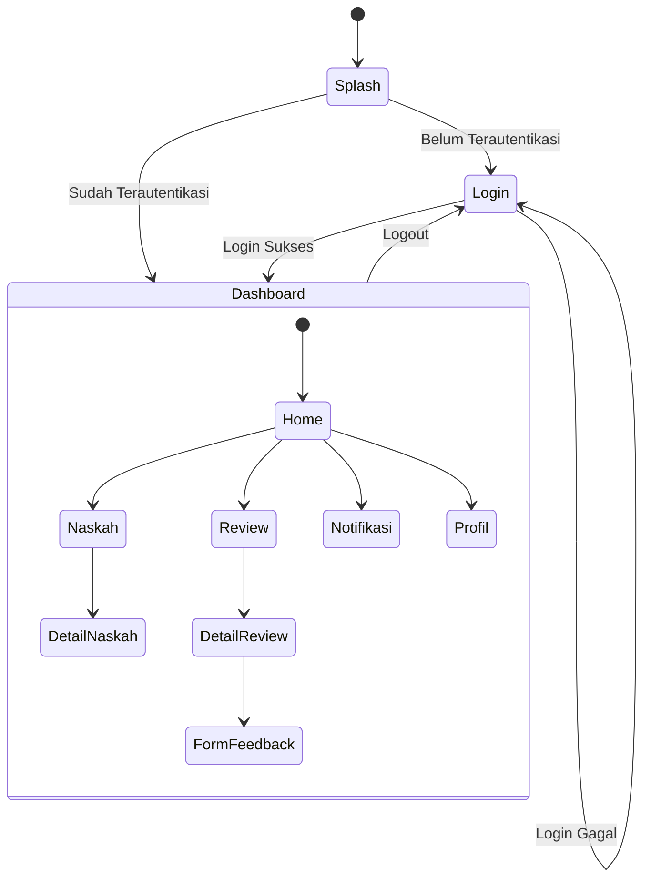

**Gambar 2.7 Diagram State Machine Navigasi Aplikasi**

### 6. Struktur Widget Tree

Dalam Flutter, antarmuka pengguna dibangun menggunakan widget yang tersusun dalam hierarki tree.

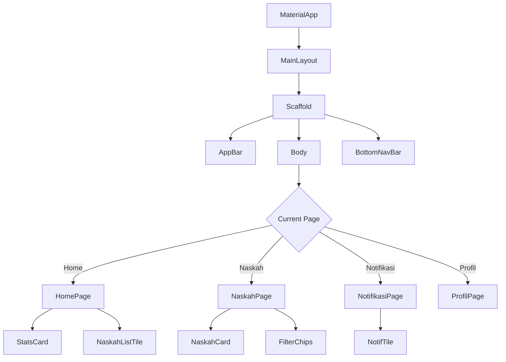

**Gambar 2.8 Struktur Widget Tree Flutter**

### 7. Diagram Komponen

Diagram komponen menggambarkan organisasi komponen-komponen dalam aplikasi.

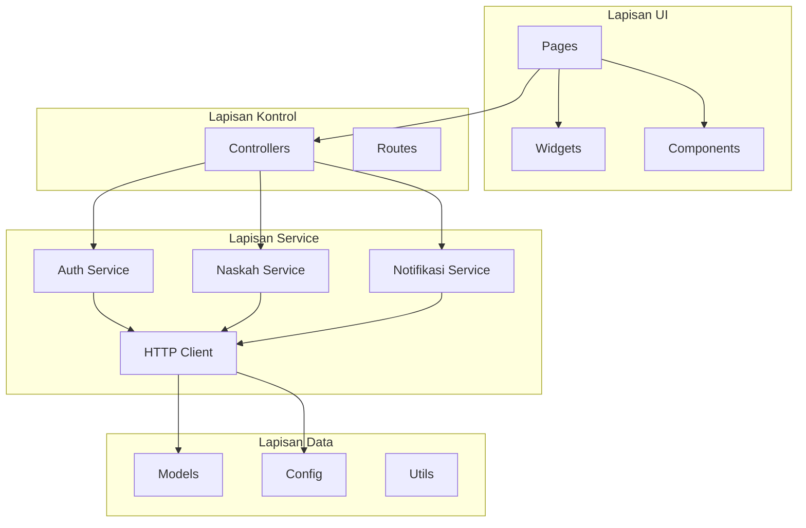

**Gambar 2.9 Diagram Komponen Aplikasi Mobile**

### 8. Diagram Deployment Mobile

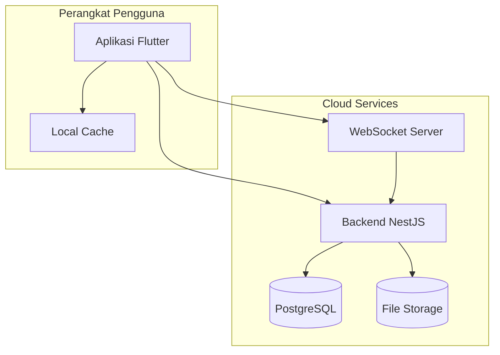

**Gambar 2.10 Diagram Deployment Aplikasi Mobile**

---

## C. Interaksi Manusia dan Sistem Mobile

### 1. Konsep Dasar Interaksi Mobile

Interaksi manusia dan komputer dalam konteks aplikasi mobile memiliki karakteristik unik yang berbeda dari aplikasi desktop atau web. Menurut Kjeldskov dan Graham (2003), konteks penggunaan mobile meliputi keterbatasan perhatian pengguna, variabilitas lingkungan penggunaan, dan kebutuhan akan interaksi yang cepat dan efisien.

Karakteristik utama interaksi mobile meliputi:

1. **Interaksi Berbasis Sentuh**: Pengguna berinteraksi dengan aplikasi melalui gerakan sentuh seperti tap, swipe, pinch, dan long press. Desain antarmuka harus mempertimbangkan ukuran target sentuh yang optimal dan mencegah kesalahan sentuh yang tidak disengaja.

2. **Konteks Penggunaan yang Dinamis**: Pengguna mobile sering menggunakan aplikasi dalam kondisi yang tidak ideal, seperti saat berjalan, dalam kendaraan, atau dengan pencahayaan yang tidak optimal. Antarmuka harus tetap dapat digunakan dalam berbagai kondisi tersebut.

3. **Perhatian Terbagi**: Pengguna mobile sering menggunakan aplikasi sambil melakukan aktivitas lain. Desain harus memungkinkan penyelesaian tugas dengan langkah minimal dan interupsi yang mudah.

### 2. Prinsip Desain Mobile

Dalam merancang antarmuka aplikasi mobile Publishify, kami menerapkan prinsip-prinsip desain mobile yang telah diakui secara luas.

**Tabel 2.2 Prinsip-prinsip Desain Mobile**

| Prinsip          | Deskripsi                                                 | Penerapan dalam Publishify                                    |
| ---------------- | --------------------------------------------------------- | ------------------------------------------------------------- |
| Kesederhanaan    | Fokus pada tugas utama, hilangkan elemen yang tidak perlu | Dasbor menampilkan informasi paling relevan berdasarkan peran |
| Konsistensi      | Pola interaksi yang sama di seluruh aplikasi              | Navigasi bottom bar konsisten di semua halaman                |
| Umpan Balik      | Respons visual dan taktil untuk setiap aksi               | Animasi loading, konfirmasi sukses/error                      |
| Pencegahan Error | Desain yang meminimalkan kesalahan                        | Konfirmasi sebelum aksi destruktif                            |
| Fleksibilitas    | Mendukung berbagai cara menyelesaikan tugas               | Gesture shortcuts untuk pengguna mahir                        |
| Estetika         | Desain yang menarik dan profesional                       | Mengikuti Material Design dengan kustomisasi brand            |

### 3. Material Design

Material Design adalah sistem desain yang dikembangkan oleh Google yang menyediakan panduan komprehensif untuk membangun antarmuka digital (Google Design, 2024). Dalam pengembangan Publishify mobile, kami mengadopsi prinsip-prinsip Material Design 3 yang mencakup:

1. **Elevasi dan Bayangan**: Menggunakan elevasi untuk menciptakan hierarki visual dan menunjukkan hubungan antar elemen.

2. **Tipografi**: Menggunakan skala tipografi yang konsisten dengan hierarki yang jelas untuk heading, body, dan caption.

3. **Warna**: Menerapkan sistem warna yang mencakup warna primer, sekunder, dan surface dengan variasi tone.

4. **Komponen Standar**: Menggunakan komponen Material seperti AppBar, FloatingActionButton, Card, dan BottomNavigationBar.

5. **Motion**: Menerapkan animasi yang bermakna untuk transisi dan umpan balik.

### 4. Aksesibilitas Mobile

Aksesibilitas dalam aplikasi mobile memastikan bahwa aplikasi dapat digunakan oleh pengguna dengan berbagai kemampuan. Publishify mobile mengikuti panduan aksesibilitas yang meliputi:

1. **Semantic Labels**: Setiap elemen interaktif memiliki label yang dapat dibaca oleh screen reader.

2. **Ukuran Target Sentuh**: Area sentuh minimal 48x48 piksel sesuai rekomendasi Android.

3. **Kontras Warna**: Rasio kontras minimal 4,5:1 untuk teks normal.

4. **Navigasi Keyboard**: Mendukung navigasi menggunakan keyboard eksternal.

5. **Skala Teks**: Mendukung penyesuaian ukuran teks sistem.

---

## D. Kerangka Pengembangan Aplikasi Mobile

### 1. Metodologi Pengembangan

Pengembangan aplikasi mobile Publishify mengadopsi metodologi Agile dengan praktik-praktik dari Scrum dan Kanban. Pendekatan ini dipilih karena fleksibilitasnya dalam mengakomodasi perubahan kebutuhan dan memungkinkan iterasi yang cepat.

### 2. Diagram Alir Pengembangan Aplikasi Mobile

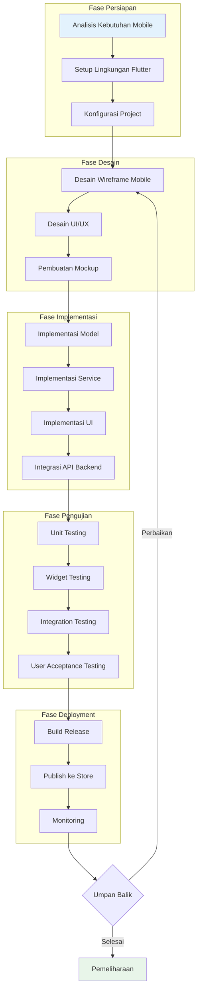

**Gambar 2.11 Diagram Alir Pengembangan Aplikasi Mobile**

### 3. Dependensi Aplikasi

**Tabel 2.3 Dependensi Aplikasi Mobile Publishify**

| Paket              | Versi    | Fungsi                               |
| ------------------ | -------- | ------------------------------------ |
| flutter            | SDK 3.9+ | Framework utama                      |
| http               | 1.5.0    | HTTP client untuk API calls          |
| flutter_dotenv     | 5.1.0    | Manajemen environment variables      |
| shared_preferences | 2.3.3    | Penyimpanan lokal sederhana          |
| file_picker        | 8.1.4    | Pemilihan file untuk upload          |
| socket_io_client   | 3.0.1    | WebSocket untuk notifikasi real-time |
| fl_chart           | 0.69.0   | Grafik dan chart untuk statistik     |
| logger             | 2.0.2    | Logging untuk debugging              |
| intl               | 0.20.2   | Internasionalisasi dan formatting    |

---

**Catatan untuk Penyusunan:**

Pada bagian BAB II ini, semua diagram menggunakan sintaks Mermaid dan perlu dirender menjadi gambar untuk dokumen laporan resmi.

File referensi untuk implementasi konsep:

- Main app: `mobile/lib/main.dart`
- Routes: `mobile/lib/routes/app_routes.dart`
- Services: `mobile/lib/services/`
- Models: `mobile/lib/models/`
- Config: `mobile/lib/config/`
