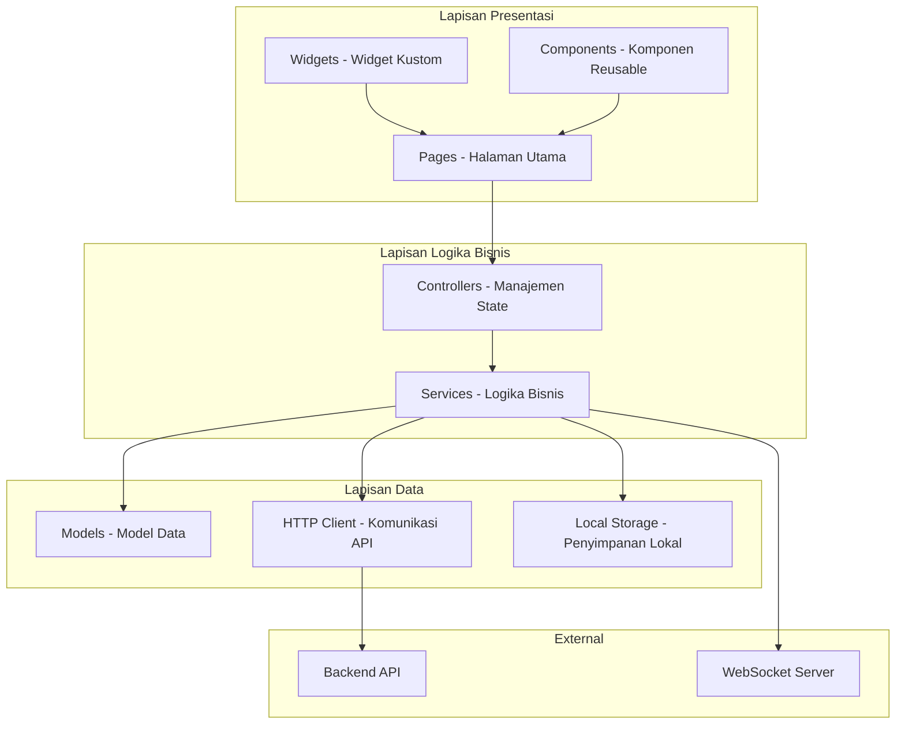
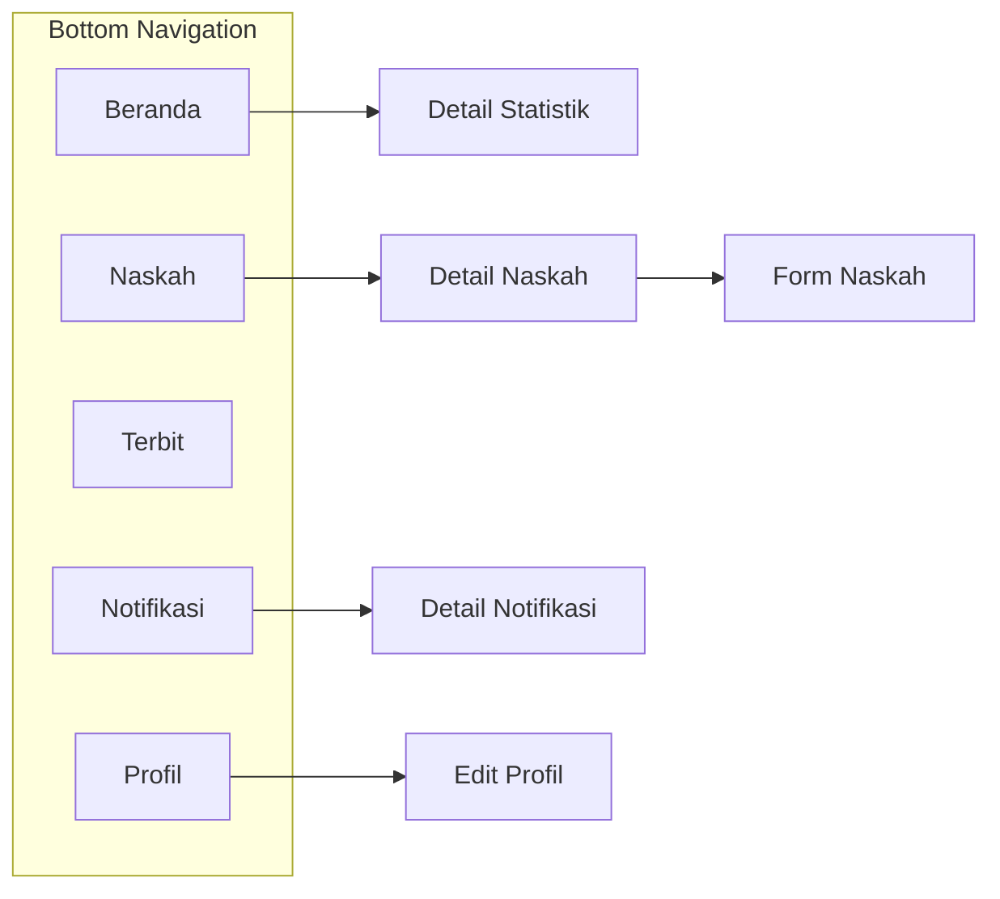

# BAB III

# PERANCANGAN APLIKASI

---

## A. Perancangan Aplikasi Mobile

Perancangan aplikasi mobile Publishify dilakukan dengan pendekatan yang sistematis, memperhatikan karakteristik unik platform mobile dan kebutuhan pengguna yang bergerak. Pada bagian ini, kami menguraikan secara komprehensif setiap aspek perancangan aplikasi mobile yang telah dilakukan.

### 1. Perancangan Arsitektur Aplikasi

#### a. Arsitektur Keseluruhan

Aplikasi mobile Publishify dikembangkan menggunakan Flutter dengan arsitektur yang memisahkan komponen-komponen berdasarkan tanggung jawab mereka. Pendekatan ini mengikuti prinsip separation of concerns yang memudahkan pengembangan, pengujian, dan pemeliharaan.

**Struktur Direktori Aplikasi:**

```
mobile/lib/
├── main.dart                # Entry point aplikasi
├── components/              # Komponen UI reusable
├── config/                  # Konfigurasi aplikasi
│   ├── api_config.dart     # Konfigurasi endpoint API
│   └── theme_config.dart   # Konfigurasi tema
├── controllers/             # Controller/State management
├── models/                  # Model data
│   ├── general/            # Model umum
│   ├── writer/             # Model untuk penulis
│   ├── editor/             # Model untuk editor
│   └── percetakan/         # Model untuk percetakan
├── pages/                   # Halaman aplikasi
│   ├── auth/               # Halaman autentikasi
│   ├── writer/             # Halaman untuk penulis
│   ├── editor/             # Halaman untuk editor
│   ├── admin/              # Halaman untuk admin
│   └── main_layout.dart    # Layout utama
├── routes/                  # Routing aplikasi
│   └── app_routes.dart     # Definisi rute
├── services/                # Layanan bisnis
│   ├── general/            # Layanan umum
│   ├── writer/             # Layanan penulis
│   ├── editor/             # Layanan editor
│   ├── http_client_service.dart
│   └── notifikasi_service.dart
├── utils/                   # Utilitas
│   └── theme.dart          # Tema aplikasi
└── widgets/                 # Widget kustom
```

#### b. Arsitektur Lapisan

Aplikasi menggunakan arsitektur berlapis yang memisahkan UI, logika bisnis, dan akses data.



**Gambar 3.1 Arsitektur Lapisan Aplikasi Mobile**

#### c. Manajemen State

Aplikasi menggunakan pendekatan sederhana untuk manajemen state dengan memanfaatkan StatefulWidget dan setState untuk state lokal, serta pola Service Locator untuk berbagi state antar komponen.

```dart
// Contoh struktur controller
class NaskahController {
  List<Naskah> daftarNaskah = [];
  bool isLoading = false;

  Future<void> ambilDaftarNaskah() async {
    isLoading = true;
    // Notifikasi perubahan state
    daftarNaskah = await naskahService.ambilSemua();
    isLoading = false;
  }
}
```

### 2. Perancangan Model Data

#### a. Model Data Utama

Model data dalam aplikasi mobile dirancang untuk merepresentasikan entitas-entitas yang diterima dari backend API. Setiap model dilengkapi dengan metode fromJson untuk parsing respons API.

**Tabel 3.1 Struktur Model Data Aplikasi**

| Model         | Atribut Utama                                           | Lokasi File                      |
| ------------- | ------------------------------------------------------- | -------------------------------- |
| Pengguna      | id, email, namaDepan, namaBelakang, peran, urlAvatar    | `models/general/pengguna.dart`   |
| Naskah        | id, judul, sinopsis, status, urlSampul, kategori, genre | `models/writer/naskah.dart`      |
| ReviewNaskah  | id, idNaskah, status, rekomendasi, feedback             | `models/editor/review.dart`      |
| Notifikasi    | id, judul, pesan, tipe, dibaca, dibuatPada              | `models/general/notifikasi.dart` |
| Kategori      | id, nama, slug, deskripsi                               | `models/general/kategori.dart`   |
| Genre         | id, nama, slug                                          | `models/general/genre.dart`      |
| Feedback      | id, bab, halaman, komentar                              | `models/editor/feedback.dart`    |
| PesananTerbit | id, nomorPesanan, status, totalHarga                    | `models/writer/pesanan.dart`     |

#### b. Struktur Model

Setiap model mengikuti pola yang konsisten dengan konstruktor, factory fromJson, dan metode toJson bila diperlukan.

```dart
// Contoh struktur model
class Naskah {
  final String id;
  final String judul;
  final String sinopsis;
  final String status;
  final String? urlSampul;
  final DateTime dibuatPada;
  final Kategori? kategori;
  final Genre? genre;

  Naskah({
    required this.id,
    required this.judul,
    required this.sinopsis,
    required this.status,
    this.urlSampul,
    required this.dibuatPada,
    this.kategori,
    this.genre,
  });

  factory Naskah.fromJson(Map<String, dynamic> json) {
    return Naskah(
      id: json['id'],
      judul: json['judul'],
      sinopsis: json['sinopsis'],
      status: json['status'],
      urlSampul: json['urlSampul'],
      dibuatPada: DateTime.parse(json['dibuatPada']),
      kategori: json['kategori'] != null
          ? Kategori.fromJson(json['kategori'])
          : null,
      genre: json['genre'] != null
          ? Genre.fromJson(json['genre'])
          : null,
    );
  }
}
```

### 3. Perancangan Antarmuka Pengguna

#### a. Prinsip Desain Visual

Perancangan antarmuka pengguna aplikasi mobile Publishify mengikuti prinsip Material Design 3 dengan kustomisasi untuk identitas brand Publishify. Desain visual mempertimbangkan keterbatasan layar mobile dan kebutuhan interaksi sentuh.

**Tabel 3.2 Panduan Warna dan Tipografi Mobile**

| Elemen           | Spesifikasi              | Penggunaan                   |
| ---------------- | ------------------------ | ---------------------------- |
| Warna Primer     | Biru (#3B82F6)           | AppBar, FAB, tombol utama    |
| Warna Sekunder   | Abu-abu (#6B7280)        | Teks sekunder, ikon inaktif  |
| Warna Surface    | Putih (#FFFFFF)          | Card, dialog, sheet          |
| Warna Background | Abu-abu terang (#F3F4F6) | Background halaman           |
| Warna Sukses     | Hijau (#10B981)          | Badge sukses, ikon sukses    |
| Warna Warning    | Kuning (#F59E0B)         | Badge warning, notifikasi    |
| Warna Error      | Merah (#EF4444)          | Pesan error, validasi        |
| Font Primary     | Roboto                   | Teks umum (default Material) |
| Headline Large   | 32sp, Bold               | Judul halaman utama          |
| Headline Medium  | 24sp, SemiBold           | Judul section                |
| Body Large       | 16sp, Regular            | Teks paragraf                |
| Body Medium      | 14sp, Regular            | Teks deskripsi               |
| Caption          | 12sp, Regular            | Label, timestamp             |

#### b. Komponen Antarmuka

Aplikasi menggunakan komponen-komponen Material Design yang dikustomisasi sesuai kebutuhan:

1. **AppBar**: Header navigasi dengan judul dan action buttons
2. **BottomNavigationBar**: Navigasi utama dengan 4-5 item
3. **Card**: Container untuk konten seperti daftar naskah
4. **FloatingActionButton**: Aksi utama per halaman
5. **ListTile**: Item dalam list dengan konsistensi visual
6. **Chip/Badge**: Indikator status dengan warna berbeda
7. **Snackbar**: Notifikasi sementara untuk feedback
8. **Dialog**: Konfirmasi dan form overlay
9. **BottomSheet**: Aksi tambahan dan filter

#### c. Wireframe Halaman Utama

**1. Halaman Login**

Halaman login menampilkan form autentikasi dengan struktur:

- Logo Publishify di bagian atas
- Input field email dengan validasi
- Input field password dengan toggle visibility
- Tombol "Masuk" sebagai action utama
- Link "Lupa Password?" untuk recovery
- Divider "atau" untuk alternatif
- Tombol "Masuk dengan Google" untuk OAuth

**[Tempat Screenshot: Wireframe Halaman Login]**

> Referensi file: `mobile/lib/pages/auth/login_page.dart`

**2. Halaman Dasbor Penulis**

Dasbor penulis menampilkan ringkasan aktivitas dengan struktur:

- AppBar dengan judul "Dasbor" dan ikon notifikasi
- Kartu ringkasan statistik (total naskah, dalam review, diterbitkan)
- Section "Naskah Terbaru" dengan list tile
- Section "Aktivitas Terakhir" dengan timeline
- Bottom navigation dengan 5 item: Beranda, Naskah, Terbit, Notifikasi, Profil

**[Tempat Screenshot: Wireframe Dasbor Penulis]**

> Referensi file: `mobile/lib/pages/writer/home/home_page.dart`

**3. Halaman Daftar Naskah**

Halaman daftar naskah untuk penulis:

- AppBar dengan judul "Naskah Saya" dan ikon filter
- Filter chips untuk status (Semua, Draft, Diajukan, Dalam Review, Diterbitkan)
- List naskah dengan Card untuk setiap item
- FAB untuk menambah naskah baru
- Pull-to-refresh untuk update data

**[Tempat Screenshot: Wireframe Daftar Naskah]**

> Referensi file: `mobile/lib/pages/writer/naskah/naskah_list_page.dart`

**4. Halaman Dasbor Editor**

Dasbor editor fokus pada tugas review:

- AppBar dengan judul "Dasbor Editor"
- Kartu statistik (antrian review, dalam proses, selesai)
- Section "Perlu Ditinjau" dengan prioritas
- Section "Dalam Proses" untuk tugas aktif
- Bottom navigation: Beranda, Antrian, Review Saya, Notifikasi, Profil

**[Tempat Screenshot: Wireframe Dasbor Editor]**

> Referensi file: `mobile/lib/pages/editor/home/editor_home_page.dart`

**5. Halaman Antrian Review**

Halaman antrian untuk editor:

- AppBar dengan judul "Antrian Review"
- Tab untuk kategori (Baru, Prioritas, Semua)
- List naskah dengan informasi penulis dan tanggal pengajuan
- Action untuk mengambil tugas review
- Indikator prioritas dengan warna

**[Tempat Screenshot: Wireframe Antrian Review]**

> Referensi file: `mobile/lib/pages/editor/review/`

**6. Halaman Notifikasi**

Halaman notifikasi dengan struktur:

- AppBar dengan judul "Notifikasi" dan action "Tandai Semua Dibaca"
- List notifikasi dengan indikator baca/belum baca
- Grouping berdasarkan waktu (Hari Ini, Kemarin, Lebih Lama)
- Tap untuk navigasi ke detail terkait
- Swipe untuk menghapus

**[Tempat Screenshot: Wireframe Notifikasi]**

> Referensi file: `mobile/lib/pages/writer/notifications/` dan `mobile/lib/pages/editor/notifications/`

### 4. Perancangan Interaksi Pengguna

#### a. Navigasi Aplikasi

Navigasi dalam aplikasi dirancang dengan mempertimbangkan pola penggunaan mobile yang umum:

1. **Bottom Navigation**: Navigasi utama antar section menggunakan BottomNavigationBar dengan 4-5 item maksimal sesuai rekomendasi Material Design.

2. **Stack Navigation**: Navigasi dalam section menggunakan Navigator stack untuk push/pop halaman.

3. **Tab Navigation**: Untuk sub-kategorisasi dalam satu halaman menggunakan TabBar.

4. **Drawer Navigation** (opsional): Untuk menu tambahan dan pengaturan.



**Gambar 3.2 Struktur Navigasi Aplikasi**

#### b. Gesture dan Interaksi

Aplikasi menggunakan gesture standar Android/iOS untuk konsistensi dengan pengalaman native:

**Tabel 3.3 Gesture dan Aksi**

| Gesture          | Aksi                     | Konteks                |
| ---------------- | ------------------------ | ---------------------- |
| Tap              | Memilih/membuka item     | Seluruh aplikasi       |
| Long Press       | Menampilkan opsi konteks | List item              |
| Swipe Horizontal | Menghapus/aksi cepat     | List item              |
| Swipe Vertikal   | Scroll                   | Konten panjang         |
| Pull Down        | Refresh data             | List dan halaman utama |
| Pinch            | Zoom (jika relevan)      | Pratinjau dokumen      |
| Double Tap       | Aksi cepat (like)        | Belum diterapkan       |

#### c. Umpan Balik dan Indikator

Sistem umpan balik untuk menjaga pengguna terinformasi:

1. **Loading Indicators**: CircularProgressIndicator untuk operasi asinkron
2. **Skeleton Loaders**: Placeholder loading untuk list item
3. **Snackbar**: Notifikasi singkat untuk aksi yang berhasil/gagal
4. **Dialog**: Konfirmasi untuk aksi penting
5. **Badge**: Indikator notifikasi belum dibaca
6. **Ripple Effect**: Visual feedback untuk tap

#### d. Form dan Validasi

Form dalam aplikasi mengikuti panduan Material Design:

1. **TextField**: Input dengan floating label
2. **Dropdown**: Select dengan opsi terbatas
3. **DatePicker**: Pemilihan tanggal native
4. **FilePicker**: Integrasi dengan sistem file
5. **Validasi Real-time**: Error message muncul saat fokus berpindah
6. **Submit Button**: Disabled saat form tidak valid

---

## Spesifikasi Kebutuhan Fungsional Mobile

**Tabel 3.4 Spesifikasi Kebutuhan Fungsional Aplikasi Mobile**

| ID  | Modul      | Kebutuhan                                      | Prioritas |
| --- | ---------- | ---------------------------------------------- | --------- |
| M01 | Auth       | Pengguna dapat login dengan email dan password | Tinggi    |
| M02 | Auth       | Pengguna dapat login dengan Google OAuth       | Sedang    |
| M03 | Auth       | Pengguna dapat logout dari aplikasi            | Tinggi    |
| M04 | Profil     | Pengguna dapat melihat profil mereka           | Tinggi    |
| M05 | Profil     | Pengguna dapat memperbarui profil              | Sedang    |
| M06 | Naskah     | Penulis dapat melihat daftar naskah            | Tinggi    |
| M07 | Naskah     | Penulis dapat melihat detail naskah            | Tinggi    |
| M08 | Naskah     | Penulis dapat melihat status naskah            | Tinggi    |
| M09 | Naskah     | Penulis dapat mengunggah naskah baru           | Sedang    |
| M10 | Review     | Editor dapat melihat antrian review            | Tinggi    |
| M11 | Review     | Editor dapat mengambil tugas review            | Tinggi    |
| M12 | Review     | Editor dapat memberikan feedback               | Tinggi    |
| M13 | Review     | Editor dapat submit rekomendasi                | Tinggi    |
| M14 | Notifikasi | Pengguna menerima notifikasi real-time         | Tinggi    |
| M15 | Notifikasi | Pengguna dapat melihat riwayat notifikasi      | Tinggi    |
| M16 | Notifikasi | Pengguna dapat menandai notifikasi dibaca      | Sedang    |
| M17 | Statistik  | Pengguna dapat melihat statistik dasbor        | Sedang    |
| M18 | Admin      | Admin dapat melihat statistik sistem           | Sedang    |
| M19 | Admin      | Admin dapat melihat daftar pengguna            | Sedang    |
| M20 | Terbit     | Penulis dapat melihat status penerbitan        | Sedang    |

---

**Catatan untuk Penyusunan:**

Pada bagian BAB III ini, perlu ditambahkan tangkapan layar atau mockup dari:

1. **Gambar 3.3**: Wireframe halaman login
   - File: `mobile/lib/pages/auth/`

2. **Gambar 3.4**: Wireframe dasbor penulis
   - File: `mobile/lib/pages/writer/home/`

3. **Gambar 3.5**: Wireframe daftar naskah
   - File: `mobile/lib/pages/writer/naskah/`

4. **Gambar 3.6**: Wireframe dasbor editor
   - File: `mobile/lib/pages/editor/home/`

5. **Gambar 3.7**: Wireframe antrian review
   - File: `mobile/lib/pages/editor/review/`

6. **Gambar 3.8**: Wireframe halaman notifikasi
   - File: `mobile/lib/pages/*/notifications/`

Untuk kode sumber lengkap, dapat dilampirkan:

- File: `mobile/lib/main.dart`
- Folder: `mobile/lib/pages/`
- Folder: `mobile/lib/services/`
- Folder: `mobile/lib/models/`
