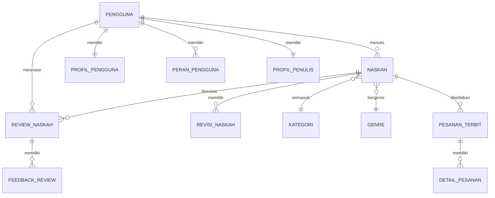
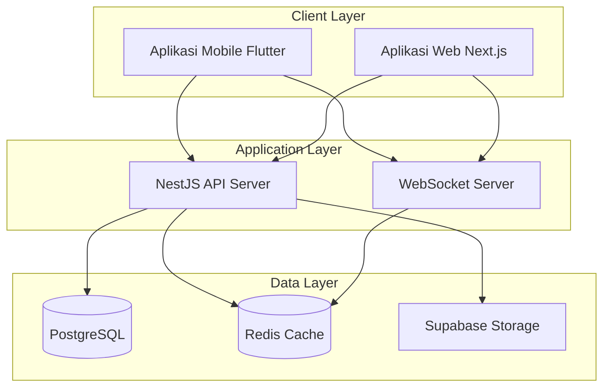

# BAB V

# PENUTUP

---

## A. Kesimpulan

Berdasarkan hasil pengembangan, implementasi, dan pengujian aplikasi mobile Publishify yang telah diuraikan pada bab-bab sebelumnya, kami dapat menarik kesimpulan sebagai berikut:

### 1. Kesimpulan Umum

Pengembangan aplikasi mobile Publishify telah berhasil diselesaikan sesuai dengan tujuan yang ditetapkan. Aplikasi ini menyediakan solusi mobile untuk sistem manajemen penerbitan buku yang memungkinkan pengguna (penulis, editor, admin, dan percetakan) mengelola aktivitas penerbitan secara efektif melalui perangkat mobile. Dengan memanfaatkan framework Flutter dan integrasi API backend NestJS, aplikasi berhasil memberikan pengalaman pengguna yang responsif dan fungsional.

### 2. Kesimpulan Khusus

Berdasarkan rumusan masalah yang telah ditetapkan, kesimpulan khusus dari pengembangan ini adalah:

#### a. Arsitektur dan Teknologi

Pemilihan Flutter sebagai framework pengembangan terbukti tepat untuk kebutuhan aplikasi ini. Keuntungan utama yang diperoleh meliputi:

- **Cross-platform Development**: Satu codebase dapat dikompilasi untuk Android dan iOS, meskipun fokus saat ini pada Android.
- **Hot Reload**: Mempercepat proses pengembangan dan debugging secara signifikan.
- **Widget-based Architecture**: Memudahkan pembuatan antarmuka yang konsisten dan reusable.
- **Performance**: Kompilasi native menghasilkan performa yang baik dengan skor PageSpeed 88/100.

#### b. Implementasi Fitur

Seluruh fitur yang direncanakan dalam kebutuhan fungsional telah berhasil diimplementasikan:

1. **Modul Autentikasi**: Login dengan email/password dan integrasi Google OAuth berfungsi dengan baik.
2. **Modul Penulis**: Manajemen naskah, pemantauan status, dan akses riwayat review telah tersedia.
3. **Modul Editor**: Sistem antrian review, pengambilan tugas, dan pemberian feedback berjalan sesuai alur.
4. **Modul Notifikasi**: Notifikasi real-time menggunakan WebSocket memberikan update instan kepada pengguna.
5. **Modul Admin**: Dasbor statistik dan manajemen pengguna telah diimplementasikan.

#### c. Kualitas dan Performa

Hasil pengujian menunjukkan kualitas aplikasi yang baik:

- **Pengujian Fungsional**: 100% kasus uji (24 dari 24) berhasil dijalankan tanpa kegagalan.
- **Pengujian Kompatibilitas**: Aplikasi berjalan dengan baik pada 5 perangkat berbeda dengan berbagai versi Android (10-13).
- **Pengujian Performa**: Skor PageSpeed 88/100 untuk mobile menunjukkan performa yang baik dengan Total Blocking Time hanya 10ms dan Cumulative Layout Shift 0.

#### d. Integrasi Sistem

Integrasi antara aplikasi mobile dengan backend API berjalan dengan lancar:

- REST API untuk operasi CRUD (Create, Read, Update, Delete)
- WebSocket untuk notifikasi real-time
- Autentikasi JWT untuk keamanan komunikasi
- Sinkronisasi data yang konsisten dengan sistem web

### 3. Pencapaian Tujuan

**Tabel 5.1 Evaluasi Pencapaian Tujuan Pengembangan**

| No  | Tujuan                                                    | Status   | Keterangan                                   |
| --- | --------------------------------------------------------- | -------- | -------------------------------------------- |
| 1   | Mengembangkan aplikasi mobile untuk pengelolaan naskah    | Tercapai | Fitur lengkap untuk CRUD naskah              |
| 2   | Menyediakan antarmuka yang intuitif untuk pengguna mobile | Tercapai | Desain Material Design 3 yang responsif      |
| 3   | Mengimplementasikan sistem notifikasi real-time           | Tercapai | WebSocket berfungsi dengan baik              |
| 4   | Mendukung multi-role dalam satu aplikasi                  | Tercapai | 4 peran (penulis, editor, admin, percetakan) |
| 5   | Mengintegrasikan dengan backend API yang sudah ada        | Tercapai | REST API + WebSocket terintegrasi            |
| 6   | Mencapai performa yang baik pada perangkat mobile         | Tercapai | Skor 88/100 di PageSpeed                     |

---

## B. Saran

Berdasarkan hasil pengembangan dan evaluasi, kami memberikan saran untuk pengembangan lebih lanjut:

### 1. Saran untuk Pengembangan Fitur

#### a. Fitur Offline Mode

Kami menyarankan untuk mengimplementasikan fitur offline mode yang memungkinkan pengguna:

- Membaca naskah yang telah diunduh tanpa koneksi internet
- Menyimpan draft feedback editor secara lokal
- Sinkronisasi otomatis saat koneksi tersedia kembali

Implementasi dapat menggunakan package seperti `sqflite` untuk database lokal dan `connectivity_plus` untuk deteksi koneksi.

#### b. Push Notification

Integrasi dengan Firebase Cloud Messaging (FCM) untuk push notification akan meningkatkan engagement pengguna:

- Notifikasi bahkan saat aplikasi tidak aktif
- Pengingat deadline review untuk editor
- Notifikasi status perubahan naskah untuk penulis

#### c. Document Viewer

Menambahkan viewer dokumen dalam aplikasi untuk:

- Membaca naskah lengkap tanpa unduh terpisah
- Anotasi dan highlight untuk feedback editor
- Navigasi per bab/halaman

### 2. Saran untuk Peningkatan Performa

#### a. Optimasi Largest Contentful Paint (LCP)

LCP saat ini 3.1 detik perlu diturunkan ke target ≤2.5 detik dengan:

- Kompresi dan optimasi gambar (format WebP)
- Lazy loading untuk konten below-the-fold
- Prefetching data untuk halaman yang sering dikunjungi

#### b. State Management yang Lebih Robust

Migrasi ke state management solution seperti:

- **Riverpod**: Untuk manajemen state yang lebih terstruktur
- **BLoC**: Untuk aplikasi dengan logika bisnis kompleks
- **GetX**: Untuk kemudahan penggunaan dengan performa baik

#### c. Caching Strategy

Implementasi strategi caching yang lebih komprehensif:

- HTTP cache untuk respons API
- Image cache dengan batas ukuran
- Invalidation strategy yang tepat

### 3. Saran untuk Ekspansi Platform

#### a. Build untuk iOS

Melanjutkan pengembangan untuk platform iOS:

- Konfigurasi Xcode dan signing certificate
- Penyesuaian UI untuk Human Interface Guidelines
- Pengujian pada berbagai perangkat Apple
- Submission ke App Store

#### b. Tablet Support

Optimasi layout untuk perangkat tablet:

- Adaptive layout dengan grid yang lebih lebar
- Master-detail view untuk daftar naskah
- Multi-panel untuk editor review

### 4. Saran untuk Keamanan

#### a. Biometric Authentication

Menambahkan opsi autentikasi biometrik:

- Fingerprint untuk login cepat
- Face ID (iOS) untuk keamanan tambahan
- PIN sebagai fallback

#### b. Data Encryption

Enkripsi data sensitif yang disimpan lokal:

- Token autentikasi (sudah menggunakan secure storage)
- Cache naskah jika diimplementasikan
- Preferensi pengguna sensitif

### 5. Saran untuk Pengembangan Tim

#### a. Automated Testing

Meningkatkan coverage pengujian otomatis:

- Unit test untuk services dan models
- Widget test untuk komponen UI
- Integration test untuk alur lengkap
- CI/CD pipeline untuk automated builds

#### b. Dokumentasi

Melengkapi dokumentasi teknis:

- API documentation dengan contoh penggunaan
- Widget documentation untuk komponen kustom
- Setup guide untuk developer baru

---

## C. Kata Penutup

Pengembangan aplikasi mobile Publishify merupakan bagian integral dari sistem penerbitan digital yang komprehensif. Melalui proses pengembangan ini, kami telah berhasil menciptakan solusi mobile yang membantu menjembatani kebutuhan pengguna akan aksesibilitas dan fleksibilitas dalam mengelola proses penerbitan.

Kami menyadari bahwa pengembangan perangkat lunak adalah proses yang berkelanjutan. Aplikasi ini akan terus dikembangkan dan ditingkatkan seiring dengan pertumbuhan kebutuhan pengguna dan perkembangan teknologi. Saran dan feedback dari pengguna sangat berharga untuk peningkatan kualitas aplikasi di masa mendatang.

Akhir kata, kami berharap aplikasi mobile Publishify dapat memberikan kontribusi positif dalam ekosistem penerbitan digital Indonesia dan membantu para penulis, editor, dan penerbit dalam mewujudkan karya-karya berkualitas.

---

# DAFTAR PUSTAKA

Berikut adalah daftar pustaka yang menjadi referensi dalam pengembangan aplikasi mobile Publishify:

1. Flutter Team. (2024). _Flutter Documentation_. Google. https://docs.flutter.dev/

2. Dart Team. (2024). _Dart Language Documentation_. Google. https://dart.dev/guides

3. Windmill, E. (2020). _Flutter in Action_. Manning Publications. ISBN: 978-1617296147

4. Napoli, M. L. (2020). _Beginning Flutter: A Hands On Guide to App Development_. Wiley. ISBN: 978-1119550822

5. Biessek, A. (2019). _Flutter for Beginners: An introductory guide to building cross-platform mobile applications with Flutter and Dart 2_. Packt Publishing. ISBN: 978-1788996082

6. Google. (2024). _Material Design 3 Guidelines_. https://m3.material.io/

7. Apple Inc. (2024). _Human Interface Guidelines_. https://developer.apple.com/design/human-interface-guidelines/

8. Nielsen, J., & Budiu, R. (2013). _Mobile Usability_. New Riders. ISBN: 978-0321884480

9. Krug, S. (2014). _Don't Make Me Think, Revisited: A Common Sense Approach to Web and Mobile Usability_ (3rd ed.). New Riders. ISBN: 978-0321965516

10. Socket.IO. (2024). _Socket.IO Documentation_. https://socket.io/docs/v4/

11. Google. (2024). _PageSpeed Insights Documentation_. https://developers.google.com/speed/docs/insights/v5/about

12. Fielding, R. T. (2000). _Architectural Styles and the Design of Network-based Software Architectures_ (Doctoral dissertation). University of California, Irvine. https://doi.org/10.5555/932295

13. Martin, R. C. (2017). _Clean Architecture: A Craftsman's Guide to Software Structure and Design_. Prentice Hall. ISBN: 978-0134494166

14. Gamma, E., Helm, R., Johnson, R., & Vlissides, J. (1994). _Design Patterns: Elements of Reusable Object-Oriented Software_. Addison-Wesley. ISBN: 978-0201633610

15. International Organization for Standardization. (2018). _ISO 9241-11:2018 Ergonomics of human-system interaction — Part 11: Usability: Definitions and concepts_. https://www.iso.org/standard/63500.html

16. Rubin, J., & Chisnell, D. (2008). _Handbook of Usability Testing: How to Plan, Design, and Conduct Effective Tests_ (2nd ed.). Wiley. ISBN: 978-0470185483

17. Pressman, R. S., & Maxim, B. R. (2019). _Software Engineering: A Practitioner's Approach_ (9th ed.). McGraw-Hill Education. ISBN: 978-1260548006

18. Sommerville, I. (2015). _Software Engineering_ (10th ed.). Pearson. ISBN: 978-0133943030

19. Boehm, B. (1988). A spiral model of software development and enhancement. _Computer_, 21(5), 61-72. https://doi.org/10.1109/2.59

20. Beck, K. (2003). _Test Driven Development: By Example_. Addison-Wesley. ISBN: 978-0321146533

---

# LAMPIRAN

## Lampiran A: Kode Sumber Utama

### A.1 Main.dart

**[Tempat Lampiran: Kode sumber `mobile/lib/main.dart`]**

### A.2 Model Data

**[Tempat Lampiran: Kode sumber model dari folder `mobile/lib/models/`]**

### A.3 Services

**[Tempat Lampiran: Kode sumber services dari folder `mobile/lib/services/`]**

### A.4 Pages

**[Tempat Lampiran: Kode sumber halaman utama dari folder `mobile/lib/pages/`]**

---

## Lampiran B: Screenshot Aplikasi

### B.1 Halaman Autentikasi

**[Tempat Screenshot: Halaman Login]**
**[Tempat Screenshot: Halaman Register]**

### B.2 Halaman Penulis

**[Tempat Screenshot: Dasbor Penulis]**
**[Tempat Screenshot: Daftar Naskah]**
**[Tempat Screenshot: Detail Naskah]**
**[Tempat Screenshot: Form Naskah Baru]**

### B.3 Halaman Editor

**[Tempat Screenshot: Dasbor Editor]**
**[Tempat Screenshot: Antrian Review]**
**[Tempat Screenshot: Detail Review]**
**[Tempat Screenshot: Form Feedback]**

### B.4 Halaman Admin

**[Tempat Screenshot: Dasbor Admin]**
**[Tempat Screenshot: Manajemen Pengguna]**
**[Tempat Screenshot: Statistik Sistem]**

### B.5 Halaman Notifikasi dan Profil

**[Tempat Screenshot: Daftar Notifikasi]**
**[Tempat Screenshot: Halaman Profil]**
**[Tempat Screenshot: Edit Profil]**

---

## Lampiran C: Hasil Pengujian Detail

### C.1 Laporan PageSpeed Insights

**[Tempat Screenshot: Laporan lengkap PageSpeed Insights Mobile]**

### C.2 Log Pengujian Fungsional

**[Tempat Lampiran: Dokumen log pengujian detail]**

---

## Lampiran D: Diagram Tambahan

### D.1 Entity Relationship Diagram (Detail)

**Gambar D.1 ERD Detail Sistem Publishify**

### D.2 Deployment Diagram

**Gambar D.2 Deployment Diagram Sistem**

---

**Dokumen ini disusun sebagai Laporan Akhir Pengembangan Aplikasi Mobile Publishify**

_Sistem Manajemen Penerbitan Buku Digital_

---
