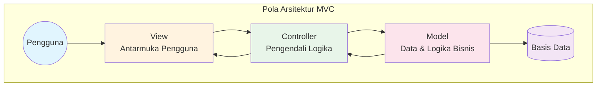
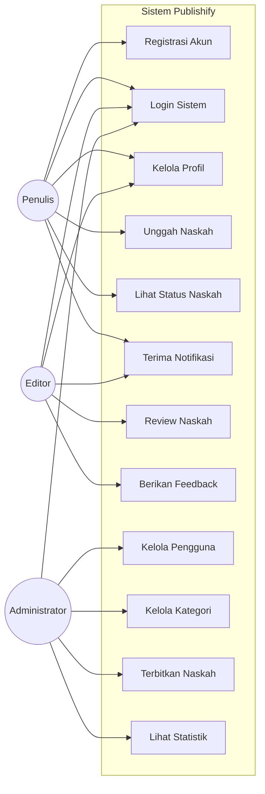
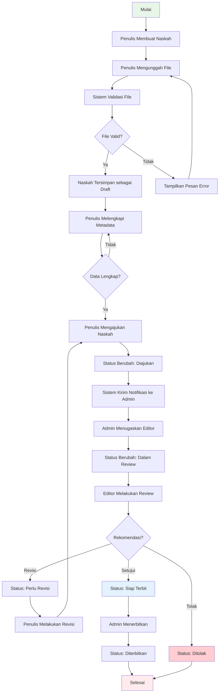
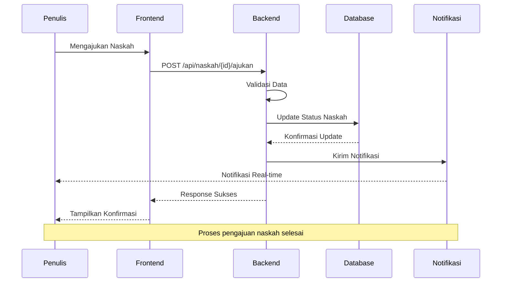
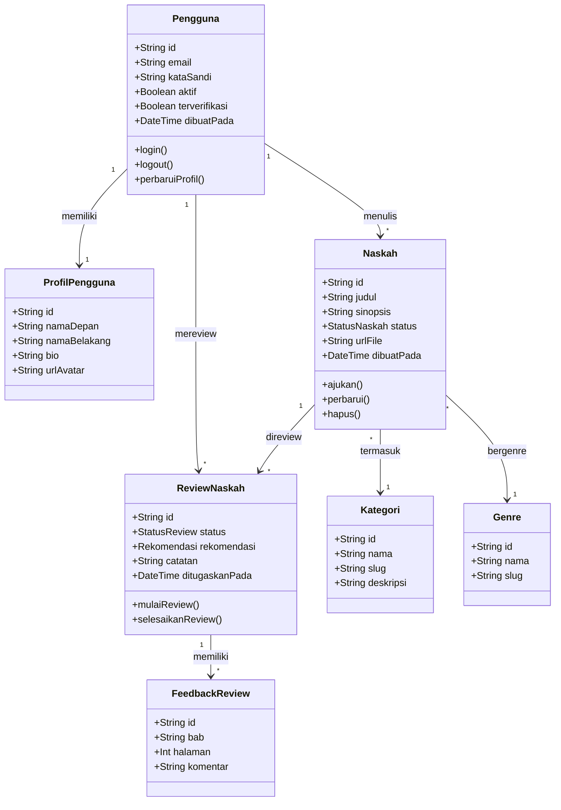
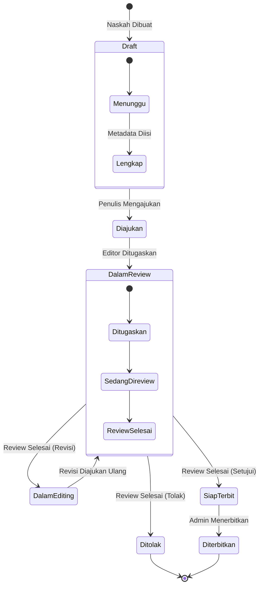
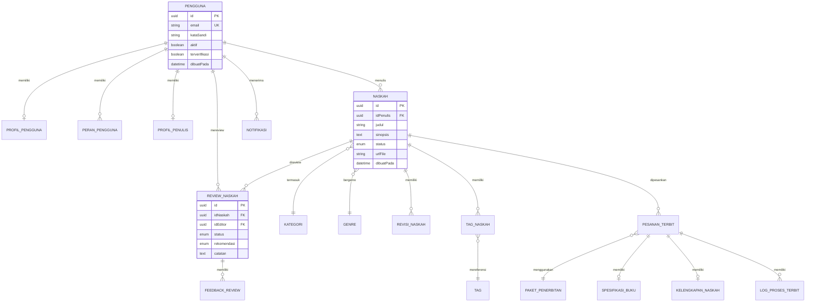
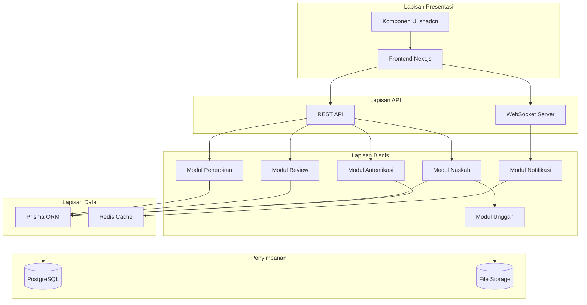
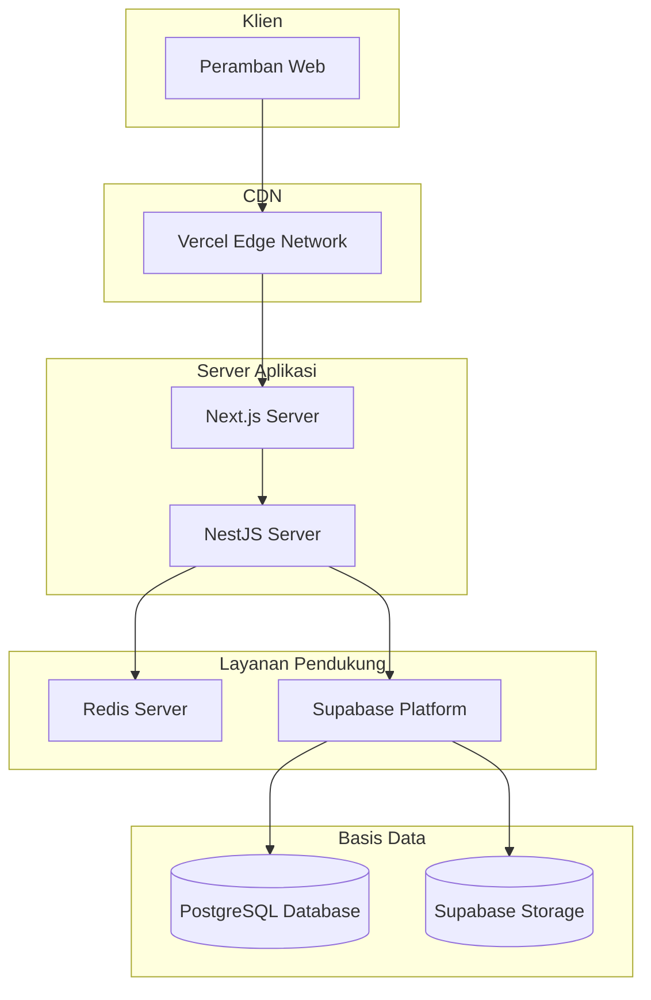
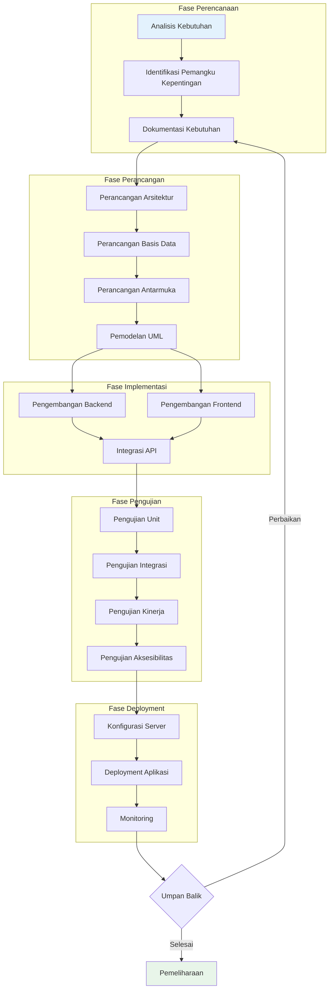

# BAB II

# KAJIAN TEORI

---

## A. Konsep Dasar Pengembangan Sistem

### 1. Definisi Sistem Informasi

Sistem informasi dapat didefinisikan sebagai seperangkat komponen yang saling terkait yang mengumpulkan, memproses, menyimpan, dan mendistribusikan informasi untuk mendukung pengambilan keputusan dan pengendalian dalam suatu organisasi (Laudon & Laudon, 2020). Dalam konteks penerbitan, sistem informasi berperan penting dalam mengelola alur kerja yang kompleks dari pengajuan naskah hingga publikasi akhir.

Pengembangan sistem informasi modern menekankan pada pendekatan yang terintegrasi, di mana berbagai komponen sistem bekerja secara harmonis untuk mencapai tujuan organisasi. Menurut Stair dan Reynolds (2018), sistem informasi yang efektif harus memiliki lima komponen utama: perangkat keras, perangkat lunak, basis data, jaringan, dan sumber daya manusia. Kelima komponen ini harus didesain dan dikembangkan secara koheren untuk menghasilkan sistem yang optimal.

### 2. Arsitektur Sistem Web Modern

Arsitektur sistem web telah mengalami evolusi yang signifikan selama beberapa dekade terakhir. Arsitektur monolitik yang menggabungkan seluruh komponen dalam satu kesatuan telah bergeser menuju arsitektur yang lebih termodular dan terpisah (Newman, 2021). Dalam pengembangan Publishify, kami mengadopsi arsitektur monorepo dengan pemisahan yang jelas antara komponen frontend dan backend.

#### a. Arsitektur Frontend

Frontend merupakan lapisan presentasi yang bertanggung jawab untuk menampilkan antarmuka pengguna dan menangani interaksi pengguna dengan sistem. Dalam pengembangan modern, framework berbasis komponen seperti React telah menjadi standar industri karena kemampuannya dalam membangun antarmuka yang reaktif dan dapat digunakan kembali (Banks & Porcello, 2020).

Next.js, sebagai framework React yang kami gunakan, menyediakan fitur-fitur lanjutan seperti server-side rendering, static site generation, dan API routes yang memungkinkan pengembangan aplikasi web yang performan dan ramah mesin pencari (Vercel, 2024). Penggunaan App Router dalam Next.js versi 14 memungkinkan pengelolaan rute yang lebih intuitif dan mendukung fitur-fitur React terbaru seperti Server Components.

#### b. Arsitektur Backend

Backend merupakan lapisan yang bertanggung jawab untuk mengelola logika bisnis, akses basis data, dan penyediaan layanan API. NestJS, framework yang kami gunakan untuk pengembangan backend, menyediakan arsitektur yang terstruktur berdasarkan prinsip-prinsip desain berorientasi objek dan pemrograman fungsional (Mysliwiec, 2023).

NestJS mengadopsi pola arsitektur modular yang memungkinkan pemisahan kode berdasarkan domain fungsional. Setiap modul dalam NestJS terdiri dari controller yang menangani permintaan HTTP, service yang mengimplementasikan logika bisnis, dan berbagai komponen pendukung seperti guard, interceptor, dan pipe. Arsitektur ini memudahkan pengujian, pemeliharaan, dan pengembangan fitur baru.

### 3. Pola Desain Model-View-Controller

Pola desain Model-View-Controller (MVC) merupakan arsitektur yang memisahkan aplikasi menjadi tiga komponen utama yang saling terhubung (Gamma et al., 1994). Dalam konteks pengembangan Publishify, penerapan MVC membantu dalam memisahkan tanggung jawab dan meningkatkan modularitas kode.

**Gambar 2.1 Diagram Arsitektur Model-View-Controller**

Komponen Model bertanggung jawab untuk mengelola data dan logika bisnis aplikasi. Dalam Publishify, model direpresentasikan melalui skema Prisma yang mendefinisikan struktur basis data dan relasi antar entitas. View bertanggung jawab untuk menampilkan data kepada pengguna melalui antarmuka yang interaktif. Komponen React dalam frontend Publishify berperan sebagai View yang merender informasi kepada pengguna. Controller berfungsi sebagai perantara antara Model dan View, menangani permintaan pengguna dan mengoordinasikan respons sistem.

### 4. Paradigma Pemrograman dalam Pengembangan Sistem

Pengembangan sistem modern mengadopsi berbagai paradigma pemrograman untuk mencapai kode yang bersih, terstruktur, dan mudah dipelihara. Dalam pengembangan Publishify, kami menerapkan beberapa paradigma pemrograman sebagai berikut:

**Tabel 2.1 Perbandingan Paradigma Pemrograman dalam Sistem**

| Paradigma                      | Deskripsi                                                               | Penerapan dalam Publishify                              |
| ------------------------------ | ----------------------------------------------------------------------- | ------------------------------------------------------- |
| Pemrograman Berorientasi Objek | Mengorganisasi kode dalam bentuk objek yang memiliki atribut dan metode | Kelas-kelas service dan controller dalam backend NestJS |
| Pemrograman Fungsional         | Menekankan fungsi murni dan immutabilitas data                          | Komponen React dan hooks dalam frontend                 |
| Pemrograman Reaktif            | Menangani aliran data asinkron dan event-driven                         | Sistem notifikasi real-time dengan WebSocket            |
| Pemrograman Deklaratif         | Mendeskripsikan apa yang ingin dicapai tanpa menentukan cara            | Query Prisma dan komponen React JSX                     |

### 5. Metodologi Pengembangan Sistem

Dalam pengembangan Publishify, kami mengadopsi metodologi pengembangan yang menggabungkan prinsip-prinsip Agile dengan praktik DevOps untuk mencapai siklus pengembangan yang cepat dan berkelanjutan. Pendekatan ini memungkinkan iterasi yang cepat berdasarkan umpan balik pengguna dan perubahan kebutuhan (Humble & Farley, 2010).

Pengembangan dilakukan dalam sprint-sprint pendek dengan durasi dua minggu, di mana setiap sprint menghasilkan increment yang dapat diuji dan dievaluasi. Pendekatan ini memungkinkan deteksi dini terhadap masalah dan penyesuaian arah pengembangan sesuai dengan kebutuhan yang terus berkembang.

---

## B. Pemodelan Sistem

Pemodelan sistem merupakan tahapan kritis dalam pengembangan perangkat lunak yang membantu dalam memvisualisasikan struktur dan perilaku sistem sebelum implementasi dilakukan. Dalam pengembangan Publishify, kami menggunakan Unified Modeling Language (UML) sebagai standar notasi untuk memodelkan berbagai aspek sistem.

UML menyediakan berbagai jenis diagram yang dapat digunakan untuk memodelkan aspek statis dan dinamis dari sistem (Rumbaugh et al., 2005). Kami menggunakan delapan jenis diagram UML untuk memodelkan sistem Publishify secara komprehensif.

### 1. Diagram Use Case

Diagram Use Case menggambarkan interaksi antara aktor (pengguna) dengan sistem melalui serangkaian use case yang merepresentasikan fungsionalitas sistem. Diagram ini membantu dalam mengidentifikasi kebutuhan fungsional sistem dari perspektif pengguna (Jacobson et al., 1992).

**Gambar 2.2 Diagram Use Case Sistem Publishify**

Dalam sistem Publishify, terdapat tiga aktor utama dengan tanggung jawab yang berbeda:

- **Penulis**: Dapat melakukan registrasi, login, mengelola profil, mengunggah naskah, melihat status naskah, dan menerima notifikasi.
- **Editor**: Dapat login, mengelola profil, melakukan review naskah, memberikan feedback, dan menerima notifikasi.
- **Administrator**: Dapat login, mengelola pengguna, mengelola kategori dan genre, menerbitkan naskah, dan melihat statistik sistem.

### 2. Diagram Aktivitas

Diagram Aktivitas menggambarkan alur kerja atau proses bisnis dalam sistem. Diagram ini menunjukkan urutan aktivitas dan keputusan yang terjadi dalam proses tertentu (OMG, 2017).

**Gambar 2.3 Diagram Aktivitas Proses Pengajuan Naskah**

### 3. Diagram Sekuens

Diagram Sekuens menggambarkan interaksi antar objek dalam urutan waktu tertentu. Diagram ini sangat berguna untuk memahami bagaimana komponen sistem berkolaborasi untuk menyelesaikan suatu tugas (Fowler, 2003).

**Gambar 2.4 Diagram Sekuens Proses Pengajuan Naskah**

### 4. Diagram Kelas

Diagram Kelas menggambarkan struktur statis sistem dengan menunjukkan kelas-kelas, atribut, metode, dan relasi antar kelas. Diagram ini merupakan fondasi untuk implementasi sistem berorientasi objek (Booch et al., 2005).

**Gambar 2.5 Diagram Kelas Sistem Publishify**

### 5. Diagram State Machine

Diagram State Machine menggambarkan perubahan status dari suatu objek sebagai respons terhadap event tertentu. Dalam konteks Publishify, diagram ini sangat relevan untuk memodelkan siklus hidup naskah.

**Gambar 2.6 Diagram State Machine Status Naskah**

### 6. Entity Relationship Diagram

Entity Relationship Diagram (ERD) menggambarkan struktur basis data dan relasi antar entitas. Diagram ini menjadi acuan dalam perancangan skema basis data sistem.

**Gambar 2.7 Entity Relationship Diagram Sistem Publishify**

### 7. Diagram Komponen

Diagram Komponen menggambarkan organisasi dan ketergantungan antar komponen dalam sistem. Diagram ini membantu dalam memahami arsitektur tingkat tinggi dari sistem.

**Gambar 2.8 Diagram Komponen Arsitektur Sistem**

### 8. Diagram Deployment

Diagram Deployment menggambarkan konfigurasi fisik dari perangkat keras dan perangkat lunak dalam lingkungan produksi.

**Gambar 2.9 Diagram Deployment Sistem Web**

---

## C. Interaksi Manusia dan Sistem

### 1. Konsep Dasar Interaksi Manusia dan Komputer

Interaksi Manusia dan Komputer (IMK) atau Human-Computer Interaction (HCI) merupakan bidang studi yang berfokus pada perancangan, evaluasi, dan implementasi sistem komputasi interaktif untuk digunakan oleh manusia, serta studi tentang fenomena-fenomena utama yang melingkupinya (Hewett et al., 1992). Dalam pengembangan sistem web, pemahaman yang mendalam tentang IMK sangat penting untuk menciptakan antarmuka yang tidak hanya fungsional tetapi juga menyenangkan dan mudah digunakan.

Menurut Nielsen (2000), kegunaan (usability) sebuah sistem dapat diukur melalui lima atribut kualitas:

1. **Kemudahan Dipelajari (Learnability)**: Seberapa mudah pengguna dapat menyelesaikan tugas dasar saat pertama kali menggunakan sistem.

2. **Efisiensi (Efficiency)**: Seberapa cepat pengguna dapat menyelesaikan tugas setelah mempelajari sistem.

3. **Kemudahan Diingat (Memorability)**: Seberapa mudah pengguna dapat mengingat cara menggunakan sistem setelah periode tidak menggunakannya.

4. **Kesalahan (Errors)**: Seberapa banyak kesalahan yang dibuat pengguna, seberapa serius kesalahan tersebut, dan seberapa mudah pengguna dapat pulih dari kesalahan.

5. **Kepuasan (Satisfaction)**: Seberapa menyenangkan penggunaan sistem bagi pengguna.

### 2. Prinsip Desain Antarmuka untuk Sistem Web

Dalam merancang antarmuka sistem web Publishify, kami menerapkan beberapa prinsip desain yang telah diakui secara luas dalam komunitas IMK. Ben Shneiderman (2016) mengidentifikasi delapan aturan emas dalam perancangan antarmuka yang kami adopsi dalam pengembangan Publishify:

**Tabel 2.2 Penerapan Prinsip Desain Antarmuka dalam Publishify**

| Prinsip                 | Deskripsi                                              | Penerapan dalam Publishify                                      |
| ----------------------- | ------------------------------------------------------ | --------------------------------------------------------------- |
| Konsistensi             | Gunakan terminologi dan tata letak yang konsisten      | Penggunaan komponen UI shadcn yang konsisten di seluruh halaman |
| Pintasan                | Sediakan pintasan untuk pengguna berpengalaman         | Navigasi sidebar yang memungkinkan akses cepat ke fitur utama   |
| Umpan Balik Informatif  | Berikan respons untuk setiap aksi pengguna             | Sistem notifikasi real-time dan pesan konfirmasi                |
| Penutupan Dialog        | Rancang dialog yang memiliki awal dan akhir yang jelas | Modal konfirmasi dan notifikasi sukses setelah operasi selesai  |
| Pencegahan Kesalahan    | Rancang sistem untuk mencegah kesalahan serius         | Validasi formulir real-time dan konfirmasi sebelum hapus data   |
| Pembalikan Aksi         | Izinkan pembatalan aksi dengan mudah                   | Fitur draft yang memungkinkan penyimpanan dan pengeditan        |
| Kendali Pengguna        | Biarkan pengguna merasa mengendalikan sistem           | Antarmuka yang responsif dengan navigasi yang jelas             |
| Minimalkan Beban Memori | Kurangi informasi yang harus diingat pengguna          | Antarmuka yang intuitif dengan label yang jelas                 |

### 3. Desain Responsif dan Aksesibilitas

Desain responsif merupakan pendekatan dalam pengembangan web yang memungkinkan tampilan website beradaptasi dengan berbagai ukuran layar dan perangkat. Dalam pengembangan Publishify, kami menggunakan Tailwind CSS yang menyediakan utilitas-utilitas yang memudahkan implementasi desain responsif (Tailwind Labs, 2024).

Aksesibilitas web mengacu pada praktik inklusif untuk memastikan bahwa website dapat diakses oleh semua orang, termasuk mereka yang memiliki disabilitas. Kami mengikuti Web Content Accessibility Guidelines (WCAG) 2.1 dalam pengembangan Publishify untuk memastikan sistem dapat digunakan oleh pengguna dengan berbagai kemampuan (W3C, 2018).

### 4. Pengalaman Pengguna dalam Konteks Penerbitan

Pengalaman Pengguna (User Experience/UX) dalam konteks sistem penerbitan memiliki tantangan tersendiri. Pengguna sistem penerbitan memiliki karakteristik yang beragam, mulai dari penulis pemula hingga editor profesional yang berpengalaman. Oleh karena itu, antarmuka harus dirancang untuk mengakomodasi berbagai tingkat keahlian dan preferensi pengguna.

Dalam merancang pengalaman pengguna Publishify, kami menerapkan pendekatan desain yang berpusat pada pengguna (User-Centered Design) yang melibatkan iterasi berulang antara perancangan, implementasi, dan evaluasi berdasarkan umpan balik pengguna (Norman, 2013).

---

## D. Kerangka Pengembangan Sistem

### 1. Metodologi Pengembangan

Pengembangan sistem Publishify mengadopsi metodologi Agile dengan framework Scrum yang disesuaikan. Metodologi ini dipilih karena fleksibilitasnya dalam mengakomodasi perubahan kebutuhan selama proses pengembangan (Schwaber & Sutherland, 2020).

### 2. Diagram Alir Pengembangan Sistem Web

**Gambar 2.11 Diagram Alir Pengembangan Sistem Web**

### 3. Teknologi yang Digunakan

Pemilihan teknologi dalam pengembangan Publishify didasarkan pada beberapa pertimbangan, termasuk kematangan teknologi, dukungan komunitas, skalabilitas, dan kesesuaian dengan kebutuhan proyek.

**Tabel 2.3 Teknologi yang Digunakan dalam Pengembangan Sistem Web**

| Kategori           | Teknologi      | Versi | Fungsi                                        |
| ------------------ | -------------- | ----- | --------------------------------------------- |
| Runtime            | Bun            | 1.0+  | Package manager dan runtime JavaScript        |
| Frontend Framework | Next.js        | 14+   | Framework React untuk aplikasi web            |
| Backend Framework  | NestJS         | 10+   | Framework Node.js untuk API                   |
| Bahasa Pemrograman | TypeScript     | 5.0+  | Superset JavaScript dengan type safety        |
| Basis Data         | PostgreSQL     | 14+   | Sistem manajemen basis data relasional        |
| ORM                | Prisma         | 5.0+  | Object-Relational Mapping                     |
| Styling            | Tailwind CSS   | 3.4+  | Framework CSS utility-first                   |
| Komponen UI        | shadcn/ui      | -     | Koleksi komponen React yang dapat disesuaikan |
| State Management   | Zustand        | 4.5+  | State management minimalis untuk React        |
| Data Fetching      | TanStack Query | 5.0+  | Library untuk fetching dan caching data       |
| Real-time          | Socket.io      | 4.6+  | Library untuk komunikasi real-time            |
| Caching            | Redis          | -     | In-memory data store                          |

---

**Catatan untuk Penyusunan:**

Pada bagian BAB II ini, semua diagram yang ditampilkan menggunakan sintaks Mermaid. Untuk menyertakannya dalam dokumen laporan resmi, diagram-diagram tersebut perlu dirender menjadi gambar.

File referensi untuk implementasi konsep:

- Arsitektur backend: `backend/src/app.module.ts`
- Skema database: `backend/prisma/schema.prisma`
- Komponen frontend: `frontend/components/`
- Konfigurasi: `backend/src/config/`
