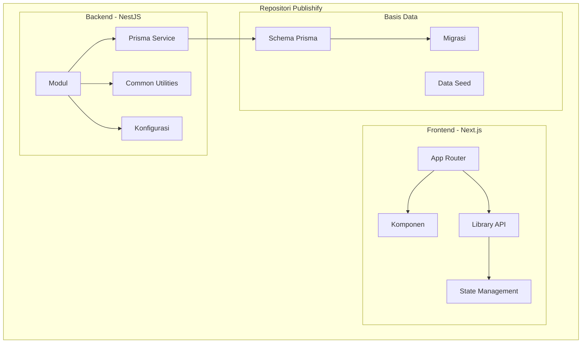
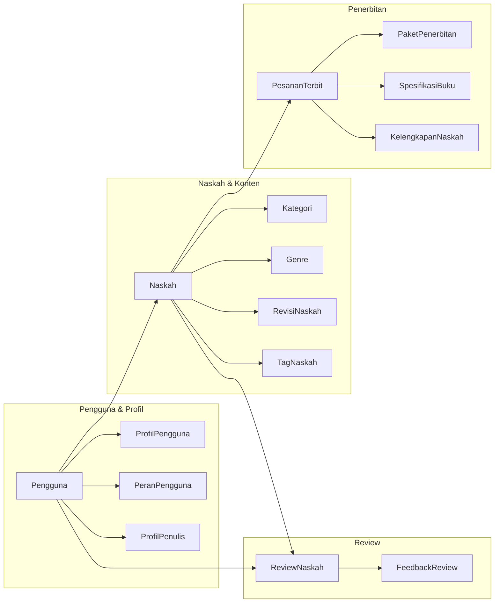
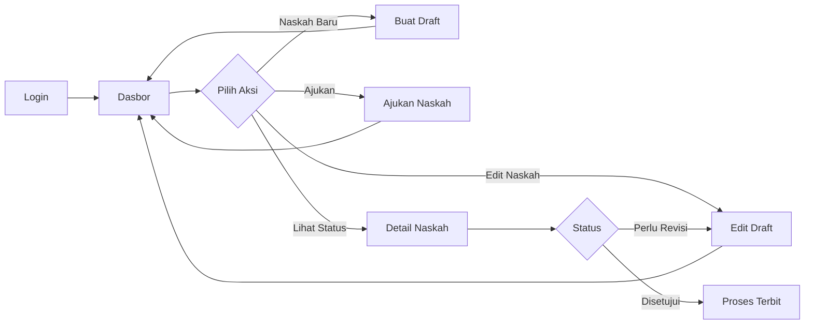

# BAB III

# PERANCANGAN SISTEM

---

## A. Perancangan Sistem Web

Perancangan sistem web Publishify dilakukan dengan pendekatan yang sistematis dan terstruktur, memperhatikan aspek arsitektur, basis data, antarmuka pengguna, dan interaksi pengguna. Pada bagian ini, kami akan menguraikan secara komprehensif setiap aspek perancangan yang telah dilakukan.

### 1. Perancangan Arsitektur Sistem

#### a. Arsitektur Keseluruhan

Sistem Publishify dikembangkan dengan arsitektur monorepo yang memisahkan komponen frontend dan backend dalam satu repositori. Pendekatan ini memberikan kemudahan dalam pengelolaan kode, konsistensi versi, dan koordinasi pengembangan antar tim (Lerner, 2022).



**Gambar 3.1 Arsitektur Monorepo Sistem Publishify**

#### b. Arsitektur Frontend

Frontend Publishify dikembangkan menggunakan Next.js versi 14 dengan App Router yang menyediakan fitur-fitur modern seperti Server Components, Streaming, dan Route Handlers. Arsitektur frontend dirancang dengan pemisahan yang jelas antara komponen presentasi dan logika bisnis.

**Struktur Direktori Frontend:**

```
frontend/
├── app/                    # Next.js App Router
│   ├── (admin)/           # Route group untuk administrator
│   ├── (auth)/            # Route group untuk autentikasi
│   ├── (editor)/          # Route group untuk editor
│   ├── (penulis)/         # Route group untuk penulis
│   ├── (publik)/          # Route group untuk halaman publik
│   ├── layout.tsx         # Layout utama
│   └── page.tsx           # Halaman beranda
├── components/            # Komponen React
│   ├── dashboard/         # Komponen dasbor
│   ├── landing/           # Komponen halaman landing
│   ├── naskah/            # Komponen manajemen naskah
│   ├── penerbitan/        # Komponen penerbitan
│   ├── shared/            # Komponen bersama
│   └── ui/                # Komponen UI dasar (shadcn)
├── lib/                   # Library dan utilitas
│   ├── api/               # Klien API
│   ├── constants/         # Konstanta
│   ├── hooks/             # Custom hooks
│   └── utils.ts           # Fungsi utilitas
├── stores/                # State management (Zustand)
└── types/                 # Definisi tipe TypeScript
```

Penggunaan route groups dalam App Router memungkinkan pengelompokan halaman berdasarkan peran pengguna tanpa mempengaruhi struktur URL. Setiap route group memiliki layout tersendiri yang disesuaikan dengan kebutuhan pengguna spesifik.

#### c. Arsitektur Backend

Backend Publishify dikembangkan menggunakan NestJS dengan arsitektur modular yang memisahkan fungsionalitas berdasarkan domain bisnis. Setiap modul bertanggung jawab atas satu domain spesifik dan mengenkapsulasi controller, service, dan Data Transfer Object (DTO) yang terkait.

**Struktur Direktori Backend:**

```
backend/
├── src/
│   ├── modules/           # Modul-modul bisnis
│   │   ├── auth/          # Modul autentikasi
│   │   ├── genre/         # Modul genre
│   │   ├── kategori/      # Modul kategori
│   │   ├── naskah/        # Modul naskah
│   │   ├── notifikasi/    # Modul notifikasi
│   │   ├── penerbitan/    # Modul penerbitan
│   │   ├── pengguna/      # Modul pengguna
│   │   ├── review/        # Modul review
│   │   └── upload/        # Modul unggah file
│   ├── common/            # Utilitas bersama
│   │   ├── cache/         # Sistem caching
│   │   ├── decorators/    # Custom decorators
│   │   ├── filters/       # Exception filters
│   │   ├── guards/        # Auth guards
│   │   ├── interceptors/  # Request/response interceptors
│   │   ├── logger/        # Sistem logging
│   │   └── pipes/         # Validation pipes
│   ├── config/            # Konfigurasi sistem
│   ├── prisma/            # Prisma service
│   └── utils/             # Fungsi utilitas
├── prisma/
│   ├── schema.prisma      # Skema basis data
│   ├── migrations/        # File migrasi
│   └── seed.ts            # Data seed
└── test/                  # Pengujian
```

Arsitektur modular ini memudahkan pengembangan, pengujian, dan pemeliharaan sistem. Setiap modul dapat dikembangkan dan diuji secara independen, serta dapat dengan mudah diperluas atau dimodifikasi tanpa mempengaruhi modul lainnya.

### 2. Perancangan Basis Data

#### a. Analisis Kebutuhan Data

Perancangan basis data dimulai dengan mengidentifikasi entitas-entitas utama yang diperlukan dalam sistem manajemen penerbitan. Berdasarkan analisis kebutuhan, kami mengidentifikasi empat kelompok entitas utama:

1. **Kelompok Manajemen Pengguna**: Pengguna, ProfilPengguna, PeranPengguna, ProfilPenulis
2. **Kelompok Manajemen Konten**: Naskah, Kategori, Genre, Tag, RevisiNaskah
3. **Kelompok Sistem Review**: ReviewNaskah, FeedbackReview
4. **Kelompok Penerbitan**: PaketPenerbitan, PesananTerbit, SpesifikasiBuku, KelengkapanNaskah

#### b. Skema Basis Data

Basis data Publishify menggunakan PostgreSQL sebagai sistem manajemen basis data relasional. Prisma digunakan sebagai ORM untuk memudahkan interaksi dengan basis data melalui API yang type-safe.

**Tabel 3.1 Daftar Tabel dalam Basis Data Publishify**

| No  | Nama Tabel         | Deskripsi                    | Jumlah Kolom |
| --- | ------------------ | ---------------------------- | ------------ |
| 1   | pengguna           | Data pengguna sistem         | 16           |
| 2   | profil_pengguna    | Profil lengkap pengguna      | 14           |
| 3   | peran_pengguna     | Peran yang dimiliki pengguna | 6            |
| 4   | profil_penulis     | Profil khusus penulis        | 12           |
| 5   | naskah             | Data naskah                  | 22           |
| 6   | kategori           | Kategori naskah              | 8            |
| 7   | genre              | Genre naskah                 | 6            |
| 8   | tag                | Tag untuk naskah             | 4            |
| 9   | tag_naskah         | Relasi tag-naskah            | 4            |
| 10  | revisi_naskah      | Histori revisi naskah        | 6            |
| 11  | review_naskah      | Data review editorial        | 10           |
| 12  | feedback_review    | Umpan balik review           | 6            |
| 13  | notifikasi         | Notifikasi pengguna          | 8            |
| 14  | token_refresh      | Token refresh JWT            | 6            |
| 15  | log_aktivitas      | Log aktivitas sistem         | 10           |
| 16  | oauth_state        | State OAuth                  | 6            |
| 17  | statistik_naskah   | Statistik naskah             | 8            |
| 18  | rating_review      | Rating dan ulasan            | 6            |
| 19  | file               | Data file yang diunggah      | 14           |
| 20  | paket_penerbitan   | Paket layanan penerbitan     | 14           |
| 21  | pesanan_terbit     | Pesanan penerbitan           | 24           |
| 22  | spesifikasi_buku   | Spesifikasi cetak buku       | 14           |
| 23  | kelengkapan_naskah | Kelengkapan dokumen naskah   | 18           |
| 24  | log_proses_terbit  | Log proses penerbitan        | 6            |

#### c. Definisi Enum

Sistem menggunakan enum untuk mendefinisikan nilai-nilai tetap yang digunakan dalam berbagai entitas. Penggunaan enum memastikan konsistensi data dan memudahkan validasi.

**Tabel 3.2 Definisi Enum dalam Basis Data**

| Nama Enum        | Nilai-nilai                                                                     | Keterangan               |
| ---------------- | ------------------------------------------------------------------------------- | ------------------------ |
| JenisPeran       | penulis, editor, admin                                                          | Jenis peran pengguna     |
| StatusNaskah     | draft, diajukan, dalam_review, dalam_editing, siap_terbit, diterbitkan, ditolak | Status alur kerja naskah |
| StatusReview     | ditugaskan, dalam_proses, selesai, dibatalkan                                   | Status proses review     |
| Rekomendasi      | setujui, revisi, tolak                                                          | Rekomendasi hasil review |
| TipeNotifikasi   | info, sukses, peringatan, error                                                 | Tipe notifikasi          |
| Platform         | web, mobile                                                                     | Platform pengguna        |
| StatusPenerbitan | draft, menunggu_pembayaran, dst.                                                | Status proses penerbitan |
| JenisSampul      | softcover, hardcover                                                            | Jenis sampul buku        |
| JenisKertas      | hvs_70, hvs_80, bookpaper_55, dst.                                              | Jenis kertas isi         |
| JenisJilid       | lem_panas, jahit_benang, spiral, ring                                           | Jenis penjilidan         |

#### d. Relasi Antar Tabel

Relasi antar tabel dalam basis data Publishify dirancang untuk memastikan integritas data dan efisiensi query. Berikut adalah ringkasan relasi utama:



**Gambar 3.2 Diagram Relasi Utama Antar Tabel**

### 3. Perancangan Antarmuka Pengguna

#### a. Prinsip Desain Visual

Perancangan antarmuka pengguna Publishify mengikuti prinsip-prinsip desain visual yang konsisten untuk menciptakan pengalaman pengguna yang kohesif. Kami mengadopsi sistem desain yang mencakup:

**Tabel 3.3 Panduan Warna dan Tipografi**

| Elemen           | Spesifikasi       | Penggunaan                        |
| ---------------- | ----------------- | --------------------------------- |
| Warna Primer     | Biru (#3B82F6)    | Tombol utama, tautan, aksen       |
| Warna Sekunder   | Abu-abu (#6B7280) | Teks sekunder, border             |
| Warna Sukses     | Hijau (#10B981)   | Notifikasi sukses, status positif |
| Warna Peringatan | Kuning (#F59E0B)  | Peringatan, status menunggu       |
| Warna Error      | Merah (#EF4444)   | Pesan error, status negatif       |
| Font Utama       | Inter             | Teks umum                         |
| Font Heading     | Inter Semibold    | Judul dan heading                 |
| Ukuran Base      | 16px              | Teks paragraf                     |

#### b. Komponen Antarmuka

Sistem antarmuka Publishify dibangun menggunakan komponen-komponen dari shadcn/ui yang telah disesuaikan dengan kebutuhan sistem. Komponen-komponen ini mencakup:

1. **Komponen Navigasi**: Header, Sidebar, Breadcrumb, Tab
2. **Komponen Input**: Button, Input, Select, Textarea, Checkbox, Switch
3. **Komponen Data**: Table, Card, Badge, Skeleton
4. **Komponen Overlay**: Dialog, Dropdown, Alert
5. **Komponen Umpan Balik**: Toast (Sonner), Loading Indicator

#### c. Wireframe Halaman Utama

Berikut adalah deskripsi wireframe untuk halaman-halaman utama sistem:

**1. Halaman Beranda**

Halaman beranda menampilkan informasi umum tentang Publishify dengan struktur sebagai berikut:

- Header dengan navigasi dan tombol masuk/daftar
- Hero section dengan tagline dan tombol aksi
- Bagian fitur utama dengan ikon dan deskripsi
- Bagian proses penerbitan dengan langkah-langkah visual
- Bagian testimoni dari pengguna
- Footer dengan tautan penting

**[Tempat Screenshot: Wireframe Halaman Beranda]**

> Referensi file: `frontend/app/page.tsx` dan `frontend/components/landing/`

**2. Dasbor Penulis**

Dasbor penulis menyediakan akses cepat ke fitur-fitur utama:

- Sidebar navigasi dengan menu: Beranda, Draf Saya, Ajukan Draf, Buku Terbit, Paket Terbit, Pesanan Terbit, Pengaturan
- Area konten utama dengan statistik ringkasan
- Daftar naskah terbaru dengan status
- Notifikasi terkini

**[Tempat Screenshot: Wireframe Dasbor Penulis]**

> Referensi file: `frontend/app/(penulis)/penulis/page.tsx`

**3. Dasbor Editor**

Dasbor editor difokuskan pada tugas-tugas review:

- Sidebar navigasi dengan menu: Beranda, Antrian Review, Naskah Dalam Review, Statistik, Pengaturan
- Area konten dengan daftar tugas review
- Detail naskah yang sedang direview
- Panel umpan balik

**[Tempat Screenshot: Wireframe Dasbor Editor]**

> Referensi file: `frontend/app/(editor)/editor/` folder

**4. Dasbor Administrator**

Dasbor administrator menyediakan kontrol penuh atas sistem:

- Sidebar navigasi lengkap dengan semua modul
- Area statistik sistem secara keseluruhan
- Manajemen pengguna, naskah, kategori, dan genre
- Panel monitoring dan pelaporan

**[Tempat Screenshot: Wireframe Dasbor Administrator]**

> Referensi file: `frontend/app/(admin)/admin/` folder

### 4. Perancangan Interaksi Pengguna

#### a. Alur Kerja Pengguna

Perancangan interaksi pengguna dimulai dengan memetakan alur kerja (workflow) untuk setiap peran pengguna. Alur kerja ini menjadi acuan dalam merancang navigasi dan transisi antar halaman.

**Alur Kerja Penulis:**



**Gambar 3.3 Alur Kerja Pengguna Penulis**

#### b. Prinsip Interaksi

Dalam merancang interaksi pengguna, kami menerapkan prinsip-prinsip berikut:

1. **Umpan Balik Langsung**: Setiap aksi pengguna mendapat respons visual dalam waktu kurang dari 100ms untuk memberikan kesan responsif.

2. **Progres yang Terlihat**: Untuk operasi yang membutuhkan waktu, sistem menampilkan indikator progres agar pengguna mengetahui bahwa sistem sedang memproses.

3. **Konfirmasi untuk Aksi Kritis**: Aksi-aksi yang tidak dapat dibatalkan seperti penghapusan data memerlukan konfirmasi dari pengguna.

4. **Navigasi yang Konsisten**: Struktur navigasi konsisten di seluruh halaman untuk memudahkan pengguna dalam berpindah antar fitur.

5. **Penanganan Kesalahan yang Jelas**: Pesan kesalahan ditampilkan dengan bahasa yang mudah dipahami dan disertai panduan untuk mengatasi masalah.

#### c. Responsivitas Antarmuka

Antarmuka Publishify dirancang untuk responsif terhadap berbagai ukuran layar. Breakpoint yang digunakan mengikuti standar Tailwind CSS:

**Tabel 3.4 Breakpoint Desain Responsif**

| Breakpoint | Ukuran  | Penyesuaian                           |
| ---------- | ------- | ------------------------------------- |
| sm         | ≥640px  | Navigasi mobile, layout satu kolom    |
| md         | ≥768px  | Sidebar tersembunyi, layout dua kolom |
| lg         | ≥1024px | Sidebar terlihat, layout penuh        |
| xl         | ≥1280px | Konten lebih lebar, spacing optimal   |
| 2xl        | ≥1536px | Layout maksimal, optimasi layar besar |

#### d. Aksesibilitas

Perancangan aksesibilitas mencakup:

1. **Navigasi Keyboard**: Semua elemen interaktif dapat diakses menggunakan keyboard dengan urutan tab yang logis.

2. **Label ARIA**: Elemen-elemen kompleks dilengkapi dengan atribut ARIA untuk pembaca layar.

3. **Kontras Warna**: Rasio kontras warna minimal 4.5:1 untuk teks normal dan 3:1 untuk teks besar sesuai WCAG 2.1.

4. **Ukuran Target Sentuh**: Elemen yang dapat diklik memiliki area minimal 44x44 piksel untuk kemudahan interaksi pada perangkat sentuh.

---

## Spesifikasi Kebutuhan Fungsional

**Tabel 3.5 Spesifikasi Kebutuhan Fungsional Sistem Web**

| ID  | Modul       | Kebutuhan                                                  | Prioritas |
| --- | ----------- | ---------------------------------------------------------- | --------- |
| F01 | Autentikasi | Pengguna dapat mendaftar dengan email dan kata sandi       | Tinggi    |
| F02 | Autentikasi | Pengguna dapat masuk menggunakan kredensial yang terdaftar | Tinggi    |
| F03 | Autentikasi | Pengguna dapat masuk menggunakan akun Google (OAuth)       | Sedang    |
| F04 | Autentikasi | Pengguna dapat mengatur ulang kata sandi melalui email     | Tinggi    |
| F05 | Profil      | Pengguna dapat melihat dan memperbarui profil              | Tinggi    |
| F06 | Naskah      | Penulis dapat membuat draft naskah baru                    | Tinggi    |
| F07 | Naskah      | Penulis dapat mengunggah file naskah                       | Tinggi    |
| F08 | Naskah      | Penulis dapat mengedit metadata naskah                     | Tinggi    |
| F09 | Naskah      | Penulis dapat mengajukan naskah untuk review               | Tinggi    |
| F10 | Naskah      | Penulis dapat melihat status naskah                        | Tinggi    |
| F11 | Review      | Editor dapat melihat antrian review                        | Tinggi    |
| F12 | Review      | Editor dapat mengambil tugas review                        | Tinggi    |
| F13 | Review      | Editor dapat memberikan feedback pada naskah               | Tinggi    |
| F14 | Review      | Editor dapat memberikan rekomendasi (setujui/revisi/tolak) | Tinggi    |
| F15 | Admin       | Administrator dapat mengelola pengguna                     | Tinggi    |
| F16 | Admin       | Administrator dapat mengelola kategori dan genre           | Tinggi    |
| F17 | Admin       | Administrator dapat menerbitkan naskah                     | Tinggi    |
| F18 | Notifikasi  | Sistem mengirim notifikasi real-time                       | Sedang    |
| F19 | Penerbitan  | Penulis dapat memilih paket penerbitan                     | Sedang    |
| F20 | Penerbitan  | Penulis dapat melacak proses penerbitan                    | Sedang    |

---

**Catatan untuk Penyusunan:**

Pada bagian BAB III ini, perlu ditambahkan tangkapan layar atau mockup dari:

1. **Gambar 3.4**: Wireframe halaman beranda
   - File: `frontend/app/page.tsx`
   - Komponen: `frontend/components/landing/`

2. **Gambar 3.5**: Wireframe dasbor penulis
   - File: `frontend/app/(penulis)/penulis/page.tsx`

3. **Gambar 3.6**: Wireframe dasbor editor
   - File: `frontend/app/(editor)/editor/`

4. **Gambar 3.7**: Wireframe dasbor administrator
   - File: `frontend/app/(admin)/admin/`

5. **Gambar 3.8**: Mockup komponen UI
   - Folder: `frontend/components/ui/`

Untuk skema basis data lengkap, dapat dilampirkan:

- File: `backend/prisma/schema.prisma`
