# BAB IV

# HASIL DAN PEMBAHASAN

---

## A. Hasil Pengembangan Sistem

### 1. Hasil Sistem Web

Pengembangan sistem web Publishify telah berhasil diselesaikan dengan mengimplementasikan seluruh fitur yang telah direncanakan pada tahap perancangan. Sistem ini telah diuji coba dan dapat diakses melalui domain https://publishify.me/. Pada bagian ini, kami akan memaparkan hasil implementasi dari setiap modul yang telah dikembangkan.

#### a. Modul Autentikasi

Modul autentikasi berhasil diimplementasikan dengan fitur-fitur sebagai berikut:

1. **Registrasi Pengguna**: Pengguna dapat mendaftar ke sistem dengan mengisi formulir registrasi yang mencakup email, kata sandi, dan data profil dasar. Sistem menerapkan validasi email unik dan persyaratan kekuatan kata sandi untuk memastikan keamanan akun.

2. **Login dengan Kredensial**: Pengguna dapat masuk ke sistem menggunakan email dan kata sandi yang telah terdaftar. Sistem menggunakan JSON Web Token (JWT) untuk autentikasi dan otorisasi, dengan implementasi access token dan refresh token untuk keamanan yang optimal.

3. **Login dengan Google OAuth**: Integrasi dengan Google OAuth 2.0 memungkinkan pengguna untuk masuk menggunakan akun Google mereka dengan proses yang lebih cepat dan aman.

4. **Verifikasi Email**: Setelah registrasi, sistem mengirimkan email verifikasi kepada pengguna untuk memvalidasi alamat email dan mengaktifkan akun.

5. **Pengaturan Ulang Kata Sandi**: Pengguna yang lupa kata sandi dapat meminta tautan pengaturan ulang melalui email.

**[Tempat Screenshot: Halaman Login dan Registrasi]**

> Referensi file:
>
> - `frontend/app/(auth)/login/page.tsx`
> - `frontend/app/(auth)/register/page.tsx`
> - `backend/src/modules/auth/`

#### b. Modul Manajemen Naskah

Modul manajemen naskah merupakan inti dari sistem Publishify yang memungkinkan penulis untuk mengelola naskah mereka sepanjang siklus hidup penerbitan.

1. **Pembuatan Draft Naskah**: Penulis dapat membuat draft naskah baru dengan mengisi metadata seperti judul, sub-judul, sinopsis, kategori, dan genre. Sistem menyimpan draft secara otomatis untuk mencegah kehilangan data.

2. **Pengunggahan File Naskah**: Sistem mendukung pengunggahan file naskah dalam berbagai format dengan validasi ukuran dan tipe file. File yang diunggah disimpan secara aman di Supabase Storage.

3. **Pengelolaan Revisi**: Setiap perubahan pada naskah tercatat dalam sistem revisi, memungkinkan pelacakan histori perubahan dan kemampuan untuk kembali ke versi sebelumnya.

4. **Pengajuan untuk Review**: Penulis dapat mengajukan naskah yang telah lengkap untuk direview oleh editor. Sistem memvalidasi kelengkapan data sebelum pengajuan diproses.

5. **Pelacakan Status**: Penulis dapat melihat status terkini naskah mereka melalui dasbor dengan visualisasi yang jelas untuk setiap tahapan proses.

**[Tempat Screenshot: Halaman Manajemen Naskah]**

> Referensi file:
>
> - `frontend/app/(penulis)/penulis/draf-saya/page.tsx`
> - `frontend/app/(penulis)/penulis/ajukan-draf/page.tsx`
> - `backend/src/modules/naskah/`

#### c. Modul Review Editorial

Modul review editorial menyediakan alat bagi editor untuk melakukan review naskah secara terstruktur dan efisien.

1. **Antrian Review**: Editor dapat melihat daftar naskah yang memerlukan review dengan informasi prioritas dan tenggat waktu.

2. **Pengambilan Tugas**: Editor dapat mengambil tugas review dari antrian atau ditugaskan oleh administrator.

3. **Pemberian Feedback**: Editor dapat memberikan feedback detail pada setiap bagian naskah, termasuk spesifikasi bab dan halaman yang memerlukan perbaikan.

4. **Rekomendasi**: Setelah menyelesaikan review, editor memberikan rekomendasi: setujui untuk penerbitan, revisi diperlukan, atau tolak.

5. **Pelacakan Progres**: Sistem mencatat progres review dan waktu yang dibutuhkan untuk setiap tahapan.

**[Tempat Screenshot: Dasbor Editor dan Panel Review]**

> Referensi file:
>
> - `frontend/app/(editor)/editor/`
> - `backend/src/modules/review/`

#### d. Modul Administrasi

Modul administrasi memberikan kontrol penuh kepada administrator untuk mengelola seluruh aspek sistem.

1. **Manajemen Pengguna**: Administrator dapat melihat, mengedit, dan menonaktifkan akun pengguna. Fitur pencarian dan filter memudahkan pengelolaan pengguna dalam jumlah besar.

2. **Manajemen Kategori dan Genre**: Administrator dapat menambah, mengedit, dan menghapus kategori serta genre yang tersedia dalam sistem.

3. **Penugasan Editor**: Administrator dapat menugaskan editor untuk mereview naskah tertentu berdasarkan keahlian dan beban kerja.

4. **Penerbitan Naskah**: Administrator memiliki wewenang untuk menerbitkan naskah yang telah disetujui, termasuk pengaturan ISBN dan tanggal terbit.

5. **Monitoring Sistem**: Dasbor administrator menampilkan statistik sistem secara real-time, termasuk jumlah naskah, pengguna aktif, dan metrik penting lainnya.

**[Tempat Screenshot: Dasbor Administrator]**

> Referensi file:
>
> - `frontend/app/(admin)/admin/`
> - `backend/src/modules/pengguna/`
> - `backend/src/modules/kategori/`
> - `backend/src/modules/genre/`

#### e. Modul Notifikasi

Sistem notifikasi real-time berhasil diimplementasikan menggunakan WebSocket untuk memberikan informasi terkini kepada pengguna.

1. **Notifikasi Real-time**: Pengguna menerima notifikasi langsung saat ada aktivitas yang relevan, seperti perubahan status naskah atau feedback baru.

2. **Riwayat Notifikasi**: Sistem menyimpan riwayat notifikasi yang dapat dilihat pengguna kapan saja.

3. **Penandaan Dibaca**: Pengguna dapat menandai notifikasi sebagai telah dibaca secara individual atau sekaligus.

**[Tempat Screenshot: Panel Notifikasi]**

> Referensi file:
>
> - `backend/src/modules/notifikasi/`
> - `frontend/components/shared/user-header.tsx`

#### f. Modul Penerbitan

Modul penerbitan mengelola proses dari persetujuan hingga publikasi buku.

1. **Pemilihan Paket**: Penulis dapat memilih paket penerbitan sesuai kebutuhan dan anggaran.

2. **Spesifikasi Buku**: Penulis dapat menentukan spesifikasi fisik buku seperti jenis sampul, kertas, dan penjilidan.

3. **Pelacakan Proses**: Status proses penerbitan dapat dipantau secara real-time melalui dasbor.

**[Tempat Screenshot: Halaman Paket Penerbitan dan Pesanan]**

> Referensi file:
>
> - `frontend/app/(penulis)/penulis/paket-terbit/page.tsx`
> - `frontend/app/(penulis)/penulis/pesanan-terbit/page.tsx`
> - `backend/src/modules/penerbitan/`

---

## B. Pengujian Sistem

### 1. Pengujian Sistem Web

Pengujian sistem web dilakukan untuk memastikan bahwa sistem memenuhi standar kualitas yang diharapkan. Kami menggunakan berbagai metode pengujian untuk mengevaluasi aspek-aspek berbeda dari sistem.

#### a. Pengujian Fungsional

Pengujian fungsional dilakukan untuk memverifikasi bahwa setiap fitur sistem bekerja sesuai dengan spesifikasi kebutuhan. Pengujian dilakukan dengan metode black-box testing yang menguji fungsionalitas tanpa memperhatikan struktur internal kode.

**Tabel 4.1 Hasil Pengujian Fungsional**

| ID  | Kasus Uji                 | Langkah Pengujian                             | Hasil yang Diharapkan                     | Status  |
| --- | ------------------------- | --------------------------------------------- | ----------------------------------------- | ------- |
| T01 | Registrasi berhasil       | Mengisi formulir registrasi dengan data valid | Akun terdaftar, email verifikasi terkirim | ✓ Lulus |
| T02 | Registrasi email duplikat | Mendaftar dengan email yang sudah terdaftar   | Pesan error ditampilkan                   | ✓ Lulus |
| T03 | Login berhasil            | Memasukkan kredensial yang valid              | Masuk ke dasbor sesuai peran              | ✓ Lulus |
| T04 | Login gagal               | Memasukkan kredensial yang salah              | Pesan error ditampilkan                   | ✓ Lulus |
| T05 | Buat draft naskah         | Mengisi formulir dan menyimpan draft          | Draft tersimpan, tampil di daftar         | ✓ Lulus |
| T06 | Unggah file naskah        | Mengunggah file dengan format valid           | File terunggah, URL tersimpan             | ✓ Lulus |
| T07 | Ajukan naskah             | Mengajukan naskah yang lengkap                | Status berubah menjadi "Diajukan"         | ✓ Lulus |
| T08 | Review naskah             | Editor memberikan feedback dan rekomendasi    | Feedback tersimpan, status berubah        | ✓ Lulus |
| T09 | Terbitkan naskah          | Administrator menerbitkan naskah disetujui    | Status menjadi "Diterbitkan"              | ✓ Lulus |
| T10 | Notifikasi real-time      | Melakukan aksi yang memicu notifikasi         | Notifikasi muncul tanpa refresh           | ✓ Lulus |

#### b. Pengujian Kinerja dengan PageSpeed Insights

Pengujian kinerja dilakukan menggunakan Google PageSpeed Insights untuk mengukur berbagai metrik performa web. Pengujian dilakukan pada tanggal 29 Januari 2026 dengan URL https://publishify.me/.

**Tabel 4.2 Hasil Pengujian PageSpeed Insights (Desktop)**

| Metrik                         | Skor/Nilai   | Kategori    |
| ------------------------------ | ------------ | ----------- |
| **Skor Performa**              | **98**       | Sangat Baik |
| First Contentful Paint (FCP)   | 0,4 detik    | Baik        |
| Largest Contentful Paint (LCP) | 0,7 detik    | Baik        |
| Total Blocking Time (TBT)      | 10 milidetik | Baik        |
| Cumulative Layout Shift (CLS)  | 0            | Baik        |
| Speed Index                    | 1,5 detik    | Baik        |

**Tabel 4.3 Hasil Pengujian PageSpeed Insights (Mobile)**

| Metrik                         | Skor/Nilai   | Kategori          |
| ------------------------------ | ------------ | ----------------- |
| **Skor Performa**              | **88**       | Baik              |
| First Contentful Paint (FCP)   | 1,8 detik    | Perlu Peningkatan |
| Largest Contentful Paint (LCP) | 3,1 detik    | Perlu Peningkatan |
| Total Blocking Time (TBT)      | 10 milidetik | Baik              |
| Cumulative Layout Shift (CLS)  | 0            | Baik              |
| Speed Index                    | 5,4 detik    | Perlu Peningkatan |

**[Tempat Screenshot: Hasil PageSpeed Insights Desktop]**

> Sumber: https://pagespeed.web.dev/analysis/https-publishify-me/nn6104pz0j?form_factor=desktop

**[Tempat Screenshot: Hasil PageSpeed Insights Mobile]**

> Sumber: https://pagespeed.web.dev/analysis/https-publishify-me/nn6104pz0j?form_factor=mobile

```mermaid
xychart-beta
    title "Perbandingan Metrik Kinerja Desktop vs Mobile"
    x-axis ["FCP", "LCP", "TBT", "CLS", "SI"]
    y-axis "Waktu (detik)" 0 --> 6
    bar [0.4, 0.7, 0.01, 0, 1.5]
    bar [1.8, 3.1, 0.01, 0, 5.4]
```

**Gambar 4.5 Grafik Perbandingan Metrik Kinerja Desktop dan Mobile**

#### c. Pengujian Aksesibilitas

Pengujian aksesibilitas dilakukan bersamaan dengan PageSpeed Insights yang mencakup pemeriksaan terhadap standar Web Content Accessibility Guidelines (WCAG).

**Tabel 4.4 Hasil Pengujian Aksesibilitas**

| Kategori             | Skor      | Catatan                                        |
| -------------------- | --------- | ---------------------------------------------- |
| **Skor Keseluruhan** | **96**    | Sangat Baik                                    |
| Kontras Warna        | 1 Masalah | Beberapa elemen memerlukan peningkatan kontras |
| Struktur Dokumen     | Lulus     | Heading terstruktur dengan benar               |
| Label Formulir       | Lulus     | Semua input memiliki label yang sesuai         |
| Tautan Dapat Diakses | Lulus     | Tautan identik memiliki tujuan yang sama       |
| Navigasi Keyboard    | Lulus     | Semua elemen dapat dijangkau dengan keyboard   |

Hasil pengujian menunjukkan bahwa sistem Publishify memiliki tingkat aksesibilitas yang baik dengan skor 96 dari 100. Terdapat satu masalah minor terkait kontras warna pada beberapa elemen yang akan diperbaiki dalam iterasi pengembangan berikutnya.

#### d. Pengujian Praktik Terbaik

Pengujian praktik terbaik (best practices) mengevaluasi implementasi standar pengembangan web modern dan keamanan.

**Tabel 4.5 Hasil Pengujian Praktik Terbaik**

| Kategori                 | Skor          | Catatan                             |
| ------------------------ | ------------- | ----------------------------------- |
| **Skor Keseluruhan**     | **92**        | Baik                                |
| Pengalaman Pengguna      | 1 Masalah     | Rasio aspek gambar perlu diperbaiki |
| Umum                     | 1 Masalah     | Error console terdeteksi            |
| Kepercayaan dan Keamanan | 5 Rekomendasi | CSP, HSTS, COOP perlu ditingkatkan  |

Rekomendasi keamanan yang teridentifikasi meliputi:

- Implementasi Content Security Policy (CSP) yang lebih ketat
- Penggunaan HTTP Strict Transport Security (HSTS) yang kuat
- Implementasi Cross-Origin Opener Policy (COOP)
- Mitigasi clickjacking dengan X-Frame-Options atau CSP
- Implementasi Trusted Types untuk mencegah XSS berbasis DOM

#### e. Pengujian Optimasi Mesin Pencari (SEO)

Pengujian SEO mengevaluasi seberapa baik website dapat diindeks dan ditemukan oleh mesin pencari.

**Tabel 4.6 Hasil Pengujian SEO**

| Kategori             | Skor      | Catatan                                  |
| -------------------- | --------- | ---------------------------------------- |
| **Skor Keseluruhan** | **92**    | Baik                                     |
| Crawlability         | 1 Masalah | robots.txt memerlukan perbaikan          |
| Konten               | Lulus     | Meta description dan title tersedia      |
| Mobile Friendly      | Lulus     | Viewport dikonfigurasi dengan benar      |
| Struktural           | Lulus     | Heading dan link terstruktur dengan baik |

---

## C. Pembahasan

### 1. Analisis Hasil Pengembangan

Pengembangan sistem web Publishify telah berhasil mencapai tujuan-tujuan yang ditetapkan pada awal proyek. Sistem ini telah menyediakan platform terintegrasi untuk manajemen penerbitan naskah yang menghubungkan penulis, editor, dan administrator dalam satu ekosistem digital yang koheren.

Dari perspektif arsitektur, penggunaan monorepo dengan pemisahan frontend dan backend memberikan fleksibilitas yang tinggi dalam pengembangan dan pemeliharaan. Next.js 14 dengan App Router memberikan performa yang sangat baik pada sisi klien, sebagaimana ditunjukkan oleh skor PageSpeed Insights yang mencapai 98 untuk desktop. Sementara itu, NestJS sebagai framework backend menyediakan struktur yang terorganisir untuk pengembangan API yang dapat diskalakan.

Implementasi sistem autentikasi dengan dukungan OAuth Google memberikan kemudahan bagi pengguna untuk mengakses sistem tanpa perlu mengingat kredensial tambahan. Fitur ini juga meningkatkan keamanan dengan memanfaatkan infrastruktur autentikasi Google yang sudah matang dan teruji.

Sistem manajemen naskah yang dikembangkan berhasil mengakomodasi seluruh alur kerja penerbitan dari pembuatan draft hingga publikasi. Pelacakan status yang transparan memungkinkan penulis untuk memantau perkembangan naskah mereka secara real-time, mengurangi ketidakpastian yang sering dirasakan dalam proses penerbitan konvensional.

### 2. Evaluasi Kinerja Sistem

Hasil pengujian kinerja menunjukkan bahwa sistem Publishify memiliki performa yang sangat baik untuk platform desktop dengan skor 98. Metrik-metrik penting seperti First Contentful Paint (0,4 detik) dan Largest Contentful Paint (0,7 detik) berada jauh di bawah ambang batas yang direkomendasikan oleh Google, yaitu 1,8 detik untuk FCP dan 2,5 detik untuk LCP (Google Web.Dev, 2024).

Untuk platform mobile, skor performa 88 masih termasuk dalam kategori baik, namun terdapat ruang untuk peningkatan. Metrik LCP yang mencapai 3,1 detik melebihi ambang batas yang direkomendasikan dan menjadi area fokus untuk optimasi di iterasi berikutnya. Perbedaan performa antara desktop dan mobile terutama disebabkan oleh simulasi throttling jaringan 4G yang lambat pada pengujian mobile.

Tidak adanya Cumulative Layout Shift (CLS = 0) menunjukkan bahwa antarmuka pengguna stabil dan tidak mengalami pergeseran tata letak yang mengganggu pengalaman pengguna. Hal ini merupakan hasil dari perencanaan ukuran elemen yang tepat dan penggunaan placeholder untuk konten yang dimuat secara asinkron.

### 3. Evaluasi Aksesibilitas dan Kepatuhan Standar

Skor aksesibilitas 96 menunjukkan komitmen yang kuat terhadap inklusivitas dalam pengembangan sistem. Dengan mengikuti panduan WCAG 2.1, sistem Publishify dapat diakses oleh pengguna dengan berbagai kemampuan, termasuk mereka yang menggunakan teknologi bantu seperti pembaca layar.

Satu masalah kontras warna yang teridentifikasi akan diprioritaskan untuk perbaikan karena dapat mempengaruhi keterbacaan bagi pengguna dengan gangguan penglihatan. Perbaikan ini diharapkan dapat meningkatkan skor aksesibilitas mendekati 100.

### 4. Rekomendasi Perbaikan

Berdasarkan hasil pengujian, kami mengidentifikasi beberapa area yang memerlukan perbaikan untuk iterasi pengembangan berikutnya:

1. **Optimasi Performa Mobile**: Mengimplementasikan lazy loading yang lebih agresif, optimasi gambar, dan code splitting untuk mengurangi waktu muat pada perangkat mobile.

2. **Peningkatan Keamanan**: Mengimplementasikan rekomendasi keamanan dari PageSpeed Insights, termasuk CSP yang lebih ketat, HSTS, dan COOP.

3. **Perbaikan Kontras Warna**: Memperbarui palet warna untuk memastikan rasio kontras minimal 4,5:1 untuk semua teks.

4. **Perbaikan robots.txt**: Memperbaiki konfigurasi robots.txt untuk mengoptimalkan crawlability oleh mesin pencari.

5. **Penanganan Error**: Menyelidiki dan mengatasi error console yang terdeteksi untuk pengalaman pengguna yang lebih bersih.

### 5. Perbandingan dengan Sistem Sejenis

Dibandingkan dengan sistem manajemen penerbitan yang ada di pasaran, Publishify menawarkan beberapa keunggulan kompetitif:

1. **Antarmuka Berbahasa Indonesia**: Sistem dirancang khusus untuk pengguna Indonesia dengan antarmuka dan terminologi yang familiar.

2. **Integrasi End-to-End**: Tidak seperti banyak sistem yang hanya fokus pada satu aspek, Publishify mengintegrasikan seluruh proses dari pengajuan hingga penerbitan.

3. **Performa Tinggi**: Dengan skor PageSpeed 98 untuk desktop, Publishify menawarkan pengalaman pengguna yang cepat dan responsif.

4. **Open Source Friendly**: Arsitektur yang modular memudahkan kustomisasi dan pengembangan lebih lanjut.

---

**Catatan untuk Penyusunan:**

Pada bagian BAB IV ini, perlu ditambahkan:

1. **Tangkapan Layar Hasil Implementasi:**
   - Screenshot halaman login/registrasi
   - Screenshot dasbor penulis
   - Screenshot halaman manajemen naskah
   - Screenshot dasbor editor
   - Screenshot dasbor administrator
   - Screenshot panel notifikasi

2. **Tangkapan Layar Hasil Pengujian:**
   - Screenshot PageSpeed Insights Desktop
   - Screenshot PageSpeed Insights Mobile
   - Screenshot detail metrik

3. **Grafik Tambahan (opsional):**
   - Grafik perbandingan metrik antar halaman
   - Grafik tren penggunaan sistem

File referensi untuk tangkapan layar:

- Frontend pages: `frontend/app/` folder
- Backend modules: `backend/src/modules/` folder
