# Entity Relationship Diagram (ERD) - Publishify Database

Diagram ERD lengkap untuk sistem Publishify dengan 25+ tabel yang dikelompokkan berdasarkan domain.

---

## 📋 Navigasi Cepat - ERD per Domain

Karena diagram lengkap terlalu besar, ERD telah dipecah menjadi 7 bagian terpisah untuk kemudahan viewing dan download:

1. **[ERD Part 1: User Management](erd-1-user-management.md)** 👥  
   Pengguna, Profil, Peran, Profil Penulis

2. **[ERD Part 2: Content Management](erd-2-content-management.md)** 📚  
   Naskah, Kategori, Genre, Tag, Revisi

3. **[ERD Part 3: Review System](erd-3-review-system.md)** ✍️  
   Review Naskah, Feedback Editor

4. **[ERD Part 4: Printing & Shipping](erd-4-printing-shipping.md)** 🖨️  
   Pesanan Cetak, Produksi, Pengiriman, Tracking

5. **[ERD Part 5: Payment System](erd-5-payment-system.md)** 💳  
   Pembayaran, Transaksi

6. **[ERD Part 6: Auth & Notification](erd-6-auth-notification.md)** 🔐  
   Token, Log Aktivitas, OAuth, Notifikasi

7. **[ERD Part 7: Analytics & Files](erd-7-analytics-files.md)** 📊  
   Statistik, Rating/Review, File Storage

---

## 📖 Cara Menggunakan

### Option 1: View per Domain (Recommended)

Klik link di atas untuk melihat ERD per domain. Setiap diagram lebih kecil dan mudah dibaca.

### Option 2: View Diagram Lengkap

Scroll ke bawah untuk melihat diagram lengkap (mungkin terlalu kecil untuk dibaca).

### Option 3: Copy ke Mermaid Live Editor

Copy kode Mermaid di bawah dan paste ke [Mermaid Live Editor](https://mermaid.live) untuk zoom dan interaksi.

---

## Diagram ERD Lengkap (Full)

```mermaid
erDiagram
    %% ============================================
    %% CORE USER MANAGEMENT
    %% ============================================

    Pengguna {
        uuid id PK
        string email UK
        string kataSandi "nullable"
        string telepon "nullable"
        string googleId UK "OAuth"
        string facebookId UK "OAuth"
        string appleId UK "OAuth"
        string provider "OAuth provider"
        string avatarUrl "nullable"
        boolean emailVerifiedByProvider
        boolean aktif
        boolean terverifikasi
        timestamp emailDiverifikasiPada "nullable"
        timestamp loginTerakhir "nullable"
        timestamp dibuatPada
        timestamp diperbaruiPada
    }

    ProfilPengguna {
        uuid id PK
        uuid idPengguna FK
        string namaDepan "nullable"
        string namaBelakang "nullable"
        string namaTampilan "nullable"
        text bio "nullable"
        string urlAvatar "nullable"
        date tanggalLahir "nullable"
        string jenisKelamin "nullable"
        string alamat "nullable"
        string kota "nullable"
        string provinsi "nullable"
        string kodePos "nullable"
        timestamp dibuatPada
        timestamp diperbaruiPada
    }

    PeranPengguna {
        uuid id PK
        uuid idPengguna FK
        enum jenisPeran "penulis,editor,percetakan,admin"
        boolean aktif
        timestamp ditugaskanPada
        string ditugaskanOleh "nullable"
    }

    ProfilPenulis {
        uuid id PK
        uuid idPengguna FK
        string namaPena "nullable"
        text biografi "nullable"
        array spesialisasi
        int totalBuku
        int totalDibaca
        decimal ratingRataRata "0.00-5.00"
        string namaRekeningBank "nullable"
        string namaBank "nullable"
        string nomorRekeningBank "nullable"
        string npwp "nullable"
        timestamp dibuatPada
        timestamp diperbaruiPada
    }

    %% ============================================
    %% CONTENT MANAGEMENT
    %% ============================================

    Naskah {
        uuid id PK
        uuid idPenulis FK
        string judul
        string subJudul "nullable"
        text sinopsis
        string isbn UK "nullable"
        uuid idKategori FK
        uuid idGenre FK
        string bahasaTulis "default:id"
        int jumlahHalaman "nullable"
        int jumlahKata "nullable"
        enum status "draft,diajukan,dalam_review,perlu_revisi,disetujui,ditolak,diterbitkan"
        string urlSampul "nullable"
        string urlFile "nullable"
        boolean publik
        timestamp diterbitkanPada "nullable"
        timestamp dibuatPada
        timestamp diperbaruiPada
    }

    Kategori {
        uuid id PK
        string nama
        string slug UK
        string deskripsi "nullable"
        uuid idInduk FK "nullable,self-ref"
        boolean aktif
        timestamp dibuatPada
        timestamp diperbaruiPada
    }

    Genre {
        uuid id PK
        string nama UK
        string slug UK
        string deskripsi "nullable"
        boolean aktif
        timestamp dibuatPada
        timestamp diperbaruiPada
    }

    Tag {
        uuid id PK
        string nama UK
        string slug UK
        timestamp dibuatPada
    }

    TagNaskah {
        uuid id PK
        uuid idNaskah FK
        uuid idTag FK
        timestamp dibuatPada
    }

    RevisiNaskah {
        uuid id PK
        uuid idNaskah FK
        int versi
        text catatan "nullable"
        string urlFile
        timestamp dibuatPada
    }

    %% ============================================
    %% REVIEW SYSTEM
    %% ============================================

    ReviewNaskah {
        uuid id PK
        uuid idNaskah FK
        uuid idEditor FK
        enum status "ditugaskan,dalam_proses,selesai,dibatalkan"
        enum rekomendasi "setujui,revisi,tolak,nullable"
        text catatan "nullable"
        timestamp ditugaskanPada
        timestamp dimulaiPada "nullable"
        timestamp selesaiPada "nullable"
        timestamp diperbaruiPada
    }

    FeedbackReview {
        uuid id PK
        uuid idReview FK
        string bab "nullable"
        int halaman "nullable"
        text komentar
        timestamp dibuatPada
    }

    %% ============================================
    %% PRINTING SYSTEM
    %% ============================================

    PesananCetak {
        uuid id PK
        uuid idNaskah FK
        uuid idPemesan FK
        uuid idPercetakan FK "nullable"
        string nomorPesanan UK
        int jumlah
        string formatKertas "A4,A5,etc"
        string jenisKertas "HVS,ArtPaper,etc"
        string jenisCover "Soft,Hard"
        array finishingTambahan
        text catatan "nullable"
        decimal hargaTotal
        enum status "tertunda,diterima,dalam_produksi,kontrol_kualitas,siap,dikirim,terkirim,dibatalkan"
        timestamp tanggalPesan
        timestamp estimasiSelesai "nullable"
        timestamp tanggalSelesai "nullable"
        timestamp diperbaruiPada
    }

    LogProduksi {
        uuid id PK
        uuid idPesanan FK
        string tahapan
        text deskripsi "nullable"
        timestamp dibuatPada
    }

    Pengiriman {
        uuid id PK
        uuid idPesanan "FK,UK"
        string namaEkspedisi
        string nomorResi "nullable"
        decimal biayaPengiriman
        text alamatTujuan
        string namaPenerima
        string teleponPenerima
        enum status "diproses,dalam_perjalanan,terkirim,gagal"
        timestamp tanggalKirim "nullable"
        timestamp estimasiTiba "nullable"
        timestamp tanggalTiba "nullable"
        timestamp dibuatPada
        timestamp diperbaruiPada
    }

    TrackingLog {
        uuid id PK
        uuid idPengiriman FK
        string lokasi
        string status
        string deskripsi "nullable"
        timestamp waktu
    }

    %% ============================================
    %% PAYMENT SYSTEM
    %% ============================================

    Pembayaran {
        uuid id PK
        uuid idPesanan "FK,UK"
        uuid idPengguna FK
        string nomorTransaksi UK
        decimal jumlah
        enum metodePembayaran "transfer_bank,kartu_kredit,e_wallet,virtual_account,cod"
        enum status "tertunda,diproses,berhasil,gagal,dibatalkan,dikembalikan"
        string urlBukti "nullable"
        text catatanPembayaran "nullable"
        timestamp tanggalPembayaran "nullable"
        timestamp dibuatPada
        timestamp diperbaruiPada
    }

    %% ============================================
    %% NOTIFICATION SYSTEM
    %% ============================================

    Notifikasi {
        uuid id PK
        uuid idPengguna FK
        string judul
        text pesan
        enum tipe "info,sukses,peringatan,error"
        boolean dibaca
        string url "nullable"
        timestamp dibuatPada
    }

    %% ============================================
    %% AUTHENTICATION & SECURITY
    %% ============================================

    TokenRefresh {
        uuid id PK
        uuid idPengguna FK
        string token UK
        enum platform "web,mobile"
        timestamp kadaluarsaPada
        timestamp dibuatPada
    }

    LogAktivitas {
        uuid id PK
        uuid idPengguna FK "nullable"
        string jenis "login,logout,etc"
        string aksi
        string entitas "nullable"
        string idEntitas "nullable"
        text deskripsi "nullable"
        string ipAddress "nullable"
        string userAgent "nullable"
        timestamp dibuatPada
    }

    OAuthState {
        uuid id PK
        string state UK
        string provider "google,facebook,apple"
        string redirectUrl "nullable"
        timestamp kadaluarsaPada
        timestamp dibuatPada
    }

    %% ============================================
    %% ANALYTICS & REPORTING
    %% ============================================

    StatistikNaskah {
        uuid id PK
        uuid idNaskah "FK,UK"
        int totalDiunduh
        int totalDibaca
        int totalDibagikan
        int totalDicetak
        decimal ratingRataRata "0.00-5.00"
        int totalRating
        timestamp terakhirDiperbarui
    }

    RatingReview {
        uuid id PK
        uuid idNaskah FK
        uuid idPengguna FK
        int rating "1-5"
        text ulasan "nullable"
        timestamp dibuatPada
        timestamp diperbaruiPada
    }

    %% ============================================
    %% FILE STORAGE
    %% ============================================

    File {
        uuid id PK
        uuid idPengguna FK
        string namaFileAsli
        string namaFileSimpan UK
        int ukuran "bytes"
        string mimeType
        string ekstensi
        string tujuan "naskah,sampul,gambar,dokumen"
        string path
        string url
        string urlPublik "nullable"
        string idReferensi "nullable"
        text deskripsi "nullable"
        timestamp diuploadPada
    }

    %% ============================================
    %% RELATIONSHIPS - USER MANAGEMENT
    %% ============================================

    Pengguna ||--o| ProfilPengguna : "memiliki profil"
    Pengguna ||--o{ PeranPengguna : "memiliki peran"
    Pengguna ||--o| ProfilPenulis : "profil penulis"

    %% ============================================
    %% RELATIONSHIPS - CONTENT
    %% ============================================

    Pengguna ||--o{ Naskah : "menulis"
    Naskah }o--|| Kategori : "kategori"
    Naskah }o--|| Genre : "genre"
    Kategori ||--o{ Kategori : "sub-kategori"

    Naskah ||--o{ TagNaskah : "memiliki tag"
    Tag ||--o{ TagNaskah : "digunakan di"

    Naskah ||--o{ RevisiNaskah : "memiliki revisi"

    %% ============================================
    %% RELATIONSHIPS - REVIEW
    %% ============================================

    Naskah ||--o{ ReviewNaskah : "direview"
    Pengguna ||--o{ ReviewNaskah : "editor review"
    ReviewNaskah ||--o{ FeedbackReview : "memiliki feedback"

    %% ============================================
    %% RELATIONSHIPS - PRINTING
    %% ============================================

    Naskah ||--o{ PesananCetak : "dicetak"
    Pengguna ||--o{ PesananCetak : "memesan"
    PesananCetak ||--o{ LogProduksi : "log produksi"
    PesananCetak ||--o| Pengiriman : "pengiriman"
    Pengiriman ||--o{ TrackingLog : "tracking"

    %% ============================================
    %% RELATIONSHIPS - PAYMENT
    %% ============================================

    PesananCetak ||--o| Pembayaran : "pembayaran"
    Pengguna ||--o{ Pembayaran : "membayar"

    %% ============================================
    %% RELATIONSHIPS - NOTIFICATION & AUTH
    %% ============================================

    Pengguna ||--o{ Notifikasi : "menerima notifikasi"
    Pengguna ||--o{ TokenRefresh : "refresh token"
    Pengguna ||--o{ LogAktivitas : "aktivitas"

    %% ============================================
    %% RELATIONSHIPS - ANALYTICS & FILES
    %% ============================================

    Naskah ||--o| StatistikNaskah : "statistik"
    Naskah ||--o{ RatingReview : "rating"
    Pengguna ||--o{ RatingReview : "memberikan rating"
    Pengguna ||--o{ File : "upload file"

    %% ============================================
    %% STYLING - Color Themes
    %% ============================================

    classDef userClass fill:#e3f2fd,stroke:#1976d2,stroke-width:3px,color:#000
    classDef contentClass fill:#fff3e0,stroke:#f57c00,stroke-width:3px,color:#000
    classDef reviewClass fill:#f3e5f5,stroke:#7b1fa2,stroke-width:3px,color:#000
    classDef printClass fill:#e8f5e9,stroke:#388e3c,stroke-width:3px,color:#000
    classDef paymentClass fill:#fce4ec,stroke:#c2185b,stroke-width:3px,color:#000
    classDef notifClass fill:#e0f2f1,stroke:#00796b,stroke-width:3px,color:#000
    classDef authClass fill:#fff9c4,stroke:#f9a825,stroke-width:3px,color:#000
    classDef analyticsClass fill:#ede7f6,stroke:#5e35b1,stroke-width:3px,color:#000
    classDef fileClass fill:#e0f7fa,stroke:#0097a7,stroke-width:3px,color:#000

    class Pengguna,ProfilPengguna,PeranPengguna,ProfilPenulis userClass
    class Naskah,Kategori,Genre,Tag,TagNaskah,RevisiNaskah contentClass
    class ReviewNaskah,FeedbackReview reviewClass
    class PesananCetak,LogProduksi,Pengiriman,TrackingLog printClass
    class Pembayaran paymentClass
    class Notifikasi notifClass
    class TokenRefresh,LogAktivitas,OAuthState authClass
    class StatistikNaskah,RatingReview analyticsClass
    class File fileClass
```

## Legend Warna

- 🔵 **Biru** (User Management) - Pengguna, Profil, Peran
- 🟠 **Orange** (Content Management) - Naskah, Kategori, Genre, Tag
- 🟣 **Ungu** (Review System) - Review, Feedback
- 🟢 **Hijau** (Printing System) - Pesanan Cetak, Produksi, Pengiriman
- 🔴 **Pink/Merah** (Payment System) - Pembayaran
- 🟡 **Cyan** (Notification System) - Notifikasi
- 🟡 **Kuning** (Auth & Security) - Token, Log Aktivitas, OAuth
- 🟣 **Lavender** (Analytics) - Statistik, Rating
- 🔵 **Light Blue** (File Storage) - File Management

## Statistik Database

- **Total Tabel**: 25 tabel
- **Total Enum**: 9 enum types
- **Total Relasi**: 30+ foreign key relationships

## Catatan Penting

### Self-Referencing

- **Kategori** memiliki self-referencing untuk sub-kategori (hierarchical structure)

### Unique Constraints

- **TagNaskah**: Kombinasi `idNaskah` + `idTag`
- **PeranPengguna**: Kombinasi `idPengguna` + `jenisPeran`
- **RevisiNaskah**: Kombinasi `idNaskah` + `versi`
- **RatingReview**: Kombinasi `idNaskah` + `idPengguna`

### OAuth Integration

- Tabel **OAuthState** untuk state management OAuth flow
- Field OAuth di **Pengguna**: googleId, facebookId, appleId, provider

### Indexes (Performance Optimization)

Tabel dengan composite indexes:

- **Naskah**: Multiple indexes untuk query optimization
- **ReviewNaskah**: Indexes untuk editor dashboard
- **PesananCetak**: Indexes untuk order management
- **Pembayaran**: Indexes untuk payment tracking

## Cara Melihat Diagram

### Option 1: VS Code Extension (Best for Development)

Install extension **Markdown Preview Mermaid Support** di VS Code, lalu buka file ini dan tekan `Ctrl+Shift+V` untuk preview.

### Option 2: Online Editor (Best for Detailed View)

Copy kode Mermaid di atas dan paste ke [Mermaid Live Editor](https://mermaid.live) untuk melihat visualisasi interaktif dengan zoom.

### Option 3: GitHub (Best for Documentation)

Commit file ini ke GitHub, diagram akan otomatis ter-render di GitHub UI.

### Option 4: View by Domain (Recommended for Clarity)

Gunakan link navigasi di atas untuk melihat ERD per domain yang lebih kecil dan mudah dibaca:

- [User Management](erd-1-user-management.md)
- [Content Management](erd-2-content-management.md)
- [Review System](erd-3-review-system.md)
- [Printing & Shipping](erd-4-printing-shipping.md)
- [Payment System](erd-5-payment-system.md)
- [Auth & Notification](erd-6-auth-notification.md)
- [Analytics & Files](erd-7-analytics-files.md)

---

## 🔗 Quick Links

- **[Database Schema Documentation](database-schema.md)** - Detailed schema documentation
- **[Backend Architecture](backend-readme.md)** - Backend structure & patterns
- **[API Documentation](SWAGGER-REVIEW-ENDPOINTS.md)** - REST API endpoints

---

**Generated**: December 23, 2025  
**Database**: PostgreSQL 14+  
**ORM**: Prisma  
**Project**: Publishify - Sistem Penerbitan Naskah
