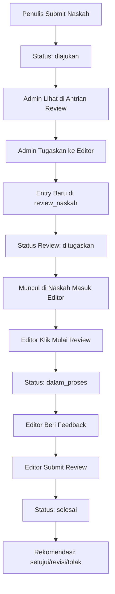

# Dokumentasi: Naskah Masuk Editor dari Tabel `review_naskah`

## 📋 Overview

Perubahan pada halaman **Naskah Masuk** di panel editor untuk memastikan sistem mengambil data dari tabel `review_naskah` dengan status `ditugaskan`, bukan dari tabel `naskah` langsung.

## 🔧 Perubahan yang Dilakukan

### Frontend - Editor Naskah Masuk Page

**File**: `frontend/app/(dashboard)/dashboard/editor/naskah/page.tsx`

#### A. Update Interface

**SEBELUM**:
```typescript
interface Naskah {
  id: string;
  judul: string;
  sinopsis: string;
  status: string;
  penulis: {...};
  kategori?: {...};
  genre?: {...};
}
```

**SESUDAH**:
```typescript
interface ReviewNaskah {
  id: string; // ID review, bukan ID naskah
  idNaskah: string;
  idEditor: string;
  status: "ditugaskan" | "dalam_proses" | "selesai" | "dibatalkan";
  rekomendasi?: "setujui" | "revisi" | "tolak";
  catatanEditor?: string;
  ditugaskanPada: string;
  dimulaiPada?: string;
  selesaiPada?: string;
  naskah: {
    id: string;
    judul: string;
    status: string;
    urlSampul?: string;
    penulis: {...};
  };
  editor: {...};
  _count: {
    feedback: number;
  };
}
```

#### B. Update Fetch Data Logic

**SEBELUM** (Mengambil dari tabel `naskah`):
```typescript
const { data } = await api.get<ResponseSukses<Naskah[]>>("/naskah", {
  params: {
    halaman,
    limit,
    status: "diajukan", // Filter dari tabel naskah
  },
});

setNaskahList(data.data);
```

**SESUDAH** (Mengambil dari tabel `review_naskah`):
```typescript
const { data } = await api.get<ResponseSukses<ReviewNaskah[]>>(
  "/review/editor/saya", // Endpoint khusus untuk review editor
  {
    params: {
      halaman,
      limit,
      status: "ditugaskan", // Filter dari tabel review_naskah
    },
  }
);

setReviewList(data.data);
```

## 🔍 Cara Kerja

### Query Flow

1. **Frontend** memanggil API:
   ```
   GET /api/review/editor/saya?halaman=1&limit=10&status=ditugaskan
   ```

2. **Backend** (ReviewController):
   ```typescript
   @Get('editor/saya')
   @Peran('editor')
   async ambilReviewSaya(
     @Query() filter: FilterReviewDto,
     @PenggunaSaatIni('id') idEditor: string
   ) {
     return this.reviewService.ambilReviewEditor(idEditor, filter);
   }
   ```

3. **Service** (ReviewService):
   ```typescript
   async ambilReviewEditor(idEditor: string, filter: FilterReviewDto) {
     return this.ambilSemuaReview({ ...filter, idEditor }, idEditor);
   }
   ```

4. **Database** Query (Prisma):
   ```typescript
   where: {
     idEditor: idEditor, // Filter by editor yang login
     status: 'ditugaskan' // Hanya status ditugaskan
   }
   include: {
     naskah: {...}, // JOIN dengan tabel naskah
     editor: {...},
     _count: { feedback: true }
   }
   ```

5. **SQL** yang dihasilkan:
   ```sql
   SELECT 
     rn.id,
     rn.id_naskah,
     rn.id_editor,
     rn.status,
     rn.ditugaskan_pada,
     n.id AS naskah_id,
     n.judul,
     n.url_sampul,
     p.email,
     pp.nama_depan,
     pp.nama_belakang,
     COUNT(f.id) AS feedback_count
   FROM review_naskah rn
   JOIN naskah n ON n.id = rn.id_naskah
   JOIN pengguna p ON p.id = n.id_penulis
   LEFT JOIN profil_pengguna pp ON pp.id_pengguna = p.id
   LEFT JOIN feedback f ON f.id_review = rn.id
   WHERE rn.id_editor = $1
     AND rn.status = 'ditugaskan'
   GROUP BY rn.id, n.id, p.id, pp.id
   ORDER BY rn.ditugaskan_pada DESC
   LIMIT 10;
   ```

## ✅ Keuntungan Perubahan

1. **Data Akurat**:
   - Hanya menampilkan naskah yang **benar-benar ditugaskan** kepada editor
   - Tidak menampilkan semua naskah dengan status "diajukan"

2. **Informasi Review Lengkap**:
   - Menampilkan kapan review ditugaskan (`ditugaskanPada`)
   - Tracking status review (`ditugaskan`, `dalam_proses`, `selesai`)
   - Jumlah feedback yang sudah diberikan

3. **Workflow Jelas**:
   - **Admin** tugaskan review → Entry di `review_naskah` dibuat
   - **Editor** lihat di "Naskah Masuk" → Data dari `review_naskah` status `ditugaskan`
   - **Editor** mulai review → Update status jadi `dalam_proses`
   - **Editor** selesai review → Status jadi `selesai` dengan rekomendasi

4. **Security**:
   - Editor hanya bisa lihat review yang ditugaskan ke mereka
   - Tidak bisa lihat review milik editor lain
   - Backend filter otomatis by `idEditor`

## 📊 Database Schema

### Tabel `review_naskah`

```prisma
model ReviewNaskah {
  id              String         @id @default(uuid())
  idNaskah        String
  idEditor        String
  status          StatusReview   @default(ditugaskan)
  rekomendasi     Rekomendasi?
  catatanEditor   String?
  ditugaskanPada  DateTime       @default(now())
  dimulaiPada     DateTime?
  selesaiPada     DateTime?
  
  // Relations
  naskah          Naskah         @relation(fields: [idNaskah], references: [id])
  editor          Pengguna       @relation(fields: [idEditor], references: [id])
  feedback        Feedback[]
  
  @@map("review_naskah")
}

enum StatusReview {
  ditugaskan
  dalam_proses
  selesai
  dibatalkan
  
  @@map("status_review")
}
```

## 🎯 Use Cases

### Use Case 1: Editor Login & Lihat Naskah Masuk

**Actor**: Editor

**Flow**:
1. Editor login ke sistem
2. Navigasi ke menu "Naskah Masuk"
3. Sistem query: `SELECT * FROM review_naskah WHERE id_editor = ? AND status = 'ditugaskan'`
4. Tampilkan daftar naskah yang perlu direview

**Result**: Editor hanya lihat naskah yang ditugaskan ke dia

### Use Case 2: Admin Tugaskan Review ke Editor

**Actor**: Admin

**Flow**:
1. Admin buka "Antrian Review"
2. Pilih naskah dengan status "diajukan"
3. Klik "Tugaskan Editor", pilih editor
4. Sistem: `INSERT INTO review_naskah (id_naskah, id_editor, status) VALUES (?, ?, 'ditugaskan')`
5. Update naskah: `UPDATE naskah SET status = 'dalam_review' WHERE id = ?`

**Result**: Entry baru di `review_naskah`, naskah muncul di "Naskah Masuk" editor

### Use Case 3: Editor Mulai Review

**Actor**: Editor

**Flow**:
1. Editor klik "Mulai Review" pada naskah di daftar
2. Navigate ke `/dashboard/editor/review/{review_id}`
3. Sistem: `UPDATE review_naskah SET status = 'dalam_proses', dimulai_pada = NOW() WHERE id = ?`

**Result**: Status review berubah, editor bisa tambah feedback

## 🧪 Testing Checklist

### Test Case 1: Tampilan Naskah Masuk

**Precondition**:
- Ada review dengan status `ditugaskan` untuk editor yang login
- Ada review dengan status `dalam_proses` atau `selesai`

**Steps**:
1. Login sebagai editor
2. Buka menu "Naskah Masuk"

**Expected Result**:
- ✅ Hanya tampil review dengan status `ditugaskan`
- ✅ Tampil informasi: judul, penulis, waktu ditugaskan
- ✅ Tombol "Mulai Review" tersedia

### Test Case 2: Filter by Editor

**Precondition**:
- Ada 2 editor: Editor A dan Editor B
- Editor A punya 3 review ditugaskan
- Editor B punya 2 review ditugaskan

**Steps**:
1. Login sebagai Editor A
2. Buka "Naskah Masuk"

**Expected Result**:
- ✅ Tampil 3 review (milik Editor A saja)
- ❌ Tidak tampil review milik Editor B

### Test Case 3: Search Functionality

**Precondition**:
- Editor punya 5 review ditugaskan

**Steps**:
1. Buka "Naskah Masuk"
2. Ketik judul naskah di search bar

**Expected Result**:
- ✅ Daftar ter-filter sesuai keyword
- ✅ Bisa search by judul atau nama penulis

## 🔐 Authorization

### Endpoint: `GET /api/review/editor/saya`

**Guards**:
- `JwtAuthGuard`: Validasi token JWT
- `PeranGuard`: Harus punya role `editor`

**Access Control**:
```typescript
// Backend otomatis filter by editor yang login
where: {
  idEditor: idPenggunaSaatIni // Dari JWT token
}
```

**Response**:
```json
{
  "sukses": true,
  "pesan": "Data review berhasil diambil",
  "data": [
    {
      "id": "review-uuid",
      "idNaskah": "naskah-uuid",
      "idEditor": "editor-uuid",
      "status": "ditugaskan",
      "ditugaskanPada": "2025-11-12T10:00:00Z",
      "naskah": {
        "id": "naskah-uuid",
        "judul": "Judul Naskah",
        "status": "dalam_review",
        "penulis": {
          "email": "penulis@example.com",
          "profilPengguna": {
            "namaDepan": "John",
            "namaBelakang": "Doe"
          }
        }
      },
      "_count": {
        "feedback": 0
      }
    }
  ],
  "metadata": {
    "total": 5,
    "halaman": 1,
    "limit": 10,
    "totalHalaman": 1
  }
}
```

## 📝 UI Components

### 1. Naskah Card

**Informasi yang Ditampilkan**:
- ✅ Cover naskah (jika ada)
- ✅ Judul naskah
- ✅ Nama penulis
- ✅ Waktu ditugaskan (relative: "2 jam lalu")
- ✅ Status naskah
- ✅ Jumlah feedback (jika ada)
- ✅ Badge "Ditugaskan"

**Actions**:
- Button "Mulai Review" → Navigate ke `/dashboard/editor/review/{review_id}`
- Button "Lihat Detail" → Navigate ke `/dashboard/editor/naskah/{naskah_id}`

### 2. Stats Widget

- **Total Ditugaskan**: Jumlah review dengan status `ditugaskan`

### 3. Search Bar

- Filter by judul naskah
- Filter by nama penulis
- Real-time filtering (client-side)

## 🚀 Next Steps (Optional)

1. **Tambah Filter Status**:
   - Tab "Ditugaskan" (status: `ditugaskan`)
   - Tab "Dalam Proses" (status: `dalam_proses`)
   - Tab "Selesai" (status: `selesai`)

2. **Sort Options**:
   - Urutkan by waktu ditugaskan (terbaru/terlama)
   - Urutkan by judul (A-Z)

3. **Batch Actions**:
   - Select multiple review
   - "Mulai Semua" untuk mulai beberapa review sekaligus

4. **Notifications**:
   - Toast notification saat ada review baru ditugaskan
   - Email notification ke editor

## 📚 Related Files

**Frontend**:
- `frontend/app/(dashboard)/dashboard/editor/naskah/page.tsx` - **UPDATED**

**Backend**:
- `backend/src/modules/review/review.controller.ts` - Endpoint `/review/editor/saya`
- `backend/src/modules/review/review.service.ts` - Method `ambilReviewEditor()`
- `backend/src/modules/review/dto/filter-review.dto.ts` - Filter DTO

**Database**:
- `backend/prisma/schema.prisma` - Model `ReviewNaskah`

## 🔄 Workflow Lengkap



---

**Dokumentasi dibuat**: 12 November 2025  
**Versi**: 1.0  
**Status**: ✅ Implemented & Ready for Testing
