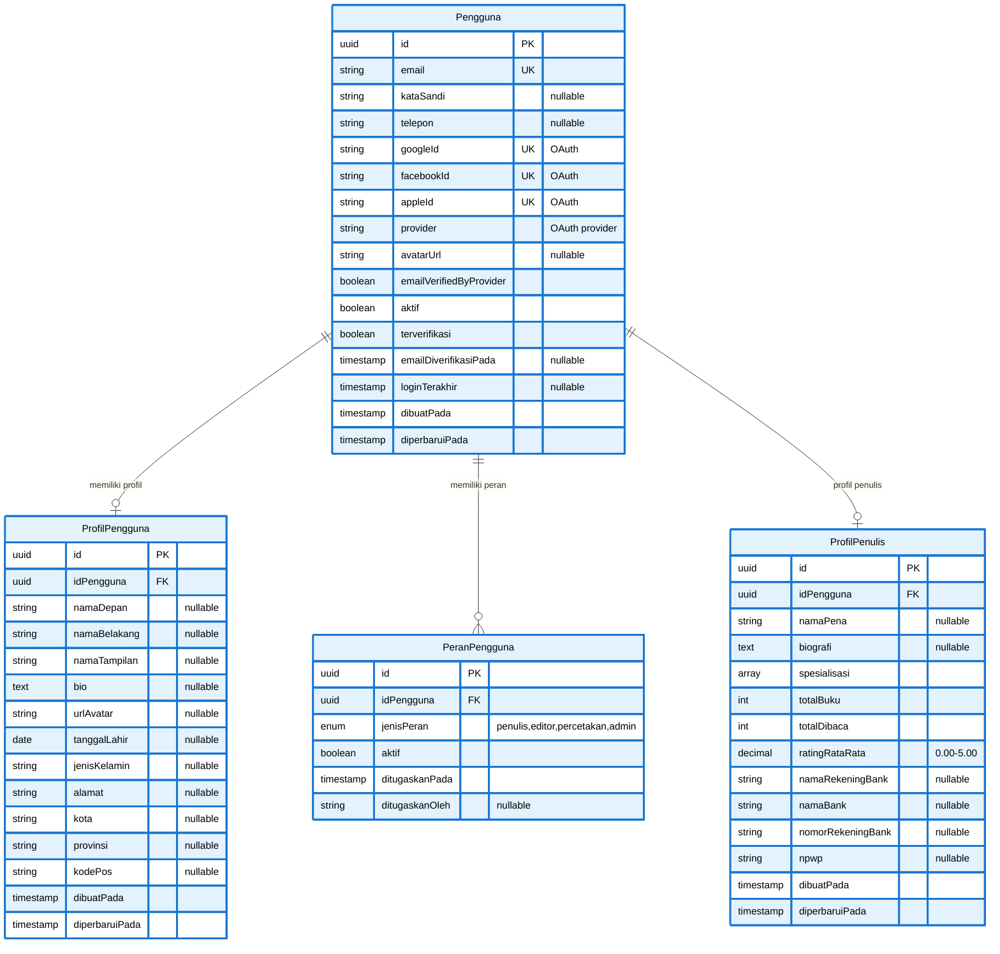

# ERD Part 1: User Management System

Diagram ERD untuk modul User Management - mencakup pengguna, profil, peran, dan profil penulis.

## Diagram ERD - User Management



## Deskripsi Tabel

### 1. Pengguna

**Tabel utama untuk manajemen pengguna**

- **Primary Key**: `id` (UUID)
- **Unique Constraints**: `email`, `googleId`, `facebookId`, `appleId`
- **OAuth Support**: Terintegrasi dengan Google, Facebook, dan Apple OAuth
- **Features**:
  - Email verification tracking
  - Password nullable (untuk OAuth users)
  - Last login tracking
  - Active/inactive status

### 2. ProfilPengguna

**Informasi detail profil pengguna**

- **Primary Key**: `id` (UUID)
- **Foreign Key**: `idPengguna` → Pengguna (CASCADE DELETE)
- **Relasi**: One-to-One dengan Pengguna
- **Features**:
  - Data personal lengkap
  - Avatar URL
  - Alamat lengkap dengan kota, provinsi, kode pos

### 3. PeranPengguna

**Manajemen multi-role untuk pengguna**

- **Primary Key**: `id` (UUID)
- **Foreign Key**: `idPengguna` → Pengguna (CASCADE DELETE)
- **Relasi**: One-to-Many dengan Pengguna
- **Enum**: `jenisPeran` (penulis, editor, percetakan, admin)
- **Features**:
  - Support multiple roles per user
  - Active/inactive toggle
  - Assignment tracking (who assigned, when)
- **Unique Constraint**: `idPengguna` + `jenisPeran`

### 4. ProfilPenulis

**Profil khusus untuk penulis**

- **Primary Key**: `id` (UUID)
- **Foreign Key**: `idPengguna` → Pengguna (CASCADE DELETE)
- **Relasi**: One-to-One dengan Pengguna
- **Features**:
  - Pen name (nama pena)
  - Specialization array
  - Book statistics (total, reads, rating)
  - Banking information untuk royalty
  - NPWP untuk tax compliance

## Enum Types

```prisma
enum JenisPeran {
  penulis
  editor
  percetakan
  admin

  @@map("jenis_peran")
}
```

## Indexes & Performance

### Recommended Indexes

```sql
-- Pengguna
CREATE INDEX idx_pengguna_email ON pengguna(email);
CREATE INDEX idx_pengguna_google_id ON pengguna(google_id) WHERE google_id IS NOT NULL;
CREATE INDEX idx_pengguna_aktif ON pengguna(aktif);

-- PeranPengguna
CREATE INDEX idx_peran_pengguna_user_id ON peran_pengguna(id_pengguna);
CREATE INDEX idx_peran_pengguna_jenis ON peran_pengguna(jenis_peran);
CREATE UNIQUE INDEX idx_peran_pengguna_unique ON peran_pengguna(id_pengguna, jenis_peran);

-- ProfilPenulis
CREATE INDEX idx_profil_penulis_user_id ON profil_penulis(id_pengguna);
```

## Navigasi ERD

- **← [ERD Utama](database-erd.md)** - Kembali ke diagram lengkap
- **→ [ERD Part 2: Content Management](erd-2-content-management.md)** - Naskah, Kategori, Genre
- **→ [ERD Part 3: Review System](erd-3-review-system.md)** - Review & Feedback

---

**Generated**: December 23, 2025  
**Database**: PostgreSQL 14+  
**ORM**: Prisma  
**Project**: Publishify - Sistem Penerbitan Naskah
