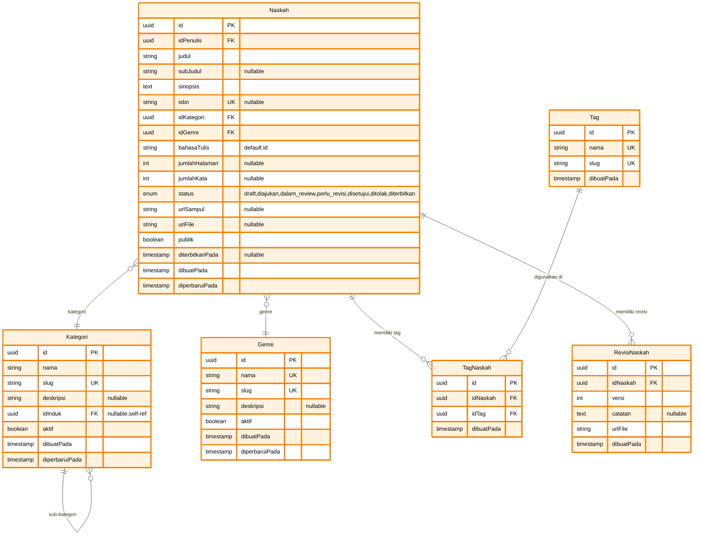

# ERD Part 2: Content Management System

Diagram ERD untuk modul Content Management - mencakup naskah, kategori, genre, tag, dan revisi.

## Diagram ERD - Content Management



## Deskripsi Tabel

### 1. Naskah

**Tabel utama untuk manajemen naskah/manuscript**

- **Primary Key**: `id` (UUID)
- **Foreign Keys**:
  - `idPenulis` → Pengguna
  - `idKategori` → Kategori
  - `idGenre` → Genre
- **Unique Constraints**: `isbn`
- **Features**:
  - Multi-status workflow (draft → published)
  - ISBN tracking
  - Word count & page count
  - Cover & file URL storage
  - Public/private visibility
  - Publication date tracking

### 2. Kategori

**Hierarchical category system**

- **Primary Key**: `id` (UUID)
- **Foreign Key**: `idInduk` → Kategori (SELF-REFERENCE)
- **Unique Constraints**: `slug`
- **Features**:
  - Hierarchical structure (parent-child)
  - SEO-friendly slug
  - Active/inactive status
  - Unlimited nesting levels

### 3. Genre

**Genre classification for manuscripts**

- **Primary Key**: `id` (UUID)
- **Unique Constraints**: `nama`, `slug`
- **Features**:
  - Simple flat structure
  - SEO-friendly slug
  - Active/inactive status
  - Description field

### 4. Tag

**Tagging system for flexible categorization**

- **Primary Key**: `id` (UUID)
- **Unique Constraints**: `nama`, `slug`
- **Features**:
  - Many-to-many dengan Naskah via TagNaskah
  - SEO-friendly slug
  - Creation date tracking

### 5. TagNaskah

**Junction table untuk many-to-many relationship**

- **Primary Key**: `id` (UUID)
- **Foreign Keys**:
  - `idNaskah` → Naskah (CASCADE DELETE)
  - `idTag` → Tag (CASCADE DELETE)
- **Unique Constraint**: `idNaskah` + `idTag`

### 6. RevisiNaskah

**Version control system untuk naskah**

- **Primary Key**: `id` (UUID)
- **Foreign Key**: `idNaskah` → Naskah (CASCADE DELETE)
- **Features**:
  - Sequential version numbering
  - Revision notes
  - File URL per version
  - Creation timestamp
- **Unique Constraint**: `idNaskah` + `versi`

## Enum Types

```prisma
enum StatusNaskah {
  draft
  diajukan
  dalam_review
  perlu_revisi
  disetujui
  ditolak
  diterbitkan

  @@map("status_naskah")
}
```

## Status Workflow

```
draft → diajukan → dalam_review → [perlu_revisi | disetujui | ditolak]
                                          ↓
                                    diterbitkan
```

## Indexes & Performance

### Recommended Indexes

```sql
-- Naskah
CREATE INDEX idx_naskah_penulis ON naskah(id_penulis);
CREATE INDEX idx_naskah_kategori ON naskah(id_kategori);
CREATE INDEX idx_naskah_genre ON naskah(id_genre);
CREATE INDEX idx_naskah_status ON naskah(status);
CREATE INDEX idx_naskah_publik ON naskah(publik);
CREATE INDEX idx_naskah_judul_trgm ON naskah USING gin(judul gin_trgm_ops);

-- Kategori
CREATE INDEX idx_kategori_slug ON kategori(slug);
CREATE INDEX idx_kategori_induk ON kategori(id_induk) WHERE id_induk IS NOT NULL;
CREATE INDEX idx_kategori_aktif ON kategori(aktif);

-- TagNaskah
CREATE UNIQUE INDEX idx_tag_naskah_unique ON tag_naskah(id_naskah, id_tag);
CREATE INDEX idx_tag_naskah_tag ON tag_naskah(id_tag);

-- RevisiNaskah
CREATE INDEX idx_revisi_naskah_id ON revisi_naskah(id_naskah);
CREATE UNIQUE INDEX idx_revisi_naskah_version ON revisi_naskah(id_naskah, versi);
```

## Full-Text Search

```sql
-- Enable pg_trgm extension untuk fuzzy search
CREATE EXTENSION IF NOT EXISTS pg_trgm;

-- Create GIN index untuk full-text search
CREATE INDEX idx_naskah_judul_sinopsis_fts
ON naskah
USING gin(to_tsvector('indonesian', judul || ' ' || sinopsis));
```

## Navigasi ERD

- **← [ERD Part 1: User Management](erd-1-user-management.md)** - Pengguna & Profil
- **← [ERD Utama](database-erd.md)** - Kembali ke diagram lengkap
- **→ [ERD Part 3: Review System](erd-3-review-system.md)** - Review & Feedback

---

**Generated**: December 23, 2025  
**Database**: PostgreSQL 14+  
**ORM**: Prisma  
**Project**: Publishify - Sistem Penerbitan Naskah
