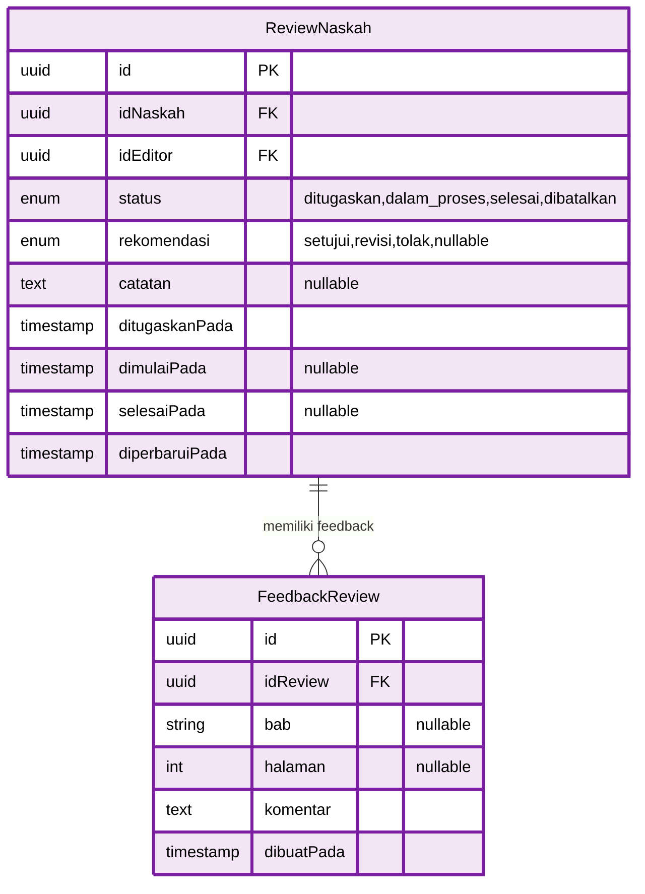
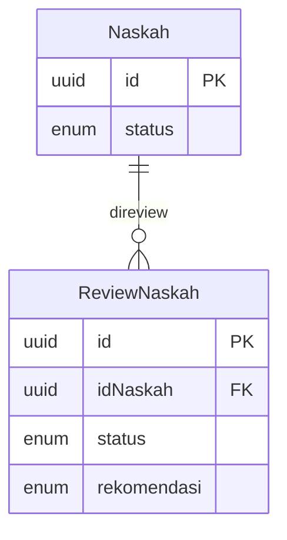
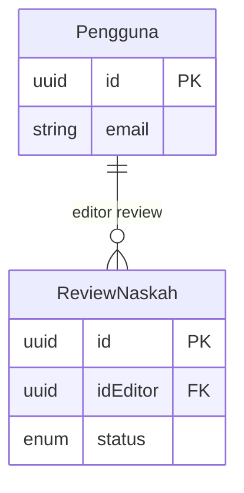

# ERD Part 3: Review System

Diagram ERD untuk modul Review System - mencakup review naskah dan feedback dari editor.

## Diagram ERD - Review System



## Deskripsi Tabel

### 1. ReviewNaskah

**Tabel utama untuk manajemen review naskah**

- **Primary Key**: `id` (UUID)
- **Foreign Keys**:
  - `idNaskah` → Naskah (CASCADE DELETE)
  - `idEditor` → Pengguna (SET NULL)
- **Features**:
  - Multi-status workflow tracking
  - Recommendation system (approve/revise/reject)
  - Timestamp tracking (assigned, started, completed)
  - Overall review notes
  - One review per manuscript (with revision cycles)

### 2. FeedbackReview

**Detail feedback dari editor per bagian naskah**

- **Primary Key**: `id` (UUID)
- **Foreign Key**: `idReview` → ReviewNaskah (CASCADE DELETE)
- **Features**:
  - Chapter-specific feedback (optional)
  - Page-specific feedback (optional)
  - Multiple feedback entries per review
  - Detailed comments
  - Creation timestamp

## Enum Types

```prisma
enum StatusReview {
  ditugaskan
  dalam_proses
  selesai
  dibatalkan

  @@map("status_review")
}

enum Rekomendasi {
  setujui
  revisi
  tolak

  @@map("rekomendasi")
}
```

## Review Workflow

```
ditugaskan → dalam_proses → selesai
                    ↓
                dibatalkan
```

## Rekomendasi Flow

```
selesai (review) → [setujui | revisi | tolak]
         ↓              ↓         ↓        ↓
    Naskah.status  disetujui perlu_revisi ditolak
```

## Relasi dengan Tabel Lain

### ReviewNaskah ← Naskah



### ReviewNaskah ← Pengguna (Editor)



## Indexes & Performance

### Recommended Indexes

```sql
-- ReviewNaskah
CREATE INDEX idx_review_naskah_id ON review_naskah(id_naskah);
CREATE INDEX idx_review_editor_id ON review_naskah(id_editor);
CREATE INDEX idx_review_status ON review_naskah(status);
CREATE INDEX idx_review_rekomendasi ON review_naskah(rekomendasi);
CREATE INDEX idx_review_ditugaskan ON review_naskah(ditugaskan_pada);

-- Composite index untuk editor dashboard
CREATE INDEX idx_review_editor_status ON review_naskah(id_editor, status);

-- FeedbackReview
CREATE INDEX idx_feedback_review_id ON feedback_review(id_review);
CREATE INDEX idx_feedback_bab ON feedback_review(bab) WHERE bab IS NOT NULL;
CREATE INDEX idx_feedback_halaman ON feedback_review(halaman) WHERE halaman IS NOT NULL;
```

## Query Patterns

### 1. Ambil Review yang Ditugaskan ke Editor

```typescript
const reviewDitugaskan = await prisma.reviewNaskah.findMany({
  where: {
    idEditor: editorId,
    status: "ditugaskan",
  },
  include: {
    naskah: {
      select: {
        judul: true,
        sinopsis: true,
        penulis: {
          select: {
            email: true,
            profilPengguna: true,
          },
        },
      },
    },
  },
  orderBy: {
    ditugaskanPada: "asc",
  },
});
```

### 2. Ambil Feedback Detail per Review

```typescript
const feedbackList = await prisma.feedbackReview.findMany({
  where: {
    idReview: reviewId,
  },
  orderBy: [{ bab: "asc" }, { halaman: "asc" }, { dibuatPada: "asc" }],
});
```

### 3. Update Status Review dengan Rekomendasi

```typescript
const review = await prisma.$transaction(async (prisma) => {
  // Update review
  const updatedReview = await prisma.reviewNaskah.update({
    where: { id: reviewId },
    data: {
      status: "selesai",
      rekomendasi: "setujui",
      selesaiPada: new Date(),
    },
  });

  // Update status naskah
  await prisma.naskah.update({
    where: { id: updatedReview.idNaskah },
    data: {
      status: "disetujui",
    },
  });

  return updatedReview;
});
```

## Business Rules

### 1. Review Assignment

- Hanya user dengan role `editor` yang bisa ditugaskan
- Satu naskah hanya bisa memiliki satu review aktif
- Editor tidak bisa mereview naskah sendiri (jika dia juga penulis)

### 2. Review Status

- Status `ditugaskan` → `dalam_proses` (manual oleh editor)
- Status `dalam_proses` → `selesai` (setelah submit rekomendasi)
- Status bisa menjadi `dibatalkan` kapan saja oleh admin

### 3. Feedback

- Feedback bisa ditambahkan kapan saja selama review belum `selesai`
- Feedback bersifat optional (bab & halaman)
- Minimal 1 feedback sebelum submit rekomendasi

### 4. Rekomendasi

- Rekomendasi wajib diisi saat status → `selesai`
- Rekomendasi `setujui` → Naskah.status = `disetujui`
- Rekomendasi `revisi` → Naskah.status = `perlu_revisi`
- Rekomendasi `tolak` → Naskah.status = `ditolak`

## Navigasi ERD

- **← [ERD Part 2: Content Management](erd-2-content-management.md)** - Naskah, Kategori, Genre
- **← [ERD Utama](database-erd.md)** - Kembali ke diagram lengkap
- **→ [ERD Part 4: Printing & Shipping](erd-4-printing-shipping.md)** - Pesanan Cetak & Pengiriman

---

**Generated**: December 23, 2025  
**Database**: PostgreSQL 14+  
**ORM**: Prisma  
**Project**: Publishify - Sistem Penerbitan Naskah
