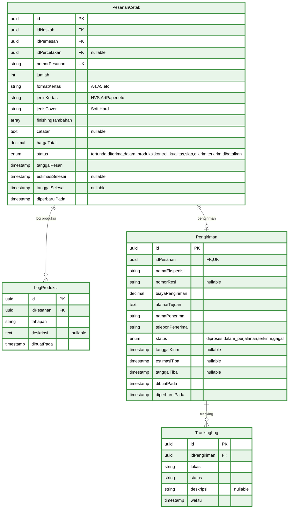
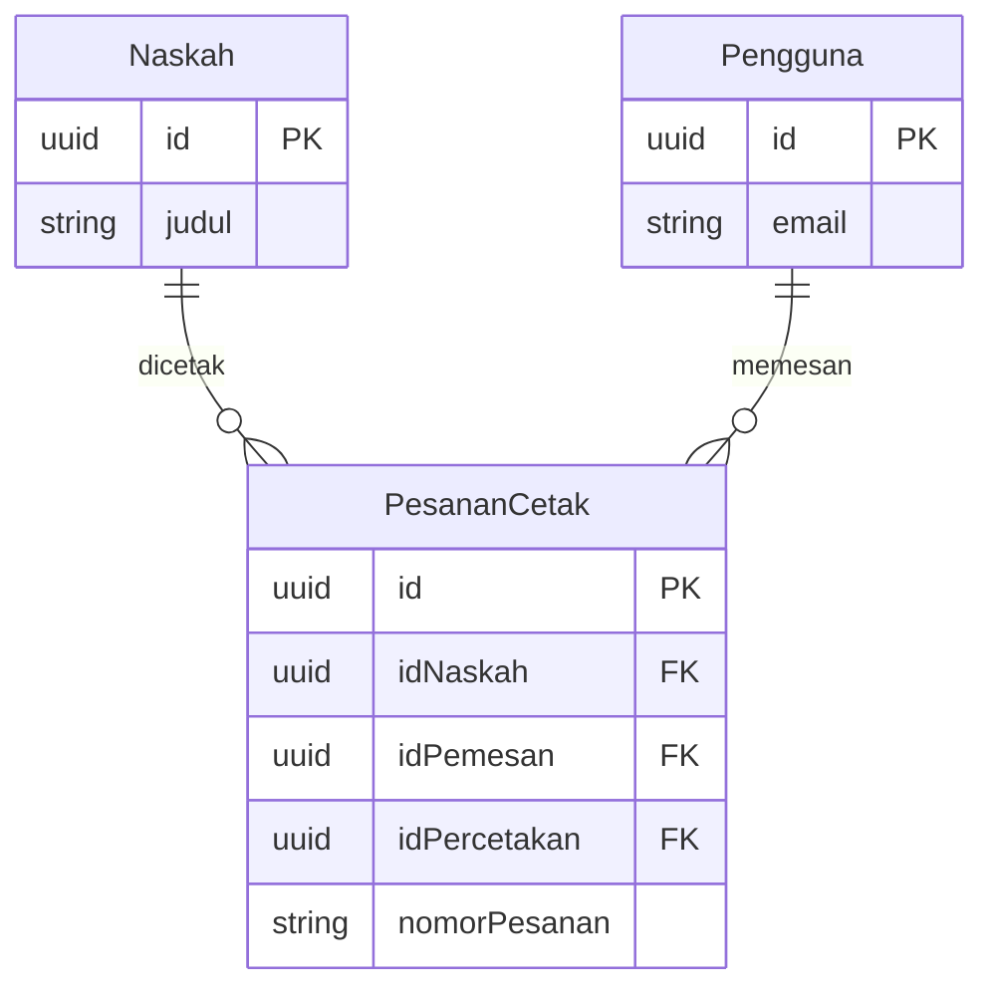

# ERD Part 4: Printing & Shipping System

Diagram ERD untuk modul Printing & Shipping - mencakup pesanan cetak, produksi, pengiriman, dan tracking.

## Diagram ERD - Printing & Shipping



## Deskripsi Tabel

### 1. PesananCetak

**Tabel utama untuk order management percetakan**

- **Primary Key**: `id` (UUID)
- **Foreign Keys**:
  - `idNaskah` → Naskah
  - `idPemesan` → Pengguna
  - `idPercetakan` → Pengguna (optional, untuk assign ke percetakan)
- **Unique Constraints**: `nomorPesanan`
- **Features**:
  - Order number generation (PO-YYYYMMDD-XXXX)
  - Customizable print specs (paper, cover, finishing)
  - Multi-status workflow tracking
  - Price calculation
  - Timeline tracking (ordered, estimated, completed)

### 2. LogProduksi

**Production log untuk tracking progress**

- **Primary Key**: `id` (UUID)
- **Foreign Key**: `idPesanan` → PesananCetak (CASCADE DELETE)
- **Features**:
  - Sequential production stages
  - Stage descriptions
  - Timestamp per stage
  - Multiple logs per order

### 3. Pengiriman

**Shipping management**

- **Primary Key**: `id` (UUID)
- **Foreign Key**: `idPesanan` → PesananCetak (CASCADE DELETE)
- **Unique Constraint**: `idPesanan` (One-to-One)
- **Features**:
  - Expedition/courier selection
  - Tracking number (AWB)
  - Shipping cost calculation
  - Recipient details (address, name, phone)
  - Status tracking (processing → in transit → delivered)
  - Timeline tracking (ship date, ETA, arrival)

### 4. TrackingLog

**Detailed shipment tracking history**

- **Primary Key**: `id` (UUID)
- **Foreign Key**: `idPengiriman` → Pengiriman (CASCADE DELETE)
- **Features**:
  - Location-based tracking
  - Status updates
  - Timestamp per checkpoint
  - Optional descriptions

## Enum Types

```prisma
enum StatusPesanan {
  tertunda
  diterima
  dalam_produksi
  kontrol_kualitas
  siap
  dikirim
  terkirim
  dibatalkan

  @@map("status_pesanan")
}

enum StatusPengiriman {
  diproses
  dalam_perjalanan
  terkirim
  gagal

  @@map("status_pengiriman")
}
```

## Workflow Diagrams

### Order Workflow

```
tertunda → diterima → dalam_produksi → kontrol_kualitas → siap → dikirim → terkirim
                                            ↓
                                        dibatalkan
```

### Shipping Workflow

```
diproses → dalam_perjalanan → terkirim
               ↓
             gagal
```

## Relasi dengan Tabel Lain

### PesananCetak Relations



## Indexes & Performance

### Recommended Indexes

```sql
-- PesananCetak
CREATE INDEX idx_pesanan_naskah ON pesanan_cetak(id_naskah);
CREATE INDEX idx_pesanan_pemesan ON pesanan_cetak(id_pemesan);
CREATE INDEX idx_pesanan_percetakan ON pesanan_cetak(id_percetakan) WHERE id_percetakan IS NOT NULL;
CREATE INDEX idx_pesanan_status ON pesanan_cetak(status);
CREATE INDEX idx_pesanan_tanggal ON pesanan_cetak(tanggal_pesan DESC);
CREATE UNIQUE INDEX idx_pesanan_nomor ON pesanan_cetak(nomor_pesanan);

-- Composite index untuk dashboard percetakan
CREATE INDEX idx_pesanan_percetakan_status ON pesanan_cetak(id_percetakan, status) WHERE id_percetakan IS NOT NULL;

-- LogProduksi
CREATE INDEX idx_log_produksi_pesanan ON log_produksi(id_pesanan);
CREATE INDEX idx_log_produksi_waktu ON log_produksi(dibuat_pada DESC);

-- Pengiriman
CREATE UNIQUE INDEX idx_pengiriman_pesanan ON pengiriman(id_pesanan);
CREATE INDEX idx_pengiriman_status ON pengiriman(status);
CREATE INDEX idx_pengiriman_tanggal ON pengiriman(tanggal_kirim DESC) WHERE tanggal_kirim IS NOT NULL;

-- TrackingLog
CREATE INDEX idx_tracking_pengiriman ON tracking_log(id_pengiriman);
CREATE INDEX idx_tracking_waktu ON tracking_log(waktu DESC);
```

## Query Patterns

### 1. Ambil Pesanan dengan Status Tertentu

```typescript
const pesananAktif = await prisma.pesananCetak.findMany({
  where: {
    status: {
      in: ["diterima", "dalam_produksi", "kontrol_kualitas"],
    },
  },
  include: {
    naskah: {
      select: {
        judul: true,
        penulis: {
          select: {
            email: true,
            profilPengguna: true,
          },
        },
      },
    },
    pemesan: {
      select: {
        email: true,
        profilPengguna: true,
      },
    },
    pengiriman: true,
  },
  orderBy: {
    tanggalPesan: "desc",
  },
});
```

### 2. Track Progress Produksi

```typescript
const progressProduksi = await prisma.logProduksi.findMany({
  where: {
    idPesanan: pesananId,
  },
  orderBy: {
    dibuatPada: "asc",
  },
});
```

### 3. Track Pengiriman dengan History

```typescript
const trackingDetail = await prisma.pengiriman.findUnique({
  where: { idPesanan: pesananId },
  include: {
    trackingLog: {
      orderBy: {
        waktu: "desc",
      },
    },
  },
});
```

## Business Rules

### 1. Order Creation

- Hanya naskah dengan status `disetujui` atau `diterbitkan` yang bisa dicetak
- Minimum order quantity (e.g., 10 copies)
- Auto-generate nomor pesanan: `PO-YYYYMMDD-XXXX`

### 2. Order Status

- `tertunda` → `diterima` (manual by percetakan)
- `diterima` → `dalam_produksi` (production starts)
- `dalam_produksi` → `kontrol_kualitas` (QC stage)
- `kontrol_kualitas` → `siap` (passed QC)
- `siap` → `dikirim` (shipped)
- `dikirim` → `terkirim` (delivered)
- Any status → `dibatalkan` (by admin or customer)

### 3. Production Log

- Auto-create log entry saat status berubah
- Manual log entry untuk progress updates
- Chronological order tracking

### 4. Shipping

- Created automatically saat status → `dikirim`
- One-to-one relationship dengan PesananCetak
- AWB/tracking number generated by expedition
- Auto-create tracking logs dari expedition API

### 5. Price Calculation

```typescript
hargaTotal =
  hargaDasar * jumlah +
  biayaKertas +
  biayaCover +
  biayaFinishing +
  biayaPercetakan;
```

## Integration Points

### 1. Expedition API

- Auto-update tracking logs
- Real-time status updates
- Calculate shipping costs
- Generate AWB

### 2. Payment System

- Link ke tabel Pembayaran
- Payment must be completed before production starts
- Refund handling untuk cancelled orders

### 3. Notification System

- Status change notifications
- Production progress updates
- Shipping updates
- Delivery confirmation

## Navigasi ERD

- **← [ERD Part 3: Review System](erd-3-review-system.md)** - Review & Feedback
- **← [ERD Utama](database-erd.md)** - Kembali ke diagram lengkap
- **→ [ERD Part 5: Payment System](erd-5-payment-system.md)** - Pembayaran

---

**Generated**: December 23, 2025  
**Database**: PostgreSQL 14+  
**ORM**: Prisma  
**Project**: Publishify - Sistem Penerbitan Naskah
