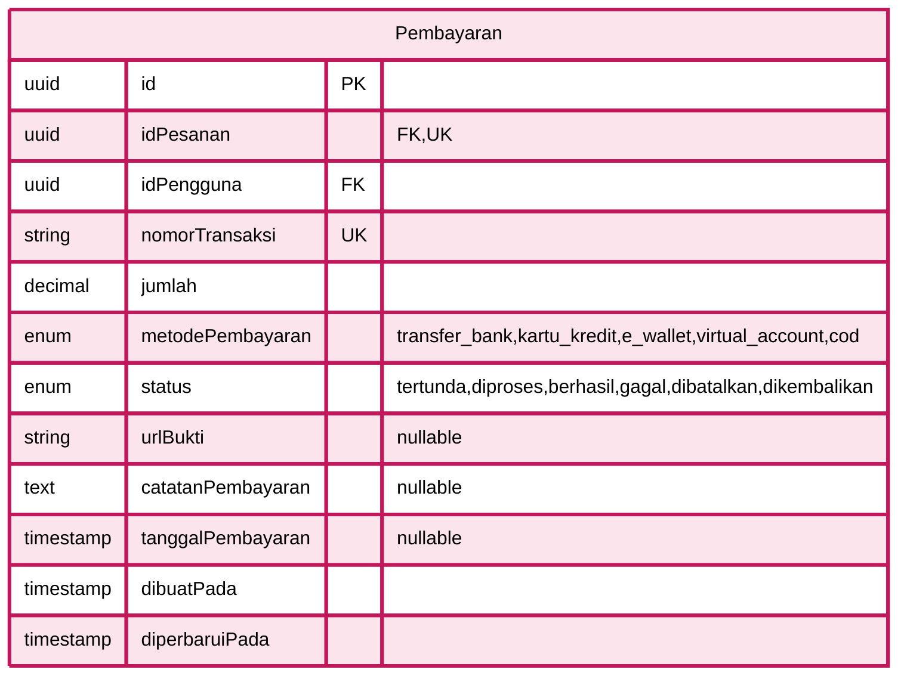
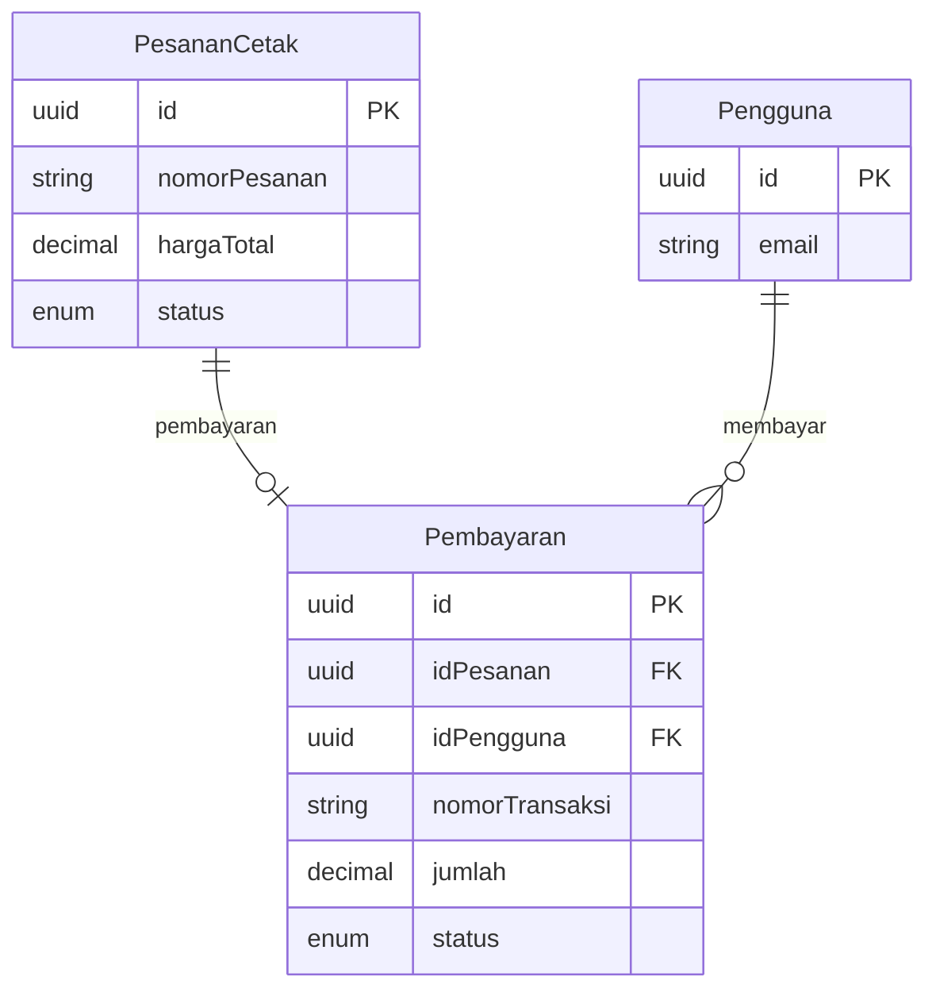

# ERD Part 5: Payment System

Diagram ERD untuk modul Payment System - mencakup pembayaran dan transaksi.

## Diagram ERD - Payment System



## Deskripsi Tabel

### 1. Pembayaran

**Tabel untuk payment management**

- **Primary Key**: `id` (UUID)
- **Foreign Keys**:
  - `idPesanan` → PesananCetak (CASCADE DELETE)
  - `idPengguna` → Pengguna (SET NULL)
- **Unique Constraints**:
  - `nomorTransaksi`
  - `idPesanan` (One-to-One)
- **Features**:
  - Multiple payment methods support
  - Multi-status payment tracking
  - Payment proof upload
  - Transaction number generation
  - Payment notes/remarks
  - Timeline tracking (created, paid)

## Enum Types

```prisma
enum MetodePembayaran {
  transfer_bank
  kartu_kredit
  e_wallet
  virtual_account
  cod

  @@map("metode_pembayaran")
}

enum StatusPembayaran {
  tertunda
  diproses
  berhasil
  gagal
  dibatalkan
  dikembalikan

  @@map("status_pembayaran")
}
```

## Payment Workflow

```
tertunda → diproses → berhasil
             ↓           ↓
          gagal    dikembalikan
             ↓
        dibatalkan
```

## Payment Methods Detail

### 1. Transfer Bank

- Manual transfer
- Upload bukti transfer (required)
- Verification by admin
- Bank account details provided

### 2. Kartu Kredit

- Integration dengan payment gateway
- Auto-verification
- Instant confirmation
- Tokenization untuk recurring payment

### 3. E-Wallet

- Integration dengan e-wallet providers (GoPay, OVO, Dana, etc.)
- QR Code atau Deep Link
- Auto-verification
- Instant confirmation

### 4. Virtual Account

- Bank virtual account generation
- Auto-verification via payment gateway
- Expiration time (24-48 hours)

### 5. COD (Cash on Delivery)

- Payment saat delivery
- Status berubah saat confirmed by courier
- No upfront payment required

## Relasi dengan Tabel Lain

### Pembayaran Relations



## Indexes & Performance

### Recommended Indexes

```sql
-- Pembayaran
CREATE UNIQUE INDEX idx_pembayaran_pesanan ON pembayaran(id_pesanan);
CREATE INDEX idx_pembayaran_pengguna ON pembayaran(id_pengguna);
CREATE UNIQUE INDEX idx_pembayaran_nomor_transaksi ON pembayaran(nomor_transaksi);
CREATE INDEX idx_pembayaran_status ON pembayaran(status);
CREATE INDEX idx_pembayaran_metode ON pembayaran(metode_pembayaran);
CREATE INDEX idx_pembayaran_tanggal ON pembayaran(tanggal_pembayaran DESC) WHERE tanggal_pembayaran IS NOT NULL;

-- Composite index untuk financial reports
CREATE INDEX idx_pembayaran_status_tanggal ON pembayaran(status, tanggal_pembayaran DESC) WHERE status = 'berhasil';
```

## Query Patterns

### 1. Ambil Pembayaran Pending

```typescript
const pembayaranPending = await prisma.pembayaran.findMany({
  where: {
    status: {
      in: ["tertunda", "diproses"],
    },
  },
  include: {
    pesanan: {
      select: {
        nomorPesanan: true,
        hargaTotal: true,
        naskah: {
          select: {
            judul: true,
          },
        },
      },
    },
    pengguna: {
      select: {
        email: true,
        profilPengguna: true,
      },
    },
  },
  orderBy: {
    dibuatPada: "asc",
  },
});
```

### 2. Verifikasi Pembayaran Manual

```typescript
const verifikasiPembayaran = async (
  pembayaranId: string,
  status: "berhasil" | "gagal"
) => {
  return await prisma.$transaction(async (prisma) => {
    // Update pembayaran
    const pembayaran = await prisma.pembayaran.update({
      where: { id: pembayaranId },
      data: {
        status,
        tanggalPembayaran: status === "berhasil" ? new Date() : null,
      },
    });

    // Update status pesanan jika berhasil
    if (status === "berhasil") {
      await prisma.pesananCetak.update({
        where: { id: pembayaran.idPesanan },
        data: {
          status: "diterima", // Ready untuk produksi
        },
      });
    }

    return pembayaran;
  });
};
```

### 3. Generate Laporan Keuangan

```typescript
const laporanKeuangan = await prisma.pembayaran.aggregate({
  where: {
    status: "berhasil",
    tanggalPembayaran: {
      gte: startDate,
      lte: endDate,
    },
  },
  _sum: {
    jumlah: true,
  },
  _count: {
    id: true,
  },
  _avg: {
    jumlah: true,
  },
});
```

### 4. Refund/Pengembalian Dana

```typescript
const refundPembayaran = async (pembayaranId: string, alasan: string) => {
  return await prisma.$transaction(async (prisma) => {
    // Update pembayaran
    const pembayaran = await prisma.pembayaran.update({
      where: { id: pembayaranId },
      data: {
        status: "dikembalikan",
        catatanPembayaran: alasan,
      },
    });

    // Update status pesanan
    await prisma.pesananCetak.update({
      where: { id: pembayaran.idPesanan },
      data: {
        status: "dibatalkan",
      },
    });

    // Create notification
    await prisma.notifikasi.create({
      data: {
        idPengguna: pembayaran.idPengguna,
        judul: "Pengembalian Dana",
        pesan: `Dana Anda sebesar Rp ${pembayaran.jumlah.toLocaleString()} telah dikembalikan.`,
        tipe: "info",
      },
    });

    return pembayaran;
  });
};
```

## Business Rules

### 1. Payment Creation

- Auto-create saat PesananCetak dibuat
- Status awal = `tertunda`
- Generate unique transaction number: `TRX-YYYYMMDD-XXXX`
- Amount must match PesananCetak.hargaTotal

### 2. Payment Verification

- **Transfer Bank**: Manual verification by admin
  - Check uploaded proof
  - Verify amount & bank account
  - Update status → `berhasil` or `gagal`
- **Automated Methods**: Auto-verification via payment gateway
  - Instant status update
  - No admin intervention needed

### 3. Payment Status Flow

- `tertunda` → Initial state (waiting for payment)
- `diproses` → Payment submitted, waiting for verification
- `berhasil` → Payment verified and confirmed
- `gagal` → Payment verification failed
- `dibatalkan` → Cancelled by user or system
- `dikembalikan` → Refunded (from `berhasil`)

### 4. Order Status Integration

| Payment Status | Order Status |
| -------------- | ------------ |
| tertunda       | tertunda     |
| diproses       | tertunda     |
| berhasil       | diterima     |
| gagal          | tertunda     |
| dibatalkan     | dibatalkan   |
| dikembalikan   | dibatalkan   |

### 5. Refund Policy

- Refund hanya untuk status `berhasil`
- Refund window: 7 days from payment
- Cannot refund if order status ≥ `dalam_produksi`
- Full refund untuk cancellation before production
- Partial refund untuk defect/quality issues

## Payment Gateway Integration

### Midtrans Integration Example

```typescript
import Midtrans from "midtrans-client";

const snap = new Midtrans.Snap({
  isProduction: false,
  serverKey: process.env.MIDTRANS_SERVER_KEY,
  clientKey: process.env.MIDTRANS_CLIENT_KEY,
});

async function createPayment(pembayaranId: string) {
  const pembayaran = await prisma.pembayaran.findUnique({
    where: { id: pembayaranId },
    include: {
      pesanan: {
        include: {
          naskah: true,
        },
      },
      pengguna: true,
    },
  });

  const parameter = {
    transaction_details: {
      order_id: pembayaran.nomorTransaksi,
      gross_amount: pembayaran.jumlah,
    },
    customer_details: {
      email: pembayaran.pengguna.email,
      first_name: pembayaran.pengguna.profilPengguna?.namaDepan,
      last_name: pembayaran.pengguna.profilPengguna?.namaBelakang,
    },
    item_details: [
      {
        id: pembayaran.pesanan.id,
        name: `Cetak: ${pembayaran.pesanan.naskah.judul}`,
        quantity: pembayaran.pesanan.jumlah,
        price: pembayaran.jumlah / pembayaran.pesanan.jumlah,
      },
    ],
  };

  const transaction = await snap.createTransaction(parameter);
  return transaction;
}
```

### Webhook Handler

```typescript
async function handlePaymentNotification(notification: any) {
  const statusResponse = await snap.transaction.notification(notification);

  const { order_id, transaction_status, fraud_status } = statusResponse;

  let paymentStatus: StatusPembayaran;

  if (transaction_status === "capture") {
    paymentStatus = fraud_status === "accept" ? "berhasil" : "gagal";
  } else if (transaction_status === "settlement") {
    paymentStatus = "berhasil";
  } else if (transaction_status === "pending") {
    paymentStatus = "diproses";
  } else if (transaction_status === "deny" || transaction_status === "cancel") {
    paymentStatus = "gagal";
  } else if (transaction_status === "expire") {
    paymentStatus = "dibatalkan";
  }

  await verifikasiPembayaran(order_id, paymentStatus);
}
```

## Security Considerations

### 1. Transaction Number

- Unique & non-sequential
- Include timestamp & random component
- Format: `TRX-YYYYMMDD-XXXX`

### 2. Payment Proof

- Validate file type (jpg, png, pdf only)
- Max file size (2MB)
- Store in secure S3 bucket
- Signed URLs untuk access

### 3. Sensitive Data

- Never store credit card details
- Use tokenization via payment gateway
- Encrypt bank account info at rest
- Audit log semua payment changes

### 4. Fraud Detection

- Monitor unusual payment patterns
- Flag multiple failed attempts
- Verify payment amount vs order total
- Check IP address & geolocation

## Navigasi ERD

- **← [ERD Part 4: Printing & Shipping](erd-4-printing-shipping.md)** - Pesanan Cetak & Pengiriman
- **← [ERD Utama](database-erd.md)** - Kembali ke diagram lengkap
- **→ [ERD Part 6: Auth & Notification](erd-6-auth-notification.md)** - Token, Log, Notifikasi

---

**Generated**: December 23, 2025  
**Database**: PostgreSQL 14+  
**ORM**: Prisma  
**Project**: Publishify - Sistem Penerbitan Naskah
