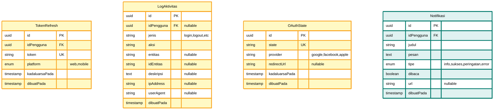
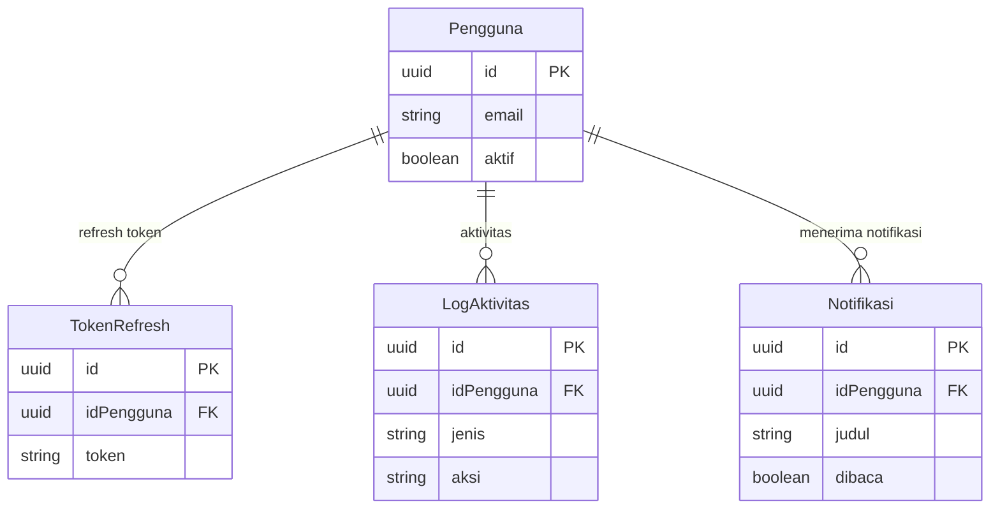

# ERD Part 6: Authentication & Notification System

Diagram ERD untuk modul Authentication & Notification - mencakup token, log aktivitas, OAuth state, dan notifikasi.

## Diagram ERD - Auth & Notification



## Deskripsi Tabel

### 1. TokenRefresh

**Refresh token storage untuk JWT authentication**

- **Primary Key**: `id` (UUID)
- **Foreign Key**: `idPengguna` → Pengguna (CASCADE DELETE)
- **Unique Constraints**: `token`
- **Features**:
  - Platform-specific tokens (web/mobile)
  - Token expiration tracking
  - Multiple active tokens per user
  - Auto-cleanup expired tokens

### 2. LogAktivitas

**Comprehensive activity logging & audit trail**

- **Primary Key**: `id` (UUID)
- **Foreign Key**: `idPengguna` → Pengguna (SET NULL, nullable)
- **Features**:
  - User activity tracking
  - Entity-agnostic logging (any table)
  - IP address & user agent tracking
  - Anonymous user support (idPengguna nullable)
  - Categorized by jenis & aksi

### 3. OAuthState

**OAuth flow state management**

- **Primary Key**: `id` (UUID)
- **Unique Constraints**: `state`
- **Features**:
  - CSRF protection for OAuth
  - Multi-provider support (Google, Facebook, Apple)
  - State expiration (5-15 minutes)
  - Redirect URL storage
  - Auto-cleanup expired states

### 4. Notifikasi

**In-app notification system**

- **Primary Key**: `id` (UUID)
- **Foreign Key**: `idPengguna` → Pengguna (CASCADE DELETE)
- **Features**:
  - Multi-type notifications (info, success, warning, error)
  - Read/unread tracking
  - Optional action URL
  - Real-time push support via WebSocket

## Enum Types

```prisma
enum Platform {
  web
  mobile

  @@map("platform")
}

enum TipeNotifikasi {
  info
  sukses
  peringatan
  error

  @@map("tipe_notifikasi")
}
```

## Relasi dengan Tabel Lain

### Auth & Notification Relations



## Indexes & Performance

### Recommended Indexes

```sql
-- TokenRefresh
CREATE INDEX idx_token_refresh_pengguna ON token_refresh(id_pengguna);
CREATE UNIQUE INDEX idx_token_refresh_token ON token_refresh(token);
CREATE INDEX idx_token_refresh_kadaluarsa ON token_refresh(kadaluarsa_pada);

-- LogAktivitas
CREATE INDEX idx_log_aktivitas_pengguna ON log_aktivitas(id_pengguna) WHERE id_pengguna IS NOT NULL;
CREATE INDEX idx_log_aktivitas_jenis ON log_aktivitas(jenis);
CREATE INDEX idx_log_aktivitas_entitas ON log_aktivitas(entitas, id_entitas) WHERE entitas IS NOT NULL;
CREATE INDEX idx_log_aktivitas_waktu ON log_aktivitas(dibuat_pada DESC);

-- OAuthState
CREATE UNIQUE INDEX idx_oauth_state_state ON oauth_state(state);
CREATE INDEX idx_oauth_state_provider ON oauth_state(provider);
CREATE INDEX idx_oauth_state_kadaluarsa ON oauth_state(kadaluarsa_pada);

-- Notifikasi
CREATE INDEX idx_notifikasi_pengguna ON notifikasi(id_pengguna);
CREATE INDEX idx_notifikasi_dibaca ON notifikasi(id_pengguna, dibaca);
CREATE INDEX idx_notifikasi_tipe ON notifikasi(tipe);
CREATE INDEX idx_notifikasi_waktu ON notifikasi(dibuat_pada DESC);
```

## Query Patterns

### 1. Manage Refresh Tokens

```typescript
// Create new refresh token
async function createRefreshToken(
  idPengguna: string,
  platform: "web" | "mobile"
) {
  const token = generateSecureToken(); // UUID or JWT
  const kadaluarsaPada = new Date();
  kadaluarsaPada.setDate(kadaluarsaPada.getDate() + 30); // 30 days

  return await prisma.tokenRefresh.create({
    data: {
      idPengguna,
      token,
      platform,
      kadaluarsaPada,
    },
  });
}

// Validate & rotate token
async function validateRefreshToken(token: string) {
  const tokenRecord = await prisma.tokenRefresh.findUnique({
    where: { token },
    include: { pengguna: true },
  });

  if (!tokenRecord) {
    throw new Error("Token tidak valid");
  }

  if (tokenRecord.kadaluarsaPada < new Date()) {
    await prisma.tokenRefresh.delete({ where: { token } });
    throw new Error("Token kadaluarsa");
  }

  return tokenRecord.pengguna;
}

// Cleanup expired tokens
async function cleanupExpiredTokens() {
  return await prisma.tokenRefresh.deleteMany({
    where: {
      kadaluarsaPada: {
        lt: new Date(),
      },
    },
  });
}
```

### 2. Activity Logging

```typescript
// Log user activity
async function logActivity(data: {
  idPengguna?: string;
  jenis: string;
  aksi: string;
  entitas?: string;
  idEntitas?: string;
  deskripsi?: string;
  ipAddress?: string;
  userAgent?: string;
}) {
  return await prisma.logAktivitas.create({
    data,
  });
}

// Get user activity history
async function getUserActivity(idPengguna: string, limit: number = 50) {
  return await prisma.logAktivitas.findMany({
    where: { idPengguna },
    orderBy: { dibuatPada: "desc" },
    take: limit,
  });
}

// Get entity history (e.g., naskah changes)
async function getEntityHistory(entitas: string, idEntitas: string) {
  return await prisma.logAktivitas.findMany({
    where: { entitas, idEntitas },
    orderBy: { dibuatPada: "asc" },
    include: {
      pengguna: {
        select: {
          email: true,
          profilPengguna: {
            select: {
              namaDepan: true,
              namaBelakang: true,
            },
          },
        },
      },
    },
  });
}
```

### 3. OAuth State Management

```typescript
// Create OAuth state
async function createOAuthState(
  provider: "google" | "facebook" | "apple",
  redirectUrl?: string
) {
  const state = crypto.randomBytes(32).toString("hex");
  const kadaluarsaPada = new Date();
  kadaluarsaPada.setMinutes(kadaluarsaPada.getMinutes() + 10); // 10 minutes

  return await prisma.oAuthState.create({
    data: {
      state,
      provider,
      redirectUrl,
      kadaluarsaPada,
    },
  });
}

// Validate OAuth state
async function validateOAuthState(state: string) {
  const stateRecord = await prisma.oAuthState.findUnique({
    where: { state },
  });

  if (!stateRecord) {
    throw new Error("Invalid OAuth state");
  }

  if (stateRecord.kadaluarsaPada < new Date()) {
    await prisma.oAuthState.delete({ where: { state } });
    throw new Error("OAuth state expired");
  }

  // Delete after use (one-time use)
  await prisma.oAuthState.delete({ where: { state } });

  return stateRecord;
}

// Cleanup expired states
async function cleanupExpiredOAuthStates() {
  return await prisma.oAuthState.deleteMany({
    where: {
      kadaluarsaPada: {
        lt: new Date(),
      },
    },
  });
}
```

### 4. Notification Management

```typescript
// Create notification
async function createNotification(data: {
  idPengguna: string;
  judul: string;
  pesan: string;
  tipe: "info" | "sukses" | "peringatan" | "error";
  url?: string;
}) {
  const notifikasi = await prisma.notifikasi.create({
    data: {
      ...data,
      dibaca: false,
    },
  });

  // Send real-time via WebSocket
  await sendWebSocketNotification(data.idPengguna, notifikasi);

  return notifikasi;
}

// Get unread notifications
async function getUnreadNotifications(idPengguna: string) {
  return await prisma.notifikasi.findMany({
    where: {
      idPengguna,
      dibaca: false,
    },
    orderBy: {
      dibuatPada: "desc",
    },
  });
}

// Mark as read
async function markNotificationAsRead(id: string) {
  return await prisma.notifikasi.update({
    where: { id },
    data: { dibaca: true },
  });
}

// Mark all as read
async function markAllAsRead(idPengguna: string) {
  return await prisma.notifikasi.updateMany({
    where: {
      idPengguna,
      dibaca: false,
    },
    data: {
      dibaca: true,
    },
  });
}

// Delete old notifications (cleanup)
async function deleteOldNotifications(days: number = 30) {
  const cutoffDate = new Date();
  cutoffDate.setDate(cutoffDate.getDate() - days);

  return await prisma.notifikasi.deleteMany({
    where: {
      dibuatPada: {
        lt: cutoffDate,
      },
      dibaca: true,
    },
  });
}
```

## Business Rules

### 1. Token Refresh

- **Expiration**: 30 days for web, 90 days for mobile
- **Rotation**: Generate new token on each refresh
- **Revocation**: Delete old token after rotation
- **Cleanup**: Auto-delete expired tokens (daily cron)
- **Multi-device**: Allow multiple active tokens per user

### 2. Activity Logging

- **Login/Logout**: Always logged
- **CRUD Operations**: Log create, update, delete
- **Sensitive Actions**: Flag and alert (password change, role change)
- **Anonymous**: Support logging without user (public API)
- **Retention**: Keep logs for 90 days, then archive
- **Privacy**: Hash IP addresses after 7 days

### 3. OAuth State

- **Expiration**: 10 minutes
- **One-time Use**: Delete after validation
- **CSRF Protection**: Random 32-byte string
- **Cleanup**: Auto-delete expired states (hourly cron)

### 4. Notifications

- **Types**:
  - `info`: General information
  - `sukses`: Success messages (order confirmed, payment success)
  - `peringatan`: Warnings (review deadline, payment reminder)
  - `error`: Error messages (payment failed, order rejected)
- **Real-time**: Push via WebSocket when user online
- **Persistence**: Store all notifications in DB
- **Retention**: Keep for 30 days, then delete read notifications
- **Unread Badge**: Count unread for UI display

## Notification Triggers

### Automatic Notifications

```typescript
// Naskah status changes
Naskah.status = 'dalam_review' → "Naskah Anda sedang direview"
Naskah.status = 'disetujui' → "Naskah Anda disetujui!"
Naskah.status = 'ditolak' → "Naskah Anda ditolak"

// Review assignments
ReviewNaskah.status = 'ditugaskan' → "Anda ditugaskan untuk review naskah"
ReviewNaskah.status = 'selesai' → "Review selesai"

// Order updates
PesananCetak.status = 'diterima' → "Pesanan diterima"
PesananCetak.status = 'dalam_produksi' → "Pesanan dalam produksi"
PesananCetak.status = 'dikirim' → "Pesanan dikirim"

// Payment updates
Pembayaran.status = 'berhasil' → "Pembayaran berhasil"
Pembayaran.status = 'gagal' → "Pembayaran gagal"
Pembayaran.status = 'dikembalikan' → "Dana dikembalikan"

// Shipping updates
Pengiriman.status = 'terkirim' → "Paket telah sampai"
```

## Security Best Practices

### 1. Token Security

- Use cryptographically secure random generators
- Never expose tokens in logs
- Use HTTPS only
- Implement rate limiting on refresh endpoint
- Monitor suspicious token usage patterns

### 2. Activity Logging

- Never log sensitive data (passwords, tokens, payment details)
- Hash PII after retention period
- Implement log rotation
- Monitor for unusual patterns (brute force, data exfiltration)

### 3. OAuth Security

- Always validate state parameter
- Check state expiration
- Use HTTPS for redirect URLs
- Implement PKCE for mobile apps
- Rate limit OAuth endpoints

### 4. Notification Security

- Sanitize notification content (XSS prevention)
- Validate URLs before creating notifications
- Don't include sensitive data in notification text
- Implement rate limiting (prevent spam)

## Scheduled Jobs (Cron)

```typescript
// Daily cleanup - expired tokens
cron.schedule("0 2 * * *", async () => {
  await cleanupExpiredTokens();
});

// Hourly cleanup - expired OAuth states
cron.schedule("0 * * * *", async () => {
  await cleanupExpiredOAuthStates();
});

// Weekly cleanup - old notifications
cron.schedule("0 3 * * 0", async () => {
  await deleteOldNotifications(30);
});

// Monthly cleanup - old activity logs
cron.schedule("0 4 1 * *", async () => {
  await archiveOldActivityLogs(90);
});
```

## Navigasi ERD

- **← [ERD Part 5: Payment System](erd-5-payment-system.md)** - Pembayaran
- **← [ERD Utama](database-erd.md)** - Kembali ke diagram lengkap
- **→ [ERD Part 7: Analytics & Files](erd-7-analytics-files.md)** - Statistik, Rating, File Storage

---

**Generated**: December 23, 2025  
**Database**: PostgreSQL 14+  
**ORM**: Prisma  
**Project**: Publishify - Sistem Penerbitan Naskah
