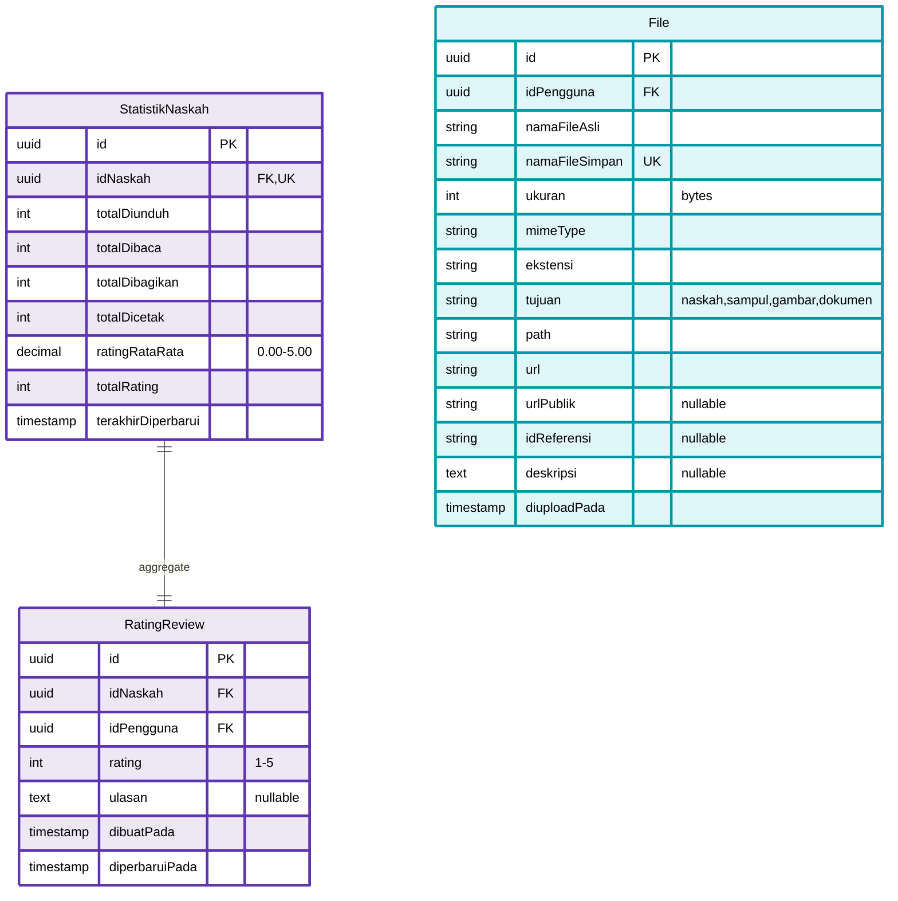
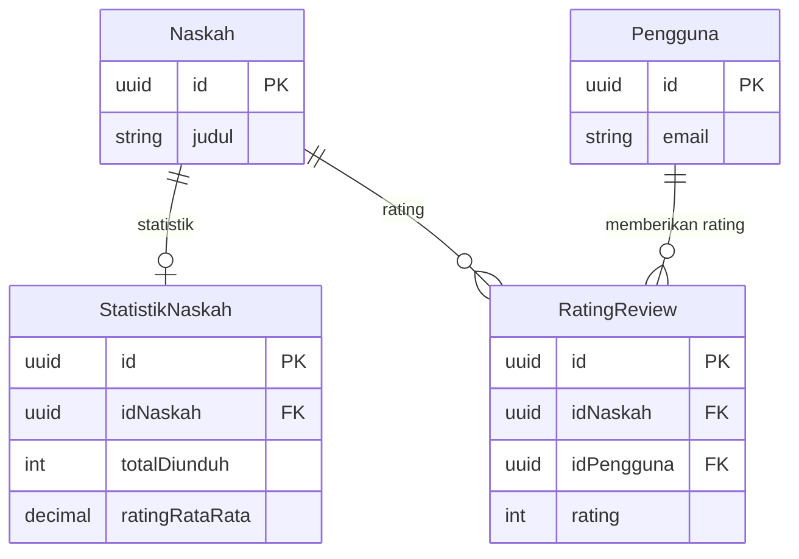
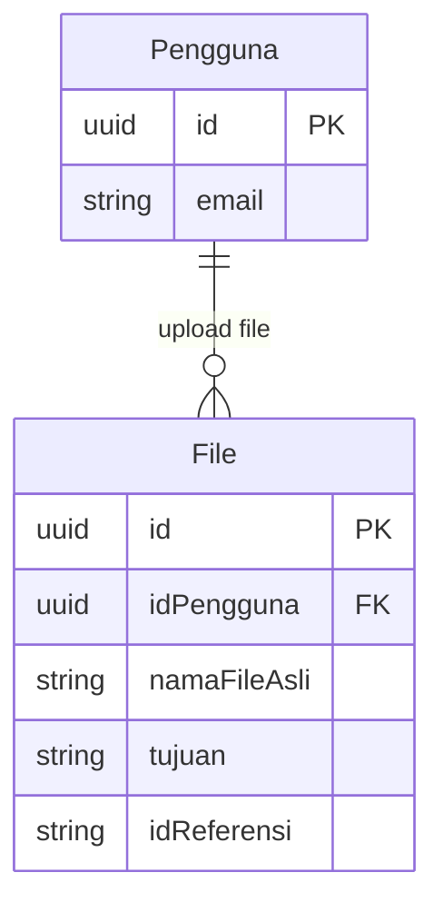

# ERD Part 7: Analytics & File Storage System

Diagram ERD untuk modul Analytics & File Storage - mencakup statistik naskah, rating/review, dan manajemen file.

## Diagram ERD - Analytics & Files



## Deskripsi Tabel

### 1. StatistikNaskah

**Aggregated statistics per manuscript**

- **Primary Key**: `id` (UUID)
- **Foreign Key**: `idNaskah` → Naskah (CASCADE DELETE)
- **Unique Constraint**: `idNaskah` (One-to-One)
- **Features**:
  - Download counter
  - Read counter (page views)
  - Share counter (social media)
  - Print counter (total printed copies)
  - Average rating (calculated from RatingReview)
  - Total rating count
  - Last updated timestamp

### 2. RatingReview

**User ratings and reviews for manuscripts**

- **Primary Key**: `id` (UUID)
- **Foreign Keys**:
  - `idNaskah` → Naskah (CASCADE DELETE)
  - `idPengguna` → Pengguna (CASCADE DELETE)
- **Unique Constraint**: `idNaskah` + `idPengguna`
- **Features**:
  - 1-5 star rating system
  - Optional text review/ulasan
  - Edit capability (diperbaruiPada)
  - Creation timestamp

### 3. File

**Comprehensive file management system**

- **Primary Key**: `id` (UUID)
- **Foreign Key**: `idPengguna` → Pengguna (SET NULL)
- **Unique Constraints**: `namaFileSimpan`
- **Features**:
  - Original filename preservation
  - Unique storage filename
  - File size tracking (bytes)
  - MIME type detection
  - File extension
  - Purpose categorization (naskah, sampul, gambar, dokumen)
  - Storage path & URLs
  - Optional public URL (CDN)
  - Reference ID linking (polymorphic)
  - Upload timestamp

## Enum Types

```prisma
enum TujuanFile {
  naskah
  sampul
  gambar
  dokumen
  bukti_pembayaran
  profil

  @@map("tujuan_file")
}
```

## Relasi dengan Tabel Lain

### Analytics Relations



### File Relations



## Indexes & Performance

### Recommended Indexes

```sql
-- StatistikNaskah
CREATE UNIQUE INDEX idx_statistik_naskah_id ON statistik_naskah(id_naskah);
CREATE INDEX idx_statistik_rating ON statistik_naskah(rating_rata_rata DESC);
CREATE INDEX idx_statistik_total_dibaca ON statistik_naskah(total_dibaca DESC);
CREATE INDEX idx_statistik_total_dicetak ON statistik_naskah(total_dicetak DESC);

-- RatingReview
CREATE INDEX idx_rating_naskah ON rating_review(id_naskah);
CREATE INDEX idx_rating_pengguna ON rating_review(id_pengguna);
CREATE UNIQUE INDEX idx_rating_naskah_pengguna ON rating_review(id_naskah, id_pengguna);
CREATE INDEX idx_rating_score ON rating_review(rating);
CREATE INDEX idx_rating_waktu ON rating_review(dibuat_pada DESC);

-- File
CREATE INDEX idx_file_pengguna ON file(id_pengguna);
CREATE UNIQUE INDEX idx_file_nama_simpan ON file(nama_file_simpan);
CREATE INDEX idx_file_tujuan ON file(tujuan);
CREATE INDEX idx_file_referensi ON file(id_referensi) WHERE id_referensi IS NOT NULL;
CREATE INDEX idx_file_mime_type ON file(mime_type);
CREATE INDEX idx_file_upload ON file(diupload_pada DESC);
```

## Query Patterns

### 1. Update Statistics (Increment Counters)

```typescript
// Increment download counter
async function incrementDownloadCount(idNaskah: string) {
  return await prisma.statistikNaskah.upsert({
    where: { idNaskah },
    create: {
      idNaskah,
      totalDiunduh: 1,
      totalDibaca: 0,
      totalDibagikan: 0,
      totalDicetak: 0,
      ratingRataRata: 0,
      totalRating: 0,
    },
    update: {
      totalDiunduh: {
        increment: 1,
      },
      terakhirDiperbarui: new Date(),
    },
  });
}

// Increment read counter
async function incrementReadCount(idNaskah: string) {
  return await prisma.statistikNaskah.upsert({
    where: { idNaskah },
    create: {
      idNaskah,
      totalDiunduh: 0,
      totalDibaca: 1,
      totalDibagikan: 0,
      totalDicetak: 0,
      ratingRataRata: 0,
      totalRating: 0,
    },
    update: {
      totalDibaca: {
        increment: 1,
      },
      terakhirDiperbarui: new Date(),
    },
  });
}
```

### 2. Rating & Review Management

```typescript
// Add or update rating
async function addOrUpdateRating(data: {
  idNaskah: string;
  idPengguna: string;
  rating: number;
  ulasan?: string;
}) {
  // Upsert rating
  const ratingReview = await prisma.ratingReview.upsert({
    where: {
      idNaskah_idPengguna: {
        idNaskah: data.idNaskah,
        idPengguna: data.idPengguna,
      },
    },
    create: data,
    update: {
      rating: data.rating,
      ulasan: data.ulasan,
      diperbaruiPada: new Date(),
    },
  });

  // Recalculate average rating
  const stats = await prisma.ratingReview.aggregate({
    where: { idNaskah: data.idNaskah },
    _avg: { rating: true },
    _count: { id: true },
  });

  // Update statistik
  await prisma.statistikNaskah.upsert({
    where: { idNaskah: data.idNaskah },
    create: {
      idNaskah: data.idNaskah,
      totalDiunduh: 0,
      totalDibaca: 0,
      totalDibagikan: 0,
      totalDicetak: 0,
      ratingRataRata: stats._avg.rating || 0,
      totalRating: stats._count.id,
    },
    update: {
      ratingRataRata: stats._avg.rating || 0,
      totalRating: stats._count.id,
      terakhirDiperbarui: new Date(),
    },
  });

  return ratingReview;
}

// Get top rated manuscripts
async function getTopRatedManuscripts(limit: number = 10) {
  return await prisma.naskah.findMany({
    where: {
      status: "diterbitkan",
      publik: true,
    },
    include: {
      statistik: true,
      penulis: {
        select: {
          email: true,
          profilPengguna: true,
          profilPenulis: true,
        },
      },
    },
    orderBy: {
      statistik: {
        ratingRataRata: "desc",
      },
    },
    take: limit,
  });
}

// Get reviews with pagination
async function getManuscriptReviews(
  idNaskah: string,
  page: number = 1,
  limit: number = 10
) {
  const skip = (page - 1) * limit;

  const [reviews, total] = await Promise.all([
    prisma.ratingReview.findMany({
      where: { idNaskah },
      include: {
        pengguna: {
          select: {
            email: true,
            profilPengguna: {
              select: {
                namaDepan: true,
                namaBelakang: true,
                namaTampilan: true,
                urlAvatar: true,
              },
            },
          },
        },
      },
      orderBy: {
        dibuatPada: "desc",
      },
      skip,
      take: limit,
    }),
    prisma.ratingReview.count({
      where: { idNaskah },
    }),
  ]);

  return {
    data: reviews,
    metadata: {
      total,
      page,
      limit,
      totalPages: Math.ceil(total / limit),
    },
  };
}
```

### 3. File Management

```typescript
// Upload file
async function uploadFile(data: {
  idPengguna: string;
  file: Express.Multer.File;
  tujuan: string;
  idReferensi?: string;
  deskripsi?: string;
}) {
  const { file, idPengguna, tujuan, idReferensi, deskripsi } = data;

  // Generate unique filename
  const timestamp = Date.now();
  const randomString = crypto.randomBytes(8).toString("hex");
  const namaFileSimpan = `${timestamp}-${randomString}-${file.originalname}`;

  // Upload to storage (S3, Supabase Storage, etc.)
  const uploadResult = await storageService.upload({
    filename: namaFileSimpan,
    buffer: file.buffer,
    mimetype: file.mimetype,
  });

  // Save to database
  return await prisma.file.create({
    data: {
      idPengguna,
      namaFileAsli: file.originalname,
      namaFileSimpan,
      ukuran: file.size,
      mimeType: file.mimetype,
      ekstensi: path.extname(file.originalname),
      tujuan,
      path: uploadResult.path,
      url: uploadResult.url,
      urlPublik: uploadResult.publicUrl,
      idReferensi,
      deskripsi,
    },
  });
}

// Get files by reference
async function getFilesByReference(tujuan: string, idReferensi: string) {
  return await prisma.file.findMany({
    where: {
      tujuan,
      idReferensi,
    },
    orderBy: {
      diuploadPada: "desc",
    },
  });
}

// Delete file
async function deleteFile(id: string) {
  const file = await prisma.file.findUnique({
    where: { id },
  });

  if (!file) {
    throw new Error("File tidak ditemukan");
  }

  // Delete from storage
  await storageService.delete(file.namaFileSimpan);

  // Delete from database
  await prisma.file.delete({
    where: { id },
  });

  return { success: true };
}

// Get user files with pagination
async function getUserFiles(
  idPengguna: string,
  options: {
    tujuan?: string;
    page?: number;
    limit?: number;
  }
) {
  const { tujuan, page = 1, limit = 20 } = options;
  const skip = (page - 1) * limit;

  const where = {
    idPengguna,
    ...(tujuan && { tujuan }),
  };

  const [files, total] = await Promise.all([
    prisma.file.findMany({
      where,
      orderBy: {
        diuploadPada: "desc",
      },
      skip,
      take: limit,
    }),
    prisma.file.count({ where }),
  ]);

  return {
    data: files,
    metadata: {
      total,
      page,
      limit,
      totalPages: Math.ceil(total / limit),
    },
  };
}
```

## Business Rules

### 1. Statistics

- **Auto-Create**: Create StatistikNaskah on first increment
- **Real-time Update**: Increment counters immediately
- **Rating Calculation**: Recalculate on every rating change
- **Cache**: Consider caching for frequently accessed stats
- **Leaderboard**: Top manuscripts by rating, downloads, reads

### 2. Rating & Review

- **One Rating per User**: Unique constraint ensures one rating per user per manuscript
- **Edit Allowed**: Users can update their rating/review
- **Rating Range**: 1-5 stars
- **Review Optional**: Text review is optional
- **Moderation**: Consider flagging system for inappropriate reviews
- **Display**: Show most helpful reviews first (implement helpful votes later)

### 3. File Storage

- **Unique Filenames**: Prevent collisions with timestamp + random string
- **Original Preservation**: Keep original filename for download
- **MIME Type Validation**: Only allow specific types per tujuan
- **Size Limits**: Enforce max file size (e.g., 50MB for naskah, 5MB for sampul)
- **Cleanup**: Delete orphaned files (no idReferensi after 7 days)
- **CDN**: Generate public URLs for public files
- **Security**: Signed URLs for private files

## File Purpose Rules

| Tujuan           | Allowed Types           | Max Size | Access  |
| ---------------- | ----------------------- | -------- | ------- |
| naskah           | .pdf, .docx, .txt       | 50 MB    | Private |
| sampul           | .jpg, .png, .webp       | 5 MB     | Public  |
| gambar           | .jpg, .png, .webp, .gif | 5 MB     | Public  |
| dokumen          | .pdf, .docx, .xlsx      | 10 MB    | Private |
| bukti_pembayaran | .jpg, .png, .pdf        | 5 MB     | Private |
| profil           | .jpg, .png, .webp       | 2 MB     | Public  |

## Analytics Dashboard Queries

### Popular Manuscripts

```typescript
// Most downloaded
const mostDownloaded = await prisma.naskah.findMany({
  where: { status: "diterbitkan", publik: true },
  include: { statistik: true },
  orderBy: { statistik: { totalDiunduh: "desc" } },
  take: 10,
});

// Most read
const mostRead = await prisma.naskah.findMany({
  where: { status: "diterbitkan", publik: true },
  include: { statistik: true },
  orderBy: { statistik: { totalDibaca: "desc" } },
  take: 10,
});

// Trending (recent + popular)
const trending = await prisma.naskah.findMany({
  where: {
    status: "diterbitkan",
    publik: true,
    diterbitkanPada: {
      gte: new Date(Date.now() - 30 * 24 * 60 * 60 * 1000), // Last 30 days
    },
  },
  include: { statistik: true },
  orderBy: [
    { statistik: { totalDibaca: "desc" } },
    { statistik: { totalDiunduh: "desc" } },
  ],
  take: 10,
});
```

## Storage Integration

### Supabase Storage Example

```typescript
import { createClient } from "@supabase/supabase-js";

const supabase = createClient(
  process.env.SUPABASE_URL,
  process.env.SUPABASE_KEY
);

async function uploadToSupabase(file: {
  filename: string;
  buffer: Buffer;
  mimetype: string;
  bucket: string;
}) {
  const { data, error } = await supabase.storage
    .from(file.bucket)
    .upload(file.filename, file.buffer, {
      contentType: file.mimetype,
      cacheControl: "3600",
      upsert: false,
    });

  if (error) throw error;

  const { data: publicData } = supabase.storage
    .from(file.bucket)
    .getPublicUrl(file.filename);

  return {
    path: data.path,
    url: publicData.publicUrl,
    publicUrl: publicData.publicUrl,
  };
}

async function deleteFromSupabase(bucket: string, filename: string) {
  const { error } = await supabase.storage.from(bucket).remove([filename]);

  if (error) throw error;
}
```

## Navigasi ERD

- **← [ERD Part 6: Auth & Notification](erd-6-auth-notification.md)** - Token, Log, Notifikasi
- **← [ERD Utama](database-erd.md)** - Kembali ke diagram lengkap
- **🏠 [Semua Bagian ERD](#daftar-lengkap-erd)** - Index semua diagram

---

## Daftar Lengkap ERD

1. **[ERD Part 1: User Management](erd-1-user-management.md)** - Pengguna, Profil, Peran
2. **[ERD Part 2: Content Management](erd-2-content-management.md)** - Naskah, Kategori, Genre, Tag
3. **[ERD Part 3: Review System](erd-3-review-system.md)** - Review, Feedback
4. **[ERD Part 4: Printing & Shipping](erd-4-printing-shipping.md)** - Pesanan, Produksi, Pengiriman
5. **[ERD Part 5: Payment System](erd-5-payment-system.md)** - Pembayaran, Transaksi
6. **[ERD Part 6: Auth & Notification](erd-6-auth-notification.md)** - Token, Log, OAuth, Notifikasi
7. **[ERD Part 7: Analytics & Files](erd-7-analytics-files.md)** - Statistik, Rating, File Storage

---

**Generated**: December 23, 2025  
**Database**: PostgreSQL 14+  
**ORM**: Prisma  
**Project**: Publishify - Sistem Penerbitan Naskah
